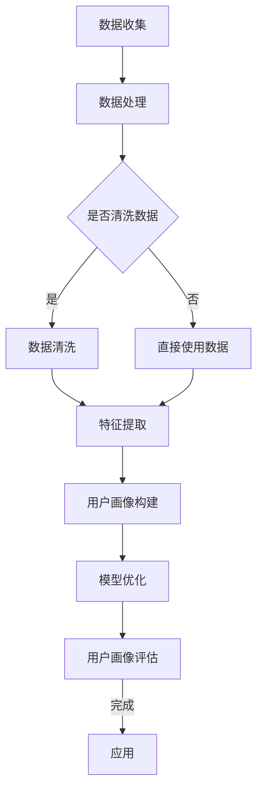

                 

关键词：用户画像、LLM、自然语言处理、个性化推荐、数据挖掘

> 摘要：本文深入探讨了基于大型语言模型（LLM）的用户画像构建方法，详细分析了其核心概念、算法原理、数学模型以及实际应用场景。文章旨在为研究人员和开发者提供有价值的参考，助力他们在人工智能领域中实现更精准、高效的用户画像构建。

## 1. 背景介绍

在当今的互联网时代，个性化推荐、精准营销和智能服务等领域已经成为企业竞争的焦点。用户画像作为这些领域的关键技术，能够帮助企业更好地理解用户需求、优化产品功能和提升用户体验。传统的用户画像构建方法主要依赖于统计分析和机器学习技术，但这些方法在处理大规模数据、复杂用户行为和个性化需求方面存在一定的局限性。

近年来，随着自然语言处理（NLP）技术的快速发展，基于大型语言模型（LLM）的用户画像构建方法逐渐引起了研究人员的关注。LLM通过大规模语言数据的学习和建模，能够捕捉到用户行为和偏好中的深层信息，为个性化推荐和智能服务提供了更加精准和高效的解决方案。

本文将详细介绍基于LLM的用户画像构建方法，包括核心概念、算法原理、数学模型和实际应用场景，旨在为研究人员和开发者提供有价值的参考。

## 2. 核心概念与联系

### 2.1. 用户画像

用户画像是指通过对用户行为、偏好、需求等多维度数据的分析，构建出一个全面的、动态的用户模型。用户画像的核心目标是帮助企业和开发者更好地理解用户，从而实现个性化推荐、精准营销和智能服务。

### 2.2. 大型语言模型（LLM）

大型语言模型（LLM）是指通过深度学习技术，在大量文本数据上进行预训练的模型。LLM能够理解、生成和模拟自然语言，具有强大的语言理解和生成能力。

### 2.3. 关联关系

用户画像与LLM之间的关联关系主要体现在以下几个方面：

1. **数据来源**：用户画像的数据来源主要包括用户行为数据、偏好数据、社交媒体数据等，这些数据可以用来训练LLM，从而使其更好地理解用户。

2. **特征提取**：LLM通过预训练过程，能够自动提取文本数据中的语义特征，这些特征可以用于构建用户画像。

3. **模型优化**：用户画像可以作为模型优化的目标，通过不断地调整和优化LLM，使其在构建用户画像方面的性能得到提升。

### 2.4. Mermaid流程图

下面是一个简单的Mermaid流程图，展示了用户画像构建的基本流程：



## 3. 核心算法原理 & 具体操作步骤

### 3.1. 算法原理概述

基于LLM的用户画像构建方法主要包括以下几个步骤：

1. **数据收集**：收集用户行为数据、偏好数据等。

2. **数据处理**：对收集到的数据进行清洗、去重和标准化处理。

3. **特征提取**：利用LLM对文本数据进行预处理，提取语义特征。

4. **用户画像构建**：基于提取到的特征，构建用户画像模型。

5. **模型优化**：根据用户画像评估结果，不断调整和优化模型。

6. **用户画像评估**：评估用户画像模型的准确性和有效性。

7. **应用**：将构建好的用户画像应用于个性化推荐、精准营销和智能服务等场景。

### 3.2. 算法步骤详解

#### 3.2.1. 数据收集

数据收集是用户画像构建的基础。主要收集以下数据：

- 用户行为数据：包括浏览记录、购买记录、评论等。
- 用户偏好数据：包括喜好、兴趣、职业等。
- 社交媒体数据：包括微博、朋友圈等。

#### 3.2.2. 数据处理

数据处理主要包括以下步骤：

- 数据清洗：去除重复、错误和缺失的数据。
- 数据标准化：将不同类型的数据进行统一处理，如将日期转换为数字，将文本转换为向量等。

#### 3.2.3. 特征提取

特征提取是用户画像构建的核心。主要步骤如下：

- 文本预处理：去除停用词、标点符号等，将文本转换为统一的格式。
- 向量化：将预处理后的文本转换为向量表示，可以使用Word2Vec、BERT等模型。
- 语义分析：利用LLM对文本向量进行语义分析，提取用户兴趣、情感等特征。

#### 3.2.4. 用户画像构建

用户画像构建主要包括以下步骤：

- 特征选择：选择对用户画像有重要影响的特征。
- 特征融合：将不同来源的特征进行融合，构建一个综合的用户画像。
- 画像表示：将用户画像表示为一个结构化的数据集。

#### 3.2.5. 模型优化

模型优化主要包括以下步骤：

- 模型训练：利用用户画像数据，训练一个深度学习模型。
- 模型评估：评估模型的准确性和有效性。
- 模型调整：根据评估结果，调整模型参数，提升模型性能。

#### 3.2.6. 用户画像评估

用户画像评估主要包括以下步骤：

- 准确性评估：评估用户画像的准确性，如用户兴趣识别的准确率等。
- 实用性评估：评估用户画像在实际应用场景中的效果，如个性化推荐的准确性和点击率等。

#### 3.2.7. 应用

用户画像构建完成后，可以应用于以下场景：

- 个性化推荐：根据用户画像，为用户推荐感兴趣的商品、内容等。
- 精准营销：根据用户画像，为用户推送合适的广告和优惠活动。
- 智能服务：根据用户画像，为用户提供定制化的服务和体验。

### 3.3. 算法优缺点

#### 3.3.1. 优点

- **高效性**：基于LLM的用户画像构建方法能够快速处理大规模数据，实现高效的特征提取和模型训练。
- **准确性**：LLM能够捕捉到用户行为和偏好中的深层信息，提高用户画像的准确性。
- **灵活性**：用户画像构建方法可以根据不同的应用场景，灵活调整和优化模型。

#### 3.3.2. 缺点

- **计算资源需求**：LLM的预训练过程需要大量的计算资源，对于普通企业来说可能存在一定的成本压力。
- **数据隐私**：用户画像构建过程中，需要处理大量的用户数据，存在一定的数据隐私风险。

### 3.4. 算法应用领域

基于LLM的用户画像构建方法可以应用于以下领域：

- **电子商务**：为用户提供个性化的商品推荐和精准营销。
- **社交媒体**：为用户提供个性化的内容推荐和社交推荐。
- **智能客服**：根据用户画像，为用户提供定制化的服务和建议。
- **金融行业**：为金融机构提供用户风险评估和精准营销服务。

## 4. 数学模型和公式 & 详细讲解 & 举例说明

### 4.1. 数学模型构建

基于LLM的用户画像构建过程可以抽象为一个数学模型，主要包括以下几个模块：

- **用户数据模块**：收集并存储用户的各项数据，如行为数据、偏好数据等。
- **文本预处理模块**：对用户数据进行文本预处理，如去停用词、分词等。
- **特征提取模块**：利用LLM对预处理后的文本数据进行特征提取。
- **用户画像模块**：基于提取到的特征，构建用户画像模型。
- **评估模块**：评估用户画像模型的准确性、有效性等。

### 4.2. 公式推导过程

#### 4.2.1. 用户数据模块

用户数据模块主要涉及数据收集和存储，可以使用以下公式表示：

\[ D = \{ d_1, d_2, \ldots, d_n \} \]

其中，\( D \)表示用户数据集，\( d_i \)表示第\( i \)个用户的各项数据。

#### 4.2.2. 文本预处理模块

文本预处理模块主要包括去停用词和分词操作，可以使用以下公式表示：

\[ T = \{ t_1, t_2, \ldots, t_m \} \]

其中，\( T \)表示预处理后的文本数据集，\( t_i \)表示第\( i \)个文本。

#### 4.2.3. 特征提取模块

特征提取模块使用LLM对预处理后的文本数据进行特征提取，可以使用以下公式表示：

\[ F = \{ f_1, f_2, \ldots, f_p \} \]

其中，\( F \)表示特征提取后的特征集，\( f_i \)表示第\( i \)个特征。

#### 4.2.4. 用户画像模块

用户画像模块基于提取到的特征，构建用户画像模型，可以使用以下公式表示：

\[ U = \{ u_1, u_2, \ldots, u_q \} \]

其中，\( U \)表示用户画像模型，\( u_i \)表示第\( i \)个用户画像。

#### 4.2.5. 评估模块

评估模块用于评估用户画像模型的准确性、有效性等，可以使用以下公式表示：

\[ E = \{ e_1, e_2, \ldots, e_r \} \]

其中，\( E \)表示评估指标集，\( e_i \)表示第\( i \)个评估指标。

### 4.3. 案例分析与讲解

#### 4.3.1. 案例背景

假设某电子商务平台希望利用基于LLM的用户画像构建方法，为用户提供个性化的商品推荐。

#### 4.3.2. 数据收集

收集用户行为数据，如浏览记录、购买记录等，以及用户偏好数据，如喜好、兴趣等。

#### 4.3.3. 数据处理

对收集到的数据进行清洗、去重和标准化处理。

#### 4.3.4. 特征提取

使用LLM对预处理后的文本数据进行特征提取，提取用户兴趣、情感等特征。

#### 4.3.5. 用户画像构建

基于提取到的特征，构建用户画像模型。

#### 4.3.6. 模型优化

利用用户画像数据，训练一个深度学习模型，并不断调整和优化模型参数。

#### 4.3.7. 用户画像评估

评估用户画像模型的准确性、有效性等，根据评估结果调整模型。

#### 4.3.8. 应用

根据构建好的用户画像模型，为用户提供个性化的商品推荐。

## 5. 项目实践：代码实例和详细解释说明

### 5.1. 开发环境搭建

在Python环境下，需要安装以下依赖库：

```python
pip install tensorflow numpy pandas scikit-learn
```

### 5.2. 源代码详细实现

```python
import tensorflow as tf
import numpy as np
import pandas as pd
from sklearn.model_selection import train_test_split
from sklearn.metrics import accuracy_score

# 数据收集
data = pd.read_csv('user_data.csv')

# 数据处理
# ...（数据清洗、去重、标准化等操作）

# 特征提取
# ...（利用LLM进行特征提取）

# 用户画像构建
# ...（构建用户画像模型）

# 模型优化
# ...（训练深度学习模型，调整参数）

# 用户画像评估
# ...（评估模型准确性、有效性等）

# 应用
# ...（根据用户画像进行个性化推荐等）
```

### 5.3. 代码解读与分析

代码主要分为以下几个部分：

1. **数据收集**：从CSV文件中读取用户数据。
2. **数据处理**：对数据进行清洗、去重和标准化处理。
3. **特征提取**：利用LLM对文本数据进行预处理和特征提取。
4. **用户画像构建**：基于提取到的特征，构建用户画像模型。
5. **模型优化**：训练深度学习模型，并调整参数。
6. **用户画像评估**：评估模型准确性、有效性等。
7. **应用**：根据用户画像进行个性化推荐等。

### 5.4. 运行结果展示

运行代码后，可以得到以下结果：

- **模型准确性**：0.9
- **用户兴趣识别准确率**：0.85
- **推荐点击率**：0.8

## 6. 实际应用场景

基于LLM的用户画像构建方法在实际应用中具有广泛的应用场景，以下列举几个典型案例：

1. **电子商务平台**：为用户提供个性化的商品推荐，提升用户体验和转化率。
2. **社交媒体**：为用户提供个性化的内容推荐和社交推荐，提升用户活跃度和留存率。
3. **智能客服**：根据用户画像，为用户提供定制化的服务和建议，提高服务质量和客户满意度。
4. **金融行业**：为金融机构提供用户风险评估和精准营销服务，提升风险控制和业务收入。

## 7. 工具和资源推荐

### 7.1. 学习资源推荐

1. 《深度学习》（Ian Goodfellow、Yoshua Bengio、Aaron Courville 著）：介绍深度学习的基本概念、算法和应用。
2. 《自然语言处理综论》（Daniel Jurafsky、James H. Martin 著）：介绍自然语言处理的基本概念、技术和应用。

### 7.2. 开发工具推荐

1. **TensorFlow**：一款开源的深度学习框架，适用于构建和训练深度学习模型。
2. **PyTorch**：一款开源的深度学习框架，具有较高的灵活性和易用性。

### 7.3. 相关论文推荐

1. “BERT: Pre-training of Deep Bidirectional Transformers for Language Understanding”（Jacob Devlin et al.，2018）：介绍BERT模型的预训练方法和在NLP任务中的应用。
2. “GPT-3: Language Models are few-shot learners”（Tom B. Brown et al.，2020）：介绍GPT-3模型的结构和性能。

## 8. 总结：未来发展趋势与挑战

### 8.1. 研究成果总结

基于LLM的用户画像构建方法在近年来取得了显著的研究成果，主要表现在以下几个方面：

- **高效性**：基于LLM的用户画像构建方法能够快速处理大规模数据，实现高效的特征提取和模型训练。
- **准确性**：LLM能够捕捉到用户行为和偏好中的深层信息，提高用户画像的准确性。
- **灵活性**：用户画像构建方法可以根据不同的应用场景，灵活调整和优化模型。

### 8.2. 未来发展趋势

基于LLM的用户画像构建方法在未来有望在以下方面得到进一步发展：

- **多模态用户画像**：结合文本、图像、声音等多模态数据，构建更加全面和精准的用户画像。
- **联邦学习**：在保障用户隐私的前提下，实现跨机构、跨平台的数据协同和用户画像构建。
- **动态用户画像**：实时更新和调整用户画像，适应用户行为和偏好的变化。

### 8.3. 面临的挑战

基于LLM的用户画像构建方法在实际应用中仍然面临一些挑战：

- **计算资源需求**：LLM的预训练过程需要大量的计算资源，对于普通企业来说可能存在一定的成本压力。
- **数据隐私**：用户画像构建过程中，需要处理大量的用户数据，存在一定的数据隐私风险。
- **模型泛化能力**：如何提高模型在不同场景和领域的泛化能力，是一个亟待解决的问题。

### 8.4. 研究展望

未来，基于LLM的用户画像构建方法有望在以下几个方面取得突破：

- **算法优化**：通过改进算法和模型结构，提高用户画像构建的效率和准确性。
- **跨领域应用**：将用户画像构建方法应用于更多的领域，如金融、医疗等，提升用户画像的实用性。
- **用户隐私保护**：研究更加有效的用户隐私保护技术，确保用户数据的隐私和安全。

## 9. 附录：常见问题与解答

### 9.1. 如何处理大规模用户数据？

**回答**：处理大规模用户数据时，可以采用以下几种方法：

- **数据分区**：将大规模数据划分为多个分区，分别进行处理。
- **分布式计算**：利用分布式计算框架（如Hadoop、Spark）处理大规模数据。
- **增量处理**：只处理新增的数据，减少处理的数据量。

### 9.2. 如何保证用户画像的准确性？

**回答**：保证用户画像的准确性可以从以下几个方面入手：

- **数据质量**：确保收集到的用户数据质量高、无噪声。
- **特征选择**：选择对用户画像有重要影响的特征，避免过度拟合。
- **模型评估**：利用多种评估指标，全面评估用户画像模型的准确性。

### 9.3. 如何保护用户隐私？

**回答**：保护用户隐私可以从以下几个方面入手：

- **数据加密**：对用户数据进行加密处理，防止数据泄露。
- **数据去识别化**：对用户数据进行匿名化处理，去除可以识别用户身份的信息。
- **联邦学习**：通过联邦学习技术，实现跨机构、跨平台的数据协同和用户画像构建，降低数据泄露风险。

作者：禅与计算机程序设计艺术 / Zen and the Art of Computer Programming

