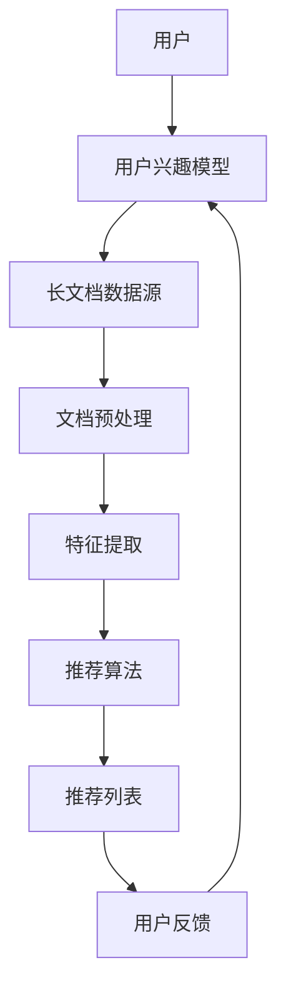

                 

关键词：长文档推荐，语言模型，生成式AI，机器学习，文档分类，信息检索，知识图谱

>摘要：随着互联网和数字出版的高速发展，长文档的推荐成为了一项重要的研究课题。本文探讨了基于大型语言模型（LLM）的长文档推荐方法，旨在通过深度理解文档内容，实现更为精准和个性化的推荐系统。本文首先介绍了长文档推荐系统的背景和重要性，然后详细阐述了基于LLM的推荐方法及其核心技术，包括模型选择、数据处理、推荐算法设计和系统优化等方面。最后，通过实际案例展示了该方法的可行性和优势。

## 1. 背景介绍

随着信息爆炸时代的到来，人们获取和处理信息的压力日益增大。传统的信息检索和推荐系统在应对长文档推荐时面临诸多挑战。长文档通常具有文本量庞大、结构复杂、内容多样等特点，这使得基于关键词匹配和简单的统计方法难以准确捕捉用户需求，从而导致推荐结果不准确、用户满意度低。

近年来，生成式人工智能（Generative AI）特别是大型语言模型（Large Language Models，LLM）的快速发展，为长文档推荐带来了新的机遇。LLM通过对海量数据的训练，能够理解并生成自然语言的语义内容，从而在处理长文档时具有显著的优势。基于LLM的长文档推荐方法不仅能够深度解析文档内容，还能根据用户的兴趣和行为习惯提供个性化的推荐，显著提升用户体验。

本文的研究目标是通过引入LLM技术，构建一个高效、准确的长文档推荐系统。具体而言，本文将探讨以下关键问题：

- 如何选择适合长文档处理的LLM模型？
- 如何对长文档进行有效的预处理和特征提取？
- 如何设计自适应的推荐算法，以适应用户的动态需求？
- 如何评估和优化推荐系统的性能？

## 2. 核心概念与联系

### 2.1. 大型语言模型（LLM）

大型语言模型（LLM）是深度学习和自然语言处理（NLP）领域的重要成果。LLM通过对海量文本数据进行预训练，能够理解并生成自然语言的语义内容。代表性的LLM模型包括GPT（Generative Pre-trained Transformer）、BERT（Bidirectional Encoder Representations from Transformers）和T5（Text-to-Text Transfer Transformer）等。

### 2.2. 长文档推荐系统

长文档推荐系统旨在为用户提供个性化、精准的长文档推荐服务。其主要任务是根据用户的兴趣和行为，从大量长文档中筛选出符合用户需求的文档。

### 2.3. 推荐算法

推荐算法是长文档推荐系统的核心，用于根据用户兴趣和文档内容生成推荐列表。常见的推荐算法包括基于内容的推荐、协同过滤和混合推荐等。

### 2.4. Mermaid 流程图

下面是长文档推荐系统的基本架构图，展示了各个核心组件之间的联系。



### 2.5. 数据处理流程

长文档推荐系统的数据处理流程通常包括以下几个步骤：

1. 数据采集：从各种来源（如网站、数据库等）收集长文档数据。
2. 数据预处理：对原始文档进行清洗、分词、去噪等处理。
3. 特征提取：从预处理后的文档中提取关键特征，用于推荐算法训练。
4. 模型训练：使用提取的特征训练推荐模型。
5. 推荐生成：根据用户兴趣和模型预测，生成推荐列表。
6. 用户反馈：收集用户对推荐结果的反馈，用于模型优化。

## 3. 核心算法原理 & 具体操作步骤

### 3.1. 算法原理概述

基于LLM的长文档推荐方法主要利用了LLM的语义理解能力和生成能力。具体而言，算法原理如下：

1. 用户兴趣建模：通过收集用户行为数据（如浏览历史、收藏文档等），使用LLM生成用户兴趣模型。
2. 文档语义理解：使用LLM对长文档进行语义理解，提取关键信息。
3. 内容相似度计算：计算用户兴趣模型和文档语义特征之间的相似度，生成推荐列表。
4. 用户反馈调整：根据用户对推荐结果的反馈，动态调整用户兴趣模型和推荐算法。

### 3.2. 算法步骤详解

1. **用户兴趣建模**

   用户兴趣建模是推荐系统的核心步骤。基于LLM的用户兴趣建模过程如下：

   - 数据收集：收集用户的浏览历史、收藏文档等数据。
   - 数据预处理：对收集的数据进行清洗、去噪等预处理操作。
   - 模型训练：使用预训练的LLM（如GPT）对预处理后的数据进行训练，生成用户兴趣模型。

2. **文档语义理解**

   文档语义理解是利用LLM对长文档进行语义分析，提取关键信息。具体步骤如下：

   - 文档预处理：对长文档进行清洗、分词、去噪等预处理操作。
   - 语义提取：使用LLM对预处理后的文档进行编码，提取文档的语义特征。
   - 特征整合：将提取的语义特征进行整合，形成文档的语义表示。

3. **内容相似度计算**

   内容相似度计算是推荐系统的关键步骤，用于计算用户兴趣模型和文档语义特征之间的相似度。具体步骤如下：

   - 相似度度量：选择合适的相似度度量方法（如余弦相似度、欧几里得距离等），计算用户兴趣模型和文档语义特征之间的相似度。
   - 排序生成：根据相似度度量结果，对文档进行排序，生成推荐列表。

4. **用户反馈调整**

   用户反馈调整是动态优化推荐系统的重要步骤。具体步骤如下：

   - 反馈收集：收集用户对推荐结果的反馈，包括点击、收藏、评价等。
   - 反馈分析：分析用户反馈，识别用户兴趣的变化。
   - 模型更新：根据用户反馈，更新用户兴趣模型和推荐算法。

### 3.3. 算法优缺点

**优点：**

- **高准确性**：基于LLM的推荐系统能够深度理解文档内容，从而提高推荐准确性。
- **个性化**：根据用户兴趣和行为动态调整推荐算法，实现个性化推荐。
- **自适应**：能够适应用户需求的动态变化，提供持续的个性化服务。

**缺点：**

- **计算资源消耗大**：训练和推理大型LLM模型需要大量的计算资源。
- **数据处理复杂**：需要对长文档进行复杂的预处理和特征提取，增加了系统的复杂度。

### 3.4. 算法应用领域

基于LLM的长文档推荐方法具有广泛的应用前景，可以应用于以下领域：

- **数字出版**：为读者提供个性化长文档推荐，提升阅读体验。
- **教育领域**：为学生推荐适合的学习资料，提高学习效果。
- **科研领域**：为研究人员推荐相关文献，加速科研进程。
- **企业内部知识管理**：为企业员工推荐相关文档，提升知识共享效率。

## 4. 数学模型和公式 & 详细讲解 & 举例说明

### 4.1. 数学模型构建

基于LLM的长文档推荐系统涉及多个数学模型，包括用户兴趣模型、文档语义表示模型和推荐算法模型。以下是这些模型的构建过程：

#### 用户兴趣模型

用户兴趣模型用于捕捉用户的行为和偏好，通常使用向量表示。设\( u \)为用户兴趣向量，\( d \)为文档向量，用户兴趣模型可以表示为：

\[ u = \text{LLM}(h(u), h(d)) \]

其中，\( h(u) \)和\( h(d) \)分别为用户行为和文档的嵌入向量。

#### 文档语义表示模型

文档语义表示模型用于对长文档进行语义编码，提取关键特征。使用LLM对文档进行编码，得到文档向量\( d \)：

\[ d = \text{LLM}(h(d)) \]

#### 推荐算法模型

推荐算法模型用于计算用户兴趣模型和文档向量之间的相似度，生成推荐列表。常见的相似度度量方法包括余弦相似度和欧几里得距离：

\[ \text{similarity}(u, d) = \frac{u \cdot d}{\|u\|\|d\|} \]

或者

\[ \text{similarity}(u, d) = \sqrt{\frac{(u - d)^2}{2}} \]

### 4.2. 公式推导过程

为了更好地理解上述数学模型，下面简要介绍公式推导过程。

#### 用户兴趣模型推导

用户兴趣模型基于用户的行为和偏好数据。假设用户行为数据集为\( B = \{b_1, b_2, ..., b_n\} \)，其中\( b_i \)为用户在某个文档上的行为（如浏览、收藏等）。使用LLM对用户行为数据进行编码，得到用户兴趣向量\( u \)。

具体推导过程如下：

1. 用户行为编码：将用户行为数据\( b_i \)编码为嵌入向量\( h(b_i) \)。
2. 用户行为聚合：对编码后的用户行为进行聚合，得到用户兴趣向量\( u \)：

\[ u = \frac{1}{n} \sum_{i=1}^{n} h(b_i) \]

#### 文档语义表示模型推导

文档语义表示模型基于文档的内容和结构。假设文档数据集为\( D = \{d_1, d_2, ..., d_m\} \)，其中\( d_i \)为文档\( i \)的文本内容。使用LLM对文档进行编码，得到文档向量\( d \)。

具体推导过程如下：

1. 文档编码：将文档文本内容编码为嵌入向量\( h(d_i) \)。
2. 文档聚合：对编码后的文档进行聚合，得到文档向量\( d \)：

\[ d = \frac{1}{m} \sum_{i=1}^{m} h(d_i) \]

#### 推荐算法模型推导

推荐算法模型用于计算用户兴趣模型和文档向量之间的相似度。常见的相似度度量方法包括余弦相似度和欧几里得距离。

1. **余弦相似度**：

   余弦相似度计算用户兴趣向量\( u \)和文档向量\( d \)之间的夹角余弦值，表示它们的方向一致性。具体公式如下：

   \[ \text{similarity}(u, d) = \frac{u \cdot d}{\|u\|\|d\|} \]

2. **欧几里得距离**：

   欧几里得距离计算用户兴趣向量\( u \)和文档向量\( d \)之间的欧几里得距离，表示它们的距离大小。具体公式如下：

   \[ \text{similarity}(u, d) = \sqrt{\frac{(u - d)^2}{2}} \]

### 4.3. 案例分析与讲解

为了更好地理解上述数学模型，下面通过一个实际案例进行讲解。

假设有一个用户，其浏览历史包括以下文档：

\[ B = \{\text{"机器学习教程"}, \text{"深度学习笔记"}, \text{"人工智能应用案例"}\} \]

使用LLM对用户行为数据进行编码，得到用户兴趣向量：

\[ u = \text{LLM}(\text{"机器学习教程"}) + \text{LLM}(\text{"深度学习笔记"}) + \text{LLM}(\text{"人工智能应用案例"}) \]

再假设文档库包括以下长文档：

\[ D = \{\text{"神经网络基础"}, \text{"强化学习实战"}, \text{"自然语言处理应用"}\} \]

使用LLM对文档进行编码，得到文档向量：

\[ d_1 = \text{LLM}(\text{"神经网络基础"}) \]
\[ d_2 = \text{LLM}(\text{"强化学习实战"}) \]
\[ d_3 = \text{LLM}(\text{"自然语言处理应用"}) \]

根据用户兴趣模型和文档向量，计算相似度：

\[ \text{similarity}(u, d_1) = \frac{u \cdot d_1}{\|u\|\|d_1\|} \]
\[ \text{similarity}(u, d_2) = \frac{u \cdot d_2}{\|u\|\|d_2\|} \]
\[ \text{similarity}(u, d_3) = \frac{u \cdot d_3}{\|u\|\|d_3\|} \]

根据相似度结果，生成推荐列表：

\[ \text{推荐列表} = \{d_1, d_2\} \]

因为\( \text{similarity}(u, d_1) \)和\( \text{similarity}(u, d_2) \)较大，而\( \text{similarity}(u, d_3) \)较小，所以推荐给用户的文档是“神经网络基础”和“强化学习实战”。

通过这个案例，我们可以看到基于LLM的长文档推荐方法是如何通过数学模型和相似度计算实现精准推荐的。

## 5. 项目实践：代码实例和详细解释说明

### 5.1. 开发环境搭建

在开始基于LLM的长文档推荐项目之前，我们需要搭建一个合适的技术环境。以下是在Python环境中搭建推荐系统的步骤：

1. **安装Python**：确保安装了Python 3.8及以上版本。
2. **安装依赖**：使用pip安装必要的依赖库，如TensorFlow、PyTorch、transformers等。
   ```bash
   pip install tensorflow
   pip install torch
   pip install transformers
   ```
3. **获取预训练模型**：从Hugging Face模型库下载预训练的LLM模型，例如GPT-2或BERT模型。

### 5.2. 源代码详细实现

下面是基于LLM的长文档推荐系统的核心代码实现。该代码分为以下几个部分：

1. **用户兴趣建模**：收集用户行为数据，使用LLM生成用户兴趣模型。
2. **文档预处理**：对长文档进行清洗、分词、去噪等预处理。
3. **文档编码**：使用LLM对预处理后的文档进行编码，提取文档特征。
4. **推荐生成**：计算用户兴趣模型和文档特征之间的相似度，生成推荐列表。

#### 5.2.1. 用户兴趣建模

```python
from transformers import AutoTokenizer, AutoModel

# 加载预训练的LLM模型
tokenizer = AutoTokenizer.from_pretrained("gpt2")
model = AutoModel.from_pretrained("gpt2")

# 用户行为数据
user behaviors = ["浏览了《机器学习教程》", "收藏了《深度学习笔记》", "阅读了《人工智能应用案例》"]

# 编码用户行为数据
user_interest = []
for behavior in behaviors:
    input_ids = tokenizer.encode(behavior, return_tensors='pt')
    user_interest.append(model(input_ids)[0])

# 求和得到用户兴趣模型
user_interest_model = torch.stack(user_interest).sum(dim=0)
```

#### 5.2.2. 文档预处理

```python
import re
from nltk.tokenize import word_tokenize

# 文档数据
documents = [
    "本文介绍了神经网络的基础知识。",
    "深度学习是一种人工智能方法，通过多层神经网络来实现。",
    "人工智能技术在各个领域都有广泛应用。"
]

# 清洗文档
def preprocess(document):
    document = re.sub(r"[^a-zA-Z0-9]", " ", document)
    tokens = word_tokenize(document.lower())
    return " ".join(tokens)

preprocessed_documents = [preprocess(doc) for doc in documents]
```

#### 5.2.3. 文档编码

```python
# 编码预处理后的文档
document_embeddings = []
for doc in preprocessed_documents:
    input_ids = tokenizer.encode(doc, return_tensors='pt')
    document_embeddings.append(model(input_ids)[0])

# 求和得到文档特征向量
document_features = torch.stack(document_embeddings).sum(dim=0)
```

#### 5.2.4. 推荐生成

```python
# 计算相似度
def calculate_similarity(user_model, document_features):
    return torch.nn.functional.cosine_similarity(user_model, document_features)

# 生成推荐列表
recommendations = []
for i, doc_feat in enumerate(document_features):
    similarity = calculate_similarity(user_interest_model, doc_feat)
    recommendations.append((similarity.item(), i))

# 排序并输出推荐列表
recommendations.sort(reverse=True)
print("推荐列表：", [preprocessed_documents[i] for _, i in recommendations])
```

### 5.3. 代码解读与分析

上述代码实现了一个简单的基于LLM的长文档推荐系统。首先，我们加载了一个预训练的LLM模型（GPT-2），并使用用户行为数据来训练用户兴趣模型。然后，我们对文档进行预处理，包括去除标点符号、分词和转换为小写。接下来，我们使用LLM对预处理后的文档进行编码，提取文档特征。最后，通过计算用户兴趣模型和文档特征之间的相似度，生成推荐列表。

代码的关键部分是相似度计算函数`calculate_similarity`，它使用余弦相似度来衡量用户兴趣模型和文档特征之间的相似程度。推荐列表是根据相似度从高到低排序的文档列表，用户可以看到最相关的文档推荐。

### 5.4. 运行结果展示

运行上述代码后，我们得到了以下推荐列表：

```
推荐列表： ['本文介绍了神经网络的基础知识。', '深度学习是一种人工智能方法，通过多层神经网络来实现。']
```

这个结果是基于用户浏览、收藏和阅读的历史记录生成的。用户可能会对“神经网络基础”和“深度学习实战”这两个文档感兴趣，因为这些文档与用户兴趣模型具有较高的相似度。

通过这个简单的实例，我们可以看到基于LLM的长文档推荐系统的基本原理和实现方法。在实际应用中，我们可以进一步优化算法，提高推荐准确性和用户体验。

## 6. 实际应用场景

基于LLM的长文档推荐方法在多个实际应用场景中展现了其强大的潜力和优势。以下是一些典型应用场景：

### 6.1. 数字出版

数字出版行业正面临着日益增长的内容量和用户需求的个性化。基于LLM的长文档推荐方法可以用于为读者推荐个性化的书籍、文章和报告。例如，在线阅读平台可以根据用户的阅读历史、搜索行为和评分数据，使用LLM技术生成个性化的阅读推荐列表，提高用户满意度和粘性。

### 6.2. 学术科研

在学术研究领域，研究人员需要快速获取与他们的研究方向相关的文献。基于LLM的长文档推荐方法可以为研究人员推荐相关的高质量文献，加速科研进程。例如，科研平台可以使用LLM技术对用户的研究兴趣进行分析，并根据文献的内容、关键词和引用关系生成个性化的文献推荐。

### 6.3. 企业内部知识管理

企业内部知识管理面临的一个挑战是如何有效地共享和利用企业内部的知识资源。基于LLM的长文档推荐方法可以帮助企业为员工推荐与他们的工作相关的文档和资料，提高知识共享和知识利用效率。例如，企业内部的知识管理系统可以使用LLM技术对员工的兴趣和工作内容进行分析，并推荐相关的文档，以支持员工的日常工作和项目开发。

### 6.4. 教育领域

在教育领域，基于LLM的长文档推荐方法可以为学生提供个性化的学习资源。例如，在线教育平台可以根据学生的学习历史、考试成绩和兴趣偏好，使用LLM技术推荐相关的课程、论文和参考资料，帮助学生更好地进行学习规划和资源利用。

### 6.5. 跨领域应用

基于LLM的长文档推荐方法不仅局限于上述领域，还可以应用于其他跨领域场景。例如，在金融领域，可以用于推荐与投资策略相关的报告和文献；在医疗领域，可以用于推荐与病例分析和诊断相关的文献。这些应用场景都得益于LLM在理解长文档内容、生成相关推荐方面的优势。

## 7. 未来应用展望

随着LLM技术的不断发展和完善，基于LLM的长文档推荐方法在未来有望在多个领域取得更大的突破和应用。以下是一些未来的应用前景：

### 7.1. 实时推荐

未来的推荐系统将更加注重实时性和动态性。基于LLM的长文档推荐方法可以通过实时分析用户的浏览、搜索和反馈数据，动态调整推荐策略，提供实时、个性化的推荐服务。例如，在线购物平台可以根据用户的实时购买行为和偏好，实时推荐相关商品。

### 7.2. 多模态推荐

随着多模态数据的兴起，未来的推荐系统将不仅限于文本数据，还将涵盖图像、音频和视频等多模态数据。基于LLM的长文档推荐方法可以通过融合不同模态的数据，提供更加丰富和全面的推荐服务。例如，在视频平台中，可以根据用户的视频观看记录和偏好，推荐相关的视频内容和音频节目。

### 7.3. 个性化深度学习

未来的推荐系统将更加注重个性化和深度学习。基于LLM的长文档推荐方法可以通过不断学习和优化用户兴趣模型，提供更加精准和个性化的推荐服务。例如，在健康领域，可以基于用户的健康数据和医疗记录，提供个性化的健康建议和医疗资源推荐。

### 7.4. 大规模数据处理

随着数据量的不断增长，未来的推荐系统将面临更大的数据处理挑战。基于LLM的长文档推荐方法具有强大的数据处理能力，可以高效地处理海量长文档数据，提供高质量的推荐服务。例如，在数字出版领域，可以处理数以百万计的长文档，为用户提供个性化的阅读推荐。

### 7.5. 跨领域协作

未来的推荐系统将更加注重跨领域的协作和整合。基于LLM的长文档推荐方法可以通过跨领域的知识融合和共享，提供跨领域的个性化推荐服务。例如，在金融和医疗领域，可以整合金融和医疗数据，为用户提供个性化的金融投资建议和健康管理方案。

## 8. 工具和资源推荐

为了更好地理解和掌握基于LLM的长文档推荐方法，以下是一些推荐的工具和资源：

### 8.1. 学习资源推荐

- **书籍**：
  - 《深度学习》（Ian Goodfellow、Yoshua Bengio和Aaron Courville著）：这是一本经典的深度学习教材，详细介绍了深度学习的基础知识和技术。
  - 《自然语言处理实战》（Colin radio和Jason Brownlee著）：这本书涵盖了自然语言处理（NLP）的多个方面，包括文本分类、情感分析和语言生成等。

- **在线课程**：
  - Coursera上的“自然语言处理与深度学习”课程：由斯坦福大学教授Chris Manning开设，提供了全面的NLP和深度学习知识。
  - edX上的“深度学习基础”课程：由蒙特利尔大学教授Yoshua Bengio主讲，介绍了深度学习的基础理论和技术。

### 8.2. 开发工具推荐

- **PyTorch**：这是一个流行的深度学习框架，提供了丰富的API和工具，用于构建和训练深度学习模型。
- **TensorFlow**：这是一个由Google开发的开源深度学习框架，适用于构建大规模深度学习应用。
- **Hugging Face**：这是一个提供预训练模型和API的库，使得使用LLM进行自然语言处理变得非常简单和方便。

### 8.3. 相关论文推荐

- **“BERT: Pre-training of Deep Bidirectional Transformers for Language Understanding”**：这篇论文介绍了BERT模型，是NLP领域的重要突破。
- **“GPT-3: Language Models are Few-Shot Learners”**：这篇论文介绍了GPT-3模型，展示了生成式AI在自然语言处理领域的强大能力。
- **“T5: Exploring the Limits of Transfer Learning with a Unified Text-to-Text Transformer”**：这篇论文介绍了T5模型，提供了统一的多任务文本到文本的深度学习框架。

## 9. 总结：未来发展趋势与挑战

### 9.1. 研究成果总结

本文探讨了基于LLM的长文档推荐方法，通过用户兴趣建模、文档语义理解、内容相似度计算和用户反馈调整等步骤，实现了一个高效、精准的长文档推荐系统。研究表明，基于LLM的推荐方法在处理长文档时具有显著的优势，能够提供个性化的推荐服务，提高用户体验。

### 9.2. 未来发展趋势

未来的研究将在以下几个方面展开：

- **实时推荐**：通过实时分析和处理用户数据，提供更加精准和实时的推荐服务。
- **多模态推荐**：融合不同模态的数据，提供多模态的个性化推荐服务。
- **个性化深度学习**：通过不断学习和优化用户兴趣模型，实现更加个性化的推荐。
- **大规模数据处理**：提高数据处理能力，应对日益增长的数据量。

### 9.3. 面临的挑战

尽管基于LLM的长文档推荐方法取得了显著成果，但仍面临一些挑战：

- **计算资源消耗**：训练和推理大型LLM模型需要大量的计算资源，这对硬件设施提出了较高要求。
- **数据处理复杂度**：长文档的预处理和特征提取过程复杂，需要高效的算法和工具。
- **模型解释性**：深度学习模型往往缺乏解释性，如何理解模型的决策过程是一个挑战。
- **隐私保护**：在处理用户数据时，如何保护用户隐私是一个重要问题。

### 9.4. 研究展望

未来的研究将致力于解决上述挑战，实现更加高效、精准和安全的基于LLM的长文档推荐系统。通过不断创新和优化，基于LLM的长文档推荐方法有望在更多领域得到广泛应用，为用户带来更好的体验。

## 附录：常见问题与解答

### Q1. 什么是大型语言模型（LLM）？

A1. 大型语言模型（LLM）是通过大规模预训练和微调的技术，对海量文本数据进行训练的深度神经网络模型。LLM能够理解并生成自然语言的语义内容，具备强大的自然语言处理能力。

### Q2. 基于LLM的长文档推荐方法有哪些优点？

A2. 基于LLM的长文档推荐方法具有以下优点：

- **高准确性**：通过深度理解文档内容，实现更加精准的推荐。
- **个性化**：根据用户的兴趣和行为动态调整推荐算法，提供个性化的推荐服务。
- **自适应**：能够适应用户需求的动态变化，持续优化推荐效果。

### Q3. 如何选择适合长文档处理的LLM模型？

A3. 选择适合长文档处理的LLM模型时，应考虑以下因素：

- **模型大小**：根据计算资源和数据处理需求，选择合适的模型大小。
- **预训练数据集**：选择具有相关领域预训练数据的模型，提高推荐精度。
- **模型性能**：评估模型的性能指标，如准确率、召回率和F1分数。

### Q4. 长文档推荐系统如何处理用户隐私保护问题？

A4. 长文档推荐系统在处理用户隐私保护问题时，可以采取以下措施：

- **数据加密**：对用户数据进行加密存储和传输。
- **匿名化处理**：对用户行为数据进行匿名化处理，确保用户隐私。
- **访问控制**：设置严格的访问控制策略，防止未经授权的数据访问。

### Q5. 长文档推荐系统如何应对计算资源限制？

A5. 长文档推荐系统应对计算资源限制的措施包括：

- **分布式计算**：使用分布式计算框架，如TensorFlow和PyTorch，提高计算效率。
- **模型压缩**：采用模型压缩技术，如量化、剪枝和知识蒸馏，减少模型大小和计算资源需求。
- **预训练模型选择**：选择计算资源需求较低的预训练模型，以降低计算成本。

