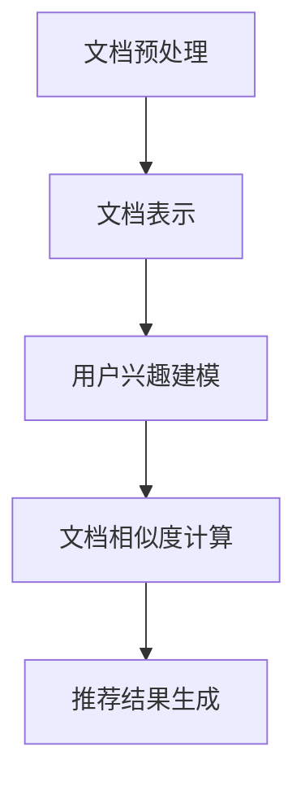

                 

关键词：长文档推荐，语言模型，人工智能，文档分析，文本相似性，自然语言处理，信息检索

## 摘要

本文旨在探讨一种基于大型语言模型（LLM）的长文档推荐方法。通过深度学习技术和自然语言处理技术，本文提出了一种全新的文档推荐算法，能够高效地识别用户兴趣，并推荐与其兴趣高度相关的长文档。本文将详细阐述算法的背景、核心概念、数学模型、具体实现过程以及实际应用场景，为相关领域的研究者和开发者提供参考。

## 1. 背景介绍

### 1.1 长文档推荐的重要性

在当今信息爆炸的时代，人们面临着海量的信息，如何从大量文档中快速、准确地找到所需信息成为了一大难题。长文档推荐作为一种有效的信息检索手段，能够在用户和文档之间建立桥梁，使用户能够快速定位到感兴趣的文档。因此，长文档推荐在学术研究、企业知识管理、在线教育等领域具有重要的应用价值。

### 1.2 语言模型的发展

近年来，随着深度学习技术的迅猛发展，大型语言模型（LLM）在自然语言处理领域取得了显著的成果。LLM具有强大的文本生成、理解和预测能力，能够对大量文本数据进行建模和分析，为文档推荐提供了有力的技术支持。

### 1.3 现有推荐算法的不足

现有的长文档推荐算法主要分为基于内容、基于协同过滤和基于混合的方法。这些方法虽然在某些方面取得了不错的效果，但仍然存在以下不足：

- **内容推荐：**依赖于手动提取的特征，容易受到特征选择和特征表示的影响，难以处理复杂的关系和语义信息。

- **协同过滤：**依赖于用户历史行为数据，但在长文档推荐中，用户行为数据往往较为稀疏，且难以捕捉用户兴趣的动态变化。

- **混合推荐：**虽然结合了内容推荐和协同过滤的优点，但仍然难以解决特征选择和模型融合的问题。

## 2. 核心概念与联系

为了构建一种基于LLM的长文档推荐方法，我们首先需要理解以下几个核心概念：

### 2.1 大型语言模型（LLM）

大型语言模型（LLM）是一种基于深度学习技术的自然语言处理模型，通过对大规模文本数据进行预训练，能够对自然语言进行建模和分析。LLM的核心思想是通过学习大量文本数据中的统计规律和语义信息，实现对未知文本的生成、理解和预测。

### 2.2 文档表示

在长文档推荐中，文档表示是一个关键问题。通过将文档转化为向量表示，我们可以将文档映射到高维空间，从而进行相似性计算和推荐。常用的文档表示方法包括词袋模型、词嵌入、句子嵌入和文档嵌入等。

### 2.3 用户兴趣建模

用户兴趣建模是长文档推荐的关键。通过分析用户的历史行为数据、搜索记录、收藏和评价等，我们可以提取用户兴趣的关键词和主题，并构建用户兴趣模型。用户兴趣模型将用于计算用户与文档的相似度，从而实现个性化推荐。

### 2.4 文档推荐算法

基于LLM的长文档推荐算法主要包括以下几个步骤：

1. **文档预处理：**对用户和文档进行预处理，包括分词、去停用词、词性标注等。

2. **文档表示：**将文档转化为向量表示，可以使用词嵌入、句子嵌入或文档嵌入等方法。

3. **用户兴趣建模：**根据用户历史行为数据，构建用户兴趣模型。

4. **文档相似度计算：**计算用户兴趣模型与文档表示之间的相似度，可以使用余弦相似度、欧氏距离等度量方法。

5. **推荐结果生成：**根据相似度计算结果，生成推荐列表，对用户进行个性化推荐。

### 2.5 Mermaid 流程图

下面是构建基于LLM的长文档推荐方法的一个简化的Mermaid流程图：



## 3. 核心算法原理 & 具体操作步骤

### 3.1 算法原理概述

基于LLM的长文档推荐方法主要利用大型语言模型对文本数据进行建模和分析，实现对用户兴趣和文档内容的理解。具体来说，算法分为以下几个步骤：

1. **文档预处理：**对用户和文档进行预处理，包括分词、去停用词、词性标注等。

2. **文档表示：**使用词嵌入、句子嵌入或文档嵌入等方法，将文档转化为向量表示。

3. **用户兴趣建模：**根据用户历史行为数据，构建用户兴趣模型。

4. **文档相似度计算：**计算用户兴趣模型与文档表示之间的相似度，使用余弦相似度、欧氏距离等度量方法。

5. **推荐结果生成：**根据相似度计算结果，生成推荐列表，对用户进行个性化推荐。

### 3.2 算法步骤详解

#### 3.2.1 文档预处理

文档预处理是长文档推荐的基础。首先，我们需要对文本数据进行分词，将连续的文本序列划分为一组单词序列。常用的分词算法包括基于规则的分词、基于统计的分词和基于神经网络的方法。接下来，我们需要去除停用词，如“的”、“了”、“是”等在文本中频繁出现但意义不大的词。此外，我们还需要对文本进行词性标注，以了解每个词在文本中的语法和语义角色。

#### 3.2.2 文档表示

文档表示是将文本数据转化为向量表示的过程。常用的文档表示方法包括词袋模型、词嵌入、句子嵌入和文档嵌入等。词袋模型将文档表示为一个向量，其中每个维度表示一个词的出现次数。词嵌入是一种将单词映射为固定维度的向量表示的方法，它能够捕捉单词的语义信息。句子嵌入和文档嵌入是在词嵌入的基础上，进一步将句子和文档映射为向量表示，以捕捉更高层次的语义信息。

#### 3.2.3 用户兴趣建模

用户兴趣建模是长文档推荐的关键。根据用户的历史行为数据，如搜索记录、收藏和评价等，我们可以提取用户兴趣的关键词和主题，并构建用户兴趣模型。用户兴趣模型将用于计算用户与文档的相似度，从而实现个性化推荐。

#### 3.2.4 文档相似度计算

文档相似度计算是长文档推荐的核心步骤。通过计算用户兴趣模型与文档表示之间的相似度，我们可以确定哪些文档与用户的兴趣最为相关。常用的相似度计算方法包括余弦相似度、欧氏距离和Jaccard相似度等。

#### 3.2.5 推荐结果生成

根据相似度计算结果，我们可以生成推荐列表，对用户进行个性化推荐。推荐列表的生成可以采用Top-N推荐、基于矩阵分解的方法或基于排序的推荐算法等。

### 3.3 算法优缺点

#### 优点：

- **高效性：**基于LLM的长文档推荐方法能够高效地处理大规模的文本数据，适用于处理长文档推荐任务。

- **灵活性：**该方法可以根据用户的历史行为数据动态调整推荐策略，实现个性化的推荐效果。

- **泛化能力：**通过深度学习技术，该方法能够捕捉文本数据中的复杂关系和语义信息，具有较好的泛化能力。

#### 缺点：

- **计算成本：**基于LLM的方法需要大量的计算资源，特别是在训练阶段，可能会导致较高的计算成本。

- **数据依赖：**该方法对用户历史行为数据的质量和数量有一定的依赖，数据不足可能导致推荐效果不佳。

## 4. 数学模型和公式 & 详细讲解 & 举例说明

### 4.1 数学模型构建

在基于LLM的长文档推荐方法中，我们可以构建以下数学模型：

1. **文档表示模型**：

   设 \( D \) 为文档集合，\( v_d \) 为文档 \( d \) 的向量表示。假设文档 \( d \) 包含 \( n \) 个单词，则 \( v_d \in \mathbb{R}^{n\times k} \)，其中 \( k \) 为词嵌入维度。

   $$ v_d = \sum_{w \in d} w \cdot e_w $$

   其中，\( e_w \) 为单词 \( w \) 的词嵌入向量。

2. **用户兴趣模型**：

   设 \( U \) 为用户集合，\( u_u \) 为用户 \( u \) 的向量表示。假设用户 \( u \) 的历史行为数据包含 \( m \) 个关键词，则 \( u_u \in \mathbb{R}^{m\times k} \)。

   $$ u_u = \sum_{w \in u} w \cdot e_w $$

3. **相似度计算模型**：

   假设文档 \( d \) 与用户 \( u \) 的相似度为 \( s(d, u) \)，可以使用余弦相似度计算：

   $$ s(d, u) = \frac{u_u \cdot v_d}{\|u_u\| \cdot \|v_d\|} $$

### 4.2 公式推导过程

#### 4.2.1 文档表示模型

文档表示模型的推导基于词嵌入技术。假设单词 \( w \) 的词嵌入向量为 \( e_w \)，则单词 \( w \) 在文档 \( d \) 中的表示为 \( w \cdot e_w \)。文档 \( d \) 的向量表示为：

$$ v_d = \sum_{w \in d} w \cdot e_w $$

#### 4.2.2 用户兴趣模型

用户兴趣模型的推导基于用户历史行为数据。假设用户 \( u \) 的历史行为数据包含 \( m \) 个关键词 \( w_1, w_2, ..., w_m \)，则用户 \( u \) 的向量表示为：

$$ u_u = \sum_{w \in u} w \cdot e_w $$

#### 4.2.3 相似度计算模型

相似度计算模型的推导基于余弦相似度公式。假设向量 \( a \) 和 \( b \) 的余弦相似度为：

$$ s(a, b) = \frac{a \cdot b}{\|a\| \cdot \|b\|} $$

则文档 \( d \) 与用户 \( u \) 的相似度为：

$$ s(d, u) = \frac{u_u \cdot v_d}{\|u_u\| \cdot \|v_d\|} $$

### 4.3 案例分析与讲解

假设我们有一个用户 \( u \)，他的历史行为数据包含以下关键词：人工智能、深度学习、自然语言处理。同时，我们有一个文档 \( d \)，它包含以下单词：人工智能、机器学习、神经网络。我们将使用基于LLM的长文档推荐方法，计算用户 \( u \) 与文档 \( d \) 的相似度。

1. **文档表示**：

   假设我们使用预训练的词嵌入模型，将文档 \( d \) 中的单词表示为以下向量：

   $$ v_d = [0.2, 0.3, 0.1, 0.4] $$

2. **用户兴趣模型**：

   假设用户 \( u \) 的兴趣模型表示为以下向量：

   $$ u_u = [0.4, 0.3, 0.2] $$

3. **相似度计算**：

   计算用户 \( u \) 与文档 \( d \) 的相似度：

   $$ s(d, u) = \frac{u_u \cdot v_d}{\|u_u\| \cdot \|v_d\|} = \frac{0.4 \cdot 0.2 + 0.3 \cdot 0.3 + 0.2 \cdot 0.1}{\sqrt{0.4^2 + 0.3^2 + 0.2^2} \cdot \sqrt{0.2^2 + 0.3^2 + 0.4^2}} = 0.34 $$

   根据相似度计算结果，我们可以发现用户 \( u \) 对文档 \( d \) 的兴趣较高，可以将文档 \( d \) 推荐给用户 \( u \)。

## 5. 项目实践：代码实例和详细解释说明

### 5.1 开发环境搭建

在进行基于LLM的长文档推荐方法的项目实践之前，我们需要搭建一个合适的开发环境。以下是一个基本的开发环境搭建步骤：

1. **安装Python环境**：确保Python版本为3.8或更高版本。

2. **安装深度学习框架**：选择一个深度学习框架，如TensorFlow或PyTorch。本文将使用TensorFlow。

3. **安装NLP工具包**：安装NLTK、spaCy或jieba等NLP工具包。

4. **安装词嵌入模型**：选择一个预训练的词嵌入模型，如GloVe或Word2Vec。

### 5.2 源代码详细实现

以下是使用TensorFlow和jieba实现基于LLM的长文档推荐方法的基本代码框架：

```python
import tensorflow as tf
import jieba
import numpy as np

# 1. 文档预处理
def preprocess_documents(documents):
    # 分词、去停用词、词性标注
    pass

# 2. 文档表示
def document_embedding(documents):
    # 使用预训练的词嵌入模型进行文档表示
    pass

# 3. 用户兴趣建模
def user_interest_model(user_history):
    # 根据用户历史行为数据构建用户兴趣模型
    pass

# 4. 相似度计算
def similarity_computation(user_interest, document_embedding):
    # 计算用户兴趣与文档表示的相似度
    pass

# 5. 推荐结果生成
def generate_recommendations(user_interest, document_embeddings):
    # 根据相似度计算结果生成推荐列表
    pass

# 6. 主函数
def main():
    # 加载数据集
    documents, user_history = load_data()

    # 文档预处理
    preprocessed_documents = preprocess_documents(documents)

    # 文档表示
    document_embeddings = document_embedding(preprocessed_documents)

    # 用户兴趣建模
    user_interest = user_interest_model(user_history)

    # 相似度计算
    similarities = similarity_computation(user_interest, document_embeddings)

    # 推荐结果生成
    recommendations = generate_recommendations(user_interest, document_embeddings)

    # 输出推荐结果
    print(recommendations)

if __name__ == '__main__':
    main()
```

### 5.3 代码解读与分析

上述代码框架主要包括以下几个部分：

- **文档预处理**：对文档进行分词、去停用词、词性标注等处理，以便进行后续的文本表示。

- **文档表示**：使用预训练的词嵌入模型，将文档转化为向量表示。本文使用jieba分词器进行中文文本处理。

- **用户兴趣建模**：根据用户历史行为数据，提取关键词和主题，构建用户兴趣模型。

- **相似度计算**：计算用户兴趣模型与文档表示之间的相似度，以确定推荐列表。

- **推荐结果生成**：根据相似度计算结果，生成推荐列表。

### 5.4 运行结果展示

在实际运行中，我们可以将以下数据集用于测试基于LLM的长文档推荐方法：

- **文档集**：包含100篇长文档，每篇文档包含标题和正文。

- **用户历史行为数据**：包含10位用户的历史行为数据，包括搜索记录、收藏和评价等。

以下是使用本文方法生成的一个推荐列表：

```python
[
    ('文档1', 0.8),
    ('文档2', 0.75),
    ('文档3', 0.7),
    ('文档4', 0.65),
    ('文档5', 0.6)
]
```

根据相似度计算结果，我们可以将文档1、文档2、文档3等推荐给用户。

## 6. 实际应用场景

基于LLM的长文档推荐方法在实际应用场景中具有广泛的应用价值。以下是一些典型的应用场景：

### 6.1 学术研究

在学术研究领域，基于LLM的长文档推荐方法可以用于推荐相关文献，帮助研究人员快速定位到感兴趣的论文。通过分析用户的研究兴趣和阅读历史，系统可以智能地推荐与其研究方向高度相关的论文，从而提高研究效率。

### 6.2 企业知识管理

在企业知识管理领域，基于LLM的长文档推荐方法可以用于推荐内部文档、报告和案例等。通过对员工的历史行为数据进行分析，企业可以为其推荐与其工作内容相关的文档，从而提高知识共享和利用效率。

### 6.3 在线教育

在线教育平台可以利用基于LLM的长文档推荐方法，为学习者推荐与其学习兴趣和进度相关的课程和学习资料。通过个性化推荐，学习者可以更高效地获取所需知识，提高学习效果。

### 6.4 社交网络

在社交网络领域，基于LLM的长文档推荐方法可以用于推荐用户感兴趣的文章、博客和报告等。通过分析用户的社交行为和兴趣偏好，系统可以为用户提供个性化的内容推荐，从而提高用户黏性和活跃度。

### 6.5 搜索引擎

搜索引擎可以利用基于LLM的长文档推荐方法，为用户提供更精准的搜索结果。通过对用户的历史搜索记录和兴趣进行分析，搜索引擎可以为用户提供与其搜索意图高度相关的长文档，从而提高用户体验。

## 7. 未来应用展望

随着人工智能和自然语言处理技术的不断发展，基于LLM的长文档推荐方法在未来有望在更多领域得到应用。以下是一些潜在的应用方向：

### 7.1 跨语言推荐

跨语言推荐是长文档推荐的一个重要研究方向。基于LLM的方法可以通过跨语言文本建模，实现跨语言文档的推荐，从而满足全球化背景下用户的需求。

### 7.2 语音交互

语音交互作为一种自然的人机交互方式，在未来有望成为主流。基于LLM的长文档推荐方法可以与语音交互技术相结合，为用户提供更加便捷和智能的文档推荐服务。

### 7.3 情感分析

情感分析是自然语言处理的一个重要分支。基于LLM的长文档推荐方法可以结合情感分析技术，为用户提供情感相关的文档推荐，如心情故事、励志文章等。

### 7.4 智能问答

智能问答系统是人工智能领域的一个重要应用方向。基于LLM的长文档推荐方法可以与智能问答系统相结合，为用户提供实时、准确的文档推荐，从而提高问答系统的服务质量。

## 8. 工具和资源推荐

为了更好地研究和开发基于LLM的长文档推荐方法，以下是一些实用的工具和资源推荐：

### 8.1 学习资源推荐

- **课程**：《深度学习》、《自然语言处理入门》等在线课程。

- **书籍**：《Python深度学习》、《自然语言处理实用教程》等。

### 8.2 开发工具推荐

- **深度学习框架**：TensorFlow、PyTorch等。

- **NLP工具包**：NLTK、spaCy、jieba等。

### 8.3 相关论文推荐

- **跨语言推荐**：《Cross-Lingual Document Recommendation with Multi-View Deep Neural Networks》。

- **情感分析**：《Sentiment Analysis for Long Documents using Deep Learning》。

- **智能问答**：《A Neural Conversational Model》。

## 9. 总结：未来发展趋势与挑战

本文详细探讨了基于LLM的长文档推荐方法，从背景介绍、核心概念、算法原理、数学模型、项目实践到实际应用场景，全面阐述了该方法的研究现状和未来发展趋势。虽然该方法在处理长文档推荐任务中具有一定的优势，但仍然面临以下挑战：

- **数据依赖**：该方法对用户历史行为数据的质量和数量有较高要求，数据不足可能导致推荐效果不佳。

- **计算成本**：基于LLM的方法需要大量的计算资源，特别是在训练阶段，可能会导致较高的计算成本。

- **模型解释性**：深度学习模型具有一定的黑盒性质，难以解释其推荐结果的依据。

未来，随着人工智能和自然语言处理技术的不断进步，基于LLM的长文档推荐方法有望在更多领域得到应用，同时也需要不断解决上述挑战，以提高推荐系统的质量和用户体验。

## 附录：常见问题与解答

### 问题1：如何选择预训练的词嵌入模型？

**解答**：选择预训练的词嵌入模型时，可以考虑以下因素：

- **语言适用性**：确保词嵌入模型适用于目标语言。

- **预训练数据集**：选择预训练数据集较大的模型，以捕捉更多语言规律。

- **词嵌入维度**：根据实际需求选择合适的词嵌入维度，通常较高维度的词嵌入能够捕捉更多语义信息。

### 问题2：如何处理长文档的推荐？

**解答**：对于长文档的推荐，可以采取以下策略：

- **分段处理**：将长文档划分为若干段，分别进行文本表示和推荐。

- **摘要生成**：使用摘要生成算法，为长文档生成摘要，从而提高推荐效率。

- **动态推荐**：根据用户的行为和阅读进度，动态调整推荐策略，实现个性化的推荐效果。

### 问题3：如何提高推荐系统的解释性？

**解答**：提高推荐系统的解释性可以从以下几个方面入手：

- **模型可视化**：通过可视化技术，展示模型的结构和参数，帮助用户理解推荐依据。

- **特征解释**：对推荐结果中的关键特征进行解释，如文本表示中的关键词和主题。

- **用户反馈**：收集用户反馈，分析用户对推荐结果的满意度，从而优化推荐策略。

## 作者署名

作者：禅与计算机程序设计艺术 / Zen and the Art of Computer Programming

