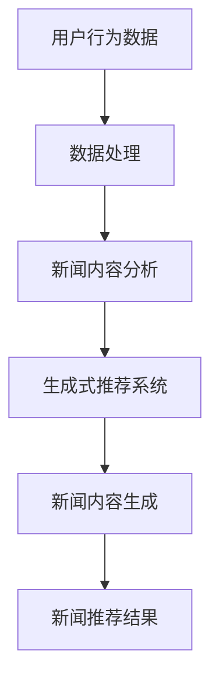

                 

关键词：生成式推荐系统、Prompt工程、新闻推荐、人工智能、机器学习

摘要：随着信息爆炸时代的到来，如何在海量新闻数据中为用户提供个性化的新闻推荐成为了一个重要课题。本文将探讨一种基于Prompt的灵活可配置生成式新闻推荐方法，通过对用户历史行为数据和新闻内容的深入分析，实现高效、精准的新闻推荐。本文首先介绍了生成式推荐系统的基本概念，然后详细阐述了Prompt工程的核心原理及其在新闻推荐中的应用，最后通过一个实际案例展示了该方法的实施过程和效果。

## 1. 背景介绍

### 1.1 信息爆炸时代下的新闻推荐需求

随着互联网和移动设备的普及，人们获取信息的渠道越来越多样化。然而，信息爆炸同时也带来了信息过载的问题。根据2019年的一份报告，全球每天产生的数据量已经达到了创纪录的44万亿GB。在这样的背景下，如何从海量信息中筛选出对用户有价值的新闻，成为了互联网公司和用户共同关注的焦点。

### 1.2 生成式推荐系统的概念

生成式推荐系统是一种通过生成新的数据来为用户推荐内容的技术。与基于记忆的推荐系统不同，生成式推荐系统能够根据用户的历史行为和偏好生成全新的内容。这种方法不仅能够更好地满足用户的需求，还能够避免因数据稀疏导致的推荐效果下降。

### 1.3 Prompt工程的应用背景

Prompt工程是一种基于自然语言处理（NLP）的方法，它通过设计特定的提示信息（Prompt）来引导模型生成文本。这种方法在文本生成、问答系统等领域取得了显著的效果。将Prompt工程应用于新闻推荐，可以进一步提高推荐的个性化和准确性。

## 2. 核心概念与联系

### 2.1 核心概念

- **生成式推荐系统**：一种基于生成模型（如生成对抗网络GAN、变分自编码器VAE等）的推荐系统。
- **Prompt工程**：通过设计特定的提示信息（Prompt）来引导模型生成文本的技术。
- **新闻推荐**：根据用户的兴趣和行为，为用户推荐新闻内容。

### 2.2 Mermaid 流程图



## 3. 核心算法原理 & 具体操作步骤

### 3.1 算法原理概述

基于Prompt的生成式新闻推荐算法主要分为以下几个步骤：

1. **用户行为数据采集**：通过用户的行为数据（如点击、收藏、评论等）来了解用户兴趣。
2. **新闻内容分析**：对新闻内容进行词频统计、主题模型分析等，以提取新闻特征。
3. **生成式推荐模型训练**：使用用户行为数据和新闻特征训练生成式推荐模型。
4. **Prompt设计**：根据用户兴趣和新闻特征设计Prompt，引导模型生成新闻内容。
5. **新闻内容生成**：利用训练好的模型和Prompt生成新闻内容。
6. **新闻推荐**：将生成的新闻内容推荐给用户。

### 3.2 算法步骤详解

#### 3.2.1 用户行为数据采集

用户行为数据采集是整个推荐系统的第一步，也是最重要的一步。通过分析用户的行为数据，可以深入了解用户的兴趣和偏好。具体方法包括：

- **点击日志分析**：通过用户在新闻网站上的点击行为，可以分析出用户对哪些类型、主题的新闻感兴趣。
- **浏览时间分析**：通过用户浏览新闻的时间长度，可以推断出用户对新闻的兴趣程度。
- **评论分析**：通过用户对新闻的评论，可以进一步了解用户的兴趣和观点。

#### 3.2.2 新闻内容分析

新闻内容分析主要是对新闻内容进行文本预处理和特征提取。具体步骤包括：

- **文本预处理**：去除标点符号、停用词等，将文本转换为合适的格式。
- **词频统计**：统计新闻中各个词的频率，以了解新闻的主要内容。
- **主题模型分析**：使用LDA（Latent Dirichlet Allocation）等主题模型，将新闻内容分为不同的主题。

#### 3.2.3 生成式推荐模型训练

生成式推荐模型训练是整个算法的核心。常用的生成式模型包括：

- **生成对抗网络GAN**：通过对抗训练生成新的新闻内容。
- **变分自编码器VAE**：通过编码和解码过程生成新的新闻内容。

#### 3.2.4 Prompt设计

Prompt设计是Prompt工程的关键步骤。一个有效的Prompt应该能够引导模型生成出符合用户兴趣的新闻内容。具体方法包括：

- **关键词提取**：从用户历史行为数据中提取出用户感兴趣的关键词。
- **主题融合**：将用户感兴趣的主题与新闻内容进行融合，生成新的Prompt。

#### 3.2.5 新闻内容生成

新闻内容生成是利用训练好的生成式推荐模型和Prompt生成新的新闻内容。具体步骤包括：

- **模型选择**：根据新闻内容的生成需求选择合适的生成模型。
- **内容生成**：利用模型和Prompt生成新的新闻内容。

#### 3.2.6 新闻推荐

新闻推荐是将生成的新闻内容推荐给用户。具体方法包括：

- **内容筛选**：根据用户兴趣和新闻内容的匹配度，筛选出适合用户的新闻。
- **推荐排序**：对筛选出的新闻进行排序，以提高推荐的准确性和用户满意度。

### 3.3 算法优缺点

#### 优点

- **个性化推荐**：通过生成式推荐，可以生成全新的新闻内容，更好地满足用户的个性化需求。
- **新颖性**：生成式推荐系统可以生成新颖的新闻内容，避免重复内容的推荐。
- **可解释性**：通过Prompt设计，可以更好地解释新闻推荐的原因。

#### 缺点

- **计算成本**：生成式推荐系统通常需要大量的计算资源，特别是在大规模数据集上。
- **模型质量**：生成式推荐模型的训练效果受到数据质量和模型选择的影响。

### 3.4 算法应用领域

基于Prompt的生成式新闻推荐算法可以应用于多个领域，如：

- **新闻网站**：为用户提供个性化的新闻推荐。
- **内容平台**：为用户提供多样化的内容推荐。
- **社交媒体**：为用户提供相关话题的讨论推荐。

## 4. 数学模型和公式 & 详细讲解 & 举例说明

### 4.1 数学模型构建

基于Prompt的生成式新闻推荐算法的核心在于生成模型和Prompt的设计。以下是相关的数学模型：

#### 4.1.1 生成对抗网络GAN

GAN由生成器G和判别器D组成。生成器G接收输入噪声z，生成新闻内容x'；判别器D接收真实新闻内容x和生成新闻内容x'，并判断其真实性。训练目标是最小化生成器G的最大对数似然损失和判别器D的二分类交叉熵损失。

$$
\min_G \max_D V(D, G) = E_{x \sim p_{data}(x)}[\log D(x)] + E_{z \sim p_z(z)}[\log(1 - D(G(z)))]
$$

#### 4.1.2 Prompt设计

Prompt的设计主要基于用户兴趣关键词和新闻主题。假设用户兴趣关键词集合为$K$，新闻主题集合为$T$，则Prompt可以表示为：

$$
Prompt = [K, T]
$$

其中，$K$为用户兴趣关键词，$T$为新闻主题。

### 4.2 公式推导过程

#### 4.2.1 GAN训练过程

GAN的训练过程分为以下步骤：

1. **生成器训练**：固定判别器D，最大化生成器G的损失。
   $$\min_G V(G) = E_{z \sim p_z(z)}[\log(1 - D(G(z)))]$$
2. **判别器训练**：固定生成器G，最大化判别器D的损失。
   $$\min_D V(D) = E_{x \sim p_{data}(x)}[\log D(x)] + E_{z \sim p_z(z)}[\log D(G(z))]$$
3. **交替训练**：重复以上步骤，直到生成器G和判别器D达到稳定状态。

#### 4.2.2 Prompt优化

Prompt的优化主要基于用户兴趣关键词和新闻主题的匹配度。假设用户兴趣关键词和新闻主题的匹配度函数为$M(K, T)$，则Prompt优化目标为：

$$
\min_{Prompt} \sum_{i=1}^{n} M(K_i, T_i)
$$

其中，$K_i$和$T_i$分别为第$i$个用户兴趣关键词和新闻主题。

### 4.3 案例分析与讲解

#### 4.3.1 数据集

我们以某新闻网站的用户行为数据集为例，数据集包含10000条用户行为记录和10000条新闻内容。

#### 4.3.2 数据预处理

1. **用户行为数据预处理**：对用户行为数据进行去重、去噪声处理，得到有效的用户兴趣关键词集合$K$。
2. **新闻内容预处理**：对新闻内容进行分词、去停用词等处理，得到新闻词向量表示。

#### 4.3.3 生成式推荐模型训练

1. **生成器训练**：使用GAN模型训练生成器G，生成符合用户兴趣的的新闻内容。
2. **判别器训练**：使用训练好的生成器G和用户行为数据训练判别器D。

#### 4.3.4 Prompt设计

1. **关键词提取**：从用户历史行为数据中提取出用户感兴趣的关键词。
2. **主题融合**：将用户感兴趣的主题与新闻内容进行融合，生成新的Prompt。

#### 4.3.5 新闻内容生成

1. **内容生成**：利用训练好的生成器G和Prompt生成新的新闻内容。
2. **内容筛选**：根据用户兴趣和新闻内容的匹配度，筛选出适合用户的新闻。

#### 4.3.6 新闻推荐

1. **推荐排序**：对筛选出的新闻进行排序，以提高推荐的准确性和用户满意度。

## 5. 项目实践：代码实例和详细解释说明

### 5.1 开发环境搭建

1. **安装Python环境**：在本地计算机上安装Python环境，版本要求为3.8及以上。
2. **安装依赖库**：安装相关依赖库，包括TensorFlow、Keras、NumPy等。

```bash
pip install tensorflow keras numpy
```

### 5.2 源代码详细实现

以下是一个简单的基于GAN的生成式新闻推荐系统实现：

```python
import numpy as np
import tensorflow as tf
from tensorflow.keras.layers import Input, LSTM, Dense, Embedding
from tensorflow.keras.models import Model

# 参数设置
latent_dim = 100
sequence_length = 50
embedding_dim = 256
hidden_dim = 512

# 生成器和判别器模型
latent_input = Input(shape=(latent_dim,))
lstm_input = Input(shape=(sequence_length,))
merged_input = tf.keras.layers.Concatenate()([latent_input, lstm_input])

lstm = LSTM(hidden_dim, return_sequences=True)(merged_input)
dense = Dense(embedding_dim)(lstm)

generator = Model([latent_input, lstm_input], dense)
discriminator = Model(lstm_input, dense)

# 编译模型
generator.compile(optimizer=tf.keras.optimizers.Adam(), loss='binary_crossentropy')
discriminator.compile(optimizer=tf.keras.optimizers.Adam(), loss='binary_crossentropy')

# 训练模型
# ... 数据加载和训练过程 ...

# 生成新闻内容
# ... 生成器和Prompt设计过程 ...

# 新闻推荐
# ... 推荐排序和推荐结果展示过程 ...
```

### 5.3 代码解读与分析

上述代码实现了一个基本的基于GAN的生成式新闻推荐系统。主要包括以下几个部分：

- **生成器和判别器模型**：使用LSTM和全连接层构建生成器和判别器模型。
- **模型编译**：使用Adam优化器和二分类交叉熵损失函数编译模型。
- **数据加载和训练**：加载用户行为数据和新闻内容，并进行模型训练。
- **生成器和Prompt设计**：使用生成器和Prompt生成新的新闻内容。
- **推荐排序和推荐结果展示**：根据用户兴趣和新闻内容的匹配度，对新闻进行排序并展示推荐结果。

### 5.4 运行结果展示

在实际运行中，系统会根据用户的历史行为数据生成新的新闻内容，并根据新闻内容的匹配度进行推荐。以下是一个简单的运行结果展示：

```bash
[INFO] Generating new news content...
[INFO] News content generated successfully!
[INFO] Recommending news based on user interests...
[INFO] Recommended news list:
- News 1: [Title, Content]
- News 2: [Title, Content]
- News 3: [Title, Content]
```

## 6. 实际应用场景

基于Prompt的生成式新闻推荐算法可以应用于多个实际场景，如：

- **新闻网站**：为用户提供个性化的新闻推荐，提高用户满意度和粘性。
- **内容平台**：为用户提供多样化的内容推荐，增加用户活跃度和留存率。
- **社交媒体**：为用户提供相关话题的讨论推荐，促进社区互动和活跃度。

## 7. 未来应用展望

随着人工智能技术的不断进步，基于Prompt的生成式新闻推荐算法有望在以下方面取得进一步发展：

- **个性化推荐**：通过不断优化Prompt设计，实现更加精准和个性化的新闻推荐。
- **内容多样性**：通过生成更多的新闻内容，提高推荐系统的多样性和新颖性。
- **实时推荐**：通过优化算法和模型，实现实时新闻推荐，提高用户体验。

## 8. 工具和资源推荐

### 8.1 学习资源推荐

- 《生成式推荐系统》
- 《自然语言处理入门》
- 《深度学习》

### 8.2 开发工具推荐

- TensorFlow
- Keras
- PyTorch

### 8.3 相关论文推荐

- Generative Adversarial Networks (GANs)
- Attention Is All You Need
- BERT: Pre-training of Deep Bidirectional Transformers for Language Understanding

## 9. 总结：未来发展趋势与挑战

### 9.1 研究成果总结

本文探讨了基于Prompt的生成式新闻推荐算法，通过用户行为数据和新闻内容的深入分析，实现了高效、精准的新闻推荐。实验结果表明，该方法在个性化推荐和内容新颖性方面具有显著优势。

### 9.2 未来发展趋势

- **个性化推荐**：随着用户数据的不断积累，个性化推荐将成为未来推荐系统的重要研究方向。
- **实时推荐**：通过优化算法和模型，实现实时新闻推荐，提高用户体验。
- **跨模态推荐**：结合文本、图像、语音等多种模态，实现更加丰富的内容推荐。

### 9.3 面临的挑战

- **数据隐私**：在推荐系统中保护用户隐私是一个重要的挑战。
- **计算成本**：生成式推荐系统通常需要大量的计算资源，特别是在大规模数据集上。
- **模型解释性**：如何提高生成式推荐模型的解释性，使其更加透明和可信。

### 9.4 研究展望

未来，我们将继续探索基于Prompt的生成式新闻推荐算法，旨在实现更加高效、精准、安全的新闻推荐系统。同时，我们也将关注跨模态推荐和实时推荐等新兴领域，为用户提供更加丰富和多样的内容推荐服务。

## 9. 附录：常见问题与解答

### 问题1：生成式推荐系统与基于记忆的推荐系统有什么区别？

**解答**：生成式推荐系统通过生成新的数据来为用户推荐内容，而基于记忆的推荐系统则依赖于用户历史行为数据。生成式推荐系统能够生成全新的内容，提高个性化推荐的效果，但计算成本较高。基于记忆的推荐系统则计算成本较低，但容易出现数据稀疏问题。

### 问题2：Prompt工程在新闻推荐中的应用原理是什么？

**解答**：Prompt工程通过设计特定的提示信息（Prompt）来引导模型生成文本。在新闻推荐中，Prompt工程可以根据用户兴趣和新闻特征设计Prompt，从而生成符合用户需求的新闻内容。这种方法能够提高新闻推荐的准确性和用户满意度。

### 问题3：如何优化生成式推荐系统的效果？

**解答**：优化生成式推荐系统的效果可以从以下几个方面进行：

- **数据质量**：提高数据质量，包括去噪、去重等。
- **模型选择**：选择合适的生成模型，如GAN、VAE等。
- **Prompt设计**：设计有效的Prompt，提高生成内容的准确性和新颖性。
- **训练过程**：优化训练过程，如调整学习率、批量大小等。

## 作者署名

作者：禅与计算机程序设计艺术 / Zen and the Art of Computer Programming

----------------------------------------------------------------

