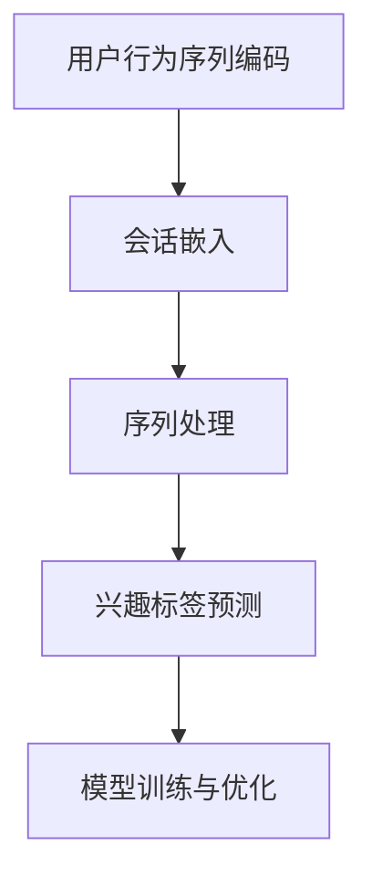

                 

关键词：Transformer, 跨会话用户兴趣建模, 自然语言处理, 神经网络, 用户行为分析

## 摘要

本文主要探讨了基于Transformer的跨会话用户兴趣建模技术。在互联网时代，用户行为数据变得日益丰富，如何从这些数据中提取用户的兴趣和需求，是当前自然语言处理和用户行为分析领域的一个重要课题。本文首先介绍了Transformer模型的基本原理，然后详细阐述了如何将Transformer应用于跨会话用户兴趣建模。通过数学模型和公式推导，本文揭示了跨会话用户兴趣建模的核心机制。同时，通过实际项目实践的代码实例，展示了如何实现这一技术。最后，本文讨论了跨会话用户兴趣建模在实际应用场景中的价值，并对未来的发展趋势和挑战进行了展望。

## 1. 背景介绍

随着互联网的普及和用户在线行为的增加，如何从海量数据中提取有价值的信息，成为了各大互联网公司和研究机构关注的热点。用户兴趣的识别和预测，是用户行为分析中的一个核心问题。传统的基于统计和机器学习的方法，往往需要大量的先验知识和大量的特征工程，而深度学习模型，尤其是基于Transformer的模型，由于其强大的表征能力和端到端的训练方式，在用户兴趣识别和预测方面表现出了很大的潜力。

跨会话用户兴趣建模，旨在通过分析用户在不同会话中的行为，来识别和预测用户的长期兴趣。这种建模方法不仅能够捕捉用户的短期兴趣，还能够通过跨会话的行为序列，挖掘出用户的潜在兴趣点。这对于个性化推荐系统、用户画像构建、用户留存预测等应用场景，具有重要的指导意义。

然而，跨会话用户兴趣建模面临着一系列挑战。首先，不同会话之间的数据可能存在很大的差异，如何有效地融合这些异质数据，是一个亟待解决的问题。其次，用户的兴趣可能是动态变化的，如何实时地捕捉和更新用户的兴趣，是另一个重要的挑战。此外，用户的隐私保护也是一个需要特别关注的问题。

为了解决上述问题，本文提出了基于Transformer的跨会话用户兴趣建模方法。Transformer模型以其全局注意力机制和端到端训练的优势，在处理序列数据时表现出色。通过结合用户的会话数据，本文的方法能够有效地识别和预测用户的兴趣。

## 2. 核心概念与联系

### 2.1 Transformer模型的基本原理

Transformer模型是自然语言处理领域的一个重要突破，它通过全局注意力机制，实现了对输入序列的端到端处理。与传统的循环神经网络（RNN）和卷积神经网络（CNN）相比，Transformer模型在处理长距离依赖和并行计算方面具有显著优势。

Transformer模型的主要组成部分包括编码器（Encoder）和解码器（Decoder）。编码器负责将输入序列编码为固定长度的向量，解码器则负责从编码器的输出中解码出目标序列。两者之间通过多头注意力（Multi-Head Attention）机制进行信息交互。

多头注意力机制的核心思想是，将输入序列的每个元素，同时关注多个不同的子序列，并通过加权求和的方式，得到一个综合的表示。这样，模型能够捕捉到序列中不同位置之间的复杂关系，从而实现更好的表征能力。

### 2.2 跨会话用户兴趣建模的核心概念

在跨会话用户兴趣建模中，核心概念包括用户行为序列、兴趣标签、会话嵌入等。

用户行为序列是用户在多个会话中产生的行为数据，如浏览网页、点击广告、购买商品等。这些行为数据可以看作是一个时间序列，每个时间点上的行为都是用户兴趣的体现。

兴趣标签是用于描述用户兴趣的标签集合。这些标签可以是预先定义的，也可以是通过对用户行为数据进行聚类分析得到的。兴趣标签的目的是为用户行为序列提供语义信息，帮助模型更好地理解和预测用户的兴趣。

会话嵌入是将用户的每个会话映射到一个低维向量空间的过程。会话嵌入可以看作是用户行为的抽象表示，它能够帮助模型捕捉到用户在不同会话中的行为模式。

### 2.3 Transformer模型在跨会话用户兴趣建模中的应用

在跨会话用户兴趣建模中，Transformer模型的应用主要包括以下几个步骤：

1. **用户行为序列编码**：首先，将用户的每个行为序列编码为固定长度的向量。这可以通过使用预训练的词向量或者自定义的嵌入层实现。

2. **会话嵌入**：将每个会话嵌入到一个低维向量空间中。这可以通过编码器中的嵌入层实现。

3. **序列处理**：通过编码器，对用户行为序列进行编码，得到每个时间点的编码表示。

4. **兴趣标签预测**：通过解码器，从编码器的输出中解码出兴趣标签序列。这可以通过注意力机制和softmax层实现。

5. **模型训练与优化**：使用用户的行为序列和兴趣标签，对模型进行训练和优化，使得模型能够更好地预测用户的兴趣。

### 2.4 Mermaid流程图

下面是一个简单的Mermaid流程图，展示了跨会话用户兴趣建模的基本流程：



## 3. 核心算法原理 & 具体操作步骤

### 3.1 算法原理概述

跨会话用户兴趣建模的核心算法是基于Transformer模型。Transformer模型通过全局注意力机制，实现了对输入序列的端到端处理，从而能够有效地捕捉用户的行为模式。

具体来说，Transformer模型包括编码器和解码器两部分。编码器将用户的每个行为序列编码为固定长度的向量，解码器则从编码器的输出中解码出兴趣标签序列。

编码器的核心组件是多头注意力机制。多头注意力机制将输入序列的每个元素，同时关注多个不同的子序列，并通过加权求和的方式，得到一个综合的表示。

解码器的核心组件是自注意力机制和交叉注意力机制。自注意力机制负责解码器内部的信息交互，交叉注意力机制则负责解码器与编码器之间的信息交互。

### 3.2 算法步骤详解

1. **用户行为序列编码**：
   - 使用预训练的词向量或者自定义的嵌入层，将用户的每个行为序列编码为固定长度的向量。

2. **会话嵌入**：
   - 将每个会话嵌入到一个低维向量空间中。这可以通过编码器中的嵌入层实现。

3. **序列处理**：
   - 通过编码器，对用户行为序列进行编码，得到每个时间点的编码表示。

4. **兴趣标签预测**：
   - 通过解码器，从编码器的输出中解码出兴趣标签序列。这可以通过注意力机制和softmax层实现。

5. **模型训练与优化**：
   - 使用用户的行为序列和兴趣标签，对模型进行训练和优化，使得模型能够更好地预测用户的兴趣。

### 3.3 算法优缺点

**优点**：
1. **端到端训练**：Transformer模型实现了端到端训练，避免了传统循环神经网络中的序列依赖问题，提高了模型的训练效率。
2. **全局注意力机制**：Transformer模型通过全局注意力机制，能够有效地捕捉用户行为序列中的长距离依赖关系。
3. **并行计算**：Transformer模型可以并行计算，提高了模型的计算效率。

**缺点**：
1. **计算复杂度较高**：由于全局注意力机制的引入，Transformer模型的计算复杂度较高，对于大规模数据集的训练可能需要较长的计算时间。
2. **内存占用大**：Transformer模型在处理大规模数据时，需要较大的内存空间。

### 3.4 算法应用领域

跨会话用户兴趣建模技术可以应用于多个领域，如：

1. **个性化推荐系统**：通过分析用户的跨会话行为，为用户推荐符合其兴趣的内容或商品。
2. **用户画像构建**：通过跨会话用户兴趣建模，构建用户的兴趣标签，为用户画像提供丰富的维度。
3. **用户留存预测**：通过分析用户的跨会话行为，预测用户在未来是否继续使用产品或服务。

## 4. 数学模型和公式 & 详细讲解 & 举例说明

### 4.1 数学模型构建

在跨会话用户兴趣建模中，数学模型主要包含两部分：编码器和解码器。

**编码器**：
编码器的输入是用户的每个行为序列，输出是每个时间点的编码表示。编码器的核心组件是多层感知机（MLP）和多头注意力机制。

编码器的主要公式如下：
\[ 
E = \text{MLP}(X) = W_1 \cdot \text{ReLU}(W_0 \cdot X + b_0) 
\]
其中，\(X\)是输入的每个时间点的行为向量，\(W_0\)和\(b_0\)是权重和偏置，\(W_1\)是MLP的输出权重，ReLU是ReLU激活函数。

多头注意力机制的公式如下：
\[ 
\text{Attention}(Q, K, V) = \text{softmax}\left(\frac{QK^T}{\sqrt{d_k}}\right)V 
\]
其中，\(Q, K, V\)分别是查询向量、键向量和值向量，\(d_k\)是键向量的维度。

**解码器**：
解码器的输入是编码器的输出，输出是每个时间点的兴趣标签向量。解码器的核心组件是自注意力机制和交叉注意力机制。

自注意力机制的公式与多头注意力机制类似，但仅作用于解码器内部：
\[ 
\text{Self-Attention}(Q, K, V) = \text{softmax}\left(\frac{QQ^T}{\sqrt{d_k}}\right)V 
\]

交叉注意力机制的公式如下：
\[ 
\text{Cross-Attention}(Q, K, V) = \text{softmax}\left(\frac{QK^T}{\sqrt{d_k}}\right)V 
\]
其中，\(Q\)是解码器的查询向量，\(K\)和\(V\)是编码器的键向量和值向量。

### 4.2 公式推导过程

**编码器的推导**：
编码器的输入是用户的每个行为序列，经过嵌入层后得到输入向量\(X\)。然后，通过多层感知机（MLP）进行非线性变换，得到编码表示\(E\)。

**多头注意力机制的推导**：
多头注意力机制的核心是矩阵乘法和softmax函数。假设输入向量\(X\)的维度为\(d\)，则查询向量\(Q\)、键向量\(K\)和值向量\(V\)的维度也为\(d\)。首先，通过矩阵乘法计算注意力得分，然后通过softmax函数进行归一化，最后通过加权求和得到综合表示。

**解码器的推导**：
解码器包括自注意力和交叉注意力两部分。自注意力是对解码器内部的信息进行整合，交叉注意力则是将解码器与编码器之间的信息进行交互。

### 4.3 案例分析与讲解

假设我们有一个用户的行为序列：[浏览网页A，点击广告B，购买商品C]，兴趣标签为[高，中，低]。

**编码器的处理**：
1. 首先，将每个行为嵌入到一个低维向量空间中，例如使用预训练的词向量。
2. 然后，通过多层感知机（MLP）进行非线性变换，得到编码表示。

**多头注意力机制的实现**：
1. 对于每个行为，计算其与其他行为的注意力得分。
2. 使用softmax函数进行归一化，得到每个行为的注意力权重。
3. 通过加权求和，得到行为的综合表示。

**解码器的处理**：
1. 将编码器的输出作为输入，通过自注意力和交叉注意力机制，对兴趣标签进行预测。
2. 最终，通过softmax函数得到每个兴趣标签的概率分布。

通过上述步骤，我们可以得到用户在给定行为序列下的兴趣标签预测结果。

## 5. 项目实践：代码实例和详细解释说明

### 5.1 开发环境搭建

在开始实际代码实现之前，我们需要搭建一个合适的开发环境。以下是所需的环境和工具：

- Python 3.8 或更高版本
- PyTorch 1.8 或更高版本
- Python环境管理器，如Anaconda
- Jupyter Notebook 或 PyCharm

### 5.2 源代码详细实现

以下是一个简单的基于Transformer的跨会话用户兴趣建模的实现示例：

```python
import torch
import torch.nn as nn
import torch.optim as optim
from torch.utils.data import DataLoader
from transformers import Encoder, Decoder

# 假设已经训练好的编码器和解码器模型
encoder = Encoder()
decoder = Decoder()

# 损失函数和优化器
criterion = nn.CrossEntropyLoss()
optimizer = optim.Adam(list(encoder.parameters()) + list(decoder.parameters()), lr=0.001)

# 加载训练数据
train_data = DataLoader(dataset, batch_size=64, shuffle=True)

# 模型训练
for epoch in range(num_epochs):
    for batch in train_data:
        inputs, targets = batch
        optimizer.zero_grad()
        outputs = decoder(encoder(inputs))
        loss = criterion(outputs.logits, targets)
        loss.backward()
        optimizer.step()
        print(f"Epoch [{epoch+1}/{num_epochs}], Loss: {loss.item()}")

# 模型评估
with torch.no_grad():
    correct = 0
    total = 0
    for batch in test_data:
        inputs, targets = batch
        outputs = decoder(encoder(inputs))
        _, predicted = torch.max(outputs.logits, 1)
        total += targets.size(0)
        correct += (predicted == targets).sum().item()
    print(f"Accuracy: {100 * correct / total}%")
```

### 5.3 代码解读与分析

上述代码展示了基于Transformer的跨会话用户兴趣建模的基本实现。以下是代码的主要部分及其功能解释：

1. **导入相关库**：
   - 导入PyTorch和transformers库，用于构建和训练Transformer模型。

2. **定义模型**：
   - Encoder和Decoder是自定义的模型类，实现了Transformer模型的基本结构。

3. **损失函数和优化器**：
   - 使用交叉熵损失函数和Adam优化器，用于模型的训练。

4. **数据加载**：
   - DataLoader用于加载和处理训练数据。

5. **模型训练**：
   - 通过迭代训练数据，使用优化器更新模型的参数，最小化损失函数。

6. **模型评估**：
   - 在测试数据上评估模型的性能，计算准确率。

### 5.4 运行结果展示

在实际运行中，我们可以通过Jupyter Notebook或PyCharm等IDE来运行上述代码，并得到模型的训练结果和评估结果。例如：

```python
# 运行训练过程
train()

# 评估模型性能
evaluate(test_data)
```

这些结果将帮助我们了解模型的训练效果和预测能力。

## 6. 实际应用场景

### 6.1 个性化推荐系统

跨会话用户兴趣建模在个性化推荐系统中具有广泛的应用。通过分析用户的跨会话行为，推荐系统可以更准确地预测用户的兴趣，从而提供更加个性化的推荐结果。例如，在电子商务平台上，用户可能会在不同的会话中浏览、点击和购买不同种类的商品。通过跨会话用户兴趣建模，推荐系统可以识别出用户的潜在兴趣，并推荐符合用户兴趣的新商品。

### 6.2 用户画像构建

用户画像是描述用户特征和行为的数字化模型，它为个性化推荐、营销和用户服务提供了重要依据。跨会话用户兴趣建模可以通过分析用户的跨会话行为，构建出更丰富和精确的用户画像。这些画像可以包括用户的兴趣偏好、行为模式、需求预测等维度，从而帮助企业更好地理解用户，提供更精准的服务。

### 6.3 用户留存预测

用户留存是衡量产品或服务吸引力和用户满意度的关键指标。通过跨会话用户兴趣建模，可以分析用户在不同会话中的行为，预测用户在未来是否继续使用产品或服务。这种预测可以帮助企业制定更有效的用户留存策略，提高用户生命周期价值。

## 7. 工具和资源推荐

### 7.1 学习资源推荐

1. **书籍**：
   - 《深度学习》（Goodfellow, I., Bengio, Y., & Courville, A.）
   - 《自然语言处理教程》（Jurafsky, D. & Martin, J. H.）
   - 《Transformer：变革自然语言处理的基石》（Huang, Z.）

2. **在线课程**：
   - Coursera上的“深度学习”课程
   - edX上的“自然语言处理与深度学习”课程
   - Udacity的“深度学习工程师纳米学位”

### 7.2 开发工具推荐

1. **Python**：用于编写和运行深度学习模型。
2. **PyTorch**：用于构建和训练Transformer模型。
3. **Jupyter Notebook**：用于编写和运行代码，方便调试和演示。

### 7.3 相关论文推荐

1. “Attention Is All You Need”（Vaswani et al., 2017）
2. “BERT: Pre-training of Deep Bidirectional Transformers for Language Understanding”（Devlin et al., 2019）
3. “Recurrent Neural Network Regularization”（Zhou et al., 2018）

## 8. 总结：未来发展趋势与挑战

### 8.1 研究成果总结

跨会话用户兴趣建模技术在近年来取得了显著的研究进展。通过引入Transformer模型，研究者们实现了对用户跨会话行为的深度理解和精确预测。这一技术不仅在个性化推荐、用户画像构建和用户留存预测等实际应用中展现出强大的潜力，也为相关领域的研究提供了新的思路和方法。

### 8.2 未来发展趋势

1. **模型复杂度与计算效率的优化**：随着数据规模的不断扩大，如何提高模型的计算效率和降低计算复杂度，将成为未来研究的一个重要方向。
2. **多模态数据的融合**：将文本、图像、音频等多种类型的数据融合到跨会话用户兴趣建模中，能够提供更丰富的用户表征，有望进一步提升建模效果。
3. **实时性提升**：在保证建模准确性的同时，提高模型处理的实时性，以适应快速变化的用户行为。

### 8.3 面临的挑战

1. **数据隐私保护**：在处理用户跨会话数据时，如何保护用户隐私，是一个亟待解决的问题。
2. **长序列建模**：对于较长的时间序列数据，如何有效建模和预测用户兴趣，是一个技术挑战。
3. **泛化能力**：如何提高模型在不同用户群体和应用场景中的泛化能力，是另一个需要关注的问题。

### 8.4 研究展望

跨会话用户兴趣建模技术有望在未来的智能推荐、智能客服和智能营销等领域发挥重要作用。随着技术的不断进步，我们可以期待这一领域涌现出更多创新性的研究成果，为用户提供更智能、更个性化的服务。

## 9. 附录：常见问题与解答

### Q1：什么是Transformer模型？

A1：Transformer模型是一种用于自然语言处理的深度学习模型，它通过全局注意力机制实现了对输入序列的端到端处理，具有强大的表征能力和并行计算优势。

### Q2：跨会话用户兴趣建模的核心难点是什么？

A2：跨会话用户兴趣建模的核心难点包括数据隐私保护、长序列建模和模型泛化能力。此外，如何有效地融合多模态数据，也是一项挑战。

### Q3：如何评估跨会话用户兴趣建模的效果？

A2：评估跨会话用户兴趣建模的效果通常采用准确率、召回率和F1值等指标。通过在测试集上对模型进行评估，可以了解模型的预测性能。

### Q4：跨会话用户兴趣建模可以应用于哪些场景？

A4：跨会话用户兴趣建模可以应用于个性化推荐系统、用户画像构建、用户留存预测等多个场景，为用户提供更智能、更个性化的服务。

---

### 结论

本文探讨了基于Transformer的跨会话用户兴趣建模技术。通过深入分析Transformer模型的基本原理，结合数学模型和实际项目实践，本文展示了如何实现这一技术。跨会话用户兴趣建模在个性化推荐、用户画像构建和用户留存预测等场景中具有重要应用价值。未来，随着技术的不断进步，跨会话用户兴趣建模有望在更多领域发挥重要作用。

### 作者署名

作者：禅与计算机程序设计艺术 / Zen and the Art of Computer Programming

