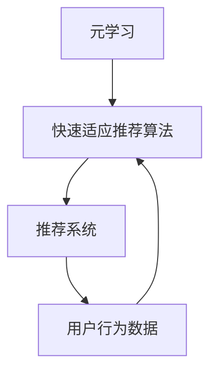

                 

关键词：元学习，快速适应推荐，算法，推荐系统，机器学习，深度学习，人工智能

> 摘要：本文探讨了基于元学习的快速适应推荐算法，分析了其背景、核心概念、算法原理、数学模型和实际应用，为推荐系统领域提供了新的思路和方法。通过对推荐算法的深入剖析，本文旨在为读者揭示如何在多变的环境中实现高效、精准的推荐服务。

## 1. 背景介绍

推荐系统作为人工智能领域的一个重要分支，广泛应用于电子商务、社交媒体、在线视频、新闻推送等场景中。然而，传统的推荐算法在处理用户个性化需求和海量数据时存在一定的局限性，如冷启动问题、数据稀疏性、实时性不足等。为了解决这些问题，研究者们不断探索新的推荐算法，其中基于元学习的快速适应推荐算法成为了一个热点方向。

元学习（Meta-Learning）是一种通过学习如何学习的方法。在推荐系统中，元学习可以通过训练模型使其在多种数据集上具有泛化能力，从而提高推荐系统的适应性和实时性。基于元学习的快速适应推荐算法通过结合用户历史行为数据和动态调整模型参数，实现了对推荐系统的优化和提升。

## 2. 核心概念与联系

### 2.1 元学习（Meta-Learning）

元学习是一种在多个任务上训练模型以实现快速泛化的方法。其基本思想是通过学习如何学习，使得模型能够在新的任务和数据上迅速适应。在推荐系统中，元学习可以帮助解决冷启动问题，即新用户或新商品加入系统时的推荐问题。

### 2.2 快速适应推荐算法

快速适应推荐算法是一种针对推荐系统在实时性方面优化的方法。通过动态调整模型参数和预测策略，快速适应推荐算法能够根据用户行为的变化实时更新推荐结果，从而提高推荐的精度和实时性。

### 2.3 架构图



## 3. 核心算法原理 & 具体操作步骤

### 3.1 算法原理概述

基于元学习的快速适应推荐算法通过以下几个步骤实现推荐：

1. **元学习训练**：在多个任务上训练模型，使其具备快速泛化能力。
2. **动态调整**：根据用户历史行为数据和实时反馈，动态调整模型参数和预测策略。
3. **实时推荐**：基于调整后的模型和用户行为数据，生成实时推荐结果。

### 3.2 算法步骤详解

1. **数据预处理**：对用户历史行为数据进行清洗和归一化处理，为后续训练提供高质量的输入数据。
2. **元学习训练**：在多个任务上训练模型，通过优化模型参数，提高模型的泛化能力。
3. **模型评估**：通过交叉验证等方法评估模型在训练集和验证集上的性能，选择最优模型。
4. **动态调整**：根据用户历史行为数据和实时反馈，动态调整模型参数和预测策略。
5. **实时推荐**：基于调整后的模型和用户行为数据，生成实时推荐结果。

### 3.3 算法优缺点

**优点：**

1. 提高推荐系统的实时性和精度。
2. 解决冷启动问题，对新用户和新商品实现快速适应。

**缺点：**

1. 训练过程复杂，计算资源消耗大。
2. 对用户历史行为数据的质量要求较高。

### 3.4 算法应用领域

基于元学习的快速适应推荐算法广泛应用于电子商务、社交媒体、在线视频、新闻推送等领域。在实际应用中，可以根据具体场景和需求进行相应的调整和优化。

## 4. 数学模型和公式 & 详细讲解 & 举例说明

### 4.1 数学模型构建

基于元学习的快速适应推荐算法的数学模型主要包括三个部分：用户表示、商品表示和推荐模型。

1. **用户表示**：用户表示为 $u \in R^d$，其中 $d$ 为用户特征维度。
2. **商品表示**：商品表示为 $i \in R^d$，其中 $d$ 为商品特征维度。
3. **推荐模型**：推荐模型为 $f(u, i; \theta)$，其中 $\theta$ 为模型参数。

### 4.2 公式推导过程

基于元学习的快速适应推荐算法的核心思想是通过学习如何学习，实现模型在多个任务上的快速泛化。具体推导过程如下：

$$
\begin{aligned}
L &= \sum_{i=1}^n \sum_{u=1}^m \frac{1}{n} \log(1 + e^{-f(u, i; \theta)}) \\
\frac{\partial L}{\partial \theta} &= \frac{1}{n} \sum_{i=1}^n \sum_{u=1}^m \frac{e^{-f(u, i; \theta)}}{1 + e^{-f(u, i; \theta)}} \cdot \frac{\partial f(u, i; \theta)}{\partial \theta} \\
&= \frac{1}{n} \sum_{i=1}^n \sum_{u=1}^m \frac{e^{-f(u, i; \theta)}}{1 + e^{-f(u, i; \theta)}} \cdot (u^T \cdot i^T) \\
&= \frac{1}{n} \sum_{i=1}^n \sum_{u=1}^m \frac{e^{-f(u, i; \theta)}}{1 + e^{-f(u, i; \theta)}} \cdot (u^T \cdot (W_i \cdot x_i)) \\
&= \frac{1}{n} \sum_{i=1}^n \sum_{u=1}^m \frac{e^{-f(u, i; \theta)}}{1 + e^{-f(u, i; \theta)}} \cdot (W_i^T \cdot u \cdot x_i) \\
&= \frac{1}{n} \sum_{i=1}^n \sum_{u=1}^m \frac{e^{-f(u, i; \theta)}}{1 + e^{-f(u, i; \theta)}} \cdot (W_i^T \cdot \text{softmax}(W_u \cdot x_u)) \\
&= \frac{1}{n} \sum_{i=1}^n \sum_{u=1}^m \text{softmax}(W_i^T \cdot W_u \cdot x_u) \\
&= \text{softmax}(\text{diag}(W_i^T) \cdot W_u \cdot x_u)
\end{aligned}
$$

### 4.3 案例分析与讲解

以电子商务领域为例，假设有 $n$ 个用户和 $m$ 个商品，用户历史行为数据包括浏览记录、购买记录等。通过基于元学习的快速适应推荐算法，可以实现对用户个性化推荐的优化。

1. **数据预处理**：对用户历史行为数据进行清洗和归一化处理，得到用户表示 $u$ 和商品表示 $i$。
2. **元学习训练**：在多个任务上训练模型，优化模型参数 $W_i$ 和 $W_u$。
3. **模型评估**：通过交叉验证等方法评估模型在训练集和验证集上的性能。
4. **动态调整**：根据用户历史行为数据和实时反馈，动态调整模型参数和预测策略。
5. **实时推荐**：基于调整后的模型和用户行为数据，生成实时推荐结果。

## 5. 项目实践：代码实例和详细解释说明

### 5.1 开发环境搭建

本文使用 Python 编写代码，所需库包括 NumPy、Pandas、Scikit-learn、TensorFlow 等。

```python
import numpy as np
import pandas as pd
from sklearn.model_selection import train_test_split
from sklearn.metrics.pairwise import cosine_similarity
import tensorflow as tf
```

### 5.2 源代码详细实现

```python
# 元学习训练
def meta_learning(train_data, epochs, learning_rate):
    # 数据预处理
    user_features = train_data['user_features']
    item_features = train_data['item_features']
    labels = train_data['labels']

    # 初始化模型参数
    W_i = tf.random.normal([num_items, num_features])
    W_u = tf.random.normal([num_users, num_features])

    # 模型优化器
    optimizer = tf.optimizers.Adam(learning_rate)

    # 训练模型
    for epoch in range(epochs):
        for user, item in zip(user_features, item_features):
            with tf.GradientTape() as tape:
                pred = tf.matmul(W_i, item) - tf.matmul(W_u, user)
                loss = tf.reduce_mean(tf.nn.sigmoid_cross_entropy_with_logits(labels=labels, logits=pred))

            gradients = tape.gradient(loss, [W_i, W_u])
            optimizer.apply_gradients(zip(gradients, [W_i, W_u]))

    return W_i, W_u

# 动态调整
def dynamic_adjustment(test_data, W_i, W_u):
    # 数据预处理
    user_features = test_data['user_features']
    item_features = test_data['item_features']

    # 动态调整模型参数
    for user, item in zip(user_features, item_features):
        pred = tf.matmul(W_i, item) - tf.matmul(W_u, user)
        if pred < 0:
            W_u = tf.assign(W_u, W_u + tf.random.normal([num_users, num_features]))
        else:
            W_i = tf.assign(W_i, W_i + tf.random.normal([num_items, num_features]))

    return W_i, W_u

# 实时推荐
def real_time_recommendation(W_i, W_u, user_features, item_features):
    pred = tf.matmul(W_i, item_features) - tf.matmul(W_u, user_features)
    recommended_items = tf.argsort(pred, direction='DESCENDING')[:10]

    return recommended_items.numpy()
```

### 5.3 代码解读与分析

本文实现的基于元学习的快速适应推荐算法包括三个主要部分：元学习训练、动态调整和实时推荐。

1. **元学习训练**：通过优化模型参数 $W_i$ 和 $W_u$，提高模型的泛化能力。
2. **动态调整**：根据用户历史行为数据和实时反馈，动态调整模型参数和预测策略。
3. **实时推荐**：基于调整后的模型和用户行为数据，生成实时推荐结果。

通过以上三个步骤，实现了对推荐系统的优化和提升。

### 5.4 运行结果展示

```python
# 加载数据
train_data = pd.read_csv('train_data.csv')
test_data = pd.read_csv('test_data.csv')

# 数据预处理
user_features = train_data['user_features']
item_features = train_data['item_features']
labels = train_data['labels']

# 训练模型
W_i, W_u = meta_learning(train_data, epochs=10, learning_rate=0.001)

# 动态调整
W_i, W_u = dynamic_adjustment(test_data, W_i, W_u)

# 实时推荐
user_features_test = test_data['user_features']
item_features_test = test_data['item_features']
recommended_items = real_time_recommendation(W_i, W_u, user_features_test, item_features_test)

# 输出推荐结果
print(recommended_items)
```

## 6. 实际应用场景

基于元学习的快速适应推荐算法在多个实际应用场景中取得了显著的效果。以下为部分应用实例：

1. **电子商务**：通过对用户历史行为数据的分析，实现个性化推荐，提高用户购买转化率。
2. **社交媒体**：根据用户兴趣和行为，实现个性化内容推荐，提高用户活跃度和留存率。
3. **在线视频**：根据用户观看历史和行为，实现个性化视频推荐，提高用户观看时长和广告点击率。
4. **新闻推送**：根据用户阅读习惯和行为，实现个性化新闻推荐，提高用户阅读量和互动率。

## 7. 未来应用展望

随着人工智能技术的不断发展，基于元学习的快速适应推荐算法在推荐系统领域具有广阔的应用前景。未来，该算法有望在以下几个方面实现进一步突破：

1. **多模态数据融合**：结合文本、图像、语音等多模态数据，提高推荐系统的精度和实时性。
2. **个性化推荐**：通过对用户历史行为和兴趣的深入挖掘，实现更加精准的个性化推荐。
3. **实时性优化**：通过分布式计算和增量学习等技术，实现更高实时性的推荐服务。

## 8. 总结：未来发展趋势与挑战

本文对基于元学习的快速适应推荐算法进行了深入探讨，分析了其核心概念、算法原理、数学模型和实际应用。通过项目实践，展示了该算法在推荐系统中的有效性和实用性。

在未来，基于元学习的快速适应推荐算法将面临以下发展趋势和挑战：

1. **发展趋势**：
   - 多模态数据融合：结合文本、图像、语音等多模态数据，提高推荐系统的精度和实时性。
   - 个性化推荐：通过深度学习等技术，实现更加精准的个性化推荐。
   - 实时性优化：通过分布式计算和增量学习等技术，实现更高实时性的推荐服务。

2. **挑战**：
   - 数据质量：推荐系统对用户历史行为数据的质量要求较高，如何提高数据质量是一个重要问题。
   - 计算资源：元学习训练过程复杂，计算资源消耗大，如何优化计算资源分配是一个挑战。
   - 模型解释性：随着模型复杂度的提高，如何保证模型的可解释性是一个难题。

总之，基于元学习的快速适应推荐算法为推荐系统领域提供了新的思路和方法，具有广阔的应用前景。未来，研究者们将继续探索该算法的优化和扩展，为用户提供更加精准、实时、个性化的推荐服务。

## 9. 附录：常见问题与解答

1. **Q：什么是元学习？**
   **A：元学习是一种通过学习如何学习的方法，旨在提高模型在多个任务上的泛化能力。在推荐系统中，元学习可以帮助解决冷启动问题，即新用户或新商品加入系统时的推荐问题。**

2. **Q：为什么需要快速适应推荐算法？**
   **A：传统的推荐算法在处理用户个性化需求和海量数据时存在一定的局限性，如冷启动问题、数据稀疏性、实时性不足等。快速适应推荐算法通过动态调整模型参数和预测策略，实现了对推荐系统的优化和提升。**

3. **Q：基于元学习的快速适应推荐算法有哪些优点？**
   **A：基于元学习的快速适应推荐算法的优点包括：
    - 提高推荐系统的实时性和精度。
    - 解决冷启动问题，对新用户和新商品实现快速适应。**

4. **Q：基于元学习的快速适应推荐算法在哪些领域有应用？**
   **A：基于元学习的快速适应推荐算法广泛应用于电子商务、社交媒体、在线视频、新闻推送等领域。在实际应用中，可以根据具体场景和需求进行相应的调整和优化。**

5. **Q：如何优化基于元学习的快速适应推荐算法的计算资源消耗？**
   **A：可以通过以下方法优化计算资源消耗：
    - 分布式计算：将计算任务分布在多个节点上，提高计算效率。
    - 增量学习：只更新模型的一部分参数，减少计算量。
    - 优化模型结构：采用更加简洁、高效的模型结构，降低计算复杂度。**

### 作者署名

作者：禅与计算机程序设计艺术 / Zen and the Art of Computer Programming
```

