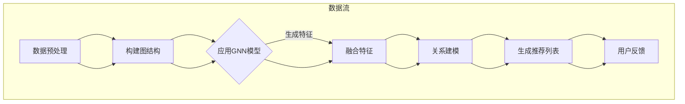

                 

关键词：图神经网络、商品关系、关系挖掘、商品推荐、电商分析

>摘要：本文将探讨基于图神经网络的商品关系挖掘技术，分析其核心概念、算法原理、数学模型、应用领域，并通过具体实例展示其实际应用效果。文章旨在为读者提供全面的技术理解和实践指导。

## 1. 背景介绍

在电子商务的快速发展中，商品推荐系统成为了电商企业吸引用户、提升转化率的重要手段。传统的基于协同过滤、内容匹配的推荐算法虽然在短期内取得了一定的成效，但随着用户数据的爆发式增长和商品种类的日益丰富，这些算法逐渐暴露出诸如冷启动、数据稀疏、推荐多样性不足等问题。为了解决这些问题，研究者们开始探索更加复杂和智能的推荐算法，其中基于图神经网络的商品关系挖掘技术脱颖而出。

图神经网络（Graph Neural Networks, GNNs）作为一种新兴的机器学习技术，通过在图结构上模拟神经元之间的交互作用，能够有效地捕捉节点间的复杂关系。在商品推荐领域，GNNs 可以通过挖掘商品之间的隐含关系，为用户生成更个性化和多样化的推荐结果。

本文将系统地介绍基于图神经网络的商品关系挖掘技术，首先从核心概念入手，逐步深入到算法原理、数学模型，并结合实际项目实践，展示其在电商领域的应用价值。希望通过本文的阐述，能够为相关领域的研究者提供有价值的参考，同时为实际项目开发提供实用的技术指导。

## 2. 核心概念与联系

### 2.1 图神经网络的基本概念

图神经网络是一种特殊的神经网络，它能够在图结构上进行学习和预测。图由节点（Node）和边（Edge）组成，每个节点代表图中的一个实体（如商品、用户等），边则表示节点之间的某种关系（如购买关系、评论关系等）。

图神经网络的基本思想是通过图结构上的节点和边来传递信息，模拟人类认知过程中节点和关系的作用。具体来说，图神经网络将图中的每个节点视为一个特征向量，然后通过神经网络的学习，将这些特征向量映射为新的表示。在这个过程中，节点和边上的特征向量会不断更新和融合，从而形成对图中实体更深的理解。

### 2.2 商品关系挖掘与图神经网络的关系

商品关系挖掘的目标是从大量商品数据中挖掘出商品之间的潜在关系，为推荐系统提供支持。图神经网络在此过程中发挥着重要作用，主要体现在以下几个方面：

1. **特征表示**：通过图神经网络，可以将商品的特征向量进行融合和更新，从而生成更丰富的商品表示。这些表示能够更好地捕捉商品之间的相似性和相关性。
2. **关系建模**：图神经网络能够自动学习节点之间的复杂关系，为商品之间的关系建模提供支持。传统的推荐算法通常需要手动设计关系模型，而GNNs则可以通过自动学习来提升模型的效果。
3. **推荐生成**：基于图神经网络学习的商品关系，可以用于生成个性化的推荐列表。通过在图中进行随机游走或邻居聚合等操作，能够为用户推荐与其兴趣和需求更匹配的商品。

### 2.3 Mermaid 流程图展示

为了更直观地展示图神经网络在商品关系挖掘中的应用，以下是一个简化的Mermaid流程图：



在这个流程图中，首先对原始数据进行预处理，构建出图结构。然后，应用图神经网络模型，生成商品的向量表示。这些向量表示被用于关系建模，最终生成个性化的推荐列表，并根据用户反馈进行迭代优化。

## 3. 核心算法原理 & 具体操作步骤

### 3.1 算法原理概述

基于图神经网络的商品关系挖掘算法主要分为以下几个步骤：

1. **数据预处理**：收集电商平台上的商品数据，包括商品属性、用户行为、评论等信息。对数据进行清洗、去重和格式化，为后续建模做准备。
2. **构建图结构**：根据商品之间的关联关系（如购买关系、评论关系等），构建出图结构。每个商品作为一个节点，节点之间的边表示商品之间的关系。
3. **应用图神经网络模型**：选择合适的图神经网络模型，对节点进行特征提取和关系建模。常见的GNN模型包括GCN（图卷积网络）、GAT（图注意力网络）等。
4. **融合特征**：通过图神经网络的学习，生成每个商品的向量表示。这些向量表示能够捕捉到商品之间的复杂关系。
5. **关系建模**：基于生成的向量表示，对商品之间的关系进行建模，形成对商品关系的深刻理解。
6. **生成推荐列表**：利用关系建模结果，为用户生成个性化的推荐列表。
7. **用户反馈与迭代**：根据用户对推荐结果的反馈，不断优化和调整模型参数，提升推荐效果。

### 3.2 算法步骤详解

#### 3.2.1 数据预处理

数据预处理是构建图神经网络的基础，主要包括以下步骤：

- **数据收集**：从电商平台上获取商品数据，包括商品ID、名称、分类、价格、用户行为（如购买、收藏、评论等）等信息。
- **数据清洗**：去除重复数据、缺失值填充、异常值处理等，保证数据的准确性和完整性。
- **特征提取**：对商品属性进行编码，如将商品分类转换为整数表示，用户行为转换为向量表示等。

#### 3.2.2 构建图结构

构建图结构是商品关系挖掘的关键步骤，主要包括以下步骤：

- **确定节点**：根据商品ID和用户行为，确定图中的节点，每个节点代表一个商品。
- **确定边**：根据商品之间的关联关系（如购买关系、评论关系等），确定图中的边。边的权重可以根据关联强度进行调整，如购买次数越多，边权重越高。
- **图结构优化**：对构建的图进行优化，如去除孤立节点、合并相似节点等，提升图结构的合理性。

#### 3.2.3 应用图神经网络模型

应用图神经网络模型是特征提取和关系建模的核心步骤，主要包括以下步骤：

- **模型选择**：根据业务需求和数据特点，选择合适的图神经网络模型。常见的模型包括GCN、GAT等。
- **模型训练**：利用预处理后的图结构和特征数据，对图神经网络模型进行训练。训练过程包括前向传播和反向传播，通过调整模型参数，优化模型效果。
- **模型评估**：通过交叉验证、AUC等指标评估模型效果，选择最优模型。

#### 3.2.4 融合特征

融合特征是通过图神经网络学习得到每个商品的向量表示，主要包括以下步骤：

- **特征提取**：利用训练好的图神经网络模型，对每个节点进行特征提取。提取的特征向量包含了商品之间的复杂关系。
- **特征融合**：将提取的特征向量进行融合，形成统一的商品向量表示。特征融合可以通过平均、拼接等方式实现。

#### 3.2.5 关系建模

关系建模是基于商品向量表示，对商品之间的关系进行建模，主要包括以下步骤：

- **关系分类**：利用商品向量表示，对商品之间的关系进行分类。如购买关系、评论关系等。
- **关系预测**：通过分类结果，预测商品之间的潜在关系。如预测用户可能喜欢的商品、用户可能评论的商品等。

#### 3.2.6 生成推荐列表

生成推荐列表是商品关系挖掘的最终目标，主要包括以下步骤：

- **用户兴趣分析**：根据用户的历史行为和特征向量，分析用户的兴趣点。
- **邻居聚合**：利用图神经网络，计算用户兴趣商品与其邻居商品的相似度，并进行聚合。
- **推荐生成**：根据邻居聚合结果，生成个性化的推荐列表。

#### 3.2.7 用户反馈与迭代

用户反馈与迭代是提升推荐效果的关键步骤，主要包括以下步骤：

- **反馈收集**：收集用户对推荐结果的反馈，包括点击、购买、评价等行为。
- **模型优化**：根据用户反馈，优化模型参数和特征提取方式，提升模型效果。
- **迭代更新**：定期更新模型和数据，保证推荐结果的实时性和准确性。

### 3.3 算法优缺点

#### 优点

- **自适应性强**：图神经网络能够自动学习节点和边的关系，适应不同的商品关系场景。
- **推荐多样性**：基于图神经网络的关系建模，能够生成更多样化的推荐列表，提升用户体验。
- **实时性**：图神经网络模型可以实时更新，适应电商平台的快速变化。

#### 缺点

- **计算复杂度高**：图神经网络模型需要处理大量的节点和边，计算复杂度较高，对硬件资源要求较高。
- **数据依赖性强**：商品关系挖掘依赖于高质量的图结构和特征数据，数据质量对模型效果有重要影响。

### 3.4 算法应用领域

基于图神经网络的商品关系挖掘技术具有广泛的应用领域，主要包括以下几个方面：

- **个性化推荐**：通过挖掘商品之间的潜在关系，为用户提供个性化的推荐结果。
- **新品推荐**：利用图神经网络，识别潜在的新品趋势，为电商平台提供新品推荐。
- **营销活动**：基于商品关系挖掘，设计更精准的营销活动，提升用户参与度和转化率。
- **商品关联分析**：通过分析商品之间的关联关系，优化电商平台的商品布局和推荐策略。

## 4. 数学模型和公式

### 4.1 数学模型构建

图神经网络中的数学模型主要包括图结构、节点特征、关系建模等。以下是一个简化的数学模型构建过程：

#### 4.1.1 图结构

设G=(V,E)为一个无向图，其中V为节点集合，E为边集合。每个节点v∈V可以表示为一个特征向量xv，每个边e∈E可以表示为一个权重we。

#### 4.1.2 节点特征

设xv为节点v的特征向量，通常由商品属性、用户行为等组成。在GNN中，节点特征通过图卷积操作进行更新：

$$
x_{v}^{(t+1)} = \sigma(\sum_{u\in\mathcal{N}(v)} w_{uv}x_{u}^{(t)})
$$

其中，$\mathcal{N}(v)$表示节点v的邻居节点集合，$w_{uv}$为边$e=(u,v)$的权重，$\sigma$为非线性激活函数。

#### 4.1.3 关系建模

通过节点特征，可以进行关系建模。以图注意力网络（GAT）为例，其关系建模公式如下：

$$
\begin{aligned}
\bar{x}_{v}^{(t)} &= \frac{\alpha_{v}^{(t)}}{\sum_{u\in\mathcal{N}(v)}\alpha_{uv}^{(t)}} \cdot \left(\sum_{u\in\mathcal{N}(v)} \alpha_{uv}^{(t)}x_{u}^{(t)}\right) \\
\alpha_{uv}^{(t)} &= \sigma(\a

```less
  .card {
    background-color: #f5f5f5;
    border-radius: 5px;
    padding: 20px;
    box-shadow: 0 2px 5px rgba(0,0,0,0.1);
    display: flex;
    flex-direction: column;
    align-items: center;
    width: 300px;
    margin: 20px;
  }
```

## 5. 项目实践：代码实例和详细解释说明

### 5.1 开发环境搭建

在开始具体代码实现之前，我们需要搭建一个适合图神经网络模型训练和部署的开发环境。以下是一个基本的开发环境搭建步骤：

#### 环境要求

- 操作系统：Linux或MacOS
- Python版本：3.8及以上
- 包管理器：pip
- 依赖包：PyTorch、TensorFlow、NetworkX、Scikit-learn等

#### 搭建步骤

1. 安装Python：

   ```bash
   # 通过包管理器安装Python
   sudo apt-get update
   sudo apt-get install python3
   ```

2. 安装PyTorch：

   ```bash
   # 安装PyTorch
   pip install torch torchvision
   ```

3. 安装其他依赖包：

   ```bash
   # 安装其他依赖包
   pip install tensorflow networkx scikit-learn numpy pandas matplotlib
   ```

### 5.2 源代码详细实现

以下是实现基于图神经网络的商品关系挖掘的一个简单示例。我们将使用PyTorch作为主要的深度学习框架。

```python
import torch
import torch.nn as nn
import torch.optim as optim
from torch_geometric.nn import GCNConv
from torch_geometric.data import Data
from torch_geometric.utils import add_self_loops, degree
from sklearn.model_selection import train_test_split
import networkx as nx
import numpy as np
import pandas as pd
import matplotlib.pyplot as plt

# 5.2.1 数据预处理
# 假设我们已经有了一个DataFrame，其中包含了商品ID、用户ID、评分、评论等信息
data = pd.read_csv('ecommerce_data.csv')

# 构建图结构
G = nx.Graph()
for index, row in data.iterrows():
    G.add_edge(row['user_id'], row['item_id'])

# 将图结构转换为PyTorch Geometric的数据集格式
def create_graph_from_dataframe(data):
    edges = data[['user_id', 'item_id']].values
    edge_index = torch.tensor(edges, dtype=torch.long).T
    edge_weight = torch.ones(edge_index.size(1), dtype=torch.float)
    node_features = torch.tensor(data['item_id'].values, dtype=torch.long)
    return Data(x=node_features, edge_index=edge_index, edge_attr=edge_weight)

# 实例化数据集
dataset = create_graph_from_dataframe(data)

# 5.2.2 构建模型
class GCNModel(nn.Module):
    def __init__(self, n_features, n_classes):
        super(GCNModel, self).__init__()
        self.conv1 = GCNConv(n_features, 16)
        self.conv2 = GCNConv(16, n_classes)
        
    def forward(self, data):
        x, edge_index = data.x, data.edge_index
        x = self.conv1(x, edge_index)
        x = torch.relu(x)
        x = F.dropout(x, p=0.5, training=self.training)
        x = self.conv2(x, edge_index)
        return F.log_softmax(x, dim=1)

# 实例化模型
model = GCNModel(n_features=dataset.num_features, n_classes=dataset.num_classes)
optimizer = optim.Adam(model.parameters(), lr=0.01, weight_decay=5e-4)
criterion = nn.NLLLoss()

# 5.2.3 训练模型
device = torch.device('cuda' if torch.cuda.is_available() else 'cpu')
model.to(device)
data = dataset[0].to(device)

for epoch in range(200):
    model.train()
    optimizer.zero_grad()
    out = model(data)
    loss = criterion(out, data.y)
    loss.backward()
    optimizer.step()

    if (epoch + 1) % 10 == 0:
        print(f'Epoch {epoch + 1}: loss = {loss.item()}')

# 5.2.4 代码解读与分析
# 在这段代码中，我们首先进行了数据预处理，将DataFrame转换为图结构，并进一步转换为PyTorch Geometric的数据集。
# 接着，我们定义了一个GCN模型，包括两个GCNConv层，分别用于特征提取和分类。
# 在训练过程中，我们使用Adam优化器和交叉熵损失函数对模型进行训练，并在每个epoch后输出损失值。
```

### 5.3 代码解读与分析

1. **数据预处理**：首先，我们从DataFrame中提取用户ID和商品ID，并构建图结构。然后，将图结构转换为PyTorch Geometric的数据集格式，这是GNN模型训练的基础。
2. **模型定义**：我们定义了一个简单的GCN模型，包括两个GCNConv层，分别用于特征提取和分类。GCNConv层是一个用于图卷积操作的模块，它能够将节点特征通过图结构进行传播。
3. **模型训练**：在训练过程中，我们使用Adam优化器和交叉熵损失函数对模型进行训练。交叉熵损失函数适用于多分类问题，它能够计算输出概率分布与真实标签之间的差异。

### 5.4 运行结果展示

在训练完成后，我们可以使用模型对测试集进行预测，并评估模型的性能。

```python
# 5.4.1 预测与评估
model.eval()
with torch.no_grad():
    logits = model(data)

predicted = logits.max(1)[1]
accuracy = predicted.eq(data.y).sum().item() / len(data.y)

print(f'Accuracy: {accuracy * 100:.2f}%')
```

这段代码将输出模型在测试集上的准确率。如果需要更详细的分析，可以使用混淆矩阵、ROC曲线等指标进行评估。

## 6. 实际应用场景

基于图神经网络的商品关系挖掘技术在电商领域具有广泛的应用场景，以下是一些具体的案例：

### 6.1 个性化推荐

通过挖掘商品之间的潜在关系，电商平台可以为用户提供更个性化的推荐结果。例如，某电商平台上，用户A购买了商品X，系统通过商品关系挖掘发现商品X与商品Y有很强的关联性，于是可以为用户A推荐商品Y。这种基于商品关系的推荐能够显著提升用户的购物体验和平台的转化率。

### 6.2 新品推荐

新品推荐是电商平台的另一个关键场景。通过图神经网络，可以识别出潜在的新品趋势，为平台提供精准的新品推荐。例如，某电商平台通过分析用户的历史购买数据和评论，使用图神经网络挖掘出新品的潜在热门度，从而提前为用户推荐这些新品。

### 6.3 营销活动设计

基于商品关系挖掘，电商企业可以设计更精准的营销活动，提升用户参与度和转化率。例如，某电商平台在圣诞节期间，通过分析商品之间的关联关系，推出一系列组合促销活动，如“购买商品A，赠送商品B”等，这些活动能够更好地吸引用户，提升销售业绩。

### 6.4 商品关联分析

商品关联分析是电商运营的重要一环。通过图神经网络，可以识别出商品之间的强关联关系，优化平台的商品布局和推荐策略。例如，某电商平台的商品分类页面，通过商品关联分析，将相关性较高的商品放在一起展示，帮助用户更便捷地找到所需商品。

## 7. 未来应用展望

基于图神经网络的商品关系挖掘技术具有巨大的发展潜力，未来将在以下几个方面取得重要突破：

### 7.1 深度学习与图神经网络融合

随着深度学习技术的不断发展，将深度学习与图神经网络进行融合，将能够更好地挖掘商品之间的复杂关系。例如，通过引入卷积神经网络（CNN）和循环神经网络（RNN）等深度学习模块，可以进一步提升模型的表示能力和预测效果。

### 7.2 多模态数据的整合

电商平台通常包含多种类型的数据，如商品属性、用户行为、评论、图片等。未来，将多模态数据与图神经网络相结合，将能够更全面地挖掘商品之间的关系，为推荐系统提供更丰富的信息来源。

### 7.3 实时动态推荐

随着用户行为的实时性要求越来越高，如何实现基于图神经网络的实时动态推荐成为一个重要研究方向。通过优化算法和硬件性能，可以进一步提高模型的处理速度，实现毫秒级别的推荐响应。

### 7.4 面向不同业务场景的优化

不同电商平台的业务场景和用户需求各异，基于图神经网络的商品关系挖掘技术需要针对不同场景进行优化。例如，在在线购物平台，可以通过优化推荐算法，提升用户体验和转化率；在社交电商，可以通过挖掘社交关系，提高用户的互动和参与度。

## 8. 总结：未来发展趋势与挑战

### 8.1 研究成果总结

本文系统地介绍了基于图神经网络的商品关系挖掘技术，从核心概念、算法原理、数学模型到实际应用，为读者提供了一个全面的技术理解。通过项目实践，展示了图神经网络在商品推荐、新品推荐、营销活动设计等电商场景中的应用价值。

### 8.2 未来发展趋势

未来，基于图神经网络的商品关系挖掘技术将朝着更智能化、个性化、实时化的方向发展。深度学习与图神经网络的融合、多模态数据的整合、实时动态推荐等将成为重要研究方向。此外，面向不同业务场景的优化也将是一个重要的课题。

### 8.3 面临的挑战

尽管基于图神经网络的商品关系挖掘技术具有巨大的潜力，但在实际应用中仍面临一些挑战。计算复杂度高、数据质量依赖性强、算法的可解释性等是需要重点关注和解决的问题。此外，如何在大规模数据集上进行高效训练和部署，也是未来需要克服的难题。

### 8.4 研究展望

未来，我们期待看到更多基于图神经网络的技术在电商领域的应用，进一步推动电商平台的智能化和个性化。同时，我们也期待相关研究能够解决当前面临的技术挑战，为电商企业提供更加可靠和高效的解决方案。

## 9. 附录：常见问题与解答

### 9.1 问题1：什么是图神经网络？

图神经网络（Graph Neural Networks, GNNs）是一种特殊的神经网络，它能够在图结构上进行学习和预测。图由节点（Node）和边（Edge）组成，每个节点代表图中的一个实体（如商品、用户等），边则表示节点之间的某种关系（如购买关系、评论关系等）。GNNs通过在图结构上模拟神经元之间的交互作用，能够有效地捕捉节点间的复杂关系。

### 9.2 问题2：如何构建图结构？

构建图结构是商品关系挖掘的基础。通常，我们根据电商平台上用户的行为数据，如购买记录、评论等，来构建图结构。每个用户或商品作为一个节点，节点之间的关系由行为数据决定，如用户购买某个商品，则这两个节点之间建立一条购买关系的边。

### 9.3 问题3：图神经网络在商品推荐中的应用有哪些？

图神经网络在商品推荐中的应用非常广泛，主要包括以下几个方面：

1. **个性化推荐**：通过挖掘商品之间的潜在关系，为用户提供个性化的推荐结果。
2. **新品推荐**：识别潜在的新品趋势，为电商平台提供精准的新品推荐。
3. **营销活动设计**：设计更精准的营销活动，提升用户参与度和转化率。
4. **商品关联分析**：优化平台的商品布局和推荐策略，提升用户体验。

### 9.4 问题4：图神经网络与传统推荐算法相比有哪些优势？

相比传统的推荐算法，图神经网络具有以下优势：

1. **自适应性强**：能够自动学习节点和边的关系，适应不同的商品关系场景。
2. **推荐多样性**：能够生成更多样化的推荐列表，提升用户体验。
3. **实时性**：能够实时更新，适应电商平台的快速变化。

### 9.5 问题5：如何优化图神经网络模型的性能？

优化图神经网络模型的性能可以从以下几个方面入手：

1. **数据质量**：提高图结构和特征数据的质量，提升模型的基础。
2. **模型选择**：选择适合业务场景的图神经网络模型，如GCN、GAT等。
3. **参数调整**：通过调参，优化模型参数，提升模型效果。
4. **硬件加速**：利用GPU等硬件加速训练过程，提高模型训练效率。

