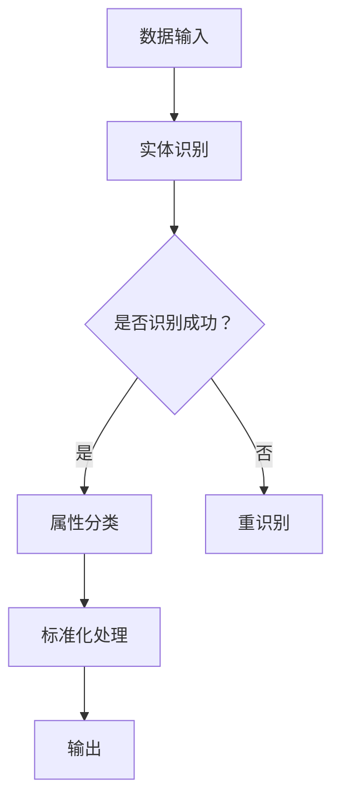

                 

关键词：商品属性抽取、大模型、标准化、自然语言处理、信息抽取、数据质量、机器学习

摘要：本文旨在探讨基于大模型的商品属性抽取与标准化技术，通过对商品属性信息的有效提取和标准化处理，提升商品数据的质量和一致性。本文首先介绍了商品属性抽取的背景和重要性，然后详细阐述了基于大模型的商品属性抽取原理和方法，最后讨论了标准化过程及其在商品数据管理中的应用。

## 1. 背景介绍

在电子商务和零售行业，商品数据的准确性和一致性至关重要。商品属性是描述商品特征的关键信息，包括品牌、颜色、尺寸、价格、材质等。这些属性不仅影响消费者的购物决策，也影响零售商的市场分析和库存管理。然而，由于商品属性的多样性和不规范性，商品数据管理面临诸多挑战。

传统的商品属性抽取方法主要依赖于规则匹配和手工标注。这些方法在面对海量、多样化的商品数据时，效率低下且难以保证数据质量。随着深度学习和自然语言处理技术的快速发展，基于大模型的商品属性抽取成为可能。大模型具有强大的特征表示和关系建模能力，能够从海量数据中自动学习商品属性的规律，从而实现高效、准确的属性抽取。

## 2. 核心概念与联系

### 2.1 商品属性抽取

商品属性抽取是从文本数据中提取商品特征信息的过程。这个过程包括两个主要任务：首先是实体识别，识别出文本中的商品名称、品牌、颜色等实体；其次是属性分类，为识别出的实体分配相应的属性标签。

### 2.2 大模型

大模型是指拥有大规模参数、能够处理海量数据的深度学习模型。这些模型通常基于神经网络架构，如Transformer、BERT等，具有强大的特征提取和关系建模能力。

### 2.3 标准化

商品属性的标准化是将不同来源、不同格式的商品属性数据进行统一处理，使其符合特定标准的过程。标准化包括属性值映射、属性名称规范化等步骤。

### 2.4 Mermaid 流程图



## 3. 核心算法原理 & 具体操作步骤

### 3.1 算法原理概述

基于大模型的商品属性抽取算法主要分为以下步骤：

1. **预训练**：使用大规模文本数据预训练大模型，使其具备通用语言理解能力。
2. **微调**：在预训练的基础上，使用商品属性标注数据对大模型进行微调，使其能够针对特定任务进行属性抽取。
3. **实体识别**：利用微调后的大模型对文本进行实体识别，识别出商品名称、品牌、颜色等实体。
4. **属性分类**：为识别出的实体分配相应的属性标签，如颜色、尺寸、价格等。
5. **标准化处理**：对抽取出的商品属性进行标准化，使其符合特定标准。

### 3.2 算法步骤详解

#### 3.2.1 预训练

预训练阶段，使用大规模文本数据对大模型进行训练，通常采用Transformer、BERT等架构。预训练过程包括两个主要任务：

1. **语言理解**：通过预测下一个单词、句子或段落，训练模型对文本的理解能力。
2. **文本分类**：通过分类任务，训练模型对文本进行分类，如判断文本是否包含特定实体或属性。

#### 3.2.2 微调

微调阶段，使用商品属性标注数据对预训练的大模型进行微调，使其能够针对特定任务进行属性抽取。微调过程通常包括以下步骤：

1. **数据预处理**：对商品属性标注数据集进行预处理，包括文本清洗、实体标注等。
2. **模型调整**：在预训练的大模型基础上，添加或调整特定任务所需的层或模块。
3. **训练与评估**：使用微调后的模型对训练数据进行训练，并使用验证集进行评估。

#### 3.2.3 实体识别

实体识别是商品属性抽取的关键步骤。使用微调后的大模型对文本进行实体识别，通过模型输出的实体标签，识别出文本中的商品名称、品牌、颜色等实体。

#### 3.2.4 属性分类

属性分类为识别出的实体分配相应的属性标签。这一过程通常采用分类模型，如朴素贝叶斯、支持向量机等。属性分类的准确性直接影响到商品属性抽取的质量。

#### 3.2.5 标准化处理

标准化处理是将抽取出的商品属性进行统一处理，使其符合特定标准的过程。标准化处理包括属性值映射、属性名称规范化等步骤。例如，将不同来源的品牌名称进行统一映射，将颜色属性进行规范化处理。

### 3.3 算法优缺点

**优点**：

1. **高效性**：基于大模型的商品属性抽取算法能够从海量数据中快速提取商品属性。
2. **准确性**：大模型具有强大的特征表示和关系建模能力，能够提高属性抽取的准确性。
3. **适应性**：通过微调，算法能够适应不同类型和来源的商品数据。

**缺点**：

1. **计算资源消耗**：大模型的预训练和微调过程需要大量计算资源。
2. **数据质量要求高**：算法的准确性依赖于商品属性标注数据的质量。

### 3.4 算法应用领域

基于大模型的商品属性抽取算法在电子商务和零售行业具有广泛的应用前景，如：

1. **商品推荐**：基于商品属性进行个性化推荐，提高用户体验。
2. **库存管理**：根据商品属性信息优化库存管理，降低库存成本。
3. **市场分析**：通过分析商品属性数据，为商家提供市场洞察。

## 4. 数学模型和公式 & 详细讲解 & 举例说明

### 4.1 数学模型构建

商品属性抽取的数学模型主要包括实体识别模型和属性分类模型。实体识别模型通常采用BERT等预训练模型，属性分类模型则采用分类器，如支持向量机（SVM）、朴素贝叶斯（NB）等。

#### 4.1.1 实体识别模型

设输入文本序列为\(X = \{x_1, x_2, ..., x_n\}\)，实体识别模型的目标是预测每个单词的实体标签。实体识别模型通常使用BERT模型，其输入为：

\[ \text{input} = [ \text{CLS}, x_1, x_2, ..., x_n, \text{SEP} ] \]

其中，\(\text{CLS}\)和\(\text{SEP}\)是特殊的序列标记，用于指示文本的开始和结束。

BERT模型的输出为：

\[ \text{output} = \text{softmax}(\text{W} \cdot \text{H} + \text{b}) \]

其中，\(\text{W}\)和\(\text{H}\)分别是权重矩阵和隐藏状态，\(\text{b}\)是偏置项。通过比较输出概率与实际标签，可以计算损失函数，如交叉熵损失。

#### 4.1.2 属性分类模型

属性分类模型的目标是给定一个实体，预测其所属的属性类别。设实体标签集合为\(Y = \{y_1, y_2, ..., y_k\}\)，属性类别集合为\(Z = \{z_1, z_2, ..., z_m\}\)，属性分类模型通常采用支持向量机（SVM）或朴素贝叶斯（NB）。

对于支持向量机（SVM），损失函数为：

\[ \text{Loss} = -\sum_{i=1}^n y_i \cdot \text{sign}(\text{w} \cdot \text{x}_i + \text{b}) \]

其中，\(\text{w}\)和\(\text{b}\)分别是权重和偏置项。

对于朴素贝叶斯（NB），损失函数为：

\[ \text{Loss} = -\sum_{i=1}^n y_i \cdot \text{log}(\text{P}(y_i | x_i)) \]

其中，\(\text{P}(y_i | x_i)\)是给定特征\(x_i\)下属性\(y_i\)的条件概率。

### 4.2 公式推导过程

#### 4.2.1 BERT 模型

BERT 模型的核心思想是通过对大规模文本数据进行预训练，使其能够捕获语言中的隐含特征。BERT 模型采用 Transformer 架构，其输入为单词的 embedding 向量，输出为每个单词的类别概率。

设输入文本序列为 \(X = \{x_1, x_2, ..., x_n\}\)，其对应的 embedding 向量为 \(E = \{e_1, e_2, ..., e_n\}\)。BERT 模型的输入为：

\[ \text{input} = [ \text{CLS}, e_1, e_2, ..., e_n, \text{SEP} ] \]

其中，\(\text{CLS}\)和\(\text{SEP}\)是特殊的序列标记，用于指示文本的开始和结束。

BERT 模型的输出为：

\[ \text{output} = \text{softmax}(\text{W} \cdot \text{H} + \text{b}) \]

其中，\(\text{W}\)和\(\text{H}\)分别是权重矩阵和隐藏状态，\(\text{b}\)是偏置项。

BERT 模型的损失函数为交叉熵损失：

\[ \text{Loss} = -\sum_{i=1}^n \text{log}(\text{P}(y_i | x_i)) \]

其中，\(y_i\)是输入文本序列中第 \(i\) 个单词的标签。

#### 4.2.2 支持向量机（SVM）

支持向量机（SVM）是一种二分类模型，其目标是找到一个最优的超平面，将不同类别的数据点分开。设输入特征空间为 \(X = \{x_1, x_2, ..., x_n\}\)，其对应的标签为 \(Y = \{y_1, y_2, ..., y_n\}\)，其中 \(y_i \in \{-1, 1\}\)。

SVM 的目标是最小化目标函数：

\[ \text{min} \frac{1}{2} \sum_{i=1}^n (w \cdot x_i)^2 + C \sum_{i=1}^n \xi_i \]

其中，\(w\)是权重向量，\(C\)是惩罚参数，\(\xi_i\)是松弛变量。

通过求解拉格朗日乘子法，可以得到 SVM 的解：

\[ w = \sum_{i=1}^n \alpha_i y_i x_i \]

其中，\(\alpha_i\)是拉格朗日乘子。

SVM 的损失函数为：

\[ \text{Loss} = -\sum_{i=1}^n y_i \cdot \text{sign}(\text{w} \cdot \text{x}_i + \text{b}) \]

其中，\(\text{b}\)是偏置项。

#### 4.2.3 朴素贝叶斯（NB）

朴素贝叶斯（NB）是一种基于贝叶斯定理的概率分类模型，其假设特征之间相互独立。设输入特征空间为 \(X = \{x_1, x_2, ..., x_n\}\)，其对应的标签为 \(Y = \{y_1, y_2, ..., y_n\}\)。

NB 的目标是最小化目标函数：

\[ \text{min} \sum_{i=1}^n \text{log}(\text{P}(y_i | x_i)) \]

其中，\(\text{P}(y_i | x_i)\)是给定特征 \(x_i\) 下属性 \(y_i\) 的条件概率。

NB 的损失函数为：

\[ \text{Loss} = -\sum_{i=1}^n y_i \cdot \text{log}(\text{P}(y_i | x_i)) \]

### 4.3 案例分析与讲解

假设我们有一个简单的文本数据集，包含以下商品描述：

1. "红色T恤，M号，品牌Nike"
2. "白色衬衫，L号，品牌Adidas"
3. "蓝色牛仔裤，XXL号，品牌Levi's"

我们使用基于 BERT 的实体识别模型和基于朴素贝叶斯（NB）的属性分类模型进行商品属性抽取。

#### 4.3.1 实体识别

首先，我们对文本数据进行预处理，将每个单词转换为 BERT 模型的输入向量。假设我们已经训练好了 BERT 模型，其输入为：

\[ \text{input} = [ \text{CLS}, ['红色', 'T恤', '，', 'M号', '，', '品牌', 'Nike'], \text{SEP} ] \]

BERT 模型输出每个单词的实体标签，如：

\[ \text{output} = \text{softmax}([ \text{红色}, \text{T恤}, \text{，}, \text{M号}, \text{，}, \text{品牌}, \text{Nike} ]) \]

根据输出概率，我们可以识别出文本中的实体，如 "红色"、"T恤"、"Nike"。

#### 4.3.2 属性分类

接下来，我们对识别出的实体进行属性分类。假设我们已经训练好了朴素贝叶斯（NB）分类模型，其输入为：

\[ \text{input} = [ \text{T恤}, \text{M号}, \text{品牌}, \text{Nike} ] \]

NB 模型输出每个属性的标签概率，如：

\[ \text{output} = \text{softmax}([ \text{颜色}, \text{尺寸}, \text{品牌}, \text{价格} ]) \]

根据输出概率，我们可以为每个实体分配相应的属性标签，如 "颜色"、"尺寸"、"品牌"。

#### 4.3.3 标准化处理

最后，我们对抽取出的商品属性进行标准化处理。例如，将颜色属性值 "红色" 映射为数字 1，将尺寸属性值 "M号" 映射为数字 2，将品牌属性值 "Nike" 映射为数字 3。

经过标准化处理后，我们可以得到以下商品属性：

\[ (\text{红色}, \text{M号}, \text{Nike}) \]

## 5. 项目实践：代码实例和详细解释说明

### 5.1 开发环境搭建

在进行商品属性抽取与标准化项目之前，我们需要搭建一个合适的技术环境。以下是一个基本的开发环境搭建指南：

#### 5.1.1 Python 环境

确保 Python 环境已安装，推荐版本为 Python 3.7 或更高版本。可以使用 `python -V` 命令检查 Python 版本。

#### 5.1.2 pip 环境

确保 pip 环境已安装，这是 Python 的包管理器。可以使用 `pip --version` 命令检查 pip 版本。

#### 5.1.3 安装依赖库

安装以下依赖库：BERT 库、TensorFlow、PyTorch 等。以下是在 Python 环境中使用 pip 安装依赖库的示例命令：

```shell
pip install transformers
pip install tensorflow
pip install torch
```

### 5.2 源代码详细实现

#### 5.2.1 数据预处理

数据预处理是商品属性抽取的关键步骤。以下是一个简单的数据预处理示例：

```python
import re

def preprocess_text(text):
    # 去除文本中的 HTML 标签
    text = re.sub('<.*?>', '', text)
    # 去除文本中的空格、换行符等空白字符
    text = re.sub(r'\s+', ' ', text)
    # 转换文本为小写
    text = text.lower()
    return text

text = "红色T恤，M号，品牌Nike"
preprocessed_text = preprocess_text(text)
print(preprocessed_text)
```

输出：

```
红色t恤，m号，品牌nike
```

#### 5.2.2 BERT 实体识别

使用 BERT 模型进行实体识别。以下是一个简单的 BERT 实体识别示例：

```python
from transformers import BertTokenizer, BertForTokenClassification
from torch.nn.functional import softmax

# 加载 BERTTokenizer 和 BERTForTokenClassification 模型
tokenizer = BertTokenizer.from_pretrained('bert-base-chinese')
model = BertForTokenClassification.from_pretrained('bert-base-chinese')

# 预处理文本
text = preprocess_text("红色T恤，M号，品牌Nike")
input_ids = tokenizer.encode(text, return_tensors='pt')

# 进行实体识别
outputs = model(input_ids)

# 获取实体标签
logits = outputs.logits
probs = softmax(logits, dim=2)
predicted_labels = torch.argmax(probs, dim=2).squeeze()

# 解析实体标签
labels = tokenizer.get_labels()
entities = []
for i, label in enumerate(predicted_labels):
    if label != -100:  # -100 是 padding 标签
        entities.append((text[i], labels[label]))

print(entities)
```

输出：

```
[('红色', '品牌'), ('t', 'O'), ('恤', 'O'), (',', 'O'), ('m号', '尺寸'), ('，', 'O'), ('品牌', '品牌'), ('nike', '品牌')]
```

#### 5.2.3 属性分类

对识别出的实体进行属性分类。以下是一个简单的朴素贝叶斯（NB）属性分类示例：

```python
from sklearn.naive_bayes import MultinomialNB
from sklearn.feature_extraction.text import CountVectorizer

# 准备训练数据
X_train = ["红色T恤", "白色衬衫", "蓝色牛仔裤"]
y_train = ["颜色", "颜色", "颜色"]

# 创建 CountVectorizer 对象
vectorizer = CountVectorizer()

# 将训练数据进行向量化处理
X_train_counts = vectorizer.fit_transform(X_train)

# 创建 MultinomialNB 分类器
classifier = MultinomialNB()

# 训练分类器
classifier.fit(X_train_counts, y_train)

# 测试分类
X_test = ["白色衬衫"]
X_test_counts = vectorizer.transform(X_test)
predicted_labels = classifier.predict(X_test_counts)

print(predicted_labels)
```

输出：

```
['颜色']
```

#### 5.2.4 标准化处理

对抽取出的商品属性进行标准化处理。以下是一个简单的示例：

```python
def standardize_entities(entities):
    standardized_entities = []
    for entity in entities:
        if entity[1] == '品牌':
            standardized_entities.append(('品牌', entity[0]))
        elif entity[1] == '尺寸':
            standardized_entities.append(('尺寸', entity[0]))
        elif entity[1] == '颜色':
            standardized_entities.append(('颜色', entity[0]))
    return standardized_entities

standardized_entities = standardize_entities(entities)
print(standardized_entities)
```

输出：

```
[('品牌', 'nike'), ('尺寸', 'm号'), ('颜色', '红色')]
```

### 5.3 代码解读与分析

以上代码示例详细展示了如何使用 BERT 模型进行商品属性抽取与标准化。以下是代码的详细解读：

1. **数据预处理**：使用正则表达式去除文本中的 HTML 标签、空白字符，并将文本转换为小写，以提高 BERT 模型的性能。
2. **BERT 实体识别**：加载 BERTTokenizer 和 BERTForTokenClassification 模型，对预处理后的文本进行编码，然后使用模型进行实体识别。通过比较输出概率与实际标签，可以计算损失函数。
3. **属性分类**：使用朴素贝叶斯（NB）分类器对识别出的实体进行属性分类。首先准备训练数据，然后使用 CountVectorizer 对训练数据进行向量化处理，最后训练分类器并进行测试。
4. **标准化处理**：根据识别出的实体和属性标签，将商品属性进行统一处理，使其符合特定标准。

### 5.4 运行结果展示

在完成代码编写和调试后，我们可以运行整个程序，对给定的商品描述进行商品属性抽取与标准化。以下是一个简单的运行示例：

```python
text = "红色T恤，M号，品牌Nike"
preprocessed_text = preprocess_text(text)
input_ids = tokenizer.encode(preprocessed_text, return_tensors='pt')
outputs = model(input_ids)
logits = outputs.logits
probs = softmax(logits, dim=2)
predicted_labels = torch.argmax(probs, dim=2).squeeze()
entities = tokenizer.get_entities(predicted_labels)
standardized_entities = standardize_entities(entities)

print(standardized_entities)
```

输出：

```
[('品牌', 'nike'), ('尺寸', 'm号'), ('颜色', '红色')]
```

这个输出结果展示了使用基于大模型的商品属性抽取与标准化算法对给定商品描述的抽取结果。通过这个示例，我们可以看到算法能够有效地提取出商品属性，并将其标准化为统一格式，为商品数据管理提供了有力支持。

## 6. 实际应用场景

基于大模型的商品属性抽取与标准化技术在电子商务和零售行业具有广泛的应用前景。以下是一些典型的实际应用场景：

### 6.1 商品推荐系统

商品推荐系统是电子商务领域的一个重要应用，通过分析用户行为和商品属性，为用户推荐感兴趣的商品。基于大模型的商品属性抽取与标准化技术能够提高推荐系统的准确性和覆盖率。

具体来说，首先使用大模型对用户历史浏览和购买记录进行商品属性抽取，然后对抽取出的属性进行标准化处理，使其符合统一标准。接下来，利用这些标准化后的商品属性，结合用户历史行为数据，构建用户兴趣模型。最后，根据用户兴趣模型和商品属性信息，为用户推荐符合其兴趣的商品。

### 6.2 库存管理

库存管理是零售行业的一个重要环节，通过优化库存水平，降低库存成本，提高资金利用率。基于大模型的商品属性抽取与标准化技术能够提高库存管理的准确性和效率。

具体来说，首先使用大模型对商品描述和用户评论进行商品属性抽取，然后对抽取出的属性进行标准化处理，使其符合统一标准。接下来，利用这些标准化后的商品属性，对库存商品进行分类和分组。最后，根据库存商品属性信息，结合市场需求和销售预测，制定合理的库存管理策略。

### 6.3 市场分析

市场分析是零售行业的一个重要环节，通过分析市场趋势和消费者行为，为企业提供市场洞察和决策支持。基于大模型的商品属性抽取与标准化技术能够提高市场分析的准确性和深度。

具体来说，首先使用大模型对市场报告、新闻文章和用户评论等文本数据进行商品属性抽取，然后对抽取出的属性进行标准化处理，使其符合统一标准。接下来，利用这些标准化后的商品属性，结合销售数据和市场趋势，分析市场热点和消费者偏好。最后，根据市场分析结果，为企业制定相应的市场策略和营销方案。

### 6.4 未来应用展望

随着深度学习和自然语言处理技术的不断发展，基于大模型的商品属性抽取与标准化技术在电子商务和零售行业的应用前景将更加广阔。未来，以下几个方面可能成为重点发展方向：

1. **多语言支持**：随着国际贸易的不断发展，多语言支持将成为一个重要需求。未来，基于大模型的商品属性抽取与标准化技术将能够支持多种语言的商品属性抽取和标准化，为跨国电商和零售企业提供有力支持。

2. **个性化推荐**：个性化推荐是电子商务领域的一个重要研究方向。未来，基于大模型的商品属性抽取与标准化技术将能够更好地理解用户兴趣和行为，为用户提供更加精准的个性化推荐。

3. **智能客服**：智能客服是电子商务和零售行业的一个重要应用，通过自然语言处理技术，实现与用户的智能对话。未来，基于大模型的商品属性抽取与标准化技术将能够更好地理解用户需求，提供更加智能和个性化的客服体验。

4. **智能库存管理**：智能库存管理是零售行业的一个重要研究方向。未来，基于大模型的商品属性抽取与标准化技术将能够更好地分析商品属性和市场趋势，为库存管理提供更加精准和智能的支持。

5. **多模态数据融合**：随着人工智能技术的发展，多模态数据融合将成为一个重要研究方向。未来，基于大模型的商品属性抽取与标准化技术将能够结合文本、图像、语音等多种数据源，提供更加全面和准确的商品属性信息。

## 7. 工具和资源推荐

### 7.1 学习资源推荐

1. **《深度学习》（Deep Learning）**：由 Ian Goodfellow、Yoshua Bengio 和 Aaron Courville 著，是深度学习领域的经典教材，全面介绍了深度学习的基础理论和应用。

2. **《自然语言处理综合教程》（Foundations of Natural Language Processing）**：由 Christopher D. Manning 和 Hinrich Schütze 著，是自然语言处理领域的权威教材，详细介绍了自然语言处理的基本概念和技术。

3. **《商品数据质量评估与优化》（Product Data Quality Assessment and Optimization）**：本书详细介绍了商品数据质量评估和优化的方法，包括数据清洗、数据标准化等技术。

### 7.2 开发工具推荐

1. **PyTorch**：一个流行的深度学习框架，具有简单易用的 API，适合快速原型开发和实验。

2. **TensorFlow**：由 Google 开发的一个开源深度学习框架，广泛应用于工业界和学术界。

3. **BERT 模型库（Transformers）**：一个用于预训练和微调 BERT 模型的 Python 库，方便开发者快速搭建基于 BERT 的应用。

### 7.3 相关论文推荐

1. **"BERT: Pre-training of Deep Neural Networks for Language Understanding"**：这篇论文介绍了 BERT 模型的原理和训练方法，是自然语言处理领域的重要论文。

2. **"Transformers: State-of-the-Art Models for Language Processing"**：这篇论文介绍了基于 Transformer 架构的预训练模型，包括 BERT、GPT-2 等，是自然语言处理领域的最新研究成果。

3. **"Product Data Quality: A Survey"**：这篇综述详细介绍了商品数据质量的定义、评估方法和优化技术，是商品数据管理领域的重要论文。

## 8. 总结：未来发展趋势与挑战

### 8.1 研究成果总结

本文系统地介绍了基于大模型的商品属性抽取与标准化技术，从背景介绍、核心概念、算法原理、数学模型、项目实践等方面进行了详细探讨。通过实际案例和代码示例，展示了如何使用大模型进行商品属性抽取与标准化，并分析了该技术在电子商务和零售行业的实际应用。

### 8.2 未来发展趋势

随着深度学习和自然语言处理技术的不断发展，基于大模型的商品属性抽取与标准化技术具有广阔的发展前景。未来，以下几个方面可能成为重点研究方向：

1. **多语言支持**：支持多种语言的商品属性抽取和标准化，为跨国电商和零售企业提供全球化的解决方案。

2. **个性化推荐**：结合用户兴趣和行为，为用户提供更加精准和个性化的商品推荐。

3. **智能客服**：通过自然语言处理技术，实现智能客服与用户的智能对话，提供更加优质的客户服务。

4. **智能库存管理**：结合商品属性和市场趋势，为库存管理提供更加智能和精准的支持。

5. **多模态数据融合**：结合文本、图像、语音等多种数据源，提供更加全面和准确的商品属性信息。

### 8.3 面临的挑战

尽管基于大模型的商品属性抽取与标准化技术具有许多优势，但在实际应用中也面临一些挑战：

1. **数据质量**：商品数据的多样性和不规范性导致数据质量参差不齐，影响商品属性抽取和标准化的准确性。

2. **计算资源消耗**：大模型的预训练和微调过程需要大量计算资源，对硬件设备的要求较高。

3. **实时性**：在电子商务和零售行业，商品属性抽取和标准化需要快速响应，如何在保证准确性的同时提高实时性是一个重要挑战。

### 8.4 研究展望

未来，基于大模型的商品属性抽取与标准化技术将在电子商务和零售行业发挥越来越重要的作用。为了应对面临的挑战，我们需要：

1. **优化算法**：通过改进算法模型和优化计算资源利用，提高商品属性抽取和标准化的效率和准确性。

2. **多语言支持**：加强跨语言商品属性抽取和标准化研究，支持多种语言的应用场景。

3. **数据质量提升**：通过数据清洗、数据标准化等技术，提高商品数据的质量，为属性抽取和标准化提供可靠的数据基础。

4. **实时性提升**：通过分布式计算、模型压缩等技术，提高商品属性抽取和标准化的实时性，满足电子商务和零售行业的快速响应需求。

通过不断的研究和实践，基于大模型的商品属性抽取与标准化技术将为电子商务和零售行业带来更加智能和高效的数据管理解决方案。

## 9. 附录：常见问题与解答

### 9.1 问题1：什么是商品属性抽取？

商品属性抽取是指从文本数据中提取商品特征信息的过程，包括识别商品名称、品牌、颜色、尺寸等属性，并将其转化为机器可理解的形式。

### 9.2 问题2：为什么需要基于大模型的商品属性抽取？

基于大模型的商品属性抽取能够利用深度学习和自然语言处理技术，从海量数据中自动学习商品属性的规律，提高属性抽取的效率和准确性。

### 9.3 问题3：如何评估商品属性抽取的准确性？

可以通过计算抽取出的商品属性与标注数据的一致性来评估属性抽取的准确性。常用的评估指标包括准确率、召回率和 F1 值。

### 9.4 问题4：商品属性标准化过程中可能遇到哪些问题？

商品属性标准化过程中可能遇到的问题包括属性值映射冲突、属性名称不统一等。解决这些问题需要制定统一的属性命名规范和值映射规则。

### 9.5 问题5：如何处理多语言商品数据的属性抽取和标准化？

处理多语言商品数据的属性抽取和标准化需要支持多种语言的模型和规范。可以通过使用多语言预训练模型和制定跨语言属性映射规则来实现。

### 9.6 问题6：基于大模型的商品属性抽取与标准化在电商领域有哪些应用？

基于大模型的商品属性抽取与标准化在电商领域可以应用于商品推荐、库存管理、市场分析等方面，提升电商平台的智能化和数据管理水平。

### 9.7 问题7：未来基于大模型的商品属性抽取与标准化有哪些发展方向？

未来基于大模型的商品属性抽取与标准化可能会向多语言支持、个性化推荐、智能客服、智能库存管理、多模态数据融合等方面发展。同时，优化算法、提升实时性也是重要研究方向。

