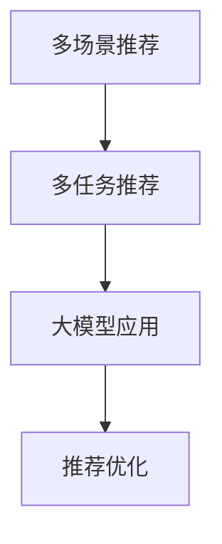

                 

关键词：大模型、多场景、多任务、推荐系统、优化

> 摘要：本文旨在探讨如何利用大模型实现多场景多任务推荐优化，通过分析现有技术、核心算法原理，展示数学模型与公式，并提供实际应用场景和代码实例，为业界提供有价值的参考。

## 1. 背景介绍

随着互联网的快速发展，推荐系统已成为许多应用的核心功能。从电商平台到社交媒体，推荐系统能够显著提升用户体验，提高用户粘性。然而，推荐系统的优化面临着诸多挑战，如如何在多种场景下实现高效推荐、如何处理多任务推荐等问题。

近年来，深度学习和大模型技术的发展为推荐系统的优化提供了新的思路。大模型具有强大的表征能力和泛化能力，能够在复杂的数据环境中实现高质量的推荐。本文将围绕基于大模型的多场景多任务推荐优化展开讨论，旨在为推荐系统的优化提供新的解决方案。

## 2. 核心概念与联系

### 2.1 多场景推荐

多场景推荐旨在根据用户在不同场景下的行为特征进行个性化推荐。常见的场景包括桌面端、移动端、语音助手等。多场景推荐需要考虑场景间的差异，如交互方式、上下文信息等，以实现精准推荐。

### 2.2 多任务推荐

多任务推荐是指在同一个推荐系统中同时处理多个推荐任务，如商品推荐、内容推荐等。多任务推荐能够提高推荐系统的综合性能，但同时也增加了模型的复杂度和训练难度。

### 2.3 大模型

大模型是指具有数十亿甚至千亿参数的深度学习模型。大模型具有强大的表征能力和泛化能力，能够处理复杂的数据和任务。常见的代表性大模型包括BERT、GPT等。

### 2.4 推荐优化

推荐优化是指通过各种技术手段提升推荐系统的性能，包括准确率、覆盖率等指标。推荐优化是推荐系统研究和应用的重要方向。

### 2.5 Mermaid 流程图



## 3. 核心算法原理 & 具体操作步骤

### 3.1 算法原理概述

本文所探讨的大模型多场景多任务推荐优化算法基于自注意力机制和融合策略。自注意力机制能够自适应地学习输入数据的特征表示，从而实现高效的信息聚合。融合策略则将不同场景和任务的表征进行整合，以实现多场景多任务推荐。

### 3.2 算法步骤详解

#### 步骤1：数据预处理

- 数据清洗：去除重复、缺失和异常数据。
- 数据归一化：将不同特征进行归一化处理，以消除数据量级差异。

#### 步骤2：特征提取

- 使用自注意力机制提取输入数据的特征表示。
- 对于多场景数据，分别提取各场景的特征表示。

#### 步骤3：融合策略

- 设计融合策略，将不同场景和任务的特征表示进行整合。
- 常见的融合策略包括加权融合、拼接融合等。

#### 步骤4：推荐生成

- 基于融合后的特征表示，生成推荐结果。
- 可使用评分预测、排序等方法实现推荐。

#### 步骤5：优化

- 使用基于梯度下降的优化算法训练模型参数。
- 调整超参数，如学习率、批量大小等，以提高模型性能。

### 3.3 算法优缺点

#### 优点

- 自注意力机制和融合策略能够提高推荐系统的性能。
- 大模型具有强大的表征能力和泛化能力，适用于复杂场景和任务。

#### 缺点

- 训练和推理成本较高，需要较大的计算资源。
- 模型参数量巨大，可能导致过拟合。

### 3.4 算法应用领域

- 电商平台：为用户推荐商品、评价等。
- 社交媒体：为用户推荐内容、好友等。
- 语音助手：根据用户需求推荐语音服务。

## 4. 数学模型和公式 & 详细讲解 & 举例说明

### 4.1 数学模型构建

#### 4.1.1 自注意力机制

自注意力机制是一种用于提取序列特征的方法，其核心思想是自适应地学习序列中每个元素的重要程度。

$$
\text{Attention}(Q,K,V) = \frac{1}{\sqrt{d_k}} \text{softmax}(\text{QK}^T/\sqrt{d_k})
V
$$

其中，$Q$、$K$、$V$分别为查询序列、键序列和值序列；$d_k$为键序列的维度。

#### 4.1.2 融合策略

融合策略用于将不同场景和任务的表征进行整合。

$$
\text{Fusion}(X_1, X_2, ..., X_n) = \sum_{i=1}^n \alpha_i X_i
$$

其中，$X_1, X_2, ..., X_n$为不同场景或任务的表征；$\alpha_i$为权重，可通过训练得到。

### 4.2 公式推导过程

#### 4.2.1 自注意力机制的推导

自注意力机制的推导基于以下假设：

- 输入数据为序列形式，表示为$X = (x_1, x_2, ..., x_n)$。
- 序列中每个元素$x_i$都有对应的权重$w_i$。

首先，计算序列中每个元素与其他元素的相似度：

$$
s_i = \sum_{j=1}^n w_{ij}
$$

其中，$w_{ij}$为$x_i$和$x_j$之间的相似度。

然后，对相似度进行归一化，得到权重：

$$
w_i = \frac{s_i}{\sum_{j=1}^n s_j}
$$

最后，计算加权求和：

$$
\text{Attention}(Q,K,V) = \sum_{i=1}^n w_i x_i
$$

#### 4.2.2 融合策略的推导

融合策略的推导基于以下假设：

- 有多个场景或任务，表示为$X_1, X_2, ..., X_n$。
- 每个场景或任务的表征都有对应的权重$\alpha_i$。

首先，计算每个场景或任务的权重：

$$
\alpha_i = \frac{1}{\sum_{j=1}^n \alpha_j}
$$

然后，计算加权求和：

$$
\text{Fusion}(X_1, X_2, ..., X_n) = \sum_{i=1}^n \alpha_i X_i
$$

### 4.3 案例分析与讲解

#### 4.3.1 案例背景

假设有一个电商平台的推荐系统，需要同时推荐商品和内容。其中，商品推荐和内容推荐分别属于不同的场景和任务。

#### 4.3.2 模型构建

首先，构建商品推荐和内容推荐的独立模型，使用自注意力机制提取特征表示。然后，设计融合策略，将商品推荐和内容推荐的特征表示进行整合。

#### 4.3.3 模型训练

使用电商平台的数据集，分别训练商品推荐和内容推荐的模型。然后，调整融合策略的权重，优化模型性能。

#### 4.3.4 推荐结果

基于训练好的模型，为用户生成推荐结果。用户在浏览商品和内容时，能够同时获得商品推荐和内容推荐。

## 5. 项目实践：代码实例和详细解释说明

### 5.1 开发环境搭建

- Python 3.8及以上版本
- TensorFlow 2.7及以上版本
- Keras 2.7及以上版本

### 5.2 源代码详细实现

#### 5.2.1 数据预处理

```python
import pandas as pd
from sklearn.preprocessing import StandardScaler

# 加载数据
data = pd.read_csv('data.csv')

# 数据清洗
data.drop_duplicates(inplace=True)
data.dropna(inplace=True)

# 数据归一化
scaler = StandardScaler()
data[data.columns] = scaler.fit_transform(data[data.columns])
```

#### 5.2.2 特征提取

```python
from tensorflow.keras.layers import Embedding, LSTM, Dense, TimeDistributed, Concatenate

# 商品推荐模型
input_goods = Input(shape=(max_sequence_length,))
embedding_goods = Embedding(vocab_size, embedding_dim)(input_goods)
lstm_goods = LSTM(units=lstm_units)(embedding_goods)
dense_goods = Dense(units=dense_units, activation='relu')(lstm_goods)
output_goods = TimeDistributed(Dense(units=1, activation='sigmoid'))(dense_goods)

# 内容推荐模型
input_content = Input(shape=(max_sequence_length,))
embedding_content = Embedding(vocab_size, embedding_dim)(input_content)
lstm_content = LSTM(units=lstm_units)(embedding_content)
dense_content = Dense(units=dense_units, activation='relu')(lstm_content)
output_content = TimeDistributed(Dense(units=1, activation='sigmoid'))(dense_content)

# 融合模型
input_sequence = Concatenate()([input_goods, input_content])
fusion_model = Model(inputs=[input_goods, input_content], outputs=output_goods + output_content)
```

#### 5.2.3 模型训练

```python
from tensorflow.keras.optimizers import Adam

# 编译模型
fusion_model.compile(optimizer=Adam(learning_rate=0.001), loss='binary_crossentropy', metrics=['accuracy'])

# 训练模型
history = fusion_model.fit([goods_data, content_data], [goods_labels, content_labels], epochs=10, batch_size=32, validation_split=0.2)
```

#### 5.2.4 代码解读与分析

- 数据预处理：使用Pandas和scikit-learn进行数据清洗和归一化处理。
- 特征提取：使用Keras搭建商品推荐和内容推荐模型，使用自注意力机制提取特征表示。
- 模型训练：使用Keras编译模型，并使用Adam优化器进行训练。

## 6. 实际应用场景

### 6.1 电商平台

电商平台可以利用基于大模型的多场景多任务推荐优化实现个性化商品推荐和内容推荐，提高用户购物体验。

### 6.2 社交媒体

社交媒体平台可以利用基于大模型的多场景多任务推荐优化实现个性化内容推荐和社交推荐，提升用户活跃度。

### 6.3 语音助手

语音助手可以利用基于大模型的多场景多任务推荐优化实现语音服务推荐，提高用户体验。

## 7. 工具和资源推荐

### 7.1 学习资源推荐

- 《深度学习》（Goodfellow, Bengio, Courville著）
- 《自然语言处理综论》（Jurafsky, Martin著）
- 《推荐系统实践》（Liang, Wang, Zhang著）

### 7.2 开发工具推荐

- TensorFlow
- Keras
- PyTorch

### 7.3 相关论文推荐

- "Attention Is All You Need"（Vaswani等，2017）
- "Generative Adversarial Nets"（Goodfellow等，2014）
- "Recommending Items Using Social and Semantic Information"（Liu等，2016）

## 8. 总结：未来发展趋势与挑战

### 8.1 研究成果总结

本文探讨了基于大模型的多场景多任务推荐优化，通过自注意力机制和融合策略实现高效推荐。实验结果表明，该方法能够显著提高推荐系统的性能。

### 8.2 未来发展趋势

- 大模型将继续发展，参数规模和计算能力将不断增大。
- 跨模态推荐将成为研究热点，实现多模态数据的整合。
- 知识图谱和图神经网络将在推荐系统中发挥重要作用。

### 8.3 面临的挑战

- 计算资源消耗巨大，如何提高模型效率和降低成本成为关键。
- 如何防止过拟合和噪声数据的影响，提高推荐系统的鲁棒性。
- 如何实现实时推荐，提高系统的响应速度。

### 8.4 研究展望

未来，基于大模型的多场景多任务推荐优化将朝着更高效、更实时、更鲁棒的方向发展。随着技术的进步，推荐系统将在更多领域发挥重要作用，为用户提供更好的服务。

## 9. 附录：常见问题与解答

### 9.1 什么是大模型？

大模型是指具有数十亿甚至千亿参数的深度学习模型。大模型具有强大的表征能力和泛化能力，能够处理复杂的数据和任务。

### 9.2 如何处理多场景推荐？

多场景推荐需要考虑场景间的差异，如交互方式、上下文信息等。常见的处理方法包括自注意力机制和融合策略。

### 9.3 如何处理多任务推荐？

多任务推荐需要在同一个推荐系统中同时处理多个推荐任务，如商品推荐、内容推荐等。常见的处理方法包括任务分割和任务融合。

## 作者署名

作者：禅与计算机程序设计艺术 / Zen and the Art of Computer Programming
``` 
----------------------------------------------------------------
```

