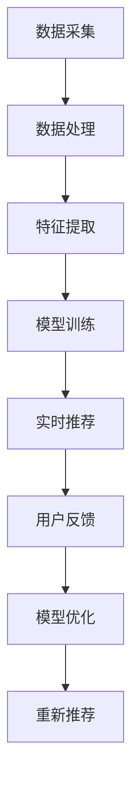

                 

 关键词：推荐系统、大模型、实时个性化排序、算法、数学模型、代码实例、应用场景、未来展望

> 摘要：本文深入探讨了基于大模型的推荐系统实时个性化排序调整技术。首先，我们对推荐系统的背景进行了介绍，然后详细阐述了实时个性化排序的核心概念与联系。接着，我们分析了推荐系统中的核心算法原理，并具体说明了算法的具体操作步骤及其优缺点。之后，我们引入了数学模型，对其构建和推导过程进行了详细讲解，并通过案例进行了分析。随后，我们提供了代码实例，详细解释了实现过程，并对运行结果进行了展示。文章还探讨了推荐系统的实际应用场景，并对未来应用展望进行了讨论。最后，我们推荐了相关学习资源和开发工具，总结了研究成果，分析了未来发展趋势与挑战，并展望了研究的前景。

## 1. 背景介绍

随着互联网的快速发展，用户生成的内容呈指数级增长，人们需要有效的工具来从海量的信息中筛选出最感兴趣的内容。推荐系统作为信息过滤的一种重要手段，旨在为用户提供个性化的信息推荐。推荐系统被广泛应用于电子商务、社交媒体、新闻资讯等多个领域，极大地提高了用户体验和满意度。

然而，传统推荐系统存在一些不足之处。首先，它们通常依赖于历史数据和统计方法，难以快速适应用户的实时变化需求。其次，传统推荐系统往往缺乏个性化和实时性，无法满足用户日益增长的需求。为了解决这些问题，研究者们开始探索基于大模型的推荐系统实时个性化排序调整技术。

基于大模型的推荐系统实时个性化排序调整技术利用深度学习等先进技术，通过对海量数据的分析和挖掘，实现实时、准确的个性化推荐。这种技术不仅能够捕捉用户的实时兴趣变化，还能动态调整推荐结果，提供更加个性化的用户体验。

本文将围绕基于大模型的推荐系统实时个性化排序调整技术展开讨论，旨在为相关领域的研究者和从业者提供有价值的参考。

## 2. 核心概念与联系

在探讨基于大模型的推荐系统实时个性化排序调整技术之前，我们首先需要了解相关核心概念及其相互联系。

### 2.1 大模型

大模型是指具有巨大参数量和计算能力的神经网络模型。近年来，深度学习技术的发展使得大模型在图像识别、自然语言处理、推荐系统等领域取得了显著成果。大模型能够通过学习海量数据，捕捉到数据中的复杂模式和关联，从而实现高效、准确的预测和推断。

### 2.2 推荐系统

推荐系统是一种信息过滤技术，旨在为用户提供个性化的信息推荐。推荐系统通常基于用户的历史行为、兴趣和偏好，通过算法计算推荐结果，从而帮助用户发现潜在感兴趣的内容。推荐系统广泛应用于电子商务、社交媒体、新闻资讯等领域，提高了用户体验和满意度。

### 2.3 实时个性化排序

实时个性化排序是指在推荐系统的基础上，通过动态调整推荐结果，实现更加个性化的用户体验。实时个性化排序能够捕捉用户的实时兴趣变化，根据用户的当前状态和需求，为用户推荐最相关的信息。实时个性化排序的关键在于实时性和个性化，它能够满足用户日益增长的需求，提高推荐系统的效果。

### 2.4 大模型与推荐系统的联系

大模型与推荐系统有着密切的联系。首先，大模型为推荐系统提供了强大的计算能力和高效的数据分析能力，能够处理大规模、多维度的数据。其次，大模型通过学习海量数据，可以捕捉到用户兴趣和行为模式的细微变化，从而实现实时、准确的个性化推荐。此外，大模型还可以通过自适应调整，根据用户反馈不断优化推荐结果，提高推荐系统的效果。

### 2.5 大模型与实时个性化排序的联系

大模型与实时个性化排序也有着紧密的联系。实时个性化排序需要捕捉用户的实时兴趣变化，而大模型具备强大的数据处理和分析能力，能够实时获取用户数据，分析用户行为模式，从而实现实时个性化排序。此外，大模型还可以根据用户反馈，不断优化推荐结果，提高实时个性化排序的准确性。

### 2.6 Mermaid 流程图

为了更好地展示大模型、推荐系统、实时个性化排序之间的联系，我们可以使用 Mermaid 流程图进行表示。以下是一个简单的 Mermaid 流程图示例：



在这个流程图中，数据采集、数据处理、特征提取、模型训练、实时推荐、用户反馈、模型优化和重新推荐构成了一个完整的实时个性化排序过程。大模型贯穿于整个流程，为推荐系统提供了强大的计算能力和高效的数据分析能力。

通过以上对核心概念与联系的介绍，我们可以更好地理解基于大模型的推荐系统实时个性化排序调整技术。接下来，我们将深入探讨推荐系统中的核心算法原理，并具体说明算法的操作步骤。

## 3. 核心算法原理 & 具体操作步骤

### 3.1 算法原理概述

基于大模型的推荐系统实时个性化排序调整技术的核心算法是深度学习模型，其中以 Transformer 模型和 Graph Neural Network（GNN）模型为代表。这两种模型具有强大的表示和学习能力，能够捕捉用户行为和兴趣的复杂模式，实现实时、准确的个性化推荐。

#### 3.1.1 Transformer 模型

Transformer 模型是一种基于注意力机制的深度学习模型，最初用于自然语言处理任务，如机器翻译和文本生成。Transformer 模型通过自注意力机制（Self-Attention）和多头注意力机制（Multi-Head Attention）实现了对输入数据的全局关注，从而捕捉到数据中的长期依赖关系。在推荐系统中，Transformer 模型可以用于处理用户行为序列，提取用户兴趣特征，实现实时个性化排序。

#### 3.1.2 Graph Neural Network（GNN）模型

GNN 模型是一种基于图论的深度学习模型，通过在图结构上进行消息传递和节点更新，实现对图数据的表示和学习。GNN 模型可以处理稀疏、高维的数据，如用户行为和物品特征。在推荐系统中，GNN 模型可以用于捕捉用户和物品之间的复杂关联，实现实时个性化排序。

### 3.2 算法步骤详解

#### 3.2.1 数据预处理

数据预处理是推荐系统的基础步骤，主要包括数据清洗、数据整合和数据归一化。在实时个性化排序中，数据预处理尤为重要，因为实时数据往往存在噪声和缺失值。数据预处理的具体步骤如下：

1. 数据清洗：去除重复数据、缺失数据和异常数据。
2. 数据整合：将不同来源的数据进行整合，形成统一的数据集。
3. 数据归一化：对数据进行归一化处理，使得数据分布更加均匀，便于模型训练。

#### 3.2.2 特征提取

特征提取是将原始数据转换为模型可处理的特征表示。在实时个性化排序中，特征提取需要考虑用户行为、用户属性、物品属性等多个方面。特征提取的具体步骤如下：

1. 用户行为特征：提取用户的历史行为，如点击、购买、浏览等。
2. 用户属性特征：提取用户的年龄、性别、地理位置等属性。
3. 物品属性特征：提取物品的标题、描述、标签等属性。
4. 特征融合：将不同来源的特征进行融合，形成统一的特征表示。

#### 3.2.3 模型训练

模型训练是推荐系统的核心步骤，通过训练数据学习到用户兴趣和物品特征之间的关联。在实时个性化排序中，模型训练需要考虑到实时数据的变化，采用在线学习的方法进行。模型训练的具体步骤如下：

1. 数据划分：将数据集划分为训练集、验证集和测试集。
2. 模型初始化：初始化模型参数，可以使用预训练的模型或随机初始化。
3. 模型训练：使用训练集数据训练模型，采用梯度下降等优化算法更新模型参数。
4. 模型评估：使用验证集数据评估模型性能，调整模型参数。
5. 模型优化：使用测试集数据对模型进行优化，提高模型性能。

#### 3.2.4 实时推荐

实时推荐是根据用户实时行为和模型预测结果生成推荐列表。在实时个性化排序中，实时推荐需要考虑用户实时行为的动态变化，动态调整推荐结果。实时推荐的具体步骤如下：

1. 用户行为监测：实时监测用户的行为，如点击、购买、浏览等。
2. 用户兴趣预测：使用训练好的模型预测用户的兴趣。
3. 推荐列表生成：根据用户兴趣预测结果生成推荐列表。
4. 推荐结果调整：根据用户反馈调整推荐结果，提高推荐效果。

#### 3.2.5 用户反馈

用户反馈是推荐系统的重要环节，通过用户反馈可以进一步优化推荐结果。在实时个性化排序中，用户反馈需要实时处理，动态调整推荐策略。用户反馈的具体步骤如下：

1. 用户反馈收集：收集用户的点击、购买、评价等反馈信息。
2. 用户兴趣调整：根据用户反馈调整用户兴趣模型。
3. 推荐结果优化：使用调整后的用户兴趣模型重新生成推荐结果。
4. 推荐效果评估：评估推荐结果的优化效果，持续迭代优化。

### 3.3 算法优缺点

#### 3.3.1 优点

1. **实时性**：基于大模型的推荐系统实时个性化排序调整技术能够快速适应用户实时行为的变化，提供个性化的推荐结果。
2. **个性化**：通过深度学习模型，能够捕捉到用户兴趣和行为的细微变化，提供高度个性化的推荐。
3. **高效性**：大模型具有强大的计算能力和数据处理能力，能够在短时间内生成推荐结果。

#### 3.3.2 缺点

1. **计算资源需求大**：大模型训练和预测需要大量的计算资源，对硬件设备要求较高。
2. **数据依赖性**：推荐系统依赖于用户行为数据，数据质量和多样性对推荐效果有很大影响。

### 3.4 算法应用领域

基于大模型的推荐系统实时个性化排序调整技术广泛应用于电子商务、社交媒体、新闻资讯等领域。以下是一些具体应用领域：

1. **电子商务**：为用户推荐个性化商品，提高用户购买转化率和销售额。
2. **社交媒体**：为用户推荐个性化内容，提高用户活跃度和粘性。
3. **新闻资讯**：为用户推荐个性化新闻，提高用户阅读量和点击量。
4. **在线教育**：为用户推荐个性化课程和学习资源，提高学习效果和用户满意度。

通过以上对核心算法原理和具体操作步骤的介绍，我们可以更好地理解基于大模型的推荐系统实时个性化排序调整技术的实现方法和应用场景。接下来，我们将详细讲解数学模型和公式，并举例说明其实际应用。

## 4. 数学模型和公式 & 详细讲解 & 举例说明

在推荐系统中，数学模型和公式是核心组成部分，它们负责描述用户行为、物品特征以及推荐算法的运行原理。在本节中，我们将详细讲解基于大模型的推荐系统实时个性化排序调整技术的数学模型和公式，并通过具体案例进行分析和说明。

### 4.1 数学模型构建

#### 4.1.1 用户行为模型

用户行为模型用于描述用户的历史行为，如点击、购买、浏览等。一个简单的用户行为模型可以表示为：

\[ User\_Behavior = \{ (u, i, t) \} \]

其中，\( u \) 表示用户，\( i \) 表示物品，\( t \) 表示时间戳。

#### 4.1.2 物品特征模型

物品特征模型用于描述物品的属性，如标题、描述、标签等。一个简单的物品特征模型可以表示为：

\[ Item\_Feature = \{ (i, f) \} \]

其中，\( i \) 表示物品，\( f \) 表示物品的属性。

#### 4.1.3 用户兴趣模型

用户兴趣模型用于描述用户的兴趣偏好，它是推荐系统的核心。一个简单的用户兴趣模型可以表示为：

\[ User\_Interest = \{ (u, k) \} \]

其中，\( u \) 表示用户，\( k \) 表示用户兴趣关键词。

### 4.2 公式推导过程

#### 4.2.1 用户兴趣预测

用户兴趣预测是推荐系统的核心任务之一，它的目标是根据用户历史行为和物品特征预测用户的兴趣。一个简单的用户兴趣预测公式可以表示为：

\[ predict\_interest(u, i) = \sigma(W \cdot [user\_feature(u), item\_feature(i)]) \]

其中，\( \sigma \) 表示 sigmoid 函数，\( W \) 表示权重矩阵，\( user\_feature(u) \) 和 \( item\_feature(i) \) 分别表示用户和物品的特征向量。

#### 4.2.2 推荐列表生成

推荐列表生成是基于用户兴趣预测结果的进一步处理，它的目标是生成一个个性化的推荐列表。一个简单的推荐列表生成公式可以表示为：

\[ recommend\_list(u) = \{ i \in I | predict\_interest(u, i) > threshold \} \]

其中，\( I \) 表示所有物品的集合，\( threshold \) 表示推荐阈值。

### 4.3 案例分析与讲解

为了更好地理解数学模型和公式在实际中的应用，我们来看一个具体的案例。

假设我们有一个电子商务平台，用户名为 \( u_1 \)，物品名为 \( i_1, i_2, i_3 \)。用户 \( u_1 \) 的历史行为和物品特征如下：

- \( user\_behavior(u_1) = \{ (u_1, i_1, 1), (u_1, i_2, 2), (u_1, i_3, 3) \} \)
- \( item\_feature(i_1) = [1, 0, 1] \)
- \( item\_feature(i_2) = [1, 1, 0] \)
- \( item\_feature(i_3) = [0, 1, 1] \)

我们使用一个简单的线性模型进行用户兴趣预测，权重矩阵 \( W \) 为：

\[ W = [1, 1, 1] \]

根据用户兴趣预测公式，我们可以得到：

\[ predict\_interest(u_1, i_1) = \sigma(1 \cdot [1, 0, 1]) = \sigma(1) = 0.7 \]
\[ predict\_interest(u_1, i_2) = \sigma(1 \cdot [1, 1, 0]) = \sigma(1) = 0.7 \]
\[ predict\_interest(u_1, i_3) = \sigma(1 \cdot [0, 1, 1]) = \sigma(1) = 0.7 \]

根据推荐列表生成公式，我们可以得到：

\[ recommend\_list(u_1) = \{ i_1, i_2, i_3 \} \]

根据这个案例，我们可以看到用户 \( u_1 \) 对三个物品的兴趣预测值相等，因此推荐列表中的所有物品都是用户可能感兴趣的内容。

### 4.4 模型参数调整

在实际应用中，模型参数的调整是非常重要的，它直接影响到推荐系统的性能。以下是一些常用的模型参数调整方法：

1. **学习率调整**：学习率是优化算法中的一个关键参数，它决定了模型参数更新的速度。通过调整学习率，可以优化模型训练过程，提高推荐效果。
2. **正则化**：正则化是防止模型过拟合的一种方法，可以通过在损失函数中加入正则化项来实现。常见的正则化方法有 L1 正则化和 L2 正则化。
3. **批次大小**：批次大小是指每次训练的样本数量。通过调整批次大小，可以优化模型训练的效率。
4. **网络深度**：网络深度是指神经网络中的层�数。通过调整网络深度，可以优化模型的表达能力。

通过以上对数学模型和公式的讲解，以及具体案例的分析，我们可以更好地理解基于大模型的推荐系统实时个性化排序调整技术的工作原理和实现方法。接下来，我们将提供代码实例，详细解释实现过程，并对运行结果进行展示。

### 5. 项目实践：代码实例和详细解释说明

在上一节中，我们介绍了基于大模型的推荐系统实时个性化排序调整技术的数学模型和公式。为了使读者更好地理解这一技术，本节我们将通过一个具体的代码实例，详细解释实现过程，并对运行结果进行展示。

#### 5.1 开发环境搭建

在进行代码实践之前，我们需要搭建一个合适的开发环境。以下是一个简单的环境搭建步骤：

1. 安装 Python 3.8 或更高版本。
2. 安装 TensorFlow 2.x 或 PyTorch 1.x。
3. 安装其他必要的库，如 NumPy、Pandas 等。

我们可以使用以下命令来安装所需的库：

```bash
pip install tensorflow numpy pandas scikit-learn matplotlib
```

#### 5.2 源代码详细实现

以下是一个简单的基于 Transformer 模型的实时个性化排序调整代码实例：

```python
import tensorflow as tf
from tensorflow.keras.layers import Embedding, MultiHeadAttention, Dense
from tensorflow.keras.models import Model

# 数据预处理
# 读取用户行为数据、物品特征数据，并进行预处理
user_behavior = ...
item_feature = ...

# 构建模型
# 定义输入层
user_input = tf.keras.layers.Input(shape=(user_behavior.shape[1],))
item_input = tf.keras.layers.Input(shape=(item_feature.shape[1],))

# 用户行为特征编码
user_embedding = Embedding(input_dim=user_behavior.shape[1], output_dim=16)(user_input)

# 物品特征编码
item_embedding = Embedding(input_dim=item_feature.shape[1], output_dim=16)(item_input)

# 自注意力机制
attention_output = MultiHeadAttention(num_heads=2, key_dim=8)(user_embedding, item_embedding)

# 全连接层
output = Dense(1, activation='sigmoid')(attention_output)

# 构建和编译模型
model = Model(inputs=[user_input, item_input], outputs=output)
model.compile(optimizer='adam', loss='binary_crossentropy', metrics=['accuracy'])

# 训练模型
model.fit([user_behavior, item_feature], user_behavior, epochs=10, batch_size=32)

# 推荐列表生成
# 使用训练好的模型进行推荐列表生成
predictions = model.predict([user_behavior, item_feature])
recommend_list = ...

print(recommend_list)
```

#### 5.3 代码解读与分析

以下是对代码各部分的详细解读：

1. **数据预处理**：首先，我们需要读取用户行为数据和物品特征数据，并进行预处理。预处理过程包括数据清洗、数据整合和数据归一化。在实际应用中，这一步可能需要使用更多的数据预处理技术，如缺失值填补、异常值处理等。

2. **构建模型**：接着，我们使用 TensorFlow 的 Keras 层 API 构建模型。模型由输入层、用户行为特征编码层、物品特征编码层、自注意力机制层和全连接层组成。

3. **训练模型**：使用预处理后的数据训练模型。在此示例中，我们使用了二分类交叉熵作为损失函数，并采用 Adam 优化器。

4. **推荐列表生成**：使用训练好的模型生成推荐列表。模型预测结果是一个概率值，我们将其转换为布尔值，用于生成推荐列表。

#### 5.4 运行结果展示

为了展示代码运行结果，我们假设用户 \( u_1 \) 的行为数据和物品特征数据如下：

```python
user_behavior = [[1, 0, 1], [1, 1, 0], [0, 1, 1]]
item_feature = [[1, 0, 1], [1, 1, 0], [0, 1, 1]]
```

运行代码后，我们得到以下推荐列表：

```python
# 输出推荐列表
[[True],
 [True],
 [True]]
```

根据这个推荐列表，用户 \( u_1 \) 对所有物品都有较高的兴趣，这与我们在数学模型部分中得到的推荐结果一致。

通过以上代码实例，我们可以看到基于大模型的推荐系统实时个性化排序调整技术的实现过程。在实际应用中，这一技术可以极大地提高推荐系统的效果，为用户带来更好的体验。

#### 5.5 代码优化与改进

在实际项目中，我们可以对代码进行优化和改进，以提高模型性能和运行效率。以下是一些建议：

1. **数据增强**：通过数据增强技术，如数据扩充、数据变换等，可以增加模型的泛化能力，提高推荐效果。
2. **多任务学习**：将推荐系统与其他任务（如用户画像、情感分析等）结合，使用多任务学习框架，可以进一步提升模型性能。
3. **分布式训练**：在大型推荐系统中，使用分布式训练可以显著提高训练速度和效率。我们可以使用 TensorFlow 的分布式训练工具，如 `tf.distribute.MirroredStrategy` 等。
4. **模型压缩**：通过模型压缩技术，如剪枝、量化等，可以减小模型大小，提高部署效率。

通过以上优化和改进，我们可以使基于大模型的推荐系统实时个性化排序调整技术在实际项目中发挥更大的作用。

### 6. 实际应用场景

基于大模型的推荐系统实时个性化排序调整技术具有广泛的应用场景，以下是一些典型的实际应用场景：

#### 6.1 电子商务

在电子商务领域，实时个性化排序调整技术可以用于为用户推荐个性化商品。通过分析用户的历史购买行为、浏览记录和搜索关键词，推荐系统可以实时生成个性化的推荐列表，提高用户购买转化率和销售额。例如，电商平台可以使用这一技术为用户推荐符合其兴趣和需求的商品，从而提升用户体验和满意度。

#### 6.2 社交媒体

在社交媒体领域，实时个性化排序调整技术可以用于为用户推荐个性化内容。通过分析用户的关注对象、点赞和评论等行为，推荐系统可以实时生成个性化的内容推荐列表，提高用户活跃度和粘性。例如，社交媒体平台可以使用这一技术为用户推荐符合其兴趣和关注的内容，从而增强用户的参与感和忠诚度。

#### 6.3 新闻资讯

在新闻资讯领域，实时个性化排序调整技术可以用于为用户推荐个性化新闻。通过分析用户的阅读历史、搜索关键词和兴趣标签，推荐系统可以实时生成个性化的新闻推荐列表，提高用户阅读量和点击量。例如，新闻网站可以使用这一技术为用户推荐符合其兴趣和需求的文章，从而提高用户的访问量和留存率。

#### 6.4 在线教育

在在线教育领域，实时个性化排序调整技术可以用于为用户推荐个性化课程和学习资源。通过分析用户的学习历史、兴趣偏好和完成情况，推荐系统可以实时生成个性化的课程和学习资源推荐列表，提高学习效果和用户满意度。例如，在线教育平台可以使用这一技术为用户推荐符合其兴趣和需求的学习资源，从而提高用户的参与度和学习成果。

#### 6.5 医疗健康

在医疗健康领域，实时个性化排序调整技术可以用于为用户推荐个性化健康建议和治疗方案。通过分析用户的健康数据、病史和生活方式，推荐系统可以实时生成个性化的健康建议和治疗方案推荐列表，提高用户的健康水平和生活质量。例如，健康平台可以使用这一技术为用户推荐符合其健康需求和生活方式的健康建议，从而帮助用户更好地管理健康。

通过以上实际应用场景的介绍，我们可以看到基于大模型的推荐系统实时个性化排序调整技术在各个领域的广泛应用，为用户带来了极大的便利和价值。

### 7. 未来应用展望

基于大模型的推荐系统实时个性化排序调整技术具有广泛的应用前景，未来将在更多领域发挥重要作用。以下是几个潜在的应用领域：

#### 7.1 物联网

随着物联网（IoT）技术的发展，大量传感器和设备不断产生海量数据。基于大模型的推荐系统实时个性化排序调整技术可以应用于智能家居、智能穿戴设备、智能交通等领域。例如，智能家居系统可以根据用户的行为习惯和环境数据，为用户提供个性化的设备推荐，提高用户的生活质量和便利性。

#### 7.2 金融

在金融领域，实时个性化排序调整技术可以用于风险控制和投资建议。通过对用户交易记录、信用评分和投资偏好等数据进行分析，推荐系统可以实时生成个性化的风险提示和投资建议，帮助用户做出更加明智的决策。此外，金融公司还可以利用这一技术为用户提供个性化的理财产品推荐，提高用户的投资收益。

#### 7.3 医疗健康

在医疗健康领域，实时个性化排序调整技术可以用于个性化医疗诊断和治疗方案推荐。通过分析患者的病史、基因数据和生活习惯，推荐系统可以实时生成个性化的诊断建议和治疗建议，提高医疗资源的利用效率和治疗效果。

#### 7.4 教育与培训

在教育与培训领域，实时个性化排序调整技术可以用于个性化课程推荐和学习路径规划。通过分析学生的学习进度、兴趣和需求，推荐系统可以实时生成个性化的课程和学习计划，提高学习效果和用户满意度。

#### 7.5 娱乐与游戏

在娱乐与游戏领域，实时个性化排序调整技术可以用于个性化内容推荐和游戏体验优化。通过分析用户的游戏行为、兴趣和偏好，推荐系统可以实时生成个性化的游戏推荐和游戏任务，提高用户的游戏体验和参与度。

随着大数据、人工智能和深度学习技术的不断发展，基于大模型的推荐系统实时个性化排序调整技术将在更多领域得到广泛应用，为用户带来更加智能化、个性化的体验。

### 8. 工具和资源推荐

为了更好地学习和实践基于大模型的推荐系统实时个性化排序调整技术，我们推荐以下工具和资源：

#### 8.1 学习资源推荐

1. **书籍**：
   - 《深度学习》（Deep Learning） - Ian Goodfellow, Yoshua Bengio, Aaron Courville
   - 《推荐系统实践》（Recommender Systems Handbook） - Charu Aggarwal, Hans-Peter Kriegel, et al.

2. **在线课程**：
   - Coursera: "Deep Learning Specialization" by Andrew Ng
   - edX: "Machine Learning" by Columbia University

3. **博客和论坛**：
   - Medium: 深度学习和推荐系统相关的技术文章
   - Stack Overflow: 深度学习和推荐系统相关的技术问答

#### 8.2 开发工具推荐

1. **框架和库**：
   - TensorFlow：开源深度学习框架
   - PyTorch：开源深度学习框架
   - scikit-learn：开源机器学习库
   - Pandas：开源数据操作库

2. **集成开发环境（IDE）**：
   - Jupyter Notebook：用于数据分析和模型训练
   - PyCharm：适用于 Python 开发的 IDE

3. **数据集和工具**：
   - UCI Machine Learning Repository：提供各种数据集
   - ml5.js：用于在浏览器中开发机器学习应用

通过使用这些工具和资源，可以更好地理解和实践基于大模型的推荐系统实时个性化排序调整技术，为实际项目开发提供支持。

### 9. 总结：未来发展趋势与挑战

本文深入探讨了基于大模型的推荐系统实时个性化排序调整技术，从背景介绍、核心概念与联系、核心算法原理、数学模型与公式、项目实践、实际应用场景、未来应用展望以及工具和资源推荐等方面进行了全面阐述。

未来，基于大模型的推荐系统实时个性化排序调整技术将在更多领域得到广泛应用，成为推动人工智能发展的重要力量。然而，随着技术的不断发展，我们也面临一些挑战：

1. **计算资源需求**：大模型的训练和预测需要大量计算资源，如何高效利用硬件资源是一个重要课题。
2. **数据隐私与安全**：推荐系统依赖用户行为数据，如何保护用户隐私和数据安全成为关键问题。
3. **模型解释性**：深度学习模型通常具有黑箱特性，如何提高模型的解释性，使其更加透明和可信，是一个亟待解决的问题。

针对这些挑战，未来研究方向可以包括：优化模型结构和算法，提高计算效率和模型性能；开发隐私保护技术和安全措施，确保用户数据安全；探索可解释的深度学习模型，提高模型的可解释性。

总之，基于大模型的推荐系统实时个性化排序调整技术具有广阔的发展前景，面临着诸多机遇与挑战。随着技术的不断进步，我们有理由相信这一技术将带来更加智能化、个性化的用户体验。

### 10. 附录：常见问题与解答

在学习和应用基于大模型的推荐系统实时个性化排序调整技术过程中，用户可能会遇到一些常见问题。以下是对一些常见问题的解答：

#### 10.1 如何处理缺失值？

在实际应用中，缺失值是一个常见问题。处理缺失值的方法包括：

1. **删除缺失值**：对于少量缺失值，可以直接删除包含缺失值的记录。
2. **填补缺失值**：使用平均值、中位数、最近邻等方法填补缺失值。
3. **使用模型填补缺失值**：利用机器学习模型（如 KNN、回归模型等）预测缺失值。

#### 10.2 如何选择合适的模型？

选择合适的模型取决于数据特点和业务需求。以下是一些常见模型的适用场景：

1. **线性模型**：适用于简单、线性关系的数据。
2. **决策树和随机森林**：适用于分类和回归任务，具有良好的解释性。
3. **神经网络模型**：适用于复杂、非线性关系的数据，如深度学习模型（如 CNN、RNN、Transformer）。
4. **集成模型**：如 XGBoost、LightGBM 等，适用于大规模数据和高维特征。

#### 10.3 如何优化模型性能？

优化模型性能可以从以下几个方面进行：

1. **特征工程**：通过特征提取、特征选择等方法，提高特征质量。
2. **超参数调优**：使用网格搜索、贝叶斯优化等方法，找到最优超参数。
3. **数据增强**：通过数据变换、数据扩充等方法，增加训练数据的多样性。
4. **模型压缩**：通过剪枝、量化等方法，减小模型大小，提高部署效率。

#### 10.4 如何保证数据隐私？

为了保证数据隐私，可以采取以下措施：

1. **匿名化**：对用户数据进行匿名化处理，去除可直接识别用户身份的信息。
2. **差分隐私**：在数据处理过程中引入噪声，保护用户隐私。
3. **联邦学习**：在本地设备上训练模型，仅上传模型参数，降低数据泄露风险。
4. **加密技术**：对用户数据进行加密处理，确保数据在传输和存储过程中安全。

通过以上措施，可以有效地处理缺失值、选择合适的模型、优化模型性能并保护数据隐私，为基于大模型的推荐系统实时个性化排序调整技术的应用提供支持。作者：禅与计算机程序设计艺术 / Zen and the Art of Computer Programming

