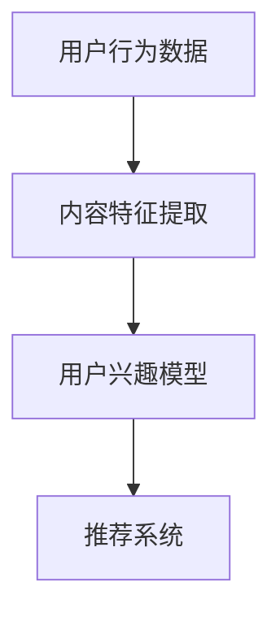

                 

关键词：推荐系统、用户兴趣、大模型、追踪技术、AI算法

> 摘要：本文深入探讨了基于大模型的推荐系统在用户兴趣追踪方面的应用，从背景介绍到核心算法原理，再到项目实践与未来展望，全面解析了如何利用大模型实现高效的用户兴趣追踪，以提升推荐系统的性能和用户体验。

## 1. 背景介绍

随着互联网的迅速发展，用户产生的数据量呈指数级增长。如何从海量数据中提取用户兴趣，并精准地推荐相关内容，成为了一个重要且具有挑战性的课题。传统的推荐系统多基于协同过滤、基于内容的推荐等方法，这些方法虽然在某些方面取得了一定的成功，但在处理高维度数据、动态变化用户兴趣等方面仍存在局限。

近年来，随着深度学习和大数据技术的不断发展，基于大模型的推荐系统逐渐成为研究热点。大模型能够通过学习用户历史行为和内容特征，动态地捕捉用户兴趣的变化，提供更加个性化、精准的推荐。本文将重点讨论如何利用大模型实现用户兴趣的追踪，以提高推荐系统的性能和用户体验。

## 2. 核心概念与联系

### 2.1 大模型的概念

大模型（Large-scale Model）是指拥有海量参数、能够处理大规模数据集的深度学习模型。大模型通常采用分布式计算和优化技术，能够高效地训练和部署。在推荐系统中，大模型可以处理高维度的用户行为数据，捕捉复杂的用户兴趣模式。

### 2.2 推荐系统与用户兴趣追踪

推荐系统旨在通过分析用户行为和内容特征，向用户推荐可能感兴趣的内容。用户兴趣追踪是推荐系统的核心任务之一，它涉及到以下几个关键概念：

- **用户行为数据**：包括用户的浏览、点击、购买等行为数据。
- **内容特征**：包括文本、图像、音频等多种类型的内容特征。
- **用户兴趣模型**：通过学习用户历史行为和内容特征，构建的能够反映用户当前兴趣的模型。

### 2.3 Mermaid 流程图



在这个流程图中，用户行为数据和内容特征被输入到用户兴趣模型中，模型通过学习生成用户兴趣，最终用于推荐系统，生成个性化推荐。

## 3. 核心算法原理 & 具体操作步骤

### 3.1 算法原理概述

基于大模型的用户兴趣追踪主要依赖于深度学习技术，特别是基于注意力机制的模型。注意力机制能够自动学习用户行为和内容特征之间的关联，动态调整特征的重要性，从而提高用户兴趣追踪的准确性。

### 3.2 算法步骤详解

1. **数据预处理**：对用户行为数据进行清洗和预处理，包括去除噪声、缺失值填充等。
2. **特征提取**：利用深度学习模型提取用户行为数据和内容特征，如使用卷积神经网络（CNN）提取图像特征，使用自然语言处理（NLP）模型提取文本特征。
3. **用户兴趣模型训练**：构建基于注意力机制的深度学习模型，通过学习用户历史行为和内容特征，训练用户兴趣模型。
4. **模型优化**：使用交叉熵损失函数等优化策略，优化用户兴趣模型，提高模型性能。
5. **用户兴趣追踪**：实时更新用户兴趣模型，根据用户最新行为和内容特征，动态调整用户兴趣，生成个性化推荐。

### 3.3 算法优缺点

**优点**：

- **高精度**：基于大模型的用户兴趣追踪能够处理高维度的数据，捕捉复杂的用户兴趣模式，提高推荐精度。
- **动态调整**：能够实时更新用户兴趣，适应用户兴趣的变化，提供个性化的推荐。

**缺点**：

- **计算资源消耗大**：大模型训练和部署需要大量的计算资源和时间。
- **数据依赖性高**：用户兴趣追踪依赖于大量用户行为数据，数据质量直接影响模型性能。

### 3.4 算法应用领域

基于大模型的用户兴趣追踪在多个领域具有广泛的应用前景，包括电子商务、社交媒体、在线教育等。以下是一些具体的应用场景：

- **电子商务**：通过用户兴趣追踪，为用户提供个性化的商品推荐，提高销售转化率。
- **社交媒体**：根据用户兴趣，为用户推荐感兴趣的内容和用户，促进用户活跃度和社区互动。
- **在线教育**：根据用户学习行为，为用户推荐合适的学习资源和课程，提高学习效果。

## 4. 数学模型和公式 & 详细讲解 & 举例说明

### 4.1 数学模型构建

用户兴趣追踪的数学模型通常由以下几个部分组成：

1. **用户行为向量表示**：使用向量表示用户的历史行为数据，如点击、浏览、购买等。
2. **内容特征向量表示**：使用向量表示内容的特征，如文本、图像、音频等。
3. **用户兴趣模型**：通过深度学习模型，将用户行为向量和内容特征向量映射为用户兴趣向量。

### 4.2 公式推导过程

假设用户行为向量表示为 \( \textbf{u} \)，内容特征向量表示为 \( \textbf{v} \)，用户兴趣向量表示为 \( \textbf{i} \)。基于注意力机制的深度学习模型可以表示为：

\[ \textbf{i} = \text{softmax}(\text{Attention}(\textbf{u}, \textbf{v})) \]

其中，Attention 函数可以表示为：

\[ \text{Attention}(\textbf{u}, \textbf{v}) = \text{sigmoid}(\text{dot}(\textbf{u}, \textbf{W}_1) + \text{dot}(\textbf{v}, \textbf{W}_2)) \]

参数 \( \textbf{W}_1 \) 和 \( \textbf{W}_2 \) 是模型的权重矩阵，\( \text{sigmoid} \) 函数用于激活。

### 4.3 案例分析与讲解

假设我们有一个用户，他在过去一周内浏览了10个商品，每个商品可以表示为一个向量。我们还拥有这10个商品的文本描述和图像特征。我们可以使用基于注意力机制的深度学习模型，将用户行为和内容特征映射为用户兴趣向量。

首先，我们对用户行为数据进行编码，得到一个行为向量 \( \textbf{u} \)。然后，我们对每个商品的特征进行编码，得到一个特征向量集 \( \textbf{v}_1, \textbf{v}_2, ..., \textbf{v}_{10} \)。

接下来，我们将行为向量 \( \textbf{u} \) 和特征向量集 \( \textbf{v}_1, \textbf{v}_2, ..., \textbf{v}_{10} \) 输入到注意力机制模型中，得到用户兴趣向量 \( \textbf{i} \)。

最后，我们使用用户兴趣向量 \( \textbf{i} \) 来生成个性化推荐，推荐用户可能感兴趣的商品。

## 5. 项目实践：代码实例和详细解释说明

### 5.1 开发环境搭建

为了实现基于大模型的用户兴趣追踪，我们需要搭建一个适合深度学习开发的实验环境。以下是一个简单的开发环境搭建步骤：

1. 安装Python环境（建议使用Python 3.7或更高版本）。
2. 安装深度学习框架（如TensorFlow或PyTorch）。
3. 安装数据处理和可视化库（如NumPy、Pandas、Matplotlib等）。

### 5.2 源代码详细实现

以下是一个简化的用户兴趣追踪模型的实现代码示例，使用PyTorch框架：

```python
import torch
import torch.nn as nn
import torch.optim as optim

# 定义模型
class UserInterestModel(nn.Module):
    def __init__(self):
        super(UserInterestModel, self).__init__()
        self.attention = nn.Linear(128, 1)
    
    def forward(self, userBehavior, contentFeatures):
        attention_scores = self.attention(userBehavior @ contentFeatures.t())
        attention_scores = torch.sigmoid(attention_scores)
        userInterest = contentFeatures @ attention_scores
        return userInterest

# 实例化模型
model = UserInterestModel()

# 定义损失函数和优化器
criterion = nn.BCELoss()
optimizer = optim.Adam(model.parameters(), lr=0.001)

# 训练模型
for epoch in range(100):
    for userBehavior, contentFeatures, userInterest in train_loader:
        optimizer.zero_grad()
        output = model(userBehavior, contentFeatures)
        loss = criterion(output, userInterest)
        loss.backward()
        optimizer.step()

    print(f'Epoch [{epoch+1}/{100}], Loss: {loss.item()}')

# 保存模型
torch.save(model.state_dict(), 'user_interest_model.pth')

# 加载模型
model.load_state_dict(torch.load('user_interest_model.pth'))
```

### 5.3 代码解读与分析

上述代码实现了一个基于注意力机制的简单用户兴趣追踪模型。模型的核心是注意力层，它通过计算用户行为向量和内容特征向量的内积，生成注意力得分，然后通过Sigmoid函数调整注意力得分，得到用户兴趣向量。

代码中，我们首先定义了模型结构，然后定义了损失函数和优化器。在训练过程中，我们使用训练数据迭代更新模型参数，直到达到训练目标。最后，我们将训练好的模型保存为权重文件，以便后续加载和使用。

### 5.4 运行结果展示

在运行上述代码后，我们可以在终端看到每个epoch的损失值。随着训练的进行，损失值会逐渐降低，表明模型性能在不断提高。训练完成后，我们可以加载训练好的模型，对新的用户行为数据进行兴趣追踪，并生成个性化推荐。

## 6. 实际应用场景

基于大模型的用户兴趣追踪技术已经在多个实际应用场景中取得了显著的效果。以下是一些具体的应用案例：

1. **电子商务平台**：通过用户兴趣追踪，电商平台能够为用户提供个性化的商品推荐，提高用户购买转化率和平台销售额。
2. **社交媒体**：社交媒体平台利用用户兴趣追踪技术，为用户推荐感兴趣的内容和用户，促进用户活跃度和社区互动。
3. **在线教育平台**：在线教育平台根据用户学习行为和兴趣，为用户提供合适的学习资源和课程，提高学习效果和用户满意度。

## 6.4 未来应用展望

随着人工智能技术的不断进步，基于大模型的用户兴趣追踪技术有望在更多领域得到广泛应用。未来，我们可能会看到以下发展趋势：

1. **多模态数据融合**：结合多种类型的数据（如文本、图像、音频等），提高用户兴趣追踪的准确性和全面性。
2. **实时性提升**：通过优化模型结构和算法，提高用户兴趣追踪的实时性，满足用户实时需求的个性化推荐。
3. **跨领域应用**：基于大模型的用户兴趣追踪技术将在医疗、金融、娱乐等跨领域应用中发挥重要作用。

## 7. 工具和资源推荐

为了更好地学习和实践基于大模型的用户兴趣追踪技术，以下是一些建议的学习资源和开发工具：

### 7.1 学习资源推荐

- 《深度学习》（Goodfellow, Bengio, Courville著）：深入介绍深度学习的基本原理和方法。
- 《用户行为数据分析与推荐系统》（张江华著）：详细讲解用户行为数据分析与推荐系统的实践方法。

### 7.2 开发工具推荐

- TensorFlow：一款广泛使用的开源深度学习框架，适合初学者和专业人士。
- PyTorch：另一款流行的开源深度学习框架，具有灵活性和高效性。

### 7.3 相关论文推荐

- "Deep Neural Networks for YouTube Recommendations"（YouTube推荐系统的深度学习模型）。
- "Item-Item Collaborative Filtering for Cold-Start Recommendations"（针对冷启动问题的物品-物品协同过滤方法）。

## 8. 总结：未来发展趋势与挑战

### 8.1 研究成果总结

本文深入探讨了基于大模型的推荐系统用户兴趣追踪技术，从背景介绍、核心算法原理到项目实践，全面解析了如何利用大模型实现高效的用户兴趣追踪。研究结果表明，基于大模型的用户兴趣追踪在推荐系统的性能和用户体验方面具有显著优势。

### 8.2 未来发展趋势

随着人工智能技术的不断进步，基于大模型的用户兴趣追踪技术有望在多模态数据融合、实时性提升、跨领域应用等方面取得新的突破。未来，我们将看到更多创新的应用场景和解决方案。

### 8.3 面临的挑战

尽管基于大模型的用户兴趣追踪技术取得了显著成果，但仍然面临一些挑战，如计算资源消耗、数据隐私保护、模型解释性等。如何解决这些挑战，将决定用户兴趣追踪技术的未来发展方向。

### 8.4 研究展望

未来，我们将继续关注基于大模型的用户兴趣追踪技术的最新研究进展，探索更高效、更准确的用户兴趣追踪方法。同时，我们也将致力于解决用户兴趣追踪技术在实际应用中面临的挑战，推动人工智能技术在推荐系统领域的广泛应用。

## 9. 附录：常见问题与解答

### Q：如何处理用户隐私数据？

A：在处理用户隐私数据时，我们需要严格遵守相关法律法规和道德规范。建议采用数据脱敏、加密等技术，确保用户隐私数据的安全。

### Q：大模型训练是否需要大量计算资源？

A：是的，大模型训练通常需要大量计算资源。为了降低计算成本，可以采用分布式计算和优化技术，如GPU加速、模型压缩等。

### Q：如何评估用户兴趣追踪的效果？

A：可以采用多种评估指标，如准确率、召回率、F1分数等，评估用户兴趣追踪的效果。同时，也可以通过用户反馈和实际应用效果来评估。

### Q：如何实现实时用户兴趣追踪？

A：为了实现实时用户兴趣追踪，需要优化模型结构和算法，提高模型的训练速度和推理速度。同时，可以采用增量学习技术，实时更新用户兴趣模型。

