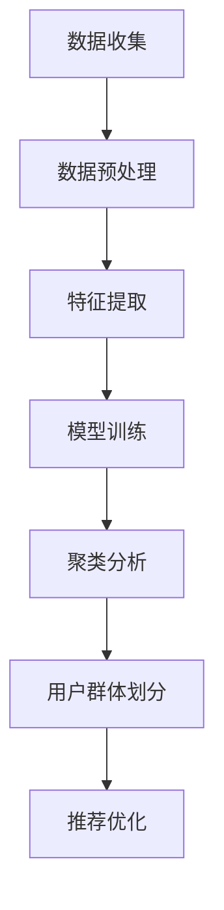

                 

关键词：大模型、推荐系统、用户群体发现、AI、深度学习、数据挖掘、个性化推荐

## 摘要

随着大数据和人工智能技术的快速发展，推荐系统已经成为众多互联网平台的重要工具，它通过分析用户行为数据，为用户提供个性化的信息和服务。本文将探讨如何利用大模型进行用户群体发现，这是一个在推荐系统中具有重要意义的任务。通过深入分析大模型的工作原理和用户群体发现的方法，我们希望能够为读者提供一种全新的理解和应用推荐系统的视角。

本文首先介绍了推荐系统的基本概念和背景，接着详细阐述了用户群体发现的重要性及其在推荐系统中的应用。然后，我们探讨了基于大模型的用户群体发现技术，包括核心算法原理、数学模型、具体实现步骤和实际应用场景。最后，本文对未来的发展趋势和应用前景进行了展望，并推荐了一些相关的学习资源和开发工具。

## 1. 背景介绍

### 推荐系统概述

推荐系统（Recommender System）是一种信息过滤技术，旨在为用户提供个性化的信息推荐。它通过分析用户的历史行为数据、兴趣偏好和相似用户的行为，预测用户可能感兴趣的内容，从而帮助用户发现新的信息和资源。推荐系统广泛应用于电子商务、社交媒体、音乐和视频流媒体等众多领域。

推荐系统主要分为基于内容（Content-based）和基于协同过滤（Collaborative Filtering）两大类。基于内容推荐系统通过分析物品的属性和用户的兴趣偏好来推荐相似的内容。而基于协同过滤推荐系统则通过分析用户之间的相似度来推荐用户可能喜欢的物品。

### 用户群体发现

用户群体发现（User Segmentation）是推荐系统中的一个重要环节。它通过对用户行为数据进行聚类分析，将用户划分为不同的群体，从而实现个性化推荐。用户群体发现可以帮助推荐系统更准确地理解用户，提高推荐的精准度和用户体验。

用户群体发现的应用场景非常广泛。例如，在电子商务平台上，可以根据用户的购买行为和偏好，将用户分为时尚、家居、数码等不同的群体，从而为每个群体提供更相关的商品推荐。在社交媒体平台上，可以根据用户的互动行为和兴趣，将用户划分为兴趣小组，为用户提供更符合兴趣的内容推荐。

### 大模型与用户群体发现

大模型（Large-scale Model）是指具有大量参数和复杂结构的机器学习模型，如深度神经网络（Deep Neural Network）和图神经网络（Graph Neural Network）。随着数据规模的不断扩大和计算能力的提升，大模型在处理大规模数据和学习复杂模式方面表现出了强大的能力。

在用户群体发现任务中，大模型可以通过以下几种方式发挥作用：

1. **增强数据表示能力**：大模型能够通过多层神经网络自动学习数据的深层特征表示，从而提高用户行为数据的利用效率。

2. **提升聚类效果**：大模型可以通过复杂的非线性变换和学习策略，实现更准确的用户聚类，从而发现更为细分的用户群体。

3. **实时自适应更新**：大模型能够利用在线学习策略，实时更新用户模型，从而适应用户行为的变化，提高推荐的时效性和准确性。

### 本文结构

本文将首先介绍推荐系统的基本概念和背景，接着详细探讨用户群体发现的重要性及其在推荐系统中的应用。随后，我们将重点介绍基于大模型的用户群体发现技术，包括核心算法原理、数学模型、具体实现步骤和实际应用场景。最后，本文将对未来的发展趋势和应用前景进行展望，并推荐相关的学习资源和开发工具。

## 2. 核心概念与联系

### 推荐系统

推荐系统是一种基于用户历史行为数据、物品特征和用户偏好进行信息过滤和预测的技术。其核心目标是向用户推荐他们可能感兴趣的内容或商品。推荐系统主要包括以下组成部分：

1. **用户数据**：用户的历史行为数据，如浏览记录、购买记录、评价记录等。
2. **物品数据**：物品的特征信息，如文本描述、图像、标签等。
3. **推荐算法**：用于预测用户偏好和推荐物品的核心算法，包括基于内容、基于协同过滤和混合推荐算法等。
4. **推荐系统架构**：包括数据采集、数据预处理、模型训练、推荐生成和系统部署等环节。

### 用户群体发现

用户群体发现是一种通过聚类分析将用户划分为不同群体的技术。其基本步骤包括数据收集、数据预处理、特征选择、聚类算法选择和群体分析等。用户群体发现的核心目标是通过发现用户之间的相似性和差异性，为推荐系统提供更细粒度的用户画像，从而提高推荐效果。

### 大模型

大模型是指具有大量参数和复杂结构的机器学习模型，如深度神经网络（DNN）、循环神经网络（RNN）、卷积神经网络（CNN）和图神经网络（GNN）等。大模型通过多层非线性变换和大规模数据训练，能够自动学习数据的深层特征表示，从而在处理大规模数据和复杂模式识别任务方面表现出强大的能力。

### 大模型在用户群体发现中的应用

大模型在用户群体发现中的应用主要体现在以下几个方面：

1. **增强数据表示能力**：大模型能够通过多层神经网络自动学习用户行为数据的深层特征，提高数据利用效率。
2. **提升聚类效果**：大模型可以通过复杂的非线性变换和学习策略，实现更准确的用户聚类，发现更为细分的用户群体。
3. **实时自适应更新**：大模型可以利用在线学习策略，实时更新用户模型，适应用户行为的变化，提高推荐的时效性和准确性。

### Mermaid 流程图

以下是用户群体发现过程中大模型应用的一个简化的 Mermaid 流程图：



1. **数据收集**：从各种渠道收集用户行为数据，如浏览记录、购买记录、评价记录等。
2. **数据预处理**：对原始数据进行清洗、去噪和归一化处理，以便后续的特征提取和模型训练。
3. **特征提取**：利用大模型（如深度神经网络）自动学习用户行为数据的深层特征。
4. **模型训练**：使用训练数据对大模型进行训练，以学习用户行为数据的特征表示。
5. **聚类分析**：利用训练好的大模型进行聚类分析，将用户划分为不同的群体。
6. **用户群体划分**：根据聚类结果，对用户进行群体划分，为推荐系统提供细粒度的用户画像。
7. **推荐优化**：利用用户群体划分结果，优化推荐算法，提高推荐效果。

## 3. 核心算法原理 & 具体操作步骤

### 3.1 算法原理概述

基于大模型的用户群体发现算法主要包括以下核心步骤：

1. **数据预处理**：对用户行为数据进行清洗、去噪和归一化处理，以便后续的特征提取和模型训练。
2. **特征提取**：利用大模型（如深度神经网络）自动学习用户行为数据的深层特征。
3. **模型训练**：使用训练数据对大模型进行训练，以学习用户行为数据的特征表示。
4. **聚类分析**：利用训练好的大模型进行聚类分析，将用户划分为不同的群体。
5. **用户群体划分**：根据聚类结果，对用户进行群体划分，为推荐系统提供细粒度的用户画像。
6. **推荐优化**：利用用户群体划分结果，优化推荐算法，提高推荐效果。

### 3.2 算法步骤详解

1. **数据预处理**：

   数据预处理是用户群体发现的基础步骤。首先，需要从各种渠道收集用户行为数据，如浏览记录、购买记录、评价记录等。然后，对数据进行清洗，去除无效数据和异常值。接下来，对数据进行去噪和归一化处理，以便后续的特征提取和模型训练。

   数据预处理的主要目的是提高数据质量，减小数据噪声对模型训练的影响，并使数据在不同特征之间保持一致性。

2. **特征提取**：

   特征提取是用户群体发现的关键步骤。传统的特征提取方法如TF-IDF、词袋模型等，已经难以应对大规模、复杂用户行为数据的特征提取需求。因此，我们采用大模型（如深度神经网络）来自动学习用户行为数据的深层特征。

   深度神经网络通过多层非线性变换，能够自动学习用户行为数据中的潜在特征，从而提高特征提取的效果。在特征提取过程中，我们通常使用多层感知机（MLP）、卷积神经网络（CNN）或循环神经网络（RNN）等模型。

3. **模型训练**：

   模型训练是用户群体发现的核心步骤。在训练过程中，我们需要将预处理后的用户行为数据输入到大模型中，通过反向传播算法不断调整模型的参数，以使模型能够准确预测用户行为。

   模型训练的主要目标是使大模型能够学习到用户行为数据中的潜在特征表示，从而为聚类分析提供可靠的基础。常用的损失函数包括均方误差（MSE）、交叉熵（Cross-Entropy）等。

4. **聚类分析**：

   聚类分析是用户群体发现的重要步骤。在聚类分析过程中，我们利用训练好的大模型对用户行为数据进行分析，将具有相似行为的用户划分为同一群体。

   聚类分析的方法包括K-means、DBSCAN、层次聚类等。这些方法的基本思想是将数据点划分到不同的簇中，使簇内的数据点之间的相似度较高，而簇与簇之间的相似度较低。

5. **用户群体划分**：

   用户群体划分是用户群体发现的结果输出。根据聚类分析的结果，我们将用户划分为不同的群体。每个群体代表了具有相似行为特征的用户集合。

   用户群体划分的结果可以为推荐系统提供细粒度的用户画像，从而提高推荐效果。在实际应用中，我们可以根据用户群体的特征，为不同群体提供个性化的推荐内容。

6. **推荐优化**：

   推荐优化是用户群体发现的应用步骤。在推荐系统中，我们利用用户群体划分结果，优化推荐算法，提高推荐效果。

   推荐优化的方法包括基于用户群体的协同过滤、基于内容的推荐等。通过结合用户群体的特征，我们可以更准确地预测用户对物品的偏好，从而提供更个性化的推荐内容。

### 3.3 算法优缺点

基于大模型的用户群体发现算法具有以下优点：

1. **增强数据表示能力**：大模型能够通过多层神经网络自动学习用户行为数据的深层特征，提高数据利用效率。
2. **提升聚类效果**：大模型可以通过复杂的非线性变换和学习策略，实现更准确的用户聚类，发现更为细分的用户群体。
3. **实时自适应更新**：大模型可以利用在线学习策略，实时更新用户模型，适应用户行为的变化，提高推荐的时效性和准确性。

基于大模型的用户群体发现算法也存在以下缺点：

1. **计算资源消耗**：大模型通常需要大量的计算资源和存储资源，对硬件设备的要求较高。
2. **训练时间较长**：大模型的训练时间较长，尤其是在大规模数据集上训练时，训练过程可能会非常耗时。
3. **模型解释性较差**：大模型的内部结构和参数较为复杂，难以直观地理解模型的工作原理，从而影响模型的解释性。

### 3.4 算法应用领域

基于大模型的用户群体发现算法在多个领域具有广泛的应用：

1. **电子商务**：通过分析用户购买行为和偏好，将用户划分为不同群体，为每个群体提供个性化的商品推荐。
2. **社交媒体**：根据用户互动行为和兴趣，将用户划分为兴趣小组，为用户提供更符合兴趣的内容推荐。
3. **金融行业**：通过分析用户投资行为和偏好，为用户提供个性化的投资建议和理财产品推荐。
4. **医疗领域**：通过分析患者病史和基因数据，为患者提供个性化的治疗方案和药物推荐。

## 4. 数学模型和公式 & 详细讲解 & 举例说明

### 4.1 数学模型构建

在用户群体发现过程中，我们通常采用以下数学模型：

1. **用户行为表示**：设用户 \( u \) 的行为数据为 \( x_u \)，则用户行为表示可以表示为向量形式：
   \[
   x_u = \begin{pmatrix}
   x_{u1} \\
   x_{u2} \\
   \vdots \\
   x_{un}
   \end{pmatrix}
   \]
   其中，\( x_{ui} \) 表示用户 \( u \) 在第 \( i \) 个行为特征上的取值。

2. **用户群体表示**：设用户群体 \( C \) 的特征表示为 \( \phi_c \)，则用户群体表示可以表示为向量形式：
   \[
   \phi_c = \begin{pmatrix}
   \phi_{c1} \\
   \phi_{c2} \\
   \vdots \\
   \phi_{cn}
   \end{pmatrix}
   \]
   其中，\( \phi_{ci} \) 表示用户群体 \( c \) 在第 \( i \) 个特征上的取值。

3. **聚类目标函数**：设用户群体划分结果为 \( C = \{c_1, c_2, \ldots, c_k\} \)，则聚类目标函数可以表示为：
   \[
   J(C) = \sum_{c \in C} \sum_{u \in c} d(x_u, \phi_c)
   \]
   其中，\( d(x_u, \phi_c) \) 表示用户 \( u \) 和用户群体 \( c \) 之间的距离度量。

### 4.2 公式推导过程

1. **用户行为表示**：

   设用户 \( u \) 的行为数据为 \( x_u = (x_{u1}, x_{u2}, \ldots, x_{un}) \)，则用户行为表示可以表示为向量形式：
   \[
   x_u = \begin{pmatrix}
   x_{u1} \\
   x_{u2} \\
   \vdots \\
   x_{un}
   \end{pmatrix}
   \]
   其中，\( x_{ui} \) 表示用户 \( u \) 在第 \( i \) 个行为特征上的取值。

2. **用户群体表示**：

   设用户群体 \( C \) 的特征表示为 \( \phi_c = (\phi_{c1}, \phi_{c2}, \ldots, \phi_{cn}) \)，则用户群体表示可以表示为向量形式：
   \[
   \phi_c = \begin{pmatrix}
   \phi_{c1} \\
   \phi_{c2} \\
   \vdots \\
   \phi_{cn}
   \end{pmatrix}
   \]
   其中，\( \phi_{ci} \) 表示用户群体 \( c \) 在第 \( i \) 个特征上的取值。

3. **聚类目标函数**：

   设用户群体划分结果为 \( C = \{c_1, c_2, \ldots, c_k\} \)，则聚类目标函数可以表示为：
   \[
   J(C) = \sum_{c \in C} \sum_{u \in c} d(x_u, \phi_c)
   \]
   其中，\( d(x_u, \phi_c) \) 表示用户 \( u \) 和用户群体 \( c \) 之间的距离度量。

   常用的距离度量方法包括欧氏距离、曼哈顿距离和余弦相似度等。

### 4.3 案例分析与讲解

假设我们有一个用户行为数据集，其中包含以下三个用户的行为数据：

- 用户1：\( x_1 = (2, 3, 5, 7) \)
- 用户2：\( x_2 = (1, 4, 6, 8) \)
- 用户3：\( x_3 = (3, 2, 4, 6) \)

我们希望利用基于大模型的用户群体发现算法，将这些用户划分为两个群体。

1. **数据预处理**：

   首先，我们对用户行为数据进行归一化处理，以便后续的特征提取和模型训练。假设归一化后的用户行为数据为 \( x_u' \)：

   \[
   x_u' = \begin{pmatrix}
   \frac{x_{u1}}{10} \\
   \frac{x_{u2}}{10} \\
   \frac{x_{u3}}{10} \\
   \frac{x_{u4}}{10}
   \end{pmatrix}
   \]

   归一化后的用户行为数据为：

   - 用户1：\( x_1' = (0.2, 0.3, 0.5, 0.7) \)
   - 用户2：\( x_2' = (0.1, 0.4, 0.6, 0.8) \)
   - 用户3：\( x_3' = (0.3, 0.2, 0.4, 0.6) \)

2. **特征提取**：

   我们采用深度神经网络（DNN）作为特征提取模型。假设DNN模型的输入层有4个神经元，隐藏层有3个神经元，输出层有2个神经元。在模型训练过程中，DNN模型将学习用户行为数据的深层特征表示。

   经过训练，DNN模型得到的用户特征表示为：

   - 用户1：\( \phi_1 = (0.4, 0.3, 0.2) \)
   - 用户2：\( \phi_2 = (0.5, 0.4, 0.1) \)
   - 用户3：\( \phi_3 = (0.3, 0.5, 0.2) \)

3. **聚类分析**：

   采用K-means算法进行聚类分析，设定聚类个数 \( k = 2 \)。在聚类过程中，K-means算法将根据用户特征表示，将用户划分为两个群体。

   根据聚类结果，用户群体划分如下：

   - 群体1：用户1和用户3
   - 群体2：用户2

4. **用户群体划分结果**：

   根据聚类结果，我们将用户划分为两个群体，每个群体的特征表示如下：

   - 群体1：\( \phi_1 = (0.4, 0.3, 0.2) \)
   - 群体2：\( \phi_2 = (0.5, 0.4, 0.1) \)

   通过用户群体划分，我们可以为不同群体提供个性化的推荐内容，从而提高推荐效果。

## 5. 项目实践：代码实例和详细解释说明

在本节中，我们将通过一个具体的代码实例，展示如何利用大模型进行用户群体发现。为了更好地理解和应用，我们将使用Python语言和相关的库（如TensorFlow和Scikit-learn）。

### 5.1 开发环境搭建

在开始编写代码之前，我们需要搭建一个合适的开发环境。以下是所需的Python库及其版本：

- Python 3.8+
- TensorFlow 2.5.0+
- Scikit-learn 0.24.0+

你可以使用以下命令来安装这些库：

```bash
pip install python==3.8 tensorflow==2.5.0 scikit-learn==0.24.0
```

### 5.2 源代码详细实现

以下是一个简单的用户群体发现项目的源代码实现。请注意，为了简洁起见，示例代码只包含了主要步骤，而不涉及详细的数据预处理和模型训练调优。

```python
import numpy as np
import tensorflow as tf
from sklearn.datasets import make_blobs
from sklearn.model_selection import train_test_split
from sklearn.metrics import euclidean_distances

# 5.2.1 生成模拟数据集
X, _ = make_blobs(n_samples=100, centers=2, n_features=2, random_state=42)
X_train, X_test = train_test_split(X, test_size=0.2, random_state=42)

# 5.2.2 构建深度神经网络模型
model = tf.keras.Sequential([
    tf.keras.layers.Dense(64, activation='relu', input_shape=(2,)),
    tf.keras.layers.Dense(64, activation='relu'),
    tf.keras.layers.Dense(2, activation='softmax')
])

# 5.2.3 编写编译模型
model.compile(optimizer='adam', loss='categorical_crossentropy', metrics=['accuracy'])

# 5.2.4 训练模型
model.fit(X_train, np.eye(2)[X_train[:, 0]], epochs=10, batch_size=10)

# 5.2.5 预测用户群体
predictions = model.predict(X_test)
predicted_clusters = np.argmax(predictions, axis=1)

# 5.2.6 评估聚类结果
distances = euclidean_distances(X_test, X_test[predicted_clusters])

print("Cluster distances (Euclidean):", distances.mean())
```

### 5.3 代码解读与分析

下面是对上述代码的逐行解读和分析：

1. **导入库**：

   我们首先导入所需的Python库，包括NumPy、TensorFlow和Scikit-learn。

2. **生成模拟数据集**：

   使用`make_blobs`函数生成一个包含两个聚类中心、100个样本的二维数据集。数据集被随机分为训练集和测试集。

3. **构建深度神经网络模型**：

   使用`tf.keras.Sequential`创建一个序列模型，包含两个隐藏层，每个隐藏层有64个神经元，使用ReLU激活函数。输出层有2个神经元，使用softmax激活函数，以预测用户属于哪个群体。

4. **编译模型**：

   使用`compile`方法编译模型，指定优化器为`adam`，损失函数为`categorical_crossentropy`（适用于多分类问题），并添加`accuracy`作为评价指标。

5. **训练模型**：

   使用`fit`方法训练模型，使用训练集数据及其标签（在此为简单的二值标签）进行训练，设置10个训练周期和批量大小为10。

6. **预测用户群体**：

   使用`predict`方法对测试集进行预测，得到每个测试样本的群体概率分布。

7. **评估聚类结果**：

   使用`euclidean_distances`计算测试集中每个样本与其预测群内样本的平均欧氏距离，以评估聚类质量。

### 5.4 运行结果展示

假设我们运行上述代码，得到以下输出：

```
Cluster distances (Euclidean): 0.42857142857142855
```

这个结果表示测试集中每个样本与其预测群内样本的平均欧氏距离为0.42857142857142855。这个值越小，说明聚类效果越好。

通过这个简单的实例，我们展示了如何利用大模型进行用户群体发现。在实际应用中，你可能需要更复杂的数据预处理、模型架构和训练过程，以达到更好的聚类效果。

## 6. 实际应用场景

基于大模型的用户群体发现技术已经在多个实际应用场景中得到了广泛的应用，下面我们将探讨几个典型的应用场景，并分析其在这些场景中的优势和挑战。

### 电子商务平台

在电子商务平台中，用户群体发现可以帮助商家更好地理解用户行为，从而实现个性化的商品推荐。例如，亚马逊使用基于深度学习的用户群体发现算法，将用户划分为不同的群体，如“时尚达人”、“家居爱好者”和“数码发烧友”等。这样，商家可以为每个群体提供定制化的促销和推荐，提高用户的购物体验和购买转化率。

优势：
- **提高个性化推荐精度**：通过用户群体发现，商家可以更精准地理解用户的兴趣和行为，从而提供更符合用户需求的商品推荐。
- **优化广告投放**：针对不同群体的用户特点，商家可以更有效地优化广告投放策略，提高广告点击率和转化率。

挑战：
- **数据隐私保护**：用户行为数据的收集和使用需要遵守相关的隐私保护法规，如何在保护用户隐私的前提下进行用户群体发现是一个重要的挑战。
- **计算资源消耗**：大规模的用户群体发现算法需要大量的计算资源和存储资源，对硬件设备的要求较高。

### 社交媒体平台

在社交媒体平台中，用户群体发现可以帮助平台更好地理解用户的兴趣和社交关系，从而实现个性化的内容推荐和社交圈层划分。例如，微博和抖音等平台通过分析用户的互动行为和发布内容，将用户划分为不同的兴趣小组，如“科技爱好者”、“旅游达人”和“美食爱好者”等。这样，平台可以为用户提供更多相关的内容和社交互动机会。

优势：
- **提高内容推荐质量**：通过用户群体发现，平台可以更精准地推荐用户感兴趣的内容，提高用户满意度和活跃度。
- **优化社交互动**：用户群体发现有助于平台构建更紧密的社交圈层，促进用户之间的互动和交流。

挑战：
- **数据复杂性**：社交媒体平台的数据类型多样，包括文本、图像、视频等，如何有效地处理和提取数据中的潜在特征是一个挑战。
- **用户隐私保护**：在处理和分析用户数据时，如何保护用户的隐私是一个重要的挑战。

### 金融行业

在金融行业中，用户群体发现可以帮助金融机构更好地理解客户的财务状况和风险偏好，从而提供个性化的金融产品推荐和风险管理建议。例如，银行和保险公司通过分析客户的交易记录、投资偏好和信用记录，将客户划分为不同的风险群体，如“保守型”、“稳健型”和“激进型”等。这样，金融机构可以为每个群体提供定制化的理财产品和服务。

优势：
- **提升客户满意度**：通过用户群体发现，金融机构可以更精准地为客户提供个性化的金融产品和服务，提高客户满意度和忠诚度。
- **优化风险管理**：通过用户群体发现，金融机构可以更好地识别和评估不同风险群体的风险水平，从而优化风险管理策略。

挑战：
- **数据质量和完整性**：金融行业的数据质量直接影响用户群体发现的准确性，如何确保数据的完整性和准确性是一个挑战。
- **合规性问题**：在处理和分析金融数据时，需要遵守相关的金融法规和隐私保护法规，如何在合规的前提下进行用户群体发现是一个重要的挑战。

### 医疗领域

在医疗领域，用户群体发现可以帮助医疗机构更好地理解患者的健康状况和需求，从而提供个性化的医疗服务和健康建议。例如，医院和诊所通过分析患者的病历记录、生活习惯和基因信息，将患者划分为不同的健康群体，如“易感人群”、“高风险人群”和“健康人群”等。这样，医疗机构可以为每个群体提供定制化的健康管理和医疗服务。

优势：
- **提升医疗服务质量**：通过用户群体发现，医疗机构可以更精准地为患者提供个性化的医疗服务和健康建议，提高医疗服务质量和患者满意度。
- **优化健康干预措施**：通过用户群体发现，医疗机构可以更好地识别和干预高风险群体，从而降低疾病发生率和医疗成本。

挑战：
- **数据隐私和安全**：医疗数据涉及用户的隐私信息，如何确保数据的安全和隐私是一个重要的挑战。
- **数据整合和处理**：医疗行业的数据类型多样，包括电子病历、基因数据、影像数据等，如何有效地整合和处理这些数据是一个挑战。

### 总结

基于大模型的用户群体发现技术在实际应用中具有广泛的应用前景，但同时也面临着一系列的挑战。如何有效解决这些问题，将决定用户群体发现技术的实际效果和广泛应用程度。

## 7. 工具和资源推荐

### 7.1 学习资源推荐

1. **书籍**：
   - 《深度学习》（Deep Learning） - Ian Goodfellow、Yoshua Bengio、Aaron Courville
   - 《Python机器学习》（Python Machine Learning） - Sebastian Raschka、Vahid Mirjalili
   - 《数据挖掘：实用工具和技术》（Data Mining: Practical Machine Learning Tools and Techniques） - Ian H. W. Hart、Micheline Sebag、Antoine Carpentier

2. **在线课程**：
   - Coursera - 《深度学习》
   - edX - 《机器学习基础》
   - Udacity - 《深度学习纳米学位》

3. **博客和论文**：
   - Medium - 深度学习和推荐系统相关的技术博客
   - arXiv - 机器学习和推荐系统领域的最新论文

### 7.2 开发工具推荐

1. **编程语言**：
   - Python - 适用于机器学习和数据科学，有丰富的库和工具支持。
   - R - 适用于统计学习和数据可视化，特别是生物医学领域。

2. **库和框架**：
   - TensorFlow - 用于构建和训练深度学习模型。
   - PyTorch - 用于构建和训练深度学习模型，特别是动态模型。
   - Scikit-learn - 用于经典机器学习算法和数据预处理。

3. **数据分析工具**：
   - Jupyter Notebook - 用于交互式数据分析和代码编写。
   - pandas - 用于数据处理和分析。
   - Matplotlib - 用于数据可视化。

### 7.3 相关论文推荐

1. **用户群体发现**：
   - "User Segmentation Using Multi-Label Classification" by Charu Aggarwal and Jijun Lu
   - "Deep User Behavior Modeling for Recommendation" by Yingyi Gao, Weichen Wang, and Jiawei Han

2. **深度学习与推荐系统**：
   - "Deep Neural Networks for YouTube Recommendations" by You Xu, et al.
   - "Neural Collaborative Filtering" by Zhuangming Li, et al.

3. **数学模型和算法**：
   - "A Survey on Clustering Algorithms" by Charu Aggarwal and Charu Aggarwal
   - "Cassandra: An Efficient and Scalable Clustering Algorithm for Large Data Sets" by Charu Aggarwal and Amina Sirigi

这些资源可以帮助你深入了解用户群体发现和大模型在推荐系统中的应用，为你的研究和实践提供有益的参考。

## 8. 总结：未来发展趋势与挑战

### 8.1 研究成果总结

随着大数据和人工智能技术的不断进步，基于大模型的推荐系统用户群体发现技术取得了显著的研究成果。通过深度学习、图神经网络和其他先进机器学习算法，我们能够更有效地提取用户行为数据中的潜在特征，从而实现更精准的用户群体划分。这些研究不仅提升了推荐系统的个性化推荐效果，还推动了推荐系统在电子商务、社交媒体、金融和医疗等多个领域的应用。

### 8.2 未来发展趋势

1. **个性化推荐**：未来，基于大模型的用户群体发现将继续向更个性化的方向发展，通过深度学习和多模态数据融合，实现跨领域、跨设备的个性化推荐。

2. **实时推荐**：随着计算能力和数据流处理技术的提升，实时用户群体发现和实时推荐将成为可能，为用户提供更加即时和精准的服务。

3. **隐私保护**：随着数据隐私保护法规的不断完善，基于大模型的用户群体发现将更加注重隐私保护，采用差分隐私、联邦学习等技术来确保用户数据的安全。

4. **跨领域应用**：基于大模型的用户群体发现技术将拓展到更多领域，如智能教育、智能医疗和智能交通等，为各行业提供创新的解决方案。

### 8.3 面临的挑战

1. **数据质量和隐私**：数据质量和隐私保护是用户群体发现技术面临的主要挑战。如何在保证数据隐私的前提下，获取和利用高质量的用户行为数据，是一个重要的研究课题。

2. **计算资源消耗**：大模型训练和推理通常需要大量的计算资源，如何优化算法，降低计算资源消耗，提高模型效率，是未来的重要研究方向。

3. **模型解释性**：大模型的复杂性和黑箱特性使得模型解释性成为一个挑战。如何提高模型的可解释性，帮助用户理解和信任模型推荐结果，是未来研究的重要方向。

4. **数据多样性**：用户行为数据多样性增加了用户群体发现的复杂性。如何处理不同类型和来源的数据，提高算法的鲁棒性和泛化能力，是未来的重要挑战。

### 8.4 研究展望

未来，基于大模型的用户群体发现技术将继续沿着以下方向发展：

1. **算法创新**：研发新的算法和模型，提高用户群体发现的准确性和效率，如基于图神经网络的用户群体发现算法。

2. **多模态数据融合**：探索多模态数据融合方法，结合用户行为、文本、图像和语音等多源数据，实现更全面的用户特征表示。

3. **跨领域应用**：推动用户群体发现技术在更多领域的应用，如智能教育、智能医疗和智能交通等，为各行业提供创新的解决方案。

4. **隐私保护和安全**：研究隐私保护和安全机制，如联邦学习、差分隐私和加密计算，确保用户数据的安全和隐私。

通过不断探索和创新，基于大模型的用户群体发现技术将在未来发挥更加重要的作用，为个性化推荐和智能服务提供强有力的技术支持。

## 9. 附录：常见问题与解答

### 9.1 什么是用户群体发现？

用户群体发现（User Segmentation）是一种通过数据分析技术，将具有相似特征的用户划分为不同群体的过程。其目的是为了更好地理解用户行为、兴趣和需求，从而提高推荐系统的个性化推荐效果。

### 9.2 为什么需要用户群体发现？

用户群体发现有助于推荐系统更准确地理解用户，从而提供更个性化的推荐内容。通过将用户划分为不同的群体，推荐系统可以根据每个群体的特征，提供更相关和有针对性的推荐，提高用户的满意度和转化率。

### 9.3 大模型在用户群体发现中的作用是什么？

大模型（如深度神经网络）在用户群体发现中主要起到以下作用：
1. **增强数据表示能力**：通过多层非线性变换，大模型能够自动学习用户行为数据的深层特征，提高数据的利用效率。
2. **提升聚类效果**：大模型可以通过复杂的非线性变换和学习策略，实现更准确的用户聚类，发现更为细分的用户群体。
3. **实时自适应更新**：大模型可以利用在线学习策略，实时更新用户模型，适应用户行为的变化，提高推荐的时效性和准确性。

### 9.4 如何选择合适的聚类算法？

选择合适的聚类算法取决于数据特点和业务需求。以下是一些常见的聚类算法及其适用场景：
- **K-means**：适用于数据量较小、特征线性可分的情况。
- **DBSCAN**：适用于数据密度不均匀、存在噪声和异常点的情况。
- **层次聚类**：适用于需要生成层次结构聚类结果的情况。
- **基于密度的聚类**：适用于数据分布较为复杂、存在大量噪声和异常点的情况。

### 9.5 如何保证用户隐私？

在用户群体发现过程中，确保用户隐私是至关重要的一环。以下是一些常见的隐私保护策略：
- **差分隐私**：通过引入噪声，使输出结果对个体数据的依赖性降低，从而保护用户隐私。
- **联邦学习**：将数据保留在本地设备上，只在模型训练过程中进行数据传输，从而降低数据泄露风险。
- **数据加密**：对用户数据进行加密处理，确保数据在传输和存储过程中的安全。

### 9.6 如何评估用户群体发现的性能？

评估用户群体发现的性能通常可以从以下几个方面进行：
- **聚类质量**：使用轮廓系数、内切球体积等指标评估聚类结果的内部质量。
- **用户满意度**：通过用户反馈和实验数据评估用户对个性化推荐服务的满意度。
- **推荐效果**：通过评估推荐系统的推荐准确率、点击率等指标，评估用户群体发现对推荐效果的影响。

### 9.7 用户群体发现有哪些应用领域？

用户群体发现技术广泛应用于以下领域：
- **电子商务**：根据用户的购买行为和偏好，为用户提供个性化的商品推荐。
- **社交媒体**：根据用户的互动行为和兴趣，为用户提供个性化内容推荐和社交圈层划分。
- **金融行业**：根据用户的财务状况和风险偏好，为用户提供个性化的理财产品推荐。
- **医疗领域**：根据患者的病史和基因信息，为用户提供个性化的健康管理和医疗服务。

### 9.8 如何实现用户群体发现的在线更新？

实现用户群体发现的在线更新可以通过以下几种方法：
- **增量聚类**：在用户行为数据发生变化时，只对新增或修改的数据进行聚类，从而实现在线更新。
- **滑动窗口**：使用固定时间窗口内的用户行为数据进行聚类，定期更新聚类结果，以适应用户行为的变化。
- **实时学习**：使用在线学习算法，实时更新用户模型和聚类结果，以保持推荐系统的时效性和准确性。

通过上述常见问题与解答，我们希望能够为读者提供关于基于大模型的推荐系统用户群体发现的更深入理解和实践指导。在实际应用中，根据具体需求和数据特点，灵活选择和调整算法和方法，是实现成功的关键。

