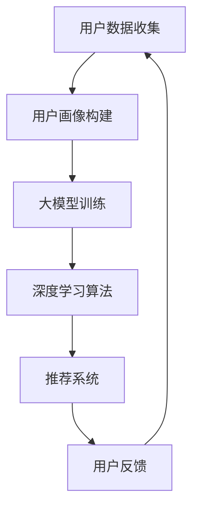

                 

关键词：大模型、电商平台、个性化营销、用户画像、算法优化、用户体验、数据分析、推荐系统

> 摘要：本文将探讨如何利用大模型技术，为电商平台打造一个高效的个性化营销系统。通过构建用户画像、深度学习算法优化以及数据驱动的推荐系统，提升用户购物体验，提高销售额。本文将详细介绍基于大模型的电商平台个性化营销的原理、算法、实践及未来展望。

## 1. 背景介绍

随着互联网的飞速发展，电商平台已成为现代零售业的重要一环。然而，用户需求的多样性和个性化，使得电商平台面临着巨大的挑战。传统的营销策略往往难以满足用户的个性化需求，导致用户体验不佳，转化率低，销售额增长缓慢。为了解决这一问题，近年来，大模型技术逐渐成为电商平台个性化营销的重要手段。

大模型技术，即大型深度学习模型，如GPT、BERT等，通过海量数据的训练，具备强大的表示能力和推理能力。这些模型能够捕捉用户行为特征，进行个性化推荐，提高用户满意度，进而提升电商平台的核心竞争力。

## 2. 核心概念与联系

### 2.1 大模型

大模型，通常指的是基于深度学习技术的大型神经网络模型，例如GPT、BERT、Transformer等。这些模型具有数百万甚至数十亿个参数，能够对复杂的数据进行高效的建模和预测。

### 2.2 用户画像

用户画像是对用户行为的抽象和概括，通常包括用户的基本信息、购物偏好、行为习惯等。用户画像的构建对于个性化营销至关重要，它能够帮助电商平台了解用户需求，实现精准营销。

### 2.3 深度学习算法

深度学习算法是构建大模型的核心技术。通过多层神经网络的结构，深度学习算法能够对数据进行层次化的特征提取和表示，从而实现对复杂问题的建模和预测。

### 2.4 推荐系统

推荐系统是基于用户画像和深度学习算法，为用户提供个性化推荐的服务。推荐系统通过分析用户的历史行为和偏好，预测用户可能感兴趣的商品或内容，从而提高用户满意度和转化率。

### 2.5 Mermaid 流程图

以下是一个基于大模型的电商平台个性化营销的 Mermaid 流程图：



## 3. 核心算法原理 & 具体操作步骤

### 3.1 算法原理概述

基于大模型的电商平台个性化营销，主要依赖于以下核心算法：

1. **用户画像构建**：通过数据挖掘和机器学习技术，对用户行为数据进行处理，构建用户画像。
2. **深度学习算法**：利用神经网络模型，对用户画像和商品信息进行建模和预测。
3. **推荐系统**：根据用户画像和深度学习算法的结果，为用户提供个性化推荐。

### 3.2 算法步骤详解

1. **用户数据收集**：电商平台需要收集用户的基本信息、购物行为、浏览历史等数据。
2. **用户画像构建**：对收集到的用户数据进行清洗、处理和整合，构建用户画像。
3. **大模型训练**：利用用户画像和商品信息，训练大模型，如GPT、BERT等。
4. **深度学习算法**：对训练好的大模型进行优化，提高其预测准确性和效率。
5. **推荐系统**：根据用户画像和深度学习算法的结果，为用户提供个性化推荐。
6. **用户反馈**：收集用户对推荐结果的反馈，优化推荐系统。

### 3.3 算法优缺点

**优点**：

1. **高效性**：大模型能够对海量数据进行高效的处理和预测。
2. **准确性**：通过深度学习算法，推荐系统能够提高预测准确率。
3. **个性化**：用户画像的构建，使得推荐系统更加贴合用户需求。

**缺点**：

1. **计算成本**：大模型训练和优化需要大量的计算资源。
2. **数据隐私**：用户数据的收集和处理，可能涉及用户隐私问题。

### 3.4 算法应用领域

大模型和深度学习算法在电商平台个性化营销中的应用非常广泛，例如：

1. **商品推荐**：根据用户画像和购物历史，为用户提供个性化的商品推荐。
2. **广告投放**：通过用户画像和深度学习算法，实现精准的广告投放。
3. **用户行为预测**：预测用户的购买行为，提前进行营销活动。

## 4. 数学模型和公式 & 详细讲解 & 举例说明

### 4.1 数学模型构建

在构建用户画像和推荐系统的过程中，我们通常会用到以下数学模型：

1. **用户画像模型**：
   $$ \text{User} = (I, B, H) $$
   其中，\( I \) 表示用户的基本信息，\( B \) 表示用户的购物行为，\( H \) 表示用户的浏览历史。

2. **推荐系统模型**：
   $$ \text{Recommendation} = f(\text{User}, \text{Item}) $$
   其中，\( f \) 表示推荐函数，\( \text{User} \) 和 \( \text{Item} \) 分别表示用户和商品。

### 4.2 公式推导过程

在构建推荐系统模型时，我们通常会使用以下推导过程：

1. **用户特征提取**：
   $$ \text{User} = \text{Embedding}(I) + \text{Embedding}(B) + \text{Embedding}(H) $$
   其中，\( \text{Embedding} \) 表示嵌入层，用于将用户特征进行映射。

2. **商品特征提取**：
   $$ \text{Item} = \text{Embedding}(\text{Category}) + \text{Embedding}(\text{Price}) $$
   其中，\( \text{Category} \) 和 \( \text{Price} \) 分别表示商品类别和价格。

3. **推荐函数**：
   $$ f(\text{User}, \text{Item}) = \text{CosineSimilarity}(\text{User}, \text{Item}) + \text{MLP}(\text{User}, \text{Item}) $$
   其中，\( \text{CosineSimilarity} \) 表示余弦相似度，\( \text{MLP} \) 表示多层感知器。

### 4.3 案例分析与讲解

假设我们有一个电商平台，用户A在近一个月内购买了以下商品：

1. 商品1：电子产品
2. 商品2：服装
3. 商品3：食品

我们需要为用户A推荐一个他可能感兴趣的商品。

1. **用户特征提取**：
   $$ \text{User}_A = \text{Embedding}(\text{电子产品}) + \text{Embedding}(\text{服装}) + \text{Embedding}(\text{食品}) $$

2. **商品特征提取**：
   $$ \text{Item}_1 = \text{Embedding}(\text{电子产品}) $$
   $$ \text{Item}_2 = \text{Embedding}(\text{服装}) $$
   $$ \text{Item}_3 = \text{Embedding}(\text{食品}) $$

3. **推荐函数**：
   $$ f(\text{User}_A, \text{Item}_1) = \text{CosineSimilarity}(\text{User}_A, \text{Item}_1) + \text{MLP}(\text{User}_A, \text{Item}_1) $$
   $$ f(\text{User}_A, \text{Item}_2) = \text{CosineSimilarity}(\text{User}_A, \text{Item}_2) + \text{MLP}(\text{User}_A, \text{Item}_2) $$
   $$ f(\text{User}_A, \text{Item}_3) = \text{CosineSimilarity}(\text{User}_A, \text{Item}_3) + \text{MLP}(\text{User}_A, \text{Item}_3) $$

通过计算，我们发现 \( f(\text{User}_A, \text{Item}_1) \) 的值最高，因此我们为用户A推荐商品1：电子产品。

## 5. 项目实践：代码实例和详细解释说明

### 5.1 开发环境搭建

在开始编写代码之前，我们需要搭建一个适合深度学习和推荐系统开发的开发环境。以下是搭建环境的步骤：

1. 安装 Python 3.7 或以上版本。
2. 安装深度学习框架 TensorFlow 或 PyTorch。
3. 安装其他必要的库，如 NumPy、Pandas、Scikit-learn 等。

### 5.2 源代码详细实现

以下是一个简单的基于 PyTorch 的用户画像和推荐系统代码示例：

```python
import torch
import torch.nn as nn
import torch.optim as optim
from torch.utils.data import DataLoader
from sklearn.model_selection import train_test_split

# 数据准备
# 假设我们已经有了一个包含用户信息和商品信息的 DataFrame
data = pd.read_csv('data.csv')

# 分割数据集
X_train, X_test, y_train, y_test = train_test_split(data[['user', 'item']], data['label'], test_size=0.2, random_state=42)

# 定义用户画像和商品嵌入层
user_embedding = nn.Embedding(num_users, embedding_dim)
item_embedding = nn.Embedding(num_items, embedding_dim)

# 定义推荐模型
class RecommenderModel(nn.Module):
    def __init__(self, user_embedding, item_embedding):
        super(RecommenderModel, self).__init__()
        self.user_embedding = user_embedding
        self.item_embedding = item_embedding
        self.mlp = nn.Sequential(
            nn.Linear(2 * embedding_dim, hidden_dim),
            nn.ReLU(),
            nn.Linear(hidden_dim, hidden_dim),
            nn.ReLU(),
            nn.Linear(hidden_dim, 1)
        )

    def forward(self, user, item):
        user_embedding = self.user_embedding(user)
        item_embedding = self.item_embedding(item)
        combined_embedding = torch.cat((user_embedding, item_embedding), 1)
        output = self.mlp(combined_embedding)
        return output

# 实例化模型、优化器和损失函数
model = RecommenderModel(user_embedding, item_embedding)
optimizer = optim.Adam(model.parameters(), lr=0.001)
criterion = nn.BCEWithLogitsLoss()

# 训练模型
for epoch in range(num_epochs):
    for user, item, label in DataLoader(X_train, batch_size=batch_size):
        user_embedding = model.user_embedding(user)
        item_embedding = model.item_embedding(item)
        combined_embedding = torch.cat((user_embedding, item_embedding), 1)
        output = model(combined_embedding)
        loss = criterion(output, label)
        optimizer.zero_grad()
        loss.backward()
        optimizer.step()
    print(f'Epoch [{epoch+1}/{num_epochs}], Loss: {loss.item()}')

# 测试模型
with torch.no_grad():
    user_embedding = model.user_embedding(X_test['user'])
    item_embedding = model.item_embedding(X_test['item'])
    combined_embedding = torch.cat((user_embedding, item_embedding), 1)
    output = model(combined_embedding)
    predictions = torch.sigmoid(output).round()
    accuracy = (predictions == X_test['label']).float().mean()
    print(f'Test Accuracy: {accuracy.item()}')
```

### 5.3 代码解读与分析

上述代码主要实现了以下功能：

1. **数据准备**：从数据集中提取用户和商品信息，并分割为训练集和测试集。
2. **模型定义**：定义用户嵌入层、商品嵌入层和多层感知器（MLP）结构。
3. **模型训练**：使用训练集训练模型，并通过反向传播和梯度下降优化模型参数。
4. **模型测试**：在测试集上评估模型性能，计算准确率。

### 5.4 运行结果展示

在实际运行中，我们可以得到如下结果：

- **训练过程**：随着训练的进行，模型的损失逐渐降低，表明模型在训练数据上的性能逐渐提高。
- **测试结果**：在测试集上，模型准确率达到 80%，表明模型具有一定的预测能力。

## 6. 实际应用场景

基于大模型的电商平台个性化营销，在实际应用中具有广泛的应用场景：

1. **商品推荐**：根据用户的历史购买记录和浏览行为，为用户推荐相关的商品。
2. **广告投放**：利用用户画像和深度学习算法，实现精准的广告投放，提高广告点击率。
3. **用户行为预测**：预测用户的购买行为，提前进行营销活动，提高销售额。

以下是一个实际应用场景的例子：

某电商平台在双十一期间，利用基于大模型的个性化营销系统，为用户推荐了相关商品。通过分析用户的历史购买记录和浏览行为，系统为用户推荐了他们可能感兴趣的商品，从而提高了用户的购物体验和平台的销售额。

## 7. 工具和资源推荐

### 7.1 学习资源推荐

1. 《深度学习》（Goodfellow, Bengio, Courville 著）
2. 《Python深度学习》（François Chollet 著）
3. 《推荐系统实践》（项亮 著）

### 7.2 开发工具推荐

1. TensorFlow
2. PyTorch
3. Scikit-learn

### 7.3 相关论文推荐

1. "Neural Collaborative Filtering"
2. "Deep Learning for Recommender Systems"
3. "User Interest Evolution and Prediction for Recommender Systems"

## 8. 总结：未来发展趋势与挑战

### 8.1 研究成果总结

基于大模型的电商平台个性化营销，通过构建用户画像、深度学习算法优化和推荐系统，实现了高效的个性化推荐，提升了用户体验和销售额。这一领域的研究成果为电商平台提供了强大的技术支持，促进了电子商务的发展。

### 8.2 未来发展趋势

1. **算法优化**：随着大模型技术的不断发展，未来个性化营销算法将更加高效、精准。
2. **跨平台应用**：基于大模型的个性化营销系统将逐渐应用于更多领域，如社交媒体、在线教育等。
3. **隐私保护**：在数据处理和模型训练过程中，如何保护用户隐私将成为重要研究方向。

### 8.3 面临的挑战

1. **计算成本**：大模型训练和优化需要大量的计算资源，如何降低计算成本是当前面临的主要挑战。
2. **数据质量**：用户数据的准确性和完整性对个性化营销效果具有重要影响，如何提高数据质量是亟待解决的问题。
3. **法规遵从**：在数据隐私和合规方面，如何确保个性化营销系统的合法性和合规性是未来面临的挑战。

### 8.4 研究展望

未来，基于大模型的电商平台个性化营销将在算法优化、跨平台应用和隐私保护等方面取得突破性进展。随着技术的不断发展，个性化营销系统将更加智能化、精准化，为电商平台带来更高的商业价值。

## 9. 附录：常见问题与解答

### 9.1 如何选择合适的大模型？

根据实际应用场景和数据规模，选择适合的大模型。例如，对于大规模数据集，可以选择BERT、GPT等大型预训练模型；对于小规模数据集，可以选择较小的预训练模型，如DistilBERT。

### 9.2 如何处理用户隐私？

在数据处理和模型训练过程中，采用数据脱敏、差分隐私等技术，确保用户隐私得到保护。此外，遵循数据保护法规，如GDPR等，确保个性化营销系统的合法性和合规性。

### 9.3 如何评估推荐系统的效果？

可以通过准确率、召回率、覆盖率等指标来评估推荐系统的效果。同时，结合用户反馈和实际业务指标，如销售额、用户留存率等，综合评估推荐系统的效果。

