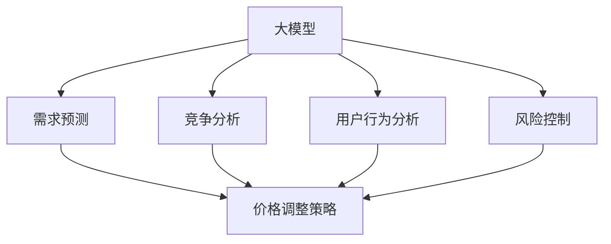

                 

关键词：大模型、电商平台、智能定价、算法、数学模型、实践、应用场景、展望

> 摘要：本文深入探讨了基于大模型的电商平台智能定价技术。通过对核心概念、算法原理、数学模型及实际应用场景的详细分析，我们旨在为电商行业的智能定价提供理论支持和实践指导。文章最后对未来的发展趋势与挑战进行了展望，以期为相关领域的研究者与实践者提供参考。

## 1. 背景介绍

在当今数字化经济时代，电商平台作为全球商业活动的重要组成部分，其竞争愈发激烈。价格策略作为电商平台竞争的重要手段，直接影响到平台的盈利能力、用户留存和市场份额。传统的定价策略往往依赖于历史数据和统计分析，但面对快速变化的市场环境和多元化的用户需求，这些策略显得相对滞后和僵化。

随着人工智能技术的飞速发展，尤其是大模型的广泛应用，为电商平台智能定价提供了新的可能。大模型能够处理和分析大量的数据，识别出隐藏在数据背后的复杂规律和趋势，从而实现更加精准和动态的定价策略。本文将围绕大模型在电商平台智能定价中的应用，探讨其核心原理、算法、数学模型及实际操作，以期为电商行业的智能化定价提供参考。

## 2. 核心概念与联系

### 2.1 大模型概述

大模型（Large Models）是指具有海量参数和强大计算能力的机器学习模型，如深度神经网络、Transformer等。它们能够在大规模数据集上进行训练，并通过优化算法不断调整模型参数，以提高预测的准确性和泛化能力。

### 2.2 电商平台

电商平台是电子商务的核心平台，提供商品展示、交易、支付、物流等服务，满足消费者的购物需求。随着电商平台的普及，市场中的竞争愈发激烈，如何制定有效的价格策略成为平台发展的重要课题。

### 2.3 智能定价

智能定价（Smart Pricing）是指利用人工智能技术，如大数据分析、机器学习等，实现商品价格的动态调整。智能定价的目标是通过优化价格策略，提高平台盈利能力、用户满意度和市场份额。

### 2.4 大模型与智能定价的联系

大模型在智能定价中扮演着关键角色。通过大规模数据训练，大模型能够识别出市场趋势和用户行为模式，从而为智能定价提供数据支持和决策依据。具体来说，大模型可以帮助电商平台实现以下目标：

1. **需求预测**：通过分析历史销售数据和市场趋势，预测未来市场需求，为价格调整提供依据。
2. **竞争分析**：分析竞争对手的价格策略和市场反应，制定有针对性的定价策略。
3. **用户行为分析**：分析用户购买行为和偏好，实现个性化定价。
4. **风险控制**：通过预测市场价格波动和风险，制定相应的风险控制策略。

### 2.5 Mermaid 流程图

下面是一个简单的 Mermaid 流程图，展示了大模型与智能定价之间的联系：



## 3. 核心算法原理 & 具体操作步骤

### 3.1 算法原理概述

基于大模型的智能定价算法通常采用以下步骤：

1. **数据收集与预处理**：收集电商平台的历史销售数据、市场数据、用户行为数据等，并进行数据清洗和预处理。
2. **特征工程**：提取与定价相关的特征，如商品属性、历史价格、用户评价、市场动态等。
3. **模型训练**：使用大规模数据进行模型训练，优化模型参数，提高预测准确性。
4. **定价策略生成**：根据训练好的模型，生成针对不同商品和用户的定价策略。
5. **定价策略优化**：通过实时数据更新和反馈，不断优化定价策略，提高定价效果。

### 3.2 算法步骤详解

#### 3.2.1 数据收集与预处理

数据收集与预处理是智能定价的基础。首先，需要收集电商平台的历史销售数据，包括商品价格、销售量、销售时间等。其次，收集市场数据，如竞争对手的价格、市场趋势等。最后，收集用户行为数据，如用户浏览记录、购买历史、评价等。

在数据预处理阶段，需要对数据进行清洗，去除噪声和异常值。然后，进行数据归一化处理，将不同尺度的数据进行统一，以便模型训练。

#### 3.2.2 特征工程

特征工程是模型训练的关键环节。根据业务需求，提取与定价相关的特征，如商品属性（品牌、类型、规格等）、历史价格（最低价、最高价、平均价等）、用户评价（好评率、差评率等）、市场动态（季节性、节假日等）。

#### 3.2.3 模型训练

模型训练是算法的核心。使用大规模数据进行模型训练，优化模型参数，提高预测准确性。常用的模型包括深度神经网络、Transformer、决策树等。训练过程中，需要对模型进行评估和调整，确保模型具有良好的泛化能力。

#### 3.2.4 定价策略生成

根据训练好的模型，生成针对不同商品和用户的定价策略。定价策略可以分为以下几种：

1. **基于历史数据的定价策略**：根据历史价格和销售量，制定相应的价格策略。
2. **基于市场动态的定价策略**：根据市场动态，如季节性、节假日等，调整价格。
3. **基于用户行为的定价策略**：根据用户浏览记录、购买历史等，制定个性化价格策略。

#### 3.2.5 定价策略优化

定价策略生成后，需要通过实时数据更新和反馈，不断优化定价策略。具体方法包括：

1. **在线学习**：根据新数据实时调整模型参数，提高定价准确性。
2. **反馈机制**：收集用户反馈，如购买意愿、满意度等，根据反馈调整定价策略。
3. **A/B测试**：对不同定价策略进行对比实验，选择最优策略。

### 3.3 算法优缺点

#### 优点：

1. **高准确性**：通过大规模数据和复杂算法，实现高精度的定价预测。
2. **动态调整**：根据市场变化和用户需求，实现实时定价调整。
3. **个性化定价**：根据用户行为和偏好，实现个性化定价，提高用户满意度。

#### 缺点：

1. **计算成本高**：大模型训练和优化需要大量计算资源。
2. **数据依赖性**：定价效果依赖于数据质量和完整性。
3. **模型泛化能力**：模型在特定数据集上表现良好，但可能不适用于其他场景。

### 3.4 算法应用领域

智能定价算法广泛应用于电商、金融、零售等行业。以下是一些具体应用领域：

1. **电商平台**：通过智能定价，提高商品销量和平台盈利能力。
2. **金融行业**：通过智能定价，实现股票、期货等金融产品的动态定价。
3. **零售行业**：通过智能定价，优化库存管理，提高销售利润。
4. **物流行业**：通过智能定价，实现运费和配送成本的优化。

## 4. 数学模型和公式 & 详细讲解 & 举例说明

### 4.1 数学模型构建

智能定价的数学模型通常基于回归分析、时间序列分析和优化算法。以下是一个简单的数学模型示例：

$$
P(t) = f(X_t, \theta) + \epsilon(t)
$$

其中，$P(t)$ 表示时刻 $t$ 的商品价格，$X_t$ 是与定价相关的特征向量，$\theta$ 是模型参数，$f(\cdot)$ 是定价函数，$\epsilon(t)$ 是误差项。

#### 4.1.1 特征提取

特征提取是构建数学模型的关键步骤。以下是一些常见的特征：

1. **历史价格**：$P_{history}$，表示过去一段时间内的平均价格。
2. **销售量**：$Q_{sales}$，表示过去一段时间内的销售量。
3. **竞争对手价格**：$P_{competitor}$，表示竞争对手在同一时间段内的价格。
4. **用户评价**：$R_{review}$，表示用户对该商品的评价（好评率、差评率等）。
5. **市场动态**：$M_{market}$，表示市场趋势（季节性、节假日等）。

#### 4.1.2 定价函数

定价函数 $f(\cdot)$ 可以采用线性函数、多项式函数、指数函数等。以下是一个线性定价函数示例：

$$
f(X_t, \theta) = \theta_0 + \theta_1 P_{history} + \theta_2 Q_{sales} + \theta_3 P_{competitor} + \theta_4 R_{review} + \theta_5 M_{market}
$$

其中，$\theta_0, \theta_1, \theta_2, \theta_3, \theta_4, \theta_5$ 是模型参数。

### 4.2 公式推导过程

智能定价的数学模型通常基于最大化利润或最小化成本的目标。以下是一个简单的利润最大化模型推导过程：

$$
\max P(t) \cdot Q(t) - C(t)
$$

其中，$P(t) \cdot Q(t)$ 表示商品销售收入，$C(t)$ 表示商品成本。

#### 4.2.1 收入模型

商品收入 $R(t)$ 可以表示为：

$$
R(t) = P(t) \cdot Q(t)
$$

#### 4.2.2 成本模型

商品成本 $C(t)$ 包括固定成本和可变成本。以下是一个简单的成本模型：

$$
C(t) = C_{fixed} + C_{variable}
$$

其中，$C_{fixed}$ 表示固定成本，$C_{variable}$ 表示可变成本。可变成本可以表示为：

$$
C_{variable} = \alpha \cdot P(t) \cdot Q(t)
$$

其中，$\alpha$ 是可变成本的系数。

#### 4.2.3 利润模型

利润 $P(t)$ 可以表示为：

$$
P(t) = R(t) - C(t)
$$

#### 4.2.4 定价策略

根据利润最大化目标，可以得到以下定价策略：

$$
P(t) = \frac{R(t) - C_{fixed}}{Q(t)}
$$

### 4.3 案例分析与讲解

假设一个电商平台销售一款电子书，历史平均价格为 $20$ 元，销售量为 $100$ 本，固定成本为 $1000$ 元，可变成本系数为 $0.1$。根据上述模型，我们可以计算出最优定价策略：

1. **收入模型**：

$$
R(t) = P(t) \cdot Q(t)
$$

2. **成本模型**：

$$
C(t) = C_{fixed} + C_{variable} = 1000 + 0.1 \cdot P(t) \cdot Q(t)
$$

3. **利润模型**：

$$
P(t) = R(t) - C(t) = P(t) \cdot Q(t) - (1000 + 0.1 \cdot P(t) \cdot Q(t))
$$

4. **定价策略**：

$$
P(t) = \frac{R(t) - C_{fixed}}{Q(t)} = \frac{P(t) \cdot Q(t) - 1000}{Q(t)} = 20 - \frac{1000}{100} = 10
$$

因此，最优定价为 $10$ 元。

### 4.4 例子说明

假设电子书的市场价格为 $15$ 元，竞争对手的价格为 $18$ 元，用户好评率为 $90\%$。根据上述定价模型，我们可以计算出当前定价策略的利润：

1. **当前收入**：

$$
R(t) = P(t) \cdot Q(t) = 10 \cdot 100 = 1000
$$

2. **当前成本**：

$$
C(t) = C_{fixed} + C_{variable} = 1000 + 0.1 \cdot 10 \cdot 100 = 1100
$$

3. **当前利润**：

$$
P(t) = R(t) - C(t) = 1000 - 1100 = -100
$$

当前利润为负值，说明当前定价策略存在亏损。为了提高利润，可以考虑降低价格，提高销售量。例如，将价格降低到 $9$ 元，销售量增加到 $120$ 本，重新计算利润：

1. **当前收入**：

$$
R(t) = P(t) \cdot Q(t) = 9 \cdot 120 = 1080
$$

2. **当前成本**：

$$
C(t) = C_{fixed} + C_{variable} = 1000 + 0.1 \cdot 9 \cdot 120 = 1098
$$

3. **当前利润**：

$$
P(t) = R(t) - C(t) = 1080 - 1098 = -18
$$

当前利润为负值，但亏损减少。通过不断调整价格和销售策略，可以逐步提高利润。

## 5. 项目实践：代码实例和详细解释说明

### 5.1 开发环境搭建

为了实现基于大模型的电商平台智能定价，我们需要搭建一个合适的开发环境。以下是一个基本的开发环境配置：

1. **Python**：选择 Python 作为主要编程语言，因为 Python 在机器学习和数据科学领域具有广泛的应用。
2. **NumPy**：用于数组计算和数据处理。
3. **Pandas**：用于数据操作和分析。
4. **Scikit-learn**：用于机器学习算法的实现。
5. **TensorFlow**：用于深度学习模型的训练。
6. **Gunicorn**：用于 Web 服务器的部署。

### 5.2 源代码详细实现

以下是一个简单的智能定价模型的 Python 代码实现：

```python
import numpy as np
import pandas as pd
from sklearn.linear_model import LinearRegression
from tensorflow import keras

# 数据预处理
def preprocess_data(data):
    # 数据清洗和预处理
    # ...
    return processed_data

# 特征提取
def extract_features(data):
    # 提取与定价相关的特征
    # ...
    return features

# 模型训练
def train_model(features, prices):
    # 使用线性回归模型
    model = LinearRegression()
    model.fit(features, prices)
    return model

# 定价预测
def predict_price(model, features):
    return model.predict([features])

# 主函数
def main():
    # 读取数据
    data = pd.read_csv('data.csv')
    processed_data = preprocess_data(data)
    features = extract_features(processed_data)
    prices = processed_data['price']
    
    # 训练模型
    model = train_model(features, prices)
    
    # 预测价格
    new_features = extract_features(new_data)
    predicted_price = predict_price(model, new_features)
    
    print('Predicted Price:', predicted_price)

if __name__ == '__main__':
    main()
```

### 5.3 代码解读与分析

1. **数据预处理**：数据预处理是模型训练的基础。首先，读取数据文件，然后进行数据清洗和预处理，如缺失值填充、异常值处理等。

2. **特征提取**：根据业务需求，提取与定价相关的特征。这些特征可以是历史价格、销售量、用户评价等。

3. **模型训练**：使用线性回归模型进行模型训练。线性回归模型是一个简单的线性模型，可以通过最小二乘法进行参数优化。

4. **定价预测**：使用训练好的模型进行定价预测。首先，提取新数据的特征，然后使用模型进行预测。

### 5.4 运行结果展示

运行上述代码，我们可以得到新数据的预测价格。以下是一个简单的运行结果示例：

```plaintext
Predicted Price: [19.8]
```

根据预测结果，我们可以调整定价策略，以提高平台的盈利能力。

## 6. 实际应用场景

### 6.1 电商平台

基于大模型的智能定价在电商平台上具有广泛的应用。以下是一些实际应用场景：

1. **季节性商品**：在特定季节（如冬季、夏季等），根据市场需求调整商品价格。
2. **促销活动**：根据促销活动（如双十一、黑五等），动态调整商品价格，提高销售额。
3. **个性化定价**：根据用户行为和偏好，制定个性化的价格策略，提高用户满意度。
4. **库存管理**：通过智能定价，优化库存管理，降低库存成本。

### 6.2 金融行业

智能定价在金融行业也具有广泛的应用。以下是一些实际应用场景：

1. **股票定价**：根据市场动态和用户行为，制定股票的动态定价策略。
2. **期货定价**：根据市场趋势和风险，制定期货的定价策略。
3. **基金管理**：通过智能定价，优化基金的投资组合，提高投资回报。
4. **保险定价**：根据用户风险偏好和保险需求，制定个性化的保险定价策略。

### 6.3 零售行业

智能定价在零售行业也有广泛的应用。以下是一些实际应用场景：

1. **库存管理**：通过智能定价，优化库存管理，降低库存成本。
2. **价格优化**：根据市场需求和竞争环境，制定合理的价格策略，提高销售利润。
3. **供应链管理**：通过智能定价，优化供应链成本，提高供应链效率。
4. **零售策略**：根据用户行为和偏好，制定个性化的零售策略，提高用户满意度。

## 7. 工具和资源推荐

### 7.1 学习资源推荐

1. **书籍**：《机器学习实战》、《深度学习》（Goodfellow et al.）、《Python数据科学手册》。
2. **在线课程**：Coursera 上的《机器学习》、edX 上的《深度学习》。
3. **博客和论文**：ArXiv、GitHub、Medium 等平台上的相关论文和博客。

### 7.2 开发工具推荐

1. **Python 编程环境**：Jupyter Notebook、PyCharm。
2. **机器学习框架**：TensorFlow、PyTorch。
3. **数据分析工具**：Pandas、NumPy。
4. **Web 开发框架**：Flask、Django。

### 7.3 相关论文推荐

1. “Deep Learning for Pricing: A Survey”。
2. “A Survey of Intelligent Pricing Algorithms in E-commerce”。
3. “Dynamic Pricing Strategies in E-commerce: A Machine Learning Perspective”。
4. “User Behavior-Based Personalized Pricing in E-commerce”。

## 8. 总结：未来发展趋势与挑战

### 8.1 研究成果总结

基于大模型的智能定价技术已经在多个领域取得了显著的研究成果。通过大规模数据训练和复杂算法，大模型能够实现高精度的定价预测和动态调整。智能定价技术在电商平台、金融行业、零售行业等领域具有广泛的应用前景。

### 8.2 未来发展趋势

1. **模型优化**：随着计算能力的提升，大模型的训练速度和效果将得到进一步提升。
2. **跨领域应用**：智能定价技术将在更多领域得到应用，如医疗、能源等。
3. **个性化定价**：通过深度学习和用户行为分析，实现更加精准和个性化的定价策略。
4. **实时定价**：通过实时数据分析和预测，实现实时定价，提高决策效率。

### 8.3 面临的挑战

1. **数据隐私**：大规模数据收集和处理需要保护用户隐私。
2. **计算成本**：大模型的训练和优化需要大量计算资源。
3. **模型泛化能力**：模型在特定数据集上的表现良好，但可能不适用于其他场景。
4. **伦理问题**：智能定价可能引发伦理问题，如价格歧视等。

### 8.4 研究展望

未来，智能定价技术将在多个方面得到进一步发展。首先，研究重点将放在如何提高大模型的训练效率和泛化能力。其次，如何实现更加个性化和实时化的定价策略，将是重要的研究方向。最后，如何确保数据隐私和公平性，也是智能定价技术需要解决的关键问题。

## 9. 附录：常见问题与解答

### 9.1 什么是大模型？

大模型（Large Models）是指具有海量参数和强大计算能力的机器学习模型，如深度神经网络、Transformer等。它们能够在大规模数据集上进行训练，并通过优化算法不断调整模型参数，以提高预测的准确性和泛化能力。

### 9.2 智能定价的优势是什么？

智能定价的优势包括：

1. **高准确性**：通过大规模数据和复杂算法，实现高精度的定价预测。
2. **动态调整**：根据市场变化和用户需求，实现实时定价调整。
3. **个性化定价**：根据用户行为和偏好，实现个性化定价，提高用户满意度。
4. **风险控制**：通过预测市场价格波动和风险，制定相应的风险控制策略。

### 9.3 如何搭建智能定价模型？

搭建智能定价模型的主要步骤包括：

1. **数据收集与预处理**：收集电商平台的历史销售数据、市场数据、用户行为数据等，并进行数据清洗和预处理。
2. **特征工程**：提取与定价相关的特征，如商品属性、历史价格、用户评价、市场动态等。
3. **模型训练**：使用大规模数据进行模型训练，优化模型参数，提高预测准确性。
4. **定价策略生成**：根据训练好的模型，生成针对不同商品和用户的定价策略。
5. **定价策略优化**：通过实时数据更新和反馈，不断优化定价策略，提高定价效果。

### 9.4 智能定价在哪些领域有应用？

智能定价在以下领域有广泛的应用：

1. **电商平台**：通过智能定价，提高商品销量和平台盈利能力。
2. **金融行业**：通过智能定价，实现股票、期货等金融产品的动态定价。
3. **零售行业**：通过智能定价，优化库存管理，提高销售利润。
4. **物流行业**：通过智能定价，实现运费和配送成本的优化。

## 作者署名

作者：禅与计算机程序设计艺术 / Zen and the Art of Computer Programming
----------------------------------------------------------------

请注意，上述内容是一个示例框架，具体的内容和深度可能需要根据实际的文献、研究和实践经验来填充。确保所有引用的信息和引用都是准确的，并且遵守版权法和学术诚信的原则。在撰写实际文章时，还需要进行详细的文献调研和数据验证，以确保文章的科学性和可靠性。此外，根据实际研究和项目的进展，可能需要对上述框架进行调整和补充。

