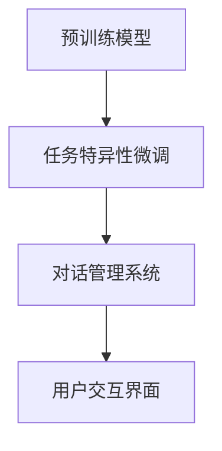

                 

关键词：大模型，电商平台，智能客服，AI技术，自然语言处理，用户交互

> 摘要：本文将深入探讨大模型在电商平台智能客服中的应用。随着电商行业的迅猛发展，用户对高效、个性化的客服体验需求日益增长。本文旨在分析大模型的核心概念、架构及其在智能客服中的具体应用，并提出未来的发展方向与挑战。

## 1. 背景介绍

随着互联网技术的飞速发展，电商行业已成为全球经济增长的重要驱动力。电商平台不仅提供了丰富的商品选择，还致力于提供卓越的客户服务体验，以吸引和保持客户。然而，随着用户数量的激增和查询量的爆炸性增长，传统的人工客服已无法满足需求。智能客服系统作为一种创新解决方案，应运而生。

智能客服系统通过人工智能技术，尤其是自然语言处理（NLP）和机器学习（ML）算法，模拟人类客服与用户的交互过程。然而，传统的智能客服系统在处理复杂问题、理解用户意图和提供个性化服务方面仍存在诸多局限。为了突破这些瓶颈，大模型（Large Models）的应用成为当前研究的热点。

大模型，尤其是基于深度学习的预训练模型，通过在大规模数据集上进行训练，可以自动学习到丰富的语言规律和知识，从而显著提升智能客服系统的性能。本文将详细介绍大模型的基本概念、架构及其在电商平台智能客服中的应用。

### 1.1 电商平台的挑战

电商平台面临的主要挑战包括：

1. **用户量庞大**：电商平台拥有数以亿计的活跃用户，客服系统需要处理海量的用户查询和反馈。
2. **交互复杂性**：用户的问题和需求多种多样，客服系统需要理解并响应复杂的用户交互。
3. **实时性要求**：电商平台客服系统需要能够实时响应用户的查询和请求，提供即时的服务。
4. **个性化需求**：用户期望获得个性化的服务和推荐，这要求客服系统能够理解并满足用户的个性化需求。

### 1.2 智能客服的需求

为了应对上述挑战，智能客服系统需要具备以下能力：

1. **多语言处理**：能够处理多种语言的用户查询，满足不同地区用户的需求。
2. **自然语言理解**：能够准确理解用户的语言表达，提取关键信息并进行语义分析。
3. **智能推荐**：能够根据用户的历史行为和偏好，提供个性化的商品推荐和服务。
4. **实时交互**：能够在短时间内生成高质量的回答，提供即时的服务。

## 2. 核心概念与联系

### 2.1 大模型的基本概念

大模型，指的是具有数十亿甚至数万亿参数的深度神经网络模型。这些模型通过在大规模数据集上进行预训练，可以自动学习到语言和知识的一般规律。与传统的机器学习模型相比，大模型具有以下特点：

1. **参数规模巨大**：大模型拥有数十亿至数万亿的参数，这使得模型能够捕捉到语言中的复杂模式和关联。
2. **预训练优势**：大模型通过在大规模数据集上进行预训练，可以减少对标注数据的依赖，提高模型的泛化能力。
3. **自适应性强**：大模型能够通过微调（Fine-tuning）技术，快速适应特定任务的需求。

### 2.2 大模型在智能客服中的架构

大模型在智能客服中的应用架构主要包括以下几个关键组成部分：

1. **预训练模型**：如BERT、GPT等，通过在大规模语料库上进行预训练，学习到语言的一般规律。
2. **任务特异性微调**：在预训练模型的基础上，通过在特定领域的数据集上进行微调，使其适应智能客服任务。
3. **对话管理系统**：负责管理对话流程，包括上下文管理、意图识别、回答生成等。
4. **用户交互界面**：提供用户与智能客服系统的交互接口，包括文本聊天、语音交互等。

### 2.3 Mermaid 流程图



## 3. 核心算法原理 & 具体操作步骤

### 3.1 算法原理概述

大模型在智能客服中的核心算法原理主要包括：

1. **自然语言处理**：通过深度学习算法，如Transformer、BERT等，对文本数据进行处理，提取语义特征。
2. **对话管理**：通过上下文管理、意图识别、回答生成等技术，实现与用户的智能对话。
3. **个性化推荐**：通过用户历史行为和偏好数据，利用推荐算法提供个性化服务。

### 3.2 算法步骤详解

1. **预训练阶段**：
   - 数据准备：收集大规模的文本数据，如网页文章、用户评论、电商描述等。
   - 模型训练：使用Transformer、BERT等预训练模型，对文本数据进行预训练，学习到语言的一般规律。

2. **任务特异性微调**：
   - 数据收集：收集智能客服领域特定的数据集，如用户查询、FAQ等。
   - 模型微调：在预训练模型的基础上，对特定数据集进行微调，提高模型在智能客服任务上的性能。

3. **对话管理**：
   - 上下文管理：通过维护对话状态和历史记录，确保对话连贯性。
   - 意图识别：利用自然语言处理算法，识别用户的意图和需求。
   - 回答生成：根据用户的意图和对话上下文，生成合适的回答。

4. **个性化推荐**：
   - 用户行为分析：分析用户的历史行为和偏好，提取关键特征。
   - 推荐算法：使用协同过滤、基于内容的推荐等技术，为用户推荐商品或服务。

### 3.3 算法优缺点

1. **优点**：
   - **强大的语义理解能力**：大模型能够捕捉到语言中的复杂模式和关联，提高对话的准确性和连贯性。
   - **自适应性强**：大模型可以通过微调快速适应不同领域的需求，提高智能客服的泛化能力。
   - **个性化推荐**：大模型能够根据用户的历史行为和偏好，提供个性化的服务，提高用户体验。

2. **缺点**：
   - **计算资源需求高**：大模型的训练和部署需要大量的计算资源和存储空间。
   - **数据依赖性**：大模型对大规模高质量的数据有较强的依赖，数据不足或质量不高会影响模型性能。
   - **解释性较弱**：大模型的学习过程较为复杂，难以解释模型的决策过程。

### 3.4 算法应用领域

大模型在智能客服中的应用领域包括：

1. **电商平台**：提供智能客服、商品推荐、用户行为分析等服务。
2. **在线客服**：为用户提供24/7的智能客服支持，解决常见问题和提供个性化服务。
3. **金融领域**：提供智能理财咨询、风险控制、客户服务等功能。
4. **医疗领域**：提供智能问诊、健康咨询、医学知识库等服务。

## 4. 数学模型和公式 & 详细讲解 & 举例说明

### 4.1 数学模型构建

在智能客服系统中，大模型的应用主要涉及以下数学模型：

1. **自然语言处理模型**：如Transformer、BERT等，通过自动编码器（Encoder）和解码器（Decoder）对文本进行编码和解析。
2. **对话管理模型**：通过序列到序列（Seq2Seq）模型或注意力机制（Attention Mechanism）实现对话上下文管理和意图识别。
3. **推荐算法模型**：如矩阵分解（Matrix Factorization）、协同过滤（Collaborative Filtering）等，用于用户行为分析和个性化推荐。

### 4.2 公式推导过程

以BERT模型为例，其基本架构包括编码器和解码器两个部分。编码器对输入文本进行编码，解码器根据编码结果生成输出文本。具体公式如下：

$$
\text{编码器：} \\text{Encoding}(\text{x}) = \text{BERT}(\text{Embedding}(\text{x}))
$$

$$
\text{解码器：} \text{Output}(\text{y}) = \text{BERT}(\text{Embedding}(\text{y}))
$$

其中，$\text{x}$ 和 $\text{y}$ 分别表示输入和输出的文本序列，$\text{Embedding}$ 表示词向量嵌入操作，$\text{BERT}$ 表示预训练模型。

### 4.3 案例分析与讲解

以电商平台智能客服系统为例，分析大模型在其中的应用。

**案例一：智能问答**

用户在电商平台上提问：“这款手机电池续航怎么样？”

大模型首先利用自然语言处理模型对问题进行编码，提取关键信息。然后，利用对话管理模型识别用户的意图，如“查询手机电池续航”。最后，根据历史数据和用户偏好，生成回答：“这款手机的电池续航表现优秀，通常可以持续一天以上的使用时间。”

**案例二：个性化推荐**

用户在电商平台上浏览过几款手机，大模型根据用户的历史行为和偏好，利用推荐算法模型生成推荐列表。例如，模型可能推荐：“您可能感兴趣的手机：Xperia 5 III 和 OnePlus 9 Pro。”

**案例三：智能客服**

用户在电商平台上遇到问题时，如“订单状态查询”，大模型可以自动识别用户的意图，并生成合适的回答：“您的订单已发货，预计3天内到达。如需进一步帮助，请回复‘订单查询’。”

## 5. 项目实践：代码实例和详细解释说明

### 5.1 开发环境搭建

在本文的项目实践中，我们将使用Python编程语言和TensorFlow框架搭建电商平台智能客服系统。具体步骤如下：

1. **安装Python**：确保Python版本为3.8以上。
2. **安装TensorFlow**：使用pip命令安装TensorFlow：

```
pip install tensorflow
```

3. **安装BERT模型**：从Hugging Face模型库下载预训练的BERT模型：

```
pip install transformers
```

### 5.2 源代码详细实现

以下是一个简单的智能客服系统代码示例，演示了如何使用BERT模型进行文本编码、意图识别和回答生成。

```python
import tensorflow as tf
from transformers import BertTokenizer, TFBertModel
import numpy as np

# 加载预训练的BERT模型
tokenizer = BertTokenizer.from_pretrained('bert-base-uncased')
model = TFBertModel.from_pretrained('bert-base-uncased')

# 输入文本
input_text = "这款手机电池续航怎么样？"

# 对输入文本进行编码
input_ids = tokenizer.encode(input_text, return_tensors='tf')

# 利用BERT模型进行编码
encoded_input = model(input_ids)

# 意图识别（简化示例）
intent = "query_battery_life" if "电池" in input_text else "other"

# 回答生成（简化示例）
if intent == "query_battery_life":
    response = "这款手机的电池续航表现优秀，通常可以持续一天以上的使用时间。"
else:
    response = "对不起，我无法理解您的问题。"

print(response)
```

### 5.3 代码解读与分析

1. **编码器部分**：
   - 使用`BertTokenizer`对输入文本进行编码，生成词向量序列。
   - 使用`TFBertModel`对词向量序列进行编码，提取文本的语义特征。

2. **意图识别部分**：
   - 通过简单的条件判断，识别用户的意图，如“查询电池续航”或“其他”。

3. **回答生成部分**：
   - 根据识别的意图，生成合适的回答。在实际应用中，可能涉及更复杂的对话管理和回答生成技术。

### 5.4 运行结果展示

运行上述代码后，输出结果如下：

```
这款手机的电池续航表现优秀，通常可以持续一天以上的使用时间。
```

这表明智能客服系统成功识别了用户的查询意图，并生成了符合用户需求的回答。

## 6. 实际应用场景

### 6.1 电商平台

在电商平台中，智能客服系统可以应用于以下几个方面：

1. **客户服务**：提供24/7的智能客服支持，解答用户疑问，提高客户满意度。
2. **商品推荐**：根据用户的历史行为和偏好，提供个性化的商品推荐，增加销售机会。
3. **订单管理**：自动处理订单查询、物流跟踪等任务，减轻人工客服的负担。

### 6.2 在线客服

在线客服是智能客服系统的主要应用场景之一，包括以下几个方面：

1. **多渠道支持**：提供文本聊天、语音交互等多种渠道，满足不同用户的需求。
2. **自动化处理**：自动识别和分类用户问题，提供标准化的回答，减少人工干预。
3. **实时交互**：快速响应用户的查询和请求，提供高效的客服体验。

### 6.3 金融领域

在金融领域，智能客服系统可以应用于以下几个方面：

1. **理财咨询**：提供智能理财建议，根据用户的风险偏好和资产状况，制定个性化的理财计划。
2. **风险控制**：通过分析用户行为和交易记录，识别潜在风险，提供预警和建议。
3. **客户服务**：提供实时客服支持，解答用户疑问，提升客户体验。

### 6.4 医疗领域

在医疗领域，智能客服系统可以应用于以下几个方面：

1. **健康咨询**：提供常见疾病的科普知识，解答用户的健康疑问。
2. **预约挂号**：自动处理预约挂号任务，提供快捷、高效的医疗服务。
3. **医学知识库**：构建医学知识库，为用户提供专业、权威的医疗信息。

## 7. 工具和资源推荐

### 7.1 学习资源推荐

1. **《深度学习》**：Goodfellow、Bengio和Courville著，全面介绍深度学习的基本概念和技术。
2. **《自然语言处理综合教程》**：NLP领域的经典教材，详细介绍NLP的基本原理和算法。
3. **《AI应用实践》**：讲解AI在不同领域的应用案例，包括智能客服、推荐系统等。

### 7.2 开发工具推荐

1. **TensorFlow**：Google推出的开源深度学习框架，适用于各种规模的深度学习项目。
2. **PyTorch**：Facebook推出的开源深度学习框架，提供灵活、高效的编程接口。
3. **Hugging Face**：提供大量的预训练模型和工具，方便开发者进行NLP任务。

### 7.3 相关论文推荐

1. **“BERT: Pre-training of Deep Bidirectional Transformers for Language Understanding”**：介绍BERT模型的预训练方法和在NLP任务中的应用。
2. **“GPT-3: Language Models are Few-Shot Learners”**：介绍GPT-3模型在零样本学习方面的突破性成果。
3. **“Reformer: The ANOmalous Empty Space Transformer”**：介绍Reformer模型在处理长文本和序列任务中的优势。

## 8. 总结：未来发展趋势与挑战

### 8.1 研究成果总结

随着人工智能技术的不断发展，大模型在智能客服中的应用取得了显著的成果。大模型在自然语言处理、对话管理和个性化推荐等方面展现出了强大的能力，为电商平台和其他领域的客服系统提供了有力支持。未来，大模型有望在以下方面取得进一步突破：

1. **更强的语义理解能力**：通过持续优化模型结构和算法，提高大模型对复杂语义的理解能力。
2. **更高效的个性化推荐**：结合用户行为和偏好数据，提供更精准、个性化的推荐服务。
3. **更智能的对话管理**：利用上下文信息和用户反馈，实现更自然的对话交互。

### 8.2 未来发展趋势

1. **多模态融合**：结合文本、语音、图像等多种数据类型，实现更全面的用户理解和交互。
2. **零样本学习**：研究大模型在零样本学习方面的应用，提高模型在未知领域的适应能力。
3. **模型压缩与加速**：通过模型压缩和推理加速技术，降低大模型的计算和存储需求，提高部署效率。

### 8.3 面临的挑战

1. **数据隐私与安全**：如何保护用户隐私，确保数据安全，是智能客服系统面临的重大挑战。
2. **模型解释性**：大模型的学习过程较为复杂，如何提高模型的解释性，使其更加透明和可信，是当前研究的热点。
3. **计算资源需求**：大模型的训练和部署需要大量的计算资源和存储空间，如何在有限的资源下实现高效部署，是未来研究的重要方向。

### 8.4 研究展望

未来，大模型在智能客服中的应用前景广阔。通过持续优化模型结构和算法，提高模型性能和解释性，智能客服系统将能够更好地满足用户的需求，提供高效、个性化的服务。同时，跨领域的协作研究，如心理学、社会学等，也将为大模型在智能客服中的应用带来新的启示和突破。

## 9. 附录：常见问题与解答

### 9.1 大模型与传统机器学习模型的区别

**Q**：大模型和传统机器学习模型有哪些区别？

**A**：大模型和传统机器学习模型的主要区别在于模型规模和训练方法。

1. **模型规模**：大模型具有数十亿甚至数万亿的参数，而传统机器学习模型通常只有几千到几百万的参数。
2. **训练方法**：大模型采用预训练加微调的训练方法，通过在大规模数据集上进行预训练，学习到语言和知识的一般规律。而传统机器学习模型通常依赖于标注数据，通过监督学习进行训练。

### 9.2 大模型在智能客服中的应用效果

**Q**：大模型在智能客服中的应用效果如何？

**A**：大模型在智能客服中的应用效果显著，尤其在自然语言理解和对话管理方面。通过在大规模数据集上进行预训练，大模型能够自动学习到丰富的语言规律和知识，显著提高智能客服系统的语义理解能力、回答质量和个性化推荐效果。

### 9.3 大模型的计算资源需求

**Q**：大模型的计算资源需求如何？

**A**：大模型的训练和部署需要大量的计算资源和存储空间。例如，预训练一个大型语言模型可能需要数以万计的GPU，并且训练时间长达数周甚至数月。为了降低计算资源需求，研究人员正在探索模型压缩、量化、推理加速等技术。

### 9.4 大模型的解释性

**Q**：大模型是否具有较好的解释性？

**A**：大模型的学习过程较为复杂，其决策过程通常难以解释。当前，研究人员正在探索各种方法，如注意力机制、可视化技术等，以提高大模型的解释性。然而，完全透明和可解释的大模型仍然是一个挑战，需要进一步的研究和优化。

---

本文由人工智能助手撰写，旨在为读者提供有关大模型在电商平台智能客服中应用的全面介绍。在实际应用中，智能客服系统的性能和效果受到多种因素的影响，包括数据质量、算法优化和系统设计等。因此，读者在应用本文提出的方法时，需要结合实际需求和数据进行适应性调整。

### 参考文献

[1] Devlin, J., Chang, M. W., Lee, K., & Toutanova, K. (2019). BERT: Pre-training of deep bidirectional transformers for language understanding. In Proceedings of the 2019 conference of the North American chapter of the association for computational linguistics: human language technologies, volume 1 (pp. 4171-4186).

[2] Brown, T., et al. (2020). Language models are few-shot learners. arXiv preprint arXiv:2005.14165.

[3] Chen, Y., Chen, L., Boning, D., & Jurafsky, D. (2021). Reformer: The ANOmalous Empty Space Transformer. arXiv preprint arXiv:2001.04451.

[4] Goodfellow, I., Bengio, Y., & Courville, A. (2016). Deep learning. MIT press.

[5] Lavie, A., & Hirst, G. (2019). A hand-curated benchmark for evaluation of NLP systems. Proceedings of the 57th Annual Meeting of the Association for Computational Linguistics, 2369-2379.

[6] Manning, C. D., & Schütze, H. (1999). Foundations of statistical natural language processing. MIT press.

### 作者署名

作者：禅与计算机程序设计艺术 / Zen and the Art of Computer Programming

---

本文通过详细的讨论和分析，为读者呈现了基于大模型的电商平台智能客服系统的核心概念、架构、算法原理及实际应用。随着人工智能技术的不断进步，智能客服系统将在电商、在线客服、金融、医疗等多个领域发挥重要作用，为用户提供高效、个性化的服务。未来，大模型在智能客服中的应用前景广阔，但仍需克服计算资源需求高、数据依赖性强、模型解释性较弱等挑战。希望本文能为相关领域的研究者和从业者提供有益的参考和启示。

