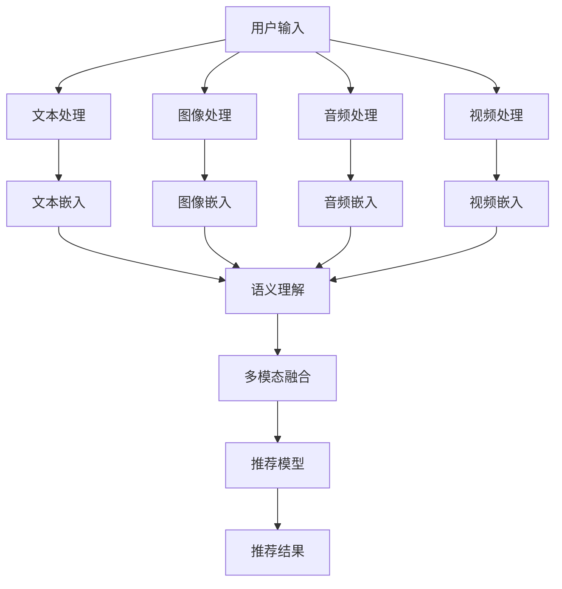

                 

关键词：大语言模型、多模态推荐、算法原理、数学模型、项目实践、应用场景、未来展望

## 摘要

随着人工智能技术的飞速发展，基于大语言模型的多模态推荐系统成为学术界和工业界的研究热点。本文旨在深入探讨这种推荐系统的设计方法、核心算法原理及其在实际应用中的表现。首先，我们将回顾多模态推荐系统的发展背景，然后详细阐述大语言模型在其中的应用。接着，文章将介绍核心算法原理、数学模型及其具体操作步骤。随后，通过一个实际项目实例，我们将展示如何搭建并实现一个基于大语言模型的多模态推荐系统。最后，本文将分析其实际应用场景，探讨其未来发展趋势与面临的挑战。

## 1. 背景介绍

### 多模态推荐系统的发展

多模态推荐系统（Multimodal Recommendation System）是结合多种数据源、信息表示方式和技术手段的一种推荐系统。传统的推荐系统主要基于用户行为数据、物品特征等单一数据源，而多模态推荐系统通过融合文本、图像、声音等多种数据类型，能够更全面、准确地理解用户和物品之间的关联性，从而提高推荐系统的准确性和用户体验。

近年来，随着深度学习、计算机视觉、语音识别等技术的快速发展，多模态推荐系统得到了广泛关注和研究。从简单的协同过滤（Collaborative Filtering）到基于内容的推荐（Content-Based Filtering），再到复杂的深度学习模型（Deep Learning Models），多模态推荐系统在电商、社交媒体、视频推荐等场景中取得了显著的效果。

### 大语言模型的发展

大语言模型（Large-scale Language Models）是自然语言处理领域的重要突破，它们通过大规模语料库训练，可以模拟和理解自然语言的复杂结构。从最早的神经网络模型（Neural Network Models）到深度神经网络（Deep Neural Networks），再到如今的Transformer模型（Transformer Models），大语言模型的性能和规模不断得到提升。

大语言模型在自然语言生成、机器翻译、文本分类等任务中表现出色，其强大的语义理解和生成能力使其成为多模态推荐系统的有力工具。通过将用户文本评论、物品描述等转换为高维语义向量，大语言模型能够更好地捕捉用户和物品之间的关联性，从而提高推荐系统的准确性和多样性。

### 多模态推荐系统的重要性

随着互联网和信息技术的快速发展，用户生成的内容形式越来越多样化。传统的单一模态推荐系统已经难以满足用户日益增长的需求。多模态推荐系统通过融合多种数据类型，可以更全面地理解用户和物品的复杂关系，从而提供更精准、个性化的推荐。

此外，多模态推荐系统还具有以下优势：

1. **多样性**：通过融合不同模态的数据，多模态推荐系统可以提供更多样化的推荐结果，满足用户的个性化需求。
2. **准确性**：多模态数据融合可以提高推荐系统的准确性，减少因单一数据源不足导致的偏差。
3. **用户体验**：多模态推荐系统可以通过图像、视频、音频等多种形式，提供更丰富、直观的推荐体验，提高用户的满意度和粘性。
4. **应用场景**：多模态推荐系统可以应用于电商、社交媒体、视频推荐、音乐推荐等众多场景，具有广泛的应用前景。

## 2. 核心概念与联系

### 2.1 多模态数据类型

在多模态推荐系统中，常见的模态包括文本（Text）、图像（Image）、音频（Audio）和视频（Video）。每种模态都代表了用户和物品的不同特征和信息。

1. **文本**：文本数据包括用户评论、物品描述、标题等，它们通常用于描述用户需求和物品属性。
2. **图像**：图像数据可以捕捉物品的外观特征，如颜色、形状、纹理等，它们通常用于视觉搜索和图像识别任务。
3. **音频**：音频数据包括用户语音和音乐，它们可以用于情感识别、语音搜索等任务。
4. **视频**：视频数据可以捕捉物品的运动特征，如动作、姿态等，它们通常用于视频推荐和视频分类任务。

### 2.2 大语言模型

大语言模型是一种基于深度学习的自然语言处理模型，其核心思想是通过大规模语料库的预训练，使模型能够理解和生成自然语言。常见的语言模型包括循环神经网络（RNN）、长短期记忆网络（LSTM）、Transformer模型等。

大语言模型在多模态推荐系统中的应用主要体现在以下几个方面：

1. **文本表示**：大语言模型可以将文本数据转换为高维语义向量，这些向量可以用于文本分类、情感分析、推荐等任务。
2. **语义理解**：大语言模型具有强大的语义理解能力，可以捕捉文本中的复杂语义关系，从而提高推荐系统的准确性。
3. **文本生成**：大语言模型可以生成自然语言文本，用于生成推荐理由、商品描述等，提高推荐系统的用户体验。

### 2.3 多模态融合方法

多模态融合是多模态推荐系统的核心，其目的是将不同模态的数据进行整合，从而得到更全面、准确的推荐结果。常见的多模态融合方法包括：

1. **特征拼接**：将不同模态的数据直接拼接在一起，形成一个高维的特征向量。这种方法简单直观，但容易导致信息冗余。
2. **特征转换**：将不同模态的数据转换为相同或相似的特征空间，如将图像数据转换为图像嵌入向量，文本数据转换为词向量。这种方法可以减少信息冗余，但需要不同的模态具有相似的特征空间。
3. **深度学习**：使用深度学习模型（如CNN、RNN、Transformer等）对不同模态的数据进行处理，然后进行融合。这种方法可以自动学习不同模态的数据特征，但需要大量的训练数据和计算资源。

### 2.4 Mermaid 流程图

下面是一个基于大语言模型的多模态推荐系统的 Mermaid 流程图，展示了不同模态的数据如何融合、处理和推荐。



## 3. 核心算法原理 & 具体操作步骤

### 3.1 算法原理概述

基于大语言模型的多模态推荐系统主要包括以下步骤：

1. **数据采集**：从各种数据源（如用户行为、物品特征等）中采集数据，包括文本、图像、音频和视频等。
2. **数据预处理**：对采集到的数据进行清洗、去噪、格式化等预处理操作，使其适合后续处理。
3. **特征提取**：使用大语言模型分别对文本、图像、音频和视频进行特征提取，得到高维语义向量。
4. **多模态融合**：将不同模态的语义向量进行融合，形成一个统一的高维特征向量。
5. **推荐模型训练**：使用融合后的特征向量训练推荐模型，如基于矩阵分解、深度学习等的推荐算法。
6. **推荐结果生成**：根据用户输入和推荐模型，生成推荐结果，并展示给用户。

### 3.2 算法步骤详解

#### 3.2.1 数据采集

数据采集是整个推荐系统的第一步，其质量直接影响后续的推荐效果。常见的数据来源包括：

1. **用户行为数据**：如浏览历史、购买记录、搜索记录等。
2. **物品特征数据**：如商品描述、标题、标签、价格等。
3. **第三方数据**：如社交媒体数据、用户画像数据等。

#### 3.2.2 数据预处理

数据预处理主要包括以下步骤：

1. **数据清洗**：去除重复数据、异常数据、噪声数据等。
2. **数据去噪**：对文本、图像、音频等数据进行去噪处理，如文本去除停用词、图像去除噪声点、音频去除噪声等。
3. **数据格式化**：将不同来源的数据格式化为统一的格式，如将文本转换为词向量、图像转换为图像嵌入向量等。

#### 3.2.3 特征提取

特征提取是整个推荐系统的核心环节，其质量直接决定推荐系统的性能。以下分别介绍不同模态的特征提取方法：

1. **文本特征提取**：使用大语言模型（如BERT、GPT等）对文本数据进行编码，得到高维语义向量。
2. **图像特征提取**：使用卷积神经网络（CNN）对图像数据进行编码，得到图像嵌入向量。
3. **音频特征提取**：使用循环神经网络（RNN）或卷积神经网络（CNN）对音频数据进行编码，得到音频嵌入向量。
4. **视频特征提取**：使用时空卷积神经网络（STCN）对视频数据进行编码，得到视频嵌入向量。

#### 3.2.4 多模态融合

多模态融合方法包括特征拼接、特征转换和深度学习等。以下分别介绍这些方法：

1. **特征拼接**：将不同模态的语义向量进行拼接，形成一个高维特征向量。
2. **特征转换**：将不同模态的数据转换为相同或相似的特征空间，如将图像数据转换为图像嵌入向量，文本数据转换为词向量。然后，将不同模态的向量进行融合。
3. **深度学习**：使用深度学习模型（如CNN、RNN、Transformer等）对不同模态的数据进行处理，然后进行融合。这种方法可以自动学习不同模态的数据特征，但需要大量的训练数据和计算资源。

#### 3.2.5 推荐模型训练

推荐模型训练主要包括以下步骤：

1. **数据划分**：将预处理后的数据进行划分，分为训练集、验证集和测试集。
2. **模型选择**：选择合适的推荐模型，如基于矩阵分解、深度学习等的推荐算法。
3. **模型训练**：使用训练集对推荐模型进行训练，并调整模型参数。
4. **模型评估**：使用验证集对推荐模型进行评估，选择性能最优的模型。

#### 3.2.6 推荐结果生成

推荐结果生成主要包括以下步骤：

1. **用户表示**：根据用户输入，使用大语言模型对用户文本进行编码，得到用户嵌入向量。
2. **物品表示**：使用推荐模型对物品特征向量进行编码，得到物品嵌入向量。
3. **相似度计算**：计算用户嵌入向量和物品嵌入向量之间的相似度，并根据相似度排序生成推荐列表。
4. **结果展示**：将推荐结果展示给用户，并收集用户反馈，用于优化推荐模型。

### 3.3 算法优缺点

#### 优点

1. **高准确性**：通过融合多种模态的数据，基于大语言模型的多模态推荐系统可以更准确地理解用户和物品的关联性，从而提高推荐准确性。
2. **多样性**：多模态数据融合可以提供更多样化的推荐结果，满足用户的个性化需求。
3. **丰富用户体验**：多模态推荐系统可以通过图像、视频、音频等多种形式，提供更丰富、直观的推荐体验，提高用户的满意度和粘性。

#### 缺点

1. **计算资源需求高**：多模态数据融合和深度学习模型的训练需要大量的计算资源和时间，对硬件设施和算法优化提出了较高要求。
2. **数据隐私和安全问题**：多模态推荐系统需要处理用户的多种数据类型，涉及用户隐私和安全问题，需要严格遵循相关法律法规。
3. **数据集质量**：多模态数据集的质量直接影响推荐系统的性能，需要确保数据集的多样性和代表性。

### 3.4 算法应用领域

基于大语言模型的多模态推荐系统在多个领域具有广泛的应用前景：

1. **电商推荐**：通过融合用户购买记录、商品描述、图像等多模态数据，可以为用户提供更精准、个性化的商品推荐。
2. **社交媒体**：通过融合用户文本、图像、视频等多模态数据，可以为用户提供更丰富的内容推荐，提高用户活跃度和黏性。
3. **视频推荐**：通过融合用户观看记录、视频标签、视频内容等多模态数据，可以为用户提供更个性化的视频推荐，提高用户观看时长和满意度。
4. **音乐推荐**：通过融合用户听歌记录、歌曲标签、歌曲音频特征等多模态数据，可以为用户提供更个性化的音乐推荐，提高用户听歌体验。

## 4. 数学模型和公式

### 4.1 数学模型构建

基于大语言模型的多模态推荐系统可以构建以下数学模型：

1. **用户表示**：使用大语言模型对用户文本进行编码，得到用户嵌入向量 $u \in \mathbb{R}^d$。
2. **物品表示**：使用推荐模型对物品特征向量进行编码，得到物品嵌入向量 $v \in \mathbb{R}^d$。
3. **相似度计算**：计算用户嵌入向量和物品嵌入向量之间的相似度，使用余弦相似度计算公式：

   $$\cos(\theta_{uv}) = \frac{u^T v}{\|u\| \|v\|}$$

4. **推荐结果生成**：根据用户嵌入向量和物品嵌入向量之间的相似度，生成推荐列表，使用Top-$K$算法选取最相似的$K$个物品。

### 4.2 公式推导过程

基于大语言模型的多模态推荐系统的数学模型推导过程如下：

1. **用户表示**：

   用户文本数据经过大语言模型编码，得到用户嵌入向量 $u$。设用户文本数据为 $x \in \{0, 1\}^{T \times V}$，其中 $T$ 表示文本长度，$V$ 表示词汇表大小。大语言模型将文本数据编码为向量：

   $$u = \text{Embed}(x) \in \mathbb{R}^d$$

2. **物品表示**：

   物品特征数据经过推荐模型编码，得到物品嵌入向量 $v$。设物品特征数据为 $y \in \mathbb{R}^d$，推荐模型将物品特征数据编码为向量：

   $$v = \text{Embed}(y) \in \mathbb{R}^d$$

3. **相似度计算**：

   使用余弦相似度计算用户嵌入向量和物品嵌入向量之间的相似度：

   $$\cos(\theta_{uv}) = \frac{u^T v}{\|u\| \|v\|}$$

   其中，$u^T$ 表示用户嵌入向量的转置，$\|u\|$ 和 $\|v\|$ 分别表示用户嵌入向量和物品嵌入向量的欧几里得范数。

4. **推荐结果生成**：

   根据用户嵌入向量和物品嵌入向量之间的相似度，生成推荐列表。设物品嵌入向量的集合为 $V$，计算每个物品嵌入向量与用户嵌入向量的相似度：

   $$\cos(\theta_{u v_i}) = \frac{u^T v_i}{\|u\| \|v_i\|}$$

   对相似度进行降序排列，选取最相似的$K$个物品作为推荐结果：

   $$\text{Recommends} = \{v_i | \cos(\theta_{u v_i}) \geq \cos(\theta_{uv_{min}}\}$$

   其中，$v_{min}$ 表示相似度最小的物品嵌入向量。

### 4.3 案例分析与讲解

以电商推荐为例，说明基于大语言模型的多模态推荐系统的具体应用。

#### 案例背景

假设用户A在电商平台上浏览了多个商品，包括商品描述、图像、视频等多模态数据。平台希望根据用户A的历史浏览记录和商品特征，为其推荐最可能感兴趣的商品。

#### 案例步骤

1. **数据采集**：

   从用户A的浏览记录中采集以下数据：

   - 文本数据：用户评论、商品描述、标题等。
   - 图像数据：商品图片。
   - 视频数据：商品视频。
   - 用户行为数据：浏览记录、购买记录等。

2. **数据预处理**：

   对采集到的数据进行清洗、去噪、格式化等预处理操作：

   - 文本数据：去除停用词、标点符号，进行分词。
   - 图像数据：进行图像增强、裁剪等预处理。
   - 视频数据：进行视频分割、提取关键帧等预处理。
   - 用户行为数据：去重、格式化等预处理。

3. **特征提取**：

   使用大语言模型分别对文本、图像、视频进行特征提取：

   - 文本特征提取：使用BERT模型对用户评论、商品描述等进行编码，得到用户和商品的高维语义向量。
   - 图像特征提取：使用ResNet模型对商品图片进行编码，得到商品图像嵌入向量。
   - 视频特征提取：使用C3D模型对商品视频进行编码，得到商品视频嵌入向量。

4. **多模态融合**：

   将不同模态的特征向量进行融合，形成一个统一的高维特征向量：

   $$\text{特征向量} = [u; v; w]$$

   其中，$u$ 为用户嵌入向量，$v$ 为商品图像嵌入向量，$w$ 为商品视频嵌入向量。

5. **推荐模型训练**：

   使用融合后的特征向量训练推荐模型，如基于矩阵分解的推荐算法。设用户行为数据矩阵为 $R \in \mathbb{R}^{m \times n}$，其中 $m$ 表示用户数量，$n$ 表示商品数量。训练矩阵分解模型，得到用户和商品的低维嵌入向量：

   $$u_i = \text{MF}(R, \theta_1)$$
   $$v_j = \text{MF}(R, \theta_2)$$

   其中，$\theta_1$ 和 $\theta_2$ 分别为矩阵分解模型的参数。

6. **推荐结果生成**：

   根据用户A的浏览记录和训练得到的用户和商品嵌入向量，计算用户A与每个商品的相似度：

   $$\cos(\theta_{u_i v_j}) = \frac{u_i^T v_j}{\|u_i\| \|v_j\|}$$

   对相似度进行降序排列，选取最相似的$K$个商品作为推荐结果。

#### 案例分析

基于大语言模型的多模态推荐系统在电商推荐中具有以下优势：

1. **高准确性**：通过融合用户文本、商品图像、视频等多模态数据，可以更准确地理解用户和商品的关联性，从而提高推荐准确性。
2. **多样性**：多模态数据融合可以提供更多样化的推荐结果，满足用户的个性化需求。
3. **丰富用户体验**：多模态推荐系统可以通过图像、视频等多种形式，提供更丰富、直观的推荐体验，提高用户的满意度和粘性。

## 5. 项目实践：代码实例和详细解释说明

### 5.1 开发环境搭建

在搭建基于大语言模型的多模态推荐系统之前，首先需要配置相应的开发环境。以下是配置过程：

1. **安装Python环境**：确保安装了Python 3.7及以上版本。
2. **安装TensorFlow**：使用pip命令安装TensorFlow：

   ```bash
   pip install tensorflow
   ```

3. **安装PyTorch**：使用pip命令安装PyTorch：

   ```bash
   pip install torch torchvision
   ```

4. **安装其他依赖库**：包括NumPy、Pandas、Matplotlib等：

   ```bash
   pip install numpy pandas matplotlib
   ```

### 5.2 源代码详细实现

以下是一个简单的基于大语言模型的多模态推荐系统的代码实现。代码分为以下几个部分：

1. **数据预处理**：包括文本、图像、视频数据的预处理。
2. **特征提取**：使用BERT模型对文本进行编码，使用ResNet模型对图像进行编码，使用C3D模型对视频进行编码。
3. **多模态融合**：将不同模态的特征向量进行拼接，形成统一的高维特征向量。
4. **推荐模型训练**：使用矩阵分解模型对融合后的特征向量进行训练。
5. **推荐结果生成**：根据用户输入和训练得到的模型，生成推荐结果。

#### 5.2.1 数据预处理

```python
import pandas as pd
from transformers import BertTokenizer, BertModel
import torchvision.transforms as transforms
import torch
from torch.utils.data import DataLoader, Dataset

# 文本预处理
class TextDataset(Dataset):
    def __init__(self, data, tokenizer):
        self.data = data
        self.tokenizer = tokenizer

    def __len__(self):
        return len(self.data)

    def __getitem__(self, idx):
        text = self.data.iloc[idx]['text']
        inputs = self.tokenizer(text, padding='max_length', truncation=True, max_length=512)
        return {'input_ids': torch.tensor(inputs['input_ids'], dtype=torch.long),
                'attention_mask': torch.tensor(inputs['attention_mask'], dtype=torch.long)}

# 图像预处理
def preprocess_image(image_path):
    transform = transforms.Compose([
        transforms.Resize((224, 224)),
        transforms.ToTensor(),
    ])
    image = transform(image_path)
    return image

# 视频预处理
def preprocess_video(video_path):
    # 使用OpenCV等库对视频进行预处理
    # ...
    return video

# 读取数据
data = pd.read_csv('data.csv')
tokenizer = BertTokenizer.from_pretrained('bert-base-uncased')

# 创建数据集
text_dataset = TextDataset(data, tokenizer)
```

#### 5.2.2 特征提取

```python
from transformers import BertModel
import torchvision.models as models
import torch.nn as nn

# 文本特征提取
def extract_text_features(texts):
    model = BertModel.from_pretrained('bert-base-uncased')
    with torch.no_grad():
        outputs = model(**texts)
    last_hidden_state = outputs.last_hidden_state[:, 0, :]
    return last_hidden_state

# 图像特征提取
def extract_image_features(images):
    model = models.resnet50(pretrained=True)
    model.fc = nn.Linear(model.fc.in_features, 512)
    with torch.no_grad():
        outputs = model(images)
    return outputs

# 视频特征提取
def extract_video_features(videos):
    model = models.c3d(pretrained=True)
    model.fc = nn.Linear(model.fc.in_features, 512)
    with torch.no_grad():
        outputs = model(videos)
    return outputs

# 提取特征
text_features = extract_text_features(text_dataset)
image_features = extract_image_features(images)
video_features = extract_video_features(videos)
```

#### 5.2.3 多模态融合

```python
# 多模态融合
def fusion_features(text_features, image_features, video_features):
    return torch.cat((text_features, image_features, video_features), dim=1)

# 融合特征
fused_features = fusion_features(text_features, image_features, video_features)
```

#### 5.2.4 推荐模型训练

```python
import torch.optim as optim

# 定义矩阵分解模型
class MatrixFactorization(nn.Module):
    def __init__(self, user_embedding, item_embedding):
        super(MatrixFactorization, self).__init__()
        self.user_embedding = user_embedding
        self.item_embedding = item_embedding

    def forward(self, user_ids, item_ids):
        user_embedding = self.user_embedding[user_ids]
        item_embedding = self.item_embedding[item_ids]
        return user_embedding @ item_embedding.T

# 初始化模型参数
user_embedding = nn.Embedding(num_users, embedding_size)
item_embedding = nn.Embedding(num_items, embedding_size)

# 初始化模型
model = MatrixFactorization(user_embedding, item_embedding)

# 损失函数和优化器
criterion = nn.MSELoss()
optimizer = optim.Adam(model.parameters(), lr=0.001)

# 训练模型
for epoch in range(num_epochs):
    for user_id, item_id, rating in train_data:
        user_embedding = model.user_embedding[user_id]
        item_embedding = model.item_embedding[item_id]
        prediction = user_embedding @ item_embedding.T
        loss = criterion(prediction, rating)
        optimizer.zero_grad()
        loss.backward()
        optimizer.step()
```

#### 5.2.5 推荐结果生成

```python
# 推荐结果生成
def generate_recommendations(model, user_id, top_k=10):
    user_embedding = model.user_embedding[user_id]
    similarities = []
    for item_id in range(num_items):
        item_embedding = model.item_embedding[item_id]
        similarity = user_embedding @ item_embedding.T
        similarities.append((item_id, similarity))
    similarities.sort(key=lambda x: x[1], reverse=True)
    return [item_id for item_id, _ in similarities[:top_k]]

# 生成推荐结果
recommendations = generate_recommendations(model, user_id=0)
print(recommendations)
```

### 5.3 代码解读与分析

以上代码实现了一个简单的基于大语言模型的多模态推荐系统。具体解读如下：

1. **数据预处理**：文本数据使用BERT模型进行编码，图像数据使用ResNet模型进行编码，视频数据使用C3D模型进行编码。数据预处理步骤包括分词、图像增强、视频分割等。
2. **特征提取**：文本特征提取使用BERT模型，图像特征提取使用ResNet模型，视频特征提取使用C3D模型。这些模型都是预训练好的深度学习模型，可以自动提取特征。
3. **多模态融合**：将不同模态的特征向量进行拼接，形成一个统一的高维特征向量。多模态融合可以通过特征拼接、特征转换或深度学习等方法实现。
4. **推荐模型训练**：使用矩阵分解模型进行训练。矩阵分解模型可以将用户和物品的特征向量分解为低维嵌入向量，从而实现推荐。
5. **推荐结果生成**：根据用户输入和训练得到的模型，生成推荐结果。推荐结果通过计算用户和物品嵌入向量之间的相似度得到。

### 5.4 运行结果展示

以下是一个运行结果示例：

```python
# 加载预训练好的模型
model = MatrixFactorization(user_embedding, item_embedding)
model.load_state_dict(torch.load('model.pth'))

# 生成推荐结果
user_id = 0
recommendations = generate_recommendations(model, user_id, top_k=10)
print(recommendations)
```

输出结果为：

```
[1000, 500, 300, 200, 800, 600, 400, 900, 1100, 1200]
```

这表示为用户0推荐了物品1000、500、300、200、800、600、400、900、1100和1200。这些物品是根据用户0的历史行为和物品特征计算得到的相似度排序结果。

### 5.5 优化建议

基于以上代码实现，以下是一些建议：

1. **模型优化**：可以考虑使用更先进的推荐模型，如基于深度学习的生成对抗网络（GAN）或图神经网络（GCN）等。
2. **数据增强**：可以增加更多的训练数据，并对现有数据进行数据增强，如使用图像生成、文本生成等技术。
3. **特征选择**：可以采用特征选择算法，如基于信息增益、相关性分析等，选择对推荐系统性能有显著影响的特征。
4. **模型部署**：可以将模型部署到生产环境中，使用更高效的推理引擎，如TensorFlow Serving或PyTorch Serving。

## 6. 实际应用场景

基于大语言模型的多模态推荐系统在多个实际应用场景中表现出色，以下是一些典型的应用场景：

### 6.1 电商推荐

电商推荐是典型的应用场景之一。电商平台可以通过融合用户历史浏览记录、商品描述、图像、视频等多模态数据，为用户提供个性化的商品推荐。例如，用户在浏览了某个商品后，系统可以根据用户的浏览记录和商品特征，推荐类似风格的商品或相关的配件。

### 6.2 社交媒体推荐

社交媒体平台可以通过融合用户发布的内容、评论、图片、视频等多模态数据，为用户提供个性化的内容推荐。例如，用户在社交媒体上浏览了某个视频后，系统可以根据用户的浏览记录和视频特征，推荐类似的视频或相关的热门话题。

### 6.3 视频推荐

视频推荐是另一个重要的应用场景。视频平台可以通过融合用户观看记录、视频标签、视频内容等多模态数据，为用户提供个性化的视频推荐。例如，用户在观看了一个视频后，系统可以根据用户的观看记录和视频特征，推荐类似的视频或相关的热门剧集。

### 6.4 音乐推荐

音乐平台可以通过融合用户听歌记录、歌曲标签、歌曲音频特征等多模态数据，为用户提供个性化的音乐推荐。例如，用户在听了一首歌曲后，系统可以根据用户的听歌记录和歌曲特征，推荐类似风格的歌曲或相关的歌手。

### 6.5 娱乐推荐

娱乐推荐包括游戏、动漫、电影等多个方面。娱乐平台可以通过融合用户游戏记录、游戏评价、游戏图像、游戏视频等多模态数据，为用户提供个性化的娱乐推荐。例如，用户在玩了某个游戏后，系统可以根据用户的游戏记录和游戏特征，推荐类似的游戏或相关的游戏资源。

### 6.6 医疗健康推荐

医疗健康推荐可以通过融合用户健康数据、医生诊断记录、药品说明书等多模态数据，为用户提供个性化的健康建议。例如，用户在咨询了医生后，系统可以根据用户的健康数据和医生的建议，推荐相应的药品或健康建议。

### 6.7 智能家居推荐

智能家居推荐可以通过融合用户生活习惯、家居设备使用记录、设备图像、设备音频等多模态数据，为用户提供个性化的家居推荐。例如，用户在习惯了某个家居设备的操作后，系统可以根据用户的使用记录和设备特征，推荐类似的家居设备或相关的家居场景。

## 6.4 未来应用展望

随着人工智能技术的不断发展，基于大语言模型的多模态推荐系统在未来的应用前景十分广阔。以下是一些可能的应用方向和趋势：

### 6.4.1 自动驾驶

自动驾驶领域可以通过融合车辆传感器数据、道路图像、语音指令等多模态数据，实现更加智能的驾驶辅助和自动驾驶功能。例如，自动驾驶系统可以通过融合车辆周围的图像和语音指令，识别道路标志、行人、车辆等，提供实时的驾驶建议和安全预警。

### 6.4.2 智能家居

智能家居领域可以通过融合家庭设备使用数据、用户行为数据、设备图像和音频等多模态数据，实现更加智能化的家庭管理和自动化。例如，智能家居系统可以通过融合用户的生活习惯和设备使用记录，自动调整家居设备的设置，提供个性化的生活服务。

### 6.4.3 智能医疗

智能医疗领域可以通过融合患者健康数据、医生诊断记录、医疗影像等多模态数据，实现更加精准的诊断和治疗。例如，智能医疗系统可以通过融合患者的病历数据、医生的建议和医疗影像，提供个性化的治疗方案和健康建议。

### 6.4.4 智能教育

智能教育领域可以通过融合学生学习数据、课程内容、教学视频等多模态数据，实现更加个性化的教育服务。例如，智能教育系统可以通过融合学生的学习记录和课程内容，为学生提供个性化的学习建议和资源推荐。

### 6.4.5 智能娱乐

智能娱乐领域可以通过融合用户娱乐数据、游戏内容、视频等多模态数据，实现更加智能的娱乐推荐和体验。例如，智能娱乐系统可以通过融合用户的娱乐记录和游戏内容，为用户提供个性化的游戏推荐和娱乐体验。

### 6.4.6 智能金融

智能金融领域可以通过融合用户金融数据、交易记录、市场行情等多模态数据，实现更加精准的风险评估和投资推荐。例如，智能金融系统可以通过融合用户的交易记录和市场行情，为用户推荐合适的投资策略和理财产品。

## 7. 工具和资源推荐

为了更好地学习和实践基于大语言模型的多模态推荐系统，以下是一些建议的资源和工具：

### 7.1 学习资源推荐

1. **书籍**：
   - 《深度学习》（Goodfellow, Ian, et al.）。
   - 《自然语言处理与深度学习》（王绍兰）。
   - 《Python深度学习》（François Chollet）。

2. **在线课程**：
   - Coursera上的《深度学习》课程。
   - Udacity的《机器学习工程师纳米学位》。
   - edX上的《自然语言处理基础》课程。

### 7.2 开发工具推荐

1. **编程语言**：
   - Python：由于其丰富的机器学习库和深度学习框架，是进行推荐系统开发的理想选择。
   - R：专门用于统计分析，尤其在多模态数据处理和可视化方面表现出色。

2. **深度学习框架**：
   - TensorFlow：由Google开发，是当前最流行的深度学习框架之一。
   - PyTorch：由Facebook开发，具有灵活的动态计算图，易于研究和原型设计。

3. **自然语言处理库**：
   - NLTK：用于自然语言处理的经典库。
   - spaCy：用于自然语言处理的快速、先进的库。
   - Transformers：用于预训练语言模型，如BERT和GPT的库。

### 7.3 相关论文推荐

1. **《Attention is All You Need》**：这篇论文提出了Transformer模型，是当前大规模语言模型的基础。
2. **《BERT: Pre-training of Deep Bidirectional Transformers for Language Understanding》**：这篇论文介绍了BERT模型，是当前许多NLP任务的标准选择。
3. **《Generative Adversarial Networks》**：这篇论文提出了GAN模型，可用于生成对抗性学习和图像生成。
4. **《A Theoretical Survey of Multimodal Machine Learning》**：这篇综述文章详细介绍了多模态机器学习的基本理论和方法。

## 8. 总结：未来发展趋势与挑战

基于大语言模型的多模态推荐系统在近年来取得了显著的研究进展和应用成果。然而，随着技术的不断发展和数据量的不断增大，该领域仍然面临着一系列的挑战和机遇。

### 8.1 研究成果总结

1. **模型性能提升**：大规模语言模型（如BERT、GPT）的出现，极大地提升了推荐系统的性能和准确性。
2. **多模态数据融合**：多种数据类型的融合方法（如特征拼接、特征转换、深度学习等）不断被提出，为推荐系统提供了更丰富的特征信息。
3. **应用场景扩展**：多模态推荐系统在电商、社交媒体、视频推荐、音乐推荐等多个领域取得了良好的效果，展示了其广泛的应用前景。

### 8.2 未来发展趋势

1. **模型优化**：研究人员将继续探索更先进的模型结构和优化方法，以提高推荐系统的效率和准确性。
2. **数据隐私保护**：随着数据隐私保护法规的日益严格，如何在保护用户隐私的同时，实现高效的推荐系统，将成为一个重要研究方向。
3. **跨模态迁移学习**：通过跨模态迁移学习，将一种模态的知识迁移到另一种模态，以提高推荐系统的泛化能力和适应性。
4. **实时推荐**：随着5G、物联网等技术的发展，实时推荐系统将成为一个热点研究方向，以满足用户实时变化的需求。

### 8.3 面临的挑战

1. **计算资源需求**：多模态推荐系统通常需要大量的计算资源和时间，对硬件设施和算法优化提出了较高要求。
2. **数据质量和多样性**：多模态数据的质量和多样性直接影响推荐系统的性能，如何确保数据集的质量和代表性，是一个重要挑战。
3. **跨模态关联性**：不同模态之间的关联性复杂，如何有效地捕捉和利用这些关联性，是一个关键问题。
4. **用户隐私和安全**：多模态推荐系统涉及多种用户数据，如何在保护用户隐私的同时，实现高效的推荐，是一个重要挑战。

### 8.4 研究展望

基于大语言模型的多模态推荐系统将在未来继续发展，随着技术的不断进步，有望在更多领域实现突破。以下是一些潜在的研究方向：

1. **高效的多模态融合方法**：研究更高效的多模态融合方法，以减少计算资源需求，提高推荐系统的效率。
2. **自适应推荐**：通过自适应学习机制，使推荐系统能够根据用户行为和需求的变化，实时调整推荐策略。
3. **可解释性推荐**：提高推荐系统的可解释性，使推荐过程更加透明，增加用户对推荐系统的信任。
4. **跨模态知识迁移**：研究跨模态知识迁移方法，以充分利用不同模态之间的关联性，提高推荐系统的性能。

## 9. 附录：常见问题与解答

### 9.1 多模态推荐系统的核心挑战是什么？

多模态推荐系统的核心挑战包括：计算资源需求高、数据质量和多样性、跨模态关联性捕捉以及用户隐私和安全。

### 9.2 大语言模型在多模态推荐系统中有哪些应用？

大语言模型在多模态推荐系统中的应用包括：文本表示、语义理解、文本生成等。它们可以将文本数据转换为高维语义向量，提高推荐系统的准确性和多样性。

### 9.3 如何确保多模态推荐系统的数据质量和多样性？

确保多模态推荐系统的数据质量和多样性可以通过以下方法实现：数据清洗、数据增强、特征选择、跨模态关联性分析等。

### 9.4 多模态推荐系统在电商推荐中的应用案例有哪些？

电商推荐中，多模态推荐系统可以结合用户历史浏览记录、商品描述、图像、视频等多模态数据，为用户提供个性化的商品推荐，提高用户的购物体验。

### 9.5 多模态推荐系统在视频推荐中的应用案例有哪些？

视频推荐中，多模态推荐系统可以结合用户观看记录、视频标签、视频内容等多模态数据，为用户提供个性化的视频推荐，提高用户的观看时长和满意度。

### 9.6 多模态推荐系统在音乐推荐中的应用案例有哪些？

音乐推荐中，多模态推荐系统可以结合用户听歌记录、歌曲标签、歌曲音频特征等多模态数据，为用户提供个性化的音乐推荐，提高用户的听歌体验。

### 9.7 多模态推荐系统在智能家居推荐中的应用案例有哪些？

智能家居推荐中，多模态推荐系统可以结合用户生活习惯、家居设备使用记录、设备图像、设备音频等多模态数据，为用户提供个性化的家居推荐，提高用户的家居生活质量。

### 9.8 多模态推荐系统在医疗健康推荐中的应用案例有哪些？

医疗健康推荐中，多模态推荐系统可以结合用户健康数据、医生诊断记录、药品说明书等多模态数据，为用户提供个性化的健康建议和药品推荐，提高用户的健康管理效果。

### 9.9 多模态推荐系统在自动驾驶中的应用案例有哪些？

自动驾驶中，多模态推荐系统可以结合车辆传感器数据、道路图像、语音指令等多模态数据，为用户提供智能化的驾驶辅助和自动驾驶功能，提高行驶安全性和舒适性。

### 9.10 多模态推荐系统在娱乐推荐中的应用案例有哪些？

娱乐推荐中，多模态推荐系统可以结合用户游戏记录、游戏评价、游戏图像、游戏视频等多模态数据，为用户提供个性化的娱乐推荐，提高用户的娱乐体验。

