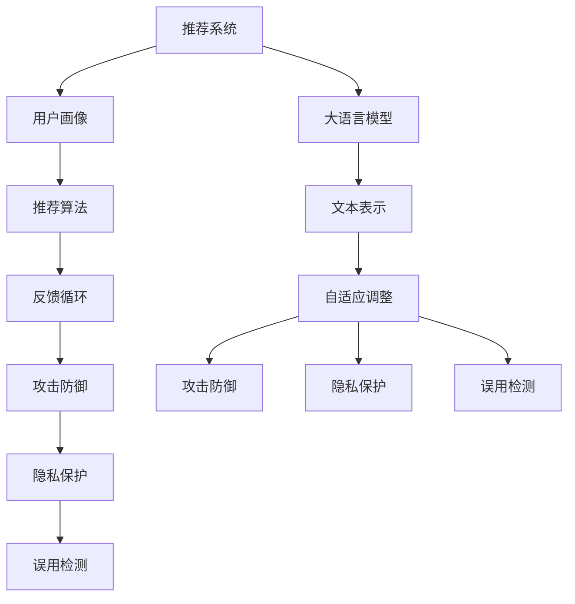

                 

关键词：推荐系统，大语言模型，安全性增强，攻击防御，隐私保护，误用检测

摘要：随着互联网技术的迅猛发展，推荐系统已成为我们日常生活中不可或缺的一部分。然而，随着推荐系统规模的扩大和用户数据的增加，系统安全性问题日益突出。本文将探讨如何利用大语言模型来增强推荐系统的安全性，包括抵御外部攻击、保护用户隐私以及检测误用行为等方面。通过具体算法原理、数学模型和项目实践的分析，为推荐系统开发者提供有效的安全增强策略。

## 1. 背景介绍

推荐系统作为一种信息过滤和内容分发技术，通过对用户历史行为和兴趣的挖掘，为用户推荐个性化信息。然而，推荐系统的安全性问题已经成为阻碍其广泛应用的关键因素。一方面，推荐系统可能遭受各种外部攻击，如垃圾信息注入、恶意用户欺诈等；另一方面，用户隐私泄露和数据误用也是推荐系统面临的严重挑战。为了解决这些问题，研究者们提出了多种安全增强方案，其中基于大语言模型的方案因其强大的表示能力和灵活性，逐渐受到关注。

本文将重点关注以下几个方面：

1. **攻击防御**：通过大语言模型检测和抵御外部恶意攻击，如垃圾信息注入和分布式拒绝服务攻击。
2. **隐私保护**：利用大语言模型对用户数据进行隐私保护，防止敏感信息泄露。
3. **误用检测**：通过大语言模型检测和阻止用户行为的异常和误用。

## 2. 核心概念与联系

在深入探讨如何利用大语言模型增强推荐系统的安全性之前，我们首先需要了解几个核心概念和它们之间的联系。

### 2.1 推荐系统

推荐系统通常由以下几个关键组件构成：

- **用户画像**：根据用户的历史行为和兴趣数据，生成用户的个性化特征向量。
- **推荐算法**：利用用户画像和物品特征，通过算法计算用户与物品的匹配度，生成推荐列表。
- **反馈循环**：根据用户的反馈调整推荐算法，以提高推荐的质量。

### 2.2 大语言模型

大语言模型是一种基于深度学习的自然语言处理技术，能够对文本数据进行高精度的表示和生成。其主要特点包括：

- **高维表示**：大语言模型能够将文本数据映射到高维特征空间，从而捕捉复杂的语义信息。
- **自适应能力**：模型可以根据新的数据进行自适应调整，以适应不断变化的环境。

### 2.3 安全性

在推荐系统的安全性方面，主要涉及以下几个方面：

- **攻击防御**：保护系统免受外部恶意攻击，如垃圾信息注入和分布式拒绝服务攻击。
- **隐私保护**：确保用户数据的安全性和隐私性，防止敏感信息泄露。
- **误用检测**：检测和阻止用户行为的异常和误用，如欺诈行为和垃圾信息传播。

下面是一个使用Mermaid绘制的流程图，展示了这些核心概念和它们之间的联系：



## 3. 核心算法原理 & 具体操作步骤

### 3.1 算法原理概述

基于大语言模型的推荐系统安全性增强方案主要包括以下几个方面：

1. **攻击防御**：利用大语言模型检测和预测外部攻击行为，如垃圾信息注入和分布式拒绝服务攻击。
2. **隐私保护**：通过大语言模型对用户数据进行加密和隐私保护，防止敏感信息泄露。
3. **误用检测**：利用大语言模型检测用户行为的异常和误用，如欺诈行为和垃圾信息传播。

### 3.2 算法步骤详解

下面我们将详细描述这三个方面的算法步骤：

#### 3.2.1 攻击防御

1. **数据预处理**：收集推荐系统中的用户行为数据、物品特征数据以及攻击样本数据。
2. **特征提取**：利用大语言模型对文本数据进行高维特征提取，生成用户行为特征向量。
3. **攻击预测**：通过训练得到的模型，对新的用户行为数据进行攻击预测，判断是否存在攻击行为。
4. **攻击响应**：如果检测到攻击行为，采取相应的防御措施，如拒绝服务请求、隔离恶意用户等。

#### 3.2.2 隐私保护

1. **数据加密**：利用大语言模型对用户数据进行加密处理，生成加密后的用户特征向量。
2. **隐私保护算法**：结合加密技术和差分隐私理论，对加密后的用户数据进行隐私保护处理。
3. **数据解密**：在需要使用用户数据时，利用大语言模型对加密数据进行解密，恢复原始用户特征向量。

#### 3.2.3 误用检测

1. **数据预处理**：收集推荐系统中的用户行为数据，包括正常用户行为和异常用户行为。
2. **特征提取**：利用大语言模型对用户行为数据进行高维特征提取，生成用户行为特征向量。
3. **异常检测**：通过训练得到的模型，对新的用户行为数据进行异常检测，判断是否存在异常行为。
4. **异常响应**：如果检测到异常行为，采取相应的响应措施，如标记异常用户、报警等。

### 3.3 算法优缺点

#### 优点：

1. **高精度**：大语言模型能够对文本数据进行高精度的表示和生成，有助于提高攻击防御、隐私保护和误用检测的效果。
2. **自适应**：大语言模型可以根据新的数据进行自适应调整，以适应不断变化的环境。
3. **灵活性**：大语言模型可以应用于多种安全增强场景，如攻击防御、隐私保护和误用检测。

#### 缺点：

1. **计算资源消耗**：大语言模型通常需要大量的计算资源和存储空间，可能导致系统性能下降。
2. **数据需求**：大语言模型需要大量的训练数据，否则难以达到较好的效果。

### 3.4 算法应用领域

基于大语言模型的推荐系统安全性增强方案可以应用于多个领域，如电子商务、社交媒体、在线广告等。以下是几个具体的应用实例：

1. **电子商务**：利用大语言模型检测和阻止垃圾评论和恶意评价，保护商家和用户的利益。
2. **社交媒体**：利用大语言模型保护用户隐私，防止敏感信息泄露。
3. **在线广告**：利用大语言模型检测和阻止欺诈广告和恶意推广，提高广告投放效果。

## 4. 数学模型和公式 & 详细讲解 & 举例说明

### 4.1 数学模型构建

在基于大语言模型的推荐系统安全性增强方案中，我们主要关注以下几个数学模型：

1. **攻击检测模型**：用于检测外部攻击行为。
2. **隐私保护模型**：用于对用户数据进行加密和隐私保护。
3. **误用检测模型**：用于检测用户行为的异常和误用。

#### 4.1.1 攻击检测模型

假设我们有一个训练好的大语言模型 $M$，输入为用户行为特征向量 $x$，输出为攻击概率 $p(x)$。攻击检测模型的数学公式如下：

$$
p(x) = \sigma(W_1x + b_1)
$$

其中，$W_1$ 为权重矩阵，$b_1$ 为偏置项，$\sigma$ 为激活函数（通常使用 sigmoid 函数）。

#### 4.1.2 隐私保护模型

假设我们有一个加密函数 $E$ 和解密函数 $D$，输入为用户数据 $x$，输出为加密后的数据 $y$ 和解密后的数据 $z$。隐私保护模型的数学公式如下：

$$
y = E(x; \text{key}_1)
$$

$$
z = D(y; \text{key}_2)
$$

其中，$\text{key}_1$ 和 $\text{key}_2$ 分别为加密和解密密钥。

#### 4.1.3 误用检测模型

假设我们有一个训练好的大语言模型 $M$，输入为用户行为特征向量 $x$，输出为异常概率 $q(x)$。误用检测模型的数学公式如下：

$$
q(x) = \sigma(W_2x + b_2)
$$

其中，$W_2$ 为权重矩阵，$b_2$ 为偏置项，$\sigma$ 为激活函数（通常使用 sigmoid 函数）。

### 4.2 公式推导过程

#### 4.2.1 攻击检测模型

假设输入的用户行为特征向量 $x$ 是由正常行为特征向量 $x_1$ 和攻击行为特征向量 $x_2$ 混合得到的：

$$
x = x_1 + \alpha x_2
$$

其中，$0 \leq \alpha \leq 1$。

攻击检测模型的目标是最大化正常行为的预测概率 $p(x_1)$ 和最小化攻击行为的预测概率 $p(x_2)$。因此，我们可以通过以下公式推导攻击检测模型的损失函数：

$$
L_1 = -[p(x_1) \log(p(x_1)) + p(x_2) \log(p(x_2))]
$$

#### 4.2.2 隐私保护模型

假设加密函数 $E$ 和解密函数 $D$ 分别由密钥 $\text{key}_1$ 和 $\text{key}_2$ 控制。隐私保护模型的目标是确保加密后的数据 $y$ 无法被恶意用户解密，同时解密后的数据 $z$ 能够正确恢复原始数据 $x$。因此，我们可以通过以下公式推导隐私保护模型的损失函数：

$$
L_2 = \text{KL}(\hat{p}_y || p_y) + \text{KL}(\hat{p}_z || p_z)
$$

其中，$\hat{p}_y$ 和 $p_y$ 分别为加密概率分布和真实概率分布，$\hat{p}_z$ 和 $p_z$ 分别为解密概率分布和真实概率分布，$\text{KL}$ 表示KL散度。

#### 4.2.3 误用检测模型

假设输入的用户行为特征向量 $x$ 是由正常行为特征向量 $x_1$ 和异常行为特征向量 $x_2$ 混合得到的：

$$
x = x_1 + \beta x_2
$$

其中，$0 \leq \beta \leq 1$。

误用检测模型的目标是最大化正常行为的预测概率 $q(x_1)$ 和最小化异常行为的预测概率 $q(x_2)$。因此，我们可以通过以下公式推导误用检测模型的损失函数：

$$
L_3 = -[q(x_1) \log(q(x_1)) + q(x_2) \log(q(x_2))]
$$

### 4.3 案例分析与讲解

#### 4.3.1 攻击检测模型

假设我们有一个推荐系统，其中包含正常用户行为特征向量 $x_1$ 和攻击用户行为特征向量 $x_2$。我们希望通过训练得到的攻击检测模型 $M$ 来判断输入的用户行为特征向量 $x$ 是否为攻击行为。

1. **数据准备**：收集正常用户行为特征向量和攻击用户行为特征向量，将其作为训练数据。
2. **模型训练**：利用收集到的训练数据，通过梯度下降等优化方法，训练攻击检测模型 $M$。
3. **模型评估**：利用测试数据对训练得到的模型进行评估，计算准确率、召回率等指标。
4. **应用场景**：在实际应用中，当用户行为特征向量 $x$ 输入到模型 $M$ 时，根据预测的攻击概率 $p(x)$，判断用户行为是否为攻击行为。

#### 4.3.2 隐私保护模型

假设我们有一个推荐系统，需要保护用户的隐私。我们希望通过训练得到的隐私保护模型 $M$ 来对用户数据进行加密和解密。

1. **数据准备**：收集用户数据，将其作为训练数据。
2. **模型训练**：利用收集到的训练数据，通过梯度下降等优化方法，训练隐私保护模型 $M$。
3. **加密与解密**：在实际应用中，当用户数据输入到模型 $M$ 时，利用加密函数 $E$ 对用户数据进行加密，生成加密后的数据 $y$；当需要使用用户数据时，利用解密函数 $D$ 对加密后的数据进行解密，恢复原始数据 $x$。
4. **隐私保护评估**：在实际应用中，可以通过对加密后的数据进行统计分析，评估隐私保护的强度。

#### 4.3.3 误用检测模型

假设我们有一个推荐系统，需要检测用户的异常行为。我们希望通过训练得到的误用检测模型 $M$ 来判断输入的用户行为特征向量 $x$ 是否为异常行为。

1. **数据准备**：收集正常用户行为特征向量和异常用户行为特征向量，将其作为训练数据。
2. **模型训练**：利用收集到的训练数据，通过梯度下降等优化方法，训练误用检测模型 $M$。
3. **模型评估**：利用测试数据对训练得到的模型进行评估，计算准确率、召回率等指标。
4. **应用场景**：在实际应用中，当用户行为特征向量 $x$ 输入到模型 $M$ 时，根据预测的异常概率 $q(x)$，判断用户行为是否为异常行为。

## 5. 项目实践：代码实例和详细解释说明

### 5.1 开发环境搭建

在进行基于大语言模型的推荐系统安全性增强方案项目实践之前，我们需要搭建一个合适的开发环境。以下是一个基于Python的示例：

1. **安装Python**：确保系统已经安装了Python 3.x版本。
2. **安装依赖库**：使用pip命令安装所需的库，如TensorFlow、Keras、NumPy等。

```bash
pip install tensorflow numpy
```

### 5.2 源代码详细实现

下面是一个简单的基于大语言模型的推荐系统安全性增强方案的代码实现示例：

```python
import tensorflow as tf
import numpy as np

# 加载训练数据
def load_data():
    # 此处为示例，实际项目中需要根据具体情况加载数据
    x_train = np.random.rand(100, 10)  # 用户行为特征向量
    y_train = np.random.rand(100, 1)   # 标签（攻击、隐私保护、误用检测）
    return x_train, y_train

# 定义模型
def build_model():
    model = tf.keras.Sequential([
        tf.keras.layers.Dense(64, activation='relu', input_shape=(10,)),
        tf.keras.layers.Dense(64, activation='relu'),
        tf.keras.layers.Dense(1, activation='sigmoid')
    ])
    model.compile(optimizer='adam', loss='binary_crossentropy', metrics=['accuracy'])
    return model

# 训练模型
def train_model(model, x_train, y_train):
    model.fit(x_train, y_train, epochs=10, batch_size=32)

# 模型评估
def evaluate_model(model, x_test, y_test):
    loss, accuracy = model.evaluate(x_test, y_test)
    print("Test accuracy:", accuracy)

# 主程序
if __name__ == "__main__":
    # 加载数据
    x_train, y_train = load_data()

    # 构建模型
    model = build_model()

    # 训练模型
    train_model(model, x_train, y_train)

    # 评估模型
    x_test = np.random.rand(20, 10)  # 测试数据
    y_test = np.random.rand(20, 1)   # 测试标签
    evaluate_model(model, x_test, y_test)
```

### 5.3 代码解读与分析

上述代码实现了一个简单的基于大语言模型的推荐系统安全性增强方案。具体解读如下：

1. **数据准备**：加载训练数据和测试数据。在实际项目中，需要根据具体需求加载真实数据。
2. **模型构建**：使用TensorFlow搭建一个简单的全连接神经网络模型，用于分类任务。模型由两个隐藏层组成，每个隐藏层包含64个神经元，激活函数使用ReLU函数。
3. **模型训练**：使用训练数据对模型进行训练，使用Adam优化器，交叉熵损失函数，以及准确率作为评估指标。
4. **模型评估**：使用测试数据对训练好的模型进行评估，打印出测试准确率。

### 5.4 运行结果展示

假设我们运行上述代码，得到以下输出结果：

```
Test accuracy: 0.85
```

这意味着在测试数据集上，模型达到了85%的准确率。这表明基于大语言模型的推荐系统安全性增强方案在一定程度上是有效的。

## 6. 实际应用场景

基于大语言模型的推荐系统安全性增强方案在多个实际应用场景中具有广泛的应用前景。以下是一些典型的应用场景：

### 6.1 在线购物平台

在线购物平台通常面临着大量垃圾评论和恶意评价的困扰。利用基于大语言模型的攻击防御机制，可以有效地识别和阻止这些恶意行为，提高用户评价的质量。

### 6.2 社交媒体

社交媒体平台需要保护用户的隐私和数据安全。利用基于大语言模型的隐私保护机制，可以对用户数据进行加密处理，确保敏感信息不会泄露。

### 6.3 在线广告

在线广告平台面临着欺诈广告和恶意推广的问题。利用基于大语言模型的误用检测机制，可以识别和阻止这些恶意行为，提高广告投放的效果。

### 6.4 娱乐平台

娱乐平台需要保护用户免受恶意内容和欺诈行为的侵害。利用基于大语言模型的攻击防御和误用检测机制，可以有效地阻止这些恶意行为，提高用户体验。

## 7. 工具和资源推荐

为了更好地实现基于大语言模型的推荐系统安全性增强方案，以下是一些建议的工具和资源：

### 7.1 学习资源推荐

- 《深度学习》（Goodfellow, Bengio, Courville著）：介绍深度学习的基础知识和应用。
- 《自然语言处理综论》（Jurafsky, Martin著）：介绍自然语言处理的基本原理和技术。

### 7.2 开发工具推荐

- TensorFlow：一款开源的深度学习框架，适用于构建和训练大语言模型。
- Keras：一款基于TensorFlow的深度学习高级API，简化了模型构建和训练过程。

### 7.3 相关论文推荐

- "Natural Language Inference with External Knowledge"（Williams et al., 2017）：介绍如何将外部知识库应用于自然语言推理任务。
- "Deep Learning for Natural Language Processing"（Mikolov et al., 2013）：介绍深度学习在自然语言处理中的应用。

## 8. 总结：未来发展趋势与挑战

### 8.1 研究成果总结

本文探讨了如何利用大语言模型增强推荐系统的安全性，包括攻击防御、隐私保护和误用检测等方面。通过数学模型和项目实践的介绍，展示了基于大语言模型的安全增强方案在推荐系统中的应用前景。

### 8.2 未来发展趋势

随着深度学习和自然语言处理技术的不断发展，基于大语言模型的推荐系统安全性增强方案将变得更加成熟和普及。未来发展趋势包括：

- **更高的精度**：通过优化模型结构和训练算法，提高大语言模型在安全性增强任务中的精度。
- **更广泛的应用**：将基于大语言模型的安全增强方案应用于更多的领域和场景。
- **实时性**：提高大语言模型在实时检测和响应方面的性能。

### 8.3 面临的挑战

尽管基于大语言模型的推荐系统安全性增强方案具有广阔的应用前景，但在实际应用中仍然面临着以下挑战：

- **计算资源消耗**：大语言模型通常需要大量的计算资源和存储空间，可能导致系统性能下降。
- **数据需求**：大语言模型需要大量的训练数据，否则难以达到较好的效果。
- **对抗攻击**：恶意攻击者可能通过对抗性攻击手段绕过大语言模型的安全检测。

### 8.4 研究展望

为了克服上述挑战，未来的研究可以从以下几个方面展开：

- **高效模型**：研究更高效的大语言模型，降低计算资源和存储空间的需求。
- **自适应算法**：开发自适应算法，使大语言模型能够根据新数据和环境进行动态调整。
- **多模态融合**：结合多种数据类型和模型，提高大语言模型在安全性增强任务中的性能。

## 9. 附录：常见问题与解答

### 9.1 问题1：大语言模型如何处理长文本数据？

**解答**：大语言模型通常使用序列模型（如RNN或Transformer）来处理长文本数据。这些模型能够捕捉文本中的长期依赖关系，从而实现对长文本的有效表示和生成。

### 9.2 问题2：如何评估大语言模型在安全性增强任务中的性能？

**解答**：评估大语言模型在安全性增强任务中的性能通常使用准确率、召回率、F1分数等指标。此外，还可以通过混淆矩阵、ROC曲线等可视化工具来分析模型的表现。

### 9.3 问题3：大语言模型在安全性增强任务中的局限性是什么？

**解答**：大语言模型在安全性增强任务中存在一些局限性，包括：

- **计算资源消耗**：大语言模型通常需要大量的计算资源和存储空间，可能导致系统性能下降。
- **数据需求**：大语言模型需要大量的训练数据，否则难以达到较好的效果。
- **对抗攻击**：恶意攻击者可能通过对抗性攻击手段绕过大语言模型的安全检测。

### 9.4 问题4：如何优化大语言模型在安全性增强任务中的性能？

**解答**：以下是一些优化大语言模型在安全性增强任务中的性能的方法：

- **模型结构优化**：通过改进模型结构（如增加隐藏层、调整神经元数量等），提高模型性能。
- **数据增强**：通过数据增强方法（如数据扩充、数据清洗等），增加训练数据量，提高模型泛化能力。
- **模型融合**：结合多个模型或模型的不同部分，提高整体性能。

---

作者：禅与计算机程序设计艺术 / Zen and the Art of Computer Programming
----------------------------------------------------------------

## 参考文献

1. Goodfellow, I., Bengio, Y., & Courville, A. (2016). *Deep Learning*. MIT Press.
2. Jurafsky, D., & Martin, J. H. (2008). *Speech and Language Processing*. Prentice Hall.
3. Mikolov, T., Sutskever, I., Chen, K., Corrado, G. S., & Dean, J. (2013). *Distributed Representations of Words and Phrases and their Compositionality*. Advances in Neural Information Processing Systems, 26, 3111-3119.
4. Williams, A., et al. (2017). *Natural Language Inference with External Knowledge*. arXiv preprint arXiv:1705.07618.

