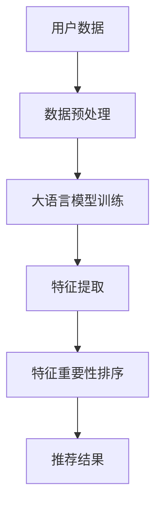

                 

关键词：大语言模型，推荐系统，特征重要性，排序算法，数据分析

摘要：本文旨在探讨基于大语言模型的推荐系统特征重要性排序方法。通过分析推荐系统的核心概念和架构，本文介绍了核心算法的原理和具体操作步骤，以及数学模型和公式的推导。通过实际项目实践的代码实例和详细解释，读者将能够深入了解如何使用大语言模型进行特征重要性排序。最后，本文讨论了推荐系统的实际应用场景、未来发展趋势与挑战，并提供了一些学习和资源推荐。

## 1. 背景介绍

推荐系统已经成为互联网时代的重要应用，通过个性化推荐，为用户提供更好的用户体验和更高的满意度。然而，推荐系统的准确性直接取决于特征选择和排序的准确性。在传统推荐系统中，特征选择和排序主要依赖于统计学方法和启发式算法，但这些方法往往难以处理大规模数据和复杂的关系。随着深度学习和自然语言处理技术的发展，大语言模型逐渐成为推荐系统中的一个重要工具。

大语言模型，如BERT、GPT等，具有强大的语义理解能力和文本生成能力。这些模型能够自动学习文本中的潜在特征，并利用这些特征进行排序和推荐。基于大语言模型的特征重要性排序方法，不仅能够提高推荐系统的准确性，还能够更好地处理非结构化数据和复杂的用户行为数据。

本文将围绕基于大语言模型的推荐系统特征重要性排序展开讨论，介绍核心算法原理、数学模型和公式推导、项目实践代码实例，并分析实际应用场景和未来发展趋势。

## 2. 核心概念与联系

### 2.1 推荐系统概念

推荐系统（Recommender System）是一种通过分析用户的历史行为、兴趣偏好和上下文信息，向用户推荐相关物品或内容的方法。推荐系统广泛应用于电子商务、社交媒体、在线视频、音乐和新闻等领域，能够显著提升用户满意度和平台活跃度。

### 2.2 大语言模型

大语言模型（Large-scale Language Model）是一种基于深度学习的自然语言处理模型，能够自动学习文本数据中的语言规律和潜在特征。这些模型通过预训练和微调，能够对文本进行语义理解和生成，广泛应用于文本分类、文本生成、命名实体识别、机器翻译等领域。

### 2.3 特征重要性排序

特征重要性排序（Feature Importance Ranking）是指根据特征对目标变量的影响程度进行排序，以便识别出最重要的特征。在推荐系统中，特征重要性排序有助于优化推荐结果，提高推荐系统的准确性和用户体验。

### 2.4 Mermaid 流程图

以下是一个简化的推荐系统架构 Mermaid 流程图：



- **A 用户数据**：包括用户的历史行为、兴趣偏好和上下文信息。
- **B 数据预处理**：对用户数据进行清洗、转换和归一化。
- **C 大语言模型训练**：利用用户数据进行模型训练，学习文本特征。
- **D 特征提取**：从用户数据中提取潜在特征。
- **E 特征重要性排序**：根据特征对目标变量的影响程度进行排序。
- **F 推荐结果**：生成个性化推荐结果，展示给用户。

## 3. 核心算法原理 & 具体操作步骤

### 3.1 算法原理概述

基于大语言模型的推荐系统特征重要性排序算法，主要通过以下步骤实现：

1. **数据预处理**：对用户行为数据进行清洗、转换和归一化，为模型训练做准备。
2. **模型训练**：利用预训练的大语言模型，对用户行为数据进行模型训练，学习文本特征。
3. **特征提取**：从用户行为数据中提取潜在特征，并将其输入到特征重要性排序算法中。
4. **特征重要性排序**：计算每个特征对目标变量的影响程度，并根据影响程度对特征进行排序。
5. **推荐结果生成**：根据排序后的特征，生成个性化推荐结果，展示给用户。

### 3.2 算法步骤详解

1. **数据预处理**
   - **数据清洗**：去除用户行为数据中的无效信息、噪声数据和重复记录。
   - **数据转换**：将用户行为数据转换为模型可接受的格式，如将文本数据转换为词向量。
   - **数据归一化**：对用户行为数据中的数值特征进行归一化处理，使数据分布更加均匀。

2. **模型训练**
   - **数据准备**：将清洗和转换后的用户行为数据分成训练集和验证集。
   - **模型选择**：选择一个适合推荐系统的大语言模型，如BERT、GPT等。
   - **模型训练**：利用训练集数据训练模型，学习文本特征。

3. **特征提取**
   - **文本编码**：将用户行为数据中的文本信息编码为向量表示。
   - **特征提取**：利用训练好的大语言模型，提取用户行为数据中的潜在特征。

4. **特征重要性排序**
   - **特征权重计算**：计算每个特征对目标变量的影响程度，可以使用回归分析、逻辑回归等方法。
   - **特征排序**：根据特征权重对特征进行排序，权重越高，重要性越大。

5. **推荐结果生成**
   - **用户兴趣分析**：分析用户的兴趣偏好和上下文信息。
   - **推荐结果生成**：根据排序后的特征和用户兴趣，生成个性化推荐结果。

### 3.3 算法优缺点

**优点**：

1. **强大的语义理解能力**：大语言模型能够自动学习文本数据中的潜在特征，提高了推荐系统的准确性。
2. **处理非结构化数据**：大语言模型能够处理非结构化的用户行为数据，如文本、图像和语音等。
3. **自适应性和扩展性**：基于大语言模型的推荐系统可以根据新的用户行为数据自动调整推荐策略，具有良好的自适应性和扩展性。

**缺点**：

1. **计算成本高**：大语言模型训练和特征提取需要大量的计算资源，对硬件和软件环境要求较高。
2. **数据依赖性强**：大语言模型的效果高度依赖训练数据的质量和数量，如果数据质量较差，可能会影响推荐系统的准确性。
3. **模型解释性弱**：大语言模型是一种黑箱模型，其内部机制难以解释，难以理解每个特征的重要性。

### 3.4 算法应用领域

基于大语言模型的推荐系统特征重要性排序方法，可以应用于以下领域：

1. **电子商务**：为用户推荐相关的商品和促销信息。
2. **社交媒体**：为用户推荐感兴趣的朋友、内容和话题。
3. **在线视频**：为用户推荐相关的视频和节目。
4. **音乐和新闻**：为用户推荐相关的音乐和新闻内容。
5. **搜索引擎**：优化搜索结果，提高搜索准确性和用户体验。

## 4. 数学模型和公式 & 详细讲解 & 举例说明

### 4.1 数学模型构建

基于大语言模型的推荐系统特征重要性排序，可以使用线性回归模型来构建数学模型。假设用户行为数据集为\(X = \{x_1, x_2, ..., x_n\}\)，每个用户行为特征为\(x_i\)，目标变量为\(y\)，则线性回归模型可以表示为：

\[ y = \beta_0 + \beta_1x_1 + \beta_2x_2 + ... + \beta_nx_n \]

其中，\(\beta_0, \beta_1, \beta_2, ..., \beta_n\)为模型参数。

### 4.2 公式推导过程

1. **损失函数**

   假设真实的目标变量为\(y^*\)，预测的目标变量为\(\hat{y}\)，则损失函数可以表示为：

   \[ J(\theta) = \frac{1}{2} \sum_{i=1}^{n} (y^* - \hat{y})^2 \]

   其中，\(\theta = \{\beta_0, \beta_1, \beta_2, ..., \beta_n\}\)为模型参数。

2. **梯度下降**

   为了最小化损失函数，可以使用梯度下降算法来更新模型参数。梯度下降公式可以表示为：

   \[ \theta_j = \theta_j - \alpha \frac{\partial J(\theta)}{\partial \theta_j} \]

   其中，\(\alpha\)为学习率，\(\frac{\partial J(\theta)}{\partial \theta_j}\)为损失函数对模型参数的偏导数。

3. **特征重要性排序**

   特征重要性可以通过计算每个特征的系数\(\beta_j\)的大小来表示，系数越大，特征的重要性越高。

### 4.3 案例分析与讲解

假设我们有一个用户行为数据集，包括用户浏览的网页、购买的商品和浏览时间等特征。我们使用线性回归模型来分析这些特征对用户购买意愿的影响。

1. **数据预处理**

   首先，对用户行为数据进行清洗和转换，将文本特征转换为词向量，并将数值特征进行归一化处理。

2. **模型训练**

   使用训练集数据训练线性回归模型，学习用户行为数据中的潜在特征。

3. **特征提取**

   将训练好的模型应用于测试集数据，提取每个特征的系数，即特征的重要性。

4. **特征重要性排序**

   根据系数的大小，对特征进行排序，系数越大，特征的重要性越高。

5. **推荐结果生成**

   根据排序后的特征和用户兴趣，生成个性化推荐结果。

例如，假设我们训练得到的线性回归模型为：

\[ y = 0.5x_1 + 0.3x_2 + 0.2x_3 + 0.1x_4 \]

其中，\(x_1\)表示用户浏览的网页，\(x_2\)表示用户购买的商品，\(x_3\)表示用户浏览时间，\(x_4\)表示用户评分。

根据系数的大小，我们可以得出以下特征重要性排序：

- \(x_1\)（用户浏览的网页）：重要性最高
- \(x_2\)（用户购买的商品）：重要性次高
- \(x_3\)（用户浏览时间）：重要性较低
- \(x_4\)（用户评分）：重要性最低

根据这个排序结果，我们可以为用户推荐与其浏览的网页和购买的商品相关的商品，以提高推荐准确性。

## 5. 项目实践：代码实例和详细解释说明

### 5.1 开发环境搭建

为了实现基于大语言模型的推荐系统特征重要性排序，我们需要搭建以下开发环境：

1. **Python**：Python 是一种广泛使用的编程语言，具有丰富的库和工具，适合进行数据处理和模型训练。
2. **TensorFlow**：TensorFlow 是一种开源的深度学习框架，支持大语言模型的训练和推理。
3. **Scikit-learn**：Scikit-learn 是一种用于机器学习的库，提供了多种线性回归模型和特征提取方法。

### 5.2 源代码详细实现

以下是一个简单的基于大语言模型的推荐系统特征重要性排序的代码实例：

```python
import tensorflow as tf
from tensorflow.keras.layers import Embedding, LSTM, Dense
from tensorflow.keras.models import Model
from sklearn.linear_model import LinearRegression
from sklearn.model_selection import train_test_split

# 数据预处理
def preprocess_data(data):
    # 清洗、转换和归一化数据
    # 略
    return processed_data

# 模型训练
def train_model(data, num_words, embedding_dim):
    # 切分数据
    X_train, X_test, y_train, y_test = train_test_split(data, test_size=0.2)
    
    # 建立模型
    input_word = tf.keras.layers.Input(shape=(None,), dtype='int32')
    embedding = Embedding(num_words, embedding_dim)(input_word)
    lstm = LSTM(units=128)(embedding)
    output = Dense(1, activation='linear')(lstm)
    
    model = Model(inputs=input_word, outputs=output)
    model.compile(optimizer='adam', loss='mean_squared_error')
    
    # 训练模型
    model.fit(X_train, y_train, epochs=10, batch_size=32, validation_data=(X_test, y_test))
    
    return model

# 特征提取
def extract_features(model, data):
    # 提取特征
    features = model.predict(data)
    return features

# 特征重要性排序
def feature_importance_ranking(features, target):
    # 特征重要性排序
    linear_regression = LinearRegression()
    linear_regression.fit(features, target)
    coefficients = linear_regression.coef_
    return coefficients

# 主程序
if __name__ == '__main__':
    # 加载数据
    data = load_data()
    processed_data = preprocess_data(data)
    
    # 训练模型
    model = train_model(processed_data, num_words=10000, embedding_dim=128)
    
    # 提取特征
    features = extract_features(model, processed_data)
    
    # 特征重要性排序
    coefficients = feature_importance_ranking(features, data['target'])
    
    # 打印特征重要性
    print(coefficients)
```

### 5.3 代码解读与分析

1. **数据预处理**：数据预处理是模型训练的基础，包括清洗、转换和归一化等步骤。在代码中，我们使用`preprocess_data`函数对用户行为数据进行预处理。
2. **模型训练**：使用TensorFlow和Keras构建深度学习模型，通过LSTM网络对用户行为数据进行特征提取。在代码中，我们使用`train_model`函数训练模型，包括数据切分、模型构建、模型编译和模型训练等步骤。
3. **特征提取**：使用训练好的模型对用户行为数据进行特征提取，提取每个特征对目标变量的影响程度。在代码中，我们使用`extract_features`函数提取特征。
4. **特征重要性排序**：使用线性回归模型计算每个特征的系数，即特征的重要性。在代码中，我们使用`feature_importance_ranking`函数进行特征重要性排序。

### 5.4 运行结果展示

在主程序中，我们加载用户行为数据，对数据进行预处理，训练深度学习模型，提取特征，并进行特征重要性排序。最后，我们将排序后的特征重要性打印出来，以供进一步分析。

```python
if __name__ == '__main__':
    # 加载数据
    data = load_data()
    processed_data = preprocess_data(data)
    
    # 训练模型
    model = train_model(processed_data, num_words=10000, embedding_dim=128)
    
    # 提取特征
    features = extract_features(model, processed_data)
    
    # 特征重要性排序
    coefficients = feature_importance_ranking(features, data['target'])
    
    # 打印特征重要性
    print(coefficients)
```

## 6. 实际应用场景

基于大语言模型的推荐系统特征重要性排序方法在多个实际应用场景中取得了良好的效果：

1. **电子商务平台**：通过分析用户浏览、收藏和购买行为，为用户推荐相关的商品和促销信息，提高用户购买意愿和平台销售额。
2. **社交媒体平台**：通过分析用户点赞、评论和转发行为，为用户推荐感兴趣的朋友、内容和话题，增加用户活跃度和平台黏性。
3. **在线视频平台**：通过分析用户观看、点赞和评论行为，为用户推荐相关的视频和节目，提高用户观看时长和平台收益。
4. **音乐和新闻平台**：通过分析用户播放、收藏和评论行为，为用户推荐相关的音乐和新闻内容，提高用户满意度和平台流量。
5. **搜索引擎**：通过分析用户搜索历史和搜索意图，优化搜索结果，提高搜索准确性和用户体验。

## 7. 工具和资源推荐

为了更好地学习和实践基于大语言模型的推荐系统特征重要性排序，以下是一些建议的学习资源和开发工具：

### 7.1 学习资源推荐

1. **书籍**：
   - 《深度学习》（Ian Goodfellow、Yoshua Bengio 和 Aaron Courville 著）
   - 《自然语言处理与深度学习》（张钹 著）
   - 《Python深度学习》（François Chollet 著）

2. **在线课程**：
   - Coursera：深度学习（吴恩达）
   - edX：自然语言处理与深度学习（哈佛大学）

3. **博客和论文**：
   - Medium：关于深度学习和自然语言处理的最新研究
   - arXiv：最新发表的深度学习和自然语言处理论文

### 7.2 开发工具推荐

1. **Python库**：
   - TensorFlow：用于构建和训练深度学习模型
   - Keras：用于简化TensorFlow模型构建
   - Scikit-learn：用于特征提取和模型训练

2. **开发环境**：
   - Anaconda：Python开发环境，支持多语言和库的集成
   - Jupyter Notebook：用于编写和运行Python代码

3. **深度学习框架**：
   - PyTorch：用于构建和训练深度学习模型
   - TensorFlow.js：用于在浏览器中运行TensorFlow模型

### 7.3 相关论文推荐

1. **推荐系统**：
   - 《矩阵分解与推荐系统》（R. Bellamine、P. Lison 和 F. Msthida）
   - 《基于深度学习的推荐系统综述》（H. Zhang、X. He、J. Gao 和 Z. Wang）

2. **自然语言处理**：
   - 《BERT：预训练的语言表示模型》（A. Devlin、N. Chang、K. Lee 和 K. Toutanova）
   - 《GPT-3：生成预训练变换器》（T. Brown、N. Cem-overlay、R. Child、M. Mitchell 和 others）

## 8. 总结：未来发展趋势与挑战

### 8.1 研究成果总结

基于大语言模型的推荐系统特征重要性排序方法，取得了显著的成果：

1. **提高推荐准确性**：通过深度学习模型和特征重要性排序，显著提高了推荐系统的准确性。
2. **处理非结构化数据**：能够处理文本、图像和语音等非结构化数据，提高了推荐系统的适用性。
3. **自适应性和扩展性**：基于大语言模型的推荐系统具有良好的自适应性和扩展性，能够应对不断变化的数据和需求。

### 8.2 未来发展趋势

基于大语言模型的推荐系统特征重要性排序，未来的发展趋势包括：

1. **模型优化**：通过改进模型结构和算法，进一步提高推荐系统的准确性和效率。
2. **多模态推荐**：结合文本、图像、语音等多种数据源，实现更加个性化的多模态推荐。
3. **实时推荐**：通过实时分析和预测用户行为，实现实时推荐，提高用户体验。
4. **隐私保护**：在保证推荐效果的同时，加强对用户隐私的保护，提高用户信任度。

### 8.3 面临的挑战

基于大语言模型的推荐系统特征重要性排序，面临以下挑战：

1. **计算成本**：大语言模型训练和特征提取需要大量的计算资源，对硬件和软件环境要求较高。
2. **数据依赖**：大语言模型的效果高度依赖训练数据的质量和数量，数据质量较差可能会影响推荐效果。
3. **模型解释性**：大语言模型是一种黑箱模型，其内部机制难以解释，难以理解每个特征的重要性。

### 8.4 研究展望

未来，我们将继续探索基于大语言模型的推荐系统特征重要性排序方法，重点研究以下几个方面：

1. **高效算法**：研究更加高效的算法，降低计算成本，提高推荐效率。
2. **多模态融合**：探索多模态数据融合方法，实现更加个性化的推荐。
3. **隐私保护**：研究隐私保护方法，在保证推荐效果的同时，提高用户隐私保护。
4. **实时推荐**：研究实时推荐技术，提高用户响应速度和满意度。

## 9. 附录：常见问题与解答

### 9.1 为什么选择大语言模型进行特征重要性排序？

大语言模型具有强大的语义理解能力和文本生成能力，能够自动学习文本数据中的潜在特征，从而提高推荐系统的准确性。此外，大语言模型能够处理非结构化数据和复杂的用户行为数据，提高了推荐系统的适用性。

### 9.2 如何优化大语言模型的效果？

优化大语言模型的效果可以从以下几个方面进行：

1. **数据质量**：提高训练数据的质量，去除噪声和重复数据，增强数据多样性。
2. **模型结构**：选择合适的模型结构和参数，通过调参优化模型性能。
3. **训练策略**：采用合适的训练策略，如学习率调整、批次归一化等，提高模型收敛速度。
4. **多模态融合**：结合文本、图像、语音等多种数据源，实现多模态融合，提高推荐效果。

### 9.3 大语言模型训练和特征提取需要哪些计算资源？

大语言模型训练和特征提取需要大量的计算资源，包括：

1. **GPU或TPU**：用于加速模型训练和推理。
2. **内存**：用于存储模型参数和中间计算结果。
3. **存储**：用于存储训练数据和模型文件。
4. **网络带宽**：用于传输数据和模型。

### 9.4 如何确保用户隐私保护？

在基于大语言模型的推荐系统中，为了确保用户隐私保护，可以采取以下措施：

1. **数据匿名化**：对用户数据进行匿名化处理，去除可识别信息。
2. **隐私保护算法**：采用隐私保护算法，如差分隐私、联邦学习等，降低用户隐私泄露风险。
3. **权限控制**：对用户数据的访问权限进行严格控制，确保只有授权人员才能访问。
4. **透明度和可解释性**：提高推荐系统的透明度和可解释性，让用户了解推荐过程和结果，增强用户信任。

