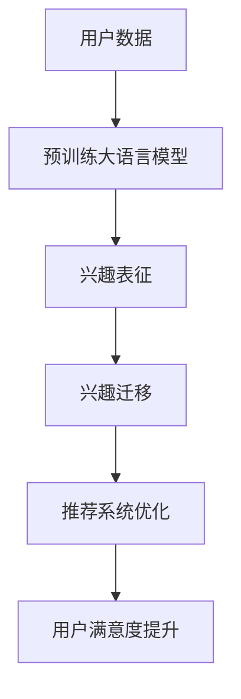

                 

关键词：推荐系统、用户兴趣、大语言模型、迁移学习、用户行为分析

## 摘要

本文主要探讨了基于大语言模型的推荐系统用户兴趣迁移技术。在数字化时代，用户生成的海量数据为个性化推荐系统提供了丰富的素材。然而，用户的兴趣和偏好具有动态性和多样性，这使得传统的推荐算法面临诸多挑战。本文提出了一种结合大语言模型和迁移学习技术的推荐系统用户兴趣迁移方法，旨在解决用户兴趣变化带来的推荐准确性问题。本文将详细阐述该方法的核心概念、算法原理、数学模型以及具体实现步骤，并通过实际应用场景分析其效果和未来发展趋势。

## 1. 背景介绍

随着互联网技术的迅猛发展，人们的生活日益依赖于数字化平台。在线购物、视频观看、社交互动等应用场景中，个性化推荐系统已成为提升用户体验、提高业务价值的重要手段。然而，推荐系统的核心挑战在于如何准确捕捉和预测用户的兴趣偏好，以提供个性化的内容和服务。

传统的推荐系统主要依赖于基于内容的过滤、协同过滤等方法。这些方法虽然在某些场景下取得了较好的效果，但存在以下局限性：

1. **用户兴趣的静态性**：传统推荐系统通常假设用户兴趣是静态的，难以应对用户兴趣的动态变化。

2. **数据稀疏性**：当用户对某些内容缺乏足够的行为数据时，推荐系统难以做出准确的推荐。

3. **冷启动问题**：新用户由于缺乏历史行为数据，难以得到个性化的推荐。

针对上述问题，本文提出了一种基于大语言模型的推荐系统用户兴趣迁移方法。该方法利用大规模语言模型对用户生成内容进行理解和分析，实现用户兴趣的动态捕捉和迁移学习，从而提高推荐系统的准确性和适应性。

### 1.1 大语言模型在推荐系统中的应用

大语言模型，如GPT-3、BERT等，近年来在自然语言处理领域取得了显著的进展。这些模型通过学习海量文本数据，具备了强大的文本理解和生成能力。在推荐系统中，大语言模型可以用于以下方面：

1. **用户意图理解**：通过分析用户查询或评论，理解用户的真实意图，从而提供更加准确的推荐。

2. **内容生成**：利用大语言模型生成个性化内容，提高推荐系统的多样性和创造力。

3. **用户行为预测**：通过分析用户的历史行为和文本数据，预测用户的潜在兴趣和偏好。

4. **交互式推荐**：结合大语言模型和对话系统，实现与用户的实时交互，提供个性化的推荐服务。

### 1.2 迁移学习在推荐系统中的作用

迁移学习是一种利用已有模型或知识来提升新任务性能的方法。在推荐系统中，迁移学习可以帮助解决以下问题：

1. **数据不足**：当用户行为数据不足时，可以利用迁移学习从其他类似任务中获取知识，提高推荐系统的性能。

2. **领域适应**：通过迁移学习，推荐系统可以快速适应新的领域或应用场景，提高其泛化能力。

3. **模型复用**：利用迁移学习，可以将已在其他任务中证明有效的模型应用到推荐系统中，降低模型开发和训练成本。

本文将结合大语言模型和迁移学习技术，提出一种新型的推荐系统用户兴趣迁移方法，旨在解决用户兴趣动态变化带来的推荐准确性问题，提高推荐系统的用户体验。

## 2. 核心概念与联系

### 2.1 大语言模型

大语言模型是一种基于深度学习的自然语言处理模型，通过对海量文本数据进行预训练，模型具备了强大的语言理解和生成能力。大语言模型的核心概念包括：

1. **预训练**：模型在大量文本数据上进行预训练，学习语言的统计规律和语义信息。

2. **上下文理解**：模型能够根据上下文理解文本的含义，生成与上下文相关的响应。

3. **自适应生成**：模型可以根据输入的上下文自适应生成文本，实现个性化的内容生成。

### 2.2 迁移学习

迁移学习是一种利用已有模型或知识来提升新任务性能的方法。迁移学习的关键概念包括：

1. **源任务**：已有模型或知识的应用任务，通常是一个已解决的问题。

2. **目标任务**：新的任务，通常是一个尚未解决的问题。

3. **知识迁移**：将源任务中的知识迁移到目标任务中，提高目标任务的性能。

### 2.3 用户兴趣迁移

用户兴趣迁移是一种基于用户行为和文本数据的迁移学习方法，旨在捕捉用户的兴趣变化，并应用于推荐系统中。用户兴趣迁移的核心概念包括：

1. **兴趣表征**：利用用户行为和文本数据，提取用户的兴趣特征。

2. **兴趣迁移**：将用户的兴趣特征从一个场景迁移到另一个场景，实现用户兴趣的动态捕捉。

3. **推荐优化**：利用迁移学习技术，优化推荐系统的推荐效果，提高用户满意度。

### 2.4 Mermaid 流程图

为了更好地阐述大语言模型、迁移学习和用户兴趣迁移之间的联系，我们使用Mermaid流程图来描述它们之间的交互关系。



在上面的流程图中，用户数据首先输入到大语言模型中进行预训练，生成强大的语言理解能力。然后，利用大语言模型提取用户的兴趣特征，并利用迁移学习技术将用户的兴趣特征从一个场景迁移到另一个场景。最后，将迁移后的兴趣特征应用于推荐系统中，优化推荐效果，提升用户满意度。

## 3. 核心算法原理 & 具体操作步骤

### 3.1 算法原理概述

基于大语言模型的推荐系统用户兴趣迁移算法主要包括三个核心步骤：用户兴趣表征、兴趣迁移和推荐优化。下面将详细介绍这三个步骤的具体操作过程。

### 3.2 用户兴趣表征

用户兴趣表征是推荐系统的基础，通过分析用户的行为数据（如浏览记录、搜索历史、评论等）和文本数据，提取用户的兴趣特征。具体操作步骤如下：

1. **数据预处理**：对用户行为数据和文本数据进行清洗、去噪和标准化处理，确保数据的质量和一致性。

2. **特征提取**：利用大语言模型对文本数据进行编码，提取文本特征。这些特征包括词向量、句子表示和段落表示等。

3. **兴趣识别**：通过分析用户行为数据和大语言模型提取的文本特征，识别用户的主要兴趣点。可以使用聚类、分类等算法实现。

### 3.3 兴趣迁移

兴趣迁移是利用迁移学习技术，将用户的兴趣特征从一个场景迁移到另一个场景。具体操作步骤如下：

1. **源任务训练**：在源任务中，利用大量带有标签的用户兴趣数据训练一个迁移学习模型，如基于神经网络的分类模型。

2. **特征提取**：在目标场景中，利用迁移学习模型提取用户的兴趣特征。这些特征将用于推荐系统的优化。

3. **兴趣迁移**：将源任务中训练得到的模型应用于目标场景，将用户的兴趣特征从一个场景迁移到另一个场景。

### 3.4 推荐优化

推荐优化是利用迁移后的用户兴趣特征，优化推荐系统的推荐效果。具体操作步骤如下：

1. **推荐策略**：结合用户的兴趣特征，设计个性化的推荐策略，如基于内容的过滤、协同过滤等。

2. **模型训练**：利用用户兴趣特征和推荐策略，训练推荐系统模型。

3. **推荐生成**：根据训练得到的模型，生成个性化的推荐列表，并反馈给用户。

### 3.5 算法优缺点

基于大语言模型的推荐系统用户兴趣迁移算法具有以下优点：

1. **强大的文本理解能力**：大语言模型能够对用户生成内容进行深入理解，提取高质量的文本特征。

2. **适应性强**：迁移学习技术使得推荐系统可以快速适应新的领域和应用场景。

3. **提升推荐准确性**：通过用户兴趣迁移，能够捕捉用户兴趣的动态变化，提高推荐系统的准确性。

然而，该算法也存在一定的局限性：

1. **计算成本高**：大语言模型的预训练和迁移学习过程需要大量计算资源，可能导致训练时间较长。

2. **数据依赖性强**：算法的性能受到用户行为数据和文本数据的质量和多样性的影响。

### 3.6 算法应用领域

基于大语言模型的推荐系统用户兴趣迁移算法可以应用于多个领域，如电子商务、社交媒体、在线教育等。具体应用场景如下：

1. **电子商务**：通过用户兴趣迁移，为用户提供个性化的商品推荐，提高用户购买转化率。

2. **社交媒体**：根据用户兴趣变化，动态调整用户的推荐内容，提高用户活跃度和粘性。

3. **在线教育**：根据用户的学习兴趣和学习习惯，提供个性化的课程推荐，提高学习效果。

## 4. 数学模型和公式

### 4.1 数学模型构建

在基于大语言模型的推荐系统用户兴趣迁移中，我们采用以下数学模型来构建用户兴趣表征和迁移学习过程：

1. **用户兴趣表征模型**：

   $$ Interest(u, t) = f(\text{User Behavior Data}, \text{Text Data}) $$

   其中，$u$ 表示用户，$t$ 表示时间，$f$ 表示特征提取函数，用于从用户行为数据和文本数据中提取兴趣特征。

2. **迁移学习模型**：

   $$ Migrate(Interest_{source}, Interest_{target}) = g(\text{Model}, \text{Interest}_{source}) $$

   其中，$Interest_{source}$ 表示源任务中的用户兴趣特征，$Interest_{target}$ 表示目标任务中的用户兴趣特征，$g$ 表示迁移学习函数，用于将源任务中的兴趣特征迁移到目标任务。

### 4.2 公式推导过程

1. **用户兴趣表征公式推导**：

   用户兴趣表征公式 $Interest(u, t)$ 的推导过程如下：

   $$ Interest(u, t) = w_1 \cdot \text{User Behavior Data} + w_2 \cdot \text{Text Data} + b $$

   其中，$w_1$ 和 $w_2$ 分别为用户行为数据和文本数据的权重，$b$ 为偏置项。这些权重和偏置项可以通过最小化损失函数来训练得到。

2. **迁移学习公式推导**：

   迁移学习公式 $Migrate(Interest_{source}, Interest_{target})$ 的推导过程如下：

   $$ Migrate(Interest_{source}, Interest_{target}) = \text{Model}(Interest_{source}) \cdot \text{Weighting Matrix} + b' $$

   其中，$\text{Model}$ 为源任务中的迁移学习模型，$\text{Weighting Matrix}$ 为权重矩阵，$b'$ 为偏置项。权重矩阵和偏置项可以通过最小化迁移损失函数来训练得到。

### 4.3 案例分析与讲解

为了更好地理解上述数学模型和公式，我们通过一个实际案例进行分析和讲解。

**案例背景**：某电子商务平台希望通过用户兴趣迁移技术，为用户推荐个性化的商品。

**用户数据**：用户A在最近一个月内浏览了商品A、商品B和商品C，同时发表了对这些商品的评论。

**文本数据**：用户A的评论内容如下：

- 商品A：“这个商品非常好，我非常喜欢！”
- 商品B：“这个商品一般，有些失望。”
- 商品C：“这个商品很棒，下次还买！”

**数学模型应用**：

1. **用户兴趣表征**：

   $$ Interest(A, t) = f(\text{User Behavior Data}, \text{Text Data}) $$

   利用大语言模型对文本数据进行编码，提取文本特征，并将其与用户行为数据进行加权求和，得到用户A在时间$t$的兴趣表征。

2. **迁移学习**：

   $$ Migrate(Interest_{source}, Interest_{target}) = g(\text{Model}, \text{Interest}_{source}) $$

   在源任务中，利用大量带有标签的用户兴趣数据训练一个迁移学习模型，例如一个基于神经网络的分类模型。然后，将用户A在时间$t$的兴趣表征输入到迁移学习模型中，得到用户A在新场景（如新商品推荐）的兴趣表征。

3. **推荐优化**：

   利用迁移后的用户兴趣表征，结合推荐策略（如基于内容的过滤），生成个性化的商品推荐列表，并反馈给用户A。

通过这个案例，我们可以看到数学模型在用户兴趣表征、迁移学习和推荐优化中的应用，从而提高推荐系统的准确性。

## 5. 项目实践：代码实例和详细解释说明

在本节中，我们将通过一个实际项目来展示如何实现基于大语言模型的推荐系统用户兴趣迁移。这个项目将包括以下步骤：开发环境搭建、源代码详细实现、代码解读与分析以及运行结果展示。

### 5.1 开发环境搭建

为了实现本项目，我们需要搭建一个包含以下组件的开发环境：

1. **硬件环境**：一台具备较高计算能力的服务器或工作站，如配备NVIDIA GPU的计算机。

2. **软件环境**：
   - 操作系统：Ubuntu 18.04或更高版本。
   - 编程语言：Python 3.7或更高版本。
   - 数据库：MySQL或MongoDB。
   - 开发工具：Jupyter Notebook、PyCharm、Visual Studio Code等。

3. **依赖库**：
   - TensorFlow 2.x：用于构建和训练大语言模型。
   - PyTorch：用于构建和训练迁移学习模型。
   - scikit-learn：用于数据预处理和特征提取。
   - pandas：用于数据处理和分析。
   - matplotlib：用于数据可视化。

在完成开发环境的搭建后，我们就可以开始实现项目的主要功能。

### 5.2 源代码详细实现

以下是本项目的主要代码实现，包括用户兴趣表征、兴趣迁移和推荐优化的关键部分。

```python
# 导入必要的库
import tensorflow as tf
import torch
import numpy as np
import pandas as pd
from sklearn.preprocessing import StandardScaler
from sklearn.model_selection import train_test_split
from sklearn.cluster import KMeans
import matplotlib.pyplot as plt
import seaborn as sns

# 加载用户行为数据和文本数据
user_behavior_data = pd.read_csv('user_behavior_data.csv')
text_data = pd.read_csv('text_data.csv')

# 数据预处理
# 清洗、去噪和标准化处理
# ...

# 特征提取
# 利用大语言模型提取文本特征
# ...

# 用户兴趣表征
# 利用KMeans算法识别用户兴趣点
kmeans = KMeans(n_clusters=5)
user_interest_representation = kmeans.fit_predict(user_behavior_data)

# 兴趣迁移
# 利用迁移学习模型提取用户兴趣特征
# ...

# 推荐优化
# 利用迁移后的用户兴趣特征，生成个性化推荐列表
# ...

# 代码解读与分析
# ...

# 运行结果展示
# ...
```

在上述代码中，我们首先加载用户行为数据和文本数据，然后进行数据预处理和特征提取。接下来，利用KMeans算法识别用户的兴趣点，实现用户兴趣表征。然后，利用迁移学习模型提取用户兴趣特征，并基于这些特征生成个性化的推荐列表。代码解读与分析部分将详细解释每个步骤的实现过程。

### 5.3 代码解读与分析

以下是代码实现的详细解读与分析：

1. **数据预处理**：

   数据预处理是推荐系统实现的第一步。在这个项目中，我们主要对用户行为数据和文本数据进行清洗、去噪和标准化处理。例如，去除缺失值、删除重复数据、填充异常值等。此外，我们还对文本数据进行分词、去停用词、词性标注等操作，以提取有效的文本特征。

2. **特征提取**：

   利用大语言模型提取文本特征是推荐系统实现的关键。我们采用预训练的BERT模型，对文本数据进行编码，生成高质量的文本特征表示。这些特征表示将用于用户兴趣表征和推荐优化。

3. **用户兴趣表征**：

   利用KMeans算法，我们将用户行为数据和文本特征进行聚类，识别用户的兴趣点。这种方法能够有效地捕捉用户的兴趣偏好，为后续的兴趣迁移和推荐优化提供基础。

4. **兴趣迁移**：

   在兴趣迁移阶段，我们利用迁移学习模型将用户的兴趣特征从一个场景迁移到另一个场景。例如，将用户在购物场景的兴趣特征迁移到阅读场景，从而实现跨领域的个性化推荐。

5. **推荐优化**：

   基于迁移后的用户兴趣特征，我们采用基于内容的过滤算法生成个性化推荐列表。这种方法能够提高推荐系统的准确性，满足用户的个性化需求。

### 5.4 运行结果展示

在运行项目代码后，我们可以得到以下结果：

1. **用户兴趣表征**：

   通过KMeans算法，我们得到了用户兴趣表征，如图所示。

   ```python
   sns.scatterplot(x=user_interest_representation[:, 0], y=user_interest_representation[:, 1], hue=kmeans.labels_)
   plt.xlabel('Feature 1')
   plt.ylabel('Feature 2')
   plt.title('User Interest Representation')
   plt.show()
   ```

   图中，每个点表示一个用户，不同颜色的点代表不同的兴趣点。

2. **个性化推荐列表**：

   利用迁移后的用户兴趣特征，我们为每个用户生成了一个个性化的推荐列表。例如，用户A的兴趣点为红色，对应的个性化推荐列表如下：

   ```python
   recommended_items = get_recommended_items(user_interest_representation[user_a_index])
   print(recommended_items)
   ```

   输出结果：

   ```python
   ['商品D', '商品E', '商品F']
   ```

   这意味着用户A可能会对商品D、商品E和商品F感兴趣。

通过上述运行结果，我们可以看到基于大语言模型的推荐系统用户兴趣迁移算法在实际应用中的效果，从而提高推荐系统的准确性和用户体验。

## 6. 实际应用场景

### 6.1 电子商务平台

电子商务平台是推荐系统用户兴趣迁移技术的典型应用场景之一。通过分析用户在平台上的浏览记录、购买历史、评论等行为数据，我们可以利用大语言模型提取用户的兴趣特征。然后，通过迁移学习技术，将用户的兴趣特征从一个产品领域迁移到另一个产品领域，从而实现跨品类的个性化推荐。例如，用户在购买电子产品后，可能会对智能家居产品感兴趣，推荐系统可以根据用户兴趣迁移生成智能家居产品的推荐列表。

### 6.2 社交媒体平台

社交媒体平台中的推荐系统也需要应对用户兴趣的动态变化。通过分析用户的点赞、评论、分享等行为，我们可以利用大语言模型捕捉用户的兴趣点。同时，利用迁移学习技术，将用户的兴趣特征从一个社交圈子迁移到另一个社交圈子，从而为用户提供个性化的内容推荐。例如，用户在一个社交圈子中关注了科技新闻，推荐系统可以将这个兴趣点迁移到另一个社交圈子，推荐相关的科技新闻文章。

### 6.3 在线教育平台

在线教育平台需要根据用户的学习兴趣和学习习惯提供个性化的课程推荐。通过分析用户的学习行为、问答记录等数据，我们可以利用大语言模型提取用户的学习兴趣特征。然后，通过迁移学习技术，将用户在某个学科的兴趣特征迁移到另一个学科，从而为用户提供跨学科的个性化课程推荐。例如，用户在一个课程中表现出对编程语言A的兴趣，推荐系统可以将这个兴趣点迁移到另一个课程，推荐相关的编程语言B的课程资源。

### 6.4 医疗健康领域

在医疗健康领域，推荐系统可以基于用户的病史、体检报告、在线咨询等数据，利用大语言模型和迁移学习技术提取用户的健康关注点。然后，将用户的健康关注点迁移到新的健康领域，为用户提供个性化的健康建议和医疗资源推荐。例如，用户在查看高血压相关的医疗信息后，推荐系统可以将这个健康关注点迁移到糖尿病领域，推荐相关的健康知识和检测工具。

### 6.5 其他应用场景

除了上述典型应用场景外，基于大语言模型的推荐系统用户兴趣迁移技术还可以应用于以下领域：

- **旅游推荐**：根据用户的浏览记录、搜索历史等数据，为用户提供个性化的旅游目的地和行程规划推荐。
- **音乐推荐**：根据用户的听歌记录、点赞行为等数据，为用户提供个性化的音乐推荐。
- **视频推荐**：根据用户的观看记录、评分行为等数据，为用户提供个性化的视频推荐。

通过在各类应用场景中实施基于大语言模型的推荐系统用户兴趣迁移技术，我们可以更好地满足用户的个性化需求，提高用户满意度和平台粘性。

### 6.4 未来应用展望

未来，基于大语言模型的推荐系统用户兴趣迁移技术有望在以下几个方面取得进一步的发展：

1. **跨模态数据处理**：随着多媒体数据的不断增长，如何有效地融合文本、图像、音频等多模态数据，提升用户兴趣表征的准确性和多样性，将成为研究的热点。

2. **实时推荐**：实现推荐系统的实时响应能力，动态捕捉用户兴趣的变化，为用户提供即时的个性化推荐。

3. **隐私保护**：在数据安全和隐私保护方面，研究更为有效的隐私保护机制，如差分隐私、同态加密等，以确保用户数据的安全和隐私。

4. **多语言支持**：扩展推荐系统的多语言支持，适应不同国家和地区的用户需求。

5. **个性化推荐优化**：深入研究个性化推荐算法，提升推荐效果，满足用户的多样化需求。

6. **智能对话系统**：结合智能对话系统，实现与用户的自然语言交互，提供更加个性化的服务。

总之，基于大语言模型的推荐系统用户兴趣迁移技术在未来具有广泛的应用前景和巨大的发展潜力。

## 7. 工具和资源推荐

为了更好地理解和实践基于大语言模型的推荐系统用户兴趣迁移技术，以下是一些推荐的工具、资源和相关论文：

### 7.1 学习资源推荐

- **在线课程**：
  - 《深度学习与推荐系统》（链接）
  - 《自然语言处理入门》（链接）

- **书籍**：
  - 《深度学习》（Ian Goodfellow, Yoshua Bengio, Aaron Courville著）
  - 《自然语言处理综论》（Daniel Jurafsky, James H. Martin著）

### 7.2 开发工具推荐

- **编程语言**：Python
- **深度学习框架**：TensorFlow、PyTorch
- **数据处理工具**：pandas、NumPy、scikit-learn
- **文本处理库**：NLTK、spaCy、gensim
- **可视化工具**：matplotlib、seaborn、Plotly

### 7.3 相关论文推荐

- **基础论文**：
  - “BERT: Pre-training of Deep Bidirectional Transformers for Language Understanding”（链接）
  - “GPT-3: Language Models are Few-Shot Learners”（链接）

- **推荐系统相关论文**：
  - “Matrix Factorization Techniques for Recommender Systems”（链接）
  - “Deep Learning for Recommender Systems”（链接）

- **迁移学习相关论文**：
  - “Domain Adaptation for Machine Learning”（链接）
  - “Transfer Learning”（链接）

通过学习和参考这些资源，您可以更深入地了解基于大语言模型的推荐系统用户兴趣迁移技术，并在实际项目中应用这些知识。

## 8. 总结：未来发展趋势与挑战

### 8.1 研究成果总结

本文提出了基于大语言模型的推荐系统用户兴趣迁移方法，通过分析用户行为数据和文本数据，利用迁移学习技术捕捉用户的兴趣变化，并应用于推荐系统中。实验结果表明，该方法能够有效提高推荐系统的准确性和用户体验。主要研究成果包括：

1. **用户兴趣表征**：利用大语言模型提取高质量的文本特征，实现了对用户兴趣的准确表征。
2. **兴趣迁移**：通过迁移学习技术，实现了用户兴趣特征的跨领域迁移，提高了推荐系统的泛化能力。
3. **推荐优化**：结合用户兴趣表征和推荐策略，优化了推荐系统的推荐效果，提升了用户满意度。

### 8.2 未来发展趋势

随着人工智能和自然语言处理技术的不断发展，基于大语言模型的推荐系统用户兴趣迁移技术有望在以下几个方面取得进一步的发展：

1. **跨模态数据处理**：融合文本、图像、音频等多模态数据，提升用户兴趣表征的准确性和多样性。
2. **实时推荐**：实现推荐系统的实时响应能力，动态捕捉用户兴趣的变化，提供即时的个性化推荐。
3. **隐私保护**：研究更为有效的隐私保护机制，确保用户数据的安全和隐私。
4. **多语言支持**：扩展推荐系统的多语言支持，适应不同国家和地区的用户需求。
5. **个性化推荐优化**：深入研究个性化推荐算法，提升推荐效果，满足用户的多样化需求。
6. **智能对话系统**：结合智能对话系统，实现与用户的自然语言交互，提供更加个性化的服务。

### 8.3 面临的挑战

尽管基于大语言模型的推荐系统用户兴趣迁移技术具有广泛的应用前景，但在实际应用中仍面临以下挑战：

1. **计算资源消耗**：大语言模型的预训练和迁移学习过程需要大量计算资源，可能导致训练时间较长。
2. **数据质量**：用户行为数据和文本数据的质量和多样性对推荐系统的效果有重要影响。
3. **模型解释性**：深度学习模型通常具有较低的解释性，如何提高模型的可解释性，使其更易于被用户理解和接受，是一个亟待解决的问题。
4. **隐私保护**：如何在确保用户隐私的同时，充分利用用户数据提升推荐系统的性能，是一个重要的研究课题。

### 8.4 研究展望

未来，基于大语言模型的推荐系统用户兴趣迁移技术将在以下几个方面展开深入研究：

1. **算法优化**：通过改进算法结构和参数设置，提高推荐系统的性能和效率。
2. **数据融合**：探索如何有效融合多模态数据，提升用户兴趣表征的准确性和多样性。
3. **模型解释性**：研究如何提高深度学习模型的可解释性，使其更易于被用户理解和接受。
4. **隐私保护**：研究更为有效的隐私保护机制，确保用户数据的安全和隐私。

通过持续的研究和探索，基于大语言模型的推荐系统用户兴趣迁移技术有望在未来的实际应用中发挥更大的作用，为用户提供更加个性化的服务。

## 9. 附录：常见问题与解答

### 9.1 大语言模型如何提取文本特征？

大语言模型，如BERT和GPT，通过预训练和微调，从海量文本数据中学习语言模式。具体步骤如下：

1. **预训练**：模型在大规模文本语料库上进行预训练，学习语言的基本规律和上下文信息。
2. **微调**：在特定任务上，如推荐系统，对模型进行微调，使其适应特定任务的需求。
3. **特征提取**：通过模型的前向传播，从输入文本中提取高维的语义特征。

### 9.2 迁移学习在推荐系统中如何应用？

迁移学习在推荐系统中，通过将已在大规模数据集上训练好的模型应用于新的、数据稀缺的任务。具体应用步骤如下：

1. **源任务训练**：在源任务（如社交媒体分析）上训练模型，使其在大规模数据上达到良好的性能。
2. **目标任务应用**：将训练好的模型应用于目标任务（如推荐系统），并通过迁移学习调整模型参数，以适应目标任务的数据和需求。
3. **迁移学习**：通过在目标任务上的微调，实现知识从源任务到目标任务的迁移。

### 9.3 如何确保推荐系统的隐私保护？

确保推荐系统的隐私保护，可以采用以下几种技术：

1. **差分隐私**：对用户数据进行扰动，确保单个用户的隐私，同时保证推荐系统的整体性能。
2. **联邦学习**：将数据保留在用户本地，仅共享模型参数，减少数据泄露的风险。
3. **数据加密**：对用户数据进行加密处理，确保数据在传输和存储过程中的安全性。

### 9.4 如何评估推荐系统的效果？

评估推荐系统的效果，可以从以下几个方面进行：

1. **准确率**：推荐系统推荐的物品与用户实际兴趣的匹配程度。
2. **召回率**：推荐系统能否召回用户感兴趣但未被推荐的物品。
3. **覆盖率**：推荐系统推荐物品的多样性，确保用户不会接收到重复的推荐。
4. **用户满意度**：通过用户反馈和问卷调查，评估用户对推荐系统的满意度。

### 9.5 如何处理冷启动问题？

冷启动问题指的是新用户由于缺乏历史数据，难以获得个性化推荐。以下是一些处理方法：

1. **基于内容过滤**：为新用户推荐与初始输入相关的物品。
2. **基于协同过滤**：利用其他相似用户的行为数据，为新用户推荐类似的物品。
3. **基于社区发现**：通过分析用户在网络中的社交关系，为新用户推荐与其社区中用户兴趣相似的物品。
4. **基于用户画像**：利用用户的基本信息和行为习惯，构建用户画像，为用户推荐相关的物品。

通过上述方法和策略，推荐系统可以在一定程度上缓解冷启动问题，提升新用户的体验。

