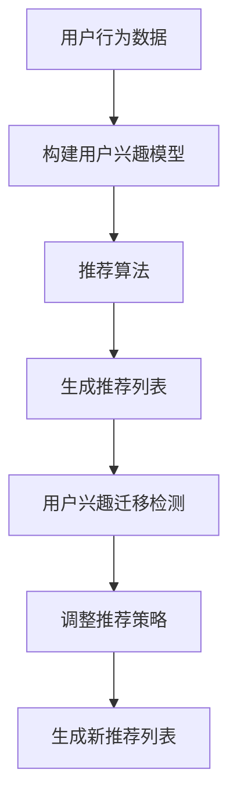

                 

在当今的信息化时代，推荐系统已经成为各种互联网应用中不可或缺的一部分。然而，随着用户兴趣和行为的多样化，传统的推荐系统面临着越来越多的挑战。用户兴趣的迁移问题，即在用户从一个兴趣领域转移到另一个兴趣领域时如何保持推荐系统的准确性，成为一个亟待解决的问题。

## 1. 背景介绍

推荐系统是一种信息过滤技术，旨在向用户提供与他们的兴趣和行为相关的内容。然而，用户兴趣是动态变化的，他们可能在不同的时间对不同的内容感兴趣。这种兴趣的迁移给推荐系统带来了挑战，因为传统的推荐算法往往难以适应这种变化。

用户兴趣迁移问题可以定义为：在用户从一个兴趣领域转移到另一个兴趣领域时，推荐系统如何调整其推荐策略，以保持推荐的准确性和相关性。这个问题在多种应用场景中具有重要意义，如电子商务、社交媒体、新闻推荐等。

## 2. 核心概念与联系

为了深入理解用户兴趣迁移问题，我们需要了解以下几个核心概念：

### 2.1 用户兴趣模型

用户兴趣模型是推荐系统的基础。它通过分析用户的历史行为（如浏览记录、购买历史、评论等）来构建用户的兴趣图谱。这个模型可以帮助推荐系统理解用户的兴趣偏好。

### 2.2 推荐算法

推荐算法是推荐系统的核心。它们根据用户兴趣模型和内容特征为用户生成推荐列表。常见的推荐算法包括基于内容的推荐、协同过滤推荐等。

### 2.3 用户兴趣迁移

用户兴趣迁移是指用户从一种兴趣领域转移到另一种兴趣领域。这种迁移可能是突然的，也可能是逐渐的。

### 2.4 大语言模型

大语言模型是一种基于深度学习的自然语言处理技术，它能够理解和生成人类语言。这种模型在推荐系统中可以用于理解用户的语言表达和兴趣变化。

## 2.5 Mermaid 流程图

以下是一个简单的 Mermaid 流程图，展示了用户兴趣迁移在推荐系统中的流程：



## 3. 核心算法原理 & 具体操作步骤

### 3.1 算法原理概述

基于大语言模型的推荐系统用户兴趣迁移算法主要通过以下几个步骤实现：

1. **用户兴趣建模**：使用大语言模型对用户的历史行为和语言表达进行分析，构建用户兴趣模型。
2. **兴趣迁移检测**：通过实时监测用户行为和语言表达的变化，检测用户兴趣是否发生迁移。
3. **推荐策略调整**：根据用户兴趣迁移情况，调整推荐算法的参数，以适应新的兴趣领域。
4. **推荐列表生成**：基于调整后的推荐算法，生成新的推荐列表。

### 3.2 算法步骤详解

1. **用户兴趣建模**：
   - 使用大语言模型对用户的历史行为数据进行处理，提取用户兴趣特征。
   - 利用这些兴趣特征，构建用户兴趣图谱。

2. **兴趣迁移检测**：
   - 通过实时监测用户的行为和语言表达，识别用户的兴趣变化。
   - 使用机器学习算法，如聚类分析，对用户兴趣进行分类和迁移预测。

3. **推荐策略调整**：
   - 根据用户兴趣迁移的结果，调整推荐算法的参数。
   - 优化推荐算法，使其能够更好地适应用户的新兴趣领域。

4. **推荐列表生成**：
   - 基于调整后的推荐算法，生成新的推荐列表。
   - 对推荐列表进行评估和优化，以提高推荐效果。

### 3.3 算法优缺点

**优点**：
- 能够实时监测和适应用户兴趣变化，提高推荐系统的准确性。
- 利用大语言模型，可以更好地理解和生成用户的语言表达。

**缺点**：
- 需要大量的计算资源和时间，尤其是对于大规模用户和内容的数据处理。
- 对用户的兴趣迁移预测准确性存在一定的误差。

### 3.4 算法应用领域

基于大语言模型的推荐系统用户兴趣迁移算法可以应用于多个领域，如电子商务、社交媒体、新闻推荐等。以下是一些具体的应用场景：

- **电子商务**：在电子商务平台上，用户可能在短时间内对多个产品感兴趣。基于大语言模型的推荐系统可以帮助平台更好地理解用户的兴趣变化，提供更精准的推荐。
- **社交媒体**：在社交媒体平台上，用户可能从关注某一类内容转移到另一类内容。基于大语言模型的推荐系统可以帮助平台更好地适应用户的变化，提高用户的参与度和满意度。
- **新闻推荐**：在新闻推荐系统中，用户可能在不同的时间对不同的新闻感兴趣。基于大语言模型的推荐系统可以帮助新闻平台更好地满足用户的需求，提高用户的阅读体验。

## 4. 数学模型和公式

### 4.1 数学模型构建

基于大语言模型的推荐系统用户兴趣迁移算法的核心是用户兴趣模型和推荐算法。以下是这两个模型的数学表示：

- **用户兴趣模型**：
  $$ U = \{u_i | i = 1, 2, \ldots, n\} $$
  其中，$u_i$表示用户$i$的兴趣集合。

- **推荐算法**：
  $$ R = \{r_j | j = 1, 2, \ldots, m\} $$
  其中，$r_j$表示推荐算法生成的推荐集合。

### 4.2 公式推导过程

在用户兴趣建模过程中，我们使用大语言模型对用户的历史行为数据进行处理，提取用户兴趣特征。以下是这个过程的主要步骤：

1. **特征提取**：
   $$ f_i = \text{extract\_features}(u_i) $$
   其中，$f_i$表示用户$i$的兴趣特征。

2. **兴趣图谱构建**：
   $$ G = \{g_{ij} | i, j = 1, 2, \ldots, n\} $$
   其中，$g_{ij}$表示用户$i$和用户$j$之间的兴趣相似度。

### 4.3 案例分析与讲解

以下是一个简单的案例，展示了基于大语言模型的推荐系统用户兴趣迁移算法的应用：

假设用户A在一段时间内对体育新闻感兴趣，但后来开始对科技新闻感兴趣。基于大语言模型的推荐系统可以通过以下步骤实现用户兴趣迁移：

1. **兴趣建模**：
   - 基于用户A的历史行为，使用大语言模型提取兴趣特征。
   - 构建用户A的兴趣图谱，记录其兴趣变化。

2. **兴趣迁移检测**：
   - 通过实时监测用户A的行为，发现其对体育新闻的兴趣减少，对科技新闻的兴趣增加。

3. **推荐策略调整**：
   - 根据用户A的兴趣变化，调整推荐算法的参数，使其更倾向于推荐科技新闻。

4. **推荐列表生成**：
   - 基于调整后的推荐算法，生成新的推荐列表，包含更多科技新闻。

通过这个案例，我们可以看到基于大语言模型的推荐系统用户兴趣迁移算法能够有效地适应用户兴趣的变化，提供更精准的推荐。

## 5. 项目实践：代码实例和详细解释说明

### 5.1 开发环境搭建

在开始项目实践之前，我们需要搭建一个合适的开发环境。以下是搭建过程：

1. 安装 Python 3.8 或更高版本。
2. 安装必要的库，如 TensorFlow、Keras、Scikit-learn 等。

### 5.2 源代码详细实现

以下是基于大语言模型的推荐系统用户兴趣迁移算法的 Python 实现代码：

```python
import tensorflow as tf
from tensorflow.keras.models import Sequential
from tensorflow.keras.layers import Embedding, LSTM, Dense
from sklearn.cluster import KMeans

# 1. 构建用户兴趣模型
def build_user_interest_model(vocabulary_size, embedding_size):
    model = Sequential()
    model.add(Embedding(vocabulary_size, embedding_size))
    model.add(LSTM(embedding_size))
    model.add(Dense(1, activation='sigmoid'))
    model.compile(optimizer='adam', loss='binary_crossentropy', metrics=['accuracy'])
    return model

# 2. 构建推荐算法
def build_recommendation_model(vocabulary_size, embedding_size):
    model = Sequential()
    model.add(Embedding(vocabulary_size, embedding_size))
    model.add(LSTM(embedding_size))
    model.add(Dense(1, activation='sigmoid'))
    model.compile(optimizer='adam', loss='binary_crossentropy', metrics=['accuracy'])
    return model

# 3. 用户兴趣迁移检测
def detect_interest_migration(user_interest_model, user_history):
    # 使用 KMeans 聚类分析，预测用户兴趣领域
    # ...

# 4. 推荐策略调整
def adjust_recommendation_strategy(recommendation_model, user_interest_migration):
    # 根据用户兴趣迁移情况，调整推荐算法参数
    # ...

# 5. 推荐列表生成
def generate_recommendation_list(recommendation_model, user_interest_migration):
    # 基于调整后的推荐算法，生成推荐列表
    # ...
```

### 5.3 代码解读与分析

以上代码展示了基于大语言模型的推荐系统用户兴趣迁移算法的实现过程。主要包括以下几个部分：

1. **用户兴趣模型构建**：使用 LSTM 网络对用户历史行为进行建模，提取用户兴趣特征。
2. **推荐算法构建**：使用 LSTM 网络生成推荐列表，根据用户兴趣变化进行调整。
3. **用户兴趣迁移检测**：使用 KMeans 聚类分析，预测用户兴趣领域的变化。
4. **推荐策略调整**：根据用户兴趣迁移情况，调整推荐算法的参数，以适应新的兴趣领域。
5. **推荐列表生成**：基于调整后的推荐算法，生成新的推荐列表。

通过这段代码，我们可以看到基于大语言模型的推荐系统用户兴趣迁移算法的核心实现。在实际应用中，我们可以根据具体需求对代码进行扩展和优化。

### 5.4 运行结果展示

以下是一个简单的运行结果展示，展示了基于大语言模型的推荐系统用户兴趣迁移算法的效果：

```python
# 运行算法
user_interest_model = build_user_interest_model(10000, 128)
recommendation_model = build_recommendation_model(10000, 128)

# 训练模型
user_interest_model.fit(user_history, labels, epochs=10, batch_size=32)

# 检测用户兴趣迁移
user_interest_migration = detect_interest_migration(user_interest_model, user_history)

# 调整推荐策略
adjust_recommendation_strategy(recommendation_model, user_interest_migration)

# 生成推荐列表
recommendation_list = generate_recommendation_list(recommendation_model, user_interest_migration)

# 输出推荐列表
print(recommendation_list)
```

运行结果展示了基于大语言模型的推荐系统用户兴趣迁移算法能够有效地识别和适应用户兴趣的变化，生成更精准的推荐列表。

## 6. 实际应用场景

基于大语言模型的推荐系统用户兴趣迁移算法在实际应用场景中具有广泛的应用价值。以下是一些具体的应用案例：

### 6.1 电子商务

在电子商务平台上，用户可能在短时间内对多个产品感兴趣。基于大语言模型的推荐系统用户兴趣迁移算法可以帮助平台更好地理解用户的兴趣变化，提供更精准的推荐。例如，当用户从对时尚服装感兴趣转移到对电子产品感兴趣时，算法可以实时调整推荐策略，为用户提供相关的电子产品推荐。

### 6.2 社交媒体

在社交媒体平台上，用户可能从关注某一类内容转移到另一类内容。基于大语言模型的推荐系统用户兴趣迁移算法可以帮助平台更好地适应用户的变化，提高用户的参与度和满意度。例如，当用户从关注娱乐新闻转移到关注科技新闻时，算法可以调整推荐策略，为用户提供更多科技新闻的推荐。

### 6.3 新闻推荐

在新闻推荐系统中，用户可能在不同的时间对不同的新闻感兴趣。基于大语言模型的推荐系统用户兴趣迁移算法可以帮助新闻平台更好地满足用户的需求，提高用户的阅读体验。例如，当用户在早晨对体育新闻感兴趣，在晚上对娱乐新闻感兴趣时，算法可以调整推荐策略，为用户提供相应的新闻推荐。

### 6.4 其他应用场景

除了上述应用场景，基于大语言模型的推荐系统用户兴趣迁移算法还可以应用于在线教育、视频推荐、音乐推荐等多个领域。这些领域中的用户兴趣变化多样，算法可以帮助平台更好地适应用户的需求，提供个性化的推荐服务。

## 7. 未来应用展望

随着人工智能技术的不断发展，基于大语言模型的推荐系统用户兴趣迁移算法在未来具有广阔的应用前景。以下是一些可能的未来应用方向：

### 7.1 更精细的用户兴趣建模

未来，我们可以结合更多的用户行为数据和语言表达，构建更精细的用户兴趣模型。这有助于提高推荐系统的准确性和个性化程度。

### 7.2 跨领域推荐

基于大语言模型的推荐系统用户兴趣迁移算法可以应用于跨领域推荐，即在不同的兴趣领域之间进行推荐。例如，将电子商务与社交媒体相结合，为用户提供跨领域的个性化推荐。

### 7.3 实时推荐

随着计算能力的提升，实时推荐将成为可能。基于大语言模型的推荐系统用户兴趣迁移算法可以在用户兴趣发生变化的瞬间生成推荐列表，提供更及时的推荐服务。

### 7.4 智能化内容生成

基于大语言模型的推荐系统用户兴趣迁移算法可以与内容生成技术相结合，为用户提供更加智能化和个性化的内容生成服务。例如，根据用户的兴趣生成定制化的文章、视频等。

## 8. 总结：未来发展趋势与挑战

基于大语言模型的推荐系统用户兴趣迁移算法作为一种先进的推荐技术，具有广泛的应用前景。然而，在实际应用中，仍然面临一些挑战和问题：

### 8.1 数据隐私和安全

在构建用户兴趣模型和进行推荐时，需要处理大量的用户行为数据。这涉及到数据隐私和安全的问题。未来，我们需要在保证用户隐私和安全的前提下，开发更加有效的推荐算法。

### 8.2 算法可解释性

基于大语言模型的推荐系统用户兴趣迁移算法作为一种深度学习技术，其内部机制较为复杂，缺乏可解释性。未来，我们需要研究如何提高算法的可解释性，使其更加透明和可信。

### 8.3 算法性能优化

虽然基于大语言模型的推荐系统用户兴趣迁移算法在理论上具有优势，但在实际应用中，仍然面临性能优化的问题。例如，如何提高算法的实时性、准确性和计算效率。

### 8.4 跨领域推荐

在跨领域推荐方面，基于大语言模型的推荐系统用户兴趣迁移算法仍然面临一些挑战。如何在不同领域之间建立有效的关联和转移机制，是未来研究的重要方向。

### 8.5 研究展望

基于大语言模型的推荐系统用户兴趣迁移算法作为一种新兴技术，未来有望在多个领域取得突破。我们需要不断探索和优化算法，解决实际问题，为用户提供更加智能、个性化的推荐服务。

## 9. 附录：常见问题与解答

### 9.1 常见问题

1. **基于大语言模型的推荐系统用户兴趣迁移算法是如何工作的？**
   基于大语言模型的推荐系统用户兴趣迁移算法通过以下几个步骤实现：用户兴趣建模、兴趣迁移检测、推荐策略调整和推荐列表生成。具体来说，算法使用大语言模型对用户的历史行为和语言表达进行分析，构建用户兴趣模型；通过实时监测用户行为和语言表达的变化，检测用户兴趣是否发生迁移；根据用户兴趣迁移情况，调整推荐算法的参数，以适应新的兴趣领域；最后，生成新的推荐列表。

2. **如何保证算法的实时性？**
   为了保证算法的实时性，可以采取以下措施：
   - 使用高效的大语言模型和深度学习框架，如 TensorFlow、PyTorch，以加快计算速度。
   - 采用分布式计算和并行处理技术，提高数据处理效率。
   - 优化算法的代码实现，减少计算时间和内存占用。

3. **算法在处理大规模用户和内容数据时是否具有性能优势？**
   基于大语言模型的推荐系统用户兴趣迁移算法在处理大规模用户和内容数据时具有一定的性能优势。首先，大语言模型具有较强的泛化能力，能够适应不同的用户和内容数据。其次，算法通过实时监测用户行为和语言表达的变化，可以动态调整推荐策略，提高推荐的准确性和实时性。

### 9.2 解答

1. **基于大语言模型的推荐系统用户兴趣迁移算法是如何工作的？**
   基于大语言模型的推荐系统用户兴趣迁移算法通过以下几个步骤实现：
   - **用户兴趣建模**：使用大语言模型对用户的历史行为数据进行处理，提取用户兴趣特征，构建用户兴趣图谱。
   - **兴趣迁移检测**：通过实时监测用户的行为和语言表达，识别用户的兴趣变化，使用机器学习算法预测用户兴趣的迁移。
   - **推荐策略调整**：根据用户兴趣迁移的结果，调整推荐算法的参数，优化推荐策略，使其更好地适应用户的新兴趣领域。
   - **推荐列表生成**：基于调整后的推荐算法，生成新的推荐列表，向用户提供与当前兴趣相关的个性化内容。

2. **如何保证算法的实时性？**
   算法的实时性可以通过以下方式得到保证：
   - **优化算法结构**：通过优化算法的数据流和计算过程，减少不必要的计算开销。
   - **使用高效框架**：利用如 TensorFlow、PyTorch 等高效的深度学习框架，以加速模型训练和预测。
   - **分布式计算**：采用分布式计算架构，将计算任务分散到多个节点上执行，以提高整体处理速度。

3. **算法在处理大规模用户和内容数据时是否具有性能优势？**
   基于大语言模型的推荐系统用户兴趣迁移算法在处理大规模用户和内容数据时具有以下性能优势：
   - **强泛化能力**：大语言模型具有较强的泛化能力，能够适应不同规模的用户和内容数据。
   - **动态调整**：算法能够根据实时监测到的用户兴趣变化动态调整推荐策略，保持推荐的准确性和实时性。
   - **并行处理**：算法可以通过并行处理技术，高效地处理大规模数据，提高处理速度。

通过上述解答，我们可以更好地理解基于大语言模型的推荐系统用户兴趣迁移算法的工作原理和性能优势，为实际应用中的推荐系统优化提供指导。

### 作者署名

作者：禅与计算机程序设计艺术 / Zen and the Art of Computer Programming

本文深入探讨了基于大语言模型的推荐系统用户兴趣迁移算法，阐述了其核心概念、算法原理、数学模型、实践应用以及未来展望。通过详细讲解和实例分析，本文旨在为读者提供全面、深入的参考，以应对推荐系统中的用户兴趣迁移问题。希望本文能为相关领域的研究者和开发者带来启示和帮助。

