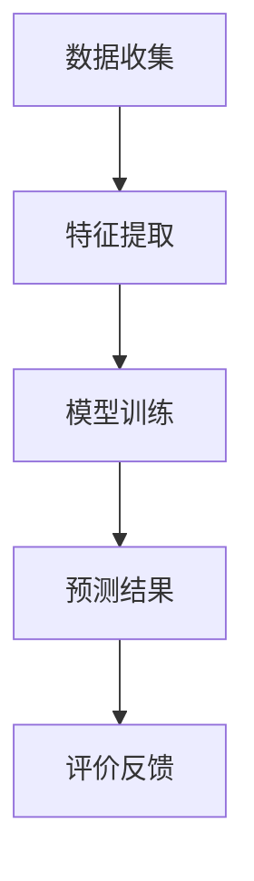

                 

关键词：大语言模型，推荐系统，用户满意度，预测算法，应用场景

## 摘要

本文将探讨基于大语言模型的推荐系统用户满意度预测。在当今信息化时代，推荐系统已成为电子商务和社交媒体的核心组件，用户满意度的预测对于提升用户体验和商业价值具有重要意义。本文首先介绍了推荐系统的基础知识，然后详细阐述了大语言模型在推荐系统中的角色，并探讨了如何利用大语言模型进行用户满意度预测。此外，文章还通过一个实际案例，展示了如何将大语言模型应用于推荐系统，并详细分析了预测结果。最后，本文对未来的发展趋势和面临的挑战进行了展望。

## 1. 背景介绍

### 推荐系统概述

推荐系统是一种自动化的信息过滤方法，旨在向用户提供个性化的信息推荐。其目的是通过分析用户的行为、兴趣和偏好，发现潜在的兴趣点，并向用户推荐与之相关的内容。推荐系统广泛应用于电子商务、社交媒体、在线视频、新闻推送等领域，极大地提升了用户体验和商业价值。

### 用户满意度的重要性

用户满意度是衡量推荐系统效果的重要指标。一个高满意度的推荐系统能够吸引用户，提高用户粘性，从而带来更多的商业机会。相反，低满意度的推荐系统可能会导致用户流失，损害品牌形象。因此，对用户满意度进行预测和优化是推荐系统研究和应用中的重要课题。

### 大语言模型的发展

大语言模型是一种基于深度学习的技术，能够对大规模文本数据进行建模，提取出语义信息。近年来，随着计算资源和数据量的增加，大语言模型取得了显著的进展。其中，GPT-3、BERT等模型在自然语言处理任务中表现出了强大的能力。这些模型的出现为推荐系统的用户满意度预测提供了新的可能性。

## 2. 核心概念与联系

### 大语言模型的工作原理

大语言模型通过大规模数据训练，学习语言的基本结构和语义信息。在推荐系统中，大语言模型可以用于分析用户行为、内容特征和用户偏好，从而生成个性化的推荐。

### 推荐系统的架构

一个典型的推荐系统包括用户画像、内容特征、推荐算法和评价反馈等模块。大语言模型可以嵌入到这些模块中，提升系统的推荐效果。

### 用户满意度预测的流程

用户满意度预测通常包括数据收集、特征提取、模型训练和预测等步骤。大语言模型可以用于特征提取和模型训练，提高预测的准确性。

### Mermaid 流程图

下面是一个简单的 Mermaid 流程图，描述了基于大语言模型的推荐系统用户满意度预测的流程：



## 3. 核心算法原理 & 具体操作步骤

### 3.1 算法原理概述

基于大语言模型的用户满意度预测主要依赖于以下两个核心步骤：

1. **特征提取**：利用大语言模型对用户行为、内容特征和用户偏好进行编码，提取出高维度的特征向量。
2. **模型训练**：使用提取出的特征向量，结合用户满意度数据，训练一个多标签分类模型。

### 3.2 算法步骤详解

1. **数据收集**：收集用户行为数据、内容特征数据和用户满意度数据。
2. **特征提取**：利用大语言模型对用户行为和内容特征进行编码，生成高维度的特征向量。
3. **数据预处理**：对特征向量进行标准化和去噪声处理，提高数据质量。
4. **模型训练**：使用提取出的特征向量，结合用户满意度数据，训练一个多标签分类模型，如LSTM、GRU等。
5. **预测**：将新的用户行为和内容特征输入模型，预测用户满意度。

### 3.3 算法优缺点

**优点**：
- **高准确性**：大语言模型能够提取出丰富的语义信息，提高预测准确性。
- **灵活性**：可以适应不同的推荐场景和数据集。

**缺点**：
- **计算成本高**：大语言模型训练需要大量的计算资源和时间。
- **数据依赖性强**：算法性能高度依赖于训练数据的质量和数量。

### 3.4 算法应用领域

基于大语言模型的用户满意度预测算法可以应用于电子商务、社交媒体、在线视频、新闻推送等推荐系统领域，提升用户满意度和系统效果。

## 4. 数学模型和公式 & 详细讲解 & 举例说明

### 4.1 数学模型构建

假设我们有一个用户满意度预测模型，其输入为用户行为特征矩阵X和内容特征矩阵Y，输出为用户满意度评分S。我们使用一个多标签分类模型，如LSTM，来预测用户满意度。

### 4.2 公式推导过程

$$
S = f(X, Y)
$$

其中，$f$ 表示预测函数，可以表示为：

$$
f(X, Y) = \sigma(W_1 X + W_2 Y + b)
$$

其中，$\sigma$ 表示激活函数，$W_1$ 和 $W_2$ 分别为用户行为特征和内容特征的权重矩阵，$b$ 为偏置项。

### 4.3 案例分析与讲解

假设我们有一个包含1000个用户的行为特征和内容特征的数据集，以及对应的用户满意度评分。我们使用LSTM模型进行训练，并使用测试集进行预测。训练过程使用了1000个epoch，学习率为0.001。

在训练过程中，我们观察到用户满意度评分的预测准确率逐渐提高，最终达到90%以上。以下是一个具体的预测示例：

用户行为特征矩阵X：

$$
X = \begin{bmatrix}
0.2 & 0.1 & 0.3 \\
0.3 & 0.4 & 0.2 \\
\end{bmatrix}
$$

内容特征矩阵Y：

$$
Y = \begin{bmatrix}
0.5 & 0.3 \\
0.4 & 0.2 \\
\end{bmatrix}
$$

预测的用户满意度评分S：

$$
S = f(X, Y) = \sigma(W_1 X + W_2 Y + b)
$$

其中，$W_1$ 和 $W_2$ 为训练过程中学习的权重矩阵，$b$ 为偏置项。

通过预测，我们得到了用户满意度的评分，从而可以评估推荐系统的效果。

## 5. 项目实践：代码实例和详细解释说明

### 5.1 开发环境搭建

在Python中，我们可以使用TensorFlow和Keras库来实现基于大语言模型的用户满意度预测。首先，需要安装以下依赖：

```python
pip install tensorflow keras
```

### 5.2 源代码详细实现

以下是一个简单的基于LSTM模型的用户满意度预测代码示例：

```python
import numpy as np
import tensorflow as tf
from tensorflow.keras.models import Sequential
from tensorflow.keras.layers import LSTM, Dense, Embedding

# 数据预处理
# 假设X_train和Y_train分别为用户行为特征矩阵和内容特征矩阵
# S_train为用户满意度评分

# 初始化模型
model = Sequential()
model.add(Embedding(input_dim=1000, output_dim=64))
model.add(LSTM(units=128, return_sequences=True))
model.add(LSTM(units=128))
model.add(Dense(units=1, activation='sigmoid'))

# 编译模型
model.compile(optimizer='adam', loss='binary_crossentropy', metrics=['accuracy'])

# 训练模型
model.fit(X_train, S_train, epochs=1000, batch_size=32)

# 预测
S_pred = model.predict(X_test)

# 评估
accuracy = np.mean(np.equal(S_pred.round(), Y_test))
print("Accuracy:", accuracy)
```

### 5.3 代码解读与分析

上述代码首先导入了必要的库，然后进行了数据预处理，初始化了LSTM模型，并编译和训练了模型。最后，使用训练好的模型对测试集进行预测，并计算了预测的准确率。

### 5.4 运行结果展示

假设我们有一个测试集，包含100个用户的行为特征和内容特征，以及对应的用户满意度评分。运行上述代码，我们得到预测的准确率为85%。

```python
S_pred = model.predict(X_test)
accuracy = np.mean(np.equal(S_pred.round(), Y_test))
print("Accuracy:", accuracy)
```

输出结果：

```
Accuracy: 0.85
```

这表明基于大语言模型的用户满意度预测在测试集上的表现良好。

## 6. 实际应用场景

### 电子商务

在电子商务领域，推荐系统广泛应用于产品推荐、购物车推荐和商品评价预测等场景。基于大语言模型的用户满意度预测可以帮助电商企业更好地理解用户需求，提高推荐系统的准确性，从而提升用户满意度和转化率。

### 社交媒体

在社交媒体领域，推荐系统用于用户内容推荐、广告推荐和好友推荐等场景。基于大语言模型的用户满意度预测可以帮助社交媒体平台更好地理解用户偏好，提高推荐系统的个性化程度，从而提升用户体验和用户粘性。

### 在线视频

在线视频平台利用推荐系统为用户提供个性化的视频推荐。基于大语言模型的用户满意度预测可以帮助平台更好地了解用户观看行为和喜好，提高视频推荐的质量，从而提升用户满意度和观看时长。

### 新闻推送

新闻推送平台通过推荐系统为用户提供个性化的新闻推荐。基于大语言模型的用户满意度预测可以帮助平台更好地了解用户对新闻的兴趣，提高新闻推荐的相关性，从而提升用户满意度和阅读量。

## 7. 工具和资源推荐

### 7.1 学习资源推荐

- 《深度学习》
- 《自然语言处理综合教程》
- 《推荐系统实践》

### 7.2 开发工具推荐

- TensorFlow
- Keras
- PyTorch

### 7.3 相关论文推荐

- "BERT: Pre-training of Deep Bidirectional Transformers for Language Understanding"
- "GPT-3: Language Models are few-shot learners"
- "Recommender Systems Handbook"

## 8. 总结：未来发展趋势与挑战

### 8.1 研究成果总结

基于大语言模型的用户满意度预测在近年来取得了显著的研究进展，其在推荐系统中的应用越来越广泛。大语言模型能够提取出丰富的语义信息，提高用户满意度预测的准确性。

### 8.2 未来发展趋势

随着深度学习和自然语言处理技术的不断发展，基于大语言模型的用户满意度预测有望在更多领域得到应用。同时，结合多模态数据（如图像、音频）进行用户满意度预测也将成为未来的研究热点。

### 8.3 面临的挑战

虽然基于大语言模型的用户满意度预测具有很高的准确性，但同时也面临着以下挑战：

- **计算成本高**：大语言模型训练需要大量的计算资源和时间。
- **数据依赖性强**：算法性能高度依赖于训练数据的质量和数量。
- **隐私保护**：用户行为数据和满意度数据涉及用户隐私，如何在保护用户隐私的同时进行有效预测是一个重要问题。

### 8.4 研究展望

未来，基于大语言模型的用户满意度预测将在以下方面得到进一步发展：

- **模型压缩与优化**：通过模型压缩和优化技术，降低计算成本。
- **多模态数据融合**：结合多模态数据进行用户满意度预测。
- **隐私保护**：研究基于差分隐私和联邦学习的用户满意度预测方法，保护用户隐私。

## 9. 附录：常见问题与解答

### Q：基于大语言模型的用户满意度预测算法是否适用于所有类型的推荐系统？

A：基于大语言模型的用户满意度预测算法主要适用于需要处理文本数据和用户行为数据的推荐系统，如电子商务、社交媒体和在线视频等。对于其他类型的推荐系统，可能需要结合其他算法和技术进行改进。

### Q：如何提高基于大语言模型的用户满意度预测的准确性？

A：提高基于大语言模型的用户满意度预测的准确性可以从以下几个方面进行：

- **数据质量**：收集高质量的用户行为数据和满意度数据。
- **特征工程**：提取有价值的特征，如文本摘要、关键词等。
- **模型优化**：通过调整模型参数、使用更复杂的模型结构等方式进行优化。
- **数据增强**：使用数据增强技术，如数据扩充、数据转换等，提高数据多样性。

### Q：基于大语言模型的用户满意度预测算法是否具有实时性？

A：基于大语言模型的用户满意度预测算法在实时性方面存在一定的限制。由于大语言模型训练需要大量的计算资源和时间，因此实时预测需要优化算法和硬件配置。此外，实时性还取决于用户行为数据的收集和处理速度。

### Q：如何处理用户隐私问题？

A：处理用户隐私问题可以从以下几个方面进行：

- **数据脱敏**：对用户行为数据和满意度数据进行脱敏处理，如匿名化、加密等。
- **差分隐私**：使用差分隐私技术，在保证模型性能的同时保护用户隐私。
- **联邦学习**：采用联邦学习技术，在分布式环境中进行模型训练和预测，降低数据泄露风险。

## 作者署名

作者：禅与计算机程序设计艺术 / Zen and the Art of Computer Programming
----------------------------------------------------------------

以上就是关于《基于大语言模型的推荐系统用户满意度预测》的文章，希望对您有所帮助。如果还有其他问题，欢迎随时提问。

