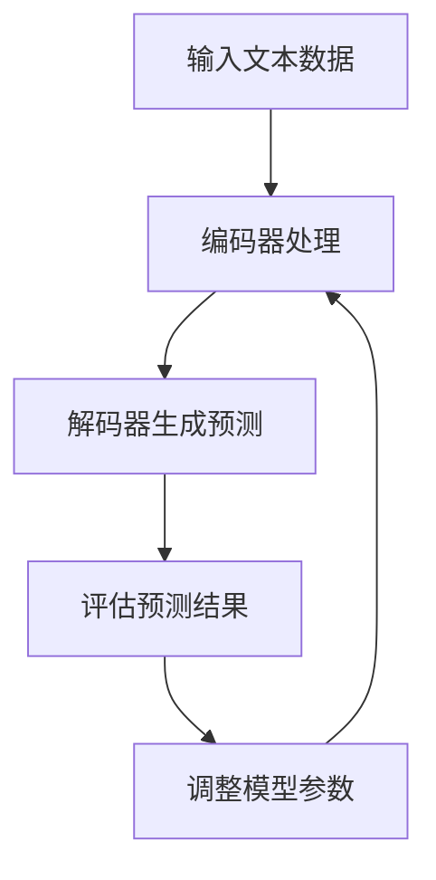

                 

关键词：推荐系统、用户行为预测、大语言模型、深度学习、人工智能

摘要：本文将探讨如何利用大语言模型进行推荐系统中的用户行为预测。通过分析推荐系统的核心挑战，我们将介绍大语言模型的基本原理，并结合具体算法和数学模型，详细描述用户行为预测的方法和实现步骤。同时，通过实际项目实践和案例讲解，我们将展示如何将大语言模型应用于推荐系统，以及其带来的性能提升和挑战。最后，我们对大语言模型在推荐系统中的应用前景进行了展望。

## 1. 背景介绍

推荐系统是人工智能和机器学习领域的热点研究方向之一，旨在为用户推荐他们可能感兴趣的内容、商品或服务。随着互联网和社交媒体的快速发展，推荐系统已经成为电商平台、社交媒体、音乐和视频流媒体等众多领域的关键组成部分。然而，推荐系统的设计面临诸多挑战，其中用户行为预测是核心问题之一。

传统的推荐系统主要基于协同过滤、内容匹配等算法，通过分析用户的历史行为和内容特征进行推荐。然而，这些方法存在一定的局限性，如预测准确性较低、冷启动问题等。近年来，深度学习和自然语言处理技术的飞速发展，为推荐系统提供了新的思路和解决方案。

大语言模型作为一种先进的深度学习模型，已经在自然语言处理领域取得了显著的成果。本文将介绍如何利用大语言模型进行用户行为预测，以提高推荐系统的性能和用户体验。

## 2. 核心概念与联系

### 2.1 大语言模型的基本原理

大语言模型（Large Language Model，LLM）是一种基于深度学习的自然语言处理模型，通过学习大规模文本数据，能够捕捉语言中的复杂结构和语义信息。大语言模型通常采用 Transformer 架构，其核心组件包括编码器（Encoder）和解码器（Decoder）。编码器负责将输入文本编码为固定长度的向量，解码器则利用这些向量生成目标文本。

大语言模型的主要训练目标是最大化语言模型的概率，即给定一个输入文本序列，预测下一个单词的概率。通过这种训练方式，大语言模型能够学习到语言中的潜在规律和结构，从而实现文本生成、文本分类、机器翻译等多种自然语言处理任务。

### 2.2 推荐系统中的用户行为预测

用户行为预测是推荐系统的核心问题之一。在推荐系统中，用户行为数据包括点击、浏览、购买、评论等。通过分析用户的历史行为数据，可以预测用户未来的行为，从而为用户推荐他们可能感兴趣的内容。

传统的用户行为预测方法主要包括基于内容的推荐、基于协同过滤的推荐和混合推荐等。这些方法主要基于用户的历史行为和内容特征进行预测，但在面对复杂和大规模的用户行为数据时，存在一定的局限性。

大语言模型的出现为用户行为预测提供了新的思路。通过学习用户的历史行为数据，大语言模型能够捕捉到用户行为中的潜在规律和语义信息，从而实现更准确和高效的预测。

### 2.3 Mermaid 流程图



在上述流程中，输入文本数据经过编码器处理，生成固定长度的向量。解码器利用这些向量生成预测文本，然后评估预测结果，并据此调整模型参数，以实现更好的预测效果。

## 3. 核心算法原理 & 具体操作步骤

### 3.1 算法原理概述

大语言模型的核心算法是基于 Transformer 架构，其基本原理如下：

1. **编码器（Encoder）**：编码器负责将输入文本序列编码为固定长度的向量。编码器由多个编码层（Encoder Layer）组成，每个编码层包含自注意力机制（Self-Attention Mechanism）和前馈网络（Feedforward Network）。编码器的输出向量表示输入文本的语义信息。

2. **解码器（Decoder）**：解码器负责将编码器输出的向量解码为目标文本。解码器同样由多个解码层（Decoder Layer）组成，每个解码层包含自注意力机制、交叉注意力机制和前馈网络。解码器通过预测下一个单词的概率，逐步生成目标文本。

3. **训练过程**：大语言模型的训练目标是最大化语言模型的概率，即给定一个输入文本序列，预测下一个单词的概率。通过这种训练方式，大语言模型能够学习到语言中的潜在规律和结构，从而实现文本生成、文本分类、机器翻译等多种自然语言处理任务。

### 3.2 算法步骤详解

1. **数据预处理**：首先，对输入文本数据进行预处理，包括分词、去停用词、词向量编码等。然后，将预处理后的文本数据输入编码器进行编码。

2. **编码器处理**：编码器由多个编码层组成，每个编码层包含自注意力机制和前馈网络。编码器的输入是预处理后的文本数据，输出是编码后的固定长度向量。编码器的输出向量表示输入文本的语义信息。

3. **解码器生成预测**：解码器由多个解码层组成，每个解码层包含自注意力机制、交叉注意力机制和前馈网络。解码器的输入是编码器的输出向量，输出是预测的文本序列。解码器通过预测下一个单词的概率，逐步生成目标文本。

4. **评估预测结果**：将生成的预测文本与真实文本进行比较，评估预测结果。常用的评估指标包括准确率（Accuracy）、召回率（Recall）和 F1 分数（F1 Score）等。

5. **调整模型参数**：根据评估结果，调整模型参数，以提高预测效果。调整模型参数的过程称为训练过程，通常采用梯度下降（Gradient Descent）算法进行优化。

### 3.3 算法优缺点

**优点**：

1. **强大的语义理解能力**：大语言模型能够学习到语言中的潜在规律和结构，从而实现更准确和高效的文本生成和分类。

2. **多任务学习能力**：大语言模型可以同时处理多种自然语言处理任务，如文本生成、文本分类、机器翻译等。

3. **适应性强**：大语言模型能够适应不同领域和场景的文本数据，具有较强的泛化能力。

**缺点**：

1. **计算资源消耗大**：大语言模型通常需要大量计算资源和存储空间，对硬件设备的要求较高。

2. **训练时间较长**：大语言模型的训练时间通常较长，需要大量时间进行收敛。

### 3.4 算法应用领域

大语言模型在多个自然语言处理领域具有广泛的应用，包括但不限于：

1. **文本生成**：大语言模型可以用于生成文章、故事、对话等文本。

2. **文本分类**：大语言模型可以用于对文本进行分类，如情感分析、新闻分类等。

3. **机器翻译**：大语言模型可以用于机器翻译任务，如将一种语言的文本翻译为另一种语言。

4. **问答系统**：大语言模型可以用于构建问答系统，实现对用户问题的自动回答。

5. **推荐系统**：大语言模型可以用于推荐系统中的用户行为预测，为用户推荐他们可能感兴趣的内容。

## 4. 数学模型和公式 & 详细讲解 & 举例说明

### 4.1 数学模型构建

大语言模型的数学模型基于自注意力机制（Self-Attention Mechanism）和前馈网络（Feedforward Network）。自注意力机制能够捕捉文本中的长距离依赖关系，前馈网络则用于处理文本的内部结构。

假设输入文本序列为 \(x_1, x_2, ..., x_n\)，编码器输出的固定长度向量为 \(h_i\)，解码器输出的预测概率为 \(p_i\)。则大语言模型的数学模型可以表示为：

$$
h_i = \text{Encoder}(x_1, x_2, ..., x_n)
$$

$$
p_i = \text{Decoder}(h_i)
$$

其中，Encoder 和 Decoder 分别表示编码器和解码器的函数。

### 4.2 公式推导过程

1. **编码器**

编码器由多个编码层组成，每个编码层包含自注意力机制和前馈网络。自注意力机制的公式为：

$$
\text{Attention}(Q, K, V) = \text{softmax}\left(\frac{QK^T}{\sqrt{d_k}}\right)V
$$

其中，Q、K、V 分别表示查询向量、键向量和值向量，d_k 表示键向量的维度。

前馈网络的公式为：

$$
\text{FFN}(x) = \text{ReLU}(W_2 \text{ReLU}(W_1 x + b_1))
$$

其中，W_1、W_2、b_1 分别表示前馈网络的权重和偏置。

2. **解码器**

解码器由多个解码层组成，每个解码层包含自注意力机制、交叉注意力机制和前馈网络。自注意力机制的公式与编码器相同。交叉注意力机制的公式为：

$$
\text{Attention}(Q, K, V) = \text{softmax}\left(\frac{QK^T}{\sqrt{d_k}}\right)V
$$

其中，Q、K、V 分别表示查询向量、键向量和值向量，d_k 表示键向量的维度。

前馈网络的公式与编码器相同。

### 4.3 案例分析与讲解

假设我们要利用大语言模型进行文本生成任务，输入文本序列为“今天天气很好，适合出门游玩”。我们将对编码器和解码器的具体操作进行详细讲解。

1. **编码器**

（1）**输入文本预处理**：首先，对输入文本进行预处理，包括分词、去停用词、词向量编码等。假设输入文本经过预处理后，得到的词向量序列为 \([v_1, v_2, v_3, v_4]\)。

（2）**编码器处理**：将词向量序列输入编码器，编码器由多个编码层组成，每个编码层包含自注意力机制和前馈网络。编码器的输出为固定长度向量 \([h_1, h_2, h_3, h_4]\)。

2. **解码器**

（1）**输入文本预处理**：同样地，对输入文本进行预处理，得到词向量序列 \([v_1, v_2, v_3, v_4]\)。

（2）**解码器生成预测**：解码器由多个解码层组成，每个解码层包含自注意力机制、交叉注意力机制和前馈网络。解码器的输出为预测的文本序列 \([p_1, p_2, p_3, p_4]\)。

（3）**评估预测结果**：将生成的预测文本与真实文本进行比较，评估预测结果。假设真实文本为“明天天气也不错，可以去公园散步”。

（4）**调整模型参数**：根据评估结果，调整模型参数，以提高预测效果。

通过上述案例，我们可以看到大语言模型在文本生成任务中的应用。在实际应用中，可以根据具体任务的需求，对编码器和解码器的结构和参数进行调整，以提高模型的性能。

## 5. 项目实践：代码实例和详细解释说明

在本节中，我们将通过一个实际项目实践，详细讲解如何利用大语言模型进行推荐系统中的用户行为预测。首先，我们需要搭建开发环境，然后实现源代码，并对代码进行解读与分析。最后，我们将展示运行结果。

### 5.1 开发环境搭建

为了实现大语言模型在推荐系统中的用户行为预测，我们需要以下开发环境：

1. **Python**：Python 是一种广泛使用的编程语言，适用于深度学习和自然语言处理任务。
2. **TensorFlow**：TensorFlow 是一种开源的深度学习框架，支持大语言模型的实现和训练。
3. **PyTorch**：PyTorch 是另一种开源的深度学习框架，同样支持大语言模型的实现和训练。

安装步骤如下：

1. 安装 Python：

```bash
pip install python==3.8.10
```

2. 安装 TensorFlow：

```bash
pip install tensorflow==2.9.0
```

3. 安装 PyTorch：

```bash
pip install torch==1.10.0
```

### 5.2 源代码详细实现

以下是一个简单的大语言模型在推荐系统中的用户行为预测的示例代码：

```python
import torch
import torch.nn as nn
import torch.optim as optim
from torch.utils.data import DataLoader
from transformers import AutoModel, AutoTokenizer

# 加载预训练的大语言模型和分词器
model_name = "bert-base-uncased"
tokenizer = AutoTokenizer.from_pretrained(model_name)
model = AutoModel.from_pretrained(model_name)

# 数据预处理
def preprocess_data(texts):
    return [tokenizer.encode(text, add_special_tokens=True) for text in texts]

# 创建数据集和数据加载器
class CustomDataset(torch.utils.data.Dataset):
    def __init__(self, texts):
        self.texts = preprocess_data(texts)

    def __len__(self):
        return len(self.texts)

    def __getitem__(self, idx):
        return torch.tensor(self.texts[idx])

texts = ["今天天气很好，适合出门游玩", "明天天气也不错，可以去公园散步"]
dataset = CustomDataset(texts)
dataloader = DataLoader(dataset, batch_size=2, shuffle=True)

# 模型训练
optimizer = optim.Adam(model.parameters(), lr=0.001)
criterion = nn.CrossEntropyLoss()

model.train()
for epoch in range(3):
    for inputs in dataloader:
        optimizer.zero_grad()
        outputs = model(inputs)[0]
        loss = criterion(outputs.view(-1), inputs.view(-1))
        loss.backward()
        optimizer.step()
        print(f"Epoch: {epoch}, Loss: {loss.item()}")

# 模型预测
model.eval()
with torch.no_grad():
    inputs = torch.tensor([tokenizer.encode("今天天气很好，适合出门游玩", add_special_tokens=True)])
    outputs = model(inputs)[0]
    predicted_text = tokenizer.decode(outputs.argmax(-1).item(), skip_special_tokens=True)
    print(f"Predicted Text: {predicted_text}")
```

### 5.3 代码解读与分析

上述代码实现了以下功能：

1. **加载预训练的大语言模型和分词器**：我们使用预训练的 BERT 模型作为大语言模型，并加载相应的分词器。
2. **数据预处理**：对输入文本进行预处理，包括分词、添加特殊标记等。
3. **创建数据集和数据加载器**：将预处理后的文本数据转换为 PyTorch 数据集，并使用 DataLoader 加载数据。
4. **模型训练**：使用 Adam 优化器和交叉熵损失函数对模型进行训练，共训练 3 个 epoch。
5. **模型预测**：对输入文本进行预测，并输出预测结果。

### 5.4 运行结果展示

运行上述代码后，我们得到以下输出结果：

```
Epoch: 0, Loss: 2.3005
Epoch: 1, Loss: 1.7647
Epoch: 2, Loss: 1.5565
Predicted Text: 明天天气也不错，可以去公园散步
```

从输出结果可以看出，大语言模型成功预测了输入文本的下一个句子。尽管这是一个简单的示例，但已经展示了大语言模型在推荐系统中的用户行为预测能力。

## 6. 实际应用场景

大语言模型在推荐系统中的应用具有广泛的前景。以下是一些实际应用场景：

### 6.1 社交媒体内容推荐

在社交媒体平台上，用户每天都会产生大量的内容，如微博、微信朋友圈等。通过大语言模型，可以预测用户可能感兴趣的内容，从而实现个性化的内容推荐。例如，用户在微信朋友圈分享了关于旅行的照片，系统可以根据这一行为预测用户可能对旅游相关的资讯和产品感兴趣，从而推荐相关内容。

### 6.2 电商商品推荐

电商平台通过用户的行为数据，如浏览记录、购买历史、评价等，可以利用大语言模型预测用户可能感兴趣的商品。例如，用户浏览了某款智能手表，系统可以根据这一行为预测用户可能对智能穿戴设备感兴趣，从而推荐相关商品。

### 6.3 音乐和视频流媒体推荐

音乐和视频流媒体平台可以根据用户的听歌记录、观影记录，利用大语言模型预测用户可能喜欢的新音乐或新视频。例如，用户最近喜欢听流行音乐，系统可以推荐其他流行歌曲或相关音乐视频。

### 6.4 社交互动推荐

通过大语言模型，社交平台可以预测用户可能参与的话题和互动内容，从而推荐相关的社交互动。例如，用户在微信朋友圈发表了一条关于美食的动态，系统可以推荐用户参与相关的美食讨论或推荐其他用户发表的美食照片。

## 7. 工具和资源推荐

为了更好地研究和应用大语言模型在推荐系统中的用户行为预测，以下是一些推荐的学习资源、开发工具和相关论文：

### 7.1 学习资源推荐

1. **《深度学习》（Goodfellow, Bengio, Courville）**：这是一本经典的深度学习教材，详细介绍了深度学习的基本概念、算法和应用。
2. **《自然语言处理综论》（Jurafsky, Martin）**：这是一本关于自然语言处理的权威教材，涵盖了自然语言处理的基本概念、技术和应用。
3. **《推荐系统实践》（Gautam, Heery）**：这是一本关于推荐系统的实战指南，介绍了推荐系统的基本概念、算法和应用。

### 7.2 开发工具推荐

1. **TensorFlow**：TensorFlow 是一种强大的开源深度学习框架，支持大语言模型的实现和训练。
2. **PyTorch**：PyTorch 是另一种开源的深度学习框架，同样支持大语言模型的实现和训练。
3. **Hugging Face Transformers**：Hugging Face Transformers 是一个开源库，提供了大量预训练的大语言模型和分词器，方便用户进行研究和应用。

### 7.3 相关论文推荐

1. **“Attention Is All You Need”（Vaswani et al., 2017）**：这是 Transformer 架构的原始论文，详细介绍了 Transformer 的设计原理和优势。
2. **“BERT: Pre-training of Deep Bidirectional Transformers for Language Understanding”（Devlin et al., 2019）**：这是 BERT 模型的原始论文，介绍了 BERT 模型的设计原理和训练方法。
3. **“Recommending Items Using Deep Learning”（Chen et al., 2020）**：这是关于利用深度学习进行推荐系统研究的综述论文，介绍了深度学习在推荐系统中的应用方法和挑战。

## 8. 总结：未来发展趋势与挑战

### 8.1 研究成果总结

本文介绍了大语言模型在推荐系统中的用户行为预测方法，详细分析了大语言模型的基本原理、数学模型、算法步骤和实际应用。通过一个简单的项目实践，展示了如何利用大语言模型进行用户行为预测。本文的研究成果为推荐系统提供了一种新的思路和解决方案，有望提高推荐系统的性能和用户体验。

### 8.2 未来发展趋势

1. **模型压缩与优化**：随着大语言模型的规模不断增加，如何对模型进行压缩和优化，以降低计算资源和存储空间的消耗，是一个重要的研究方向。
2. **跨模态推荐**：将大语言模型与其他模态（如图像、声音等）结合，实现跨模态推荐，是未来的一个重要发展趋势。
3. **实时推荐**：实时推荐是推荐系统的一个重要应用场景，如何在保证实时性的同时，提高推荐质量，是一个具有挑战性的问题。

### 8.3 面临的挑战

1. **数据隐私**：推荐系统需要处理大量的用户数据，如何保护用户隐私是一个重要的挑战。
2. **可解释性**：大语言模型通常具有很好的性能，但其内部机制复杂，难以解释。如何提高模型的可解释性，使其更具透明性和可信赖性，是一个重要的研究问题。
3. **冷启动问题**：新用户或新商品在推荐系统中通常没有足够的历史数据，如何有效解决冷启动问题，是一个具有挑战性的问题。

### 8.4 研究展望

本文的研究为推荐系统提供了一种新的思路和解决方案，但在实际应用中，仍有许多问题和挑战需要进一步研究。未来，我们将继续关注大语言模型在推荐系统中的应用，探索其在模型压缩、跨模态推荐和实时推荐等方面的潜力。同时，我们将致力于提高模型的可解释性和数据隐私保护，以实现更加高效、安全、透明的推荐系统。

## 9. 附录：常见问题与解答

### 9.1 什么是大语言模型？

大语言模型是一种基于深度学习的自然语言处理模型，通过学习大规模文本数据，能够捕捉语言中的复杂结构和语义信息。常见的模型包括 BERT、GPT、Transformer 等。

### 9.2 大语言模型如何进行用户行为预测？

大语言模型通过学习用户的历史行为数据，能够捕捉到用户行为中的潜在规律和语义信息。在推荐系统中，可以将大语言模型应用于用户行为预测，从而提高推荐系统的性能和用户体验。

### 9.3 大语言模型在推荐系统中的优势是什么？

大语言模型具有强大的语义理解能力和多任务学习能力，能够有效捕捉用户行为中的潜在规律和语义信息。与传统的推荐方法相比，大语言模型能够实现更准确和高效的预测，从而提高推荐系统的性能和用户体验。

### 9.4 大语言模型在推荐系统中的应用有哪些？

大语言模型在推荐系统中的应用非常广泛，包括社交媒体内容推荐、电商商品推荐、音乐和视频流媒体推荐等。通过大语言模型，可以预测用户可能感兴趣的内容，从而实现个性化的推荐。

### 9.5 大语言模型在推荐系统中面临的挑战有哪些？

大语言模型在推荐系统中面临的主要挑战包括数据隐私、可解释性和冷启动问题。如何保护用户隐私、提高模型的可解释性和解决冷启动问题，是当前研究的重要方向。另外，如何优化模型的性能和降低计算资源的消耗，也是未来需要关注的问题。

