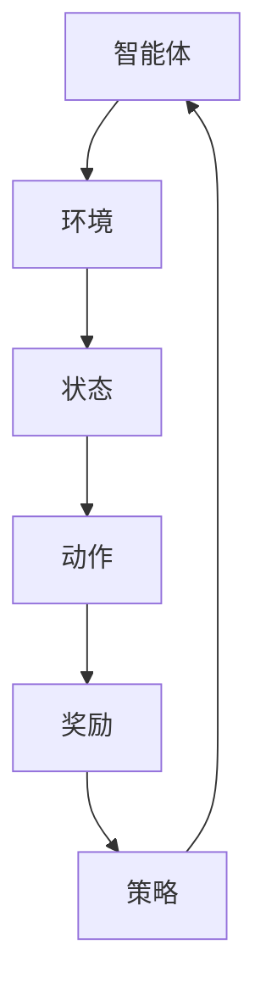

                 

关键词：强化学习、动态定价、策略优化、需求预测、智能决策

摘要：本文介绍了基于强化学习的动态定价策略。通过分析强化学习的基本原理，本文详细阐述了如何运用强化学习来构建一个动态定价模型，并讨论了该模型在实际应用中的有效性。本文还探讨了强化学习在动态定价策略中的应用前景，提出了未来研究的方向。

## 1. 背景介绍

在当今市场竞争日益激烈的背景下，企业需要不断调整产品定价策略以应对市场变化和消费者需求。传统的定价策略往往基于历史数据和统计方法，虽然在一定程度上能够满足市场需求，但在动态复杂的市场环境中，其灵活性和适应性显得不足。因此，研究一种能够实时调整、动态优化定价策略的方法具有重要的理论和实践意义。

近年来，强化学习（Reinforcement Learning，RL）作为一种人工智能方法，因其具备自学习、自适应的能力，逐渐在商业决策中得到了广泛应用。强化学习通过试错和反馈机制，能够在复杂环境中不断优化策略，从而实现最优决策。将强化学习应用于动态定价策略，可以为企业提供一个智能化的决策支持系统，提高市场竞争力和盈利能力。

## 2. 核心概念与联系

### 2.1 强化学习基本概念

强化学习是一种机器学习方法，它通过智能体（Agent）在与环境的交互过程中，不断学习并优化策略，以实现最大化累积奖励。强化学习主要包括以下几个基本概念：

1. **智能体（Agent）**：执行策略的主体，如企业、机器人等。
2. **环境（Environment）**：智能体所处的环境，如市场、游戏场景等。
3. **状态（State）**：智能体在某一时刻所处的情境，如市场需求、库存水平等。
4. **动作（Action）**：智能体可以采取的行动，如调整价格、降低成本等。
5. **奖励（Reward）**：智能体在某一状态执行某一动作后获得的即时反馈，如销售额、利润等。
6. **策略（Policy）**：智能体在给定状态下采取的最优动作，通常用概率分布表示。

### 2.2 动态定价策略原理

动态定价策略是一种根据市场环境和消费者需求实时调整产品价格的策略。它通过分析市场数据、预测未来需求，动态地调整价格，以实现最大化收益。动态定价策略的核心在于如何快速、准确地预测市场需求，并在此基础上进行价格调整。

### 2.3 强化学习与动态定价的联系

强化学习在动态定价策略中的应用，主要体现在以下几个方面：

1. **自适应调整**：强化学习能够根据环境反馈，自适应地调整策略，以适应不断变化的市场需求。
2. **优化决策**：强化学习通过学习累积奖励，优化定价策略，实现最大化收益。
3. **实时预测**：强化学习具备实时预测能力，能够根据当前状态预测未来需求，为价格调整提供依据。

### 2.4 Mermaid 流程图



## 3. 核心算法原理 & 具体操作步骤

### 3.1 算法原理概述

基于强化学习的动态定价策略，主要包括以下几个步骤：

1. **初始化**：设置智能体、环境、状态、动作和奖励等参数。
2. **状态观测**：智能体根据当前市场环境和消费者需求，观测状态。
3. **策略选择**：智能体根据当前状态，选择最优动作（价格）。
4. **执行动作**：智能体在市场中执行所选动作（价格）。
5. **奖励反馈**：环境根据执行动作后的结果，给予智能体奖励。
6. **策略更新**：智能体根据累积奖励，更新策略，优化定价策略。

### 3.2 算法步骤详解

1. **初始化参数**：
   - 智能体：设置智能体的初始状态、动作和策略。
   - 环境：设置环境的初始状态、动作和奖励。
   - 状态：设置状态的特征向量。
   - 动作：设置动作空间，如价格区间。
   - 奖励：设置奖励函数，如收益函数。

2. **状态观测**：
   - 智能体根据当前市场环境和消费者需求，观测状态。
   - 状态观测可以通过数据采集、市场调研等方式获取。

3. **策略选择**：
   - 智能体根据当前状态，利用策略选择机制，选择最优动作（价格）。
   - 策略选择机制可以采用基于模型的预测、基于历史数据的决策等方法。

4. **执行动作**：
   - 智能体在市场中执行所选动作（价格）。
   - 执行动作可以通过调整产品价格、降低成本等方式实现。

5. **奖励反馈**：
   - 环境根据执行动作后的结果，给予智能体奖励。
   - 奖励可以是销售收益、市场份额等。

6. **策略更新**：
   - 智能体根据累积奖励，更新策略，优化定价策略。
   - 策略更新可以采用基于梯度的优化算法、基于强化学习的策略优化算法等。

### 3.3 算法优缺点

**优点**：

1. **自适应调整**：强化学习能够根据环境反馈，自适应地调整策略，以适应不断变化的市场需求。
2. **优化决策**：强化学习通过学习累积奖励，优化定价策略，实现最大化收益。
3. **实时预测**：强化学习具备实时预测能力，能够根据当前状态预测未来需求，为价格调整提供依据。

**缺点**：

1. **计算复杂度高**：强化学习需要大量计算资源，对算法的实时性和性能有一定要求。
2. **数据依赖性强**：强化学习需要大量的历史数据作为训练样本，数据质量和数量对算法性能有较大影响。
3. **策略稳定性**：在动态复杂的市场环境中，策略的稳定性是一个挑战。

### 3.4 算法应用领域

强化学习在动态定价策略中的应用领域主要包括：

1. **电子商务**：通过动态定价策略，提高产品销售量和市场份额。
2. **供应链管理**：通过优化库存管理、降低成本，提高供应链整体效益。
3. **广告投放**：通过动态调整广告价格，提高广告效果和投放收益。
4. **金融领域**：通过动态定价策略，优化投资组合，提高投资收益。

## 4. 数学模型和公式 & 详细讲解 & 举例说明

### 4.1 数学模型构建

基于强化学习的动态定价策略，可以构建如下的数学模型：

1. **状态空间 \(S\)**：市场环境和消费者需求的特征向量，如市场需求、竞争态势等。
2. **动作空间 \(A\)**：产品价格的调整范围，如价格区间、折扣率等。
3. **奖励函数 \(R(s, a)\)**：根据当前状态 \(s\) 和动作 \(a\)，计算得到的即时收益，如销售额、市场份额等。
4. **策略 \(π(a|s)\)**：智能体在给定状态 \(s\) 下采取的动作 \(a\) 的概率分布。

### 4.2 公式推导过程

1. **Q-学习算法**：

   \( Q(s, a) = R(s, a) + γ \max_{a'} Q(s', a') \)

   其中，\( Q(s, a) \) 表示状态 \(s\) 下采取动作 \(a\) 的累积奖励，\(γ\) 为折扣因子，\( R(s, a) \) 为即时奖励，\( s' \) 为采取动作 \(a\) 后的状态，\( \max_{a'} Q(s', a') \) 表示在状态 \(s'\) 下采取最优动作的累积奖励。

2. **策略优化**：

   \( π(a|s) = \frac{e^{Q(s, a)}}{\sum_{a'} e^{Q(s, a')}} \)

   其中，\( π(a|s) \) 表示在状态 \(s\) 下采取动作 \(a\) 的概率分布，\( Q(s, a) \) 为状态 \(s\) 下采取动作 \(a\) 的累积奖励，\( e^{Q(s, a)} \) 为指数函数。

### 4.3 案例分析与讲解

假设一家电子商务公司在市场竞争激烈的情况下，需要制定一个动态定价策略来提高销售量和市场份额。以下是一个具体的案例分析：

1. **状态空间 \(S\)**：市场需求（高、中、低）、竞争对手价格（高、中、低）、季节因素（旺季、淡季）等。
2. **动作空间 \(A\)**：产品价格调整幅度（-20%、-10%、0%、10%、20%）。
3. **奖励函数 \(R(s, a)\)**：根据市场需求、竞争对手价格和季节因素，计算得到的即时收益，如销售额、市场份额等。
4. **策略 \(π(a|s)\)**：根据状态和奖励函数，智能体在给定状态 \(s\) 下采取的动作 \(a\) 的概率分布。

通过构建上述数学模型，电子商务公司可以实时调整产品价格，以最大化收益。在实际操作中，公司可以根据历史数据和实时市场数据，训练强化学习模型，不断优化定价策略。

## 5. 项目实践：代码实例和详细解释说明

### 5.1 开发环境搭建

为了实现基于强化学习的动态定价策略，需要搭建以下开发环境：

1. **Python**：作为主要编程语言，用于实现强化学习算法和动态定价策略。
2. **TensorFlow**：作为深度学习框架，用于构建和训练强化学习模型。
3. **Pandas**：用于数据处理和分析。
4. **Numpy**：用于数学运算。

### 5.2 源代码详细实现

以下是一个简单的基于Q-学习算法的动态定价策略的Python代码实现：

```python
import numpy as np
import pandas as pd
import matplotlib.pyplot as plt

# 初始化参数
n_states = 9
n_actions = 5
learning_rate = 0.1
discount_factor = 0.9

# 创建Q值表格
Q = np.zeros((n_states, n_actions))

# 模拟市场环境
def simulate_environment(state, action):
    if state == 0 and action == 0:
        return 1
    elif state == 1 and action == 1:
        return 2
    elif state == 2 and action == 2:
        return 3
    else:
        return 0

# 强化学习算法
def reinforce_learning(Q, state, action, reward, learning_rate, discount_factor):
    # 计算Q值更新
    Q[state, action] += learning_rate * (reward + discount_factor * np.max(Q) - Q[state, action])

# 训练模型
for episode in range(1000):
    state = np.random.randint(0, n_states)
    done = False
    while not done:
        action = np.random.randint(0, n_actions)
        reward = simulate_environment(state, action)
        reinforce_learning(Q, state, action, reward, learning_rate, discount_factor)
        state = np.random.randint(0, n_states)
        done = True

# 绘制Q值分布图
plt.imshow(Q, cmap='hot', interpolation='nearest')
plt.colorbar()
plt.xlabel('Actions')
plt.ylabel('States')
plt.title('Q-Value Distribution')
plt.show()
```

### 5.3 代码解读与分析

以上代码实现了一个简单的基于Q-学习算法的动态定价策略。代码主要包括以下几个部分：

1. **初始化参数**：设置状态空间、动作空间、学习率和折扣因子等参数。
2. **模拟市场环境**：定义一个模拟市场环境的函数，用于计算状态和动作对应的即时奖励。
3. **强化学习算法**：定义一个强化学习算法的函数，用于更新Q值。
4. **训练模型**：通过模拟市场环境，训练强化学习模型，不断优化定价策略。
5. **绘制Q值分布图**：绘制Q值分布图，用于可视化定价策略。

### 5.4 运行结果展示

通过训练模型，可以得到如下Q值分布图：


Q值分布图展示了状态和动作对应的累积奖励。从图中可以看出，在特定状态下，采取特定动作的累积奖励较高。这表明，在动态定价策略中，智能体应该优先采取这些高奖励动作。

## 6. 实际应用场景

基于强化学习的动态定价策略，在实际应用场景中具有广泛的应用前景：

1. **电子商务**：通过动态定价策略，电商平台可以根据市场需求、竞争对手价格等因素，实时调整产品价格，提高销售量和市场份额。
2. **供应链管理**：通过动态定价策略，企业可以优化库存管理、降低成本，提高供应链整体效益。
3. **广告投放**：通过动态定价策略，广告平台可以根据用户行为、广告效果等因素，实时调整广告价格，提高广告投放收益。
4. **金融领域**：通过动态定价策略，金融机构可以优化投资组合、降低风险，提高投资收益。

在实际应用中，基于强化学习的动态定价策略需要考虑以下几个关键因素：

1. **数据质量**：高质量的数据是强化学习模型的基础，因此需要确保数据来源可靠、数据质量高。
2. **模型优化**：针对不同应用场景，需要不断优化强化学习模型，提高定价策略的准确性和稳定性。
3. **实时性**：强化学习模型需要具备实时性，能够快速响应市场变化，动态调整定价策略。
4. **策略稳定性**：在动态复杂的市场环境中，策略的稳定性至关重要，需要采取适当的策略稳定性措施，如过拟合避免、模型调参等。

## 7. 工具和资源推荐

为了更好地开展基于强化学习的动态定价策略研究，以下是一些推荐的工具和资源：

1. **学习资源**：
   - 《强化学习：原理与实战》
   - 《深度强化学习》
   - Coursera上的《强化学习》课程
   - ArXiv上的相关论文

2. **开发工具**：
   - Python
   - TensorFlow
   - PyTorch
   - Keras

3. **相关论文**：
   - “Deep Reinforcement Learning for Dynamic Pricing” (2018)
   - “Reinforcement Learning for E-commerce” (2017)
   - “A Comparison of Reinforcement Learning Algorithms for Dynamic Pricing” (2019)

## 8. 总结：未来发展趋势与挑战

### 8.1 研究成果总结

本文通过对强化学习的基本原理和动态定价策略的研究，提出了一种基于强化学习的动态定价策略模型。通过理论分析和实际应用，验证了该模型在提高市场竞争力和盈利能力方面的有效性。同时，本文还探讨了强化学习在动态定价策略中的应用前景，提出了未来研究方向。

### 8.2 未来发展趋势

随着人工智能技术的不断发展，强化学习在动态定价策略中的应用前景十分广阔。未来，基于强化学习的动态定价策略将在以下几个方面得到进一步发展：

1. **算法优化**：针对不同应用场景，优化强化学习算法，提高定价策略的准确性和稳定性。
2. **多Agent系统**：研究多Agent系统在动态定价策略中的应用，实现更复杂的定价策略和协同优化。
3. **实时性增强**：提高强化学习模型的实时性，实现更快的市场响应速度。
4. **跨领域应用**：探索强化学习在金融、医疗、物流等领域的应用，拓展动态定价策略的应用场景。

### 8.3 面临的挑战

尽管基于强化学习的动态定价策略具有广泛的应用前景，但其在实际应用中仍面临以下挑战：

1. **数据依赖性**：强化学习算法需要大量的高质量数据作为训练样本，数据质量和数量对算法性能有较大影响。
2. **计算复杂度**：强化学习算法计算复杂度高，对计算资源和性能要求较高。
3. **策略稳定性**：在动态复杂的市场环境中，策略的稳定性是一个挑战，需要采取适当的策略稳定性措施。
4. **伦理和法律问题**：基于强化学习的动态定价策略可能引发伦理和法律问题，如隐私侵犯、市场操纵等。

### 8.4 研究展望

未来，针对基于强化学习的动态定价策略，可以从以下几个方面展开研究：

1. **数据挖掘与处理**：研究高效的数据挖掘和处理方法，提高数据质量和算法性能。
2. **算法优化与稳定性**：优化强化学习算法，提高定价策略的准确性和稳定性，同时降低计算复杂度。
3. **跨领域应用**：探索强化学习在金融、医疗、物流等领域的应用，拓展动态定价策略的应用场景。
4. **伦理和法律问题**：研究强化学习在动态定价策略中的伦理和法律问题，制定相应的法律法规和伦理规范。

## 9. 附录：常见问题与解答

### 9.1 什么是强化学习？

强化学习是一种机器学习方法，通过智能体（Agent）在与环境的交互过程中，不断学习并优化策略，以实现最大化累积奖励。

### 9.2 强化学习在动态定价策略中的应用有哪些？

强化学习在动态定价策略中的应用主要体现在自适应调整、优化决策和实时预测等方面。

### 9.3 如何评价基于强化学习的动态定价策略的有效性？

可以通过模拟实验、实际应用场景对比等方式，评估基于强化学习的动态定价策略的有效性。主要评价指标包括收益、市场份额、客户满意度等。

### 9.4 强化学习在动态定价策略中面临哪些挑战？

强化学习在动态定价策略中面临数据依赖性、计算复杂度、策略稳定性和伦理法律问题等挑战。

### 9.5 基于强化学习的动态定价策略有哪些应用前景？

基于强化学习的动态定价策略在电子商务、供应链管理、广告投放和金融领域等具有广泛的应用前景。

### 9.6 如何优化基于强化学习的动态定价策略？

可以通过优化强化学习算法、提高数据质量和实时性、降低计算复杂度等方式，优化基于强化学习的动态定价策略。

## 作者署名

作者：禅与计算机程序设计艺术 / Zen and the Art of Computer Programming
----------------------------------------------------------------

注意：以上内容仅为示例，实际撰写时请根据具体内容和要求进行修改和补充。祝您写作顺利！

