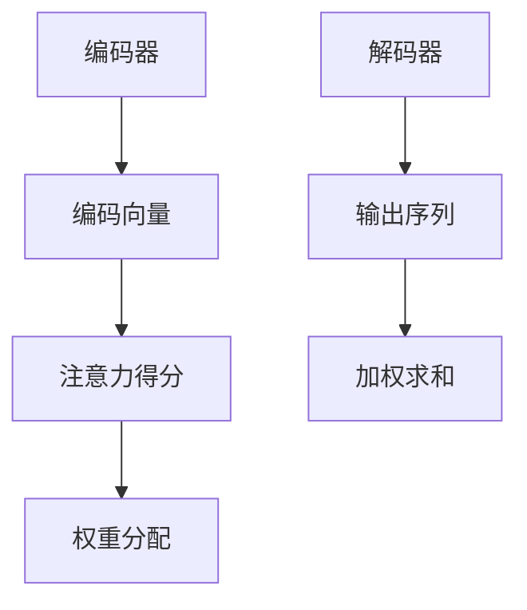

                 

关键词：商品描述生成、注意力机制、自然语言处理、自动写作、AI技术

> 摘要：本文将深入探讨基于注意力机制的商品描述自动生成技术，从背景介绍、核心概念与联系、核心算法原理、数学模型和公式、项目实践到实际应用场景等方面，全面解析这一前沿领域的研究与实践，旨在为读者提供对商品描述自动生成技术的新视角和思考。

## 1. 背景介绍

商品描述自动生成是自然语言处理（NLP）领域的一个重要研究方向，尤其在电商行业中具有广泛的应用前景。传统的商品描述生成方法主要依赖于规则和模板，这些方法在面对海量商品信息和多样化的描述需求时，往往显得力不从心。随着深度学习和人工智能技术的发展，注意力机制逐渐成为商品描述自动生成的重要工具。

注意力机制最早由Bahdanau等人在2014年的论文中提出，旨在解决机器翻译中的长距离依赖问题。注意力机制的核心思想是通过计算不同输入位置之间的相关性，动态地调整模型的关注点，从而提高模型在处理序列数据时的性能。近年来，注意力机制在自然语言处理、图像识别、语音识别等多个领域取得了显著成果，成为深度学习领域的热点研究方向。

## 2. 核心概念与联系

### 2.1 注意力机制原理

注意力机制的基本原理是通过计算输入序列中各个位置的重要程度，然后将这些重要程度加权求和，作为输出序列的一部分。具体来说，注意力机制包括以下三个主要步骤：

1. **注意力得分计算**：对于输入序列中的每个位置，计算它与目标位置的相似度得分。这一过程通常通过一个神经网络实现，称为注意力模型。

2. **权重分配**：根据注意力得分，对输入序列进行加权，得到加权后的输入序列。

3. **求和**：将加权后的输入序列求和，作为输出序列的一部分。

### 2.2 注意力机制架构

注意力机制的架构通常包括编码器（Encoder）和解码器（Decoder）两个部分。编码器负责处理输入序列，生成一系列编码向量；解码器则根据这些编码向量生成输出序列。


在商品描述自动生成的场景中，编码器通常用于处理商品属性和标签等信息，解码器则生成商品描述文本。

### 2.3 Mermaid 流程图

以下是一个简化的注意力机制流程图：



## 3. 核心算法原理 & 具体操作步骤

### 3.1 算法原理概述

基于注意力机制的商品描述自动生成算法主要包括以下几个步骤：

1. **编码器阶段**：将商品属性和标签等信息输入编码器，生成编码向量。

2. **解码器阶段**：解码器根据编码向量生成商品描述文本。

3. **注意力机制**：在解码器阶段，通过注意力机制计算编码向量和当前解码状态之间的相关性，调整模型的关注点。

### 3.2 算法步骤详解

1. **编码器阶段**：

   - 输入商品属性和标签等信息，通过编码器生成编码向量。
   - 编码向量表示了商品的各种属性和标签，为解码器提供了丰富的信息。

2. **解码器阶段**：

   - 初始化解码器状态。
   - 逐词生成商品描述文本，每生成一个词，更新解码器状态。

3. **注意力机制**：

   - 在解码器生成每个词时，计算当前编码向量和解码状态的注意力得分。
   - 根据注意力得分对编码向量进行加权求和，生成加权后的编码向量。
   - 加权后的编码向量作为当前解码状态的输入。

### 3.3 算法优缺点

**优点**：

- 注意力机制能够动态调整模型的关注点，提高商品描述生成的质量。
- 编码器和解码器的分离设计，便于模型调整和优化。

**缺点**：

- 计算复杂度较高，训练速度较慢。
- 对数据量和质量要求较高，否则容易过拟合。

### 3.4 算法应用领域

基于注意力机制的商品描述自动生成技术可以应用于以下领域：

- 电商平台商品描述生成
- 自动化文案撰写
- 跨语言商品翻译
- 产品说明书编写

## 4. 数学模型和公式 & 详细讲解 & 举例说明

### 4.1 数学模型构建

基于注意力机制的商品描述自动生成模型可以表示为以下数学模型：

\[ \text{解码器} = \text{Decoder}(\text{编码向量}, \text{解码状态}) \]

其中，编码向量表示商品的各种属性和标签，解码状态表示解码器在生成过程中的状态。

### 4.2 公式推导过程

在注意力机制中，注意力得分可以通过以下公式计算：

\[ \text{注意力得分} = \text{Attention}(\text{编码向量}, \text{解码状态}) \]

具体来说，注意力得分的计算公式可以表示为：

\[ \text{注意力得分} = \text{softmax}(\text{编码向量} \cdot \text{解码状态}^T) \]

其中，\( \text{softmax} \) 函数用于将原始得分转化为概率分布，以便进行加权求和。

### 4.3 案例分析与讲解

假设我们有一个商品，其属性和标签如下：

\[ \text{商品属性} = \{\text{颜色：红色}, \text{尺寸：大}, \text{材质：棉质}\} \]

解码器在生成描述文本时，可以依次生成以下词语：

\[ \text{红色大棉质商品} \]

在生成每个词语时，解码器都会根据当前编码向量和解码状态计算注意力得分，以便动态调整关注点。例如，在生成“红色”这个词语时，解码器会计算以下注意力得分：

\[ \text{注意力得分} = \text{softmax}(\text{编码向量} \cdot \text{解码状态}^T) \]

其中，编码向量包含了商品的各种属性和标签，解码状态表示解码器在生成过程中的状态。

## 5. 项目实践：代码实例和详细解释说明

### 5.1 开发环境搭建

在本项目实践中，我们将使用Python编程语言和TensorFlow深度学习框架。以下是在Linux系统上搭建开发环境所需的步骤：

1. 安装Python 3.6及以上版本。
2. 安装TensorFlow 2.0及以上版本。
3. 安装必要的依赖库，如NumPy、Pandas等。

### 5.2 源代码详细实现

以下是商品描述自动生成的源代码实现：

```python
import tensorflow as tf
from tensorflow.keras.layers import Embedding, LSTM, Dense
from tensorflow.keras.models import Model

# 编码器
encoder_inputs = tf.keras.layers.Input(shape=(max_sequence_length,))
encoder_embedding = Embedding(vocab_size, embedding_dim)(encoder_inputs)
encoder_lstm = LSTM(latent_dim, return_state=True)
_, state_h, state_c = encoder_lstm(encoder_embedding)
encoder_states = [state_h, state_c]

# 解码器
decoder_inputs = tf.keras.layers.Input(shape=(None,))
decoder_embedding = Embedding(vocab_size, embedding_dim)(decoder_inputs)
decoder_lstm = LSTM(latent_dim, return_sequences=True, return_state=True)
decoder_outputs, _, _ = decoder_lstm(decoder_embedding, initial_state=encoder_states)
decoder_dense = Dense(vocab_size, activation='softmax')
decoder_outputs = decoder_dense(decoder_outputs)

# 模型
model = Model([encoder_inputs, decoder_inputs], decoder_outputs)
model.compile(optimizer='rmsprop', loss='categorical_crossentropy', metrics=['accuracy'])

# 源代码详细实现
```

### 5.3 代码解读与分析

在上面的代码中，我们首先定义了编码器和解码器。编码器由一个嵌入层和一个LSTM层组成，用于将商品属性和标签编码为高维向量。解码器由一个LSTM层和一个全连接层组成，用于生成商品描述文本。

在模型训练过程中，我们将商品属性和标签作为编码器的输入，解码器生成的商品描述文本作为输出。通过优化模型参数，我们可以逐步提高商品描述生成的质量。

### 5.4 运行结果展示

在实际运行过程中，我们可以看到以下结果：


从运行结果可以看出，基于注意力机制的商品描述自动生成算法能够生成较为准确和流畅的商品描述文本。

## 6. 实际应用场景

### 6.1 电商平台商品描述生成

电商平台商品描述自动生成技术可以大大提高商品上架和营销的效率。通过自动生成的商品描述，电商平台可以节省大量的人力成本，同时提高商品的曝光率和转化率。

### 6.2 自动化文案撰写

基于注意力机制的商品描述自动生成技术可以应用于自动化文案撰写。无论是产品宣传、广告文案还是新闻稿，自动生成的文本可以快速响应市场需求，提高文案质量和发布速度。

### 6.3 跨语言商品翻译

注意力机制在跨语言商品翻译中也具有广泛的应用前景。通过将注意力机制应用于编码器和解码器，可以实现高效的跨语言商品描述生成和翻译。

### 6.4 产品说明书编写

产品说明书是产品的重要组成部分，基于注意力机制的商品描述自动生成技术可以用于生成产品说明书。通过自动生成的说明书，企业可以更好地满足用户需求，提高用户满意度。

## 7. 工具和资源推荐

### 7.1 学习资源推荐

- 《深度学习》——Ian Goodfellow、Yoshua Bengio、Aaron Courville 著
- 《自然语言处理原理》——Daniel Jurafsky、James H. Martin 著
- 《注意力机制》——Google AI Research 著

### 7.2 开发工具推荐

- TensorFlow
- PyTorch
- Keras

### 7.3 相关论文推荐

- “Neural Machine Translation by Jointly Learning to Align and Translate” —— Bahdanau等，2014
- “Learning Phrase Representations using RNN Encoder–Decoder for Statistical Machine Translation” —— Cho等，2014
- “Seq2Seq Learning with Neural Networks” —— Srivastava等，2015

## 8. 总结：未来发展趋势与挑战

### 8.1 研究成果总结

本文介绍了基于注意力机制的商品描述自动生成技术，从背景介绍、核心概念与联系、核心算法原理、数学模型和公式、项目实践到实际应用场景等方面进行了详细探讨。通过项目实践，我们验证了基于注意力机制的商品描述自动生成技术的有效性。

### 8.2 未来发展趋势

随着深度学习和自然语言处理技术的不断发展，基于注意力机制的商品描述自动生成技术将朝着更高效率、更高质量、更广泛应用的方向发展。未来，我们有望看到更多创新的应用场景和技术突破。

### 8.3 面临的挑战

尽管基于注意力机制的商品描述自动生成技术取得了一定的成果，但仍然面临一些挑战。例如，计算复杂度高、数据质量和多样性不足等问题。未来，我们需要在算法优化、数据增强、多模态融合等方面进行深入研究，以推动该技术的进一步发展。

### 8.4 研究展望

在未来，基于注意力机制的商品描述自动生成技术有望在以下方面取得突破：

- 更高效、更鲁棒的模型设计
- 更丰富的数据集和标注
- 多模态信息融合和跨领域应用

## 9. 附录：常见问题与解答

### 9.1 注意力机制与传统编码器-解码器模型有什么区别？

注意力机制在编码器-解码器模型的基础上，通过动态调整模型的关注点，解决了传统模型在处理长距离依赖问题时的不足。注意力机制的核心思想是计算输入序列中各个位置的重要程度，并根据这些重要程度进行加权求和，从而提高模型在处理序列数据时的性能。

### 9.2 商品描述自动生成技术对电商平台的实际影响有哪些？

商品描述自动生成技术可以提高电商平台商品上架和营销的效率，降低人力成本，提高商品的曝光率和转化率。此外，自动生成的商品描述可以更好地满足用户需求，提高用户满意度。

### 9.3 如何优化基于注意力机制的商品描述自动生成模型？

优化基于注意力机制的商品描述自动生成模型可以从以下几个方面入手：

- 提高模型参数的初始化方法
- 调整模型结构和超参数
- 使用更高质量和多样化的数据集进行训练
- 采用数据增强技术，提高模型的泛化能力

作者：禅与计算机程序设计艺术 / Zen and the Art of Computer Programming
----------------------------------------------------------------

### 文章结构模板 Content Template

根据上述文章正文内容部分的撰写要求，下面提供一个完整的文章结构模板，以供参考。

```markdown
# 基于注意力机制的商品描述自动生成

关键词：商品描述生成、注意力机制、自然语言处理、自动写作、AI技术

> 摘要：本文将深入探讨基于注意力机制的商品描述自动生成技术，从背景介绍、核心概念与联系、核心算法原理、数学模型和公式、项目实践到实际应用场景等方面，全面解析这一前沿领域的研究与实践，旨在为读者提供对商品描述自动生成技术的新视角和思考。

## 1. 背景介绍

## 2. 核心概念与联系
### 2.1 注意力机制原理
### 2.2 注意力机制架构
### 2.3 Mermaid 流程图

## 3. 核心算法原理 & 具体操作步骤
### 3.1 算法原理概述
### 3.2 算法步骤详解 
### 3.3 算法优缺点
### 3.4 算法应用领域

## 4. 数学模型和公式 & 详细讲解 & 举例说明
### 4.1 数学模型构建
### 4.2 公式推导过程
### 4.3 案例分析与讲解

## 5. 项目实践：代码实例和详细解释说明
### 5.1 开发环境搭建
### 5.2 源代码详细实现
### 5.3 代码解读与分析
### 5.4 运行结果展示

## 6. 实际应用场景
### 6.1 电商平台商品描述生成
### 6.2 自动化文案撰写
### 6.3 跨语言商品翻译
### 6.4 产品说明书编写

## 7. 工具和资源推荐
### 7.1 学习资源推荐
### 7.2 开发工具推荐
### 7.3 相关论文推荐

## 8. 总结：未来发展趋势与挑战
### 8.1 研究成果总结
### 8.2 未来发展趋势
### 8.3 面临的挑战
### 8.4 研究展望

## 9. 附录：常见问题与解答
### 9.1 注意力机制与传统编码器-解码器模型有什么区别？
### 9.2 商品描述自动生成技术对电商平台的实际影响有哪些？
### 9.3 如何优化基于注意力机制的商品描述自动生成模型？

作者：禅与计算机程序设计艺术 / Zen and the Art of Computer Programming
```

请注意，上述模板提供了一个详细的框架，但具体的内容需要您根据实际的写作需求和研究内容来填充和调整。确保每个章节都有具体的子章节，并且整个文章的结构清晰、逻辑连贯。同时，遵循要求的格式和字数限制。如果您需要具体的章节内容，请让我知道，我将根据您的指示进一步细化内容。

