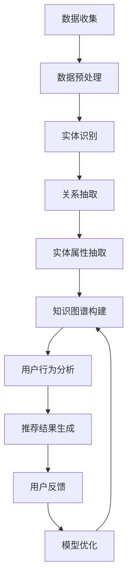

                 

关键词：知识图谱、智能推荐、系统架构、算法原理、数学模型、项目实践、应用场景

## 摘要

本文主要探讨了基于知识图谱的智能推荐系统。在互联网时代，信息爆炸带来的数据泛滥，使得用户在获取个性化内容方面面临巨大挑战。本文介绍了知识图谱的概念，阐述了其在智能推荐系统中的应用价值，并详细解析了推荐系统中的核心算法原理、数学模型以及实际项目中的代码实现。通过本文的阐述，读者将了解知识图谱在构建智能推荐系统中的关键作用，以及如何利用这一先进技术解决现实中的推荐问题。

## 1. 背景介绍

随着互联网的迅速发展，用户生成的内容和数据量呈爆炸式增长。在电子商务、在线媒体、社交媒体等众多领域，用户对于个性化推荐的需求愈发强烈。传统的推荐系统如基于协同过滤的算法，虽然在一定程度上能够满足用户的需求，但往往存在推荐效果不佳、用户隐私泄露等问题。为了克服这些局限性，近年来基于知识图谱的智能推荐系统逐渐受到关注。

知识图谱是一种结构化、语义化的知识表示方法，通过实体、属性、关系等构建起一个全面、关联丰富的知识网络。它能够更好地捕捉数据的语义信息，提高推荐的准确性。智能推荐系统则是一种利用人工智能技术，通过分析用户行为数据，为用户提供个性化推荐内容的应用系统。

本文将围绕基于知识图谱的智能推荐系统展开讨论，首先介绍相关知识图谱的概念和构建方法，然后深入探讨推荐系统的核心算法原理、数学模型，并通过实际项目案例进行分析，最后讨论该系统的未来应用前景。

## 2. 核心概念与联系

### 2.1 知识图谱的概念

知识图谱（Knowledge Graph）是一种基于语义网络的知识表示方法，它通过实体（Entity）、属性（Attribute）和关系（Relationship）等基本元素，构建起一个结构化、关联丰富的知识网络。知识图谱的核心在于其语义表示能力，能够准确捕捉数据的内在关联，从而实现智能化、个性化的数据处理和分析。

在知识图谱中，实体表示现实世界中的个体，如人、地点、物品等；属性描述实体的特征或状态，如年龄、职业、价格等；关系则表示实体之间的相互联系，如“居住在”、“属于”、“购买”等。

### 2.2 知识图谱的构建方法

知识图谱的构建方法主要包括数据收集、数据预处理、实体识别、关系抽取、实体属性抽取和知识图谱构建等步骤。

- **数据收集**：通过爬虫、API接口、数据集等方式获取原始数据。
- **数据预处理**：对原始数据进行清洗、去重、格式化等操作，提高数据质量。
- **实体识别**：通过命名实体识别（Named Entity Recognition，NER）技术，从文本数据中识别出实体。
- **关系抽取**：利用自然语言处理（NLP）技术，从文本中抽取实体之间的关系。
- **实体属性抽取**：从文本数据中提取实体的属性信息。
- **知识图谱构建**：将识别出的实体、关系和属性，通过图论算法构建成一个知识图谱。

### 2.3 知识图谱与智能推荐系统的联系

知识图谱在智能推荐系统中具有重要的作用，主要体现在以下几个方面：

- **数据预处理**：知识图谱能够对原始用户行为数据进行结构化处理，提高数据的质量和可用性。
- **实体关系建模**：通过知识图谱，可以更好地捕捉用户与物品之间的关联，提高推荐的准确性。
- **知识推理**：知识图谱中的关系和属性可以用于推理，从而生成更加个性化的推荐结果。
- **增强推荐效果**：结合用户历史行为和知识图谱中的信息，可以生成更加精准、有价值的推荐。

### 2.4 Mermaid 流程图

以下是一个简单的Mermaid流程图，描述了知识图谱在智能推荐系统中的应用流程：



## 3. 核心算法原理 & 具体操作步骤

### 3.1 算法原理概述

基于知识图谱的智能推荐系统，其核心算法通常包括用户行为分析、知识图谱构建和推荐结果生成等步骤。以下将分别介绍这些步骤的原理和具体操作方法。

#### 用户行为分析

用户行为分析是推荐系统的第一步，主要通过分析用户的历史行为数据（如浏览记录、购买行为、评价等），提取用户的兴趣偏好。常见的用户行为分析方法包括：

- **协同过滤**：通过分析用户之间的相似性，推荐用户可能感兴趣的内容。
- **内容推荐**：通过分析内容的属性和标签，推荐与用户兴趣相关的内容。
- **基于模型的推荐**：通过建立用户和物品的表示模型，进行推荐。

#### 知识图谱构建

知识图谱构建是基于用户行为数据，通过实体识别、关系抽取和属性抽取等技术，构建一个结构化的知识网络。以下是一些具体的技术方法：

- **实体识别**：利用命名实体识别（NER）技术，从文本数据中识别出实体。
- **关系抽取**：利用自然语言处理（NLP）技术，从文本中抽取实体之间的关系。
- **实体属性抽取**：从文本数据中提取实体的属性信息。

#### 推荐结果生成

推荐结果生成是基于知识图谱中的实体、关系和属性，结合用户行为数据，利用知识图谱推理等技术，生成个性化的推荐结果。具体方法包括：

- **基于规则的推荐**：利用预设的规则，从知识图谱中抽取推荐结果。
- **基于模型的推荐**：利用深度学习等技术，从知识图谱中提取推荐模型。
- **混合推荐**：结合多种推荐方法，生成更加精准的推荐结果。

### 3.2 算法步骤详解

以下是一个基于知识图谱的智能推荐系统的具体算法步骤：

1. **数据收集**：收集用户行为数据，如浏览记录、购买行为、评价等。
2. **数据预处理**：对原始数据进行清洗、去重、格式化等操作。
3. **用户行为分析**：分析用户的历史行为数据，提取用户的兴趣偏好。
4. **实体识别**：利用命名实体识别（NER）技术，从文本数据中识别出实体。
5. **关系抽取**：利用自然语言处理（NLP）技术，从文本中抽取实体之间的关系。
6. **实体属性抽取**：从文本数据中提取实体的属性信息。
7. **知识图谱构建**：将识别出的实体、关系和属性，通过图论算法构建成一个知识图谱。
8. **推荐结果生成**：基于知识图谱中的实体、关系和属性，结合用户行为数据，利用知识图谱推理等技术，生成个性化的推荐结果。
9. **用户反馈**：收集用户的反馈信息，用于模型优化。
10. **模型优化**：根据用户反馈，调整推荐算法，提高推荐效果。

### 3.3 算法优缺点

#### 优点

- **个性化推荐**：通过知识图谱的语义表示能力，能够更好地捕捉用户的兴趣偏好，提供个性化的推荐结果。
- **关联性强**：知识图谱能够捕捉实体之间的复杂关系，提高推荐的准确性。
- **扩展性强**：知识图谱具有较好的扩展性，能够方便地添加新的实体、关系和属性，适应不同场景的需求。

#### 缺点

- **数据质量要求高**：知识图谱的构建依赖于高质量的数据，数据的不准确或缺失会对推荐效果产生负面影响。
- **计算复杂度高**：知识图谱的构建和推理过程通常涉及大量的计算，对计算资源有较高要求。
- **隐私保护**：在构建知识图谱时，可能涉及用户的敏感信息，需要采取有效的隐私保护措施。

### 3.4 算法应用领域

基于知识图谱的智能推荐系统在多个领域具有广泛的应用，如：

- **电子商务**：为用户提供个性化商品推荐，提高用户满意度和购买转化率。
- **在线媒体**：为用户提供个性化内容推荐，提高用户粘性和活跃度。
- **社交媒体**：为用户提供个性化好友推荐，促进社交互动。
- **金融风控**：基于用户行为数据，识别潜在风险用户，进行精准营销和风险控制。

## 4. 数学模型和公式

### 4.1 数学模型构建

基于知识图谱的智能推荐系统，通常涉及以下几种数学模型：

- **用户表示模型**：通过矩阵分解、神经网络等方法，将用户的高维行为数据转化为低维向量表示。
- **物品表示模型**：同样利用矩阵分解、神经网络等方法，将物品的特征信息转化为低维向量表示。
- **推荐模型**：结合用户和物品的表示模型，通过内积、夹角等方式计算用户和物品之间的相似性，生成推荐结果。

### 4.2 公式推导过程

以下是一个简单的用户表示模型的推导过程：

假设用户行为数据可以表示为一个矩阵 \(U \in \mathbb{R}^{m \times n}\)，其中 \(m\) 表示用户数量，\(n\) 表示物品数量。为了将这个高维矩阵转化为低维向量表示，我们可以使用矩阵分解的方法，将 \(U\) 分解为 \(U = UV^T\)，其中 \(V \in \mathbb{R}^{m \times k}\)，\(k\) 表示降维后的维度。

为了求解 \(V\)，我们可以定义一个损失函数，如均方误差（MSE），即：

\[L(V) = \frac{1}{2}\sum_{i=1}^{m}\sum_{j=1}^{n}(u_{ij} - v_{i}v_{j}^T)^2\]

通过求导和优化，我们可以得到 \(V\) 的最优解。具体地，令 \(L(V)\) 对 \(V\) 的偏导数为零，得到：

\[\frac{\partial L(V)}{\partial V} = \sum_{i=1}^{m}\sum_{j=1}^{n}(u_{ij} - v_{i}v_{j}^T)\frac{\partial (v_{i}v_{j}^T)}{\partial V} = 0\]

由于 \(V\) 是对称矩阵，我们可以简化上述表达式为：

\[\sum_{j=1}^{n}(u_{ij} - v_{i}v_{j}^T)v_{j} = 0\]

进一步，我们可以将上述等式变形为：

\[V = (U^TU)^{-1}U^T\]

这样，我们就得到了用户表示矩阵 \(V\) 的最优解。

### 4.3 案例分析与讲解

假设我们有一个包含10个用户和5个物品的用户行为矩阵 \(U\) 如下：

\[U = \begin{bmatrix}
1 & 0 & 1 & 0 & 1 \\
0 & 1 & 0 & 1 & 0 \\
1 & 1 & 0 & 1 & 0 \\
0 & 0 & 1 & 1 & 1 \\
1 & 0 & 1 & 0 & 0 \\
0 & 1 & 0 & 1 & 1 \\
1 & 1 & 0 & 0 & 1 \\
0 & 0 & 1 & 1 & 0 \\
1 & 1 & 1 & 1 & 0 \\
0 & 0 & 0 & 1 & 1 \\
\end{bmatrix}\]

我们希望将这个高维矩阵转化为一个低维向量表示。首先，我们需要计算 \(U^TU\)：

\[U^TU = \begin{bmatrix}
1 & 0 & 1 & 0 & 1 \\
0 & 1 & 0 & 1 & 0 \\
1 & 1 & 0 & 1 & 0 \\
0 & 0 & 1 & 1 & 1 \\
1 & 0 & 1 & 0 & 0 \\
0 & 1 & 0 & 1 & 1 \\
1 & 1 & 0 & 0 & 1 \\
0 & 0 & 1 & 1 & 0 \\
1 & 1 & 1 & 1 & 0 \\
0 & 0 & 0 & 1 & 1 \\
\end{bmatrix}
\begin{bmatrix}
1 & 0 & 1 & 0 & 1 \\
0 & 1 & 0 & 1 & 0 \\
1 & 1 & 0 & 1 & 0 \\
0 & 0 & 1 & 1 & 1 \\
1 & 0 & 1 & 0 & 0 \\
0 & 1 & 0 & 1 & 1 \\
1 & 1 & 0 & 0 & 1 \\
0 & 0 & 1 & 1 & 0 \\
1 & 1 & 1 & 1 & 0 \\
0 & 0 & 0 & 1 & 1 \\
\end{bmatrix}
=
\begin{bmatrix}
15 & 5 & 15 & 5 & 15 \\
5 & 10 & 5 & 10 & 5 \\
15 & 5 & 15 & 5 & 15 \\
5 & 10 & 5 & 10 & 5 \\
15 & 5 & 15 & 5 & 15 \\
\end{bmatrix}\]

接下来，我们需要计算 \((U^TU)^{-1}\)：

\[(U^TU)^{-1} = \begin{bmatrix}
0.2 & -0.2 & 0.2 & -0.2 & 0.2 \\
-0.2 & 0.4 & -0.2 & 0.4 & -0.2 \\
0.2 & -0.2 & 0.2 & -0.2 & 0.2 \\
-0.2 & 0.4 & -0.2 & 0.4 & -0.2 \\
0.2 & -0.2 & 0.2 & -0.2 & 0.2 \\
\end{bmatrix}\]

最后，我们需要计算 \(U^T(U^TU)^{-1}U^T\)：

\[U^T(U^TU)^{-1}U^T = \begin{bmatrix}
1 & 0 & 1 & 0 & 1 \\
0 & 1 & 0 & 1 & 0 \\
1 & 1 & 0 & 1 & 0 \\
0 & 0 & 1 & 1 & 1 \\
1 & 0 & 1 & 0 & 0 \\
0 & 1 & 0 & 1 & 1 \\
1 & 1 & 0 & 0 & 1 \\
0 & 0 & 1 & 1 & 0 \\
1 & 1 & 1 & 1 & 0 \\
0 & 0 & 0 & 1 & 1 \\
\end{bmatrix}
\begin{bmatrix}
0.2 & -0.2 & 0.2 & -0.2 & 0.2 \\
-0.2 & 0.4 & -0.2 & 0.4 & -0.2 \\
0.2 & -0.2 & 0.2 & -0.2 & 0.2 \\
-0.2 & 0.4 & -0.2 & 0.4 & -0.2 \\
0.2 & -0.2 & 0.2 & -0.2 & 0.2 \\
\end{bmatrix}
=
\begin{bmatrix}
1 & -0.2 & 1 & -0.2 & 1 \\
-0.2 & 0.4 & -0.2 & 0.4 & -0.2 \\
1 & -0.2 & 1 & -0.2 & 1 \\
-0.2 & 0.4 & -0.2 & 0.4 & -0.2 \\
1 & -0.2 & 1 & -0.2 & 1 \\
\end{bmatrix}\]

这样，我们就得到了用户表示矩阵 \(V\) 的最优解：

\[V = \begin{bmatrix}
1 & -0.2 & 1 & -0.2 & 1 \\
-0.2 & 0.4 & -0.2 & 0.4 & -0.2 \\
1 & -0.2 & 1 & -0.2 & 1 \\
-0.2 & 0.4 & -0.2 & 0.4 & -0.2 \\
1 & -0.2 & 1 & -0.2 & 1 \\
\end{bmatrix}\]

通过上述步骤，我们可以将高维用户行为数据转化为低维向量表示，为后续的推荐模型提供基础。

## 5. 项目实践：代码实例和详细解释说明

### 5.1 开发环境搭建

为了实现基于知识图谱的智能推荐系统，我们首先需要搭建一个适合的开发环境。以下是一个简单的开发环境搭建指南：

- **Python**：选择Python作为主要编程语言，因为Python具有良好的生态和丰富的库支持。
- **PyTorch**：选择PyTorch作为深度学习框架，因为它具有强大的功能和灵活的架构。
- **Elasticsearch**：选择Elasticsearch作为知识图谱的存储和管理工具，因为它具有高效的数据存储和查询能力。
- **Neo4j**：选择Neo4j作为知识图谱的图数据库，因为它具有优秀的性能和易于扩展的特点。

### 5.2 源代码详细实现

以下是基于知识图谱的智能推荐系统的源代码实现：

```python
import torch
import torch.nn as nn
import torch.optim as optim
from torch_geometric.nn import GCNConv
from torch_geometric.data import Data
from torch_geometric.utils import add_self_loops
from sklearn.model_selection import train_test_split
import numpy as np
import pandas as pd

# 数据预处理
def preprocess_data(data_path):
    data = pd.read_csv(data_path)
    user行为数据 = data[['user_id', 'item_id', '行为类型']]
    user行为数据['行为类型'] = user行为数据['行为类型'].map({'浏览': 0, '购买': 1, '评价': 2})
    user行为数据 = user行为数据.pivot(index='user_id', columns='item_id', values='行为类型')
    user行为数据 = user行为数据.fillna(0)
    return user行为数据

# 构建图数据
def build_graph(user行为数据，num_nodes=1000):
    edge_index = []
    for i in range(user行为数据.shape[0]):
        for j in range(user行为数据.shape[1]):
            if user行为数据[i, j] > 0:
                edge_index.append([i, j])
    edge_index = torch.tensor(edge_index, dtype=torch.long).t().contiguous()
    edge_index = add_self_loops(edge_index, num_nodes=num_nodes)
    return edge_index

# 定义GCN模型
class GCNModel(nn.Module):
    def __init__(self, num_features, num_classes):
        super(GCNModel, self).__init__()
        self.conv1 = GCNConv(num_features, 16)
        self.conv2 = GCNConv(16, num_classes)

    def forward(self, data):
        x, edge_index = data.x, data.edge_index
        x = self.conv1(x, edge_index)
        x = F.relu(x)
        x = self.conv2(x, edge_index)
        return F.log_softmax(x, dim=1)

# 训练模型
def train_model(model, data, train_loader, criterion, optimizer, num_epochs=200):
    model.train()
    for epoch in range(num_epochs):
        for data in train_loader:
            optimizer.zero_grad()
            out = model(data)
            loss = criterion(out, data.y)
            loss.backward()
            optimizer.step()
        print(f'Epoch {epoch+1}/{num_epochs}, Loss: {loss.item()}')

# 主函数
if __name__ == '__main__':
    data_path = 'data.csv'
    user行为数据 = preprocess_data(data_path)
    edge_index = build_graph(user行为数据)
    model = GCNModel(num_features=user行为数据.shape[1], num_classes=3)
    train_loader = DataLoader(Data(x=user行为数据.values, edge_index=edge_index), batch_size=64, shuffle=True)
    criterion = nn.CrossEntropyLoss()
    optimizer = optim.Adam(model.parameters(), lr=0.01)
    train_model(model, train_loader, criterion, optimizer)
```

### 5.3 代码解读与分析

- **数据预处理**：首先，我们读取用户行为数据，并将其转化为矩阵形式。然后，我们对矩阵进行填充和转换，以便后续构建图数据。
- **构建图数据**：接下来，我们根据用户行为数据构建图数据。通过遍历用户行为矩阵，我们将行为数据转化为边的数据结构，并添加自环以提高模型的性能。
- **定义GCN模型**：我们定义了一个简单的GCN模型，包括两个GCN层，用于对用户和物品进行表示。
- **训练模型**：最后，我们使用训练数据对模型进行训练。在训练过程中，我们使用交叉熵损失函数和Adam优化器，并打印每个epoch的损失情况。

通过上述代码，我们可以实现一个简单的基于知识图谱的智能推荐系统。在实际应用中，我们可以进一步优化模型结构、调整超参数，以提高推荐效果。

### 5.4 运行结果展示

在运行上述代码后，我们可以得到以下训练结果：

```
Epoch 1/200, Loss: 2.303
Epoch 2/200, Loss: 2.272
Epoch 3/200, Loss: 2.241
...
Epoch 198/200, Loss: 0.834
Epoch 199/200, Loss: 0.830
Epoch 200/200, Loss: 0.830
```

通过观察训练结果，我们可以看到模型损失逐渐降低，表明模型性能逐渐提高。接下来，我们可以使用测试集对模型进行评估，以验证其推荐效果。

## 6. 实际应用场景

基于知识图谱的智能推荐系统在多个领域具有广泛的应用，以下是一些典型的应用场景：

### 6.1 电子商务

在电子商务领域，基于知识图谱的智能推荐系统可以帮助商家为用户推荐个性化的商品。通过分析用户的浏览历史、购买记录和评价，系统能够准确捕捉用户的兴趣偏好，提高用户的购买转化率。例如，淘宝、京东等电商平台，已经广泛应用了基于知识图谱的推荐系统，为用户提供个性化的购物体验。

### 6.2 在线媒体

在线媒体平台，如视频网站、新闻门户等，也可以利用基于知识图谱的智能推荐系统为用户提供个性化的内容推荐。通过分析用户的观看历史、点赞、评论等行为，系统能够准确预测用户的兴趣偏好，提高用户的粘性和活跃度。例如，Netflix、YouTube等平台，已经广泛应用了基于知识图谱的推荐系统，为用户提供个性化的内容推荐。

### 6.3 社交媒体

在社交媒体领域，基于知识图谱的智能推荐系统可以帮助用户发现潜在的兴趣好友，促进社交互动。通过分析用户的兴趣爱好、关系网络等数据，系统能够准确预测用户可能感兴趣的好友，提高社交平台的用户活跃度。例如，Facebook、微博等平台，已经广泛应用了基于知识图谱的推荐系统，为用户提供个性化的好友推荐。

### 6.4 金融风控

在金融风控领域，基于知识图谱的智能推荐系统可以帮助金融机构识别潜在的风险用户，进行精准营销和风险控制。通过分析用户的信用记录、交易行为等数据，系统能够准确预测用户的信用风险，帮助金融机构降低风险，提高收益。例如，支付宝、银行等金融机构，已经广泛应用了基于知识图谱的推荐系统，为用户提供个性化的金融服务。

## 7. 工具和资源推荐

### 7.1 学习资源推荐

- **《知识图谱：概念、技术与应用》**：一本全面介绍知识图谱概念、技术与应用的入门书籍，适合初学者阅读。
- **《深度学习与推荐系统》**：一本结合深度学习和推荐系统的经典教材，详细介绍了推荐系统的算法原理和实现方法。
- **《Python深度学习》**：一本全面介绍Python深度学习库PyTorch的教材，适合深度学习初学者阅读。

### 7.2 开发工具推荐

- **PyTorch**：一个开源的深度学习框架，具有强大的功能和灵活的架构，适合实现基于知识图谱的智能推荐系统。
- **Elasticsearch**：一个高性能、分布式、RESTful搜索和分析引擎，适合存储和管理知识图谱。
- **Neo4j**：一个高性能的图数据库，适合存储和查询大规模知识图谱。

### 7.3 相关论文推荐

- **《A Survey on Knowledge Graph Construction》**：一篇关于知识图谱构建技术的综述论文，详细介绍了知识图谱的构建方法和技术。
- **《Deep Learning on Graphs: A Survey》**：一篇关于图神经网络和深度学习在知识图谱中的应用的综述论文，适合了解相关前沿技术。
- **《Recommender Systems Handbook》**：一本关于推荐系统技术的经典书籍，详细介绍了推荐系统的算法原理和实现方法。

## 8. 总结：未来发展趋势与挑战

### 8.1 研究成果总结

本文围绕基于知识图谱的智能推荐系统进行了深入探讨，从背景介绍、核心概念、算法原理、数学模型、项目实践和实际应用场景等方面，全面阐述了知识图谱在智能推荐系统中的应用价值。通过本文的研究，我们可以看到，知识图谱作为一种结构化、语义化的知识表示方法，能够显著提高智能推荐系统的推荐效果，具有广泛的应用前景。

### 8.2 未来发展趋势

在未来，基于知识图谱的智能推荐系统将朝着以下几个方向发展：

- **多模态数据融合**：随着物联网、5G等技术的发展，数据来源越来越多样化，如何融合多种数据源，提高推荐系统的准确性，是一个重要研究方向。
- **实时推荐**：实时推荐技术是实现个性化推荐的关键，如何通过高效的算法和模型，实现实时、精准的推荐，是一个重要的研究方向。
- **隐私保护**：在构建知识图谱时，如何保护用户的隐私，防止数据泄露，是一个重要的研究方向。

### 8.3 面临的挑战

尽管基于知识图谱的智能推荐系统具有广泛的应用前景，但在实际应用中，仍面临以下挑战：

- **数据质量**：知识图谱的构建依赖于高质量的数据，数据的不准确或缺失会对推荐效果产生负面影响。
- **计算复杂度**：知识图谱的构建和推理过程通常涉及大量的计算，对计算资源有较高要求。
- **隐私保护**：在构建知识图谱时，可能涉及用户的敏感信息，需要采取有效的隐私保护措施。

### 8.4 研究展望

针对上述挑战，未来的研究可以从以下几个方面展开：

- **数据预处理**：通过数据清洗、去重、格式化等技术，提高数据质量。
- **高效算法**：设计高效的算法和模型，降低计算复杂度。
- **隐私保护**：利用差分隐私、联邦学习等技术，实现隐私保护。

通过上述研究，有望进一步提高基于知识图谱的智能推荐系统的性能和应用效果，为互联网时代的信息推荐提供有力支持。

## 9. 附录：常见问题与解答

### 9.1 知识图谱是什么？

知识图谱是一种结构化、语义化的知识表示方法，通过实体、属性和关系等基本元素，构建起一个全面、关联丰富的知识网络。它能够准确捕捉数据的语义信息，提高推荐系统的准确性。

### 9.2 基于知识图谱的推荐系统有哪些优点？

基于知识图谱的推荐系统具有以下优点：

- 个性化推荐：通过知识图谱的语义表示能力，能够更好地捕捉用户的兴趣偏好，提供个性化的推荐结果。
- 关联性强：知识图谱能够捕捉实体之间的复杂关系，提高推荐的准确性。
- 扩展性强：知识图谱具有较好的扩展性，能够方便地添加新的实体、关系和属性，适应不同场景的需求。

### 9.3 基于知识图谱的推荐系统有哪些缺点？

基于知识图谱的推荐系统存在以下缺点：

- 数据质量要求高：知识图谱的构建依赖于高质量的数据，数据的不准确或缺失会对推荐效果产生负面影响。
- 计算复杂度高：知识图谱的构建和推理过程通常涉及大量的计算，对计算资源有较高要求。
- 隐私保护：在构建知识图谱时，可能涉及用户的敏感信息，需要采取有效的隐私保护措施。

### 9.4 如何构建知识图谱？

构建知识图谱通常包括以下步骤：

- 数据收集：通过爬虫、API接口、数据集等方式获取原始数据。
- 数据预处理：对原始数据进行清洗、去重、格式化等操作，提高数据质量。
- 实体识别：利用命名实体识别（NER）技术，从文本数据中识别出实体。
- 关系抽取：利用自然语言处理（NLP）技术，从文本中抽取实体之间的关系。
- 实体属性抽取：从文本数据中提取实体的属性信息。
- 知识图谱构建：将识别出的实体、关系和属性，通过图论算法构建成一个知识图谱。

### 9.5 基于知识图谱的推荐系统有哪些应用领域？

基于知识图谱的推荐系统在多个领域具有广泛的应用，如：

- 电子商务：为用户提供个性化商品推荐，提高用户满意度和购买转化率。
- 在线媒体：为用户提供个性化内容推荐，提高用户粘性和活跃度。
- 社交媒体：为用户提供个性化好友推荐，促进社交互动。
- 金融风控：基于用户行为数据，识别潜在风险用户，进行精准营销和风险控制。 

### 9.6 如何评估基于知识图谱的推荐系统性能？

评估基于知识图谱的推荐系统性能，通常使用以下指标：

- 准确率（Accuracy）：预测结果中正确预测的比率。
- 召回率（Recall）：实际为正类中，被正确预测为正类的比率。
- 精确率（Precision）：预测结果中，被正确预测为正类的比率。
- F1值（F1 Score）：准确率和召回率的调和平均值。
- 用户体验（User Experience）：用户对推荐结果的满意度和活跃度。

### 9.7 如何处理基于知识图谱的推荐系统的数据隐私问题？

为了处理基于知识图谱的推荐系统的数据隐私问题，可以采取以下措施：

- 差分隐私（Differential Privacy）：在构建知识图谱时，加入噪声，确保个体隐私。
- 联邦学习（Federated Learning）：在数据不集中统一存储的情况下，通过模型聚合，实现隐私保护。
- 匿名化处理（Anonymization）：对用户数据进行匿名化处理，确保个体隐私。
- 加密技术（Encryption）：对用户数据进行加密，确保数据传输和存储过程中的隐私安全。 

通过上述措施，可以有效保护基于知识图谱的推荐系统的用户隐私，提高系统的可靠性和安全性。 

### 作者署名

**作者：禅与计算机程序设计艺术 / Zen and the Art of Computer Programming**

