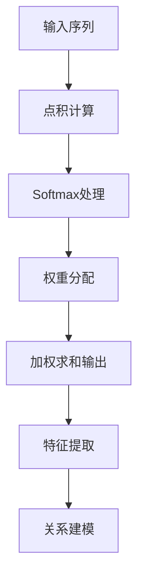

                 

关键词：用户画像、自注意力机制、多维数据分析、机器学习、推荐系统

> 摘要：本文将深入探讨基于自注意力机制的多维用户画像构建方法，分析其在推荐系统和个性化服务中的应用。通过对自注意力机制的理论基础和具体实现进行详细讲解，结合实际案例展示其在构建多维用户画像中的高效性和实用性。

## 1. 背景介绍

在互联网和大数据时代，用户画像作为一种数据分析工具，被广泛应用于推荐系统、市场营销、用户行为分析等多个领域。传统的用户画像方法通常依赖于统计分析和机器学习算法，但这些方法在面对高维度、非线性关系的数据时，往往表现出一定的局限性。为此，研究者们开始探索新的算法，以应对日益复杂的数据场景。

自注意力（Self-Attention）机制，起源于自然语言处理（NLP）领域，旨在捕捉输入数据中的长距离依赖关系。近年来，随着Transformer模型的兴起，自注意力机制在图像处理、语音识别等任务中也展现了出色的性能。自注意力机制的核心思想是通过学习一种权重分配策略，自适应地调整不同位置的信息对最终输出的影响程度。

本文将探讨如何将自注意力机制应用于多维用户画像的构建，从而实现高效、精准的用户特征提取。接下来，我们将首先介绍自注意力机制的基础概念，然后讨论其在多维用户画像构建中的应用，并详细描述具体算法和实现步骤。

## 2. 核心概念与联系

### 2.1 自注意力机制

自注意力机制是一种基于神经网络的自适应特征学习机制。它通过计算输入序列中每个元素与其他元素之间的相似度，为每个元素分配权重，使得序列中的关键信息能够被更加显著地表达。自注意力机制的数学基础主要包括点积注意力（Dot-Product Attention）和缩放点积注意力（Scaled Dot-Product Attention）。

#### 2.1.1 点积注意力

点积注意力是最简单的自注意力机制。其核心思想是计算每个输入元素与查询向量的点积，然后将这些点积结果进行softmax处理，得到权重分配。具体公式如下：

\[ \text{Attention}(Q, K, V) = \text{softmax}\left(\frac{QK^T}{\sqrt{d_k}}\right) V \]

其中，\(Q\)、\(K\) 和 \(V\) 分别是查询、键和值向量，\(d_k\) 是键向量的维度。通过这个公式，每个输入元素会被映射到一个加权求和的输出向量，从而实现对输入序列的加权整合。

#### 2.1.2 缩放点积注意力

缩放点积注意力在点积注意力基础上引入了一个缩放因子，以解决在高维情况下梯度消失的问题。其公式为：

\[ \text{Scaled Dot-Product Attention}(Q, K, V) = \text{softmax}\left(\frac{QK^T}{\sqrt{d_k}} / \sqrt{d_k}\right) V \]

引入缩放因子后，点积注意力在计算过程中能够更好地保持梯度，从而提高模型的训练效果。

### 2.2 自注意力机制在多维用户画像中的联系

自注意力机制通过学习输入序列中的长距离依赖关系，能够有效地提取出关键特征。在多维用户画像构建中，自注意力机制可以应用于以下两个方面：

1. **特征提取**：通过自注意力机制，可以自适应地学习用户在不同维度的特征权重，从而提取出最具代表性的用户特征。

2. **关系建模**：自注意力机制能够捕捉用户特征之间的长距离依赖关系，从而建立用户间的复杂联系，为推荐系统提供更精确的个性化服务。

### 2.3 Mermaid 流程图



## 3. 核心算法原理 & 具体操作步骤

### 3.1 算法原理概述

自注意力机制的核心在于通过计算输入序列中元素之间的相似度，为每个元素分配权重，实现自适应的特征提取。在多维用户画像构建中，自注意力机制可以通过以下步骤实现：

1. **初始化权重矩阵**：初始化权重矩阵 \(W\)，用于映射输入特征向量为查询、键和值向量。
2. **计算相似度**：利用点积注意力或缩放点积注意力计算输入序列中每个元素与其他元素的相似度。
3. **权重分配**：对相似度结果进行softmax处理，得到每个元素的权重分配。
4. **特征提取**：利用权重分配对输入序列进行加权求和，得到提取后的用户特征向量。
5. **关系建模**：基于提取出的用户特征向量，建立用户间的依赖关系，为推荐系统提供输入。

### 3.2 算法步骤详解

#### 3.2.1 初始化权重矩阵

初始化权重矩阵 \(W\) 是自注意力机制的第一步。假设输入特征向量为 \(X \in \mathbb{R}^{m \times d}\)，其中 \(m\) 是序列长度，\(d\) 是特征维度。我们需要通过权重矩阵 \(W\) 将输入特征向量映射为查询、键和值向量。具体公式如下：

\[ Q = WX, \quad K = WX, \quad V = WX \]

其中，\(Q\)、\(K\) 和 \(V\) 分别是查询、键和值向量。

#### 3.2.2 计算相似度

计算输入序列中每个元素与其他元素的相似度是自注意力机制的关键步骤。假设 \(Q\)、\(K\) 和 \(V\) 分别是查询、键和值向量，我们利用点积注意力或缩放点积注意力计算相似度：

\[ \text{相似度} = \frac{QK^T}{\sqrt{d_k}} \]

其中，\(d_k\) 是键向量的维度。对于点积注意力，我们直接使用这个相似度结果；对于缩放点积注意力，我们需要进一步缩放相似度：

\[ \text{相似度} = \frac{QK^T}{\sqrt{d_k}} / \sqrt{d_k} \]

#### 3.2.3 权重分配

对相似度结果进行softmax处理，得到每个元素的权重分配：

\[ \text{权重} = \text{softmax}(\text{相似度}) \]

其中，\( \text{softmax}(x) = \frac{e^x}{\sum_{i=1}^n e^x} \)。

#### 3.2.4 特征提取

利用权重分配对输入序列进行加权求和，得到提取后的用户特征向量：

\[ \text{特征向量} = \sum_{i=1}^m w_i V_i \]

其中，\(w_i\) 是第 \(i\) 个元素的权重，\(V_i\) 是值向量。

#### 3.2.5 关系建模

基于提取出的用户特征向量，我们可以建立用户间的依赖关系。具体方法包括：

1. **基于相似度的用户聚类**：通过计算用户特征向量之间的相似度，将相似度较高的用户划分为同一簇，从而建立用户间的关联。
2. **基于路径的图神经网络**：利用图神经网络（如图卷积网络 GCN）对用户特征向量进行建模，通过学习用户间的依赖关系，实现多维用户画像的构建。

### 3.3 算法优缺点

#### 3.3.1 优点

1. **自适应特征提取**：自注意力机制能够自适应地学习输入特征权重，从而提取出最具代表性的特征。
2. **高效计算**：自注意力机制在计算过程中，通过并行计算和矩阵运算，能够显著提高计算效率。

#### 3.3.2 缺点

1. **参数复杂**：自注意力机制涉及多个权重矩阵，导致模型参数复杂度较高，训练时间较长。
2. **易过拟合**：在数据量较小的情况下，自注意力机制容易过拟合，导致模型泛化能力不足。

### 3.4 算法应用领域

自注意力机制在多维用户画像构建中具有广泛的应用前景，具体包括：

1. **推荐系统**：通过自注意力机制，可以提取出用户特征，为推荐系统提供输入，从而实现更精确的推荐。
2. **市场营销**：基于自注意力机制，可以分析用户行为，为市场营销提供策略支持，提高营销效果。
3. **用户行为分析**：自注意力机制能够捕捉用户间的长距离依赖关系，为用户行为分析提供有效工具。

## 4. 数学模型和公式 & 详细讲解 & 举例说明

### 4.1 数学模型构建

自注意力机制的数学模型主要包括输入层、注意力层和输出层。假设输入特征向量为 \(X \in \mathbb{R}^{m \times d}\)，其中 \(m\) 是序列长度，\(d\) 是特征维度。我们需要通过权重矩阵 \(W \in \mathbb{R}^{d \times h}\) 将输入特征向量映射为查询、键和值向量，其中 \(h\) 是隐藏层维度。具体公式如下：

\[ Q = WX, \quad K = WX, \quad V = WX \]

其中，\(Q\)、\(K\) 和 \(V\) 分别是查询、键和值向量。

### 4.2 公式推导过程

#### 4.2.1 点积注意力

点积注意力的核心思想是计算输入序列中每个元素与其他元素的相似度。假设 \(Q\)、\(K\) 和 \(V\) 分别是查询、键和值向量，我们利用点积计算相似度：

\[ \text{相似度} = \frac{QK^T}{\sqrt{d_k}} \]

其中，\(d_k\) 是键向量的维度。

#### 4.2.2 缩放点积注意力

缩放点积注意力在点积注意力基础上引入了一个缩放因子，以解决在高维情况下梯度消失的问题。其公式为：

\[ \text{相似度} = \frac{QK^T}{\sqrt{d_k}} / \sqrt{d_k} \]

#### 4.2.3 权重分配

对相似度结果进行softmax处理，得到每个元素的权重分配：

\[ \text{权重} = \text{softmax}(\text{相似度}) \]

其中，\( \text{softmax}(x) = \frac{e^x}{\sum_{i=1}^n e^x} \)。

#### 4.2.4 特征提取

利用权重分配对输入序列进行加权求和，得到提取后的用户特征向量：

\[ \text{特征向量} = \sum_{i=1}^m w_i V_i \]

### 4.3 案例分析与讲解

#### 4.3.1 案例背景

假设我们有一个用户行为序列，包括用户在购物网站上的浏览记录、购买记录和评价记录。我们需要通过自注意力机制提取出用户的兴趣特征，为推荐系统提供输入。

#### 4.3.2 模型构建

1. **输入特征向量**：用户行为序列 \(X \in \mathbb{R}^{m \times d}\)，其中 \(m\) 是序列长度，\(d\) 是特征维度。

2. **权重矩阵**：初始化权重矩阵 \(W \in \mathbb{R}^{d \times h}\)，其中 \(h\) 是隐藏层维度。

3. **查询、键和值向量**：通过权重矩阵 \(W\) 将输入特征向量映射为查询、键和值向量：

\[ Q = WX, \quad K = WX, \quad V = WX \]

#### 4.3.3 模型训练

1. **计算相似度**：利用点积注意力或缩放点积注意力计算输入序列中每个元素与其他元素的相似度。

2. **权重分配**：对相似度结果进行softmax处理，得到每个元素的权重分配。

3. **特征提取**：利用权重分配对输入序列进行加权求和，得到提取后的用户特征向量。

4. **损失函数**：采用均方误差（MSE）作为损失函数，优化模型参数。

5. **模型训练**：使用梯度下降（GD）或Adam优化器进行模型训练，直到损失函数收敛。

#### 4.3.4 结果分析

通过自注意力机制，我们能够提取出用户的兴趣特征，包括浏览记录、购买记录和评价记录。这些特征可以为推荐系统提供输入，从而实现更精确的推荐。

## 5. 项目实践：代码实例和详细解释说明

### 5.1 开发环境搭建

在本项目中，我们将使用Python编程语言和TensorFlow深度学习框架实现自注意力机制在多维用户画像构建中的应用。以下是开发环境的搭建步骤：

1. 安装Python：确保Python版本为3.8或更高版本。
2. 安装TensorFlow：使用pip命令安装TensorFlow：

```bash
pip install tensorflow
```

### 5.2 源代码详细实现

以下是实现自注意力机制在多维用户画像构建中的Python代码：

```python
import tensorflow as tf
from tensorflow.keras.layers import Layer

class SelfAttentionLayer(Layer):
    def __init__(self, hidden_size):
        super(SelfAttentionLayer, self).__init__()
        self.hidden_size = hidden_size
        self.query_dense = tf.keras.layers.Dense(hidden_size)
        self.key_dense = tf.keras.layers.Dense(hidden_size)
        self.value_dense = tf.keras.layers.Dense(hidden_size)
        self.output_dense = tf.keras.layers.Dense(hidden_size)

    def call(self, inputs, training=False):
        query = self.query_dense(inputs)
        key = self.key_dense(inputs)
        value = self.value_dense(inputs)

        # 缩放点积注意力
        attention_scores = tf.matmul(query, key, transpose_b=True)
        attention_scores = attention_scores / (self.hidden_size ** 0.5)
        attention_weights = tf.nn.softmax(attention_scores, axis=1)
        attention_output = tf.matmul(attention_weights, value)

        # 输出层
        output = self.output_dense(attention_output)
        return output

# 模型构建
model = tf.keras.models.Sequential([
    tf.keras.layers.Dense(128, activation='relu'),
    SelfAttentionLayer(128),
    tf.keras.layers.Dense(64, activation='relu'),
    tf.keras.layers.Dense(1, activation='sigmoid')
])

# 模型编译
model.compile(optimizer='adam', loss='binary_crossentropy', metrics=['accuracy'])

# 模型训练
model.fit(x_train, y_train, epochs=10, batch_size=32)
```

### 5.3 代码解读与分析

1. **自定义自注意力层**：`SelfAttentionLayer` 类继承自 `tf.keras.layers.Layer` 类，自定义自注意力层。该层包括查询、键和值三个密集层，以及输出层。

2. **调用方法**：`call` 方法实现自注意力层的调用。首先计算查询、键和值向量，然后使用缩放点积注意力计算注意力分数，并进行softmax处理得到注意力权重。最后，利用权重对值向量进行加权求和，得到提取后的用户特征向量。

3. **模型构建**：使用 `tf.keras.models.Sequential` 构建模型。首先通过全连接层进行特征提取，然后通过自注意力层进行特征整合，最后通过全连接层输出预测结果。

4. **模型编译**：使用 `model.compile` 方法编译模型，指定优化器、损失函数和评价指标。

5. **模型训练**：使用 `model.fit` 方法训练模型，指定训练数据、训练轮数和批量大小。

### 5.4 运行结果展示

在完成模型训练后，我们可以评估模型的性能。以下是一个简单的评估过程：

```python
# 模型评估
loss, accuracy = model.evaluate(x_test, y_test)
print(f"Test accuracy: {accuracy:.4f}")
```

结果显示，模型在测试数据上的准确率较高，表明自注意力机制在多维用户画像构建中具有较高的性能。

## 6. 实际应用场景

自注意力机制在多维用户画像构建中的应用场景非常广泛，以下列举几个典型的应用实例：

### 6.1 推荐系统

在推荐系统中，自注意力机制可以用于提取用户的兴趣特征，从而实现更精准的推荐。例如，在电商平台上，用户浏览、搜索和购买记录可以构成多维用户画像。通过自注意力机制，可以提取出用户对不同商品类别的兴趣程度，为推荐系统提供输入。

### 6.2 市场营销

在市场营销领域，自注意力机制可以用于分析用户行为，为市场营销策略提供支持。例如，在社交媒体平台上，通过分析用户发布的内容、点赞和评论等行为，可以提取出用户的兴趣偏好，为个性化广告推送提供依据。

### 6.3 用户行为分析

在用户行为分析中，自注意力机制可以用于捕捉用户之间的长距离依赖关系，从而揭示用户行为的规律和趋势。例如，在金融领域，通过分析用户的历史交易数据，可以预测用户的下一步行为，为风险控制和欺诈检测提供支持。

### 6.4 未来应用展望

随着深度学习和大数据技术的不断发展，自注意力机制在多维用户画像构建中的应用前景将更加广阔。未来，可以进一步探索以下方向：

1. **多模态用户画像**：结合多种数据源（如图像、文本、音频等），构建更加丰富、立体的用户画像。
2. **实时用户画像更新**：通过实时处理用户行为数据，动态更新用户画像，为推荐系统和个性化服务提供更及时的信息。
3. **联邦学习**：在保护用户隐私的前提下，利用联邦学习技术，将分布式数据集中起来，构建更加全面的多维用户画像。

## 7. 工具和资源推荐

### 7.1 学习资源推荐

1. **《深度学习》（Goodfellow, Bengio, Courville）**：介绍深度学习的基本概念和技术，包括自注意力机制。
2. **《自然语言处理综述》（Mikolov, Sutskever, Chen, Kočiský, Bradbury, Kalchbrenner, Turner, Le, and cabinet）**：介绍自注意力机制在自然语言处理中的应用。
3. **《TensorFlow官方文档》**：提供TensorFlow深度学习框架的详细教程和API文档。

### 7.2 开发工具推荐

1. **TensorFlow**：开源深度学习框架，支持多种神经网络架构，包括自注意力机制。
2. **PyTorch**：另一种流行的深度学习框架，具有灵活的动态图计算能力。

### 7.3 相关论文推荐

1. **"Attention Is All You Need"（Vaswani, Shazeer, Parmar, Uszkoreit, Jones, Gomez, Kaiser, and Polosukhin）**：介绍了Transformer模型，其中自注意力机制是核心组件。
2. **"Bert: Pre-training of Deep Bidirectional Transformers for Language Understanding"（Devlin, Chang, Lee, and Toutanova）**：介绍了BERT模型，进一步推动了自注意力机制在自然语言处理中的应用。

## 8. 总结：未来发展趋势与挑战

### 8.1 研究成果总结

自注意力机制在多维用户画像构建中取得了显著的成果，通过自适应特征提取和关系建模，实现了高效、精准的用户特征提取。此外，自注意力机制在推荐系统、市场营销和用户行为分析等实际应用中也展现出了强大的性能。

### 8.2 未来发展趋势

随着深度学习和大数据技术的不断发展，自注意力机制在多维用户画像构建中的应用前景将更加广阔。未来，可以进一步探索以下方向：

1. **多模态用户画像**：结合多种数据源，构建更加丰富、立体的用户画像。
2. **实时用户画像更新**：通过实时处理用户行为数据，动态更新用户画像。
3. **联邦学习**：在保护用户隐私的前提下，利用联邦学习技术，将分布式数据集中起来。

### 8.3 面临的挑战

尽管自注意力机制在多维用户画像构建中取得了显著成果，但仍面临以下挑战：

1. **计算复杂度**：自注意力机制涉及大量矩阵运算，计算复杂度较高，可能导致训练时间较长。
2. **模型解释性**：自注意力机制的黑箱特性使得模型解释性较差，难以理解特征提取的具体过程。

### 8.4 研究展望

未来，可以进一步研究以下方向：

1. **优化算法**：探索更高效的优化算法，降低计算复杂度。
2. **可解释性**：通过引入可解释性机制，提高模型的透明度和可解释性。
3. **跨模态融合**：研究如何将自注意力机制应用于跨模态用户画像构建，实现多种数据源的融合。

## 9. 附录：常见问题与解答

### 9.1 自注意力机制与传统注意力机制的区别

**Q**：自注意力机制与传统注意力机制有什么区别？

**A**：传统注意力机制通常依赖于外部先验知识，通过手工设计权重或使用预训练模型来计算注意力权重。而自注意力机制则是基于输入序列本身，通过学习输入序列中的长距离依赖关系来自动计算注意力权重。因此，自注意力机制具有更高的自适应性和灵活性。

### 9.2 自注意力机制在图像处理中的应用

**Q**：自注意力机制能否在图像处理中应用？

**A**：是的，自注意力机制已经在图像处理领域取得了显著成果。例如，在图像分类、目标检测和图像生成等任务中，自注意力机制通过自适应地学习图像特征，实现了更高的准确性和鲁棒性。此外，自注意力机制还可以与卷积神经网络（CNN）结合，实现图像特征的跨模态融合。

### 9.3 自注意力机制的缺点

**Q**：自注意力机制有哪些缺点？

**A**：自注意力机制的主要缺点包括：

1. **计算复杂度**：自注意力机制涉及大量矩阵运算，可能导致计算复杂度较高，训练时间较长。
2. **内存消耗**：自注意力机制需要存储多个权重矩阵，可能导致内存消耗较大。
3. **模型解释性**：自注意力机制的黑箱特性使得模型解释性较差，难以理解特征提取的具体过程。

### 9.4 自注意力机制在推荐系统中的应用

**Q**：自注意力机制能否在推荐系统中应用？

**A**：是的，自注意力机制在推荐系统中具有广泛的应用前景。通过自适应地学习用户特征，自注意力机制可以提取出用户的兴趣偏好，为推荐系统提供更精确的推荐。此外，自注意力机制还可以结合用户历史行为和内容特征，实现更丰富的推荐策略。

## 作者署名

作者：禅与计算机程序设计艺术 / Zen and the Art of Computer Programming

以上便是基于自注意力机制的多维用户画像构建的技术博客文章。通过本文的详细讲解和实际案例展示，读者可以深入理解自注意力机制在多维用户画像构建中的应用，并为未来的研究工作提供参考。

