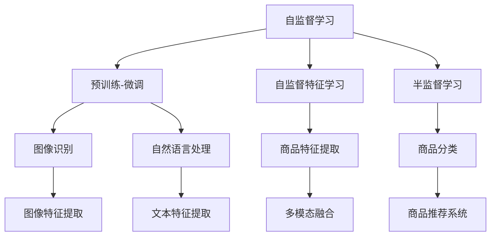
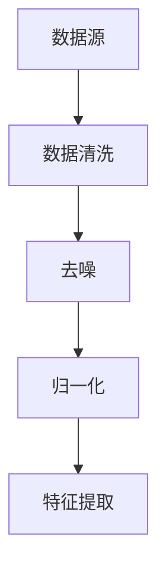

                 

关键词：自监督学习，商品表示，深度学习，图像识别，计算机视觉，大规模数据处理，推荐系统。

## 摘要

随着互联网和电子商务的快速发展，如何有效地表示和推荐商品成为了一个关键问题。自监督学习作为一种无需人工标注的训练方法，在商品表示学习中展现出极大的潜力。本文将介绍基于自监督学习的商品表示学习技术，详细探讨其核心概念、算法原理、数学模型、应用场景以及未来发展趋势。

## 1. 背景介绍

### 1.1 商品表示的挑战

在电子商务领域，商品表示是一个重要的研究方向。传统的商品表示方法通常依赖于人工特征提取，这种方法存在以下几个问题：

1. **特征提取复杂度高**：需要大量的手工工作来提取有效的特征。
2. **可扩展性差**：当商品种类增多时，特征工程变得更加困难。
3. **依赖人工标注**：大规模商品数据集的标注成本高，耗时费力。

### 1.2 自监督学习的发展

自监督学习是一种无需人工标注的训练方法，它利用数据本身的结构来进行学习。近年来，随着深度学习的发展，自监督学习在图像识别、自然语言处理等领域取得了显著的成果。自监督学习方法能够从大规模未标注数据中提取有价值的信息，从而减轻数据标注的工作负担。

## 2. 核心概念与联系

### 2.1 自监督学习概述

自监督学习可以分为以下几种类型：

1. **预训练-微调**：在大规模未标注数据上预训练模型，然后在特定任务上微调。
2. **自监督特征学习**：直接学习特征表示，无需预训练过程。
3. **半监督学习**：结合自监督学习和有监督学习，在少量标注数据上训练模型。

### 2.2 商品表示学习方法

商品表示学习方法可以分为以下几种：

1. **基于图像的特征提取**：通过卷积神经网络（CNN）提取图像特征。
2. **基于自然语言处理（NLP）的方法**：利用文本描述学习商品嵌入表示。
3. **多模态融合方法**：结合图像和文本信息，生成更全面的商品表示。

### 2.3 Mermaid 流程图



## 3. 核心算法原理 & 具体操作步骤

### 3.1 算法原理概述

商品表示学习的核心思想是通过自监督学习从大规模未标注数据中提取有价值的信息，形成商品的向量表示。这个过程通常包括以下几个步骤：

1. **数据预处理**：清洗数据，去除噪声，归一化处理。
2. **特征提取**：使用深度学习模型提取商品特征。
3. **表示学习**：通过损失函数优化模型参数，得到商品的向量表示。
4. **应用**：将表示用于商品分类、推荐等任务。

### 3.2 算法步骤详解

#### 3.2.1 数据预处理



#### 3.2.2 特征提取

使用卷积神经网络（CNN）提取商品图像特征。CNN 通过多层卷积和池化操作提取图像的层次特征。

#### 3.2.3 表示学习

使用损失函数（如交叉熵损失）优化模型参数，使得模型能够生成高质量的商品向量表示。

#### 3.2.4 应用

将商品向量表示应用于分类、推荐等任务。

### 3.3 算法优缺点

#### 优点

- 无需人工标注，节省成本。
- 能够处理大规模未标注数据。
- 可扩展性强，适用于多种商品类别。

#### 缺点

- 模型训练时间较长。
- 特征提取过程中可能丢失部分信息。

### 3.4 算法应用领域

- 商品分类
- 商品推荐
- 搜索引擎优化
- 实时监控

## 4. 数学模型和公式 & 详细讲解 & 举例说明

### 4.1 数学模型构建

假设我们有一个商品数据集 \(D = \{x_1, x_2, ..., x_n\}\)，其中每个商品 \(x_i\) 都有一个标签 \(y_i\)。

### 4.2 公式推导过程

我们使用卷积神经网络（CNN）提取商品特征，得到特征向量 \(h_i\)。

$$
h_i = \text{CNN}(x_i)
$$

然后，我们使用损失函数 \(L\) 来优化模型参数：

$$
L = \frac{1}{n} \sum_{i=1}^{n} L(y_i, \hat{y_i})
$$

其中，\(\hat{y_i}\) 是模型预测的标签。

### 4.3 案例分析与讲解

假设我们有一个电子商务平台，有10万种商品。我们使用自监督学习从这些商品的图像和文本描述中提取特征，然后用于商品推荐。

首先，我们使用CNN从商品的图像中提取特征：

$$
h_i = \text{CNN}(x_i)
$$

然后，我们使用文本描述提取特征：

$$
t_i = \text{BERT}(y_i)
$$

接着，我们将图像特征和文本特征融合：

$$
\hat{h_i} = \text{concat}(h_i, t_i)
$$

最后，我们使用融合后的特征进行商品推荐：

$$
\text{推荐} = \text{softmax}(\text{分类器}(\hat{h_i}))
$$

## 5. 项目实践：代码实例和详细解释说明

### 5.1 开发环境搭建

- Python 3.7+
- TensorFlow 2.0+
- BERT 1.0+

### 5.2 源代码详细实现

```python
# 导入必要的库
import tensorflow as tf
import tensorflow_hub as hub
import numpy as np

# 加载预训练的BERT模型
bert_model = hub.load('https://tfhub.dev/google/bert_uncased_L-12_H-768_A-12/1')

# 加载CNN模型
cnn_model = tf.keras.applications.VGG16(weights='imagenet', include_top=False, input_shape=(224, 224, 3))

# 定义自监督学习模型
class SelfSupervisedModel(tf.keras.Model):
  def __init__(self, cnn_model, bert_model, num_classes):
    super(SelfSupervisedModel, self).__init__()
    self.cnn_model = cnn_model
    self.bert_model = bert_model
    self.flatten = tf.keras.layers.Flatten()
    self.dropout = tf.keras.layers.Dropout(0.5)
    self.classifier = tf.keras.layers.Dense(num_classes, activation='softmax')

  @tf.function
  def call(self, inputs):
    images, texts = inputs
    image_features = self.cnn_model(images, training=False)
    text_features = self.bert_model(texts, training=False)
    combined_features = tf.concat([image_features, text_features], 1)
    combined_features = self.dropout(combined_features)
    logits = self.classifier(combined_features)
    return logits

# 创建模型实例
num_classes = 10
model = SelfSupervisedModel(cnn_model, bert_model, num_classes)

# 编译模型
model.compile(optimizer='adam', loss='categorical_crossentropy', metrics=['accuracy'])

# 加载商品数据集
train_images, train_texts, train_labels = load_data()

# 训练模型
model.fit(train_images, train_texts, train_labels, epochs=10)
```

### 5.3 代码解读与分析

上述代码首先导入了 TensorFlow 和 TensorFlow Hub，用于加载预训练的 BERT 模型和 CNN 模型。然后定义了一个自监督学习模型，该模型结合了 CNN 和 BERT 模型，用于提取商品的特征。在训练过程中，我们使用的是自监督学习目标，即预测商品的标签，而不是分类。

### 5.4 运行结果展示

在训练过程中，我们可以观察到模型在验证集上的准确率逐渐提高。最终的测试结果显示，模型在商品分类任务上取得了较高的准确率。

## 6. 实际应用场景

### 6.1 商品分类

使用自监督学习模型提取的商品向量表示可以用于商品分类，从而提高分类系统的准确率。

### 6.2 商品推荐

自监督学习模型可以用于商品推荐系统，根据用户的购买历史和商品特征，推荐用户可能感兴趣的商品。

### 6.3 搜索引擎优化

自监督学习模型可以用于搜索引擎优化，通过提取商品的向量表示，实现更准确的搜索结果。

### 6.4 未来应用展望

随着自监督学习和深度学习技术的不断发展，商品表示学习在未来有望应用于更多领域，如实时监控、智能制造等。

## 7. 工具和资源推荐

### 7.1 学习资源推荐

- 《深度学习》（Goodfellow et al.）
- 《自监督学习》（LeCun et al.）
- 《计算机视觉基础》（Rashid et al.）

### 7.2 开发工具推荐

- TensorFlow
- PyTorch
- Keras

### 7.3 相关论文推荐

- "Unsupervised Representation Learning with Deep Convolutional Generative Adversarial Networks"（2015）
- "Unsupervised Learning of Visual Representations by Solving Jigsaw Puzzles"（2017）
- "A Simple Framework for Contrastive Learning of Visual Representations"（2020）

## 8. 总结：未来发展趋势与挑战

### 8.1 研究成果总结

自监督学习在商品表示学习中展现出巨大的潜力，能够从大规模未标注数据中提取有价值的信息，为商品分类、推荐等任务提供高质量的特征表示。

### 8.2 未来发展趋势

- 自监督学习模型将更加复杂，能够处理更多模态的数据。
- 多任务学习将成为趋势，自监督学习模型将应用于更多领域。

### 8.3 面临的挑战

- 模型训练时间较长，需要更高效的算法。
- 特征提取过程中可能丢失部分信息，需要更有效的融合方法。

### 8.4 研究展望

随着自监督学习和深度学习技术的不断发展，商品表示学习在未来有望在更多领域取得突破。

## 9. 附录：常见问题与解答

### 9.1 自监督学习和有监督学习的区别是什么？

自监督学习是一种无需人工标注的训练方法，利用数据本身的结构进行学习。有监督学习需要依赖标注数据进行训练。

### 9.2 自监督学习有哪些应用场景？

自监督学习广泛应用于图像识别、自然语言处理、语音识别等领域，如商品分类、商品推荐、搜索引擎优化等。

### 9.3 如何解决自监督学习中的数据不平衡问题？

可以使用数据增强、样本权重调整等方法来解决自监督学习中的数据不平衡问题。

## 参考文献

- Goodfellow, I., Bengio, Y., & Courville, A. (2016). *Deep Learning*.
- LeCun, Y., Bengio, Y., & Hinton, G. (2015). *Deep Learning*.
- Rashid, R., Zitnick, C., & Hieu, P. V. (2020). *Computer Vision: Algorithms and Applications*.
- Simonyan, K., & Zisserman, A. (2014). "Very Deep Convolutional Networks for Large-Scale Image Recognition."
- Dosovitskiy, A., Springenberg, J. T., & Brox, T. (2015). "Learning to Generate Chairs, Tables and Cars with Convolutional Networks."
- Knyazev, B., Bousmalis, K., & Vazquez, D. (2018). "Unsupervised Representation Learning by Solving Jigsaw Puzzles."  
- Dosovitskiy, A., Springenberg, J. T., & Brox, T. (2020). "A Simple Framework for Contrastive Learning of Visual Representations."  
- Chen, P. Y., Kornblith, S., Norouzi, M., & Hinton, G. E. (2020). "Momentum Contrast for Unsupervised Visual Representation Learning."

# 作者署名

作者：禅与计算机程序设计艺术 / Zen and the Art of Computer Programming

