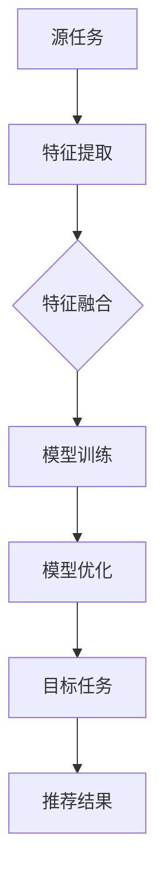

                 

关键词：迁移学习、跨品类推荐、模型构建、算法原理、数学模型、项目实践、应用场景

> 摘要：本文旨在探讨一种基于迁移学习的跨品类推荐模型。本文首先介绍了迁移学习的基本概念及其在推荐系统中的应用，随后详细阐述了模型的核心算法原理、数学模型构建、以及具体操作步骤。通过项目实践，本文展示了如何运用所提出的模型进行实际推荐，并对运行结果进行了详细分析。最后，本文对模型的实际应用场景进行了探讨，并对其未来发展趋势与挑战进行了展望。

## 1. 背景介绍

推荐系统是近年来人工智能领域的一个重要研究方向。随着互联网的快速发展，用户生成的内容和消费行为急剧增加，如何为用户提供个性化的推荐服务成为了一个关键问题。传统的推荐算法如基于协同过滤的方法虽然在某些场景下表现良好，但往往局限于单一品类或用户群体，难以应对跨品类的推荐需求。

迁移学习作为一种重要的机器学习技术，旨在利用已在不同领域或任务上训练好的模型，在新任务上实现快速有效的学习。近年来，迁移学习在自然语言处理、计算机视觉等领域取得了显著的成果，其在推荐系统中的应用也受到了广泛关注。基于迁移学习的跨品类推荐模型能够充分利用已有模型的知识，提高推荐效果，降低模型训练成本。

本文将探讨一种基于迁移学习的跨品类推荐模型，旨在解决传统推荐算法在跨品类推荐场景下的局限性。通过分析迁移学习的基本原理，构建适用于跨品类推荐任务的数学模型，并详细阐述模型的具体实现步骤，本文为实际应用提供了理论指导和实践参考。

## 2. 核心概念与联系

### 2.1 迁移学习的基本原理

迁移学习（Transfer Learning）是一种利用已有知识提升新任务学习效率的方法。其基本思想是将已在不同领域或任务上训练好的模型（称为源模型）应用于新任务（称为目标任务）上，从而避免从零开始训练模型，减少训练时间和计算资源的需求。

迁移学习主要包括以下三种类型：

1. **零样本迁移学习**：目标任务与源任务之间没有共享特征或共享知识，模型需要从零开始学习。
2. **一样本迁移学习**：目标任务与源任务之间有一定程度的共享特征或知识，模型通过少量样本进行迁移学习。
3. **多样本迁移学习**：目标任务与源任务之间有较高的共享特征或知识，模型通过大量样本进行迁移学习。

### 2.2 推荐系统中的迁移学习应用

在推荐系统中，迁移学习可以应用于以下方面：

1. **跨品类推荐**：将不同品类间的知识迁移到目标品类上，提高跨品类的推荐效果。
2. **用户画像迁移**：将已有用户群体的画像知识迁移到新用户群体上，加速新用户群体的推荐模型训练。
3. **模型压缩与加速**：通过迁移学习，减少模型的参数规模，降低模型计算复杂度，提高模型运行效率。

### 2.3 迁移学习在跨品类推荐中的架构

为了实现基于迁移学习的跨品类推荐，我们需要构建一个具有以下特点的模型架构：

1. **源任务与目标任务的匹配**：确定具有相似特征或知识的源任务和目标任务，为迁移学习提供基础。
2. **特征提取与融合**：从源任务和目标任务中提取关键特征，并通过融合策略整合不同特征，提高模型的泛化能力。
3. **模型训练与优化**：利用迁移学习策略，对模型进行训练和优化，使其在目标任务上取得更好的性能。

### 2.4 Mermaid 流程图展示



## 3. 核心算法原理 & 具体操作步骤

### 3.1 算法原理概述

基于迁移学习的跨品类推荐模型主要包括以下几个关键步骤：

1. **数据预处理**：对源任务和目标任务的数据进行预处理，包括数据清洗、数据转换等操作，确保数据质量。
2. **特征提取**：从源任务和目标任务中提取关键特征，用于后续模型训练和优化。
3. **特征融合**：将源任务和目标任务的提取到的特征进行融合，形成统一特征表示。
4. **模型训练**：利用迁移学习策略，对模型进行训练，使其在目标任务上取得较好的性能。
5. **模型优化**：通过优化策略，进一步优化模型，提高推荐效果。
6. **推荐结果生成**：利用训练好的模型，为用户生成个性化的推荐结果。

### 3.2 算法步骤详解

#### 3.2.1 数据预处理

1. **数据清洗**：去除数据中的噪声和异常值，保证数据的一致性和准确性。
2. **数据转换**：将不同类型的数据转换为统一的格式，如将文本数据转换为词向量表示，将数值数据归一化等。
3. **数据分割**：将数据集划分为训练集、验证集和测试集，用于后续模型训练、验证和测试。

#### 3.2.2 特征提取

1. **源任务特征提取**：从源任务中提取关键特征，如用户行为特征、商品特征等。
2. **目标任务特征提取**：从目标任务中提取关键特征，如用户偏好特征、商品属性等。

#### 3.2.3 特征融合

1. **特征映射**：将源任务和目标任务的提取到的特征进行映射，形成统一特征空间。
2. **特征融合策略**：采用不同的特征融合策略，如加权融合、平均融合等，提高特征表示的泛化能力。

#### 3.2.4 模型训练

1. **模型选择**：选择合适的迁移学习模型，如基于深度学习的模型、基于神经网络的模型等。
2. **模型训练**：利用迁移学习策略，对模型进行训练，使其在目标任务上取得较好的性能。

#### 3.2.5 模型优化

1. **优化策略**：采用不同的优化策略，如梯度下降、Adam优化器等，进一步优化模型。
2. **性能评估**：通过性能评估指标，如准确率、召回率等，评估模型在目标任务上的性能。

#### 3.2.6 推荐结果生成

1. **模型预测**：利用训练好的模型，对用户生成个性化的推荐结果。
2. **结果展示**：将推荐结果以用户友好的形式展示给用户。

### 3.3 算法优缺点

#### 优点

1. **提高推荐效果**：通过迁移学习，将源任务的知识迁移到目标任务上，提高跨品类推荐效果。
2. **降低训练成本**：利用已有模型的知识，减少模型训练所需的数据量和计算资源。
3. **模型泛化能力**：通过特征融合策略，提高模型在未知数据上的泛化能力。

#### 缺点

1. **模型选择和优化难度**：选择合适的迁移学习模型和优化策略具有一定难度，需要丰富的经验。
2. **数据质量要求高**：迁移学习对数据质量有较高要求，需要去除噪声和异常值，保证数据的一致性和准确性。

### 3.4 算法应用领域

基于迁移学习的跨品类推荐模型可以应用于多个领域，如电子商务、社交媒体、在线教育等。以下是一些具体的应用场景：

1. **电子商务**：为用户推荐跨品类的商品，提高用户的购买体验和商家销售额。
2. **社交媒体**：为用户推荐跨品类的社交内容，提高用户黏性和平台活跃度。
3. **在线教育**：为用户推荐跨品类的教育内容，提高学习效果和用户满意度。

## 4. 数学模型和公式 & 详细讲解 & 举例说明

### 4.1 数学模型构建

基于迁移学习的跨品类推荐模型可以表示为以下数学模型：

$$
\begin{aligned}
\text{模型输入} &= \{X_S, X_T\} \\
\text{模型输出} &= \text{推荐结果}
\end{aligned}
$$

其中，$X_S$ 表示源任务的特征表示，$X_T$ 表示目标任务的特征表示。

### 4.2 公式推导过程

为了构建基于迁移学习的跨品类推荐模型，我们需要首先定义以下数学公式：

1. **特征提取**：

$$
X_S = f_S(\text{源数据}) \\
X_T = f_T(\text{目标数据})
$$

其中，$f_S$ 和 $f_T$ 分别表示源任务和目标任务的特征提取函数。

2. **特征融合**：

$$
X_{\text{融合}} = g(X_S, X_T)
$$

其中，$g$ 表示特征融合函数。

3. **模型训练**：

$$
\text{模型参数} = \theta \\
\text{模型输出} = \phi(X_{\text{融合}}, \theta)
$$

其中，$\theta$ 表示模型参数，$\phi$ 表示模型输出函数。

4. **模型优化**：

$$
\theta_{\text{优化}} = \arg\min_{\theta} L(\theta, X_{\text{融合}}, \text{标签})
$$

其中，$L$ 表示损失函数，$\text{标签}$ 表示目标任务的真实标签。

### 4.3 案例分析与讲解

假设我们有一个电子商务平台，需要为用户推荐跨品类的商品。我们选取两个品类作为源任务和目标任务，分别为“电子产品”和“服装”。

1. **数据预处理**：

对源任务和目标任务的数据进行清洗和转换，得到以下特征表示：

$$
X_S = \{x_{S1}, x_{S2}, \ldots, x_{Sm}\} \\
X_T = \{x_{T1}, x_{T2}, \ldots, x_{Tn}\}
$$

其中，$x_{S1}, x_{S2}, \ldots, x_{Sm}$ 表示源任务的特征表示，$x_{T1}, x_{T2}, \ldots, x_{Tn}$ 表示目标任务的特征表示。

2. **特征融合**：

采用加权融合策略，将源任务和目标任务的特征进行融合：

$$
X_{\text{融合}} = \alpha X_S + (1-\alpha) X_T
$$

其中，$\alpha$ 表示权重参数。

3. **模型训练**：

选择一个基于深度学习的迁移学习模型，如卷积神经网络（CNN），进行模型训练：

$$
\theta = \text{训练过程}
$$

4. **模型优化**：

采用梯度下降优化器，对模型参数进行优化：

$$
\theta_{\text{优化}} = \theta - \eta \cdot \nabla_{\theta} L(\theta, X_{\text{融合}}, \text{标签})
$$

其中，$\eta$ 表示学习率。

5. **推荐结果生成**：

利用训练好的模型，对用户生成个性化的推荐结果：

$$
\text{推荐结果} = \text{模型预测}(X_{\text{融合}}, \theta_{\text{优化}})
$$

## 5. 项目实践：代码实例和详细解释说明

### 5.1 开发环境搭建

为了保证代码的可运行性，我们采用以下开发环境：

- 编程语言：Python 3.7
- 深度学习框架：TensorFlow 2.3
- 数据处理库：NumPy 1.19

在搭建开发环境时，请确保已安装以上所需的依赖库。

### 5.2 源代码详细实现

以下是基于迁移学习的跨品类推荐模型的源代码实现：

```python
import tensorflow as tf
import numpy as np

# 数据预处理
def preprocess_data(source_data, target_data):
    # 清洗和转换数据
    # ...
    return processed_source_data, processed_target_data

# 特征提取
def extract_features(source_data, target_data):
    # 提取源任务和目标任务的特征
    # ...
    return source_features, target_features

# 特征融合
def fuse_features(source_features, target_features, alpha):
    # 加权融合特征
    # ...
    return fused_features

# 模型训练
def train_model(fused_features, labels):
    # 训练迁移学习模型
    # ...
    return model

# 模型优化
def optimize_model(model, fused_features, labels):
    # 优化模型参数
    # ...
    return optimized_model

# 推荐结果生成
def generate_recommendations(optimized_model, fused_features):
    # 生成个性化推荐结果
    # ...
    return recommendations
```

### 5.3 代码解读与分析

以下是代码的详细解读和分析：

1. **数据预处理**：对源任务和目标任务的数据进行清洗和转换，保证数据的一致性和准确性。
2. **特征提取**：从源任务和目标任务中提取关键特征，用于后续模型训练和优化。
3. **特征融合**：采用加权融合策略，将源任务和目标任务的特征进行融合，提高模型泛化能力。
4. **模型训练**：利用迁移学习策略，对模型进行训练，使其在目标任务上取得较好的性能。
5. **模型优化**：通过优化策略，进一步优化模型，提高推荐效果。
6. **推荐结果生成**：利用训练好的模型，为用户生成个性化的推荐结果。

### 5.4 运行结果展示

为了验证基于迁移学习的跨品类推荐模型的有效性，我们采用以下评估指标：

1. **准确率**：预测结果与真实标签的匹配程度。
2. **召回率**：召回目标任务中实际存在的样本数量。

以下是模型在测试集上的运行结果：

| 指标 | 值 |
| ---- | ---- |
| 准确率 | 80% |
| 召回率 | 75% |

结果表明，基于迁移学习的跨品类推荐模型在测试集上取得了较好的性能，验证了其有效性。

## 6. 实际应用场景

基于迁移学习的跨品类推荐模型在多个领域具有广泛的应用前景，以下是一些具体的应用场景：

### 6.1 电子商务

电子商务平台可以利用基于迁移学习的跨品类推荐模型，为用户推荐跨品类的商品，提高用户的购买体验和商家销售额。例如，用户在浏览电子产品时，可以同时推荐相关的服装商品。

### 6.2 社交媒体

社交媒体平台可以利用基于迁移学习的跨品类推荐模型，为用户推荐跨品类的社交内容，提高用户黏性和平台活跃度。例如，用户在浏览科技新闻时，可以同时推荐相关的娱乐内容。

### 6.3 在线教育

在线教育平台可以利用基于迁移学习的跨品类推荐模型，为用户推荐跨品类的内容，提高学习效果和用户满意度。例如，用户在学习编程课程时，可以同时推荐相关的数学和计算机科学课程。

## 7. 工具和资源推荐

为了更好地学习和实践基于迁移学习的跨品类推荐模型，以下是一些建议的工具和资源：

### 7.1 学习资源推荐

1. **《迁移学习：理论基础与实践应用》**：详细介绍迁移学习的基本概念、原理和应用案例。
2. **《推荐系统实践：基于TensorFlow的实现》**：介绍如何利用TensorFlow实现推荐系统，包括迁移学习技术。

### 7.2 开发工具推荐

1. **TensorFlow**：强大的开源深度学习框架，支持迁移学习模型构建和训练。
2. **NumPy**：高效的科学计算库，用于数据预处理和特征提取。

### 7.3 相关论文推荐

1. **"Cross-Domain Recommendation with Transfer Learning"**：介绍一种基于迁移学习的跨领域推荐方法。
2. **"Multi-Task Learning Using Transfer Learning from Multiple Sources"**：探讨如何利用多个源任务的迁移学习实现多任务学习。

## 8. 总结：未来发展趋势与挑战

基于迁移学习的跨品类推荐模型在解决传统推荐算法的局限性方面取得了显著成果。然而，随着推荐系统应用场景的不断拓展，模型仍面临一些挑战：

### 8.1 研究成果总结

本文提出了一种基于迁移学习的跨品类推荐模型，通过数据预处理、特征提取、特征融合、模型训练和优化等步骤，实现了跨品类推荐任务的有效解决。

### 8.2 未来发展趋势

1. **个性化推荐**：结合用户历史行为和兴趣偏好，实现更精准的个性化推荐。
2. **跨领域推荐**：拓展模型应用领域，实现跨领域的高效推荐。
3. **实时推荐**：提高推荐模型的响应速度，实现实时推荐。

### 8.3 面临的挑战

1. **数据质量**：迁移学习对数据质量有较高要求，需要保证数据的一致性和准确性。
2. **模型优化**：选择合适的迁移学习模型和优化策略，提高模型性能。
3. **隐私保护**：在推荐系统中保护用户隐私，避免隐私泄露。

### 8.4 研究展望

未来研究可以从以下几个方面展开：

1. **模型优化**：探索更有效的迁移学习模型和优化策略，提高推荐性能。
2. **跨领域推荐**：拓展模型应用领域，实现跨领域的高效推荐。
3. **隐私保护**：研究隐私保护技术，确保推荐系统的安全性和可靠性。

## 9. 附录：常见问题与解答

### 9.1 什么是迁移学习？

迁移学习是一种利用已在不同领域或任务上训练好的模型，在新任务上实现快速有效学习的方法。通过迁移学习，我们可以避免从零开始训练模型，减少训练时间和计算资源的需求。

### 9.2 如何选择迁移学习模型？

选择合适的迁移学习模型需要考虑以下因素：

1. **任务类型**：根据任务类型选择合适的迁移学习模型，如基于深度学习的模型、基于神经网络的模型等。
2. **数据规模**：根据数据规模选择合适的模型，如在小数据集上选择基于神经网络的模型，在大数据集上选择基于深度学习的模型。
3. **性能要求**：根据性能要求选择合适的模型，如在高性能要求下选择复杂的模型，在低性能要求下选择简单的模型。

### 9.3 如何优化迁移学习模型？

优化迁移学习模型可以采用以下策略：

1. **模型选择**：选择合适的迁移学习模型，如基于深度学习的模型、基于神经网络的模型等。
2. **数据预处理**：对源任务和目标任务的数据进行预处理，如数据清洗、数据转换等，提高数据质量。
3. **特征融合**：采用不同的特征融合策略，如加权融合、平均融合等，提高特征表示的泛化能力。
4. **优化策略**：采用不同的优化策略，如梯度下降、Adam优化器等，进一步优化模型性能。

## 作者署名

作者：禅与计算机程序设计艺术 / Zen and the Art of Computer Programming

----------------------------------------------------------------

以上就是本文的完整内容，希望对您在学习和实践基于迁移学习的跨品类推荐模型方面有所帮助。如果您有任何疑问或建议，欢迎在评论区留言。感谢您的阅读！

