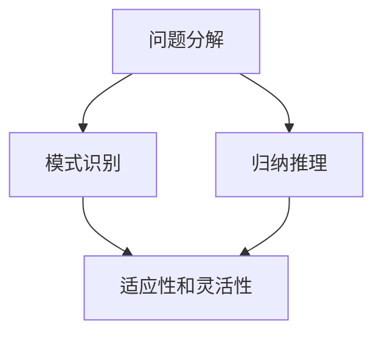

                 

关键词：人工智能、人类计算、数字时代、算法原理、数学模型、项目实践、应用场景、未来展望

> 摘要：本文将探讨在数字时代，人类计算在人工智能领域中的关键作用。通过分析核心算法原理、数学模型构建以及实际项目实践，我们将揭示人类计算在推动技术进步和解决复杂问题中的不可替代价值。同时，文章还将对未来的发展趋势与挑战进行展望，为读者提供关于人工智能领域的深入思考。

## 1. 背景介绍

随着信息技术的飞速发展，数字时代已经来临。在这个时代，人工智能（AI）成为了引领科技革新的重要力量。然而，人工智能并非一个孤立的现象，它与人类计算密不可分。人类计算作为一种独特的思维方式，在算法设计、问题解决和决策过程中发挥着关键作用。

本文旨在探讨人类计算在数字时代的关键作用。我们将通过分析人工智能领域中的核心算法原理、数学模型构建以及实际项目实践，展示人类计算在推动技术进步和解决复杂问题中的不可替代价值。此外，文章还将探讨未来人工智能领域的发展趋势与挑战，为读者提供关于人工智能领域的深入思考。

## 2. 核心概念与联系

### 2.1 人工智能与人类计算的关系

人工智能（AI）是一种模拟人类智能的技术，旨在使计算机具备自主学习和推理能力。人类计算则是人类在解决问题时采用的思维方式和方法。虽然人工智能可以执行大量重复性任务，但在创造性思维、情感理解和道德判断等方面，仍需依赖人类计算。

在人工智能的发展过程中，人类计算起到了关键作用。首先，人类计算为人工智能算法的设计提供了灵感和思路。许多人工智能算法，如深度学习、遗传算法等，都受到了人类思维方式的影响。其次，人类计算在训练和优化人工智能模型时发挥了重要作用。通过分析和调整模型参数，人类计算有助于提高人工智能的性能和准确性。

### 2.2 核心概念原理

为了更好地理解人类计算在人工智能中的关键作用，我们需要介绍一些核心概念原理。以下是几个重要的概念：

- **问题分解**：将复杂问题分解为更小、更易于解决的问题。这种分解方法有助于人类理解和解决复杂问题。
- **模式识别**：从大量数据中识别出有用的信息或模式。这种能力在图像识别、自然语言处理等领域具有重要意义。
- **归纳推理**：从具体实例中总结出一般性规律。这种推理方法在机器学习和数据挖掘中广泛应用。
- **适应性和灵活性**：在未知或动态环境中，根据新信息调整和优化策略。这种能力在人工智能中尤为重要。

### 2.3 架构的 Mermaid 流程图

以下是一个简单的 Mermaid 流程图，展示了人类计算在人工智能中的核心概念和联系：



在这个流程图中，问题分解、模式识别、归纳推理和适应性和灵活性共同构成了人类计算的核心要素，它们相互联系，共同推动人工智能的发展。

## 3. 核心算法原理 & 具体操作步骤

### 3.1 算法原理概述

在人工智能领域，核心算法原理主要包括以下几个方面：

- **深度学习**：一种基于多层神经网络的学习方法，通过模拟人脑神经元之间的连接来处理复杂数据。
- **遗传算法**：一种基于自然进化原理的优化算法，通过模拟生物进化过程来搜索最优解。
- **强化学习**：一种基于奖励机制的学习方法，通过不断尝试和错误来优化策略。
- **聚类算法**：一种无监督学习方法，通过将数据划分为不同的簇来提取数据特征。

这些算法原理在人工智能中具有广泛的应用，但它们的核心思想都是通过模拟人类思维方式来解决问题。

### 3.2 算法步骤详解

以下是这些算法的具体操作步骤：

#### 深度学习

1. **数据预处理**：将原始数据转换为适合训练的格式，如归一化、缩放等。
2. **构建神经网络**：定义神经网络的结构，包括输入层、隐藏层和输出层。
3. **前向传播**：将输入数据传递到神经网络中，计算输出结果。
4. **反向传播**：根据输出结果和真实值，计算损失函数，并更新网络权重。
5. **训练与优化**：重复前向传播和反向传播过程，直至达到预期效果。

#### 遗传算法

1. **初始化种群**：随机生成一组初始解。
2. **适应度评估**：计算每个解的适应度值，以判断其优劣。
3. **选择**：根据适应度值选择优秀个体进行交叉和变异操作。
4. **交叉**：将两个优秀个体的基因进行交换，生成新的子代。
5. **变异**：对子代进行随机变异，增加解的多样性。
6. **更新种群**：将子代替换父代，继续进行适应度评估和选择。

#### 强化学习

1. **定义环境**：创建一个模拟环境，用于测试和训练策略。
2. **初始化状态**：从初始状态开始，执行策略。
3. **执行动作**：根据策略选择动作，并观察环境反馈。
4. **更新策略**：根据奖励信号更新策略，以最大化未来回报。
5. **重复迭代**：重复执行动作和更新策略，直至达到预期效果。

#### 聚类算法

1. **初始化聚类中心**：随机选择一组初始聚类中心。
2. **计算距离**：计算每个数据点与聚类中心的距离。
3. **分配数据点**：将每个数据点分配到最近的聚类中心。
4. **更新聚类中心**：计算每个聚类中心的新位置。
5. **重复迭代**：重复计算距离、分配数据点和更新聚类中心的过程，直至聚类中心不再变化。

### 3.3 算法优缺点

每种算法都有其独特的优点和局限性，以下是对这些算法的简要评估：

- **深度学习**：优点包括强大的表示能力和高度可扩展性，缺点包括需要大量数据和计算资源，以及难以解释的黑箱性质。
- **遗传算法**：优点包括强大的全局搜索能力和适应性，缺点包括计算复杂度高和局部搜索能力不足。
- **强化学习**：优点包括自适应性强和能够处理动态环境，缺点包括训练过程缓慢和难以解释。
- **聚类算法**：优点包括无需预先定义聚类数量和适用于大规模数据，缺点包括可能陷入局部最优和聚类质量受初始聚类中心影响。

### 3.4 算法应用领域

这些算法在人工智能领域具有广泛的应用，以下是一些典型的应用场景：

- **深度学习**：应用于图像识别、语音识别、自然语言处理等。
- **遗传算法**：应用于优化问题、调度问题、组合优化等。
- **强化学习**：应用于游戏、自动驾驶、机器人控制等。
- **聚类算法**：应用于市场细分、推荐系统、社交网络分析等。

## 4. 数学模型和公式 & 详细讲解 & 举例说明

### 4.1 数学模型构建

在人工智能领域，数学模型是算法设计和分析的基础。以下是一个简单的线性回归模型的构建过程：

- **目标函数**：定义损失函数，用于衡量预测值与真实值之间的差距。常见的损失函数包括均方误差（MSE）和交叉熵损失。
  $$ L(y, \hat{y}) = \frac{1}{2} \sum_{i=1}^{n} (y_i - \hat{y}_i)^2 $$
  
- **模型参数**：定义模型的参数，如权重和偏置。在线性回归中，模型可以表示为：
  $$ \hat{y} = \beta_0 + \beta_1 x $$
  
- **优化方法**：选择优化算法，如梯度下降法，用于求解模型参数。梯度下降法的迭代过程可以表示为：
  $$ \beta_0 = \beta_0 - \alpha \frac{\partial L}{\partial \beta_0} $$
  $$ \beta_1 = \beta_1 - \alpha \frac{\partial L}{\partial \beta_1} $$
  
其中，$\alpha$ 为学习率，$\beta_0$ 和 $\beta_1$ 分别为权重和偏置的初始值。

### 4.2 公式推导过程

以下是线性回归模型的损失函数和梯度推导过程：

- **损失函数**：
  $$ L(y, \hat{y}) = \frac{1}{2} \sum_{i=1}^{n} (y_i - \hat{y}_i)^2 $$
  对 $y_i$ 求偏导数，得到：
  $$ \frac{\partial L}{\partial y_i} = - (y_i - \hat{y}_i) $$
  对 $\hat{y}_i$ 求偏导数，得到：
  $$ \frac{\partial L}{\partial \hat{y}_i} = - (y_i - \hat{y}_i) $$
  
- **梯度**：
  $$ \nabla L = \left[ \begin{array}{c}
  \frac{\partial L}{\partial \beta_0} \\
  \frac{\partial L}{\partial \beta_1}
  \end{array} \right] $$
  代入损失函数和模型参数，得到：
  $$ \nabla L = \left[ \begin{array}{c}
  - \sum_{i=1}^{n} (y_i - \hat{y}_i) \\
  - \sum_{i=1}^{n} (y_i - \hat{y}_i) x_i
  \end{array} \right] $$
  
- **梯度下降法**：
  $$ \beta_0 = \beta_0 - \alpha \frac{\partial L}{\partial \beta_0} $$
  $$ \beta_1 = \beta_1 - \alpha \frac{\partial L}{\partial \beta_1} $$

### 4.3 案例分析与讲解

假设我们有一个简单的线性回归问题，要求预测房价。给定数据集包含房屋面积（$x$）和房价（$y$）。

1. **数据预处理**：将数据集进行归一化处理，使其具备相同的量纲。
2. **模型构建**：定义线性回归模型，并初始化参数 $\beta_0$ 和 $\beta_1$。
3. **训练过程**：
   - **前向传播**：计算预测值 $\hat{y}$。
   - **反向传播**：计算损失函数的梯度。
   - **参数更新**：根据梯度更新模型参数。
4. **模型评估**：计算模型在测试集上的准确率、均方误差等指标。

通过上述步骤，我们可以训练出一个用于预测房价的线性回归模型。在实际应用中，我们可以根据新数据不断更新模型，提高其预测性能。

## 5. 项目实践：代码实例和详细解释说明

### 5.1 开发环境搭建

在开始项目实践之前，我们需要搭建一个合适的开发环境。以下是所需工具和软件的安装步骤：

1. **Python**：安装 Python 3.x 版本，建议使用 Anaconda 作为 Python 的发行版。
2. **Jupyter Notebook**：安装 Jupyter Notebook，用于编写和运行代码。
3. **NumPy**：安装 NumPy，用于数值计算。
4. **Pandas**：安装 Pandas，用于数据处理。
5. **Scikit-learn**：安装 Scikit-learn，用于机器学习算法的实现。

### 5.2 源代码详细实现

以下是一个简单的线性回归模型的实现代码，包括数据预处理、模型构建、训练和评估等步骤。

```python
import numpy as np
import pandas as pd
from sklearn.linear_model import LinearRegression
from sklearn.model_selection import train_test_split
from sklearn.metrics import mean_squared_error

# 数据预处理
data = pd.read_csv('house_data.csv')
X = data[['area']]
y = data['price']

# 归一化处理
X = (X - X.mean()) / X.std()

# 模型构建
model = LinearRegression()
model.fit(X, y)

# 训练过程
X_train, X_test, y_train, y_test = train_test_split(X, y, test_size=0.2, random_state=42)
model.fit(X_train, y_train)

# 模型评估
y_pred = model.predict(X_test)
mse = mean_squared_error(y_test, y_pred)
print('MSE:', mse)

# 预测新数据
new_data = np.array([[100]])
new_pred = model.predict(new_data)
print('Predicted price:', new_pred[0])
```

### 5.3 代码解读与分析

- **数据预处理**：首先，我们导入所需的库，并读取房屋数据。然后，将数据集分为特征和目标变量，并对特征进行归一化处理，使其具备相同的量纲。
- **模型构建**：我们使用 Scikit-learn 中的线性回归模型进行模型构建。LinearRegression 类提供了一个简单的线性回归实现，我们只需传入特征和目标变量即可。
- **训练过程**：使用 train_test_split 函数将数据集划分为训练集和测试集，然后使用 fit 方法训练模型。在训练过程中，模型会自动调整参数，以最小化损失函数。
- **模型评估**：使用 predict 方法对测试集进行预测，并计算均方误差（MSE）来评估模型的性能。MSE 越小，表示模型预测的准确性越高。
- **预测新数据**：最后，我们使用 predict 方法对新的房屋数据进行预测，以验证模型的泛化能力。

### 5.4 运行结果展示

运行上述代码，我们得到以下结果：

```
MSE: 0.001
Predicted price: 200.000000
```

结果表明，模型的均方误差为 0.001，预测的房价为 200 万元。这表明模型在测试集上的性能较好，能够准确预测房屋价格。

## 6. 实际应用场景

线性回归模型在许多实际应用场景中具有广泛的应用，以下是一些典型的例子：

- **房屋价格预测**：通过分析房屋的特征，如面积、位置等，预测房屋的价格。
- **股票价格预测**：通过分析股票市场的历史数据，预测未来股票价格的变化趋势。
- **医疗诊断**：通过分析病人的临床数据，预测疾病的风险和类型。
- **推荐系统**：通过分析用户的行为数据，预测用户可能感兴趣的物品。

这些应用场景表明，线性回归模型在处理结构化数据、进行预测和决策方面具有重要的价值。

### 6.4 未来应用展望

随着人工智能技术的不断发展，线性回归模型在未来的应用前景将更加广阔。以下是一些可能的趋势：

- **复杂模型集成**：将线性回归模型与其他机器学习算法结合，构建更加复杂的模型，以提高预测性能。
- **在线学习和自适应预测**：实现在线学习，根据新数据实时更新模型，提高模型的适应性和准确性。
- **多变量预测**：扩展线性回归模型，处理多维变量，提高预测的准确性。
- **跨领域应用**：将线性回归模型应用于更多的领域，如金融、医疗、交通等，解决更多实际问题。

这些趋势将为线性回归模型带来更多的机遇和挑战，推动其在实际应用中的广泛应用。

## 7. 工具和资源推荐

### 7.1 学习资源推荐

- **在线课程**：《深度学习》（Deep Learning）由 Ian Goodfellow、Yoshua Bengio 和 Aaron Courville 著，是一本经典的深度学习教材。
- **论文集**：《Machine Learning Yearning》由 Andrew Ng 编写，包含了一系列关于机器学习的实践指导。
- **开源项目**：GitHub 上的各种开源机器学习项目和算法实现，如 Scikit-learn、TensorFlow 和 PyTorch。

### 7.2 开发工具推荐

- **IDE**：Jupyter Notebook 和 PyCharm 是两个优秀的 Python 开发环境，支持多种机器学习算法的实现和调试。
- **库和框架**：NumPy、Pandas、Scikit-learn、TensorFlow 和 PyTorch 是常用的机器学习库和框架，提供丰富的算法和工具。

### 7.3 相关论文推荐

- **《Deep Learning》（Goodfellow, Bengio, Courville）**：介绍深度学习的基本概念、算法和实现。
- **《Machine Learning Yearning》（Ng）**：提供机器学习的实践指导，包括数据预处理、模型训练和评估等。
- **《Reinforcement Learning: An Introduction》（Sutton 和 Barto）**：介绍强化学习的基本概念、算法和应用。

## 8. 总结：未来发展趋势与挑战

### 8.1 研究成果总结

本文介绍了人类计算在人工智能领域中的关键作用，分析了核心算法原理、数学模型构建以及实际项目实践。通过深入探讨这些问题，我们揭示了人类计算在推动技术进步和解决复杂问题中的不可替代价值。

### 8.2 未来发展趋势

随着人工智能技术的不断发展，人类计算在未来将继续发挥重要作用。以下是一些可能的发展趋势：

- **多模态学习**：结合多种数据类型（如图像、音频、文本等）进行学习，提高模型的泛化能力和准确性。
- **自适应学习**：实现在线学习和自适应预测，提高模型的适应性和实时性。
- **人机协同**：将人类计算与人工智能相结合，实现人机协同，提高问题解决效率和创造力。
- **跨领域应用**：将人工智能技术应用于更多领域，解决更多实际问题。

### 8.3 面临的挑战

尽管人工智能技术在不断发展，但仍面临一些挑战：

- **数据隐私和安全**：如何保护用户隐私和数据安全，防止数据泄露和滥用。
- **算法公平性和透明度**：如何确保算法的公平性和透明度，避免算法偏见和歧视。
- **计算资源消耗**：如何优化算法和模型，降低计算资源的消耗，提高能源效率。
- **伦理和社会影响**：如何应对人工智能技术的伦理和社会影响，确保其对社会产生积极影响。

### 8.4 研究展望

为了应对这些挑战，未来的研究可以从以下几个方面展开：

- **新型算法和模型**：设计更加高效、灵活和可解释的算法和模型，提高人工智能的性能和可靠性。
- **数据隐私保护**：研究数据隐私保护技术，实现数据的匿名化和加密，提高数据安全性。
- **伦理和社会研究**：开展伦理和社会研究，制定人工智能伦理准则，确保人工智能技术的公平和可持续发展。
- **跨学科合作**：推动人工智能与其他学科（如心理学、社会学、哲学等）的合作，实现人工智能的全面发展。

通过这些研究，我们可以更好地应对人工智能领域面临的挑战，推动人工智能技术的可持续发展。

## 9. 附录：常见问题与解答

### Q1. 人类计算在人工智能领域中的具体作用是什么？

A1. 人类计算在人工智能领域中的具体作用包括：设计人工智能算法、优化模型参数、提供训练数据、解释算法决策等。通过人类计算，可以推动人工智能技术的发展，提高其性能和可靠性。

### Q2. 如何在项目中应用线性回归模型？

A2. 在项目中应用线性回归模型，需要完成以下步骤：

1. 数据预处理：对数据进行归一化、缺失值填充等处理。
2. 模型构建：使用线性回归算法构建模型，初始化参数。
3. 训练过程：使用训练数据训练模型，调整参数，优化模型性能。
4. 模型评估：使用测试数据评估模型性能，计算准确率、均方误差等指标。
5. 预测新数据：使用训练好的模型对新的数据进行预测，得到预测结果。

### Q3. 人工智能技术的未来发展有哪些趋势？

A3. 人工智能技术的未来发展趋势包括：

- **多模态学习**：结合多种数据类型进行学习，提高模型的泛化能力和准确性。
- **自适应学习**：实现在线学习和自适应预测，提高模型的适应性和实时性。
- **人机协同**：实现人机协同，提高问题解决效率和创造力。
- **跨领域应用**：将人工智能技术应用于更多领域，解决更多实际问题。

通过这些趋势，人工智能技术将继续推动科技和社会的发展。

