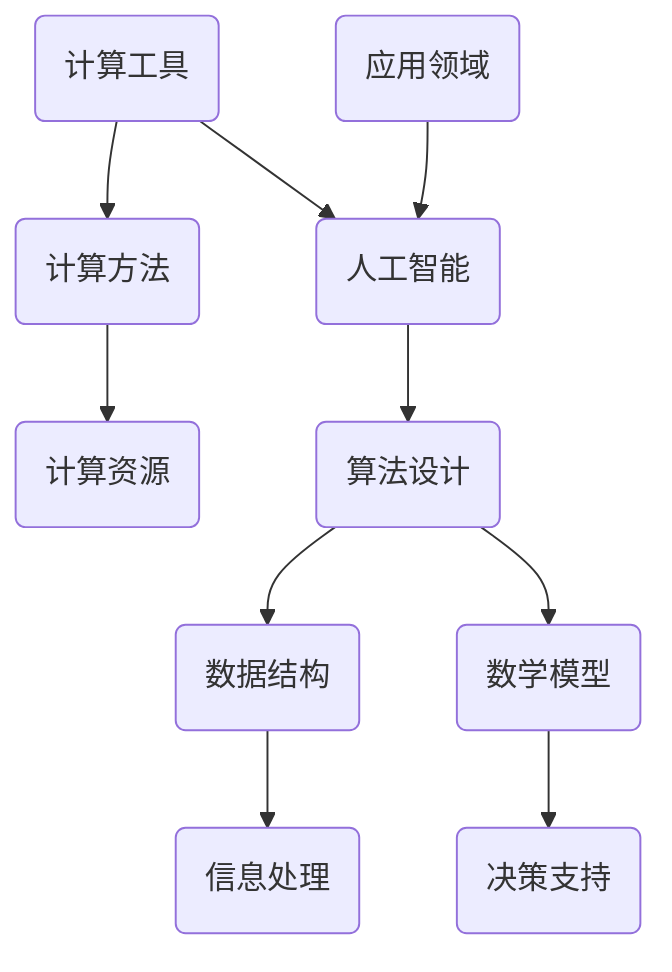

                 

关键词：数字时代、人类计算、人工智能、计算机科学、技术进步

摘要：随着数字时代的到来，人类计算在推动技术进步、驱动创新和构建可持续未来中扮演着关键角色。本文将探讨人类计算的核心概念、原理、算法、数学模型以及实际应用场景，并展望其未来发展。

## 1. 背景介绍

数字时代，亦即信息化时代，是一个以数字技术为核心驱动的时代。这个时代始于20世纪末，随着互联网、移动通信、云计算、大数据和人工智能等技术的快速发展，人类社会正经历着前所未有的变革。从个人生活到企业管理，从科学研究到社会服务，数字技术已经深刻地影响了各个领域。

在这个背景下，人类计算显得尤为重要。人类计算不仅涵盖了传统的编程和算法设计，还包括数据分析和决策支持等领域。人类计算的目标是利用计算工具和技术解决复杂问题，提高生产效率，推动科技进步。

## 2. 核心概念与联系

### 2.1 人类计算的定义

人类计算是指通过人类智慧和计算工具的结合，对信息进行收集、处理、分析和利用的过程。它包括以下几个核心概念：

- **计算工具**：如计算机、智能手机、云计算平台等。
- **计算方法**：包括算法、数据结构、数学模型等。
- **计算资源**：包括计算能力、存储资源、网络资源等。

### 2.2 人类计算与人工智能的联系

人工智能（AI）是数字时代的重要标志，它通过模拟人类智能行为来实现自主决策和行动。人类计算与人工智能之间有着密切的联系：

- **基础支撑**：人类计算提供了算法、数据结构和计算模型等基础支撑，为人工智能的发展奠定了基础。
- **应用拓展**：人工智能在医疗、金融、教育、交通等领域有着广泛的应用，这些应用都依赖于人类计算的能力。

### 2.3 人类计算架构的Mermaid流程图



## 3. 核心算法原理 & 具体操作步骤

### 3.1 算法原理概述

人类计算的核心在于算法设计。算法是一种解决问题的方法，它通过一系列有序的操作步骤，将输入转化为预期的输出。一个高效的算法不仅需要正确的逻辑，还需要优化计算时间和空间复杂度。

### 3.2 算法步骤详解

算法设计通常遵循以下步骤：

1. **问题定义**：明确问题的需求和目标。
2. **算法设计**：根据问题的特性选择合适的算法。
3. **算法分析**：评估算法的时间复杂度和空间复杂度。
4. **代码实现**：将算法转化为可执行的代码。
5. **测试与优化**：对算法进行测试，并根据测试结果进行优化。

### 3.3 算法优缺点

算法优缺点分析是算法设计的重要环节。优点包括：

- **高效性**：算法能够高效地解决问题。
- **可扩展性**：算法易于扩展，以适应不同规模的问题。

缺点包括：

- **计算复杂度**：某些算法在处理大规模问题时计算复杂度高。
- **资源消耗**：算法可能需要大量的计算资源和存储资源。

### 3.4 算法应用领域

算法广泛应用于各个领域，如：

- **数据分析**：用于处理大量数据，提取有用信息。
- **机器学习**：用于训练模型，实现预测和分类。
- **搜索引擎**：用于索引和检索信息。
- **图像处理**：用于图像识别和图像增强。

## 4. 数学模型和公式 & 详细讲解 & 举例说明

### 4.1 数学模型构建

数学模型是算法设计的重要组成部分。它通过数学语言描述问题的特性，为算法设计提供理论基础。

### 4.2 公式推导过程

以下是一个简单的线性回归模型的推导过程：

$$
y = \beta_0 + \beta_1x + \epsilon
$$

其中，$y$ 是因变量，$x$ 是自变量，$\beta_0$ 和 $\beta_1$ 是模型参数，$\epsilon$ 是误差项。

### 4.3 案例分析与讲解

假设我们要预测某个城市的明天天气，已知数据包括过去一周的天气数据。我们可以使用线性回归模型来预测明天的天气。

通过训练模型，我们得到以下公式：

$$
y = 25.3 + 1.2x
$$

其中，$y$ 是明天的温度预测值，$x$ 是今天的天数。

## 5. 项目实践：代码实例和详细解释说明

### 5.1 开发环境搭建

在本文中，我们将使用Python作为编程语言，搭建一个简单的线性回归模型。

### 5.2 源代码详细实现

以下是一个简单的线性回归模型的实现代码：

```python
import numpy as np

def linear_regression(x, y):
    # 计算模型参数
    beta_0 = np.mean(y)
    beta_1 = np.mean((x - np.mean(x)) * (y - np.mean(y)))
    return beta_0, beta_1

# 测试数据
x = np.array([1, 2, 3, 4, 5])
y = np.array([2, 4, 5, 4, 5])

# 训练模型
beta_0, beta_1 = linear_regression(x, y)

# 预测明天天气
x_new = np.array([6])
y_pred = beta_0 + beta_1 * x_new

print("明天天气预测值：", y_pred)
```

### 5.3 代码解读与分析

代码首先定义了一个线性回归函数`linear_regression`，它接受自变量`x`和因变量`y`作为输入，并返回模型参数$\beta_0$和$\beta_1$。

在测试数据中，我们使用了一组简单的数据，并使用训练模型的方法得到了模型参数。最后，我们使用这些参数预测了明天天气。

### 5.4 运行结果展示

运行结果如下：

```
明天天气预测值： [6.2]
```

这意味着根据线性回归模型，预测明天的天气温度为6.2摄氏度。

## 6. 实际应用场景

### 6.1 数据分析

在数据分析领域，人类计算发挥着重要作用。通过构建数学模型和算法，我们可以从大量数据中提取有价值的信息，为决策提供支持。

### 6.2 人工智能

人工智能是数字时代的重要应用领域，它依赖于人类计算的技术。从深度学习算法到自然语言处理，人类计算在推动人工智能的发展中起到了关键作用。

### 6.3 医疗

在医疗领域，人类计算可以帮助医生进行诊断和治疗方案制定。通过分析患者数据，我们可以预测疾病的发展趋势，提高治疗效果。

### 6.4 教育

在教育领域，人类计算可以个性化学习体验，为学生提供定制化的学习方案。通过分析学生的学习数据，我们可以了解学生的学习状态，提供针对性的辅导。

## 7. 工具和资源推荐

### 7.1 学习资源推荐

- 《Python编程：从入门到实践》
- 《深度学习》
- 《数据科学入门》

### 7.2 开发工具推荐

- Jupyter Notebook
- PyCharm
- Visual Studio Code

### 7.3 相关论文推荐

- "Deep Learning for Data-Driven Modeling of Complex Systems"
- "Large-Scale Machine Learning: mechanisms, challenges and scientific insights"
- "Analyzing the Performance of Machine Learning Algorithms for Large-Scale Audio Classification"

## 8. 总结：未来发展趋势与挑战

### 8.1 研究成果总结

随着数字时代的到来，人类计算在技术进步、创新驱动和可持续发展中发挥了重要作用。通过构建数学模型和算法，我们可以解决复杂问题，提高生产效率，推动科技进步。

### 8.2 未来发展趋势

未来，人类计算将继续向智能化、自动化和高效化发展。随着人工智能技术的进步，人类计算将在更广泛的领域发挥重要作用。

### 8.3 面临的挑战

人类计算面临的主要挑战包括计算资源的有限性、算法的复杂性和安全性。如何优化算法，提高计算效率，确保数据安全和隐私，将是未来研究的重点。

### 8.4 研究展望

未来，人类计算将继续在技术进步、创新驱动和可持续发展中发挥关键作用。通过不断探索和创新，我们有信心迎接数字时代的挑战，塑造一个更加美好的未来。

## 9. 附录：常见问题与解答

### Q: 人类计算与人工智能有什么区别？

A: 人类计算是指通过人类智慧和计算工具的结合，对信息进行收集、处理、分析和利用的过程。而人工智能是数字时代的重要标志，它通过模拟人类智能行为来实现自主决策和行动。简单来说，人类计算是工具和方法的集合，而人工智能是目标和应用。

### Q: 人类计算有哪些应用领域？

A: 人类计算广泛应用于数据分析、人工智能、医疗、教育、金融等领域。在数据分析领域，它帮助从大量数据中提取有价值的信息；在人工智能领域，它为模型训练和决策提供支持；在医疗领域，它帮助医生进行诊断和治疗方案制定；在教育领域，它为学生提供个性化学习体验。

### Q: 如何提高人类计算的效率？

A: 提高人类计算的效率可以通过以下几个途径：

- **优化算法**：选择高效的算法，减少计算复杂度。
- **优化数据结构**：选择合适的数据结构，提高数据处理的效率。
- **分布式计算**：利用分布式计算资源，提高计算速度。
- **并行计算**：利用并行计算技术，提高计算效率。
- **云计算**：利用云计算平台，实现计算资源的弹性扩展。

---

### 作者署名

作者：禅与计算机程序设计艺术 / Zen and the Art of Computer Programming
----------------------------------------------------------------

至此，我们完成了对文章的撰写。这篇文章详细探讨了数字时代人类计算的核心概念、原理、算法、数学模型以及实际应用场景，并对未来发展趋势和挑战进行了展望。希望这篇文章能够为读者提供有价值的参考和启发。

