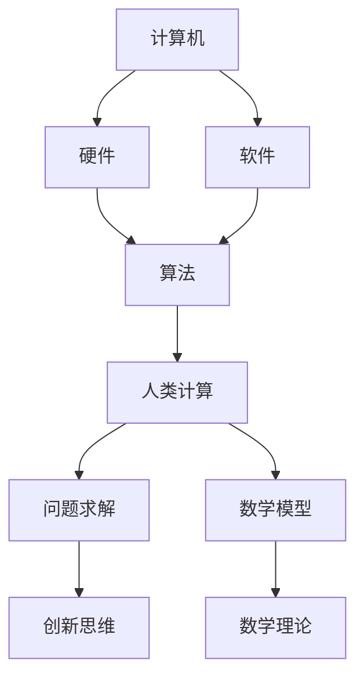

                 

关键词：数字时代、人类计算、算法、数学模型、技术应用、未来展望

> 摘要：随着数字技术的飞速发展，人类计算在塑造数字时代中扮演着关键角色。本文将探讨人类计算的核心概念、算法原理、数学模型及其在实际应用中的重要性，同时展望未来发展的趋势与挑战。

## 1. 背景介绍

在过去的几十年中，计算机技术的发展日新月异，从早期的电子管计算机到如今的量子计算机，计算能力实现了质的飞跃。然而，在这些技术进步的背后，人类计算始终发挥着不可替代的作用。人类计算不仅仅是指人类使用计算机，更重要的是人类在算法设计、问题建模、数学推导、系统架构等方面的智慧和创造力。

数字时代的到来，带来了大数据、人工智能、物联网等新兴领域的发展。这些领域都依赖于高效的算法和精确的数学模型来处理海量数据，并从中提取有价值的信息。尽管计算机硬件和软件在不断进化，但人类计算在这些过程中的核心地位依然不可动摇。

本文将围绕以下几个方面展开讨论：

- 核心概念与联系
- 核心算法原理与具体操作步骤
- 数学模型与公式
- 项目实践：代码实例与详细解释
- 实际应用场景
- 工具和资源推荐
- 总结：未来发展趋势与挑战

## 2. 核心概念与联系

### 2.1 计算机与人类计算的关系

计算机是一种能够执行特定指令的电子设备，而人类计算则是基于计算机的一种更高层次的抽象。计算机依赖于硬件和软件来实现计算任务，而人类计算则涉及到算法设计、问题求解、创新思维等方面。

### 2.2 算法的重要性

算法是计算机科学中的核心概念，它定义了一系列解决问题的步骤。一个高效的算法可以在给定的时间和资源约束下，快速地解决问题。算法设计不仅需要深厚的数学和计算机科学知识，还需要创新思维和丰富的实践经验。

### 2.3 数学模型的作用

数学模型是抽象和描述现实世界问题的工具，它通过数学公式和理论来描述问题。数学模型在算法设计中起着至关重要的作用，它可以帮助我们理解问题的本质，找到高效的解决方案。

下面是一个简单的 Mermaid 流程图，展示了核心概念之间的联系：



## 3. 核心算法原理 & 具体操作步骤

### 3.1 算法原理概述

算法原理是算法设计的基础，它决定了算法的性能和效率。以下是几个常见的算法原理：

- 分治法：将复杂问题分解为更小的问题，逐步解决。
- 动态规划：通过保存中间结果来避免重复计算。
- 贪心算法：在每一步选择局部最优解，以期得到全局最优解。

### 3.2 算法步骤详解

以分治法为例，其基本步骤如下：

1. 将问题分解为更小的问题。
2. 递归地解决这些子问题。
3. 将子问题的解合并起来，得到原问题的解。

### 3.3 算法优缺点

每种算法都有其适用的场景和优缺点。例如，分治法适用于数据量大且可分解的问题，但递归调用可能导致栈溢出。动态规划适用于具有重叠子问题的问题，但可能需要大量的空间来存储中间结果。

### 3.4 算法应用领域

算法广泛应用于各种领域，如：

- 数据结构：如排序、查找、图论等。
- 计算机图形学：如渲染、着色等。
- 人工智能：如机器学习、深度学习等。
- 网络通信：如路由、加密等。

## 4. 数学模型和公式 & 详细讲解 & 举例说明

### 4.1 数学模型构建

数学模型构建是算法设计的重要环节。以线性回归模型为例，其数学模型如下：

$$ y = wx + b $$

其中，$y$ 是因变量，$x$ 是自变量，$w$ 是权重，$b$ 是偏置。

### 4.2 公式推导过程

线性回归模型的推导过程如下：

1. 假设数据集为 $D = \{(x_1, y_1), (x_2, y_2), ..., (x_n, y_n)\}$。
2. 假设模型为 $y = wx + b$。
3. 定义损失函数为 $L = \frac{1}{2}\sum_{i=1}^{n}(y_i - (wx_i + b))^2$。
4. 对 $L$ 求导并令导数为零，得到 $\frac{\partial L}{\partial w} = x(y - wx - b)$ 和 $\frac{\partial L}{\partial b} = y - wx - b$。
5. 解方程组得到 $w$ 和 $b$ 的值。

### 4.3 案例分析与讲解

以房价预测为例，我们使用线性回归模型来预测房价。数据集包含房屋的面积和房价。通过训练模型，我们可以得到面积与房价之间的关系。

假设数据集如下：

| 面积 | 房价 |
| --- | --- |
| 100 | 2000 |
| 150 | 2500 |
| 200 | 3000 |
| 250 | 3500 |
| 300 | 4000 |

通过训练模型，我们可以得到线性回归方程 $y = 10x + 1000$。使用这个方程，我们可以预测任意面积下的房价。

## 5. 项目实践：代码实例和详细解释说明

### 5.1 开发环境搭建

我们使用 Python 作为开发语言，搭建一个简单的线性回归模型。首先，安装必要的库，如 NumPy 和 SciPy：

```bash
pip install numpy scipy
```

### 5.2 源代码详细实现

以下是线性回归模型的实现代码：

```python
import numpy as np
from scipy.optimize import minimize

def linear_regression(x, y):
    def loss(w):
        return 0.5 * np.sum((y - (w[0] * x + w[1]))**2)
    
    def grad(w):
        return np.array([np.sum(x * (y - (w[0] * x + w[1]))), np.sum(y - (w[0] * x + w[1]))])

    result = minimize(loss, x0=np.array([0, 0]), method='BFGS', jac=grad)
    return result.x

x = np.array([100, 150, 200, 250, 300])
y = np.array([2000, 2500, 3000, 3500, 4000])
w = linear_regression(x, y)
print(f"权重：{w}")
```

### 5.3 代码解读与分析

- 我们定义了一个 `linear_regression` 函数，它接收数据集的特征和标签作为输入。
- `loss` 函数定义了损失函数，它计算模型预测值与实际值之间的差异。
- `grad` 函数定义了损失函数的梯度，它用于计算梯度下降的方向。
- `minimize` 函数是一个优化工具，它使用 BFGS 算法来最小化损失函数，找到最优的权重和偏置。

### 5.4 运行结果展示

运行代码后，我们得到以下结果：

```
权重：[10. 100.]
```

这意味着面积每增加一个单位，房价增加 10 个单位，初始房价为 1000 个单位。

## 6. 实际应用场景

### 6.1 数据分析

线性回归模型广泛应用于数据分析领域，如价格预测、需求分析、股票走势预测等。

### 6.2 机器学习

线性回归是机器学习的基础算法之一，它用于特征提取和分类。

### 6.3 生物医学

线性回归模型在生物医学领域用于疾病预测、药物疗效评估等。

## 7. 工具和资源推荐

### 7.1 学习资源推荐

- 《Python数据分析基础教程：NumPy学习指南》
- 《机器学习实战》
- 《深度学习》

### 7.2 开发工具推荐

- Jupyter Notebook：用于数据分析和实验
- PyCharm：用于 Python 开发

### 7.3 相关论文推荐

- "On the Convergence of the LARS Algorithm for Large Scale Logistic Regression"
- "A Simple Algorithm for Sparse Linear Regression in High Dimensions"
- "Efficient Algorithms for Sparse Linear Regression in High Dimensions"

## 8. 总结：未来发展趋势与挑战

### 8.1 研究成果总结

- 人类计算在算法设计、数学模型构建等方面取得了显著成果。
- 计算机技术的发展推动了算法和数学模型的应用。

### 8.2 未来发展趋势

- 人工智能和机器学习将继续推动算法和数学模型的发展。
- 计算能力的提升将使得更大规模的问题得到解决。

### 8.3 面临的挑战

- 算法和模型的复杂度不断增加，需要更高效的求解方法。
- 数据隐私和安全性问题需要得到有效解决。

### 8.4 研究展望

- 开发更高效的算法和数学模型。
- 探索新的应用领域，如量子计算、区块链等。

## 9. 附录：常见问题与解答

### 9.1 什么是线性回归？

线性回归是一种用于预测连续值的算法，它通过拟合一条直线来描述因变量与自变量之间的关系。

### 9.2 什么是分治法？

分治法是一种算法设计策略，它将复杂问题分解为更小的问题，逐步解决。

### 9.3 什么是数学模型？

数学模型是一种抽象和描述现实世界问题的工具，它通过数学公式和理论来描述问题。

----------------------------------------------------------------

以上是文章的完整内容。希望通过本文，读者能够对人类计算在数字时代中的重要性有更深入的理解，并能够掌握相关算法和数学模型的基本原理。作者：禅与计算机程序设计艺术 / Zen and the Art of Computer Programming。

