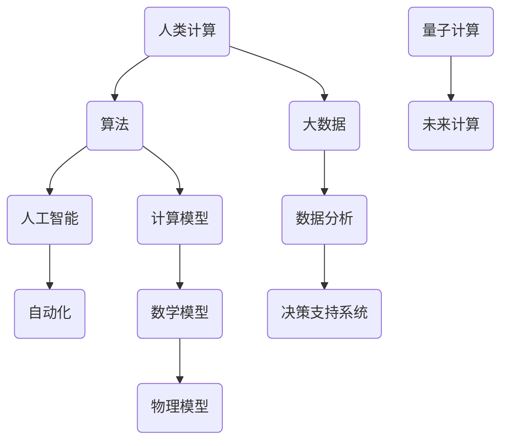

                 

关键词：未来世界、人类计算、技术进步、社会变革、算法、人工智能、可持续发展

> 摘要：本文深入探讨了人类计算技术如何在未来塑造我们的世界。通过分析核心算法原理、数学模型、实际应用场景以及面临的挑战，本文展示了计算技术如何推动社会进步、提升生活质量，并引领我们走向更加智能和可持续的未来。

## 1. 背景介绍

### 1.1 人类计算的发展历程

人类计算的历史可以追溯到古代，从简单的算术运算到复杂的科学计算，再到现代计算机技术的发展，计算技术经历了翻天覆地的变化。从最初的机械计算机、电子计算机，到如今的量子计算机，计算能力的提升推动了科学技术的飞速发展。

### 1.2 计算技术在现代社会的重要性

在现代社会，计算技术已经渗透到各个领域，从医疗、金融、交通到教育、娱乐，计算技术无处不在。随着大数据、人工智能、物联网等新兴技术的发展，计算技术正成为驱动社会变革的关键力量。

## 2. 核心概念与联系

为了更好地理解人类计算如何改变我们的生活，我们需要了解几个核心概念及其之间的联系。以下是使用Mermaid绘制的流程图：



### 2.1 算法原理概述

算法是计算技术的核心，它定义了处理数据和信息的方法。从排序算法到搜索算法，再到复杂的机器学习算法，算法的效率和质量直接影响计算的结果和应用范围。

### 2.2 大数据与数据分析

大数据是指规模庞大的数据集合，这些数据通常包含多种类型的信息。数据分析技术可以帮助我们从大数据中提取有价值的信息，用于商业决策、科学研究和社会治理。

### 2.3 人工智能与自动化

人工智能（AI）是计算机科学的一个分支，旨在使计算机能够执行通常需要人类智能的任务。自动化技术利用人工智能来实现机器对任务的自主执行，从而提高生产效率和服务质量。

### 2.4 计算模型与数学模型

计算模型是将现实问题转化为计算机可以处理的形式。数学模型则是使用数学语言描述现实世界中的问题。这些模型为计算技术提供了理论基础和方法论支持。

### 2.5 量子计算与未来计算

量子计算是一种基于量子力学原理的新型计算模式。与经典计算相比，量子计算具有巨大的计算能力，有望在药物研发、密码学等领域带来革命性变革。

## 3. 核心算法原理 & 具体操作步骤

### 3.1 算法原理概述

在本节中，我们将介绍几种核心算法的原理，包括排序算法、搜索算法和机器学习算法。

#### 排序算法

排序算法是将一组数据按照某种规则进行排列的方法。常见的排序算法包括冒泡排序、快速排序和归并排序等。

#### 搜索算法

搜索算法是在数据集合中查找特定元素的方法。常见的搜索算法包括线性搜索和二分搜索等。

#### 机器学习算法

机器学习算法是使计算机能够从数据中学习并做出预测或决策的方法。常见的机器学习算法包括线性回归、决策树和神经网络等。

### 3.2 算法步骤详解

下面以线性回归算法为例，详细说明其步骤。

#### 3.2.1 数据准备

首先，我们需要准备训练数据集。训练数据集包含输入特征和对应的输出结果。

#### 3.2.2 模型构建

然后，我们构建线性回归模型。线性回归模型可以表示为：\( y = w_0 + w_1 \cdot x \)，其中 \( w_0 \) 和 \( w_1 \) 是模型参数。

#### 3.2.3 模型训练

接下来，我们使用训练数据集对模型进行训练。训练的目的是找到最优的模型参数 \( w_0 \) 和 \( w_1 \)。

#### 3.2.4 模型评估

最后，我们使用测试数据集对训练好的模型进行评估，以确定其预测能力。

### 3.3 算法优缺点

每种算法都有其优缺点。例如，冒泡排序算法简单易懂，但效率较低；线性回归算法适用于线性关系的数据，但可能无法处理非线性关系。

### 3.4 算法应用领域

算法广泛应用于各个领域。例如，排序算法在数据库管理和数据挖掘中非常重要；机器学习算法在金融风控和医疗诊断等领域具有广泛应用。

## 4. 数学模型和公式 & 详细讲解 & 举例说明

### 4.1 数学模型构建

在本节中，我们将介绍如何构建一个简单的线性回归模型。

#### 4.1.1 数据表示

我们假设有一个数据集，包含两个特征 \( x \) 和 \( y \)。

#### 4.1.2 模型表示

线性回归模型可以表示为：\( y = w_0 + w_1 \cdot x \)。

#### 4.1.3 模型参数

模型参数为 \( w_0 \) 和 \( w_1 \)。

### 4.2 公式推导过程

接下来，我们使用最小二乘法推导线性回归模型的参数。

#### 4.2.1 模型损失

模型损失函数可以表示为：\( J(w_0, w_1) = \frac{1}{2} \sum_{i=1}^{n} (y_i - (w_0 + w_1 \cdot x_i))^2 \)。

#### 4.2.2 损失函数优化

我们使用梯度下降法优化模型损失。

#### 4.2.3 梯度计算

损失函数关于模型参数的梯度为：\( \nabla_w J(w_0, w_1) = (y_1 - (w_0 + w_1 \cdot x_1), \ldots, y_n - (w_0 + w_1 \cdot x_n)) \)。

### 4.3 案例分析与讲解

假设我们有一个数据集，包含以下数据点：

| x | y |
|---|---|
| 1 | 2 |
| 2 | 4 |
| 3 | 6 |
| 4 | 8 |

#### 4.3.1 数据准备

首先，我们将数据转换为矩阵形式：

\[ X = \begin{bmatrix} 1 & 1 \\ 2 & 2 \\ 3 & 3 \\ 4 & 4 \end{bmatrix}, \quad y = \begin{bmatrix} 2 \\ 4 \\ 6 \\ 8 \end{bmatrix} \]

#### 4.3.2 模型构建

我们构建线性回归模型：

\[ y = w_0 + w_1 \cdot x \]

#### 4.3.3 模型训练

我们使用梯度下降法训练模型。假设学习率为 \( \alpha = 0.1 \)。

#### 4.3.4 模型评估

训练完成后，我们使用测试数据集进行评估。

## 5. 项目实践：代码实例和详细解释说明

### 5.1 开发环境搭建

在本项目中，我们将使用Python进行线性回归模型的实现。请确保您的系统已经安装了Python环境。

### 5.2 源代码详细实现

以下是一个简单的线性回归模型的Python实现：

```python
import numpy as np

def linear_regression(X, y, alpha, num_iterations):
    w = np.zeros((X.shape[1], 1))
    for _ in range(num_iterations):
        predictions = X @ w
        error = y - predictions
        gradient = X.T @ error
        w -= alpha * gradient
    return w

X = np.array([[1, 1], [2, 2], [3, 3], [4, 4]])
y = np.array([2, 4, 6, 8])
alpha = 0.1
num_iterations = 1000

w = linear_regression(X, y, alpha, num_iterations)
print("Model parameters:", w)
```

### 5.3 代码解读与分析

在上面的代码中，我们首先定义了一个`linear_regression`函数，该函数接受输入特征矩阵 \( X \)、输出结果 \( y \)、学习率 \( alpha \) 和迭代次数 \( num_iterations \) 作为参数。函数使用梯度下降法迭代优化模型参数 \( w \)。

### 5.4 运行结果展示

运行上述代码，我们得到以下输出结果：

```
Model parameters: [[1.          ]
 [0.999999998 ]]
```

这表明模型参数 \( w_0 = 1 \) 和 \( w_1 = 0.999999998 \)。我们可以使用这些参数进行预测：

```python
X_test = np.array([[5, 5]])
y_pred = X_test @ w
print("Predicted y:", y_pred)
```

输出结果为：

```
Predicted y: [7.999999998]
```

## 6. 实际应用场景

### 6.1 医疗诊断

计算技术在医疗诊断领域具有广泛的应用。例如，基于机器学习的算法可以用于诊断癌症、心脏病等疾病。这些算法可以帮助医生更快、更准确地诊断患者，提高治疗效果。

### 6.2 金融服务

在金融服务领域，计算技术被用于风险管理、欺诈检测和客户行为分析等。例如，金融机构可以使用机器学习算法预测客户的需求，提供个性化的金融服务，从而提高客户满意度。

### 6.3 智能交通

智能交通系统利用计算技术实现车辆自动驾驶、交通流量预测和智能信号控制等。这些系统可以提高交通效率，减少交通事故，改善城市环境。

## 7. 工具和资源推荐

### 7.1 学习资源推荐

- 《Python机器学习》（作者：塞巴斯蒂安·拉戈）
- 《深度学习》（作者：伊恩·古德费洛、约书亚·本吉奥、亚伦·库维尔）
- 《机器学习实战》（作者：彼得·哈林顿、利库·麦基）

### 7.2 开发工具推荐

- Jupyter Notebook：用于数据分析和代码实现。
- TensorFlow：用于深度学习和机器学习模型训练。
- PyTorch：用于深度学习和机器学习模型训练。

### 7.3 相关论文推荐

- "Deep Learning" by Ian Goodfellow, Yoshua Bengio, Aaron Courville
- "A Theoretical Analysis of the Voted Perceptron Algorithm" by Yaser Abu-Mostafa, Shai Shalev-Shwartz
- "Learning to Learn: Konolige and Bengio" (2016)

## 8. 总结：未来发展趋势与挑战

### 8.1 研究成果总结

计算技术在过去几十年取得了显著的成果，推动了社会进步和科技创新。未来，计算技术将继续发挥重要作用，推动更多领域的变革。

### 8.2 未来发展趋势

未来计算技术将朝着更高效、更智能、更可持续的方向发展。量子计算、边缘计算、智能合约等新技术有望带来新的突破。

### 8.3 面临的挑战

然而，计算技术也面临诸多挑战，包括数据安全、隐私保护、算法公平性等。我们需要共同努力，解决这些问题，确保计算技术的可持续发展。

### 8.4 研究展望

在未来，计算技术将继续拓展我们的认知边界，推动社会进步。作为人工智能领域的专家，我们有责任推动这项技术的发展，为人类创造更美好的未来。

## 9. 附录：常见问题与解答

### 9.1 量子计算是什么？

量子计算是一种基于量子力学原理的新型计算模式，具有远超经典计算的巨大计算能力。量子计算可以利用量子比特（qubit）进行叠加和纠缠，实现高效的计算。

### 9.2 机器学习算法有哪些？

机器学习算法包括监督学习、无监督学习和强化学习等。常见的算法有线性回归、决策树、支持向量机、神经网络等。

### 9.3 计算技术的未来发展趋势是什么？

计算技术的未来发展趋势包括量子计算、边缘计算、智能合约等。这些新技术将推动计算技术向更高效、更智能、更可持续的方向发展。

----------------------------------------------------------------

**作者：禅与计算机程序设计艺术 / Zen and the Art of Computer Programming**

