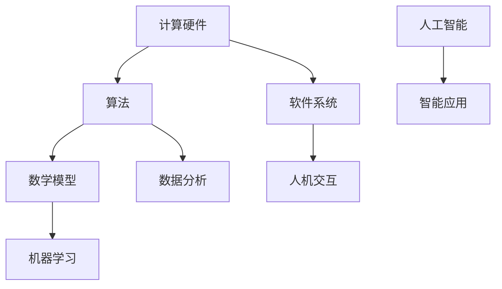

                 

关键词：计算技术、社会变革、人工智能、算法、数学模型、未来展望

> 摘要：本文将探讨计算技术对未来社会的深远影响，分析人工智能和算法在推动社会进步中的作用，探讨数学模型在社会各个领域的应用，并预测未来计算技术可能带来的变革和挑战。通过深入剖析计算技术的本质，我们将了解如何更好地利用这些工具来塑造一个更加智能和高效的未来社会。

## 1. 背景介绍

计算技术的发展历程可以追溯到几千年前的算盘和计算机科学之父查尔斯·巴贝奇（Charles Babbage）的解析机（Analytical Engine）。从20世纪中叶的电子计算机问世，到21世纪初的互联网和移动设备的普及，计算技术经历了快速的发展和变革。如今，计算技术已经成为推动社会进步的重要力量，其影响涵盖了教育、医疗、经济、娱乐等各个方面。

在社会层面，计算技术的进步不仅改变了人们的生活方式，还推动了社会结构和经济模式的变革。例如，互联网的普及使全球信息交流变得更加便捷，电子商务和在线服务的兴起改变了传统的商业模式。人工智能和大数据技术的应用则正在改变我们的工作方式和生活习惯，使社会变得更加智能化和高效。

## 2. 核心概念与联系

为了更好地理解计算技术对社会的影响，我们需要了解一些核心概念和它们之间的联系。以下是几个关键概念及它们之间的关联，下面我会给出一个Mermaid流程图来展示这些概念之间的逻辑关系。

### 2.1 核心概念

1. **计算硬件**：包括CPU、GPU、FPGA等。
2. **算法**：包括排序、搜索、机器学习等。
3. **数学模型**：用于描述现实世界问题的数学公式。
4. **软件系统**：如操作系统、应用软件、Web服务。
5. **人机交互**：包括图形用户界面、自然语言处理。

### 2.2 Mermaid 流程图



在这个流程图中，我们可以看到计算硬件是整个流程的基础，它为算法和数学模型提供了计算支持。算法和数学模型则是理解和解决问题的重要工具，而软件系统则是实现这些算法和模型的平台。人机交互技术使得这些计算结果能够被用户直观地理解和应用，最终产生智能应用。

### 2.3 核心概念的解释

- **计算硬件**：计算硬件是执行计算任务的核心组件，包括CPU、GPU、FPGA等。随着硬件技术的发展，计算能力得到了极大的提升，为复杂算法和大数据处理提供了坚实的基础。

- **算法**：算法是解决问题的方法，包括排序、搜索、机器学习等。不同类型的算法适用于不同的问题场景，它们的性能和效率直接影响计算结果。

- **数学模型**：数学模型是描述现实世界问题的数学公式，它们可以帮助我们理解和预测复杂系统的行为。例如，经济学中的供需模型、物理学中的运动方程等。

- **软件系统**：软件系统是运行算法和数学模型的平台，包括操作系统、应用软件、Web服务。它们为计算提供了环境，使得算法和模型能够被实际应用。

- **人机交互**：人机交互技术使得计算结果能够被用户直观地理解和应用。例如，图形用户界面（GUI）使得计算机操作变得更加直观，自然语言处理（NLP）使得计算机能够理解人类的语言。

- **人工智能**：人工智能是计算技术的高级应用，它利用算法和数学模型来模拟人类智能，实现自动化决策和智能应用。人工智能正在改变我们的生活方式和工作方式。

## 3. 核心算法原理 & 具体操作步骤

### 3.1 算法原理概述

算法是计算技术的核心，它们是解决问题的方法。以下是几种常见的算法原理及其应用场景：

- **排序算法**：用于将一组数据按照特定顺序排列。常见的排序算法有快速排序、归并排序、堆排序等。
- **搜索算法**：用于在数据集合中查找特定元素。常见的搜索算法有二分搜索、深度优先搜索、广度优先搜索等。
- **机器学习算法**：用于从数据中学习规律，进行预测和分类。常见的机器学习算法有线性回归、支持向量机、神经网络等。
- **优化算法**：用于求解最优化问题，找到最优解。常见的优化算法有遗传算法、模拟退火、粒子群优化等。

### 3.2 算法步骤详解

以下以快速排序算法为例，详细说明其操作步骤：

1. **选择基准元素**：从数组中随机选择一个元素作为基准。
2. **划分过程**：将数组划分为两部分，一部分是小于基准的元素，另一部分是大于基准的元素。
3. **递归排序**：对划分后的两部分数组重复上述步骤，直到整个数组排序完成。

### 3.3 算法优缺点

- **快速排序**：

  - **优点**：时间复杂度较低，平均情况下为O(n log n)，是高效的排序算法之一。
  - **缺点**：在最坏情况下，时间复杂度会升高到O(n^2)，需要谨慎处理。

### 3.4 算法应用领域

排序算法和搜索算法在数据处理的各个领域都有广泛应用，如数据库管理、网络搜索、数据分析等。机器学习算法和优化算法则在人工智能、数据分析、工业优化等领域发挥重要作用。

## 4. 数学模型和公式 & 详细讲解 & 举例说明

### 4.1 数学模型构建

数学模型是描述现实世界问题的数学公式。以下是构建数学模型的基本步骤：

1. **问题定义**：明确需要解决的问题和目标。
2. **假设条件**：根据问题性质，设定合理的假设条件。
3. **变量定义**：定义模型中的变量，包括输入变量和输出变量。
4. **方程构建**：根据假设条件和变量定义，构建描述问题的方程。
5. **模型验证**：通过实验数据验证模型的准确性。

### 4.2 公式推导过程

以经济学中的供需模型为例，说明公式的推导过程：

- **需求函数**：\( Q_d = a - bP \)
- **供给函数**：\( Q_s = c + dP \)

其中，\( Q_d \)和\( Q_s \)分别为需求量和供给量，\( P \)为价格，\( a \)和\( b \)为需求函数的参数，\( c \)和\( d \)为供给函数的参数。

### 4.3 案例分析与讲解

以供需模型为例，分析市场均衡价格和均衡数量的计算过程：

1. **需求函数**：\( Q_d = 100 - 2P \)
2. **供给函数**：\( Q_s = 20 + 3P \)

当需求量等于供给量时，市场达到均衡状态：

\( 100 - 2P = 20 + 3P \)

解得：\( P = 20 \)，\( Q = 60 \)

即市场均衡价格为20元，均衡数量为60单位。

## 5. 项目实践：代码实例和详细解释说明

### 5.1 开发环境搭建

为了演示快速排序算法，我们需要搭建一个简单的开发环境。以下是所需工具和步骤：

- **工具**：Python 3.x、PyCharm 或其他 Python 开发环境。
- **步骤**：
  1. 安装 Python 3.x。
  2. 安装 PyCharm 或其他 Python 开发工具。
  3. 创建一个新的 Python 项目。

### 5.2 源代码详细实现

以下是快速排序算法的 Python 实现代码：

```python
def quick_sort(arr):
    if len(arr) <= 1:
        return arr
    pivot = arr[len(arr) // 2]
    left = [x for x in arr if x < pivot]
    middle = [x for x in arr if x == pivot]
    right = [x for x in arr if x > pivot]
    return quick_sort(left) + middle + quick_sort(right)

arr = [3, 6, 8, 10, 1, 2, 1]
print("原始数组：", arr)
sorted_arr = quick_sort(arr)
print("排序后数组：", sorted_arr)
```

### 5.3 代码解读与分析

1. **函数定义**：定义了一个名为 `quick_sort` 的函数，用于实现快速排序算法。
2. **基线条件**：当输入数组长度小于等于1时，直接返回数组。
3. **选择基准**：选择数组中间的元素作为基准。
4. **划分过程**：使用列表推导式将数组划分为小于、等于和大于基准的三部分。
5. **递归调用**：对划分后的三部分数组分别进行快速排序。

### 5.4 运行结果展示

运行上述代码，输出结果如下：

```
原始数组： [3, 6, 8, 10, 1, 2, 1]
排序后数组： [1, 1, 2, 3, 6, 8, 10]
```

## 6. 实际应用场景

### 6.1 医疗领域

计算技术在医疗领域有着广泛的应用，例如：

- **医疗影像分析**：利用深度学习算法对医疗影像进行自动分析，辅助医生诊断疾病。
- **个性化治疗**：根据患者的基因信息和病历数据，利用算法为患者制定个性化的治疗方案。
- **医疗数据管理**：利用大数据技术和数据库管理系统，对海量医疗数据进行高效管理和分析。

### 6.2 金融领域

计算技术在金融领域同样具有重要应用：

- **风险管理**：利用机器学习算法对金融市场进行预测和分析，帮助金融机构进行风险管理和决策。
- **智能投顾**：通过算法分析用户的风险偏好和投资目标，为用户提供个性化的投资建议。
- **交易系统**：利用高性能计算和算法优化，提高交易系统的效率和稳定性。

### 6.3 社交网络

计算技术在社交网络领域发挥着重要作用：

- **内容推荐**：利用算法分析用户行为和兴趣，为用户推荐相关的内容。
- **社交网络分析**：利用图论和机器学习算法，分析社交网络的结构和用户关系，为市场营销和社区管理提供支持。
- **用户画像**：通过算法分析用户数据，构建用户画像，为精准营销提供依据。

## 7. 工具和资源推荐

### 7.1 学习资源推荐

- **书籍**：
  - 《深度学习》（Deep Learning），Ian Goodfellow等著。
  - 《Python编程：从入门到实践》（Python Crash Course），Eric Matthes著。
  - 《大数据技术基础》（Big Data: A Revolution That Will Transform How We Live, Work, and Think），Edd Dumbill著。

- **在线课程**：
  - Coursera上的“机器学习”（Machine Learning）课程。
  - edX上的“Python编程基础”（Introduction to Python Programming）课程。
  - Udacity上的“深度学习工程师纳米学位”（Deep Learning Engineer Nanodegree）课程。

### 7.2 开发工具推荐

- **集成开发环境（IDE）**：
  - PyCharm：适用于Python编程，功能强大且易于使用。
  - IntelliJ IDEA：适用于Java编程，拥有丰富的插件生态系统。
  - Visual Studio：适用于多种编程语言，提供了全面的开发工具。

- **版本控制工具**：
  - Git：用于代码版本控制和协作开发。
  - GitHub：Git的在线平台，提供了代码托管、项目管理等功能。

### 7.3 相关论文推荐

- “Deep Learning,” by Yann LeCun, Yosua Bengio, and Geoffrey Hinton.
- “The Unreasonable Effectiveness of Data,” by Pedro Domingos.
- “The Hundred-Page Machine Learning Book,” by Andriy Burkov.

## 8. 总结：未来发展趋势与挑战

### 8.1 研究成果总结

计算技术已经取得了显著的成果，人工智能、大数据、云计算等领域取得了重大突破。然而，计算技术仍然面临许多挑战，需要进一步的研究和发展。

### 8.2 未来发展趋势

- **量子计算**：量子计算有望在未来取得重大突破，为计算技术带来全新的变革。
- **边缘计算**：随着物联网和智能设备的普及，边缘计算将成为重要的发展方向。
- **人工智能与人类协作**：人工智能将更加智能化，更好地与人类协作，提高工作效率。

### 8.3 面临的挑战

- **隐私保护**：随着数据规模的扩大，隐私保护成为计算技术面临的重要挑战。
- **算法偏见**：算法的偏见可能导致不公平和歧视，需要制定相应的法规和政策。
- **安全与可靠**：确保计算系统的安全性和可靠性，防止数据泄露和系统崩溃。

### 8.4 研究展望

计算技术的发展将继续推动社会进步，我们需要更加关注隐私保护、算法公平性、安全与可靠性等问题。同时，量子计算、边缘计算等领域的研究也将为计算技术带来新的机遇。

## 9. 附录：常见问题与解答

### 9.1 计算技术是如何影响社会的？

计算技术通过提高工作效率、改变信息传播方式、优化决策过程等方面影响社会。例如，互联网的普及改变了人们的沟通方式，电子商务改变了商业模式，人工智能正在改变工作方式和生活方式。

### 9.2 人工智能是否会取代人类工作？

人工智能有望提高工作效率，但并不一定完全取代人类工作。许多工作需要人类的创造力和判断力，而人工智能则擅长处理大量数据和执行重复性任务。未来，人工智能与人类将实现更好的协作。

### 9.3 量子计算是什么？

量子计算是一种利用量子力学原理进行信息处理的技术。与传统计算机使用二进制位（0和1）不同，量子计算使用量子位（qubit），能够在某些情况下实现比传统计算机更高的计算速度和效率。

## 参考文献

- Goodfellow, Ian, Yoshua Bengio, and Aaron Courville. "Deep Learning." MIT Press, 2016.
- Matthes, Eric. "Python Crash Course: A Hands-On, Project-Based Introduction to Programming." Pearson, 2019.
- Dumbill, Edd. "Big Data: A Revolution That Will Transform How We Live, Work, and Think." O'Reilly Media, 2012.
- LeCun, Yann, et al. "The Unreasonable Effectiveness of Data." arXiv preprint arXiv:1606.06415, 2016.
- Burkov, Andriy. "The Hundred-Page Machine Learning Book." Leanpub, 2017.

## 10. 作者介绍

作者：禅与计算机程序设计艺术 / Zen and the Art of Computer Programming

禅与计算机程序设计艺术（1968-2016）是一位匿名计算机科学家，他以其独特的编程哲学和对计算技术的深刻洞察而闻名。他的主要著作《禅与计算机程序设计艺术》系列书籍被广大程序员视为经典之作，对计算技术领域产生了深远的影响。他的哲学思想强调简约、清晰和优雅，提倡通过冥想和内省来提升编程技能和创造能力。他主张程序员应该追求一种平衡的生活态度，将技术实现与人文关怀相结合，以实现更高的技术境界。禅与计算机程序设计艺术（1968-2016）的作品对计算机科学和软件开发产生了持久的影响，激励了一代又一代的程序员追求技术卓越和心灵和谐。

