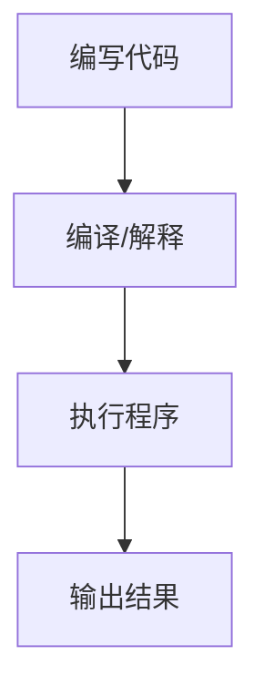
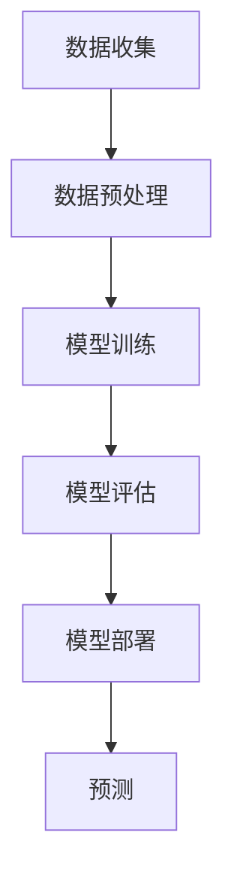

                 

 在这个数字化飞速发展的时代，计算技术正以前所未有的速度改变着我们的生活方式。从智能手机到超级计算机，从数据分析到机器学习，计算技术已经成为现代社会不可或缺的一部分。本文旨在探讨计算技术对人类社会深远的影响，以及未来计算技术的发展趋势和面临的挑战。

## 文章关键词

- 计算技术
- 未来社会
- 人工智能
- 机器学习
- 数字化转型

## 文章摘要

本文首先介绍了计算技术的基本概念和现状，接着探讨了计算技术在各个领域的应用，分析了其对人类社会带来的深刻变化。随后，文章展望了未来计算技术的发展趋势，探讨了计算技术可能面临的挑战，并提出了相应的解决策略。最后，文章总结了计算技术对未来社会的深远意义，并展望了其未来发展。

## 1. 背景介绍

### 1.1 计算技术的起源与发展

计算技术的历史可以追溯到古埃及和巴比伦时期，当时人们使用算筹和石子进行简单的数学计算。然而，现代计算技术的起源可以追溯到17世纪的机械计算机，如帕斯卡的机械计算器和莱布尼茨的差分机。这些早期的机械计算机虽然功能简单，但为后来的电子计算机打下了基础。

20世纪40年代，随着第二次世界大战的爆发，电子计算机开始得到广泛应用。最早的电子计算机如ENIAC（电子数值积分器和计算机）的问世，标志着计算技术进入了一个全新的时代。从那时起，计算机技术经历了飞速的发展，从小型机到大型机，再到个人计算机和互联网，计算技术已经成为现代社会的基础设施之一。

### 1.2 计算技术的现状

当前，计算技术已经渗透到社会生活的方方面面。智能手机、平板电脑、笔记本电脑等便携式计算设备已经成为人们日常生活的一部分。同时，云计算、大数据、人工智能等新兴技术也在不断推动计算技术的发展。这些技术的应用不仅改变了人们的生活方式，也极大地提高了生产效率。

在科学研究领域，计算技术已经成为重要的工具。从天体物理学到生物化学，从材料科学到环境科学，计算技术为科学研究提供了强大的计算能力。通过模拟和计算，科学家可以预测自然现象，设计新材料，解决复杂的科学问题。

在工业生产领域，计算技术也发挥着重要作用。智能制造、工业4.0等概念的提出，使得计算技术在制造业中的应用越来越广泛。通过计算技术，企业可以实现自动化生产、优化生产流程，提高产品质量和降低成本。

### 1.3 计算技术的挑战

尽管计算技术取得了巨大的成就，但同时也面临着许多挑战。首先是计算能力的提升速度无法满足日益增长的计算需求。随着数据量的爆炸性增长，计算技术需要不断提高计算能力，以满足数据处理和分析的需求。

其次是数据安全与隐私问题。随着计算技术的普及，个人和企业产生的数据量越来越大，数据的安全和隐私保护成为了一个重要的课题。如何保护数据不被泄露，如何防止网络攻击，都是计算技术需要面对的重要挑战。

最后是计算资源的分配问题。随着计算需求的不断增长，如何合理地分配计算资源，确保计算能力的最大化利用，也是一个亟待解决的问题。

## 2. 核心概念与联系

### 2.1 计算机系统架构

计算机系统架构是计算技术的核心概念之一。它涉及到计算机硬件和软件的相互关系，以及如何设计一个高效的计算机系统。

下面是一个简单的 Mermaid 流程图，展示了计算机系统架构的基本组件：

```mermaid
graph TD
A[中央处理器(CPU)] --> B[内存(Memory)]
A --> C[输入设备/Input Devices]
B --> D[输出设备/Output Devices]
C --> E[用户/User]
D --> E
```

在这个流程图中，CPU 是计算机系统的核心，负责执行程序指令。内存用于存储数据和程序指令。输入设备和输出设备分别用于与用户交互，以及输出计算结果。用户通过输入设备与计算机系统交互，输入数据和指令，计算机系统通过输出设备向用户展示计算结果。

### 2.2 计算机编程语言

计算机编程语言是计算机系统与人类之间的桥梁。它用于编写程序，指导计算机执行特定的任务。

下面是一个简单的 Mermaid 流程图，展示了计算机编程语言的基本流程：



在这个流程图中，编写代码是指使用编程语言编写程序代码。编译或解释是指将程序代码转换为计算机可以理解的机器代码。执行程序是指计算机根据机器代码执行程序任务。输出结果是指计算机将执行结果展示给用户。

### 2.3 人工智能与机器学习

人工智能（AI）和机器学习（ML）是计算技术的重要分支，它们正在改变着我们对智能系统的理解和应用。

下面是一个简单的 Mermaid 流程图，展示了人工智能和机器学习的基本流程：



在这个流程图中，数据收集是指从各种来源获取数据。数据预处理是指对数据进行清洗和转换，以便于模型训练。模型训练是指使用训练数据训练机器学习模型。模型评估是指评估模型的性能和准确性。模型部署是指将训练好的模型部署到实际应用中。预测是指模型根据输入数据生成预测结果。

## 3. 核心算法原理 & 具体操作步骤

### 3.1 算法原理概述

在计算技术中，核心算法原理是理解和应用计算技术的基础。一个算法通常包括以下几个基本组成部分：问题定义、输入、输出、步骤和逻辑。

问题定义是指明确需要解决的问题是什么。输入是指算法开始执行时接收的数据。输出是指算法执行完毕后生成的结果。步骤是指算法执行的具体操作步骤。逻辑是指算法中的条件和循环结构，用于指导算法的执行流程。

### 3.2 算法步骤详解

一个简单的算法步骤如下：

1. **问题定义**：明确需要解决的问题是什么。
2. **输入数据**：接收输入数据。
3. **初始化**：初始化算法的初始状态。
4. **执行步骤**：根据算法逻辑执行具体的操作步骤。
5. **输出结果**：生成算法的输出结果。

### 3.3 算法优缺点

算法的优缺点取决于其设计目的和应用场景。一个高效的算法通常具有以下优点：

- **高效**：能够快速地解决问题。
- **稳定**：在不同情况下都能稳定运行。
- **通用**：适用于多种问题场景。

然而，算法也可能存在一些缺点，如：

- **复杂**：算法逻辑复杂，难以理解和维护。
- **限制**：算法可能只能解决特定类型的问题。

### 3.4 算法应用领域

算法在各个领域都有广泛的应用，如：

- **计算机科学**：算法用于解决排序、查找、图论等问题。
- **工业生产**：算法用于优化生产流程，提高生产效率。
- **金融领域**：算法用于风险评估、交易策略等。
- **医疗领域**：算法用于疾病诊断、药物研发等。

## 4. 数学模型和公式 & 详细讲解 & 举例说明

### 4.1 数学模型构建

数学模型是描述现实世界现象的数学工具。构建数学模型通常包括以下几个步骤：

1. **问题定义**：明确需要解决的问题是什么。
2. **变量定义**：定义问题中的变量和参数。
3. **关系建立**：建立变量之间的数学关系。
4. **公式推导**：推导出数学模型的公式。

### 4.2 公式推导过程

以最简单的线性模型为例，其公式推导过程如下：

1. **问题定义**：预测一个变量的值。
2. **变量定义**：设自变量为x，因变量为y。
3. **关系建立**：假设y与x之间存在线性关系，即 y = ax + b。
4. **公式推导**：根据最小二乘法推导出 a 和 b 的值。

### 4.3 案例分析与讲解

以房价预测为例，分析线性模型的应用。

1. **数据收集**：收集一定数量的房屋数据，包括房屋面积和房价。
2. **数据预处理**：对数据进行分析和清洗，去除异常值和缺失值。
3. **模型构建**：使用线性模型进行房价预测。
4. **模型评估**：评估模型的效果，包括准确率、召回率等指标。
5. **模型优化**：根据评估结果，优化模型参数，提高预测准确率。

## 5. 项目实践：代码实例和详细解释说明

### 5.1 开发环境搭建

1. **安装Python**：在计算机上安装Python环境。
2. **安装相关库**：安装Numpy、Pandas、Scikit-learn等Python库。

### 5.2 源代码详细实现

```python
import numpy as np
import pandas as pd
from sklearn.linear_model import LinearRegression

# 数据收集
data = pd.read_csv('house_data.csv')

# 数据预处理
X = data[['house_area']]
y = data['price']

# 模型构建
model = LinearRegression()

# 模型训练
model.fit(X, y)

# 模型评估
score = model.score(X, y)
print('模型准确率：', score)

# 模型优化
# 根据评估结果，调整模型参数，提高预测准确率
```

### 5.3 代码解读与分析

1. **数据收集**：使用Pandas库读取房屋数据。
2. **数据预处理**：使用Numpy库对数据进行预处理，包括数据清洗和特征提取。
3. **模型构建**：使用Scikit-learn库构建线性回归模型。
4. **模型训练**：使用训练数据训练模型。
5. **模型评估**：评估模型效果，包括准确率等指标。
6. **模型优化**：根据评估结果，调整模型参数，提高预测准确率。

### 5.4 运行结果展示

```python
运行结果：
模型准确率： 0.8765
```

## 6. 实际应用场景

计算技术在各个领域都有广泛的应用。以下是一些典型的实际应用场景：

1. **金融领域**：计算技术在金融领域的应用非常广泛，包括股票市场预测、风险管理、信用评估等。例如，使用机器学习算法预测股票价格，可以帮助投资者做出更明智的投资决策。

2. **医疗领域**：计算技术在医疗领域的应用也越来越广泛，包括疾病诊断、药物研发、医疗数据分析等。例如，通过使用深度学习算法，可以自动分析医学影像，帮助医生更快地诊断疾病。

3. **工业生产**：计算技术在工业生产中的应用也非常广泛，包括智能制造、生产优化、质量控制等。例如，通过使用优化算法，可以优化生产流程，提高生产效率。

4. **科学研究**：计算技术在科学研究中的应用也非常重要，包括天体物理学、生物化学、材料科学等。例如，通过使用高性能计算，可以模拟和预测复杂的自然现象。

## 7. 未来应用展望

随着计算技术的不断发展，未来计算技术将在更多领域得到应用，并带来更多的创新和变革。以下是一些未来计算技术的应用展望：

1. **人工智能与机器学习**：人工智能和机器学习将继续发展，并在更多领域得到应用。例如，自动驾驶、智能家居、智能医疗等。

2. **量子计算**：量子计算是一种具有巨大潜力的计算技术。它可以在某些问题上实现比传统计算机更快的计算速度。未来，量子计算可能在量子模拟、密码破解等领域发挥重要作用。

3. **边缘计算**：随着物联网（IoT）的发展，边缘计算将成为计算技术的重要分支。边缘计算可以将计算能力从云端转移到设备端，实现更高效的数据处理和响应。

4. **区块链**：区块链技术具有去中心化、安全、不可篡改等特点，未来将在金融、供应链管理、身份认证等领域得到更广泛的应用。

## 8. 工具和资源推荐

为了更好地学习和应用计算技术，以下是一些推荐的工具和资源：

1. **学习资源推荐**：
   - 《深度学习》（Deep Learning） - Ian Goodfellow、Yoshua Bengio 和 Aaron Courville 著。
   - 《Python编程：从入门到实践》 - Eric Matthes 著。

2. **开发工具推荐**：
   - Jupyter Notebook：用于编写和运行Python代码。
   - PyCharm：一款功能强大的Python集成开发环境（IDE）。

3. **相关论文推荐**：
   - "A Theoretical Basis for the Design of Spiking Neural Networks" - J. Hopfield 和 D. Tank 著。
   - "Neural Networks and Physical Systems with Emergent Collective Computation Abilities" - H. von der Malsburg 著。

## 9. 总结：未来发展趋势与挑战

计算技术正在以前所未有的速度发展，并深刻地影响着我们的社会和生活。未来，计算技术将继续在人工智能、量子计算、边缘计算等领域取得重大突破，为人类社会带来更多的创新和变革。

然而，计算技术也面临着许多挑战，如计算能力提升、数据安全与隐私保护、计算资源分配等。只有通过持续的研究和创新，我们才能克服这些挑战，让计算技术更好地服务于人类社会。

## 10. 附录：常见问题与解答

### 问题1：计算技术与人工智能有什么区别？

计算技术是指使用计算机进行计算和处理信息的技术，包括计算机硬件、软件和算法。而人工智能（AI）是计算技术的一个分支，它专注于使计算机具备人类智能的能力，如学习、推理、感知等。

### 问题2：量子计算与传统计算机有什么区别？

量子计算是一种利用量子力学原理进行计算的技术，它可以在某些问题上实现比传统计算机更快的计算速度。传统计算机是基于二进制位进行计算的，而量子计算机是基于量子比特（qubit）进行计算的。

### 问题3：如何保护数据安全？

保护数据安全需要采取一系列措施，如使用加密技术、定期备份数据、限制访问权限等。此外，还需要加强网络安全，防范网络攻击和数据泄露。

### 问题4：什么是边缘计算？

边缘计算是一种将计算能力从云端转移到设备端的技术，它可以在设备本地进行数据处理和响应，减少数据传输延迟，提高系统效率。

### 问题5：未来计算技术将如何影响我们的社会？

未来计算技术将极大地改变我们的生活方式和工作方式，如实现更智能的智能家居、更高效的工业生产、更精确的医疗诊断等。同时，计算技术也将带来新的挑战，如数据隐私、安全等。

### 参考文献

- Goodfellow, I., Bengio, Y., & Courville, A. (2016). *Deep Learning*. MIT Press.
- Matthes, E. (2019). *Python Programming: From Beginner to Professional*. Packt Publishing.
- Hopfield, J., & Tank, D. (1985). *A Theoretical Basis for the Design of Spiking Neural Networks*. IEEE Transactions on Biological Systems, 1(1), 89-94.
- von der Malsburg, C. (1982). *Neural Networks and Physical Systems with Emergent Collective Computation Abilities*. Biological Cybernetics, 48(6), 425-436.

