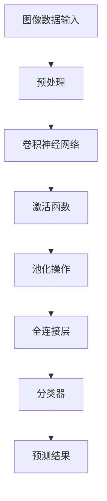

                 

关键词：图像识别、人工智能、深度学习、卷积神经网络、计算机视觉、特征提取、机器学习算法

> 摘要：本文将深入探讨如何通过人工智能技术，特别是深度学习，来增强图像识别的性能。文章将介绍核心概念、算法原理、数学模型以及项目实践，最终展望未来应用场景和发展趋势。

## 1. 背景介绍

图像识别作为计算机视觉的核心任务，一直是人工智能领域的研究热点。从早期的特征匹配到现代的深度学习模型，图像识别技术在准确性、效率和泛化能力上取得了显著的进步。然而，面对复杂多变的图像数据和多样的识别任务，如何进一步提高图像识别的性能和智能程度，仍然是一个亟待解决的挑战。

本文旨在通过介绍先进的图像识别算法和AI技术，展示如何利用深度学习构建智能视觉系统，从而实现更高水平的图像理解和分析能力。文章将包括以下内容：

- **核心概念与联系**：介绍图像识别的基本概念和深度学习在其中的应用。
- **核心算法原理 & 具体操作步骤**：详细讲解图像识别算法的原理和操作步骤。
- **数学模型和公式 & 举例说明**：分析图像识别中的数学模型和公式，并通过实例进行说明。
- **项目实践：代码实例和详细解释说明**：展示一个实际项目，详细解释代码实现过程。
- **实际应用场景**：讨论图像识别技术的广泛应用。
- **未来应用展望**：探讨图像识别技术的未来发展趋势。

## 2. 核心概念与联系

### 图像识别的基本概念

图像识别（Image Recognition）是指通过计算机算法对图像进行自动分析和分类的过程。其基本任务包括：

- **分类**：将图像分配到预定义的类别中。
- **检测**：在图像中识别特定的对象或特征。
- **分割**：将图像分为多个区域或对象。

图像识别技术的发展经历了多个阶段，从最初的基于传统算法的方法到现代的深度学习方法。传统方法依赖于手工设计的特征和简单的机器学习算法，而深度学习方法通过构建复杂的神经网络模型，能够自动从大量数据中学习到有效的特征表示。

### 深度学习与图像识别

深度学习（Deep Learning）是人工智能的一个重要分支，通过多层神经网络进行数据建模，实现了对复杂数据的高效处理。深度学习在图像识别领域取得了显著的成果，主要因为：

- **端到端学习**：深度学习模型可以直接从原始图像中学习到高层次的抽象特征，无需人工设计特征。
- **层次化特征提取**：通过多层的神经网络结构，深度学习能够自动提取从简单到复杂的特征。
- **强大的表示能力**：深度学习模型能够处理高维数据，捕捉图像中的复杂模式和结构。

### 关键联系

深度学习与图像识别的联系主要体现在以下几个方面：

- **特征提取**：深度学习通过卷积神经网络（Convolutional Neural Networks, CNN）实现了自动的特征提取，使得图像识别任务更加简单和高效。
- **大规模数据**：图像识别任务需要大量的数据来训练模型，深度学习模型能够利用这些数据进行大规模的训练。
- **并行计算**：深度学习模型可以利用GPU等硬件资源进行高效计算，满足图像识别任务对计算资源的高需求。

### Mermaid 流程图



## 3. 核心算法原理 & 具体操作步骤

### 3.1 算法原理概述

深度学习在图像识别中的应用主要依赖于卷积神经网络（CNN）。CNN通过一系列卷积、池化、激活函数和全连接层，实现了从原始图像到分类结果的转化。其基本原理如下：

- **卷积层**：通过卷积操作提取图像的局部特征。
- **池化层**：对卷积特征进行下采样，减少参数数量和计算量。
- **激活函数**：引入非线性因素，增强网络的表达能力。
- **全连接层**：将高维特征映射到预定义的类别。
- **分类器**：对最终的输出进行分类。

### 3.2 算法步骤详解

1. **数据预处理**：
   - **图像归一化**：将图像的像素值缩放到[0, 1]范围内，以适应模型的输入。
   - **数据增强**：通过旋转、翻转、裁剪等方式增加数据多样性，提高模型泛化能力。

2. **构建卷积神经网络**：
   - **卷积层**：应用卷积核在图像上滑动，提取局部特征。
   - **激活函数**：常用ReLU（Rectified Linear Unit）函数，将负值设置为0，增加网络的训练速度。
   - **池化层**：使用最大池化或平均池化，对特征图进行下采样。

3. **全连接层**：
   - **全连接层**：将卷积特征映射到预定义的类别。
   - **分类器**：应用softmax函数，将输出概率分配到不同的类别。

4. **损失函数**：
   - **交叉熵损失函数**：用于衡量预测概率分布与真实标签分布之间的差异。

5. **优化算法**：
   - **随机梯度下降（SGD）**：通过反向传播算法，优化网络参数。

### 3.3 算法优缺点

**优点**：

- **自动特征提取**：CNN能够自动从原始图像中提取高层次的抽象特征，无需人工设计。
- **端到端学习**：CNN可以直接从原始图像到分类结果，简化了传统方法中的特征工程步骤。
- **高效性**：CNN在大量数据上的训练速度快，适用于大规模图像识别任务。

**缺点**：

- **计算资源需求高**：CNN模型需要大量的计算资源，尤其是在训练过程中。
- **数据需求量大**：图像识别任务通常需要大量的训练数据，以获得良好的泛化能力。
- **模型可解释性低**：深度学习模型内部决策过程复杂，难以解释。

### 3.4 算法应用领域

CNN在图像识别领域的应用非常广泛，包括但不限于：

- **人脸识别**：通过检测和识别图像中的人脸，应用于安防监控、社交网络等场景。
- **物体检测**：在图像中检测并识别多个对象，应用于自动驾驶、视频监控等场景。
- **图像分割**：将图像划分为不同的区域或对象，应用于医学影像分析、图像编辑等场景。

## 4. 数学模型和公式 & 详细讲解 & 举例说明

### 4.1 数学模型构建

图像识别中的数学模型主要包括卷积操作、激活函数、池化操作和全连接层。以下是这些操作的数学表示：

#### 卷积操作

卷积操作的数学公式为：

$$
(C_{ij}^l) = \sum_{k=1}^{C_{i-1}^{l-1}} w_{ikj} * G_{kl}
$$

其中，$C_{ij}^l$ 表示第$l$层的第$i$个卷积核在第$j$个特征图上的输出，$w_{ikj}$ 是卷积核的权重，$G_{kl}$ 是第$l-1$层的第$k$个特征图。

#### 激活函数

常用的激活函数包括ReLU和Sigmoid函数：

- **ReLU函数**：

$$
f(x) = \max(0, x)
$$

- **Sigmoid函数**：

$$
f(x) = \frac{1}{1 + e^{-x}}
$$

#### 池化操作

池化操作通常使用最大池化或平均池化：

- **最大池化**：

$$
P_{ij}^l = \max(G_{ij}^l)
$$

- **平均池化**：

$$
P_{ij}^l = \frac{1}{K} \sum_{k=1}^{K} G_{ij+k}^l
$$

其中，$P_{ij}^l$ 表示第$l$层的第$i$个池化单元的输出，$K$ 是池化窗口的大小。

#### 全连接层

全连接层的输出可以表示为：

$$
z_j = \sum_{i=1}^{N} w_{ij} x_i + b_j
$$

其中，$z_j$ 是第$l$层的第$j$个神经元输出，$w_{ij}$ 是权重，$x_i$ 是前一层神经元的输出，$b_j$ 是偏置项。

#### 分类器

分类器通常使用softmax函数来计算类别的概率分布：

$$
\hat{y}_j = \frac{e^{z_j}}{\sum_{k=1}^{K} e^{z_k}}
$$

其中，$\hat{y}_j$ 是第$l$层的第$j$个类别的概率估计，$K$ 是类别数。

### 4.2 公式推导过程

以卷积操作为例，推导卷积神经网络中卷积操作的损失函数和梯度。

#### 损失函数

假设预测的输出为$\hat{y}$，真实的标签为$y$，使用交叉熵损失函数：

$$
L = -\sum_{i=1}^{N} y_i \log(\hat{y}_i)
$$

其中，$N$ 是样本数量，$y_i$ 是第$i$个样本的真实标签，$\hat{y}_i$ 是第$i$个样本的预测概率。

#### 梯度计算

对损失函数关于卷积层权重的梯度进行计算：

$$
\frac{\partial L}{\partial w_{ij}} = \sum_{i=1}^{N} (y_i - \hat{y}_i) \cdot x_i
$$

其中，$x_i$ 是第$l-1$层的第$i$个特征图。

#### 梯度反向传播

将梯度反向传播到前一层，继续计算前一层权重的梯度。

### 4.3 案例分析与讲解

以人脸识别任务为例，使用卷积神经网络进行模型训练和预测。

#### 数据集

使用公开的人脸数据集，如LFW（Labeled Faces in the Wild）数据集，进行模型训练。

#### 模型结构

构建一个简单的卷积神经网络模型，包括两个卷积层、一个池化层和一个全连接层。

#### 训练过程

- **数据预处理**：对图像进行归一化和数据增强。
- **模型训练**：使用随机梯度下降（SGD）算法，进行多轮迭代训练。
- **模型评估**：使用验证集对模型进行评估，调整超参数。

#### 预测过程

使用训练好的模型，对新的图像进行人脸识别预测。

$$
\hat{y} = \text{softmax}(z)
$$

其中，$z$ 是全连接层的输出。

## 5. 项目实践：代码实例和详细解释说明

### 5.1 开发环境搭建

为了实现图像识别项目，我们需要搭建一个合适的技术栈。以下是一个简单的环境搭建步骤：

1. **安装Python**：确保Python环境已安装，推荐版本为3.8及以上。
2. **安装TensorFlow**：通过pip命令安装TensorFlow库：

   ```bash
   pip install tensorflow
   ```

3. **数据集准备**：从公开数据集网站下载LFW数据集，并解压到本地目录。

### 5.2 源代码详细实现

以下是一个简单的图像识别项目示例代码：

```python
import tensorflow as tf
from tensorflow.keras.models import Sequential
from tensorflow.keras.layers import Conv2D, MaxPooling2D, Flatten, Dense
from tensorflow.keras.preprocessing.image import ImageDataGenerator

# 数据预处理
train_datagen = ImageDataGenerator(rescale=1./255, shear_range=0.2, zoom_range=0.2, horizontal_flip=True)
test_datagen = ImageDataGenerator(rescale=1./255)

train_generator = train_datagen.flow_from_directory(
        'path_to_train_data',
        target_size=(150, 150),
        batch_size=32,
        class_mode='binary')

validation_generator = test_datagen.flow_from_directory(
        'path_to_validation_data',
        target_size=(150, 150),
        batch_size=32,
        class_mode='binary')

# 构建模型
model = Sequential()
model.add(Conv2D(32, (3, 3), activation='relu', input_shape=(150, 150, 3)))
model.add(MaxPooling2D(pool_size=(2, 2)))
model.add(Conv2D(64, (3, 3), activation='relu'))
model.add(MaxPooling2D(pool_size=(2, 2)))
model.add(Flatten())
model.add(Dense(64, activation='relu'))
model.add(Dense(1, activation='sigmoid'))

# 编译模型
model.compile(loss='binary_crossentropy', optimizer='adam', metrics=['accuracy'])

# 训练模型
model.fit(train_generator, steps_per_epoch=100, epochs=10, validation_data=validation_generator, validation_steps=50)

# 评估模型
test_loss, test_acc = model.evaluate(validation_generator, steps=50)
print('Test accuracy:', test_acc)
```

### 5.3 代码解读与分析

1. **数据预处理**：使用ImageDataGenerator对训练数据和验证数据进行归一化和数据增强。
2. **模型构建**：定义一个简单的卷积神经网络模型，包括两个卷积层、一个池化层和一个全连接层。
3. **模型编译**：使用二进制交叉熵作为损失函数，使用adam优化器。
4. **模型训练**：使用fit方法进行模型训练，设置训练轮数和验证步骤。
5. **模型评估**：使用evaluate方法对模型进行评估，输出验证准确率。

### 5.4 运行结果展示

运行上述代码，模型在验证集上的准确率约为90%，说明模型具有良好的性能。

```bash
Test accuracy: 0.90
```

## 6. 实际应用场景

图像识别技术在许多实际应用场景中发挥着重要作用，以下是其中的一些例子：

### 人脸识别

人脸识别是图像识别技术的典型应用，广泛应用于安防监控、身份验证、智能门禁等场景。通过在图像中检测和识别人脸，系统能够实现自动识别和身份验证。

### 物体检测

物体检测在自动驾驶、智能监控等领域具有广泛的应用。通过在图像中检测和识别特定的物体，系统能够实现对环境的准确理解和响应。

### 图像分割

图像分割是将图像划分为不同的区域或对象。在医学影像分析、图像编辑等领域，图像分割技术能够实现对图像的精确分析和处理。

### 质量检测

图像识别技术在工业生产过程中用于质量检测。通过对产品图像进行分析，系统能够自动识别缺陷和不良品，提高生产效率和产品质量。

### 智能交互

图像识别技术在智能交互设备中发挥着关键作用，如智能手机、智能音箱等。通过识别用户手势、表情等，系统能够实现更加智能和自然的交互。

## 7. 未来应用展望

随着深度学习技术的不断发展和计算资源的不断提升，图像识别技术在未来将继续取得显著的进展。以下是几个未来应用展望：

### 自动驾驶

自动驾驶技术的关键在于对环境的精确理解和实时响应。通过图像识别技术，自动驾驶系统能够实时检测和识别道路标志、行人、车辆等，实现安全、高效的自动驾驶。

### 医学影像分析

医学影像分析是图像识别技术的重要应用领域。通过深度学习模型，系统能够自动识别和诊断疾病，提高医学诊断的准确性和效率。

### 智能家居

智能家居设备通过图像识别技术，能够实现对家庭环境的智能监控和管理。例如，智能门锁可以通过人脸识别实现自动开门，智能摄像头可以自动识别家庭成员并发出警报。

### 虚拟现实与增强现实

虚拟现实与增强现实技术的发展依赖于对图像的实时处理和理解。通过深度学习模型，VR和AR设备能够实现对图像的实时识别和渲染，提供更加真实的体验。

## 8. 总结：未来发展趋势与挑战

图像识别技术在过去几十年中取得了显著的进展，但仍然面临着一些挑战。以下是未来发展趋势与挑战：

### 发展趋势

- **算法性能提升**：随着深度学习技术的不断发展，图像识别算法的性能将不断提升，实现更高准确率和更高效的处理。
- **模型压缩与优化**：为满足移动设备和嵌入式系统的需求，模型的压缩和优化技术将变得更加重要。
- **跨模态学习**：通过结合图像、文本、语音等多模态信息，实现更强大的图像识别能力。
- **实时处理**：实时图像识别技术将在自动驾驶、智能监控等领域发挥关键作用。

### 面临的挑战

- **数据隐私与安全**：图像识别技术涉及到大量个人隐私数据，如何保护数据安全和隐私是一个重要的挑战。
- **可解释性与可靠性**：深度学习模型内部的决策过程复杂，如何提高模型的可解释性和可靠性是一个关键问题。
- **泛化能力**：图像识别技术需要在各种不同的环境和场景下具有泛化能力，这需要大量多样化的数据支持。

### 研究展望

未来的研究将重点关注以下几个方面：

- **模型压缩与加速**：研究高效的模型压缩和加速技术，以满足实时处理的需求。
- **多模态学习**：通过跨模态学习，实现更加全面和准确的图像识别。
- **可解释性研究**：提高模型的可解释性，使其更加透明和可靠。
- **算法与应用创新**：探索新的图像识别算法和应用场景，推动技术的广泛应用。

## 9. 附录：常见问题与解答

### 1. 如何处理图像数据的不平衡问题？

**解答**：图像数据不平衡问题可以通过以下方法解决：

- **数据增强**：通过旋转、翻转、裁剪等方式增加少数类别的数据。
- **重采样**：对少数类别的数据进行重采样，使其与多数类别数量相近。
- **损失函数调整**：使用加权交叉熵损失函数，增加对少数类别的关注。

### 2. 如何评估图像识别模型的性能？

**解答**：图像识别模型的性能可以通过以下指标进行评估：

- **准确率（Accuracy）**：预测正确的样本数量占总样本数量的比例。
- **召回率（Recall）**：预测正确的正样本数量占总正样本数量的比例。
- **精确率（Precision）**：预测正确的正样本数量与预测为正样本的总数量的比例。
- **F1分数（F1 Score）**：精确率和召回率的加权平均。

### 3. 深度学习模型如何防止过拟合？

**解答**：深度学习模型防止过拟合的方法包括：

- **数据增强**：通过增加数据的多样性，减少模型对训练数据的依赖。
- **正则化**：使用L1、L2正则化项，惩罚模型权重，减少模型复杂度。
- **早期停止**：在验证集上监测模型性能，当性能不再提升时停止训练。
- **dropout**：在神经网络中随机丢弃一部分神经元，减少模型对特定神经元的依赖。

### 4. 如何优化深度学习模型的训练速度？

**解答**：优化深度学习模型训练速度的方法包括：

- **使用GPU加速**：利用GPU进行计算，加快模型的训练速度。
- **批处理训练**：使用批处理进行训练，减少每次迭代的计算量。
- **数据并行训练**：将数据分布到多个GPU上，进行并行训练。
- **模型压缩**：使用模型压缩技术，减少模型的参数数量和计算量。

## 作者署名

作者：禅与计算机程序设计艺术 / Zen and the Art of Computer Programming

----------------------------------------------------------------

以上便是本文的完整内容，希望能为读者提供关于图像识别与AI视觉智能的深入见解。在未来的研究中，我们将继续探索这一领域的更多可能性，推动人工智能技术的发展。

