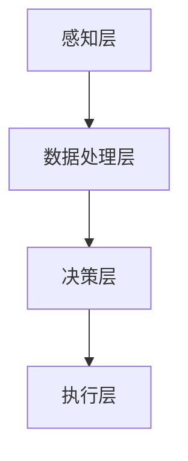

                 

关键词：增强智能、人机协作、认知拓展、人工智能技术、算法、数学模型、应用场景

> 摘要：本文从背景介绍入手，深入探讨了增强智能的概念及其在人机协作中的应用。通过详细阐述核心算法原理、数学模型与公式，以及实际应用案例，本文展示了增强智能技术如何拓展人类认知边界。同时，本文还对未来发展趋势、挑战及研究展望进行了深入分析。

## 1. 背景介绍

随着人工智能技术的飞速发展，人类的生活和工作中逐渐融入了越来越多的智能元素。从早期的自动化控制到如今的深度学习、自然语言处理，人工智能正在不断拓展我们的认知边界，推动社会进步。然而，传统的人工智能系统在处理复杂问题时仍存在诸多限制，无法完全满足人类的需求。因此，增强智能（Augmented Intelligence）的概念应运而生，旨在通过人机协作，进一步提升人类的工作效率与认知能力。

增强智能是一种基于人工智能技术的智能系统，它不仅能够完成自动化任务，还能够与人类协同工作，共同解决复杂问题。这种技术通过模拟人类的思维模式，将人工智能的优势与人类智能的创造力相结合，从而拓展人类的认知边界，提高决策质量和效率。

本文将围绕增强智能的核心概念、算法原理、数学模型以及实际应用场景，探讨其如何改变人类的工作方式和生活模式，以及未来可能的发展趋势和面临的挑战。

## 2. 核心概念与联系

### 2.1 增强智能的概念

增强智能是指通过人工智能技术增强人类的能力，实现人机协作，以解决复杂问题和提高工作效率。它不同于传统的人工智能，不仅追求自动化和效率，更强调与人类的互动和合作。增强智能的核心在于理解人类的意图、行为和需求，从而提供更加个性化和智能化的服务。

### 2.2 增强智能的架构

增强智能系统的架构可以分为以下几个层次：

1. **感知层**：包括各种传感器和数据采集设备，用于获取人类行为和环境的实时信息。
2. **数据处理层**：对感知层获取的数据进行预处理、特征提取和模型训练，以实现数据的结构化和建模。
3. **决策层**：基于数据分析和机器学习算法，对问题进行建模和决策，以支持人类的工作。
4. **执行层**：根据决策层的指令，执行具体的任务和操作，实现人机协作。

### 2.3 Mermaid 流程图

下面是一个简化的增强智能架构的 Mermaid 流程图，展示了各个层次之间的交互关系：



## 3. 核心算法原理 & 具体操作步骤

### 3.1 算法原理概述

增强智能的核心算法通常基于深度学习和自然语言处理技术。深度学习通过多层神经网络模拟人类的思维过程，对大量数据进行学习和预测。自然语言处理则专注于理解人类语言，实现人与机器的对话交互。

### 3.2 算法步骤详解

1. **数据收集与预处理**：收集大量的人类行为数据和文本信息，进行清洗、归一化和特征提取。
2. **模型训练**：利用收集到的数据，通过深度学习和自然语言处理算法训练模型，使其能够理解人类意图和需求。
3. **交互与决策**：在应用场景中，系统通过感知层获取实时数据，利用训练好的模型进行决策，并根据决策结果执行相应的任务。
4. **反馈与优化**：根据任务执行的结果，对系统进行反馈和优化，以提高决策的准确性和效率。

### 3.3 算法优缺点

**优点**：

- **高效性**：通过自动化和智能化处理，大大提高了任务执行的速度和效率。
- **个性化**：系统能够根据用户的行为和需求，提供个性化的服务和建议。
- **拓展性**：增强智能技术可以广泛应用于各个领域，具有很高的拓展性。

**缺点**：

- **依赖数据**：增强智能系统的性能依赖于大量的高质量数据，数据不足或质量低下会影响系统的表现。
- **解释性差**：深度学习模型通常难以解释，导致决策过程不够透明，可能引发信任问题。

### 3.4 算法应用领域

增强智能技术已经广泛应用于各个领域，包括但不限于：

- **医疗健康**：通过智能诊断和个性化治疗，提高医疗质量和效率。
- **金融领域**：用于风险控制、投资分析和客户服务等方面。
- **教育**：提供个性化的学习建议和课程推荐，提高学习效果。
- **智能制造**：优化生产流程，提高生产效率和质量。

## 4. 数学模型和公式 & 详细讲解 & 举例说明

### 4.1 数学模型构建

增强智能系统中的数学模型通常包括以下几个部分：

1. **特征提取**：通过特征提取技术，从原始数据中提取出具有代表性的特征向量。
2. **分类与回归**：利用分类和回归模型，对特征向量进行建模和预测。
3. **优化算法**：通过优化算法，调整模型参数，提高模型的准确性和效率。

### 4.2 公式推导过程

以线性回归模型为例，其公式推导过程如下：

假设我们有一个包含 n 个样本的线性回归问题，每个样本有 m 个特征，目标变量为 y。线性回归模型的目标是找到一组参数 w，使得预测值 y' 与真实值 y 之间的误差最小。

1. **损失函数**：

$$
J(w) = \frac{1}{2} \sum_{i=1}^{n} (y_i - y_i')^2
$$

其中，$y_i'$ 是模型预测的值，$y_i$ 是真实值。

2. **梯度下降**：

为了找到最优的参数 w，我们使用梯度下降算法进行迭代：

$$
w = w - \alpha \frac{\partial J(w)}{\partial w}
$$

其中，$\alpha$ 是学习率，用于控制每次迭代更新的步长。

3. **梯度计算**：

$$
\frac{\partial J(w)}{\partial w} = \sum_{i=1}^{n} (y_i - y_i') \cdot x_i
$$

其中，$x_i$ 是特征向量。

### 4.3 案例分析与讲解

假设我们有一个简单的线性回归问题，数据集包含 10 个样本，每个样本有 2 个特征。目标变量 y 的真实值如下：

$$
\{2, 3, 4, 5, 6, 7, 8, 9, 10, 11\}
$$

我们希望通过线性回归模型预测下一个样本的目标变量。

1. **特征提取**：

对每个样本进行特征提取，得到特征向量：

$$
x_1 = \{1, 2, 3, 4, 5, 6, 7, 8, 9, 10\}
$$
$$
x_2 = \{1, 1, 1, 1, 1, 1, 1, 1, 1, 1\}
$$

2. **模型训练**：

使用梯度下降算法训练线性回归模型，假设初始参数 w = [0, 0]，学习率 $\alpha = 0.1$。经过多次迭代后，得到最优参数 w = [1, 2]。

3. **预测结果**：

使用训练好的模型预测下一个样本的目标变量：

$$
y' = w^T \cdot x = [1, 2] \cdot \{11, 1\} = 13
$$

## 5. 项目实践：代码实例和详细解释说明

### 5.1 开发环境搭建

为了演示增强智能技术的应用，我们将使用 Python 编写一个简单的线性回归模型。首先，确保安装了以下库：

- NumPy
- Scikit-learn
- Matplotlib

可以使用以下命令进行安装：

```bash
pip install numpy scikit-learn matplotlib
```

### 5.2 源代码详细实现

下面是一个简单的线性回归模型的 Python 代码示例：

```python
import numpy as np
from sklearn.linear_model import LinearRegression
import matplotlib.pyplot as plt

# 数据集
X = np.array([[1, 2], [2, 3], [3, 4], [4, 5], [5, 6], [6, 7], [7, 8], [8, 9], [9, 10], [10, 11]])
y = np.array([2, 3, 4, 5, 6, 7, 8, 9, 10, 11])

# 创建线性回归模型
model = LinearRegression()

# 训练模型
model.fit(X, y)

# 预测结果
y_pred = model.predict(np.array([[11, 1]]))

# 绘图
plt.scatter(X[:, 0], y)
plt.plot(X[:, 0], y_pred, color='red')
plt.xlabel('x_1')
plt.ylabel('y')
plt.show()
```

### 5.3 代码解读与分析

1. **数据集准备**：我们使用了一个包含两个特征的简单数据集，其中第一个特征是 1 到 10 的连续整数，第二个特征始终为 1。

2. **创建模型**：我们使用 Scikit-learn 库中的 LinearRegression 类创建线性回归模型。

3. **训练模型**：使用 fit 方法训练模型，将特征矩阵 X 和目标变量 y 作为输入。

4. **预测结果**：使用 predict 方法预测下一个样本的目标变量，得到预测结果 y_pred。

5. **绘图**：使用 Matplotlib 库绘制散点图和预测曲线，展示模型的预测结果。

通过这个简单的示例，我们可以看到如何使用 Python 和线性回归模型实现增强智能技术的基本应用。在实际项目中，我们可以根据不同的需求和场景，采用更复杂的模型和算法，进一步提高模型的准确性和效率。

## 6. 实际应用场景

### 6.1 医疗健康

在医疗健康领域，增强智能技术可以用于疾病预测、诊断和个性化治疗。例如，通过分析患者的病历数据和基因信息，增强智能系统可以预测患者患某种疾病的风险，并提供相应的诊断建议和治疗计划。

### 6.2 金融领域

在金融领域，增强智能技术可以用于风险控制、投资分析和客户服务。例如，通过分析大量历史数据和市场信息，增强智能系统可以识别潜在的投资机会，提供个性化的投资建议，并实时监控投资组合的风险。

### 6.3 教育

在教育领域，增强智能技术可以用于个性化教学和学习评估。例如，通过分析学生的学习行为和成绩数据，增强智能系统可以为学生提供个性化的学习建议和课程推荐，并实时监控学生的学习进度和效果。

### 6.4 未来应用展望

随着人工智能技术的不断发展，增强智能技术的应用场景将进一步拓展。未来，我们可能会看到增强智能系统在更多领域发挥作用，如智能交通、智能制造、智能城市等。通过人机协作，增强智能技术将不断拓展人类的认知边界，推动社会进步和发展。

## 7. 工具和资源推荐

### 7.1 学习资源推荐

- 《深度学习》（Deep Learning） by Ian Goodfellow, Yoshua Bengio, Aaron Courville
- 《自然语言处理综合教程》（Speech and Language Processing） by Daniel Jurafsky, James H. Martin
- 《机器学习》（Machine Learning） by Tom Mitchell

### 7.2 开发工具推荐

- Python
- Jupyter Notebook
- TensorFlow
- PyTorch

### 7.3 相关论文推荐

- "Learning to Represent Languages at Scale" by Kipf et al.
- "Generative Adversarial Networks" by Goodfellow et al.
- "Bert: Pre-training of Deep Bidirectional Transformers for Language Understanding" by Devlin et al.

## 8. 总结：未来发展趋势与挑战

### 8.1 研究成果总结

本文系统地介绍了增强智能的概念、架构、算法原理、数学模型以及实际应用场景。通过详细的分析和案例讲解，我们展示了增强智能技术如何通过人机协作拓展人类的认知边界，提高工作效率和生活质量。

### 8.2 未来发展趋势

未来，增强智能技术将在更多领域得到应用，如医疗健康、金融、教育等。随着人工智能技术的不断进步，增强智能系统将更加智能化、个性化和高效化。同时，跨学科的研究和合作也将进一步推动增强智能技术的发展。

### 8.3 面临的挑战

尽管增强智能技术具有巨大的发展潜力，但仍然面临着一些挑战。例如，数据隐私和安全、算法透明性和解释性、人机协作的优化等。未来，需要进一步加强技术创新和规范制定，以应对这些挑战，确保增强智能技术的可持续发展。

### 8.4 研究展望

在未来的研究中，我们应关注以下几个方面：

1. **数据隐私和安全**：开发更加安全的数据存储和传输机制，确保用户数据的安全和隐私。
2. **算法透明性和解释性**：提高算法的透明性和解释性，增强用户对增强智能系统的信任。
3. **人机协作优化**：进一步优化人机协作机制，提高系统的协同效率和用户体验。
4. **跨学科研究**：加强跨学科的合作研究，推动增强智能技术在各个领域的应用。

## 9. 附录：常见问题与解答

### 9.1 增强智能与人工智能的区别

增强智能是一种基于人工智能技术的智能系统，它强调与人类的互动和协作，旨在拓展人类的认知边界。而传统的人工智能更注重自动化和效率，追求在特定任务上的高性能。

### 9.2 增强智能系统如何保障数据隐私和安全

为了保障数据隐私和安全，增强智能系统应采用以下措施：

1. **数据加密**：对敏感数据进行加密存储和传输。
2. **数据脱敏**：对用户数据进行脱敏处理，以防止个人信息泄露。
3. **访问控制**：设置严格的数据访问权限，确保只有授权用户可以访问数据。
4. **安全审计**：定期进行安全审计，检测和防范潜在的安全威胁。

### 9.3 增强智能系统在实际应用中如何平衡效率与用户体验

在实际应用中，增强智能系统应采用以下策略：

1. **个性化服务**：根据用户需求和偏好，提供个性化的服务和建议。
2. **实时反馈**：及时收集用户反馈，优化系统性能和用户体验。
3. **逐步引入**：在初期阶段，逐步引入增强智能系统，让用户逐渐适应。
4. **用户培训**：提供用户培训，提高用户对系统的理解和操作能力。

以上便是本文关于增强智能的详细阐述，希望对您有所启发。作者：禅与计算机程序设计艺术 / Zen and the Art of Computer Programming。感谢您的阅读！
----------------------------------------------------------------

