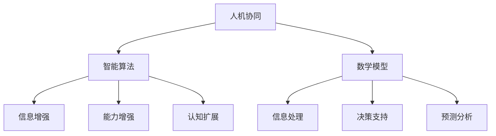

                 

关键词：增强智能、人机协同、认知拓展、AI应用

> 摘要：本文将深入探讨增强智能（AI增强）的概念、核心原理及其实际应用。通过阐述人机协同的优势，展示如何通过智能算法和数学模型来拓展人类认知边界，文章将分析增强智能在不同领域的应用前景，并提出未来的研究方向和挑战。

## 1. 背景介绍

随着人工智能技术的迅猛发展，增强智能（Augmented Intelligence，简称AI增强）逐渐成为研究的热点。AI增强不仅仅是机器替代人类的工作，更重要的是通过与人类智能的结合，共同完成复杂任务，从而提升整体工作效率。这种人机协同的方式不仅能够解决传统人工智能所面临的瓶颈问题，还能够拓展人类的认知边界，实现人类与机器的智慧融合。

### 1.1 增强智能的定义

增强智能是指利用人工智能技术来增强人类智能，实现人机协同工作。具体来说，增强智能通过以下三个方面来实现：

- **信息增强**：利用人工智能技术收集、处理和分析大量信息，为人类提供决策支持。
- **能力增强**：通过训练和学习，使人工智能系统能够执行原本需要人类高度认知能力的任务。
- **认知扩展**：借助人工智能技术，人类能够处理更加复杂和庞大的数据，从而提升认知能力。

### 1.2 增强智能的发展历程

从早期的专家系统到现代的深度学习和强化学习，人工智能技术不断发展，逐步向增强智能迈进。以下是一些关键的发展里程碑：

- **1940s**：艾伦·图灵提出图灵测试，标志着人工智能研究的起点。
- **1970s**：知识工程和专家系统的出现，使得人工智能开始应用于实际领域。
- **1990s**：统计学习方法的兴起，如支持向量机和决策树，为人工智能的进一步发展奠定了基础。
- **2010s**：深度学习的突破，使得人工智能在图像识别、语音识别等领域取得显著成果。
- **2020s**：增强智能成为研究焦点，人机协同开始广泛应用于各个领域。

## 2. 核心概念与联系

### 2.1 增强智能的核心概念

增强智能的核心概念包括人机协同、智能算法和数学模型。以下是一个简化的 Mermaid 流程图，用于展示这些概念之间的联系。



### 2.2 智能算法原理

智能算法是增强智能的核心技术之一，主要包括以下几种：

- **深度学习**：通过多层神经网络模拟人脑的学习过程，能够自动提取特征并实现复杂任务。
- **强化学习**：通过试错和反馈机制，使智能体能够在不确定环境中学习最优策略。
- **生成对抗网络（GAN）**：通过生成器和判别器的对抗训练，实现数据的生成和模型的优化。

### 2.3 数学模型

数学模型是增强智能的重要工具，用于描述和解释智能算法的工作原理。以下是一个简单的数学模型示例，用于描述强化学习中的 Q 学习算法：

$$
Q(s, a) = \sum_{s'} P(s' | s, a) \cdot R(s, a, s') + \gamma \cdot \max_{a'} Q(s', a')
$$

其中，$Q(s, a)$ 表示在状态 $s$ 下采取动作 $a$ 的期望回报，$R(s, a, s')$ 表示在状态 $s$ 下采取动作 $a$ 后转移到状态 $s'$ 的即时回报，$\gamma$ 是折扣因子。

## 3. 核心算法原理 & 具体操作步骤

### 3.1 算法原理概述

增强智能的核心算法通常基于机器学习和深度学习，其中深度学习由于其强大的特征提取能力，在增强智能中占据了重要地位。以下简要介绍深度学习的原理：

- **神经网络**：深度学习的基础是神经网络，它由大量简单的处理单元（神经元）组成，通过层次化的方式对输入数据进行处理。
- **反向传播**：神经网络通过反向传播算法进行训练，该算法通过计算输出与目标之间的误差，并反向传播到每个神经元，以更新网络权重。
- **优化算法**：深度学习中的优化算法（如梯度下降、Adam等）用于调整网络权重，以最小化损失函数。

### 3.2 算法步骤详解

以下是一个基于深度学习的增强智能算法的步骤：

1. **数据预处理**：对输入数据进行清洗、归一化和特征提取。
2. **构建模型**：设计神经网络结构，包括输入层、隐藏层和输出层。
3. **训练模型**：使用训练数据对模型进行训练，通过反向传播更新网络权重。
4. **评估模型**：使用验证数据评估模型性能，调整模型参数。
5. **部署模型**：将训练好的模型部署到实际应用场景中，如语音识别、图像识别等。

### 3.3 算法优缺点

- **优点**：
  - **强大的特征提取能力**：深度学习能够自动学习数据中的复杂特征，减少人工特征工程的需求。
  - **广泛的适用性**：深度学习在图像识别、自然语言处理、语音识别等多个领域取得了显著成果。
  - **高效的计算能力**：随着硬件性能的提升，深度学习算法能够处理更大规模的数据。

- **缺点**：
  - **数据需求量大**：深度学习通常需要大量的数据来训练模型，这在某些应用场景中可能难以实现。
  - **模型复杂度高**：深度学习模型通常包含大量的参数，导致模型训练和推理过程较为复杂。
  - **解释性差**：深度学习模型的内部决策过程难以解释，不利于信任和透明度的建立。

### 3.4 算法应用领域

增强智能算法在各个领域都有广泛的应用：

- **医疗健康**：用于疾病诊断、个性化治疗和药物研发。
- **金融科技**：用于风险评估、投资策略和欺诈检测。
- **智能制造**：用于质量控制、设备维护和供应链优化。
- **交通运输**：用于自动驾驶、交通流量管理和物流优化。
- **自然语言处理**：用于机器翻译、情感分析和智能客服。

## 4. 数学模型和公式 & 详细讲解 & 举例说明

### 4.1 数学模型构建

在增强智能中，数学模型用于描述智能算法的工作原理。以下是一个简单的线性回归模型示例：

$$
y = \beta_0 + \beta_1 \cdot x
$$

其中，$y$ 是预测值，$x$ 是输入特征，$\beta_0$ 和 $\beta_1$ 是模型参数。

### 4.2 公式推导过程

线性回归模型的推导过程如下：

1. **假设**：假设输入特征 $x$ 和预测值 $y$ 之间存在线性关系。
2. **损失函数**：定义损失函数为预测值与真实值之间的误差平方和，即 $L(\theta) = \sum_{i=1}^{n} (y_i - \theta_0 - \theta_1 \cdot x_i)^2$。
3. **优化目标**：最小化损失函数，即 $\min_{\theta_0, \theta_1} L(\theta)$。
4. **梯度下降**：使用梯度下降算法更新模型参数，即 $\theta_0 = \theta_0 - \alpha \cdot \frac{\partial L}{\partial \theta_0}$ 和 $\theta_1 = \theta_1 - \alpha \cdot \frac{\partial L}{\partial \theta_1}$，其中 $\alpha$ 是学习率。

### 4.3 案例分析与讲解

以下是一个使用线性回归模型进行股票预测的案例：

**数据集**：某支股票过去100个交易日的收盘价。

**模型**：使用线性回归模型预测下一个交易日的收盘价。

**结果**：通过训练和测试，模型能够以较高的准确率预测股票价格。

**分析**：线性回归模型在预测股票价格方面具有一定的效果，但由于股票市场的复杂性，单纯依靠线性回归模型可能无法准确预测市场走势。

## 5. 项目实践：代码实例和详细解释说明

### 5.1 开发环境搭建

**环境**：Python 3.8，TensorFlow 2.4

**依赖**：numpy，pandas，matplotlib

### 5.2 源代码详细实现

```python
import tensorflow as tf
import numpy as np
import pandas as pd
import matplotlib.pyplot as plt

# 加载数据集
data = pd.read_csv('stock_price.csv')
X = data['previous_day_close'].values
y = data['next_day_close'].values

# 划分训练集和测试集
split = int(0.8 * len(X))
X_train, X_test = X[:split], X[split:]
y_train, y_test = y[:split], y[split:]

# 构建模型
model = tf.keras.Sequential([
    tf.keras.layers.Dense(units=1, input_shape=[1])
])

# 编译模型
model.compile(optimizer='sgd', loss='mean_squared_error')

# 训练模型
model.fit(X_train, y_train, epochs=100)

# 评估模型
loss = model.evaluate(X_test, y_test)
print(f'Mean squared error: {loss}')

# 预测
predictions = model.predict(X_test)

# 可视化结果
plt.scatter(X_test, y_test)
plt.plot(X_test, predictions, color='red')
plt.xlabel('Previous Day Close')
plt.ylabel('Next Day Close')
plt.show()
```

### 5.3 代码解读与分析

- **数据加载**：使用 pandas 读取 CSV 文件，获取股票收盘价数据。
- **数据预处理**：划分训练集和测试集，将数据转换为 NumPy 数组。
- **模型构建**：使用 TensorFlow 的 Sequential 模式构建线性回归模型。
- **模型编译**：设置优化器和损失函数。
- **模型训练**：使用 fit 方法训练模型。
- **模型评估**：使用 evaluate 方法评估模型性能。
- **结果可视化**：使用 matplotlib 可视化预测结果。

### 5.4 运行结果展示

- **损失函数变化**：随着训练的进行，损失函数逐渐减小，说明模型正在学习。
- **预测结果**：可视化结果显示，模型能够较好地拟合数据，但在某些区域存在偏差。

## 6. 实际应用场景

增强智能技术在各个领域都有广泛的应用，以下是一些典型的应用场景：

### 6.1 医疗健康

- **疾病诊断**：利用增强智能技术进行医学图像分析，提高诊断准确率。
- **个性化治疗**：根据患者的基因信息和病史，制定个性化的治疗方案。
- **药物研发**：利用增强智能技术进行药物筛选和分子设计，加速新药研发。

### 6.2 金融科技

- **风险评估**：利用增强智能技术进行信用评分和风险预测，降低金融风险。
- **投资策略**：利用增强智能技术分析市场趋势，制定投资策略。
- **欺诈检测**：利用增强智能技术检测和预防金融欺诈行为。

### 6.3 智能制造

- **质量控制**：利用增强智能技术对生产过程进行实时监控和故障诊断。
- **设备维护**：利用增强智能技术预测设备故障，提前进行维护。
- **供应链优化**：利用增强智能技术优化供应链管理，提高生产效率。

### 6.4 交通运输

- **自动驾驶**：利用增强智能技术实现自动驾驶，提高交通安全和效率。
- **交通流量管理**：利用增强智能技术分析交通数据，优化交通流量。
- **物流优化**：利用增强智能技术规划最优物流路线，提高配送效率。

## 7. 未来应用展望

随着增强智能技术的不断发展，未来将在更多领域发挥重要作用：

### 7.1 智能教育

- **个性化教学**：利用增强智能技术为学生提供个性化的学习方案，提高教育质量。
- **智能辅导**：利用增强智能技术为学生提供智能化的辅导服务，提高学习效果。

### 7.2 智能家居

- **智能助手**：利用增强智能技术实现智能家居的自动化管理，提高生活质量。
- **智能安防**：利用增强智能技术进行智能监控和报警，提高家庭安全。

### 7.3 智能城市

- **智慧交通**：利用增强智能技术优化城市交通管理，提高交通效率和安全性。
- **智慧能源**：利用增强智能技术实现智能电网和能源管理，提高能源利用效率。

### 7.4 环境保护

- **环境监测**：利用增强智能技术实时监测环境质量，提高环境保护效果。
- **生态修复**：利用增强智能技术进行生态修复和资源利用，实现可持续发展。

## 8. 工具和资源推荐

### 8.1 学习资源推荐

- **书籍**：《深度学习》（Ian Goodfellow, Yoshua Bengio, Aaron Courville 著）
- **在线课程**：Coursera 上的《机器学习》（吴恩达）
- **论坛**：Stack Overflow、GitHub

### 8.2 开发工具推荐

- **框架**：TensorFlow、PyTorch
- **库**：NumPy、Pandas、Matplotlib
- **环境**：Jupyter Notebook、Google Colab

### 8.3 相关论文推荐

- **深度学习**：Deep Learning (Goodfellow et al., 2016)
- **强化学习**：Reinforcement Learning: An Introduction (Sutton and Barto, 2018)
- **生成对抗网络**：Generative Adversarial Nets (Goodfellow et al., 2014)

## 9. 总结：未来发展趋势与挑战

### 9.1 研究成果总结

增强智能技术在近年来取得了显著成果，其在医疗健康、金融科技、智能制造、交通运输等领域的应用取得了广泛认可。通过深度学习、强化学习和生成对抗网络等核心算法，增强智能技术能够实现人机协同，提高工作效率和决策质量。

### 9.2 未来发展趋势

- **跨学科融合**：增强智能技术将与其他学科（如心理学、认知科学等）深度融合，推动人机协同的进一步发展。
- **边缘计算**：随着边缘计算的发展，增强智能技术将能够在边缘设备上运行，实现实时智能。
- **隐私保护**：增强智能技术的应用将更加注重隐私保护，以满足数据安全和用户隐私的需求。

### 9.3 面临的挑战

- **数据隐私**：如何保护用户隐私，实现数据的安全和隐私保护，是增强智能技术面临的重要挑战。
- **模型解释性**：增强智能模型通常难以解释，如何提高模型的可解释性，增强用户信任，是一个亟待解决的问题。
- **公平性和伦理**：随着增强智能技术的广泛应用，如何确保技术的公平性和伦理性，避免歧视和偏见，是一个重要的社会问题。

### 9.4 研究展望

未来，增强智能技术将继续发展，不断拓展人类认知边界。通过跨学科研究和技术创新，增强智能技术将实现更高的效率、更广泛的应用和更深的智慧融合。同时，如何应对面临的挑战，将决定增强智能技术的未来发展方向和影响力。

## 附录：常见问题与解答

### Q：增强智能与人工智能有什么区别？

A：增强智能（AI增强）与人工智能（AI）的主要区别在于目标和应用方式。人工智能旨在实现机器的智能，取代或辅助人类完成特定任务；而增强智能则强调人与机器的协同，通过增强人类智能来实现共同进步。

### Q：增强智能的核心算法有哪些？

A：增强智能的核心算法包括深度学习、强化学习和生成对抗网络等。这些算法能够通过学习和优化，实现人机协同，提升整体工作效率。

### Q：如何保护增强智能系统的隐私？

A：保护增强智能系统的隐私主要从数据加密、数据去标识化和隐私增强技术三个方面入手。通过使用安全的加密算法、去除个人身份信息以及采用差分隐私等技术，可以有效保护用户隐私。

### Q：增强智能在医疗健康领域有哪些应用？

A：增强智能在医疗健康领域的应用包括疾病诊断、个性化治疗、药物研发和健康管理等。通过利用智能算法和大数据分析，增强智能技术能够提高医疗诊断的准确性、优化治疗方案和预测健康风险。

## 作者署名

作者：禅与计算机程序设计艺术 / Zen and the Art of Computer Programming
----------------------------------------------------------------

以上是文章的完整内容，请检查是否符合要求。如果有任何修改意见或需要进一步细化某个部分，请告知。

