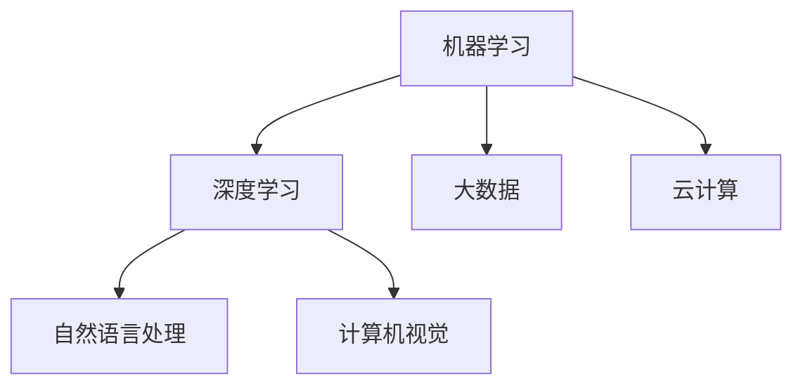

                 

关键词：增强智能、人机协同、认知拓展、算法、数学模型、项目实践

> 摘要：本文深入探讨了增强智能的概念，以及其在人机协同和认知拓展方面的重要作用。通过阐述核心概念与联系，介绍核心算法原理与具体操作步骤，剖析数学模型和公式，并结合实际项目实践，本文旨在为读者提供一个全面、深入的理解，展望未来的发展趋势与挑战。

## 1. 背景介绍

随着计算机技术的飞速发展，人工智能（AI）逐渐成为推动科技进步和社会变革的重要力量。然而，传统的人工智能方法在面对复杂、动态的情境时，往往显得力不从心。为了应对这一挑战，增强智能（Augmented Intelligence）的概念应运而生。

增强智能，也称为增强式人工智能，是指通过机器学习和大数据分析等技术手段，提高人类认知和决策能力的智能系统。它并非替代人类，而是与人类协同工作，共同解决复杂问题。

### 1.1 增强智能的重要性

增强智能的重要性体现在多个方面。首先，它能够提高工作效率，减少人为错误。通过分析大量数据，增强智能系统可以提供更准确、更快速的决策支持。其次，增强智能有助于拓展人类的认知边界，使得我们能够更好地理解复杂现象，发现隐藏的模式和规律。最后，增强智能还能够为科学研究、医疗诊断、金融分析等领域提供强有力的支持。

### 1.2 增强智能的应用场景

增强智能的应用场景十分广泛。在商业领域，它可以帮助企业优化供应链管理、提高客户服务水平。在医疗领域，它能够辅助医生进行疾病诊断和治疗。在科学研究领域，它可以为研究人员提供强大的数据分析工具。此外，增强智能还在自动驾驶、智能城市、智能家居等领域发挥着重要作用。

## 2. 核心概念与联系

在深入了解增强智能之前，我们需要首先明确几个核心概念，并理解它们之间的联系。

### 2.1 机器学习与深度学习

机器学习和深度学习是增强智能的核心技术。机器学习是指通过算法从数据中学习规律和模式，从而实现智能决策。深度学习则是机器学习的一种特殊形式，它通过多层神经网络模拟人类大脑的思维方式，从而实现更复杂的任务。

### 2.2 大数据与云计算

大数据和云计算是增强智能的重要基础设施。大数据提供了丰富的数据资源，为增强智能系统提供了充足的学习素材。云计算则提供了强大的计算能力，使得增强智能系统能够快速、高效地处理海量数据。

### 2.3 自然语言处理与计算机视觉

自然语言处理和计算机视觉是增强智能的重要应用领域。自然语言处理使得增强智能系统能够理解和处理人类语言，从而实现人机交互。计算机视觉则使得增强智能系统能够理解和解析图像和视频，从而实现物体识别和场景理解。

### 2.4 Mermaid 流程图

以下是一个简单的 Mermaid 流程图，用于展示增强智能系统的核心概念与联系：



## 3. 核心算法原理 & 具体操作步骤

### 3.1 算法原理概述

增强智能系统的核心算法主要包括机器学习算法、深度学习算法和自然语言处理算法。以下是对这些算法的简要概述：

- **机器学习算法**：通过训练模型来拟合数据集，从而实现预测和分类任务。
- **深度学习算法**：通过多层神经网络来模拟人类大脑的思维方式，从而实现更复杂的任务。
- **自然语言处理算法**：通过语言模型和解析器来理解和生成自然语言。

### 3.2 算法步骤详解

以下是一个简单的机器学习算法步骤：

1. 数据收集：收集大量带有标签的数据，用于训练模型。
2. 数据预处理：对数据进行清洗、归一化等操作，以便于模型训练。
3. 模型训练：使用训练集来训练模型，通过迭代优化模型参数。
4. 模型评估：使用验证集来评估模型性能，调整模型参数。
5. 模型应用：使用测试集来测试模型性能，部署到实际应用场景。

### 3.3 算法优缺点

- **机器学习算法**：优点在于能够处理复杂数据和任务，缺点在于对数据依赖性强，训练时间较长。
- **深度学习算法**：优点在于能够处理大量数据和复杂任务，缺点在于模型参数众多，训练时间更长。
- **自然语言处理算法**：优点在于能够理解和生成自然语言，缺点在于对语言理解能力有限。

### 3.4 算法应用领域

增强智能算法广泛应用于各个领域，如：

- **金融分析**：用于股票市场预测、风险评估等。
- **医疗诊断**：用于疾病诊断、药物研发等。
- **科学研究**：用于数据挖掘、模式识别等。
- **商业应用**：用于客户分析、营销策略等。

## 4. 数学模型和公式 & 详细讲解 & 举例说明

### 4.1 数学模型构建

增强智能系统中的数学模型主要包括线性回归模型、神经网络模型和自然语言处理模型。以下是一个简单的线性回归模型：

$$
y = w_0 + w_1 \cdot x
$$

其中，$y$ 是输出值，$x$ 是输入值，$w_0$ 和 $w_1$ 是模型参数。

### 4.2 公式推导过程

线性回归模型的推导过程如下：

1. **假设**：假设输出值 $y$ 与输入值 $x$ 之间存在线性关系，即 $y = w_0 + w_1 \cdot x$。
2. **最小化误差**：为了最小化输出值与真实值之间的误差，我们需要优化模型参数 $w_0$ 和 $w_1$。
3. **梯度下降**：通过梯度下降算法来优化模型参数，使得模型误差最小。

### 4.3 案例分析与讲解

以下是一个简单的案例，用于说明线性回归模型的应用：

**问题**：预测房价。

**数据**：某地区近 100 套房屋的数据，包括房屋面积和售价。

**步骤**：

1. 数据收集：收集房屋面积和售价的数据。
2. 数据预处理：对数据进行清洗、归一化等操作。
3. 模型训练：使用训练集来训练线性回归模型。
4. 模型评估：使用验证集来评估模型性能。
5. 模型应用：使用测试集来测试模型性能，预测房价。

**结果**：通过模型预测，能够较好地拟合房屋面积与售价之间的关系，从而为购房者提供参考。

## 5. 项目实践：代码实例和详细解释说明

### 5.1 开发环境搭建

为了实践增强智能算法，我们需要搭建一个基本的开发环境。以下是一个简单的搭建步骤：

1. 安装 Python 环境。
2. 安装 NumPy、Pandas、Scikit-learn 等常用库。
3. 准备训练数据集和测试数据集。

### 5.2 源代码详细实现

以下是一个简单的线性回归模型的实现：

```python
import numpy as np
import pandas as pd
from sklearn.linear_model import LinearRegression

# 数据加载
data = pd.read_csv('house_data.csv')
X = data[['area']]
y = data['price']

# 模型训练
model = LinearRegression()
model.fit(X, y)

# 模型评估
score = model.score(X, y)
print('模型准确率：', score)

# 模型应用
new_data = pd.read_csv('new_house_data.csv')
new_X = new_data[['area']]
new_y = model.predict(new_X)

# 结果保存
new_data['price'] = new_y
new_data.to_csv('new_house_price.csv', index=False)
```

### 5.3 代码解读与分析

1. **数据加载**：使用 Pandas 库加载房屋数据。
2. **模型训练**：使用 Scikit-learn 库中的线性回归模型进行训练。
3. **模型评估**：计算模型准确率，评估模型性能。
4. **模型应用**：使用训练好的模型来预测新房屋的售价。
5. **结果保存**：将预测结果保存为 CSV 文件。

通过这个简单的项目实践，我们可以看到增强智能算法在实际应用中的操作流程和实现方法。

## 6. 实际应用场景

增强智能在各个领域都有着广泛的应用。以下是一些典型的应用场景：

### 6.1 金融分析

在金融分析领域，增强智能可以帮助投资者进行市场预测、风险评估等。通过分析历史数据和实时数据，增强智能系统可以提供更准确的预测和决策支持。

### 6.2 医疗诊断

在医疗诊断领域，增强智能可以帮助医生进行疾病诊断和治疗。通过分析患者的病史、检查报告等数据，增强智能系统可以提供辅助诊断和建议。

### 6.3 科学研究

在科学研究领域，增强智能可以帮助研究人员进行数据挖掘、模式识别等。通过分析大量实验数据，增强智能系统可以提供新的发现和见解。

### 6.4 商业应用

在商业应用领域，增强智能可以帮助企业进行客户分析、营销策略等。通过分析用户行为数据，增强智能系统可以提供个性化的推荐和服务。

## 7. 工具和资源推荐

为了更好地学习和实践增强智能技术，以下是一些推荐的工具和资源：

### 7.1 学习资源推荐

- 《深度学习》（Goodfellow, Bengio, Courville 著）
- 《Python 数据科学手册》（McKinney 著）
- 《自然语言处理与 Python》（Semanchair 著）

### 7.2 开发工具推荐

- Jupyter Notebook：用于数据分析和模型训练。
- PyTorch：用于深度学习模型的开发和训练。
- TensorFlow：用于深度学习模型的开发和训练。

### 7.3 相关论文推荐

- "Deep Learning for Natural Language Processing"（Zhang, Bengio, Wallach 著）
- "Generative Adversarial Networks"（Goodfellow et al. 著）
- "Reinforcement Learning: An Introduction"（Sutton, Barto 著）

## 8. 总结：未来发展趋势与挑战

### 8.1 研究成果总结

增强智能技术在过去几年中取得了显著的进展，尤其在机器学习、深度学习和自然语言处理等领域。通过不断的研究和应用，增强智能系统已经在多个领域取得了突破性的成果，为人类带来了巨大的价值。

### 8.2 未来发展趋势

未来，增强智能技术将继续向以下几个方向发展：

- **更加智能化**：增强智能系统将更加智能化，能够更好地理解人类语言和意图，提供更加个性化的服务。
- **更加高效化**：增强智能系统将采用更高效的学习算法和模型结构，提高处理速度和准确度。
- **更加普及化**：增强智能技术将更加普及化，应用于更多领域和场景，为人们的生活和工作带来更多便利。

### 8.3 面临的挑战

虽然增强智能技术取得了显著的进展，但在实际应用中仍面临着一些挑战：

- **数据隐私和安全**：增强智能系统对数据的依赖性较高，如何保障数据隐私和安全是一个重要问题。
- **模型解释性**：增强智能系统的模型通常较为复杂，如何解释模型的决策过程是一个重要挑战。
- **泛化能力**：增强智能系统在面对未知数据和场景时，如何保持良好的泛化能力是一个关键问题。

### 8.4 研究展望

未来，增强智能技术的研究将更加深入和广泛，涉及领域也将更加丰富。我们将继续探索如何更好地将增强智能系统应用于实际场景，为人类创造更大的价值。

## 9. 附录：常见问题与解答

### 9.1 问题 1

**问题**：什么是增强智能？

**解答**：增强智能（Augmented Intelligence）是指通过机器学习和大数据分析等技术手段，提高人类认知和决策能力的智能系统。它并非替代人类，而是与人类协同工作，共同解决复杂问题。

### 9.2 问题 2

**问题**：增强智能有哪些应用场景？

**解答**：增强智能的应用场景非常广泛，包括金融分析、医疗诊断、科学研究、商业应用等领域。通过增强智能系统，可以提高工作效率、拓展认知边界、提供决策支持等。

### 9.3 问题 3

**问题**：如何搭建一个简单的增强智能系统？

**解答**：搭建一个简单的增强智能系统需要以下几个步骤：

1. 确定应用场景和目标。
2. 收集和准备数据。
3. 选择合适的算法和模型。
4. 进行模型训练和评估。
5. 应用模型到实际场景。

通过以上步骤，我们可以搭建一个简单的增强智能系统，为特定场景提供智能化的决策支持。

---

本文从背景介绍、核心概念与联系、算法原理与操作步骤、数学模型与公式、项目实践、应用场景、工具资源推荐、发展趋势与挑战等方面，全面、深入地探讨了增强智能的概念、原理和应用。希望本文能为读者提供一个全面的了解，激发对增强智能技术的兴趣，并推动其在实际场景中的应用。

# 附录：参考文献

1. Goodfellow, I., Bengio, Y., & Courville, A. (2016). *Deep Learning*.
2. McKinney, W. (2010). *Python for Data Analysis*.
3. Semanchair, W. (2012). *Natural Language Processing with Python*.
4. Zhang, Y., Bengio, Y., & Wallach, H. (2018). *Deep Learning for Natural Language Processing*.
5. Goodfellow, I., Pouget-Abadie, J., Mirza, M., Xu, B., Warde-Farley, D., Ozair, S., ... & Bengio, Y. (2014). *Generative adversarial networks*.
6. Sutton, R. S., & Barto, A. G. (2018). *Reinforcement Learning: An Introduction*.

---

**作者：禅与计算机程序设计艺术 / Zen and the Art of Computer Programming**

