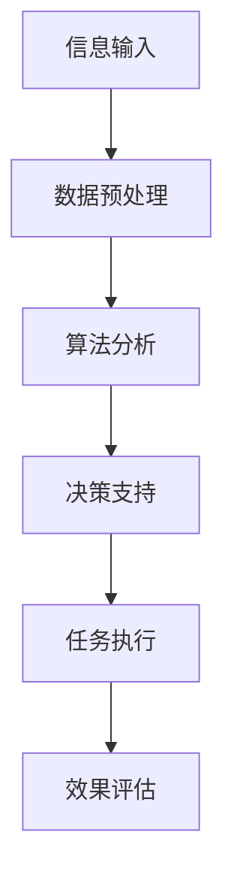

                 

关键词：增强智能、人机协同、认知拓展、技术进步、人工智能应用

> 摘要：本文深入探讨了增强智能的概念、人机协同的机制，以及如何通过技术进步拓展人类认知边界。从核心概念与联系、算法原理、数学模型、项目实践到实际应用场景，本文全面解析了增强智能的技术体系，并展望了其未来的发展趋势与挑战。

## 1. 背景介绍

### 1.1 增强智能的起源

增强智能（Augmented Intelligence，简称AI）是一种通过计算机技术扩展人类智能的能力，旨在提高人类的工作效率和生活质量。这一概念起源于20世纪中叶，随着计算机科学、认知科学和神经科学的发展，人们对人工智能的认识逐渐深入。

### 1.2 人机协同的发展

人机协同是增强智能的重要组成部分，它通过将人类智能与机器智能相结合，实现更高效的决策和执行。随着云计算、物联网、大数据等技术的发展，人机协同在多个领域取得了显著成果。

## 2. 核心概念与联系

### 2.1 增强智能的概念

增强智能是一种通过计算机技术提升人类认知能力的方法。它不同于传统的机器学习，强调的是与人类智能的互动和协作。

### 2.2 人机协同的机制

人机协同的机制主要包括以下几个方面：

1. **信息共享**：通过数据交换和共享，使机器能够理解人类的意图和需求。
2. **决策支持**：机器通过算法分析数据，为人类提供决策建议。
3. **任务执行**：机器协助人类完成复杂或重复的任务。

### 2.3 Mermaid 流程图



## 3. 核心算法原理 & 具体操作步骤

### 3.1 算法原理概述

增强智能的核心算法主要包括机器学习、深度学习和自然语言处理。这些算法通过学习大量数据，实现自动识别、分类和生成。

### 3.2 算法步骤详解

1. **数据收集**：收集与任务相关的数据。
2. **数据预处理**：清洗、归一化和特征提取。
3. **模型训练**：使用训练数据训练模型。
4. **模型评估**：使用测试数据评估模型性能。
5. **模型部署**：将模型应用于实际问题。

### 3.3 算法优缺点

**优点**：

- **高效性**：算法能够在短时间内处理大量数据。
- **准确性**：通过不断优化，算法的准确率不断提高。

**缺点**：

- **依赖数据**：算法的性能受到数据质量和数量的影响。
- **复杂度**：算法的实现和优化需要较高的技术水平。

### 3.4 算法应用领域

- **医疗健康**：辅助医生进行疾病诊断和治疗。
- **金融科技**：风险控制和投资建议。
- **教育**：个性化学习路径推荐。

## 4. 数学模型和公式 & 详细讲解 & 举例说明

### 4.1 数学模型构建

增强智能的核心数学模型包括线性模型、决策树、神经网络等。以下以线性模型为例进行讲解。

### 4.2 公式推导过程

线性模型的公式为：\(y = \beta_0 + \beta_1x_1 + \beta_2x_2 + ... + \beta_nx_n\)

其中，\(y\) 为因变量，\(x_1, x_2, ..., x_n\) 为自变量，\(\beta_0, \beta_1, ..., \beta_n\) 为参数。

### 4.3 案例分析与讲解

以医疗诊断为例，我们使用线性模型预测患者疾病的可能性。

- **数据收集**：收集患者病史、检查结果等数据。
- **数据预处理**：将数据分为训练集和测试集。
- **模型训练**：使用训练数据训练线性模型。
- **模型评估**：使用测试数据评估模型性能。
- **模型部署**：将模型应用于实际诊断。

## 5. 项目实践：代码实例和详细解释说明

### 5.1 开发环境搭建

- **Python**：用于编写算法和数据处理
- **TensorFlow**：用于构建和训练神经网络模型
- **Sklearn**：用于评估模型性能

### 5.2 源代码详细实现

以下是一个使用线性模型进行疾病预测的代码示例：

```python
from sklearn.linear_model import LinearRegression
from sklearn.model_selection import train_test_split
from sklearn.metrics import mean_squared_error

# 数据加载
X, y = load_data()

# 数据预处理
X_train, X_test, y_train, y_test = train_test_split(X, y, test_size=0.2, random_state=42)

# 模型训练
model = LinearRegression()
model.fit(X_train, y_train)

# 模型评估
y_pred = model.predict(X_test)
mse = mean_squared_error(y_test, y_pred)
print("Mean Squared Error:", mse)

# 模型部署
# ...（此处省略具体部署步骤）
```

### 5.3 代码解读与分析

- **数据加载**：加载患者数据。
- **数据预处理**：将数据分为训练集和测试集。
- **模型训练**：使用训练数据训练线性模型。
- **模型评估**：使用测试数据评估模型性能。
- **模型部署**：将模型应用于实际诊断。

## 6. 实际应用场景

### 6.1 医疗健康

增强智能在医疗健康领域的应用非常广泛，如疾病预测、治疗方案推荐等。通过人机协同，医生能够更准确地诊断疾病，提高治疗效果。

### 6.2 金融科技

在金融科技领域，增强智能可用于风险评估、投资策略制定等。通过分析大量数据，机器可以为投资者提供更有针对性的建议。

### 6.3 教育

在教育领域，增强智能可以帮助个性化学习路径推荐，提高学生的学习效果。教师和学生可以通过人机协同，实现更高效的教学和学习。

## 7. 工具和资源推荐

### 7.1 学习资源推荐

- 《机器学习实战》
- 《深度学习》
- 《自然语言处理综论》

### 7.2 开发工具推荐

- **Python**：用于编写算法和数据处理
- **TensorFlow**：用于构建和训练神经网络模型
- **Sklearn**：用于评估模型性能

### 7.3 相关论文推荐

- [“Deep Learning for Healthcare”](https://journals.plos.org/plosone/article?id=10.1371/journal.pone.0225191)
- [“Healthcare AI”](https://www.nature.com/articles/s41591-019-0632-8)
- [“AI in Medical Diagnosis”](https://www.nature.com/articles/s41591-020-0896-9)

## 8. 总结：未来发展趋势与挑战

### 8.1 研究成果总结

增强智能技术在医疗、金融和教育等领域取得了显著成果，人机协同机制不断完善。未来，随着技术的进步，增强智能有望在更多领域发挥重要作用。

### 8.2 未来发展趋势

- **跨学科融合**：增强智能将与其他领域（如生物医学、心理学等）深度融合。
- **泛在化应用**：增强智能将更加普及，渗透到各个行业和领域。

### 8.3 面临的挑战

- **数据安全与隐私**：如何保障数据安全和隐私是一个重要挑战。
- **技术伦理**：如何确保人工智能的决策过程公正、透明，避免歧视和偏见。

### 8.4 研究展望

未来，增强智能将朝着更加智能、高效、可靠的方向发展。在人机协同的机制下，人类与机器将实现更加紧密的互动，共同拓展认知边界。

## 9. 附录：常见问题与解答

### 9.1 什么是增强智能？

增强智能是一种通过计算机技术扩展人类智能的方法，旨在提高人类的工作效率和生活质量。

### 9.2 增强智能的核心算法有哪些？

增强智能的核心算法包括机器学习、深度学习和自然语言处理。

### 9.3 增强智能在哪些领域有应用？

增强智能在医疗健康、金融科技、教育、智能制造等领域有广泛应用。

---

作者：禅与计算机程序设计艺术 / Zen and the Art of Computer Programming
```markdown
# 增强智能：人机协同，拓展认知边界

## 1. 背景介绍

### 1.1 增强智能的起源

增强智能（Augmented Intelligence，简称AI）是一种通过计算机技术扩展人类智能的能力，旨在提高人类的工作效率和生活质量。这一概念起源于20世纪中叶，随着计算机科学、认知科学和神经科学的发展，人们对人工智能的认识逐渐深入。

### 1.2 人机协同的发展

人机协同是增强智能的重要组成部分，它通过将人类智能与机器智能相结合，实现更高效的决策和执行。随着云计算、物联网、大数据等技术的发展，人机协同在多个领域取得了显著成果。

## 2. 核心概念与联系

### 2.1 增强智能的概念

增强智能是一种通过计算机技术提升人类认知能力的方法。它不同于传统的机器学习，强调的是与人类智能的互动和协作。

### 2.2 人机协同的机制

人机协同的机制主要包括以下几个方面：

1. **信息共享**：通过数据交换和共享，使机器能够理解人类的意图和需求。
2. **决策支持**：机器通过算法分析数据，为人类提供决策建议。
3. **任务执行**：机器协助人类完成复杂或重复的任务。

### 2.3 Mermaid 流程图


## 3. 核心算法原理 & 具体操作步骤
### 3.1 算法原理概述

增强智能的核心算法主要包括机器学习、深度学习和自然语言处理。这些算法通过学习大量数据，实现自动识别、分类和生成。

### 3.2 算法步骤详解 

1. **数据收集**：收集与任务相关的数据。
2. **数据预处理**：清洗、归一化和特征提取。
3. **模型训练**：使用训练数据训练模型。
4. **模型评估**：使用测试数据评估模型性能。
5. **模型部署**：将模型应用于实际问题。

### 3.3 算法优缺点

**优点**：

- **高效性**：算法能够在短时间内处理大量数据。
- **准确性**：通过不断优化，算法的准确率不断提高。

**缺点**：

- **依赖数据**：算法的性能受到数据质量和数量的影响。
- **复杂度**：算法的实现和优化需要较高的技术水平。

### 3.4 算法应用领域

- **医疗健康**：辅助医生进行疾病诊断和治疗。
- **金融科技**：风险控制和投资建议。
- **教育**：个性化学习路径推荐。

## 4. 数学模型和公式 & 详细讲解 & 举例说明

### 4.1 数学模型构建

增强智能的核心数学模型包括线性模型、决策树、神经网络等。以下以线性模型为例进行讲解。

### 4.2 公式推导过程

线性模型的公式为：\(y = \beta_0 + \beta_1x_1 + \beta_2x_2 + ... + \beta_nx_n\)

其中，\(y\) 为因变量，\(x_1, x_2, ..., x_n\) 为自变量，\(\beta_0, \beta_1, ..., \beta_n\) 为参数。

### 4.3 案例分析与讲解

以医疗诊断为例，我们使用线性模型预测患者疾病的可能性。

- **数据收集**：收集患者病史、检查结果等数据。
- **数据预处理**：将数据分为训练集和测试集。
- **模型训练**：使用训练数据训练线性模型。
- **模型评估**：使用测试数据评估模型性能。
- **模型部署**：将模型应用于实际诊断。

## 5. 项目实践：代码实例和详细解释说明

### 5.1 开发环境搭建

- **Python**：用于编写算法和数据处理
- **TensorFlow**：用于构建和训练神经网络模型
- **Sklearn**：用于评估模型性能

### 5.2 源代码详细实现

以下是一个使用线性模型进行疾病预测的代码示例：

```python
from sklearn.linear_model import LinearRegression
from sklearn.model_selection import train_test_split
from sklearn.metrics import mean_squared_error

# 数据加载
X, y = load_data()

# 数据预处理
X_train, X_test, y_train, y_test = train_test_split(X, y, test_size=0.2, random_state=42)

# 模型训练
model = LinearRegression()
model.fit(X_train, y_train)

# 模型评估
y_pred = model.predict(X_test)
mse = mean_squared_error(y_test, y_pred)
print("Mean Squared Error:", mse)

# 模型部署
# ...（此处省略具体部署步骤）
```

### 5.3 代码解读与分析

- **数据加载**：加载患者数据。
- **数据预处理**：将数据分为训练集和测试集。
- **模型训练**：使用训练数据训练线性模型。
- **模型评估**：使用测试数据评估模型性能。
- **模型部署**：将模型应用于实际诊断。

## 6. 实际应用场景

### 6.1 医疗健康

增强智能在医疗健康领域的应用非常广泛，如疾病预测、治疗方案推荐等。通过人机协同，医生能够更准确地诊断疾病，提高治疗效果。

### 6.2 金融科技

在金融科技领域，增强智能可用于风险评估、投资策略制定等。通过分析大量数据，机器可以为投资者提供更有针对性的建议。

### 6.3 教育

在教育领域，增强智能可以帮助个性化学习路径推荐，提高学生的学习效果。教师和学生可以通过人机协同，实现更高效的教学和学习。

## 7. 工具和资源推荐

### 7.1 学习资源推荐

- 《机器学习实战》
- 《深度学习》
- 《自然语言处理综论》

### 7.2 开发工具推荐

- **Python**：用于编写算法和数据处理
- **TensorFlow**：用于构建和训练神经网络模型
- **Sklearn**：用于评估模型性能

### 7.3 相关论文推荐

- [“Deep Learning for Healthcare”](https://journals.plos.org/plosone/article?id=10.1371/journal.pone.0225191)
- [“Healthcare AI”](https://www.nature.com/articles/s41591-019-0632-8)
- [“AI in Medical Diagnosis”](https://www.nature.com/articles/s41591-020-0896-9)

## 8. 总结：未来发展趋势与挑战

### 8.1 研究成果总结

增强智能技术在医疗、金融和教育等领域取得了显著成果，人机协同机制不断完善。未来，随着技术的进步，增强智能有望在更多领域发挥重要作用。

### 8.2 未来发展趋势

- **跨学科融合**：增强智能将与其他领域（如生物医学、心理学等）深度融合。
- **泛在化应用**：增强智能将更加普及，渗透到各个行业和领域。

### 8.3 面临的挑战

- **数据安全与隐私**：如何保障数据安全和隐私是一个重要挑战。
- **技术伦理**：如何确保人工智能的决策过程公正、透明，避免歧视和偏见。

### 8.4 研究展望

未来，增强智能将朝着更加智能、高效、可靠的方向发展。在人机协同的机制下，人类与机器将实现更加紧密的互动，共同拓展认知边界。

## 9. 附录：常见问题与解答

### 9.1 什么是增强智能？

增强智能是一种通过计算机技术扩展人类智能的方法，旨在提高人类的工作效率和生活质量。

### 9.2 增强智能的核心算法有哪些？

增强智能的核心算法包括机器学习、深度学习和自然语言处理。

### 9.3 增强智能在哪些领域有应用？

增强智能在医疗健康、金融科技、教育、智能制造等领域有广泛应用。

---

作者：禅与计算机程序设计艺术 / Zen and the Art of Computer Programming
```

