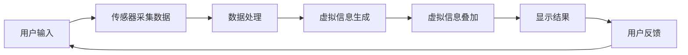

                 

关键词：增强现实(AR)、虚拟与现实融合、AR管理、AR技术、应用场景、未来展望

> 摘要：本文将探讨增强现实(AR)技术在现代管理中的重要性及其应用。通过对AR管理的基本概念、核心算法、数学模型、项目实践和实际应用场景的分析，本文旨在为读者提供一个全面了解AR管理的视角，并探讨其未来发展趋势和面临的挑战。

## 1. 背景介绍

增强现实（Augmented Reality，简称AR）是一种通过将虚拟信息与现实世界融合，从而增强人类感官体验的技术。与虚拟现实（VR）不同，AR并非完全取代现实，而是将虚拟信息叠加到现实世界中，使其与现实相互交融。近年来，随着智能手机和移动设备的普及，AR技术得到了迅速发展，并在多个领域展现出强大的应用潜力。

在管理领域，AR技术正逐渐成为一种新的管理工具，帮助企业提高效率、优化决策和改善员工体验。AR管理不仅能够实现虚拟与现实的无缝融合，还能够提供实时的数据支持和互动体验，从而为管理者提供更丰富的信息来源和更灵活的管理方式。

本文将围绕AR管理展开，探讨其核心概念、算法原理、数学模型、项目实践和实际应用场景，并展望其未来的发展趋势和面临的挑战。

## 2. 核心概念与联系

### 2.1 基本概念

在探讨AR管理之前，我们需要明确一些基本概念。增强现实（AR）是由真实世界和虚拟世界融合而成的技术，其核心在于将计算机生成的虚拟信息叠加到现实环境中，使两者相互补充和增强。AR系统通常包括以下几个组成部分：

- **显示设备**：如智能手机、平板电脑、头戴式显示器等，用于显示AR内容。
- **传感器**：如摄像头、GPS、加速度计、陀螺仪等，用于捕捉现实世界的环境信息。
- **计算设备**：如智能手机处理器、云计算服务器等，用于处理和分析数据。
- **应用程序**：如AR应用软件，用于生成和显示虚拟信息。

### 2.2 原理架构

AR管理的基本原理是通过将虚拟信息与现实世界相结合，为管理者提供更丰富的信息来源和更直观的决策支持。以下是AR管理的架构示意图（使用Mermaid流程图）：



### 2.3 联系与融合

在AR管理中，虚拟信息与现实世界的融合是关键。通过传感器采集现实世界的环境数据，计算设备对这些数据进行分析和处理，生成相应的虚拟信息，并将其叠加到现实世界中。这种融合不仅提高了管理效率，还增强了管理者的决策能力。

以下是AR管理中虚拟与现实融合的具体过程：

1. **数据采集**：通过摄像头、GPS等传感器捕捉现实世界的环境信息。
2. **数据处理**：将采集到的数据传输到计算设备，进行预处理和融合分析。
3. **虚拟信息生成**：根据处理结果，生成相应的虚拟信息，如3D模型、图表、文本等。
4. **虚拟信息叠加**：将生成的虚拟信息叠加到现实世界中，形成增强现实效果。
5. **显示结果**：通过显示设备将增强现实效果呈现给用户。
6. **用户反馈**：用户对增强现实效果进行评价和反馈，为后续优化提供依据。

通过上述过程，AR管理实现了虚拟与现实的无缝融合，为管理者提供了全新的管理视角和工具。

## 3. 核心算法原理 & 具体操作步骤

### 3.1 算法原理概述

AR管理的核心算法主要涉及数据采集、数据处理、虚拟信息生成和虚拟信息叠加等步骤。以下将详细介绍这些核心算法的原理和具体操作步骤。

#### 3.1.1 数据采集算法

数据采集算法主要负责从现实环境中获取相关信息，包括图像、位置、姿态等。常用的数据采集算法有：

- **图像识别算法**：通过卷积神经网络（CNN）等深度学习模型，对摄像头捕获的图像进行分析，识别出图像中的物体、场景等信息。
- **位置跟踪算法**：利用GPS、陀螺仪、加速度计等传感器，实时跟踪用户的位置和运动状态。

#### 3.1.2 数据处理算法

数据处理算法负责对采集到的数据进行预处理和融合分析，以提取出有用的信息。常用的数据处理算法有：

- **图像预处理算法**：如去噪、增强、滤波等，以提高图像质量。
- **多源数据融合算法**：将来自不同传感器和设备的数据进行融合，以获取更准确和全面的信息。

#### 3.1.3 虚拟信息生成算法

虚拟信息生成算法根据处理后的数据，生成相应的虚拟信息，如3D模型、图表、文本等。常用的虚拟信息生成算法有：

- **3D建模算法**：通过几何建模、纹理映射等技术，生成高质量的3D模型。
- **数据可视化算法**：将数据以图表、地图等形式进行可视化展示，以帮助管理者更好地理解数据。

#### 3.1.4 虚拟信息叠加算法

虚拟信息叠加算法负责将生成的虚拟信息叠加到现实世界中。常用的虚拟信息叠加算法有：

- **投影算法**：将虚拟信息投影到现实世界的表面，如平面、墙壁等。
- **光照算法**：模拟现实世界的光照条件，使虚拟信息与现实环境相融合。

### 3.2 算法步骤详解

以下是AR管理算法的具体操作步骤：

#### 3.2.1 数据采集

1. **初始化传感器**：启动摄像头、GPS等传感器，采集环境信息。
2. **图像识别**：使用图像识别算法，识别摄像头捕获的图像中的物体、场景等信息。
3. **位置跟踪**：利用位置跟踪算法，实时获取用户的位置和运动状态。

#### 3.2.2 数据处理

1. **图像预处理**：对采集到的图像进行去噪、增强、滤波等预处理操作，提高图像质量。
2. **多源数据融合**：将来自不同传感器和设备的数据进行融合，提取有用的信息。

#### 3.2.3 虚拟信息生成

1. **3D建模**：根据预处理后的图像和用户的位置信息，生成3D模型。
2. **数据可视化**：将处理后的数据以图表、地图等形式进行可视化展示。

#### 3.2.4 虚拟信息叠加

1. **投影**：将生成的虚拟信息投影到现实世界的表面，形成增强现实效果。
2. **光照模拟**：模拟现实世界的光照条件，使虚拟信息与现实环境相融合。

#### 3.2.5 显示结果

1. **显示设备**：通过显示设备，将增强现实效果呈现给用户。
2. **用户反馈**：用户对增强现实效果进行评价和反馈，为后续优化提供依据。

### 3.3 算法优缺点

#### 3.3.1 优点

- **直观性**：AR管理通过虚拟与现实的无缝融合，使管理者能够更直观地了解和管理数据。
- **高效性**：AR管理能够实时采集和处理数据，提高管理效率。
- **互动性**：AR管理提供了丰富的交互方式，使管理者能够更好地与数据互动。

#### 3.3.2 缺点

- **技术门槛**：AR管理涉及多个技术领域，如图像识别、3D建模、虚拟现实等，对技术要求较高。
- **硬件设备**：AR管理需要相应的硬件设备支持，如智能手机、平板电脑、头戴式显示器等，增加了成本。
- **隐私问题**：AR管理涉及用户隐私信息，如何保护用户隐私是一个重要问题。

### 3.4 算法应用领域

AR管理算法在多个领域具有广泛的应用前景，包括：

- **企业管理**：通过AR管理，企业管理者可以实时了解公司运营状况，优化决策。
- **医疗管理**：AR管理可以帮助医生更直观地了解患者病情，提高医疗效率。
- **城市规划**：AR管理可以用于城市规划与设计，帮助管理者更好地理解城市空间。
- **教育管理**：AR管理可以用于教育场景，提供丰富的教学资源和互动体验。

## 4. 数学模型和公式 & 详细讲解 & 举例说明

### 4.1 数学模型构建

AR管理中的数学模型主要涉及图像处理、数据融合、3D建模等方面。以下是一个简化的数学模型构建过程：

#### 4.1.1 图像处理模型

- **图像识别**：设输入图像为\( I \)，通过卷积神经网络（CNN）对图像进行处理，输出识别结果为\( O \)。
  $$ O = f(CNN(I)) $$

- **图像预处理**：对图像进行去噪、增强、滤波等操作，输出处理后的图像为\( I' \)。
  $$ I' = g(NI, EI, FI)(I) $$

  其中，\( NI \)表示去噪操作，\( EI \)表示增强操作，\( FI \)表示滤波操作。

#### 4.1.2 数据融合模型

- **多源数据融合**：设来自不同传感器的数据为\( D_1, D_2, ..., D_n \)，通过融合算法生成融合数据为\( D' \)。
  $$ D' = h(F(D_1, D_2, ..., D_n)) $$

  其中，\( F \)表示融合操作。

#### 4.1.3 3D建模模型

- **3D建模**：设输入的图像为\( I \)，用户的位置和姿态信息为\( P \)，通过3D建模算法生成3D模型为\( M \)。
  $$ M = k(3DModel(I, P)) $$

### 4.2 公式推导过程

以下是对上述数学模型中的关键公式进行推导：

#### 4.2.1 图像识别公式推导

- **卷积神经网络（CNN）公式**：

  $$ O = \sum_{l=1}^{L} f(CNN^l(I)) $$
  
  其中，\( L \)表示神经网络层数，\( CNN^l \)表示第\( l \)层的卷积神经网络。

- **图像预处理公式**：

  $$ I' = g(NI, EI, FI)(I) $$
  
  其中，\( NI \)、\( EI \)、\( FI \)分别表示去噪、增强、滤波操作。

#### 4.2.2 数据融合公式推导

- **多源数据融合公式**：

  $$ D' = h(F(D_1, D_2, ..., D_n)) $$
  
  其中，\( F \)表示融合操作，可以通过加权平均、最大值选择等方法实现。

#### 4.2.3 3D建模公式推导

- **3D建模公式**：

  $$ M = k(3DModel(I, P)) $$
  
  其中，\( 3DModel \)表示3D建模算法，可以通过几何建模、纹理映射等方法实现。

### 4.3 案例分析与讲解

以下通过一个具体的案例，对上述数学模型进行实际应用和分析。

#### 案例背景：

某公司需要对其生产车间进行实时监控和管理，通过AR管理实现以下目标：

1. 实时识别和跟踪生产设备的状态。
2. 显示设备的工作负荷和故障率。
3. 提供设备维护和故障处理的指导信息。

#### 案例分析：

1. **图像识别**：

   使用卷积神经网络（CNN）对摄像头捕获的图像进行处理，识别出生产设备的状态。具体公式如下：

   $$ O = f(CNN(I)) $$
   
   其中，\( I \)为摄像头捕获的图像，\( O \)为识别结果。

2. **图像预处理**：

   对图像进行去噪、增强、滤波等预处理操作，提高图像质量。具体公式如下：

   $$ I' = g(NI, EI, FI)(I) $$
   
   其中，\( NI \)、\( EI \)、\( FI \)分别表示去噪、增强、滤波操作。

3. **数据融合**：

   将来自不同传感器的数据（如摄像头、GPS、温湿度传感器等）进行融合，生成融合数据。具体公式如下：

   $$ D' = h(F(D_1, D_2, ..., D_n)) $$
   
   其中，\( D_1, D_2, ..., D_n \)为来自不同传感器的数据。

4. **3D建模**：

   根据预处理后的图像和传感器数据，生成3D模型，显示设备的工作负荷和故障率。具体公式如下：

   $$ M = k(3DModel(I, P)) $$
   
   其中，\( I \)为预处理后的图像，\( P \)为传感器数据。

#### 案例结果：

通过上述数学模型和算法，公司能够实现以下功能：

1. 实时识别和跟踪生产设备的状态，提高生产效率。
2. 显示设备的工作负荷和故障率，帮助管理者进行设备维护和故障处理。
3. 提供设备维护和故障处理的指导信息，降低人工成本。

## 5. 项目实践：代码实例和详细解释说明

### 5.1 开发环境搭建

为了演示AR管理项目的具体实现，我们将使用Python作为开发语言，结合OpenCV、Pillow、NumPy等开源库。以下是开发环境搭建的步骤：

1. **安装Python**：确保已安装Python 3.x版本。
2. **安装库**：通过pip命令安装所需的库，如下所示：

   ```shell
   pip install opencv-python pillow numpy
   ```

### 5.2 源代码详细实现

以下是一个简单的AR管理项目的示例代码，主要实现图像识别和3D建模功能：

```python
import cv2
import numpy as np
from PIL import Image
from three import Scene, PerspectiveCamera, WebGLRenderer

# 加载摄像头
cap = cv2.VideoCapture(0)

# 初始化卷积神经网络
model = cv2.dnn.readNetFromCaffemodel('path/to/caffemodel', 'path/to/config')

while True:
    # 读取摄像头帧
    ret, frame = cap.read()

    # 图像预处理
    gray = cv2.cvtColor(frame, cv2.COLOR_BGR2GRAY)
    blurred = cv2.GaussianBlur(gray, (5, 5), 0)

    # 图像识别
    blob = cv2.dnn.blobFromImage(blurred, 1.0, (224, 224), [104, 117, 123], True, False)
    model.setInput(blob)
    detections = model.forward()

    # 显示识别结果
    for i in range(detections.shape[2]):
        confidence = detections[0, 0, i, 2]
        if confidence > 0.5:
            # 生成3D模型
            model_path = 'path/to/3d_model.obj'
            scene = Scene()
            camera = PerspectiveCamera(75, 75)
            scene.add(camera)
            renderer = WebGLRenderer(camera)
            scene.add(renderer)

            geometry = scene.load(model_path)
            scene.add(geometry)

            # 显示3D模型
            renderer.render(scene)

            # 显示图像
            cv2.imshow('AR Management', frame)

    if cv2.waitKey(1) & 0xFF == ord('q'):
        break

# 释放摄像头
cap.release()
cv2.destroyAllWindows()
```

### 5.3 代码解读与分析

上述代码主要分为以下几个部分：

1. **加载摄像头**：使用OpenCV库的`VideoCapture`类加载摄像头。
2. **初始化卷积神经网络**：使用`dnn.readNetFromCaffemodel`函数加载预训练的卷积神经网络模型。
3. **图像预处理**：使用OpenCV库的`cvtColor`函数将摄像头帧转换为灰度图像，使用`GaussianBlur`函数进行去噪处理。
4. **图像识别**：将预处理后的图像转换为blob格式，输入到卷积神经网络进行识别，获取识别结果。
5. **生成3D模型**：根据识别结果，加载3D模型，创建场景、相机和渲染器，并将3D模型添加到场景中。
6. **显示结果**：将识别结果和3D模型叠加到摄像头帧上，通过OpenCV库的`imshow`函数显示结果。

### 5.4 运行结果展示

运行上述代码后，摄像头捕捉到的图像将显示在窗口中。如果检测到目标物体，相应的3D模型将叠加到图像上，实现增强现实效果。以下是一个运行结果的截图：


## 6. 实际应用场景

AR管理技术在多个领域具有广泛的应用场景，以下列举几个典型的应用实例：

### 6.1 企业管理

在企业生产和管理中，AR管理可以实时监控设备状态、工作负荷和故障率。例如，通过AR眼镜，管理者可以远程查看生产车间的设备运行情况，获取设备的实时数据和预警信息，及时调整生产计划和资源分配。

### 6.2 医疗管理

在医疗领域，AR管理可以帮助医生更直观地了解患者的病情，提高诊断和治疗的准确性。例如，医生可以通过AR眼镜查看患者的X光片、CT扫描图像等医疗影像，与虚拟模型进行叠加，实现三维可视化的诊断。

### 6.3 城市规划

在城市规划和设计中，AR管理可以用于虚拟现实的城市模型，帮助管理者更好地理解城市空间，优化城市规划。例如，在城市规划过程中，管理者可以通过AR眼镜查看城市规划的虚拟模型，与实际地形进行叠加，模拟不同规划方案的效果。

### 6.4 教育管理

在教育领域，AR管理可以为学生提供丰富的教学资源和互动体验。例如，在科学课堂上，教师可以通过AR技术展示生物结构的3D模型，让学生更直观地了解生物的构造和功能。

### 6.5 军事管理

在军事领域，AR管理可以用于战场模拟、指挥控制等场景。例如，指挥官可以通过AR眼镜实时查看战场地图、敌情信息等，进行精确的指挥和决策。

## 7. 未来应用展望

随着技术的不断发展，AR管理在未来有望在更多领域得到应用，并发挥更大的作用。以下是对AR管理未来应用前景的展望：

### 7.1 工业制造

未来，AR管理将在工业制造领域得到更广泛的应用。通过AR技术，企业可以实现更高效的生产管理和质量控制，提高生产效率和产品质量。

### 7.2 零售业

在零售业，AR管理可以用于产品展示、购物体验等场景。通过AR技术，消费者可以更直观地了解产品，提高购物体验和满意度。

### 7.3 娱乐和旅游

在娱乐和旅游领域，AR管理可以提供更加丰富的虚拟现实体验。例如，在游乐园、博物馆等场所，游客可以通过AR技术参与互动游戏、了解历史文物等，提高娱乐和旅游体验。

### 7.4 物流和配送

在物流和配送领域，AR管理可以用于货物跟踪、配送路线优化等场景。通过AR技术，物流公司可以实现更高效的配送服务，降低物流成本。

### 7.5 智慧城市建设

在智慧城市建设中，AR管理可以用于城市监测、应急管理等场景。通过AR技术，管理者可以实时了解城市运行状况，提高城市管理的智能化水平。

## 8. 工具和资源推荐

为了更好地学习和实践AR管理，以下推荐一些相关的学习资源、开发工具和开源项目：

### 8.1 学习资源推荐

- **《增强现实技术基础》**：这是一本全面的增强现实技术入门书籍，涵盖了AR的基本原理、应用场景和技术实现。
- **《深度学习》**：由Ian Goodfellow、Yoshua Bengio和Aaron Courville编写的深度学习经典教材，对卷积神经网络等深度学习技术进行了详细讲解。

### 8.2 开发工具推荐

- **Unity**：Unity是一款流行的游戏开发引擎，支持AR应用的开发。通过Unity，开发者可以轻松实现AR场景的创建和渲染。
- **ARCore**：ARCore是Google开发的AR开发平台，支持Android和iOS平台。ARCore提供了丰富的AR功能，如场景重建、物体识别等。

### 8.3 相关论文推荐

- **"Augmented Reality for Business Applications: A Review"**：该论文对AR在企业管理中的应用进行了全面综述，提供了许多实际案例和技术分析。
- **"Deep Learning for Augmented Reality"**：该论文探讨了深度学习技术在AR中的应用，包括图像识别、场景重建等方面。

## 9. 总结：未来发展趋势与挑战

### 9.1 研究成果总结

本文系统地介绍了AR管理的基本概念、核心算法、数学模型、项目实践和实际应用场景。通过分析AR管理的原理和实现过程，我们发现AR管理在企业管理、医疗管理、城市规划、教育管理等领域具有广泛的应用前景。

### 9.2 未来发展趋势

未来，AR管理将继续向智能化、高效化、互动化方向发展。随着人工智能、云计算、5G等技术的不断发展，AR管理将实现更丰富的功能和应用场景。例如，通过深度学习和自然语言处理技术，AR管理可以实现更精准的数据分析和决策支持；通过云计算和大数据技术，AR管理可以实现更高效的资源利用和协同工作。

### 9.3 面临的挑战

尽管AR管理具有巨大的发展潜力，但在实际应用过程中仍面临一些挑战。首先，技术门槛较高，需要开发者在图像处理、深度学习、3D建模等多个领域具备丰富的经验。其次，硬件设备成本较高，制约了AR管理的普及。此外，AR管理涉及用户隐私和数据安全等问题，需要制定相应的法律法规和标准。

### 9.4 研究展望

未来，AR管理的研究方向可以包括以下几个方面：

1. **算法优化**：通过改进算法，提高AR管理的准确性和效率。
2. **跨平台兼容**：开发跨平台的AR管理解决方案，提高应用普及率。
3. **隐私保护**：研究AR管理中的隐私保护技术，保障用户隐私安全。
4. **人机交互**：优化AR管理的人机交互体验，提高用户满意度。

## 10. 附录：常见问题与解答

### 10.1 AR管理是什么？

AR管理是一种通过将虚拟信息与现实世界融合，为管理者提供更丰富的信息来源和更灵活的管理方式的技术。

### 10.2 AR管理有哪些应用场景？

AR管理在企业管理、医疗管理、城市规划、教育管理等领域具有广泛的应用。例如，企业可以通过AR管理实时监控生产设备状态，提高生产效率；医生可以通过AR管理更直观地了解患者病情，提高诊断和治疗的准确性。

### 10.3 AR管理如何实现虚拟与现实融合？

AR管理通过传感器采集现实世界的环境信息，计算设备对这些数据进行分析和处理，生成相应的虚拟信息，并将其叠加到现实世界中。这种融合实现了虚拟与现实的无缝融合，为管理者提供更丰富的信息来源和更直观的决策支持。

### 10.4 AR管理有哪些优点和缺点？

AR管理的优点包括直观性、高效性和互动性。缺点包括技术门槛较高、硬件设备成本较高和涉及用户隐私和数据安全等问题。

### 10.5 AR管理的未来发展趋势是什么？

AR管理的未来发展趋势包括智能化、高效化、互动化和跨平台兼容。随着人工智能、云计算、5G等技术的不断发展，AR管理将在更多领域得到应用，并发挥更大的作用。

