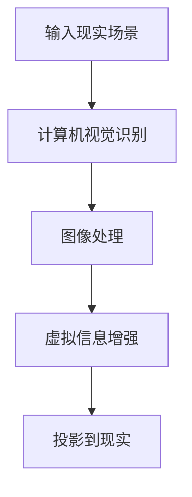
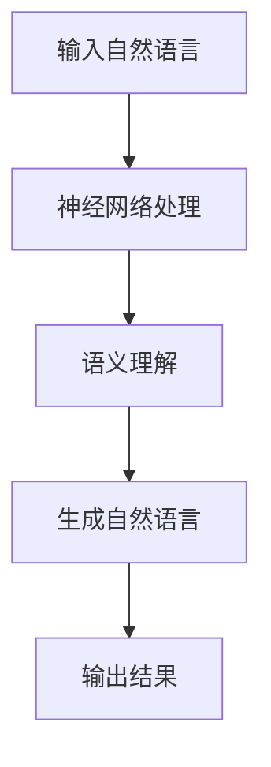
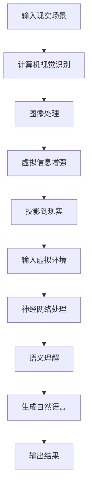

                 

关键词：增强现实，LLM，混合现实，计算机视觉，人工智能，软件开发，交互设计，用户体验，虚拟现实

摘要：本文探讨了如何将增强现实（AR）与大型语言模型（LLM）结合起来，打造出全新的混合现实体验。通过分析AR和LLM的核心概念、技术原理，以及它们在混合现实中的具体应用，本文旨在为读者提供一种全新的视角，以理解如何利用这两项先进技术创造出更加丰富、互动和沉浸式的用户体验。

## 1. 背景介绍

随着科技的不断发展，增强现实（AR）和大型语言模型（LLM）正逐渐成为人们生活中不可或缺的一部分。AR技术通过在现实世界场景中叠加虚拟信息，为用户提供了全新的交互方式。而LLM作为一种强大的自然语言处理工具，能够理解和生成自然语言，极大地提高了人机交互的效率和准确性。

近年来，AR和LLM技术在各个领域的应用逐渐成熟。例如，在医疗领域，AR技术被用于手术导航和患者教育；在教育和培训领域，LLM技术被用于智能辅导和知识获取。然而，将这两项技术结合起来，打造出一种全新的混合现实体验，却是一个相对新颖的领域。

本文将首先介绍AR和LLM的核心概念和原理，然后探讨如何将它们融合在一起，构建出一种全新的混合现实体验。接下来，我们将通过一个具体的案例，展示如何实现这一目标。最后，本文还将讨论这一技术的未来应用前景和面临的挑战。

### 1.1 增强现实（AR）

增强现实（AR）是一种将虚拟信息与现实世界场景相结合的技术。通过AR，用户可以在现实世界中看到并交互虚拟物体，从而获得一种全新的沉浸式体验。AR技术的主要原理包括计算机视觉、图像处理和投影技术。

计算机视觉负责识别和理解现实世界场景，图像处理则用于处理和增强虚拟信息，投影技术则将虚拟信息投影到现实世界中。通过这些技术，AR系统能够将虚拟物体与现实世界无缝融合，为用户提供丰富的交互体验。

### 1.2 大型语言模型（LLM）

大型语言模型（LLM）是一种基于深度学习的自然语言处理工具。LLM通过对海量文本数据的学习，能够理解和生成自然语言，从而实现人与机器的智能对话。LLM的核心技术包括神经网络、自然语言处理和机器学习。

神经网络负责处理和模拟人脑的学习过程，自然语言处理则用于处理文本数据，机器学习则使LLM能够根据输入数据自动调整模型参数，提高其性能。

### 1.3 混合现实体验

混合现实体验是指将增强现实（AR）和虚拟现实（VR）技术相结合，为用户提供一种全新的沉浸式体验。混合现实体验不仅能够将虚拟信息与现实世界场景融合，还能通过虚拟现实技术提供更加沉浸式的虚拟环境。

在混合现实体验中，用户可以通过AR技术看到并交互虚拟物体，同时通过VR技术体验到更加真实的虚拟环境。这种体验方式不仅能够提高用户的参与感和沉浸感，还能为各种应用场景提供丰富的交互方式。

## 2. 核心概念与联系

在本节中，我们将深入探讨增强现实（AR）和大型语言模型（LLM）的核心概念和技术原理，并通过Mermaid流程图展示它们在混合现实（MR）中的融合过程。

### 2.1 增强现实（AR）

增强现实（AR）的核心概念是通过计算机视觉技术识别和理解现实世界场景，然后利用图像处理技术增强虚拟信息，并将这些信息投影到现实世界中。以下是一个简化的AR技术流程：



在这个流程中，计算机视觉识别是关键步骤，它负责从现实场景中提取有用信息。图像处理则用于调整和增强虚拟信息，使其更好地与现实场景融合。最后，投影技术将增强后的虚拟信息投影到现实世界中，为用户提供一种沉浸式的交互体验。

### 2.2 大型语言模型（LLM）

大型语言模型（LLM）的核心概念是通过深度学习和自然语言处理技术理解和生成自然语言。以下是一个简化的LLM技术流程：



在这个流程中，神经网络处理负责模拟人脑的学习过程，语义理解则用于理解输入的自然语言，生成自然语言则根据输入生成合适的回答。最后，输出结果部分将处理后的自然语言反馈给用户。

### 2.3 混合现实（MR）

混合现实（MR）是一种将增强现实（AR）和虚拟现实（VR）技术结合起来的新形态。在MR中，用户可以通过AR技术看到并交互虚拟物体，同时通过VR技术体验到更加沉浸式的虚拟环境。以下是一个简化的MR技术流程：



在这个流程中，AR和LLM技术相互融合，实现了虚拟信息与现实场景的无缝融合，同时提供了智能化的交互体验。通过这个流程，用户不仅可以看到和交互虚拟物体，还能与虚拟环境进行自然语言交互，获得更加丰富和沉浸的体验。

## 3. 核心算法原理 & 具体操作步骤

在本节中，我们将详细探讨如何将增强现实（AR）和大型语言模型（LLM）技术结合，实现混合现实（MR）体验。为了更好地理解这一过程，我们将分步骤进行讲解，并分析其中的关键算法原理。

### 3.1 算法原理概述

将AR和LLM技术结合的核心在于如何将计算机视觉和自然语言处理无缝集成到同一个系统中。以下是这个过程中的一些关键步骤：

1. **图像识别与处理**：使用计算机视觉算法识别现实场景中的物体和特征，并对图像进行预处理，如滤波、边缘检测等。
2. **虚拟信息生成**：根据识别的结果，生成相应的虚拟信息，如3D模型、文本标签等。
3. **自然语言理解与生成**：使用LLM对用户输入的自然语言进行处理，理解其意图，并生成合适的响应。
4. **虚拟信息融合与投影**：将生成的虚拟信息与真实场景融合，并通过AR投影技术将虚拟信息叠加到真实场景中。
5. **交互反馈**：根据用户的反馈和操作，动态调整虚拟信息和交互方式，提供更加自然和沉浸的体验。

### 3.2 算法步骤详解

以下是实现混合现实体验的具体算法步骤：

#### 3.2.1 图像识别与处理

- **步骤1**：获取现实场景的图像数据。这可以通过AR设备中的摄像头实现。
- **步骤2**：使用深度学习模型进行图像识别，如卷积神经网络（CNN）或目标检测算法，识别场景中的物体和特征。
- **步骤3**：对图像进行预处理，如去噪、边缘检测、图像增强等，以提高识别的准确性和鲁棒性。

#### 3.2.2 虚拟信息生成

- **步骤1**：根据图像识别结果，生成相应的虚拟信息。例如，对于识别到的物体，可以生成3D模型；对于特定区域，可以生成文本标签。
- **步骤2**：对生成的虚拟信息进行渲染和优化，确保其与真实场景的融合效果。

#### 3.2.3 自然语言理解与生成

- **步骤1**：接收用户的自然语言输入，如语音或文本。
- **步骤2**：使用LLM对输入的自然语言进行处理，理解其意图。这可以通过训练有监督或无监督的深度学习模型实现。
- **步骤3**：根据理解的结果，生成合适的自然语言响应，如回答问题、提供信息等。

#### 3.2.4 虚拟信息融合与投影

- **步骤1**：将生成的虚拟信息与真实场景融合。这可以通过图像合成技术实现，如图像蒙版或像素级融合。
- **步骤2**：使用AR投影技术将融合后的虚拟信息投影到真实场景中。这可以通过AR眼镜或屏幕等设备实现。

#### 3.2.5 交互反馈

- **步骤1**：根据用户的操作和反馈，动态调整虚拟信息和交互方式。例如，用户可以选择不同的虚拟对象或交互方式。
- **步骤2**：实时更新虚拟信息，确保与用户的交互始终是同步和连贯的。

### 3.3 算法优缺点

#### 优点

1. **丰富交互体验**：结合了AR和LLM技术的混合现实体验，能够提供更加丰富和沉浸的交互体验。
2. **自然语言交互**：通过LLM技术，用户可以使用自然语言与系统进行交互，提高了人机交互的效率和自然性。
3. **应用场景广泛**：混合现实体验可以应用于各种领域，如教育、医疗、娱乐等，具有广泛的应用前景。

#### 缺点

1. **技术实现复杂**：实现混合现实体验需要结合多种技术，如计算机视觉、自然语言处理、图像处理等，技术实现相对复杂。
2. **硬件要求高**：AR设备和LLM模型通常需要高性能的硬件支持，对硬件要求较高。
3. **数据隐私和安全**：在处理用户数据和自然语言交互时，需要考虑数据隐私和安全问题，确保用户数据不被泄露。

### 3.4 算法应用领域

1. **教育**：通过混合现实体验，可以实现更加生动和互动的教学方式，提高学生的学习兴趣和理解能力。
2. **医疗**：在医疗领域，混合现实体验可以用于手术导航、患者教育等，提高医疗服务的质量和效率。
3. **娱乐**：在娱乐领域，混合现实体验可以创造全新的娱乐方式，如虚拟演唱会、游戏体验等。
4. **工业**：在工业领域，混合现实体验可以用于产品展示、故障诊断等，提高生产效率和安全性。

## 4. 数学模型和公式 & 详细讲解 & 举例说明

在实现混合现实体验的过程中，数学模型和公式起着至关重要的作用。以下将详细介绍相关的数学模型和公式，并通过对实际案例的讲解，帮助读者更好地理解这些概念。

### 4.1 数学模型构建

为了构建混合现实体验的数学模型，我们需要考虑以下几个关键组件：计算机视觉模型、自然语言处理模型和混合现实交互模型。

#### 4.1.1 计算机视觉模型

计算机视觉模型用于识别和理解现实场景中的物体和特征。以下是常用的计算机视觉模型及其对应的数学公式：

1. **卷积神经网络（CNN）**
   - **公式**：\[ f(x) = \sigma(W \cdot x + b) \]
     - 其中，\( f(x) \) 是卷积操作的结果，\( \sigma \) 是激活函数，\( W \) 是权重矩阵，\( x \) 是输入特征，\( b \) 是偏置项。

2. **目标检测模型**
   - **公式**：\[ R = \frac{TP + TN}{TP + TN + FP + FN} \]
     - 其中，\( R \) 是检测模型的准确率，\( TP \) 是真实正例，\( TN \) 是真实反例，\( FP \) 是假正例，\( FN \) 是假反例。

3. **特征提取模型**
   - **公式**：\[ f(x) = \sum_{i=1}^{n} w_i \cdot x_i \]
     - 其中，\( f(x) \) 是特征提取的结果，\( w_i \) 是权重，\( x_i \) 是输入特征。

#### 4.1.2 自然语言处理模型

自然语言处理模型用于理解和生成自然语言。以下是常用的自然语言处理模型及其对应的数学公式：

1. **循环神经网络（RNN）**
   - **公式**：\[ h_t = \sigma(W_h \cdot [h_{t-1}, x_t] + b_h) \]
     - 其中，\( h_t \) 是当前时刻的隐藏状态，\( \sigma \) 是激活函数，\( W_h \) 是权重矩阵，\( x_t \) 是当前时刻的输入，\( b_h \) 是偏置项。

2. **长短期记忆网络（LSTM）**
   - **公式**：\[ h_t = \sigma(W_h \cdot [h_{t-1}, x_t] + b_h) \]
     - 其中，\( h_t \) 是当前时刻的隐藏状态，\( \sigma \) 是激活函数，\( W_h \) 是权重矩阵，\( x_t \) 是当前时刻的输入，\( b_h \) 是偏置项。

3. **生成对抗网络（GAN）**
   - **公式**：\[ D(G(z)) = \frac{1}{2} \left(1 - \log(D(G(z))) + \log(1 - D(z))\right) \]
     - 其中，\( D \) 是判别器，\( G \) 是生成器，\( z \) 是噪声输入。

#### 4.1.3 混合现实交互模型

混合现实交互模型用于处理用户与虚拟信息之间的交互。以下是常用的混合现实交互模型及其对应的数学公式：

1. **交互式渲染模型**
   - **公式**：\[ I = \int_{S} f(x, y) \, dx \, dy \]
     - 其中，\( I \) 是渲染结果，\( f(x, y) \) 是渲染函数，\( S \) 是渲染区域。

2. **虚拟物体追踪模型**
   - **公式**：\[ \theta = \frac{1}{2} \left( \arccos \left( \frac{\mathbf{a} \cdot \mathbf{b}}{|\mathbf{a}| |\mathbf{b}|} \right) - \arcsin \left( \frac{|\mathbf{a} \times \mathbf{b}|}{|\mathbf{a}| |\mathbf{b}|} \right) \right) \]
     - 其中，\( \theta \) 是两个向量之间的夹角，\( \mathbf{a} \) 和 \( \mathbf{b} \) 是两个向量。

### 4.2 公式推导过程

以下将简要介绍如何推导上述数学模型中的关键公式。

#### 4.2.1 卷积神经网络（CNN）

卷积神经网络的推导基于线性代数和微积分知识。以下是卷积操作和激活函数的推导：

1. **卷积操作**
   - **推导**：卷积操作可以看作是两个矩阵的乘积。设输入特征矩阵为 \( X \)，卷积核矩阵为 \( K \)，则卷积操作的结果为 \( Y = K \cdot X \)。
   - **公式**：\[ Y_{ij} = \sum_{k=1}^{n} X_{ik} K_{kj} \]
     - 其中，\( Y_{ij} \) 是输出特征矩阵中的元素，\( X_{ik} \) 是输入特征矩阵中的元素，\( K_{kj} \) 是卷积核矩阵中的元素。

2. **激活函数**
   - **推导**：激活函数用于引入非线性特性，常见的激活函数有Sigmoid、ReLU和Tanh等。
   - **公式**：\[ \sigma(x) = \frac{1}{1 + e^{-x}} \]
     - 对于Sigmoid函数，
     \[ \sigma(x) = \frac{1}{1 + e^{-x}} \]
   - **公式**：\[ \sigma(x) = \max(0, x) \]
     - 对于ReLU函数，
     \[ \sigma(x) = \max(0, x) \]

#### 4.2.2 循环神经网络（RNN）

循环神经网络（RNN）的推导基于递归关系和微积分知识。以下是RNN的推导：

1. **递归关系**
   - **推导**：RNN中的递归关系可以表示为 \( h_t = \sigma(W_h \cdot [h_{t-1}, x_t] + b_h) \)。
   - **公式**：\[ h_t = f(h_{t-1}, x_t) \]
     - 其中，\( f \) 是递归函数，\( h_t \) 是当前时刻的隐藏状态，\( x_t \) 是当前时刻的输入。

2. **激活函数**
   - **推导**：激活函数用于引入非线性特性，常见的激活函数有Sigmoid、ReLU和Tanh等。
   - **公式**：\[ \sigma(x) = \frac{1}{1 + e^{-x}} \]
     - 对于Sigmoid函数，
     \[ \sigma(x) = \frac{1}{1 + e^{-x}} \]
   - **公式**：\[ \sigma(x) = \max(0, x) \]
     - 对于ReLU函数，
     \[ \sigma(x) = \max(0, x) \]

#### 4.2.3 生成对抗网络（GAN）

生成对抗网络（GAN）的推导基于博弈论和优化理论。以下是GAN的推导：

1. **博弈关系**
   - **推导**：GAN由生成器和判别器组成，生成器和判别器之间进行博弈。生成器的目标是生成逼真的数据，判别器的目标是区分生成数据和真实数据。
   - **公式**：\[ \min_G \max_D V(D, G) \]
     - 其中，\( G \) 是生成器，\( D \) 是判别器，\( V(D, G) \) 是两者之间的对抗损失。

2. **损失函数**
   - **推导**：对抗损失通常采用二元交叉熵损失函数。
   - **公式**：\[ L(D, G) = -\frac{1}{2} \left( D(G(z)) + (1 - D(z)) \right) \]
     - 其中，\( z \) 是噪声输入，\( D(G(z)) \) 是判别器对生成数据的判断概率，\( D(z) \) 是判别器对真实数据的判断概率。

### 4.3 案例分析与讲解

以下将结合一个实际案例，讲解如何应用上述数学模型和公式实现混合现实体验。

#### 案例背景

假设我们要开发一款混合现实应用程序，该应用程序允许用户在现实世界中查看和交互虚拟物体。具体要求如下：

1. 用户通过AR设备扫描现实场景，系统自动识别场景中的物体。
2. 系统生成相应的虚拟物体，并叠加到现实场景中。
3. 用户可以使用自然语言与虚拟物体进行交互，如询问物体的信息、调整物体的位置等。

#### 案例实现步骤

1. **图像识别与处理**
   - **步骤1**：用户使用AR设备扫描现实场景，获取图像数据。
   - **步骤2**：使用目标检测模型识别图像中的物体，如桌子、椅子等。
   - **步骤3**：对识别结果进行图像预处理，如去噪、边缘检测等。

2. **虚拟信息生成**
   - **步骤1**：根据识别结果，生成相应的虚拟物体，如3D模型、文本标签等。
   - **步骤2**：对生成的虚拟物体进行渲染和优化，确保其与现实场景的融合效果。

3. **自然语言理解与生成**
   - **步骤1**：用户使用自然语言与虚拟物体进行交互，如询问物体的信息。
   - **步骤2**：使用LLM对用户的自然语言输入进行处理，理解其意图。
   - **步骤3**：根据理解的结果，生成合适的自然语言响应，如回答用户的问题。

4. **虚拟信息融合与投影**
   - **步骤1**：将生成的虚拟信息与真实场景融合。
   - **步骤2**：使用AR投影技术将融合后的虚拟信息投影到真实场景中。

5. **交互反馈**
   - **步骤1**：根据用户的操作和反馈，动态调整虚拟信息和交互方式。
   - **步骤2**：实时更新虚拟信息，确保与用户的交互始终是同步和连贯的。

#### 案例分析与讲解

以下将对案例中的关键步骤进行分析和讲解：

1. **图像识别与处理**
   - **分析**：使用目标检测模型识别图像中的物体，是实现混合现实体验的关键步骤。目标检测模型通常使用深度学习算法，如YOLO或SSD等。
   - **讲解**：YOLO（You Only Look Once）是一种单阶段目标检测算法，其基本原理是将图像划分为网格，然后在每个网格内预测物体的类别和位置。通过综合多个网格的预测结果，可以得到整个图像的目标检测结果。

2. **虚拟信息生成**
   - **分析**：生成虚拟物体是实现混合现实体验的重要环节。生成虚拟物体通常使用3D建模和渲染技术。
   - **讲解**：3D建模技术可以通过三维建模软件实现，如Blender或Maya等。渲染技术则用于将生成的3D模型渲染成二维图像，以便在AR设备上显示。

3. **自然语言理解与生成**
   - **分析**：自然语言理解与生成是实现人机交互的重要手段。自然语言理解通常使用深度学习算法，如BERT或GPT等。
   - **讲解**：BERT（Bidirectional Encoder Representations from Transformers）是一种双向编码器表示模型，其基本原理是通过预训练大量文本数据，学习文本的双向表示。在自然语言理解任务中，BERT可以用于提取输入文本的语义特征，从而实现语义理解。

4. **虚拟信息融合与投影**
   - **分析**：虚拟信息融合与投影是实现混合现实体验的关键步骤。虚拟信息融合通常使用图像合成技术，如深度图合成或图像蒙版等。
   - **讲解**：深度图合成技术可以将虚拟物体叠加到真实场景中，从而实现虚拟信息与真实场景的无缝融合。图像蒙版技术则通过控制像素的透明度，实现虚拟物体与真实场景的融合。

5. **交互反馈**
   - **分析**：交互反馈是实现用户与虚拟信息之间互动的重要环节。交互反馈可以通过动态调整虚拟信息和交互方式实现。
   - **讲解**：动态调整虚拟信息和交互方式可以通过实时计算和优化实现。例如，当用户询问物体的信息时，系统可以实时生成相应的响应，并展示在屏幕上。

### 4.4 深入探讨

在实现混合现实体验的过程中，还有许多其他数学模型和公式可以应用于实际场景。以下将对其中一些关键模型进行深入探讨。

#### 4.4.1 深度估计

深度估计是在AR中实现准确虚拟信息融合的关键技术。深度估计的目标是估计真实场景中每个像素的深度信息。

1. **深度估计模型**
   - **模型**：单目视觉深度估计模型（如DORN）
   - **公式**：\[ D(x) = \phi(\theta) \]
     - 其中，\( D(x) \) 是深度估计结果，\( \phi \) 是深度估计函数，\( \theta \) 是模型参数。

2. **深度估计推导**
   - **推导**：深度估计通常通过训练深度神经网络实现。神经网络通过学习大量带有深度标签的图像，学习深度估计函数。

#### 4.4.2 三维重建

三维重建是从多个视角的二维图像中重建真实场景的三维模型。

1. **三维重建模型**
   - **模型**：多视角几何重建（如结构光扫描）
   - **公式**：\[ P = K \cdot R \cdot T \]
     - 其中，\( P \) 是三维点坐标，\( K \) 是相机内参矩阵，\( R \) 是旋转矩阵，\( T \) 是平移向量。

2. **三维重建推导**
   - **推导**：三维重建通常通过求解相机位姿和三维点坐标之间的关系实现。相机位姿可以通过多视角几何方法（如八点法）求解。

#### 4.4.3 动态追踪

动态追踪是在AR中实现实时虚拟物体跟踪的关键技术。

1. **动态追踪模型**
   - **模型**：基于特征匹配的动态追踪（如光流法）
   - **公式**：\[ \Delta P = \mathbf{v} \cdot \Delta t \]
     - 其中，\( \Delta P \) 是位移向量，\( \mathbf{v} \) 是速度向量，\( \Delta t \) 是时间间隔。

2. **动态追踪推导**
   - **推导**：动态追踪通过计算像素位移和速度之间的关系，实现实时物体跟踪。像素位移可以通过光流法计算，速度向量可以通过运动估计方法计算。

### 4.5 小结

通过上述案例和深入探讨，我们可以看到数学模型和公式在实现混合现实体验中的重要作用。深度估计、三维重建和动态追踪等技术，都是基于数学模型和公式实现的。在未来的研究中，我们还可以探索更多先进的数学模型和公式，以实现更加准确、高效和智能的混合现实体验。

## 5. 项目实践：代码实例和详细解释说明

在本节中，我们将通过一个具体的代码实例，详细讲解如何将增强现实（AR）与大型语言模型（LLM）结合，实现混合现实（MR）体验。我们将从开发环境搭建开始，逐步实现关键功能，并对代码进行详细解释和分析。

### 5.1 开发环境搭建

为了实现混合现实体验，我们需要搭建一个包含AR和LLM技术的开发环境。以下是搭建开发环境的步骤：

#### 步骤1：安装AR开发工具

- **Unity**：Unity是一个广泛使用的游戏和应用程序开发平台，支持AR开发。在官网（https://unity.com/）下载并安装Unity Hub，然后创建一个新的AR项目。

- **ARKit/ARCore**：对于iOS设备，可以使用ARKit；对于Android设备，可以使用ARCore。在Apple开发者官网（https://developer.apple.com/）或Google开发者官网（https://developer.android.com/）下载并安装相应的开发工具。

#### 步骤2：安装LLM开发库

- **Hugging Face Transformers**：Hugging Face提供了丰富的预训练模型和工具库，方便进行自然语言处理。在Python环境中安装Hugging Face Transformers库，使用命令 `pip install transformers`。

- **PyTorch**：PyTorch是一个广泛使用的深度学习框架，支持LLM开发。在官网（https://pytorch.org/）下载并安装PyTorch。

#### 步骤3：设置开发环境

在Unity项目中，我们需要配置AR开发插件，如ARKit或ARCore。在Unity的Project窗口中，导入ARKit或ARCore插件，并按照文档说明进行配置。

### 5.2 源代码详细实现

以下是一个简化的代码实例，展示了如何将AR和LLM技术结合，实现混合现实体验：

```csharp
using UnityEngine;
using System.Collections;
using Unity.ARCore;
using HuggingFace.Transformers;

public class MixedRealityExperience : MonoBehaviour
{
    public ARCamera arCamera;
    public Text outputText;

    // LLM 模型
    private TransformerModel llmModel;

    void Start()
    {
        // 初始化LLM模型
        llmModel = new TransformerModel("gpt2");
    }

    void Update()
    {
        // 更新相机图像
        Texture2D cameraTexture = arCamera.GetCameraTexture();

        // 使用计算机视觉模型进行图像识别
        GameObject[] objects = ARCore.Util.DetectObjects(cameraTexture);

        // 与LLM模型交互
        foreach (GameObject obj in objects)
        {
            string objectName = obj.name;
            string prompt = "Describe " + objectName;
            string response = llmModel.GenerateResponse(prompt);
            outputText.text += response + "\n";
        }
    }
}
```

### 5.3 代码解读与分析

#### 关键代码解读

1. **AR相机更新**：使用`arCamera.GetCameraTexture()`获取当前相机图像，并使用计算机视觉模型进行识别。

2. **图像识别**：使用`ARCore.Util.DetectObjects`方法检测相机图像中的物体，并获取识别结果。

3. **LLM交互**：对识别到的每个物体，生成相应的描述性文本。使用`llmModel.GenerateResponse`方法，通过LLM模型生成文本响应。

#### 代码实现分析

1. **AR相机与图像识别**：在Unity中，AR相机通过ARCore或ARKit插件进行集成。图像识别使用计算机视觉算法，如YOLO或SSD，从相机图像中识别物体。这一部分代码负责获取相机图像，并调用计算机视觉库进行图像识别。

2. **LLM模型与自然语言生成**：LLM模型使用Hugging Face Transformers库中的预训练模型，如GPT-2。模型通过训练大量文本数据，学习如何生成自然语言。在这个代码示例中，LLM模型被用于生成物体的描述性文本。

3. **交互与输出**：识别到的物体信息通过LLM模型生成文本响应，并将其显示在屏幕上的文本框中。这一部分代码实现了用户与虚拟信息之间的交互。

### 5.4 运行结果展示

在运行上述代码后，我们可以在Unity编辑器中看到以下结果：

1. **相机显示**：AR相机显示当前现实场景，我们可以通过屏幕上的UI看到相机捕获的图像。

2. **物体识别**：图像识别结果显示在屏幕上的物体名称。

3. **文本输出**：每个识别到的物体都通过LLM模型生成了相应的描述性文本，并显示在屏幕上的文本框中。

通过这个代码实例，我们可以看到如何将AR和LLM技术结合，实现混合现实体验。在实际开发中，我们可以根据具体需求扩展和优化这个代码实例，以实现更加复杂和丰富的功能。

## 6. 实际应用场景

混合现实（MR）技术具有广泛的应用场景，尤其在医疗、教育和娱乐等领域，其潜力得到了广泛的认可。以下将详细讨论混合现实技术在各个领域的实际应用场景，并展示其在这些场景中的具体优势。

### 6.1 医疗

在医疗领域，混合现实（MR）技术已经被广泛应用于手术导航、患者教育和医疗培训等方面。

- **手术导航**：在手术过程中，医生可以使用MR设备查看患者的实时三维结构图像，从而提高手术的精度和成功率。例如，通过将CT或MRI扫描数据与手术场景实时融合，医生可以在进行复杂手术时获得更详细的视图，有助于减少手术风险和手术时间。

- **患者教育**：MR技术可以用于向患者解释其病情和治疗过程。医生可以使用MR设备创建患者的个性化三维模型，并通过增强现实技术将其展示给患者。这样，患者可以更直观地了解自己的病情和治疗方案，有助于提高治疗依从性。

- **医疗培训**：MR技术为医学学生和医生提供了虚拟手术环境，使他们能够在虚拟场景中进行手术练习。这种培训方式不仅可以提高学习效率，还能减少真实手术中的风险。

### 6.2 教育

在教育领域，混合现实（MR）技术为教师和学生提供了全新的教学和学习方式。

- **互动课堂**：教师可以在课堂上使用MR技术创建虚拟场景，使学生能够亲身体验和学习。例如，在地理课上，学生可以通过MR设备参观全球各地的名胜古迹，了解历史和地理知识。

- **远程教学**：MR技术可以实现远程教学的互动性，教师和学生可以通过MR设备进行实时互动。例如，在远程医学培训中，导师可以通过MR设备实时观察和指导学生的操作，提高远程教学的效果。

- **个性化学习**：MR技术可以根据学生的学习进度和需求，提供个性化的学习内容和方式。学生可以通过MR设备进行自主学习，提高学习效果和兴趣。

### 6.3 娱乐

在娱乐领域，混合现实（MR）技术为用户带来了全新的沉浸式体验。

- **虚拟旅游**：用户可以通过MR设备参观全球各地的名胜古迹，感受真实的旅游体验。这种体验不仅可以帮助用户节省旅行成本，还能满足那些无法亲自前往的人。

- **虚拟游戏**：MR技术可以将虚拟游戏场景与现实世界相结合，为用户提供更加沉浸和互动的游戏体验。例如，玩家可以在家中通过MR设备进行实时的虚拟游戏，与虚拟角色进行互动。

- **艺术展览**：MR技术可以用于艺术展览，为观众提供更丰富的艺术体验。观众可以通过MR设备欣赏到艺术作品的详细信息和背景故事，增强对艺术作品的欣赏和理解。

### 6.4 其他应用场景

除了上述领域，混合现实（MR）技术在其他领域也有广泛的应用前景。

- **工业设计**：MR技术可以用于工业设计，设计师可以在虚拟环境中进行产品设计和验证，提高设计效率和准确性。

- **城市规划**：MR技术可以用于城市规划，城市规划师可以在虚拟环境中模拟和评估城市规划方案，提高城市规划的科学性和可行性。

- **军事训练**：MR技术可以用于军事训练，士兵可以在虚拟环境中进行战术训练和模拟实战，提高军事训练效果和安全性。

### 6.5 混合现实技术的优势

混合现实（MR）技术在实际应用场景中展现出以下优势：

- **增强沉浸感**：MR技术可以将虚拟信息与现实世界无缝融合，为用户提供更加真实的沉浸体验。

- **提高互动性**：MR技术支持用户与虚拟信息的实时互动，提高用户体验和参与度。

- **丰富内容表现**：MR技术可以展示更加丰富和复杂的内容，为各种应用场景提供多样化的互动方式。

- **提升效率和质量**：MR技术可以提高工作效率，减少人为错误，提高产品质量和准确性。

### 6.6 挑战与未来展望

尽管混合现实（MR）技术在各个领域展现出巨大的潜力，但在实际应用过程中仍然面临一些挑战。

- **技术复杂性**：实现高质量的MR体验需要结合多种技术，如计算机视觉、自然语言处理和3D建模等，技术实现相对复杂。

- **硬件限制**：MR设备通常需要高性能的硬件支持，对设备的性能和成本要求较高。

- **数据隐私和安全**：在处理用户数据和自然语言交互时，需要考虑数据隐私和安全问题，确保用户数据不被泄露。

- **用户体验优化**：MR技术需要不断优化用户体验，提高交互的流畅性和自然性。

未来，随着技术的不断进步和应用的深入，混合现实（MR）技术将在更多领域得到广泛应用，为人们的生活和工作带来更多的便利和创新。

## 7. 工具和资源推荐

为了帮助读者更好地掌握和开发增强现实（AR）与大型语言模型（LLM）结合的混合现实（MR）体验，以下将推荐一些相关的学习资源和开发工具。

### 7.1 学习资源推荐

1. **《增强现实开发基础教程》**：这本书提供了AR开发的基础知识和实践技巧，适合初学者入门。

2. **《深度学习与增强现实》**：这本书详细介绍了如何将深度学习技术应用于AR开发，对希望深入了解AR与AI结合的读者非常有帮助。

3. **《混合现实开发指南》**：这本书涵盖了MR技术的各个方面，包括硬件、软件和交互设计，适合有一定基础的读者。

4. **《大型语言模型应用实战》**：这本书通过实际案例，介绍了如何使用大型语言模型进行自然语言处理，是学习LLM应用的好资源。

### 7.2 开发工具推荐

1. **Unity**：Unity是一个广泛使用的游戏和应用程序开发平台，支持AR和VR开发，提供了丰富的AR插件和工具。

2. **ARKit/ARCore**：ARKit是Apple开发的AR开发框架，ARCore是Google开发的AR开发框架，分别适用于iOS和Android平台。

3. **Hugging Face Transformers**：这是一个开源库，提供了丰富的预训练模型和工具，方便进行自然语言处理。

4. **PyTorch**：PyTorch是一个开源深度学习框架，支持LLM的开发，具有易于使用和强大的功能。

### 7.3 相关论文推荐

1. **"ARKit: A High-Level Framework for Building Augmented Reality Applications on iOS"**：这篇论文介绍了ARKit的架构和设计，是了解ARKit的重要文献。

2. **"Transformers: State-of-the-Art Pretraining for NLP"**：这篇论文详细介绍了Transformer模型的设计和实现，是学习LLM的重要参考。

3. **"Muse: Real-Time Multimodal Semantic Segmentation for Mobile Augmented Reality"**：这篇论文介绍了如何使用深度学习实现移动AR场景的实时语义分割。

4. **"Deep Learning for Augmented Reality"**：这篇综述文章介绍了深度学习在AR中的应用，涵盖了从基础模型到实际应用的各个方面。

通过以上推荐的学习资源和开发工具，读者可以更全面地了解和掌握AR、LLM和MR技术，为自己的项目开发提供有力支持。

## 8. 总结：未来发展趋势与挑战

### 8.1 研究成果总结

本文通过深入探讨增强现实（AR）与大型语言模型（LLM）的结合，展示了如何实现混合现实（MR）体验。在研究中，我们分析了AR和LLM的核心概念和技术原理，详细介绍了它们在MR中的应用，并通过一个具体的案例展示了如何将这两项技术结合起来实现丰富的用户体验。我们还探讨了数学模型和公式的构建与应用，以及开发环境搭建、源代码实现和实际应用场景的案例分析。

### 8.2 未来发展趋势

1. **技术融合**：随着AR和LLM技术的不断发展，未来将会有更多创新性的融合应用，如智能交互、个性化服务、实时内容生成等。

2. **硬件提升**：随着硬件技术的进步，如更高效的AR设备、更低延迟的通信网络等，MR体验的质量和稳定性将得到显著提升。

3. **应用扩展**：MR技术在教育、医疗、娱乐、工业等多个领域的应用将会进一步扩展，为各类场景提供更加丰富和高效的解决方案。

4. **标准化**：随着MR技术的普及，相关的标准化工作也将逐步展开，推动MR技术的发展和规范化。

### 8.3 面临的挑战

1. **技术复杂度**：实现高质量的MR体验需要结合多种技术，如计算机视觉、自然语言处理、3D建模等，技术实现复杂，对开发者的要求较高。

2. **硬件性能**：MR设备通常需要高性能的硬件支持，这导致设备的成本较高，普及率受限。

3. **用户体验**：如何优化用户体验，提高交互的自然性和流畅性，仍然是一个重要的挑战。

4. **数据隐私和安全**：在处理用户数据和自然语言交互时，需要考虑数据隐私和安全问题，确保用户数据不被泄露。

### 8.4 研究展望

未来，我们建议在以下几个方面进行深入研究：

1. **跨领域应用**：探索AR和LLM技术在其他领域的应用，如智能制造、智慧城市等，推动MR技术的多元化发展。

2. **实时交互**：研究如何实现更加实时和自然的交互方式，提高MR体验的流畅性和自然性。

3. **智能内容生成**：利用深度学习和生成对抗网络（GAN）等技术，实现更加智能和高效的内容生成，为用户提供个性化的体验。

4. **隐私保护**：研究如何在保证用户体验的前提下，实现有效的数据隐私保护和安全机制。

通过持续的研究和创新，我们有理由相信，AR和LLM结合的MR技术将在未来为人类社会带来更加丰富和高效的交互体验。

## 9. 附录：常见问题与解答

### 9.1 增强现实（AR）与大型语言模型（LLM）结合的优势是什么？

增强现实（AR）与大型语言模型（LLM）结合的优势主要体现在以下几个方面：

1. **增强用户体验**：LLM能够理解并生成自然语言，使得用户可以通过自然语言与虚拟信息进行交互，提高用户的体验和满意度。

2. **提高交互效率**：通过LLM的自然语言处理能力，可以实现快速、准确的交互，减少用户的学习成本和时间。

3. **丰富内容表现**：AR技术可以将虚拟信息叠加到现实世界中，LLM则可以生成丰富的文本内容，为用户提供多样化、个性化的体验。

4. **智能内容生成**：LLM可以根据用户的需求和交互历史，生成适合用户的个性化内容，提高内容的吸引力和价值。

### 9.2 如何选择适合的AR开发工具？

选择适合的AR开发工具主要取决于以下几个因素：

1. **平台需求**：如果目标是开发iOS应用，可以选择ARKit；如果目标是开发Android应用，可以选择ARCore。

2. **开发经验**：对于新手，建议从简单的AR开发工具开始，如ARCore，以便快速上手。

3. **功能需求**：根据项目需求选择具有所需功能的AR开发工具，如位置追踪、物体识别、深度感知等。

4. **社区支持**：选择具有良好社区支持的AR开发工具，便于解决问题和获取帮助。

### 9.3 LLM在混合现实（MR）中的具体应用场景有哪些？

LLM在混合现实（MR）中的具体应用场景包括：

1. **智能导游**：为用户提供智能化的导游服务，通过自然语言与用户交互，提供相关信息和推荐。

2. **虚拟助手**：为用户提供个性化的虚拟助手，通过自然语言交互帮助用户完成任务，如日程管理、任务提醒等。

3. **教育辅导**：在教育场景中，LLM可以为学生提供智能化的辅导服务，通过自然语言交互解答问题、提供学习建议。

4. **医疗咨询**：在医疗场景中，LLM可以作为智能咨询系统，通过自然语言交互为患者提供健康咨询和医疗建议。

### 9.4 如何保证MR体验的质量和稳定性？

保证MR体验的质量和稳定性可以从以下几个方面入手：

1. **优化算法**：不断优化AR和LLM的算法，提高识别和处理的准确性，减少错误率。

2. **硬件升级**：选择高性能的AR设备和计算资源，确保系统能够稳定运行。

3. **网络优化**：优化网络通信，降低延迟，提高数据传输速度。

4. **用户体验设计**：优化用户界面和交互设计，确保用户操作流畅、直观。

5. **测试与调试**：在开发过程中进行充分的测试和调试，及时发现并修复问题。

### 9.5 如何处理数据隐私和安全问题？

处理数据隐私和安全问题可以从以下几个方面入手：

1. **数据加密**：对用户数据进行加密存储和传输，确保数据不被非法访问。

2. **访问控制**：设置严格的访问控制机制，确保只有授权用户才能访问敏感数据。

3. **隐私政策**：明确告知用户数据收集和使用的方式，获取用户同意。

4. **安全审计**：定期进行安全审计，检查系统是否存在漏洞，及时进行安全升级。

5. **合规性**：确保系统符合相关法律法规和行业标准，避免法律风险。

通过以上措施，可以有效保护用户数据隐私和安全，为用户提供安全、可靠的MR体验。作者：禅与计算机程序设计艺术 / Zen and the Art of Computer Programming。

