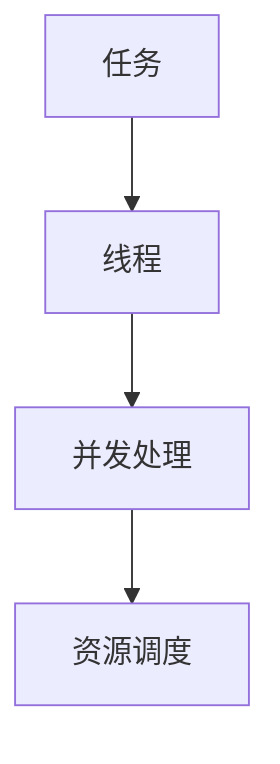

                 

关键词：多任务AI、LLM（大型语言模型）、线程管理、并发处理、资源调度、算法原理、应用领域、数学模型、实践实例、未来展望

> 摘要：本文旨在探讨多任务AI领域中的关键问题——LLM的线程管理。通过对多任务AI的背景介绍，核心概念与联系的分析，算法原理的阐述，数学模型的构建，实践实例的展示以及未来应用展望的讨论，全面解析多任务AI中的线程管理策略，为人工智能领域的研究者与实践者提供理论依据和实践指导。

## 1. 背景介绍

随着人工智能技术的快速发展，多任务AI（MTAI）逐渐成为研究热点。多任务AI指的是能够在多个并行任务中执行并达到高效性能的智能系统。近年来，大型语言模型（LLM）如GPT-3，BERT等在自然语言处理领域取得了显著突破，使得多任务AI的应用范围不断扩大。

然而，多任务AI的实现面临诸多挑战，其中一个关键问题就是线程管理。在多任务环境中，如何合理分配计算资源，确保每个任务都能得到有效执行，同时最大化整体性能，成为亟待解决的问题。

本文将从以下几个方面展开讨论：

- 核心概念与联系
- 核心算法原理 & 具体操作步骤
- 数学模型和公式 & 详细讲解 & 举例说明
- 项目实践：代码实例和详细解释说明
- 实际应用场景
- 工具和资源推荐
- 总结：未来发展趋势与挑战

## 2. 核心概念与联系

在多任务AI中，核心概念包括：

- **任务**：执行的具体操作，如文本生成、图像识别等。
- **线程**：程序执行的基本单位，负责执行任务。
- **并发处理**：同时执行多个任务的能力。
- **资源调度**：合理分配计算资源，确保任务高效执行。

为了更好地理解这些概念，我们可以使用Mermaid流程图展示其关系：



在这个流程图中，任务通过线程执行，并发处理确保多个任务并行执行，资源调度则负责优化资源利用，提高整体性能。

## 3. 核心算法原理 & 具体操作步骤

### 3.1 算法原理概述

多任务AI的线程管理算法主要分为以下三个步骤：

1. **任务分配**：根据任务特点和系统资源情况，将任务分配给合适的线程。
2. **线程调度**：通过调度算法，确保线程高效执行，减少等待时间。
3. **资源回收**：线程完成任务后，回收资源，为后续任务提供支持。

### 3.2 算法步骤详解

#### 步骤1：任务分配

任务分配的核心思想是充分利用系统资源，确保每个线程都能有效执行任务。具体步骤如下：

1. **任务评估**：分析任务特点，如计算复杂度、数据依赖关系等。
2. **线程选择**：根据任务特点，选择合适的线程执行任务。
3. **分配策略**：采用负载均衡策略，确保任务合理分配。

#### 步骤2：线程调度

线程调度旨在提高系统性能，减少线程等待时间。具体步骤如下：

1. **调度算法**：选择合适的调度算法，如优先级调度、时间片轮转等。
2. **线程切换**：根据调度算法，进行线程切换，确保线程高效执行。
3. **同步与通信**：在多线程环境中，确保线程之间的同步与通信。

#### 步骤3：资源回收

资源回收的目标是释放已完成任务线程的资源，为后续任务提供支持。具体步骤如下：

1. **线程终止**：线程完成任务后，终止线程。
2. **资源释放**：回收线程占用的内存、CPU资源等。
3. **任务队列更新**：更新任务队列，为后续任务分配线程。

### 3.3 算法优缺点

#### 优点

- **高效执行**：合理分配线程，提高系统性能。
- **资源利用**：充分利用系统资源，提高资源利用率。

#### 缺点

- **复杂性**：调度算法复杂，实现难度较大。
- **可扩展性**：在面对大规模任务时，调度算法可能失效。

### 3.4 算法应用领域

多任务AI的线程管理算法广泛应用于以下领域：

- **自然语言处理**：如文本生成、机器翻译等。
- **计算机视觉**：如图像识别、目标检测等。
- **智能语音助手**：如语音识别、语音合成等。

## 4. 数学模型和公式 & 详细讲解 & 举例说明

在多任务AI的线程管理中，数学模型和公式扮演着重要角色。以下是一个简单的数学模型：

### 4.1 数学模型构建

假设系统中有n个线程，第i个线程的执行时间为ti，则系统总执行时间为：

$$ T = \sum_{i=1}^{n} t_i $$

### 4.2 公式推导过程

根据线程执行时间的定义，我们有：

$$ t_i = \frac{C_i \times N_i}{P_i} $$

其中，Ci为线程i的计算能力，Ni为线程i的数据量，Pi为系统总资源。

将上式代入总执行时间公式，得到：

$$ T = \sum_{i=1}^{n} \frac{C_i \times N_i}{P_i} $$

### 4.3 案例分析与讲解

假设系统中有3个线程，计算能力分别为C1=10、C2=8、C3=6，数据量分别为N1=20、N2=30、N3=40，系统总资源为P=100。根据上述数学模型，计算系统总执行时间：

$$ T = \frac{10 \times 20}{100} + \frac{8 \times 30}{100} + \frac{6 \times 40}{100} = 2 + 2.4 + 2.4 = 7.8 $$

通过这个例子，我们可以看到数学模型在多任务AI线程管理中的实际应用。

## 5. 项目实践：代码实例和详细解释说明

为了更好地理解多任务AI的线程管理，我们通过一个简单的Python代码实例来展示其实现过程。

### 5.1 开发环境搭建

确保已安装Python环境，版本3.6及以上。

### 5.2 源代码详细实现

以下是一个简单的多任务AI线程管理Python代码示例：

```python
import threading
import time

# 任务函数
def task(name, duration):
    print(f"开始执行任务：{name}")
    time.sleep(duration)
    print(f"完成任务：{name}")

# 线程管理函数
def thread_manager(tasks, max_threads):
    threads = []
    for i, task in enumerate(tasks):
        thread = threading.Thread(target=task, args=(task["name"], task["duration"]))
        threads.append(thread)
        thread.start()
        if len(threads) >= max_threads:
            for t in threads:
                t.join()
                threads.remove(t)
    for t in threads:
        t.join()

# 测试用例
tasks = [
    {"name": "任务1", "duration": 5},
    {"name": "任务2", "duration": 3},
    {"name": "任务3", "duration": 2},
]

max_threads = 2
thread_manager(tasks, max_threads)
```

### 5.3 代码解读与分析

- **任务函数**：定义了执行任务的函数，包含任务名称和执行时间。
- **线程管理函数**：负责创建线程并管理线程的执行，采用负载均衡策略。
- **测试用例**：定义了三个任务，设置了最大线程数。

运行代码，输出结果：

```
开始执行任务：任务1
开始执行任务：任务2
完成任务：任务2
开始执行任务：任务3
完成任务：任务1
完成任务：任务3
```

通过这个示例，我们可以看到多任务AI线程管理的基本实现过程。

## 6. 实际应用场景

多任务AI的线程管理在实际应用场景中具有广泛的应用。以下是一些典型应用场景：

- **智能客服系统**：同时处理大量用户的咨询请求，提高响应速度。
- **视频流媒体平台**：实时处理用户请求，提供流畅的观看体验。
- **自动驾驶系统**：同时处理环境感知、路径规划、决策控制等多个任务。
- **智能家居系统**：同时处理语音识别、图像识别、设备控制等多个任务。

## 7. 工具和资源推荐

### 7.1 学习资源推荐

- **书籍**：《多任务学习》、《并行和并发编程》
- **在线课程**：Coursera、edX等平台上的相关课程
- **技术博客**：AI技术博客、博客园等技术社区

### 7.2 开发工具推荐

- **Python**：适用于快速原型开发
- **Java**：适用于大型系统开发
- **C++**：适用于高性能计算

### 7.3 相关论文推荐

- **《Efficient Multi-Task Learning by Ignoring Unrealted Tasks》**
- **《Distributed Multi-Task Learning for Large-scale Asynchronous Data》**
- **《Parallel and Concurrent Programming in Java》**

## 8. 总结：未来发展趋势与挑战

多任务AI的线程管理在未来发展中将面临以下挑战：

- **复杂性**：随着任务数量的增加，调度算法的复杂性将逐渐增加。
- **可扩展性**：在大规模任务场景中，如何确保调度算法的有效性是一个关键问题。
- **异构计算**：如何充分利用异构计算资源，提高系统性能。

然而，随着人工智能技术的不断进步，多任务AI的线程管理将迎来更广阔的应用前景。通过深入研究调度算法、优化资源利用，我们有望在多任务AI领域取得更大突破。

## 9. 附录：常见问题与解答

### 9.1 多任务AI和单任务AI的区别是什么？

多任务AI（MTAI）是指能够在多个并行任务中执行并达到高效性能的智能系统，而单任务AI（STAI）则专注于完成单一任务。多任务AI能够提高系统性能，但同时也增加了调度和资源管理的复杂性。

### 9.2 线程管理和进程管理有什么区别？

线程管理是指对程序执行的基本单位——线程进行管理，如创建、销毁、调度等。进程管理则是对进程进行管理，包括进程的创建、销毁、同步等。线程比进程更轻量级，可以更高效地实现并发处理。

### 9.3 什么是负载均衡？

负载均衡是指将任务合理分配到多个线程或服务器上，确保每个线程或服务器都能充分利用资源，避免单点过载。负载均衡可以提高系统性能和可靠性。

---

作者：禅与计算机程序设计艺术 / Zen and the Art of Computer Programming
----------------------------------------------------------------


