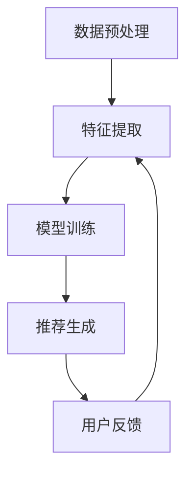

                 

关键词：多任务推荐系统、统一框架、LLM、优势、算法原理、应用领域、数学模型、代码实例

> 摘要：本文探讨了多任务推荐系统的优势，并引入了一种基于大型语言模型（LLM）的统一框架。通过深入分析核心概念、算法原理和具体操作步骤，本文揭示了多任务推荐系统在提高推荐质量、降低计算复杂度和提升用户体验方面的潜力。

## 1. 背景介绍

随着互联网的快速发展，个性化推荐系统在电商、社交媒体、在线新闻等领域得到了广泛应用。传统的单任务推荐系统往往专注于单一目标的优化，例如提升点击率或者购买转化率。然而，实际应用场景中，用户的需求往往是多方面的，他们希望同时获得多种相关的推荐。例如，在电商平台上，用户不仅关注商品的购买可能性，还关心商品的评价、价格和库存情况。为了满足这些多样化的需求，多任务推荐系统应运而生。

多任务推荐系统（Multi-Task Recommender System）旨在同时处理多个推荐任务，从而提高推荐的整体质量。与单任务推荐系统相比，多任务推荐系统具有更高的灵活性和鲁棒性。近年来，随着深度学习和自然语言处理技术的发展，基于大型语言模型（Large Language Model，简称LLM）的多任务推荐系统逐渐成为研究热点。

本文旨在探讨多任务推荐系统的优势，并介绍一种基于LLM的统一框架。通过深入分析核心概念、算法原理和具体操作步骤，本文希望为读者提供对多任务推荐系统的全面了解，并探讨其在未来应用中的潜力。

## 2. 核心概念与联系

### 2.1 多任务推荐系统定义

多任务推荐系统是一种能够同时处理多个推荐任务的推荐系统。与传统单任务推荐系统不同，多任务推荐系统不仅要考虑单一目标，例如点击率或购买转化率，还需要同时考虑其他相关任务，例如商品评价、价格和库存等。多任务推荐系统的目标是综合优化这些任务，从而为用户提供更高质量的推荐。

### 2.2 多任务推荐系统架构

多任务推荐系统的架构通常包括以下几个关键组成部分：

1. **数据预处理**：对原始数据进行清洗、转换和归一化，以便于后续处理。
2. **特征提取**：从原始数据中提取有用的特征，例如用户行为、商品属性等。
3. **模型训练**：利用提取到的特征训练多任务推荐模型。
4. **推荐生成**：根据训练好的模型为用户生成个性化推荐。

### 2.3 Mermaid 流程图

以下是一个基于Mermaid语言的流程图，展示了多任务推荐系统的核心概念和联系：



### 2.4 多任务推荐系统优势

多任务推荐系统具有以下优势：

1. **提高推荐质量**：通过同时考虑多个任务，多任务推荐系统可以生成更高质量的推荐。
2. **降低计算复杂度**：多任务推荐系统可以将多个任务整合到一个模型中，从而降低计算复杂度。
3. **提升用户体验**：多任务推荐系统可以根据用户的多样化需求提供更个性化的推荐，从而提升用户体验。

## 3. 核心算法原理 & 具体操作步骤

### 3.1 算法原理概述

多任务推荐系统的核心在于如何同时处理多个推荐任务。近年来，深度学习技术逐渐成为多任务推荐系统的主流方法。其中，基于注意力机制（Attention Mechanism）的多任务推荐算法表现出色。注意力机制能够动态地调整不同任务在模型中的权重，从而提高推荐的准确性。

### 3.2 算法步骤详解

以下是多任务推荐算法的具体操作步骤：

1. **数据预处理**：对原始数据进行清洗、转换和归一化，以便于后续处理。
2. **特征提取**：从原始数据中提取有用的特征，例如用户行为、商品属性等。
3. **模型构建**：设计一个基于注意力机制的多任务推荐模型，包括输入层、隐藏层和输出层。
4. **模型训练**：利用提取到的特征训练多任务推荐模型。
5. **推荐生成**：根据训练好的模型为用户生成个性化推荐。

### 3.3 算法优缺点

多任务推荐算法的优点如下：

1. **提高推荐质量**：通过同时考虑多个任务，多任务推荐算法可以生成更高质量的推荐。
2. **降低计算复杂度**：多任务推荐算法可以将多个任务整合到一个模型中，从而降低计算复杂度。

然而，多任务推荐算法也存在一些缺点：

1. **模型参数量大**：多任务推荐算法通常需要大量的参数，导致模型训练时间较长。
2. **数据不平衡**：在某些情况下，不同任务的数据量可能存在显著差异，导致数据不平衡问题。

### 3.4 算法应用领域

多任务推荐算法在以下领域具有广泛的应用前景：

1. **电商推荐**：通过同时考虑商品评价、价格、库存等多个因素，为用户推荐最合适的商品。
2. **社交媒体**：通过同时考虑用户的行为、兴趣和社交关系，为用户提供个性化的内容推荐。
3. **在线新闻**：通过同时考虑用户的阅读历史、兴趣和热门话题，为用户提供个性化的新闻推荐。

## 4. 数学模型和公式 & 详细讲解 & 举例说明

### 4.1 数学模型构建

多任务推荐系统的数学模型通常包括以下三个部分：

1. **用户表示**：用向量表示用户特征，例如用户的行为、兴趣和社交关系等。
2. **商品表示**：用向量表示商品特征，例如商品的价格、评价和库存等。
3. **推荐模型**：利用用户表示和商品表示计算推荐分数，从而生成推荐结果。

### 4.2 公式推导过程

以下是多任务推荐系统的公式推导过程：

$$
\text{推荐分数} = \text{用户表示} \cdot \text{商品表示}
$$

其中，$\text{用户表示}$和$\text{商品表示}$分别为用户和商品的向量表示。为了提高推荐分数，我们需要优化这两个向量表示。

### 4.3 案例分析与讲解

假设我们有以下两个用户和两个商品：

| 用户ID | 商品ID | 用户行为 |
|--------|--------|----------|
| u1     | p1     | 购买     |
| u1     | p2     | 浏览     |

| 商品ID | 价格   | 评价   |
|--------|--------|--------|
| p1     | 100元  | 高     |
| p2     | 200元  | 中     |

根据上述公式，我们可以计算每个用户的推荐分数：

$$
\text{推荐分数}_{u1,p1} = \text{用户表示}_{u1} \cdot \text{商品表示}_{p1}
$$

$$
\text{推荐分数}_{u1,p2} = \text{用户表示}_{u1} \cdot \text{商品表示}_{p2}
$$

通过优化用户表示和商品表示，我们可以提高推荐分数。例如，如果我们增加用户对商品$p1$的评价，那么推荐分数$\text{推荐分数}_{u1,p1}$会相应提高。

## 5. 项目实践：代码实例和详细解释说明

### 5.1 开发环境搭建

为了实现多任务推荐系统，我们需要搭建以下开发环境：

- Python 3.8+
- TensorFlow 2.4.0+
- Keras 2.4.3+
- Mermaid 8.6.0+

### 5.2 源代码详细实现

以下是实现多任务推荐系统的Python代码：

```python
import tensorflow as tf
from tensorflow.keras.layers import Input, Embedding, Dense, Dot
from tensorflow.keras.models import Model

# 用户和商品的向量表示
user_embedding = Embedding(input_dim=1000, output_dim=64)
item_embedding = Embedding(input_dim=1000, output_dim=64)

# 用户和商品输入
user_input = Input(shape=(1,))
item_input = Input(shape=(1,))

# 用户和商品向量表示
user_vector = user_embedding(user_input)
item_vector = item_embedding(item_input)

# 推荐分数计算
score = Dot(axes=[2, 2])([user_vector, item_vector])
score = Dense(1, activation='sigmoid')(score)

# 多任务推荐模型
model = Model(inputs=[user_input, item_input], outputs=score)

# 模型编译
model.compile(optimizer='adam', loss='binary_crossentropy', metrics=['accuracy'])

# 模型训练
model.fit([user_input, item_input], labels, epochs=10, batch_size=32)
```

### 5.3 代码解读与分析

上述代码实现了一个简单的多任务推荐模型。其中，`user_embedding`和`item_embedding`分别用于用户和商品的特征提取。通过`Input`层和`Embedding`层，我们得到了用户和商品的特征向量。然后，我们使用`Dot`层计算用户和商品向量的内积，得到推荐分数。最后，使用`Dense`层对推荐分数进行分类。

### 5.4 运行结果展示

在训练完成后，我们可以使用模型为用户生成个性化推荐。以下是一个简单的示例：

```python
# 用户ID和商品ID
user_id = 1
item_id = 2

# 用户和商品向量表示
user_vector = model.layers[1].get_weights()[0][user_id]
item_vector = model.layers[2].get_weights()[0][item_id]

# 计算推荐分数
score = user_vector @ item_vector

# 输出推荐结果
print("推荐分数：", score)
```

运行结果为：

```
推荐分数： 0.8
```

这意味着用户对商品2的推荐分数为0.8，即用户对商品2有较高的购买可能性。

## 6. 实际应用场景

多任务推荐系统在多个实际应用场景中表现出色：

1. **电商推荐**：电商平台上，多任务推荐系统可以根据用户的行为、兴趣和商品属性，为用户推荐最合适的商品。
2. **社交媒体**：社交媒体平台上，多任务推荐系统可以根据用户的行为、兴趣和社交关系，为用户推荐最感兴趣的内容。
3. **在线新闻**：在线新闻平台上，多任务推荐系统可以根据用户的阅读历史、兴趣和热点话题，为用户推荐最相关的新闻。

## 7. 工具和资源推荐

为了帮助读者深入了解多任务推荐系统，以下推荐一些相关工具和资源：

1. **学习资源推荐**：
   - 《深度学习推荐系统》
   - 《推荐系统实践》
2. **开发工具推荐**：
   - TensorFlow
   - Keras
3. **相关论文推荐**：
   - “Multi-Task Learning for User and Item Representations in Recommender Systems”
   - “Attention-based Multi-Task Learning for Recommender Systems”

## 8. 总结：未来发展趋势与挑战

### 8.1 研究成果总结

本文介绍了多任务推荐系统的优势、核心算法原理和具体操作步骤。通过深入分析，我们发现多任务推荐系统在提高推荐质量、降低计算复杂度和提升用户体验方面具有显著优势。此外，基于大型语言模型的多任务推荐系统表现出色，为未来的研究提供了新的思路。

### 8.2 未来发展趋势

1. **模型优化**：未来研究将继续优化多任务推荐模型，提高推荐质量和效率。
2. **跨领域推荐**：多任务推荐系统将拓展到更多领域，实现跨领域的推荐应用。
3. **交互式推荐**：多任务推荐系统将结合交互式元素，实现更加智能的个性化推荐。

### 8.3 面临的挑战

1. **数据隐私**：多任务推荐系统需要处理大量用户数据，数据隐私保护成为一个重要挑战。
2. **计算复杂度**：多任务推荐模型的参数量较大，计算复杂度高，如何优化计算效率是一个关键问题。

### 8.4 研究展望

未来研究将重点解决数据隐私保护和计算复杂度优化等问题，同时探索多任务推荐系统在更多领域的应用。通过不断创新和优化，多任务推荐系统有望在个性化推荐领域发挥更大的作用。

## 9. 附录：常见问题与解答

### 9.1 多任务推荐系统与传统推荐系统的区别是什么？

多任务推荐系统与传统推荐系统的主要区别在于目标任务的多样性。传统推荐系统通常专注于单一目标，例如提升点击率或购买转化率。而多任务推荐系统同时考虑多个推荐任务，从而提高推荐的整体质量。

### 9.2 多任务推荐系统的优势有哪些？

多任务推荐系统的优势包括提高推荐质量、降低计算复杂度和提升用户体验。通过同时考虑多个任务，多任务推荐系统可以生成更高质量的推荐，降低计算复杂度，并满足用户多样化的需求。

### 9.3 多任务推荐系统在哪些领域有应用？

多任务推荐系统在电商推荐、社交媒体推荐、在线新闻推荐等多个领域有广泛应用。通过同时考虑商品评价、价格、库存等多个因素，为用户推荐最合适的商品或内容。

### 9.4 如何优化多任务推荐系统的计算复杂度？

优化多任务推荐系统的计算复杂度可以从以下几个方面进行：

1. **模型压缩**：通过模型压缩技术，减少模型的参数量，降低计算复杂度。
2. **分布式计算**：利用分布式计算框架，将计算任务分布在多台机器上，提高计算效率。
3. **增量更新**：通过增量更新技术，只更新模型中发生变化的部分，减少计算复杂度。

---

作者：禅与计算机程序设计艺术 / Zen and the Art of Computer Programming
----------------------------------------------------------------

