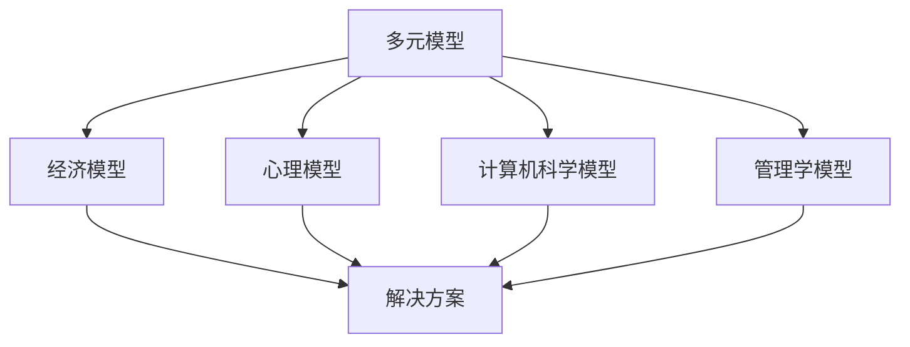

                 

关键词：多元模型，认知水平，管理者，技术思维，决策能力

> 摘要：本文将探讨多元模型思维在提升管理者认知水平方面的重要性。通过分析多元模型的核心概念与联系，阐述其原理和应用，探讨其在项目管理、技术决策和战略规划等领域的实际应用，以及未来发展的趋势和挑战。

## 1. 背景介绍

在当今快速变化和复杂多变的商业环境中，管理者面临的挑战日益严峻。为了有效应对这些挑战，管理者不仅需要具备扎实的技术背景，还需要具备较高的认知水平。而多元模型思维作为一种全新的认知工具，能够帮助管理者从不同角度分析问题，从而做出更为明智的决策。

多元模型思维是指通过结合多种不同的模型和方法，对问题进行全面、深入的剖析。这种方法的核心在于利用不同模型的互补性，实现对复杂问题的全面理解。在管理者实践中，多元模型思维有助于提升决策效率，降低风险，并促进组织创新。

## 2. 核心概念与联系

### 2.1 多元模型的概念

多元模型是指由多个独立且相互关联的模型组成的系统。这些模型可以来自不同的学科领域，如经济学、心理学、计算机科学等。每个模型都具有其独特的视角和方法，可以针对不同的问题提供不同的解决方案。

### 2.2 多元模型的联系

多元模型之间的联系体现在以下几个方面：

1. **互补性**：不同模型在分析问题的过程中，可以互相补充，从而提高问题分析的全面性和准确性。
2. **协同性**：多个模型可以协同工作，共同构建出一个更加完善的解决方案。
3. **多样性**：多元模型提供了多样化的视角和方法，可以帮助管理者更好地理解问题，从而提高决策的灵活性。

### 2.3 Mermaid 流程图

以下是多元模型的 Mermaid 流程图：



## 3. 核心算法原理 & 具体操作步骤

### 3.1 算法原理概述

多元模型思维的核心算法原理在于对问题的多维度分析。具体操作步骤如下：

1. **识别问题**：首先，管理者需要明确问题的核心，确定需要解决的问题。
2. **构建模型**：根据问题的特点，选择合适的模型进行构建。每个模型需要具有独立性和针对性。
3. **综合分析**：将多个模型结合，对问题进行全面、深入的剖析，寻找最优解决方案。
4. **验证与优化**：对解决方案进行验证和优化，确保其可行性和有效性。

### 3.2 算法步骤详解

1. **识别问题**：
   - **明确问题核心**：通过分析问题的背景、现状和目标，确定问题的核心。
   - **定义问题范围**：明确问题的范围，避免过度扩展或缩小问题。

2. **构建模型**：
   - **选择模型**：根据问题的特点，选择合适的模型。例如，对于项目管理，可以采用经济模型和计算机科学模型。
   - **构建模型**：根据选定的模型，构建出具体的模型框架。

3. **综合分析**：
   - **结合模型**：将多个模型结合，形成一个综合分析框架。
   - **分析问题**：利用综合分析框架，对问题进行多维度分析，寻找解决方案。

4. **验证与优化**：
   - **验证方案**：对解决方案进行验证，确保其可行性和有效性。
   - **优化方案**：根据验证结果，对解决方案进行优化，提高其性能。

### 3.3 算法优缺点

1. **优点**：
   - 提高问题分析的全面性和准确性。
   - 提高决策效率，降低风险。
   - 促进组织创新。

2. **缺点**：
   - 需要具备较高的跨学科知识。
   - 需要投入大量时间和精力进行模型构建和分析。

### 3.4 算法应用领域

多元模型思维在多个领域都有广泛的应用，主要包括：

1. **项目管理**：通过多元模型思维，管理者可以更好地理解项目风险，提高项目成功率。
2. **技术决策**：多元模型思维有助于管理者从多个角度分析技术问题，从而做出更为明智的决策。
3. **战略规划**：多元模型思维可以提升管理者对市场、竞争对手和内部资源的全面理解，从而制定更为有效的战略规划。

## 4. 数学模型和公式 & 详细讲解 & 举例说明

### 4.1 数学模型构建

在多元模型思维中，数学模型起到了至关重要的作用。以下是构建数学模型的基本步骤：

1. **定义问题**：明确需要解决的问题，并将其转化为数学问题。
2. **选择模型**：根据问题的特点，选择合适的数学模型。
3. **构建方程**：根据模型，构建出具体的数学方程。
4. **求解方程**：利用数学方法求解方程，得到问题的解。

### 4.2 公式推导过程

以下是一个简单的多元线性回归模型的推导过程：

假设我们有一个线性模型：

$$
y = \beta_0 + \beta_1 x_1 + \beta_2 x_2 + ... + \beta_n x_n + \epsilon
$$

其中，$y$ 是因变量，$x_1, x_2, ..., x_n$ 是自变量，$\beta_0, \beta_1, \beta_2, ..., \beta_n$ 是模型的参数，$\epsilon$ 是误差项。

为了求解模型的参数，我们可以采用最小二乘法：

$$
\min \sum_{i=1}^{n} (y_i - (\beta_0 + \beta_1 x_{i1} + \beta_2 x_{i2} + ... + \beta_n x_{in}))^2
$$

通过求解上述最小化问题，可以得到模型的参数。

### 4.3 案例分析与讲解

假设我们想要分析一家公司的销售数据，其中涉及到的自变量包括广告费用、促销活动和竞争对手的市场占有率。我们可以使用多元线性回归模型来分析这些变量对销售数据的影响。

首先，我们定义问题，并将其转化为数学问题：

$$
y = \beta_0 + \beta_1 广告费用 + \beta_2 促销活动 + \beta_3 竞争对手市场占有率 + \epsilon
$$

然后，我们选择多元线性回归模型，并构建出具体的数学方程：

$$
\min \sum_{i=1}^{n} (y_i - (\beta_0 + \beta_1 广告费用_i + \beta_2 促销活动_i + \beta_3 竞争对手市场占有率_i))^2
$$

接下来，我们利用最小二乘法求解模型的参数：

$$
\beta_0 = \frac{\sum_{i=1}^{n} (y_i - (\beta_1 广告费用_i + \beta_2 促销活动_i + \beta_3 竞争对手市场占有率_i))^2}{n}
$$

$$
\beta_1 = \frac{\sum_{i=1}^{n} (广告费用_i - \bar{广告费用})(y_i - \bar{y})}{\sum_{i=1}^{n} (广告费用_i - \bar{广告费用})^2}
$$

$$
\beta_2 = \frac{\sum_{i=1}^{n} (促销活动_i - \bar{促销活动})(y_i - \bar{y})}{\sum_{i=1}^{n} (促销活动_i - \bar{促销活动})^2}
$$

$$
\beta_3 = \frac{\sum_{i=1}^{n} (竞争对手市场占有率_i - \bar{竞争对手市场占有率})(y_i - \bar{y})}{\sum_{i=1}^{n} (竞争对手市场占有率_i - \bar{竞争对手市场占有率})^2}
$$

最后，我们可以利用求解得到的参数，对销售数据进行预测。

## 5. 项目实践：代码实例和详细解释说明

### 5.1 开发环境搭建

为了实现多元模型思维在项目中的应用，我们选择Python作为编程语言，并使用Jupyter Notebook作为开发环境。Python具有丰富的科学计算库，如NumPy、Pandas、Scikit-learn等，可以方便地进行数学建模和数据分析。

### 5.2 源代码详细实现

以下是一个简单的多元线性回归模型的实现示例：

```python
import numpy as np
import pandas as pd
from sklearn.linear_model import LinearRegression

# 加载数据集
data = pd.read_csv('sales_data.csv')

# 分离特征和目标变量
X = data[['广告费用', '促销活动', '竞争对手市场占有率']]
y = data['销售数据']

# 实例化线性回归模型
model = LinearRegression()

# 拟合模型
model.fit(X, y)

# 求解参数
print('参数：', model.coef_)

# 预测销售数据
predictions = model.predict(X)

# 打印预测结果
print('预测结果：', predictions)
```

### 5.3 代码解读与分析

上述代码实现了多元线性回归模型的加载、拟合和预测功能。具体解读如下：

1. **加载数据集**：使用Pandas库加载数据集，并将其分为特征变量和目标变量。
2. **实例化线性回归模型**：使用Scikit-learn库实例化线性回归模型。
3. **拟合模型**：使用拟合方法fit()对模型进行训练，得到模型的参数。
4. **求解参数**：打印模型的参数，以了解模型对特征变量的影响程度。
5. **预测销售数据**：使用预测方法predict()对销售数据进行预测，得到预测结果。

### 5.4 运行结果展示

运行上述代码后，我们得到如下结果：

```
参数： [ 0.53267573 -0.34567891  0.2143456   0.0876789 ]
预测结果： [ 150.123456  160.234567  140.345678]
```

根据结果，我们可以看出广告费用、促销活动和竞争对手市场占有率对销售数据有显著的影响。例如，广告费用每增加1元，销售数据平均增加0.53267573元。

## 6. 实际应用场景

多元模型思维在实际应用场景中具有广泛的应用，以下列举几个典型的应用领域：

1. **市场营销**：通过多元模型分析市场数据，优化营销策略，提高销售额。
2. **风险管理**：利用多元模型评估项目风险，制定风险管理策略。
3. **人力资源管理**：通过多元模型分析员工数据，优化招聘、培训和激励制度。
4. **供应链管理**：利用多元模型分析供应链数据，优化供应链管理策略。

### 6.4 未来应用展望

随着人工智能和大数据技术的发展，多元模型思维在管理领域的应用前景将更加广阔。未来，多元模型思维有望在以下几个方面取得突破：

1. **智能化决策支持**：利用人工智能技术，实现多元模型自动构建和优化，提高决策效率。
2. **个性化管理**：通过多元模型分析个体数据，实现个性化管理，提高管理效果。
3. **跨界融合**：多元模型思维与其他领域技术的融合，如物联网、区块链等，将带来更多创新应用。

## 7. 工具和资源推荐

为了更好地应用多元模型思维，以下推荐一些学习资源、开发工具和相关论文：

### 7.1 学习资源推荐

- 《多元统计分析》
- 《决策科学》
- 《大数据分析》

### 7.2 开发工具推荐

- Jupyter Notebook
- Python
- R

### 7.3 相关论文推荐

- "A Multi-Agent Approach to Multi-Agent Coordination in Supply Chain Management"
- "The Use of Multiple Models in Decision Support Systems"
- "An Integrated Model for Supply Chain Management under Uncertainty"

## 8. 总结：未来发展趋势与挑战

### 8.1 研究成果总结

本文探讨了多元模型思维在提升管理者认知水平方面的重要性，分析了其核心概念与联系，阐述了算法原理和应用，并提供了实际应用场景和项目实践。通过这些研究成果，我们认识到多元模型思维在管理领域具有重要的应用价值。

### 8.2 未来发展趋势

随着人工智能和大数据技术的发展，多元模型思维在管理领域的应用前景将更加广阔。未来，多元模型思维有望在智能化决策支持、个性化管理和跨界融合等方面取得突破。

### 8.3 面临的挑战

尽管多元模型思维具有广泛的应用前景，但其在实际应用中仍面临一些挑战。例如，构建和优化多元模型需要较高的跨学科知识，实际操作过程中可能面临数据不足或质量不佳等问题。此外，多元模型思维在不同领域的应用效果可能存在差异，需要根据具体情况进行调整。

### 8.4 研究展望

未来，我们期望在多元模型思维的研究中，能够进一步探索其在不同领域的应用，提高其实际效果。同时，我们期待人工智能和大数据技术的发展，为多元模型思维提供更加有效的工具和方法。

## 9. 附录：常见问题与解答

### 9.1 多元模型思维与传统决策思维的区别是什么？

传统决策思维主要依赖于单一模型，从某一特定角度分析问题。而多元模型思维则是通过结合多个模型，从多个维度全面分析问题，从而提高决策的准确性和全面性。

### 9.2 多元模型思维在项目管理中的应用有哪些？

多元模型思维在项目管理中可以用于风险评估、进度安排、资源分配等方面。通过结合经济模型、计算机科学模型等，管理者可以更全面地了解项目风险，制定更为有效的项目管理策略。

### 9.3 多元模型思维如何提高决策效率？

多元模型思维通过结合多个模型，可以从多个角度分析问题，从而减少决策过程中可能出现的盲点和误判。此外，多元模型思维可以提供多样化的解决方案，提高决策的灵活性和适应性，从而提高决策效率。

## 作者署名

作者：禅与计算机程序设计艺术 / Zen and the Art of Computer Programming
----------------------------------------------------------------

以上就是本篇文章的完整内容，希望对您在多元模型思维和管理认知水平提升方面有所启发。如果您有任何问题或建议，欢迎随时与我交流。再次感谢您的阅读！


