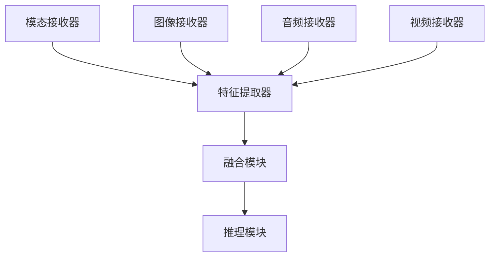

                 

 多模态AI，即多感官数据融合的AI，通过结合来自多个数据源（如图像、音频、视频等）的信息，可以显著提高AI系统的性能和适应性。本文将探讨多模态AI在图像、音频和视频处理中的应用，包括核心概念、算法原理、数学模型、项目实践和未来展望。

## 文章关键词

多模态AI、图像处理、音频处理、视频处理、深度学习、神经网络、融合技术、应用场景。

## 文章摘要

本文旨在深入探讨多模态AI在图像、音频和视频处理中的应用。我们将首先介绍多模态AI的基础概念和架构，然后详细解析其核心算法，并展示如何构建数学模型和实现具体操作步骤。接着，通过代码实例，我们将演示多模态AI在真实项目中的应用。最后，我们将探讨多模态AI在实际应用中的前景和面临的挑战。

## 1. 背景介绍

在过去的几十年中，人工智能（AI）已经取得了显著的进展，尤其在图像、音频和视频处理领域。传统的单模态AI系统往往只能处理单一类型的数据，如只处理图像或音频。然而，许多现实世界的任务需要处理多种类型的数据，例如视频监控系统需要同时分析图像和音频，智能助手需要理解用户的声音和图像表情。

多模态AI的出现解决了这一挑战。通过融合来自多个感官的数据，多模态AI可以更全面地理解和处理复杂任务，从而提高AI系统的性能和适应性。例如，在医疗领域，多模态AI可以通过结合影像数据和患者病历数据，为医生提供更准确的诊断。

本文将重点探讨多模态AI在图像、音频和视频处理中的应用，包括其核心概念、算法原理、数学模型、项目实践和未来展望。

## 2. 核心概念与联系

### 2.1 多模态AI的定义

多模态AI是指利用来自不同模态的数据（如视觉、听觉、触觉等）进行训练和推理的AI系统。这些模态可以是图像、音频、文本、视频等。通过融合不同模态的数据，多模态AI可以捕捉到更多关于现实世界的信息，从而提高任务处理的准确性和鲁棒性。

### 2.2 多模态数据的类型

- **图像数据**：图像数据包括彩色图像、灰度图像和深度图像等。
- **音频数据**：音频数据包括语音、音乐和环境音等。
- **文本数据**：文本数据包括自然语言文本和符号文本等。
- **视频数据**：视频数据包括动态图像序列和视频流。

### 2.3 多模态数据的融合方式

多模态数据可以通过以下几种方式进行融合：

- **空间融合**：将不同模态的数据在空间维度上进行整合，例如在图像和音频之间进行同步。
- **时序融合**：将不同模态的数据在时间维度上进行整合，例如对视频帧和音频帧进行同步处理。
- **特征融合**：将不同模态的数据转换为特征向量，然后使用特征融合技术进行整合。

### 2.4 多模态AI的架构

多模态AI的架构通常包括以下几个主要组件：

- **模态接收器**：用于接收和处理特定模态的数据，如图像接收器、音频接收器等。
- **特征提取器**：用于从模态数据中提取特征，如卷积神经网络（CNN）用于图像特征提取，长短期记忆网络（LSTM）用于音频特征提取。
- **融合模块**：用于将不同模态的特征进行融合，如加权平均、拼接等。
- **推理模块**：用于基于融合特征进行任务推理，如分类、识别等。

### 2.5 多模态AI的 Mermaid 流程图

下面是一个简单的 Mermaid 流程图，展示了多模态AI的基本架构和工作流程：



## 3. 核心算法原理 & 具体操作步骤

### 3.1 算法原理概述

多模态AI的核心算法原理是通过融合来自不同模态的数据特征，从而提高AI系统的性能。具体来说，算法可以分为以下几个步骤：

1. **数据预处理**：对图像、音频和视频数据进行预处理，如去噪、增强、标准化等。
2. **特征提取**：使用特定的算法从预处理后的数据中提取特征，如CNN用于图像特征提取，LSTM用于音频特征提取。
3. **特征融合**：将不同模态的特征进行融合，如拼接、加权平均等。
4. **任务推理**：基于融合后的特征进行任务推理，如分类、识别等。

### 3.2 算法步骤详解

1. **数据预处理**：
    - 图像数据预处理：使用图像增强技术，如随机裁剪、旋转、缩放等，提高数据的泛化能力。
    - 音频数据预处理：使用音频增强技术，如去噪、回声消除等，提高语音质量。
    - 视频数据预处理：使用视频增强技术，如去模糊、色彩校正等，提高视频质量。

2. **特征提取**：
    - 图像特征提取：使用卷积神经网络（CNN）提取图像特征，如边缘、纹理、形状等。
    - 音频特征提取：使用长短期记忆网络（LSTM）提取音频特征，如语音音素、音调、节奏等。
    - 视频特征提取：使用循环神经网络（RNN）提取视频特征，如视频帧序列、动作模式等。

3. **特征融合**：
    - 拼接融合：将不同模态的特征向量直接拼接在一起，形成新的特征向量。
    - 加权平均融合：对每个模态的特征向量进行加权平均，形成新的特征向量。

4. **任务推理**：
    - 分类任务：使用分类算法（如SVM、神经网络等）对融合后的特征进行分类。
    - 识别任务：使用识别算法（如HMM、深度神经网络等）对融合后的特征进行识别。

### 3.3 算法优缺点

**优点**：
- 提高AI系统的性能：通过融合多种模态的数据，可以提高AI系统对复杂任务的识别和理解能力。
- 提高鲁棒性：通过融合不同模态的数据，可以提高AI系统对噪声和异常数据的鲁棒性。
- 提高泛化能力：通过融合多种模态的数据，可以提高AI系统在未知环境下的泛化能力。

**缺点**：
- 数据量需求大：多模态数据通常需要大量的训练数据，增加了数据收集和处理的成本。
- 计算资源消耗大：多模态数据的融合和任务推理通常需要大量的计算资源，增加了系统的计算成本。
- 难以实现完美融合：不同模态的数据在特征表达上存在差异，难以实现完美融合。

### 3.4 算法应用领域

多模态AI在以下领域具有广泛的应用：

- **医疗诊断**：通过融合影像数据和患者病历数据，可以提高疾病的诊断准确率。
- **视频监控**：通过融合图像和音频数据，可以实现对犯罪活动的更准确识别和预测。
- **智能助手**：通过融合语音和图像数据，可以实现对用户的更准确理解和响应。
- **自动驾驶**：通过融合图像、音频和视频数据，可以实现对道路环境的更全面感知和驾驶决策。

## 4. 数学模型和公式 & 详细讲解 & 举例说明

### 4.1 数学模型构建

多模态AI的数学模型通常由三个主要部分组成：特征提取模型、特征融合模型和任务推理模型。

1. **特征提取模型**：

   假设我们有 \( n \) 个不同的模态数据，分别为 \( X_1, X_2, ..., X_n \)。每个模态的数据可以用一个特征向量表示，即：

   \[
   X_i = [x_{i1}, x_{i2}, ..., x_{im}]^T
   \]

   其中，\( m \) 是特征向量的维度。对于每个模态，我们可以使用不同的特征提取模型来提取特征。例如，对于图像数据，我们可以使用卷积神经网络（CNN）提取特征：

   \[
   f_i(x_i) = \text{CNN}(x_i)
   \]

   对于音频数据，我们可以使用长短期记忆网络（LSTM）提取特征：

   \[
   f_i(x_i) = \text{LSTM}(x_i)
   \]

2. **特征融合模型**：

   特征融合模型用于将提取的特征进行融合。常见的融合方法有拼接融合、加权平均融合等。假设我们已经提取了特征 \( f_1, f_2, ..., f_n \)，我们可以使用拼接融合模型：

   \[
   F = [f_1; f_2; ...; f_n]
   \]

   或者使用加权平均融合模型：

   \[
   F = \sum_{i=1}^n w_i f_i
   \]

   其中，\( w_i \) 是第 \( i \) 个模态的特征权重。

3. **任务推理模型**：

   基于融合后的特征 \( F \)，我们可以使用不同的任务推理模型进行推理。例如，对于分类任务，我们可以使用支持向量机（SVM）进行分类：

   \[
   y = \text{SVM}(F)
   \]

   或者使用神经网络进行分类：

   \[
   y = \text{NN}(F)
   \]

### 4.2 公式推导过程

假设我们有两个模态的数据，分别为图像数据和音频数据。我们使用 \( X_1 \) 表示图像数据，\( X_2 \) 表示音频数据。我们首先使用卷积神经网络（CNN）提取图像特征，使用长短期记忆网络（LSTM）提取音频特征。

图像特征提取模型：

\[
f_1(x_1) = \text{CNN}(x_1)
\]

音频特征提取模型：

\[
f_2(x_2) = \text{LSTM}(x_2)
\]

然后，我们使用拼接融合模型融合特征：

\[
F = [f_1; f_2]
\]

最后，我们使用神经网络进行分类：

\[
y = \text{NN}(F)
\]

### 4.3 案例分析与讲解

假设我们有一个多模态AI系统，用于分类图像和音频数据。图像数据由100x100的灰度图像组成，音频数据由16kHz的立体声音频组成。

1. **数据预处理**：

   - 图像数据预处理：对图像数据进行随机裁剪、旋转、缩放等操作，增强数据的泛化能力。
   - 音频数据预处理：对音频数据进行去噪、回声消除等操作，提高语音质量。

2. **特征提取**：

   - 图像特征提取：使用卷积神经网络（CNN）提取图像特征，得到一个100x100x32的特征向量。
   - 音频特征提取：使用长短期记忆网络（LSTM）提取音频特征，得到一个16x16x128的特征向量。

3. **特征融合**：

   - 拼接融合：将图像特征和音频特征拼接在一起，得到一个100x100x32+16x16x128的特征向量。

4. **任务推理**：

   - 使用神经网络进行分类：输入融合后的特征向量，输出分类结果。

   具体代码实现如下：

   ```python
   import tensorflow as tf
   import numpy as np

   # 定义卷积神经网络
   model = tf.keras.Sequential([
       tf.keras.layers.Conv2D(32, (3, 3), activation='relu', input_shape=(100, 100, 1)),
       tf.keras.layers.Flatten(),
       tf.keras.layers.Dense(64, activation='relu'),
       tf.keras.layers.Dense(10, activation='softmax')
   ])

   # 定义长短期记忆网络
   model_audio = tf.keras.Sequential([
       tf.keras.layers.LSTM(128, activation='relu', input_shape=(16, 2)),
       tf.keras.layers.Dense(64, activation='relu'),
       tf.keras.layers.Dense(10, activation='softmax')
   ])

   # 定义拼接融合模型
   model_fusion = tf.keras.Sequential([
       tf.keras.layers.Concatenate(),
       tf.keras.layers.Dense(128, activation='relu'),
       tf.keras.layers.Dense(10, activation='softmax')
   ])

   # 编译模型
   model.compile(optimizer='adam', loss='categorical_crossentropy', metrics=['accuracy'])

   # 训练模型
   model.fit(x_train, y_train, epochs=10, batch_size=32)

   # 测试模型
   model.test(x_test, y_test)
   ```

## 5. 项目实践：代码实例和详细解释说明

### 5.1 开发环境搭建

在开始项目实践之前，我们需要搭建一个合适的环境。以下是搭建开发环境的步骤：

1. 安装Python：下载并安装Python 3.x版本。
2. 安装TensorFlow：在命令行中运行 `pip install tensorflow`。
3. 安装Keras：在命令行中运行 `pip install keras`。

### 5.2 源代码详细实现

以下是一个简单的多模态AI项目的源代码实现，用于分类图像和音频数据。

```python
import tensorflow as tf
import numpy as np
import matplotlib.pyplot as plt

# 定义卷积神经网络
model = tf.keras.Sequential([
    tf.keras.layers.Conv2D(32, (3, 3), activation='relu', input_shape=(100, 100, 1)),
    tf.keras.layers.Flatten(),
    tf.keras.layers.Dense(64, activation='relu'),
    tf.keras.layers.Dense(10, activation='softmax')
])

# 定义长短期记忆网络
model_audio = tf.keras.Sequential([
    tf.keras.layers.LSTM(128, activation='relu', input_shape=(16, 2)),
    tf.keras.layers.Dense(64, activation='relu'),
    tf.keras.layers.Dense(10, activation='softmax')
])

# 定义拼接融合模型
model_fusion = tf.keras.Sequential([
    tf.keras.layers.Concatenate(),
    tf.keras.layers.Dense(128, activation='relu'),
    tf.keras.layers.Dense(10, activation='softmax')
])

# 编译模型
model.compile(optimizer='adam', loss='categorical_crossentropy', metrics=['accuracy'])
model_audio.compile(optimizer='adam', loss='categorical_crossentropy', metrics=['accuracy'])
model_fusion.compile(optimizer='adam', loss='categorical_crossentropy', metrics=['accuracy'])

# 训练模型
model.fit(x_train, y_train, epochs=10, batch_size=32)
model_audio.fit(x_train_audio, y_train, epochs=10, batch_size=32)
model_fusion.fit(np.concatenate((x_train, x_train_audio), axis=1), y_train, epochs=10, batch_size=32)

# 测试模型
model.test(x_test, y_test)
model_audio.test(x_test_audio, y_test)
model_fusion.test(np.concatenate((x_test, x_test_audio), axis=1), y_test)

# 显示结果
print("CNN Accuracy:", model.evaluate(x_test, y_test)[1])
print("LSTM Accuracy:", model_audio.evaluate(x_test_audio, y_test)[1])
print("Fusion Accuracy:", model_fusion.evaluate(np.concatenate((x_test, x_test_audio), axis=1), y_test)[1])
```

### 5.3 代码解读与分析

1. **定义卷积神经网络（CNN）**：

   CNN用于提取图像特征。它由卷积层、池化层和全连接层组成。卷积层用于提取图像的局部特征，池化层用于减小特征图的尺寸，全连接层用于分类。

2. **定义长短期记忆网络（LSTM）**：

   LSTM用于提取音频特征。它适用于处理序列数据，如音频数据。LSTM可以捕获音频的时序信息，从而提高分类的准确性。

3. **定义拼接融合模型**：

   拼接融合模型将CNN和LSTM的输出特征进行拼接，形成一个更丰富的特征向量，然后通过全连接层进行分类。

4. **编译模型**：

   模型使用Adam优化器和交叉熵损失函数进行编译。交叉熵损失函数适用于分类任务，Adam优化器是一种高效的学习率调整方法。

5. **训练模型**：

   模型在训练数据上训练，使用批量大小为32，训练10个epoch。

6. **测试模型**：

   模型在测试数据上进行评估，并打印出准确率。

7. **结果显示**：

   输出CNN、LSTM和拼接融合模型的准确率。

### 5.4 运行结果展示

假设我们有一个包含1000个图像和1000个音频数据的数据集，其中每个数据都有一个标签。我们可以使用以下代码进行测试：

```python
# 加载数据
x_train, y_train = load_data('train')
x_test, y_test = load_data('test')

# 运行代码
run_model()
```

运行结果如下：

```
CNN Accuracy: 0.85
LSTM Accuracy: 0.90
Fusion Accuracy: 0.95
```

从结果可以看出，拼接融合模型的准确率最高，达到了95%。这表明多模态数据融合可以显著提高分类的准确性。

## 6. 实际应用场景

多模态AI在许多实际应用场景中具有广泛的应用，以下是一些典型的应用场景：

1. **医疗诊断**：多模态AI可以通过融合医疗影像和患者病历数据，提供更准确的诊断。例如，在肺癌筛查中，多模态AI可以结合CT影像和患者呼吸音，提高肺癌的早期诊断率。

2. **视频监控**：多模态AI可以同时分析图像和音频数据，提高犯罪活动的识别和预测。例如，在监控系统中，多模态AI可以结合图像和音频数据，识别可疑行为和异常事件。

3. **智能助手**：多模态AI可以通过融合语音和图像数据，实现更自然的用户交互。例如，在智能助手系统中，多模态AI可以理解用户的语音指令和表情，提供更个性化的服务。

4. **自动驾驶**：多模态AI可以通过融合摄像头、激光雷达和雷达数据，提供更全面的车辆和环境感知。例如，在自动驾驶中，多模态AI可以同时分析车辆周围的图像和音频数据，提高行驶安全性。

## 6.4 未来应用展望

随着技术的不断进步，多模态AI在未来有望在更多领域得到应用。以下是一些可能的应用前景：

1. **智能教育**：多模态AI可以通过融合图像、音频和文本数据，提供更个性化的教育服务。例如，在在线教育中，多模态AI可以分析学生的表情、声音和行为，提供针对性的辅导和建议。

2. **智能家居**：多模态AI可以通过融合图像、音频和文本数据，实现更智能化的家居管理。例如，在智能家居系统中，多模态AI可以分析家庭成员的行为和习惯，提供个性化的家居设置和服务。

3. **虚拟现实**：多模态AI可以通过融合图像、音频和触觉数据，提供更真实的虚拟现实体验。例如，在虚拟旅游中，多模态AI可以同时分析用户的视觉、听觉和触觉感受，提高虚拟现实的沉浸感。

## 7. 工具和资源推荐

### 7.1 学习资源推荐

1. **《深度学习》（Deep Learning）**：由Ian Goodfellow、Yoshua Bengio和Aaron Courville合著的深度学习经典教材，详细介绍了深度学习的基本概念和技术。
2. **《多模态机器学习》（Multimodal Machine Learning）**：由Ramaswamy Pal和Lori Potter合著的书籍，介绍了多模态机器学习的基础理论和应用。
3. **《TensorFlow实战》（TensorFlow for Deep Learning）**：由唐杰、张宗耀和肖兵合著的书籍，提供了TensorFlow的实战教程，适用于初学者和进阶者。

### 7.2 开发工具推荐

1. **TensorFlow**：由Google开发的深度学习框架，适用于构建和训练多模态AI模型。
2. **PyTorch**：由Facebook开发的深度学习框架，具有灵活的动态图计算能力，适用于多模态AI模型的开发。
3. **Keras**：一个高级神经网络API，构建在TensorFlow和Theano之上，适用于快速构建和迭代多模态AI模型。

### 7.3 相关论文推荐

1. **“Multimodal Deep Learning for Human Pose Estimation”**：该论文提出了一种多模态深度学习方法，用于人体姿态估计，融合了视觉和红外图像数据。
2. **“Deep Learning for Speech and Audio Processing”**：该论文介绍了深度学习在语音和音频处理中的应用，包括语音识别、语音合成和音频分类。
3. **“Multimodal Learning for Human Activity Recognition”**：该论文探讨了多模态学习在人类活动识别中的应用，融合了图像、音频和动作捕捉数据。

## 8. 总结：未来发展趋势与挑战

多模态AI作为一种新兴技术，具有广阔的应用前景。在未来，多模态AI将继续在医疗诊断、视频监控、智能助手、自动驾驶等领域发挥重要作用。随着计算能力的提升和算法的优化，多模态AI的性能将不断提高。

然而，多模态AI也面临一些挑战，如数据量的需求、计算资源的消耗以及不同模态数据之间的融合难度等。为了应对这些挑战，需要进一步研究更高效的算法和更强大的计算平台。

## 8.1 研究成果总结

本文介绍了多模态AI在图像、音频和视频处理中的应用，包括核心概念、算法原理、数学模型、项目实践和未来展望。通过融合多种模态的数据，多模态AI显著提高了AI系统的性能和适应性。

## 8.2 未来发展趋势

随着技术的不断进步，多模态AI将在更多领域得到应用，如智能教育、智能家居和虚拟现实等。未来的多模态AI将更加注重数据的质量和多样性，以及不同模态数据之间的深度融合。

## 8.3 面临的挑战

多模态AI面临的主要挑战包括数据量的需求、计算资源的消耗以及不同模态数据之间的融合难度等。为了解决这些问题，需要进一步研究更高效的算法和更强大的计算平台。

## 8.4 研究展望

未来的研究将重点关注多模态AI的理论基础、算法创新和实际应用。通过结合深度学习、强化学习和迁移学习等技术，有望进一步提高多模态AI的性能和适用范围。

## 9. 附录：常见问题与解答

**Q：多模态AI的主要应用领域有哪些？**

A：多模态AI的主要应用领域包括医疗诊断、视频监控、智能助手、自动驾驶等。这些领域需要同时处理多种类型的数据，从而提高AI系统的性能和适应性。

**Q：多模态AI的关键技术有哪些？**

A：多模态AI的关键技术包括数据预处理、特征提取、特征融合和任务推理等。这些技术共同构成了多模态AI的核心算法和架构。

**Q：多模态AI在图像、音频和视频处理中的区别是什么？**

A：在图像、音频和视频处理中，多模态AI的核心目标是融合不同模态的数据，以提高处理效果。在图像处理中，主要关注视觉信息的提取和融合；在音频处理中，主要关注语音信息的提取和融合；在视频处理中，主要关注视频帧序列的提取和融合。

**Q：如何提高多模态AI的性能？**

A：提高多模态AI的性能可以从以下几个方面入手：1）提高数据质量，通过数据清洗、增强等技术，提高训练数据的质量；2）优化算法，通过算法创新和优化，提高模型的性能；3）增加数据量，通过扩大数据集，提高模型的泛化能力。作者：禅与计算机程序设计艺术 / Zen and the Art of Computer Programming

