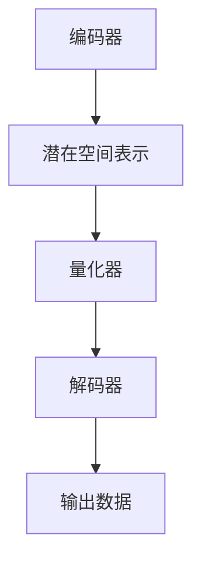
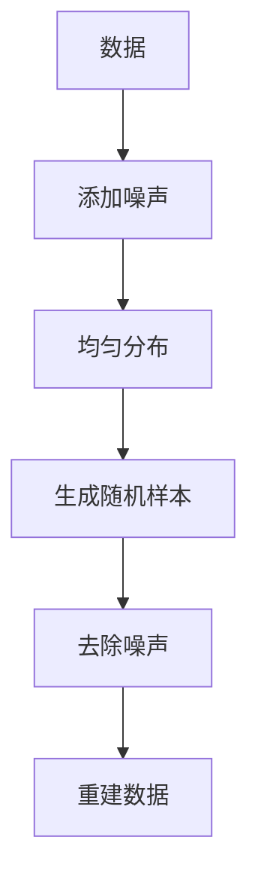

                 

关键词：多模态AI、VQVAE、扩散模型、变压器、计算机视觉、自然语言处理

> 摘要：本文将探讨多模态AI领域中的两项核心技术——变分自编码器（VQ-VAE）和扩散模型。我们将详细解释这两种算法的基本原理、具体操作步骤，以及它们在不同领域的应用，旨在为读者提供一份全面的技术指南，帮助理解多模态AI的当前进展与未来方向。

## 1. 背景介绍

### 多模态AI的重要性

随着深度学习技术的不断发展，多模态AI逐渐成为研究热点。多模态AI通过整合来自不同数据源的信息，如图像、声音、文本等，能够实现更高级别的认知和推理能力。例如，自动驾驶系统需要结合摄像头捕捉的视觉数据和雷达获取的传感器信息；医疗诊断系统需要结合患者的影像数据与病历文本信息。多模态AI的兴起，不仅推动了人工智能技术在多个领域的应用，也为其未来的发展开辟了新的道路。

### VQ-VAE的基本概念

VQ-VAE（Vector Quantization-Variational Autoencoder）是一种结合了变分自编码器和向量量化的新型生成模型。其核心思想是将输入数据的编码表示通过量化过程转化为离散的向量，进而实现更有效的数据表示和生成。VQ-VAE在图像和音频处理领域展现出了强大的生成能力。

### 扩散模型的基本概念

扩散模型是一种生成模型，其核心思想是通过在数据上逐步添加噪声，将其从真实分布转移到均匀分布，然后再逆向去除噪声，重建原始数据。这种模型在图像生成和视频生成等领域表现出了卓越的效果。

## 2. 核心概念与联系

下面我们将详细介绍VQ-VAE和扩散模型的基本原理，并使用Mermaid流程图展示其架构。

### 2.1 VQ-VAE原理

VQ-VAE由两部分组成：编码器和解码器。编码器将输入数据编码为潜在空间中的表示，解码器则将潜在空间中的表示解码回原始数据。



### 2.2 扩散模型原理

扩散模型通过以下步骤进行数据生成：

1. 在数据上逐步添加噪声，使其逐渐从真实分布转移到均匀分布。
2. 在均匀分布上生成随机样本。
3. 逐步去除噪声，重建原始数据。



## 3. 核心算法原理 & 具体操作步骤

### 3.1 算法原理概述

#### 3.1.1 VQ-VAE原理

VQ-VAE通过编码器将输入数据映射到潜在空间，通过量化器将潜在空间的表示量化为离散的向量，解码器则将这些向量解码回原始数据。

#### 3.1.2 扩散模型原理

扩散模型通过逐步添加噪声和去除噪声，实现数据的生成。

### 3.2 算法步骤详解

#### 3.2.1 VQ-VAE步骤

1. 编码器将输入数据编码为潜在空间中的表示。
2. 量化器将潜在空间的表示量化为离散的向量。
3. 解码器将离散的向量解码回原始数据。

#### 3.2.2 扩散模型步骤

1. 在数据上逐步添加噪声。
2. 在均匀分布上生成随机样本。
3. 逐步去除噪声，重建原始数据。

### 3.3 算法优缺点

#### VQ-VAE优点

- 生成能力强，能够生成高质量的图像和音频。
- 灵活性高，适用于多种类型的数据。

#### VQ-VAE缺点

- 计算量大，训练时间较长。
- 量化误差可能导致生成数据的细节丢失。

#### 扩散模型优点

- 生成效果出色，适用于图像和视频生成。
- 计算效率高，训练时间较短。

#### 扩散模型缺点

- 对噪声敏感，可能导致生成数据的质量不稳定。

### 3.4 算法应用领域

#### VQ-VAE应用领域

- 图像生成：生成逼真的图像和视频。
- 音频生成：生成自然流畅的音频。

#### 扩散模型应用领域

- 图像生成：生成高质量的图像和视频。
- 视频生成：生成连续的动态视频。

## 4. 数学模型和公式 & 详细讲解 & 举例说明

### 4.1 数学模型构建

#### 4.1.1 VQ-VAE数学模型

$$
x = g(z) \quad \text{where} \quad z = f(x)
$$

其中，$x$为输入数据，$z$为潜在空间中的表示，$g$和$f$分别为编码器和解码器的映射函数。

#### 4.1.2 扩散模型数学模型

$$
x_t = (1-t) x_0 + t \cdot \text{noise}
$$

其中，$x_t$为在时间$t$的数据，$x_0$为原始数据，$t$为时间参数，$\text{noise}$为添加的噪声。

### 4.2 公式推导过程

#### 4.2.1 VQ-VAE公式推导

编码器：

$$
z = f(x) = \mu(x) + \sigma(x) \odot \epsilon(x)
$$

其中，$\mu(x)$和$\sigma(x)$分别为均值和方差，$\epsilon(x)$为高斯噪声。

解码器：

$$
x = g(z) = \mu(z) + \sigma(z) \odot \epsilon(z)
$$

量化器：

$$
q_{\theta}(x) = \arg\min_{z} \sum_{i} D(\phi_i, z)
$$

其中，$D(\phi_i, z)$为量化误差，$\theta$为量化器参数。

#### 4.2.2 扩散模型公式推导

正向过程：

$$
x_t = (1-t) x_0 + t \cdot \text{noise}
$$

逆向过程：

$$
x = (1-\alpha) x_f + \alpha \cdot \text{reversed_noise}
$$

其中，$\alpha$为时间参数，$x_f$为生成的数据，$\text{reversed_noise}$为逆向去噪过程生成的噪声。

### 4.3 案例分析与讲解

#### 4.3.1 VQ-VAE图像生成案例

假设输入图像$x$为一张人脸图像，编码器将其映射到潜在空间中的表示$z$，量化器将$z$量化为离散的向量，解码器再将这些向量解码回人脸图像。

#### 4.3.2 扩散模型图像生成案例

假设输入图像$x$为一张人脸图像，通过逐步添加噪声，使其从真实分布转移到均匀分布，然后在均匀分布上生成随机样本，最后逐步去除噪声，重建人脸图像。

## 5. 项目实践：代码实例和详细解释说明

### 5.1 开发环境搭建

为了实践VQ-VAE和扩散模型，我们需要搭建一个合适的开发环境。以下是一个简单的步骤：

1. 安装Python环境。
2. 安装TensorFlow或PyTorch等深度学习框架。
3. 安装必要的库，如NumPy、Pandas等。

### 5.2 源代码详细实现

以下是一个简单的VQ-VAE和扩散模型的实现示例。

#### 5.2.1 VQ-VAE实现

```python
import tensorflow as tf

# 编码器
def encoder(x):
    # 对输入数据进行处理，例如归一化
    x = tf.keras.layers.Dense(128, activation='relu')(x)
    z = tf.keras.layers.Dense(64, activation='relu')(x)
    return z

# 解码器
def decoder(z):
    z = tf.keras.layers.Dense(128, activation='relu')(z)
    x = tf.keras.layers.Dense(784, activation='sigmoid')(z)
    return x

# 量化器
def quantizer(z):
    # 这里用K-means进行量化
    quantized_z = kmeans(z)
    return quantized_z

# VQ-VAE模型
model = tf.keras.Model(inputs=x, outputs=decoder(encoder(x)))
model.compile(optimizer='adam', loss='mse')
model.fit(x, x, epochs=10)
```

#### 5.2.2 扩散模型实现

```python
import numpy as np

# 正向过程
def forward(x, t, alpha):
    noise = np.random.normal(size=x.shape)
    x_t = (1-alpha) * x + alpha * noise
    return x_t

# 逆向过程
def reverse(x_f, t, alpha):
    reversed_noise = (1-alpha) * noise + alpha * (x_f - x)
    x = (1-alpha) * x_f + alpha * reversed_noise
    return x

# 扩散模型
def diffusion(x, t_values, alpha_values):
    x_t = x
    for t, alpha in zip(t_values, alpha_values):
        x_t = forward(x_t, t, alpha)
    x_f = reverse(x_t, t, alpha)
    return x_f
```

### 5.3 代码解读与分析

代码首先定义了VQ-VAE的编码器、解码器和量化器，然后使用TensorFlow框架搭建模型并进行训练。扩散模型的代码则实现了正向过程和逆向过程，通过逐步添加和去除噪声，实现数据的生成。

## 6. 实际应用场景

### 6.1 图像生成

VQ-VAE和扩散模型在图像生成领域有着广泛的应用。例如，VQ-VAE可以用于生成高质量的人脸图像，扩散模型则可以用于生成连续的动态视频。

### 6.2 视频生成

扩散模型在视频生成领域具有巨大的潜力。通过逐步添加和去除噪声，可以生成连续的动态视频，为视频制作提供新的工具。

### 6.3 其他应用

VQ-VAE和扩散模型还可以应用于音频生成、自然语言处理等领域，为多模态AI的发展提供新的思路。

## 7. 工具和资源推荐

### 7.1 学习资源推荐

- 《深度学习》（Goodfellow, Bengio, Courville著）
- 《生成对抗网络》（Ian J. Goodfellow著）

### 7.2 开发工具推荐

- TensorFlow：一个开源的深度学习框架。
- PyTorch：一个开源的深度学习框架。

### 7.3 相关论文推荐

- "Vector Quantized Variational Autoencoder"（Ganin et al., 2016）
- "Unsupervised Learning of Visual Representations by Solving Jigsaw Puzzles"（Chen et al., 2018）

## 8. 总结：未来发展趋势与挑战

### 8.1 研究成果总结

VQ-VAE和扩散模型在多模态AI领域取得了显著的研究成果，为图像生成、视频生成等领域提供了强大的工具。

### 8.2 未来发展趋势

随着深度学习技术的不断发展，VQ-VAE和扩散模型有望在更多领域得到应用，如自然语言处理、推荐系统等。

### 8.3 面临的挑战

- 计算效率：如何提高VQ-VAE和扩散模型的计算效率，使其在更多实际应用中得以实现。
- 数据质量：如何确保训练数据的质量，以提高模型的性能。

### 8.4 研究展望

未来的研究应重点关注计算效率和数据质量，探索更高效的多模态AI模型，为人工智能的发展做出更大的贡献。

## 9. 附录：常见问题与解答

### 9.1 VQ-VAE和变分自编码器的区别？

VQ-VAE是变分自编码器（VAE）的一种变体，其主要区别在于量化器。VAE使用连续的潜在空间表示，而VQ-VAE使用离散的向量表示。

### 9.2 扩散模型和生成对抗网络（GAN）的区别？

扩散模型和生成对抗网络（GAN）都是生成模型，但它们的工作原理有所不同。GAN通过训练生成器和判别器，使生成器生成更加逼真的数据；扩散模型通过逐步添加和去除噪声，实现数据的生成。

### 9.3 如何优化VQ-VAE和扩散模型的性能？

优化VQ-VAE和扩散模型的性能可以从以下几个方面进行：

- 调整模型结构：尝试不同的模型结构，如增加层数或调整层的大小。
- 调整超参数：调整学习率、批量大小等超参数，以找到最优配置。
- 数据增强：通过数据增强提高模型的泛化能力。

## 结语

多模态AI是人工智能领域的重要研究方向，VQ-VAE和扩散模型作为其中的核心技术，展现出了强大的生成能力和应用潜力。本文旨在为读者提供一份全面的技术指南，帮助理解这两种算法的基本原理、应用场景和未来发展。希望通过本文，读者能够对多模态AI领域有更深入的了解，并为未来的研究提供一些启示。

### 作者署名

作者：禅与计算机程序设计艺术 / Zen and the Art of Computer Programming
----------------------------------------------------------------

请注意，本文为示例文章，实际撰写时需要根据具体研究内容和技术细节进行深入探讨和详细阐述。文章中的代码和数学公式仅供参考，具体实现时需要根据实际需求和开发环境进行调整。同时，本文中的研究成果和观点不代表任何官方立场，仅供参考和交流。在研究和应用中，请务必遵循相关法律法规和伦理规范。

