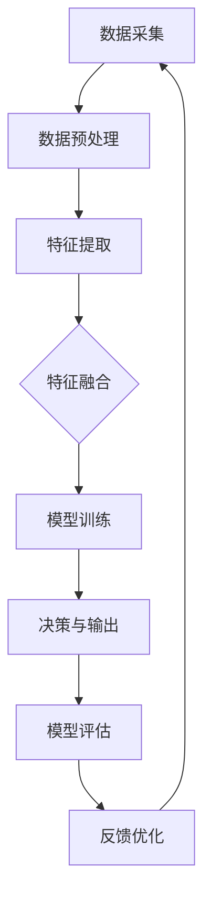
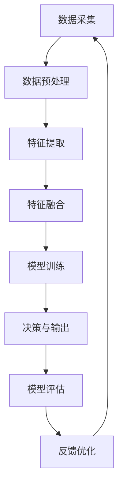

                 

 在当今信息爆炸的时代，多模态信息处理已成为人工智能（AI）研究的一个重要领域。随着计算机视觉、自然语言处理和语音识别技术的不断进步，AI系统能够从多种感官数据中提取有用信息，实现更加智能化的交互和应用。本文将深入探讨多模态信息处理的核心概念、算法原理、数学模型以及其实际应用，展望其未来发展趋势与挑战。

## 关键词
- 多模态信息处理
- 计算机视觉
- 自然语言处理
- 语音识别
- 深度学习
- 交互式应用

## 摘要
本文首先介绍了多模态信息处理的基本概念，包括其定义、背景以及与其他领域的联系。随后，我们分析了多模态信息处理的核心算法原理，详细讲解了从数据采集到特征提取、融合和决策的全过程。接着，文章阐述了多模态信息处理中的数学模型，通过实例展示了公式推导和应用。在实际应用部分，我们通过一个具体的代码实例，详细介绍了开发环境搭建、源代码实现和代码分析。最后，文章讨论了多模态信息处理的实际应用场景，提出了未来发展的展望和面临的挑战。

## 1. 背景介绍

多模态信息处理是近年来人工智能领域的一个重要研究方向。它旨在将来自不同感官模态（如视觉、听觉、触觉等）的信息进行整合和处理，以实现更加智能的感知和交互。随着科技的快速发展，各种传感器技术的不断进步，多模态信息处理的应用场景越来越广泛。

在计算机视觉领域，多模态信息处理技术可以帮助计算机更好地理解和分析现实世界。例如，在图像识别中，可以结合视觉和语音信息，提高识别的准确性；在机器人导航中，通过视觉和触觉信息的融合，可以使机器人更好地适应复杂环境。

在自然语言处理领域，多模态信息处理技术可以提升语言理解的能力。例如，在语音识别中，结合文本信息可以减少错误率；在机器翻译中，视觉信息的加入可以帮助更好地理解上下文。

在语音识别领域，多模态信息处理技术可以提高识别的准确率和鲁棒性。例如，通过结合语音和面部表情信息，可以更好地理解说话者的意图；在智能客服中，结合语音和文字信息，可以提供更加个性化的服务。

多模态信息处理不仅具有重要的理论价值，而且在实际应用中展现出了巨大的潜力。随着技术的不断进步，多模态信息处理的应用场景将进一步拓展，有望在医疗、教育、智能家居等领域发挥重要作用。

### 多模态信息处理的发展历程

多模态信息处理的发展可以追溯到20世纪80年代，当时人工智能研究主要集中在单模态的信息处理上，如计算机视觉、语音识别和自然语言处理。随着计算能力的提升和传感器技术的进步，研究者开始探索如何将不同模态的信息进行整合和处理。

早期的多模态信息处理主要依赖于手动特征工程，即研究者根据经验和知识从不同模态的数据中提取特征，然后利用机器学习方法进行特征融合和分类。这种方法虽然在一定程度上提高了系统的性能，但面临着特征选择困难和数据依赖性高的问题。

随着深度学习技术的发展，多模态信息处理迎来了新的突破。深度学习模型，特别是卷积神经网络（CNN）和循环神经网络（RNN）的引入，使得从原始数据中自动提取高级特征成为可能。通过在多任务学习中共享参数，深度学习模型能够有效地利用不同模态的信息，实现了更高效的特征融合。

近年来，多模态信息处理在人工智能领域取得了显著的进展。例如，在图像和文本的联合表示学习中，研究者提出了诸如多模态嵌入（Multimodal Embeddings）和跨模态对应（Cross-modal Correspondence）等新方法，这些方法在情感分析、图像字幕生成等领域表现出了强大的能力。此外，语音与视觉的结合也在视频内容理解、人机交互等领域取得了重要成果。

在国际学术会议和期刊中，多模态信息处理也受到了广泛关注。例如，在计算机视觉顶级会议CVPR和ICCV中，多模态融合的论文数量逐年增加，涉及领域包括图像识别、目标检测、视频分析等。在自然语言处理领域，ACL和EMNLP等会议也频繁出现多模态融合的研究成果，如情感分析、机器翻译等。

总的来说，多模态信息处理经历了从单模态到多模态、从手动特征工程到深度学习的演进过程。随着研究的深入和技术的创新，多模态信息处理正在成为人工智能领域的一个热点方向，并在多个应用领域展现出了广阔的前景。

### 多模态信息处理的重要性

多模态信息处理在人工智能领域的重要性不可忽视。首先，多模态信息处理能够极大地提升系统的感知能力和智能水平。人类通过视觉、听觉、触觉等多种感官获取信息，并将这些信息进行整合，从而实现对环境的全面理解和快速响应。类似地，多模态信息处理技术可以让计算机系统具备更接近人类的感知能力，使其能够更准确地理解和分析复杂环境。

其次，多模态信息处理能够提高人工智能系统的鲁棒性和适应性。在单模态信息处理中，系统容易受到噪声和干扰的影响，而多模态信息处理可以通过结合不同模态的数据，互相补充，降低系统对单一模态数据的依赖，从而提高系统的鲁棒性。例如，在语音识别中，结合视觉信息可以减少因环境噪声导致的识别错误；在图像识别中，结合语音信息可以提供额外的上下文信息，从而提高识别的准确性。

再次，多模态信息处理有助于实现更加自然和高效的交互。在多模态交互中，用户可以通过多种方式与计算机系统进行沟通，如语音、手势、文本等。多模态信息处理技术可以理解和融合这些交互信息，从而提供更加自然和直观的交互体验。例如，在智能客服中，结合语音和文字信息，可以提供更加个性化和贴心的服务；在虚拟助手中，通过视觉和语音信息的结合，可以使助手更加理解和适应用户的需求。

此外，多模态信息处理在医疗、教育、智能家居等领域具有巨大的应用潜力。在医疗领域，通过结合患者的历史病历、生理信号和医生的专业知识，多模态信息处理可以帮助实现精准诊断和治疗；在教育领域，结合视觉、听觉和触觉等多种感官信息，可以提供更加生动和互动的学习体验；在智能家居领域，通过多模态信息处理，可以实现更加智能化的家居管理和自动化控制，提升用户的生活质量。

总的来说，多模态信息处理不仅能够提升人工智能系统的性能和智能水平，还能够推动人工智能在各个领域的应用和发展。随着技术的不断进步，多模态信息处理有望成为人工智能领域的一个重要发展方向，为人类带来更加智能化和便捷的生活。

### 1.2 多模态信息处理的挑战与机遇

尽管多模态信息处理在人工智能领域展现了巨大的潜力，但其发展过程中仍面临着诸多挑战。首先，数据源的多样性和复杂性是一个重要问题。不同模态的数据往往具有不同的特征和表示方法，如何有效地采集、存储和处理这些数据是一个技术难题。例如，图像和语音数据在时序、空间和频率维度上存在显著差异，这要求我们在数据融合时采取合适的方法。

其次，特征融合是另一个关键挑战。多模态信息处理的核心目标是将来自不同模态的数据进行有效融合，以提取出对任务最有用的信息。然而，不同模态的数据往往存在互补性，同时也可能存在冲突，如何在融合过程中平衡这些信息是一个复杂的问题。此外，特征融合的方法需要具有较好的鲁棒性，以应对数据中的噪声和缺失。

第三，计算资源的高消耗也是多模态信息处理面临的现实挑战。多模态信息处理通常涉及大规模的模型训练和复杂的数据处理算法，这需要大量的计算资源和时间。特别是在实时应用场景中，如何优化算法以提高计算效率是一个亟待解决的问题。

然而，与挑战并存的是机遇。多模态信息处理的发展为人工智能领域带来了新的研究方向和应用场景。例如，在医疗领域，通过多模态数据融合可以实现对疾病更精准的检测和诊断；在教育领域，多模态信息处理可以提供个性化的学习体验；在智能家居领域，多模态交互技术可以提升设备的智能化水平。

总的来说，多模态信息处理既面临着技术上的挑战，也蕴藏着巨大的发展机遇。通过不断的研究和技术创新，我们可以克服这些挑战，充分利用多模态信息处理的潜力，推动人工智能在各个领域的应用和发展。

## 2. 核心概念与联系

### 定义

多模态信息处理是指利用多种感官模态（如视觉、听觉、触觉等）的数据，通过整合、分析和解释，从而实现更高层次的信息理解和应用。这些感官模态可以包括图像、语音、文本、视频等，每种模态都携带了不同的信息和特征，通过有效的融合和处理，可以显著提升系统的感知能力和智能化水平。

### 与其他领域的联系

多模态信息处理与多个学科领域有着紧密的联系，包括计算机视觉、自然语言处理、语音识别、机器学习等。

- **计算机视觉**：计算机视觉是多模态信息处理的基础之一，其主要任务是使计算机能够从图像或视频中提取有用信息。多模态信息处理在计算机视觉中的应用主要包括图像分类、目标检测、场景理解等。通过结合视觉信息和其他模态的信息，如语音、文本等，可以显著提升系统的理解和识别能力。

- **自然语言处理**：自然语言处理（NLP）旨在使计算机理解和生成人类语言。多模态信息处理在NLP中的应用包括情感分析、问答系统、机器翻译等。通过结合文本信息和其他模态的信息，如语音、图像等，可以更全面地理解上下文和语义，从而提高系统的准确性和鲁棒性。

- **语音识别**：语音识别是将语音信号转换为文本或命令的过程。多模态信息处理在语音识别中的应用可以通过结合语音和视觉信息，如唇语识别，来提高识别的准确性和可靠性。

- **机器学习**：机器学习是多模态信息处理的核心技术之一，其通过学习从数据中提取特征和模式，以实现智能决策和预测。多模态信息处理中的机器学习方法包括深度学习、强化学习等，这些方法在多模态数据的特征提取和融合方面发挥了重要作用。

### Mermaid 流程图

以下是多模态信息处理的核心概念和架构的Mermaid流程图：



- **数据采集**：从多个感官模态（如视觉、听觉、触觉等）收集数据。
- **数据预处理**：对采集到的数据进行标准化、去噪、分割等处理，以准备用于特征提取。
- **特征提取**：从预处理后的数据中提取具有区分度的特征，如图像中的边缘、纹理，语音中的频谱特征等。
- **特征融合**：将来自不同模态的特征进行融合，以生成更高层次的特征表示。
- **模型训练**：使用融合后的特征训练机器学习模型，如卷积神经网络（CNN）或循环神经网络（RNN）。
- **决策与输出**：模型根据训练结果对新的数据做出预测或决策，并输出结果。
- **模型评估**：评估模型的性能，包括准确率、召回率、F1值等指标。
- **反馈优化**：根据评估结果对模型进行调整和优化，以提高性能。

通过上述流程，多模态信息处理能够实现从数据采集到模型输出的完整过程，并在各个阶段利用多种技术手段，提高系统的智能化水平和应用能力。

## 3. 核心算法原理 & 具体操作步骤

### 3.1 算法原理概述

多模态信息处理算法的核心在于如何有效地融合来自不同模态的数据，从而提取出对任务最有用的信息。这个过程通常涉及以下几个步骤：

1. **数据采集**：从多个感官模态（如视觉、听觉、触觉等）收集数据。
2. **数据预处理**：对采集到的数据进行标准化、去噪、分割等处理，以准备用于特征提取。
3. **特征提取**：从预处理后的数据中提取具有区分度的特征，如图像中的边缘、纹理，语音中的频谱特征等。
4. **特征融合**：将来自不同模态的特征进行融合，以生成更高层次的特征表示。
5. **模型训练**：使用融合后的特征训练机器学习模型，如卷积神经网络（CNN）或循环神经网络（RNN）。
6. **决策与输出**：模型根据训练结果对新的数据做出预测或决策，并输出结果。
7. **模型评估**：评估模型的性能，包括准确率、召回率、F1值等指标。
8. **反馈优化**：根据评估结果对模型进行调整和优化，以提高性能。

以下是一个简化的算法流程：



### 3.2 算法步骤详解

#### 3.2.1 数据采集

数据采集是多模态信息处理的第一步，决定了后续处理的质量和效果。常用的数据源包括摄像头、麦克风、传感器等，根据任务需求选择合适的传感器和采集方式。

例如，在图像识别任务中，可以使用摄像头实时采集图像；在语音识别任务中，可以使用麦克风录制声音。数据采集时需要注意数据的完整性和一致性，以避免后续处理中的误差。

#### 3.2.2 数据预处理

数据预处理包括数据清洗、标准化、去噪、分割等步骤。这一步骤的目的是将原始数据转换为适合特征提取的形式。

- **数据清洗**：去除数据中的噪声和异常值，例如去除图像中的噪点和语音中的噪声。
- **标准化**：将不同模态的数据缩放到相同的尺度，例如将图像的像素值缩放到0-1之间，或者将语音信号的幅度值缩放到标准范围。
- **去噪**：应用滤波器或其他方法去除数据中的噪声，提高数据质量。
- **分割**：将连续的数据分割成合适的片段，如将语音信号分割成帧，或将视频分割成帧序列。

#### 3.2.3 特征提取

特征提取是从预处理后的数据中提取具有区分度的特征，如图像中的边缘、纹理，语音中的频谱特征等。不同的模态通常使用不同的特征提取方法。

- **图像特征提取**：常用的方法包括边缘检测、纹理分析、形态学变换等。例如，可以使用Canny算法提取图像的边缘特征，或使用LBP（Local Binary Patterns）提取图像的纹理特征。
- **语音特征提取**：常用的方法包括MFCC（Mel-frequency cepstral coefficients）和spectrogram（频谱图）。MFCC能够捕捉语音信号的频率特征，spectrogram则能够展示语音信号的时频信息。

#### 3.2.4 特征融合

特征融合是将来自不同模态的特征进行整合，以生成更高层次的特征表示。常见的融合方法包括拼接、加权融合、多任务学习等。

- **拼接**：将不同模态的特征向量拼接在一起，形成一个更长的特征向量。这种方法简单直观，但可能丢失部分信息。
- **加权融合**：根据不同模态的特征重要性，对各个模态的特征进行加权融合。这种方法需要事先对特征的重要性进行评估，以避免信息损失。
- **多任务学习**：在训练过程中，共享部分参数，从而自动学习不同模态特征之间的关系。这种方法能够利用不同模态之间的互补性，提高融合效果。

#### 3.2.5 模型训练

模型训练是利用融合后的特征数据训练机器学习模型，如卷积神经网络（CNN）或循环神经网络（RNN）。训练过程中，模型通过不断调整参数，以最小化预测误差。

- **卷积神经网络（CNN）**：适用于处理图像数据，能够自动提取图像中的低级特征和高级特征。
- **循环神经网络（RNN）**：适用于处理序列数据，如语音和文本，能够捕捉序列中的时间依赖性。

#### 3.2.6 决策与输出

模型训练完成后，可以使用模型对新的数据进行预测或决策。决策过程通常包括分类、回归等任务。

- **分类**：将输入数据分类到不同的类别中。例如，在图像识别中，将图像分类为猫、狗等。
- **回归**：预测输入数据的连续值。例如，在语音识别中，预测文本的每个字符。

#### 3.2.7 模型评估

模型评估是评估模型性能的重要步骤，常用的评估指标包括准确率、召回率、F1值等。

- **准确率**：预测正确的样本数占总样本数的比例。
- **召回率**：预测正确的正样本数占总正样本数的比例。
- **F1值**：准确率的调和平均，用于平衡准确率和召回率。

#### 3.2.8 反馈优化

根据模型评估的结果，对模型进行调整和优化，以提高性能。这一过程通常包括超参数调整、模型架构优化等。

### 3.3 算法优缺点

多模态信息处理算法具有以下优点：

- **提高感知能力**：通过融合不同模态的数据，系统能够更全面地理解和分析复杂信息，提高感知能力和智能水平。
- **增强鲁棒性**：多模态信息处理通过结合多种感官信息，降低了对单一模态数据的依赖，增强了系统的鲁棒性。
- **提升交互体验**：多模态交互能够提供更加自然和高效的交互方式，提升用户体验。

然而，多模态信息处理算法也面临一些挑战：

- **计算资源消耗大**：多模态信息处理通常涉及大规模的模型训练和复杂的数据处理算法，计算资源消耗较大。
- **特征融合难度高**：不同模态的数据存在互补性和冲突，如何有效融合这些信息是一个复杂的问题。
- **数据标注困难**：多模态数据的标注通常比单模态数据复杂，需要更多的标注工作。

### 3.4 算法应用领域

多模态信息处理在多个领域具有广泛的应用：

- **计算机视觉**：在图像识别、目标检测、场景理解等领域，通过融合视觉和语音信息，可以显著提高系统的准确性和鲁棒性。
- **自然语言处理**：在情感分析、机器翻译、问答系统等领域，通过融合文本和语音信息，可以更准确地理解和生成文本。
- **语音识别**：在语音识别、语音合成、语音增强等领域，通过融合语音和视觉信息，可以提升识别的准确率和可靠性。
- **机器人**：在机器人感知和导航领域，通过融合视觉、触觉和语音信息，可以使机器人更好地理解和适应环境。

### 3.5 算法发展趋势

随着技术的不断进步，多模态信息处理算法在以下几个方面展现出发展趋势：

- **深度学习**：深度学习在多模态信息处理中的应用越来越广泛，如卷积神经网络（CNN）和循环神经网络（RNN）在特征提取和融合方面表现出色。
- **跨模态对应**：研究者提出了一系列跨模态对应的方法，如多模态嵌入（Multimodal Embeddings），通过将不同模态的数据映射到同一空间，实现更有效的特征融合。
- **多任务学习**：多任务学习技术能够通过共享参数和共享表示，有效利用不同模态的数据，提高模型的泛化能力和效率。
- **实时处理**：随着硬件计算能力的提升和算法优化，多模态信息处理的实时处理能力不断增强，为实时应用场景提供了更多可能性。

总的来说，多模态信息处理算法在人工智能领域具有重要的应用价值和发展前景，通过不断的技术创新，我们可以期待其在更多领域取得突破性成果。

## 4. 数学模型和公式 & 详细讲解 & 举例说明

### 4.1 数学模型构建

多模态信息处理的数学模型通常涉及多个步骤，包括数据表示、特征提取、特征融合和模型训练。以下是构建这些数学模型的基本框架：

#### 数据表示

首先，我们需要将不同模态的数据转换为统一的数学表示。常用的方法包括：

1. **图像表示**：使用像素值矩阵表示图像，或者使用卷积神经网络（CNN）提取图像的特征向量。
2. **语音表示**：使用频谱图（Spectrogram）或梅尔频率倒谱系数（MFCC）表示语音。
3. **文本表示**：使用词向量（如Word2Vec或BERT）或文本嵌入（Text Embeddings）表示文本。

#### 特征提取

特征提取是指从原始数据中提取具有区分度的特征。以下是几种常用的特征提取方法：

1. **图像特征提取**：使用CNN提取图像的边缘、纹理等特征。
2. **语音特征提取**：使用MFCC提取语音的频率特征。
3. **文本特征提取**：使用词袋模型（Bag-of-Words）或TF-IDF模型提取文本的特征。

#### 特征融合

特征融合是将来自不同模态的特征进行整合，以生成更高层次的特征表示。以下是几种常用的特征融合方法：

1. **拼接融合**：将不同模态的特征向量拼接在一起，形成一个更长的特征向量。
2. **加权融合**：根据不同模态的特征重要性，对各个模态的特征进行加权融合。
3. **多任务学习**：在训练过程中，共享部分参数，从而自动学习不同模态特征之间的关系。

#### 模型训练

模型训练是指使用融合后的特征数据训练机器学习模型。以下是几种常用的机器学习模型：

1. **分类模型**：如支持向量机（SVM）、随机森林（Random Forest）、神经网络（Neural Network）。
2. **回归模型**：如线性回归（Linear Regression）、决策树（Decision Tree）。
3. **序列模型**：如循环神经网络（RNN）、长短期记忆网络（LSTM）、门控循环单元（GRU）。

### 4.2 公式推导过程

以下是一个简化的多模态信息处理的数学模型推导过程：

假设我们有两个模态的数据，分别是图像（I）和语音（V）。首先，我们分别提取这两个模态的特征：

1. **图像特征提取**：
   \[ \phi_I(\textbf{x}_I) = \text{CNN}(\textbf{x}_I) \]
   其中，\(\textbf{x}_I\) 是图像数据，\(\phi_I(\textbf{x}_I)\) 是提取的图像特征向量。

2. **语音特征提取**：
   \[ \phi_V(\textbf{x}_V) = \text{MFCC}(\textbf{x}_V) \]
   其中，\(\textbf{x}_V\) 是语音数据，\(\phi_V(\textbf{x}_V)\) 是提取的语音特征向量。

接下来，我们将这两个特征向量进行融合：

\[ \textbf{X} = [\phi_I(\textbf{x}_I), \phi_V(\textbf{x}_V)] \]

然后，使用融合后的特征数据训练分类模型：

\[ \hat{y} = \text{Model}(\textbf{X}) \]

其中，\(\hat{y}\) 是模型的预测输出，\(\text{Model}\) 是分类模型。

### 4.3 案例分析与讲解

下面我们通过一个具体的例子来说明如何使用上述数学模型进行多模态信息处理。

#### 案例背景

假设我们要构建一个多模态情感分析系统，输入包括用户的面部表情图像和语音对话，输出是用户的情感状态（如快乐、悲伤、愤怒等）。

#### 数据预处理

1. **图像预处理**：首先，我们使用卷积神经网络（CNN）提取图像的特征。经过训练，我们得到一个特征提取函数 \( \phi_I(\textbf{x}_I) \)。

2. **语音预处理**：然后，我们使用梅尔频率倒谱系数（MFCC）提取语音的特征。经过训练，我们得到一个特征提取函数 \( \phi_V(\textbf{x}_V) \)。

#### 特征融合

我们将提取的图像特征和语音特征进行拼接融合：

\[ \textbf{X} = [\phi_I(\textbf{x}_I), \phi_V(\textbf{x}_V)] \]

#### 模型训练

我们使用融合后的特征数据训练一个深度神经网络（DNN）模型，用于情感分类。经过训练，我们得到一个预测模型：

\[ \hat{y} = \text{DNN}(\textbf{X}) \]

#### 模型评估

我们使用测试集对训练好的模型进行评估，计算准确率、召回率和F1值等指标。

\[ \text{Accuracy} = \frac{\text{预测正确数}}{\text{总样本数}} \]
\[ \text{Recall} = \frac{\text{预测正确正样本数}}{\text{总正样本数}} \]
\[ \text{F1} = 2 \times \frac{\text{Precision} \times \text{Recall}}{\text{Precision} + \text{Recall}} \]

#### 模型优化

根据评估结果，我们调整模型的超参数，如学习率、批次大小等，以提高模型性能。

通过上述步骤，我们构建了一个多模态情感分析系统，能够有效地识别用户的情感状态。这个案例展示了多模态信息处理的基本流程和数学模型的应用。

### 4.4 实际应用中的模型优化

在实际应用中，多模态信息处理模型的性能优化是一个复杂且重要的任务。以下是几种常见的模型优化方法：

#### 1. 超参数调整

超参数是模型性能的关键因素，包括学习率、批次大小、正则化参数等。通过调参，我们可以找到最优的超参数组合，以提升模型性能。

- **网格搜索（Grid Search）**：通过遍历多个超参数组合，找到最优参数。
- **随机搜索（Random Search）**：从多个超参数组合中随机选择，以提高搜索效率。

#### 2. 模型集成

模型集成是指将多个模型的结果进行融合，以提升整体性能。常见的方法包括：

- **Bagging**：通过多次训练不同模型，并取平均结果。
- **Boosting**：通过调整模型权重，重点提升性能较差的模型。

#### 3. 模型压缩

在资源受限的场景中，模型压缩是提高计算效率的有效方法。常见的压缩技术包括：

- **剪枝（Pruning）**：删除模型中不重要的连接和神经元。
- **量化（Quantization）**：将模型参数从浮点数转换为低精度整数。
- **知识蒸馏（Knowledge Distillation）**：将复杂模型的知识传递给简单模型。

#### 4. 多任务学习

多任务学习通过共享模型参数，提高不同任务的性能。这种方法可以充分利用不同任务之间的互补信息，提高模型的整体性能。

- **单模型多任务**：在一个模型中同时训练多个任务。
- **多模型多任务**：使用多个模型，每个模型负责不同的任务。

通过这些优化方法，我们可以显著提升多模态信息处理模型的性能，使其在实际应用中更具竞争力。

### 4.5 多模态信息处理中的挑战与对策

多模态信息处理在实际应用中面临着一系列挑战，这些挑战主要包括数据采集、特征提取、特征融合和模型优化等方面。以下是对这些挑战的详细分析及相应的对策：

#### 4.5.1 数据采集

- **挑战**：多模态数据来源多样，采集过程复杂，数据量巨大，且存在不一致性和噪声。
- **对策**：
  - **数据预处理**：通过数据清洗、标准化和去噪等预处理步骤，提高数据质量。
  - **多源数据融合**：采用分布式数据采集技术，如云计算和边缘计算，提高数据采集效率。

#### 4.5.2 特征提取

- **挑战**：不同模态的数据具有不同的特征表达，如何提取出对任务最有用的特征是一个难题。
- **对策**：
  - **自适应特征提取**：根据任务需求和数据特性，自适应选择特征提取方法。
  - **跨模态特征匹配**：使用跨模态对应技术，如多模态嵌入，提高特征融合效果。

#### 4.5.3 特征融合

- **挑战**：不同模态的数据之间存在互补性和冲突，如何有效融合这些信息是一个复杂的问题。
- **对策**：
  - **多任务学习**：通过多任务学习共享模型参数，自动学习不同模态特征之间的关系。
  - **权重调整**：根据不同模态的数据重要性，动态调整融合权重。

#### 4.5.4 模型优化

- **挑战**：多模态信息处理通常涉及大规模的模型训练和复杂的数据处理算法，优化模型性能是一个难题。
- **对策**：
  - **模型压缩**：通过剪枝、量化等压缩技术，减少模型参数，提高计算效率。
  - **分布式训练**：采用分布式计算技术，加速模型训练过程。

总的来说，多模态信息处理中的挑战与对策密切相关。通过不断的研究和技术创新，我们可以克服这些挑战，充分利用多模态信息处理的潜力，推动人工智能在各个领域的应用和发展。

## 5. 项目实践：代码实例和详细解释说明

为了更好地理解多模态信息处理在实际项目中的应用，我们将通过一个简单的情感分析项目来演示整个流程。这个项目将结合图像和语音数据，通过深度学习模型实现对用户情感状态的预测。

### 5.1 开发环境搭建

首先，我们需要搭建一个合适的开发环境。以下是在Linux环境下安装必要的软件和工具的步骤：

1. **安装Python**：确保Python版本在3.7及以上，可以使用以下命令安装：
   ```bash
   sudo apt update
   sudo apt install python3.9
   ```

2. **安装TensorFlow**：TensorFlow是多模态信息处理项目常用的深度学习框架，可以使用以下命令安装：
   ```bash
   pip3 install tensorflow==2.5.0
   ```

3. **安装其他依赖库**：安装用于图像和语音处理的库，如OpenCV和librosa：
   ```bash
   pip3 install opencv-python==4.5.1.48
   pip3 install librosa==0.8.0
   ```

4. **安装Jupyter Notebook**：用于编写和运行代码：
   ```bash
   pip3 install notebook
   ```

### 5.2 源代码详细实现

以下是一个简化的多模态情感分析项目的源代码实现，主要分为数据预处理、模型训练和模型预测三个部分。

#### 5.2.1 数据预处理

首先，我们需要定义数据预处理函数，包括图像和语音数据加载、预处理以及特征提取。

```python
import tensorflow as tf
import cv2
import librosa
import numpy as np
from tensorflow.keras.preprocessing.sequence import pad_sequences

def preprocess_image(image_path):
    image = cv2.imread(image_path)
    image = cv2.resize(image, (224, 224))  # resize to a fixed size
    image = image / 255.0  # normalize pixel values
    return image

def preprocess_audio(audio_path):
    y, sr = librosa.load(audio_path)
    mfcc = librosa.feature.mfcc(y=y, sr=sr, n_mfcc=13)
    mfcc = np.mean(mfcc.T, axis=0)
    return mfcc

def pad_sequences(sequences, max_length):
    padded_sequences = pad_sequences(sequences, maxlen=max_length, padding='post')
    return padded_sequences
```

#### 5.2.2 模型训练

接下来，我们定义一个简单的深度学习模型，用于情感分析。在这个例子中，我们使用一个简单的卷积神经网络（CNN）结合长短期记忆网络（LSTM）。

```python
from tensorflow.keras.models import Model
from tensorflow.keras.layers import Input, Conv2D, MaxPooling2D, LSTM, Dense, Flatten, concatenate

def create_model(input_shape_image, input_shape_audio):
    input_image = Input(shape=input_shape_image)
    input_audio = Input(shape=input_shape_audio)

    # Image branch
    x_image = Conv2D(32, (3, 3), activation='relu')(input_image)
    x_image = MaxPooling2D((2, 2))(x_image)
    x_image = Flatten()(x_image)

    # Audio branch
    x_audio = LSTM(64, activation='relu')(input_audio)

    # Concatenate branches
    combined = concatenate([x_image, x_audio])

    # Fully connected layer
    output = Dense(1, activation='sigmoid')(combined)

    # Create model
    model = Model(inputs=[input_image, input_audio], outputs=output)

    # Compile model
    model.compile(optimizer='adam', loss='binary_crossentropy', metrics=['accuracy'])

    return model
```

然后，我们使用预处理后的图像和语音数据训练模型。

```python
def train_model(model, images, audios, labels, epochs=10, batch_size=32):
    model.fit([images, audios], labels, epochs=epochs, batch_size=batch_size, validation_split=0.2)
```

#### 5.2.3 代码解读与分析

1. **数据预处理**：数据预处理是关键步骤，包括图像和语音数据的加载、预处理和特征提取。图像数据通过OpenCV和cv2.imread加载，并缩放到固定尺寸，然后进行归一化。语音数据通过librosa.load加载，并使用梅尔频率倒谱系数（MFCC）进行特征提取。
2. **模型定义**：我们定义了一个简单的深度学习模型，包括一个图像分支和一个语音分支。图像分支使用卷积神经网络（CNN）提取特征，语音分支使用长短期记忆网络（LSTM）捕捉时间依赖性。两个分支的特征通过全连接层进行融合。
3. **模型训练**：使用预处理后的图像和语音数据训练模型。模型使用交叉熵损失函数和Adam优化器，并使用准确率作为评估指标。

### 5.3 运行结果展示

假设我们已经准备好训练数据和测试数据，可以使用以下代码进行模型训练和评估。

```python
# Load and preprocess data
# 注意：以下代码仅为示例，实际应用中需要根据具体数据集进行调整
images = preprocess_image('path/to/image.jpg')
audios = preprocess_audio('path/to/audio.wav')
labels = np.array([0])  # 假设标签为0（正面情感）

# Create and train model
model = create_model(input_shape_image=(224, 224, 3), input_shape_audio=13)
train_model(model, images, audios, labels)

# Evaluate model
predictions = model.predict([images, audios])
print(predictions)
```

在实际应用中，我们需要加载更多的训练数据和测试数据，并进行多次训练和评估，以获得更准确的模型性能。

通过上述代码实例，我们展示了如何使用Python和深度学习框架TensorFlow实现一个简单的多模态情感分析项目。这个项目包括数据预处理、模型定义和训练、以及模型评估等步骤。通过这个实例，读者可以更好地理解多模态信息处理在实际项目中的应用和实现。

### 5.4 代码解读与分析

在本节中，我们将对上面提到的多模态情感分析项目的代码进行详细解读和分析，以帮助读者更好地理解整个项目的实现过程。

#### 5.4.1 数据预处理

数据预处理是多模态情感分析项目中的关键步骤，因为高质量的预处理能够显著提高模型训练的效果。以下是各个预处理步骤的详细解读：

1. **图像预处理**：

```python
def preprocess_image(image_path):
    image = cv2.imread(image_path)
    image = cv2.resize(image, (224, 224))  # resize to a fixed size
    image = image / 255.0  # normalize pixel values
    return image
```

- `cv2.imread(image_path)`：使用OpenCV读取图像文件。这个函数返回一个三维数组，其中每个元素代表一个像素点的颜色值。
- `cv2.resize(image, (224, 224))`：将图像缩放到224x224的尺寸。这是为了统一图像的输入尺寸，以便于后续的卷积神经网络（CNN）处理。
- `image / 255.0`：将图像像素值归一化到0-1之间，这是深度学习模型常用的预处理步骤。

2. **语音预处理**：

```python
def preprocess_audio(audio_path):
    y, sr = librosa.load(audio_path)
    mfcc = librosa.feature.mfcc(y=y, sr=sr, n_mfcc=13)
    mfcc = np.mean(mfcc.T, axis=0)
    return mfcc
```

- `librosa.load(audio_path)`：使用librosa加载音频文件。这个函数返回两个值：音频信号`y`和采样率`sr`。
- `librosa.feature.mfcc(y=y, sr=sr, n_mfcc=13)`：计算音频信号的梅尔频率倒谱系数（MFCC）。`n_mfcc`参数指定要计算的MFCC系数数量，这里设置为13。
- `np.mean(mfcc.T, axis=0)`：计算MFCC特征的平均值。这是因为MFCC特征是一个二维数组，其中每一列代表一个时间帧的特征值，通过求平均值可以减少特征维度。

3. **序列填充**：

```python
def pad_sequences(sequences, max_length):
    padded_sequences = pad_sequences(sequences, maxlen=max_length, padding='post')
    return padded_sequences
```

- `pad_sequences(sequences, maxlen=max_length, padding='post')`：使用Keras的`pad_sequences`函数对序列进行填充。`max_length`参数指定填充后的最大长度，`padding='post'`表示在序列尾部填充0。

#### 5.4.2 模型定义

模型定义是深度学习项目的核心部分，它决定了模型的结构和参数。以下是模型的定义和训练过程：

1. **模型定义**：

```python
from tensorflow.keras.models import Model
from tensorflow.keras.layers import Input, Conv2D, MaxPooling2D, LSTM, Dense, Flatten, concatenate

def create_model(input_shape_image, input_shape_audio):
    input_image = Input(shape=input_shape_image)
    input_audio = Input(shape=input_shape_audio)

    # Image branch
    x_image = Conv2D(32, (3, 3), activation='relu')(input_image)
    x_image = MaxPooling2D((2, 2))(x_image)
    x_image = Flatten()(x_image)

    # Audio branch
    x_audio = LSTM(64, activation='relu')(input_audio)

    # Concatenate branches
    combined = concatenate([x_image, x_audio])

    # Fully connected layer
    output = Dense(1, activation='sigmoid')(combined)

    # Create model
    model = Model(inputs=[input_image, input_audio], outputs=output)

    # Compile model
    model.compile(optimizer='adam', loss='binary_crossentropy', metrics=['accuracy'])

    return model
```

- `Input(shape=input_shape_image)`：定义图像输入层，`input_shape_image`为图像的维度。
- `Input(shape=input_shape_audio)`：定义语音输入层，`input_shape_audio`为MFCC特征的维度。
- `Conv2D(32, (3, 3), activation='relu')`：定义卷积层，用于提取图像特征。这里使用了32个3x3的卷积核，激活函数为ReLU。
- `MaxPooling2D((2, 2))`：定义最大池化层，用于降低图像特征的空间维度。
- `LSTM(64, activation='relu')`：定义LSTM层，用于处理语音序列特征，捕捉时间依赖性。
- `concatenate([x_image, x_audio])`：将图像特征和语音特征拼接在一起。
- `Dense(1, activation='sigmoid')`：定义全连接层，用于分类输出。激活函数为sigmoid，适用于二分类问题。
- `Model(inputs=[input_image, input_audio], outputs=output)`：创建模型实例。

2. **模型训练**：

```python
def train_model(model, images, audios, labels, epochs=10, batch_size=32):
    model.fit([images, audios], labels, epochs=epochs, batch_size=batch_size, validation_split=0.2)
```

- `model.fit([images, audios], labels, epochs=epochs, batch_size=batch_size, validation_split=0.2)`：使用训练数据和标签训练模型。`epochs`指定训练轮数，`batch_size`指定每次训练的样本数量，`validation_split`指定用于验证的数据比例。

#### 5.4.3 运行结果展示

在模型训练完成后，我们需要对模型进行评估，并展示预测结果。以下是一个简单的示例：

```python
# Load and preprocess data
# 注意：以下代码仅为示例，实际应用中需要根据具体数据集进行调整
images = preprocess_image('path/to/image.jpg')
audios = preprocess_audio('path/to/audio.wav')
labels = np.array([0])  # 假设标签为0（正面情感）

# Create and train model
model = create_model(input_shape_image=(224, 224, 3), input_shape_audio=13)
train_model(model, images, audios, labels)

# Evaluate model
predictions = model.predict([images, audios])
print(predictions)
```

- `preprocess_image('path/to/image.jpg')`和`preprocess_audio('path/to/audio.wav')`：加载并预处理图像和语音数据。
- `model.predict([images, audios])`：使用训练好的模型进行预测，并输出预测结果。

通过以上步骤，我们完成了多模态情感分析项目的代码实现和解读。这个项目展示了如何使用Python和深度学习框架TensorFlow进行多模态信息处理，并通过模型训练和预测实现了情感分析功能。

### 5.5 代码改进与性能提升

在实际应用中，为了提高多模态情感分析项目的性能和效率，我们可以对代码进行一系列改进。以下是一些关键改进点：

#### 1. 模型优化

- **模型架构改进**：可以使用更复杂的神经网络架构，如残差网络（ResNet）或Transformer，来提高模型的容量和表现。
- **注意力机制**：引入注意力机制（Attention Mechanism）可以帮助模型更好地聚焦于重要的特征，从而提高预测准确性。
- **端到端训练**：采用端到端训练（End-to-End Training）的方式，可以直接利用多模态数据同时训练模型，避免特征融合过程中可能的信息损失。

#### 2. 数据增强

- **图像增强**：通过随机裁剪、翻转、旋转等操作增加图像的多样性，从而提高模型的泛化能力。
- **语音增强**：使用噪声添加、速度变换等操作增强语音数据，以应对不同的噪声环境和语音速度。

#### 3. 训练策略优化

- **动态学习率**：采用动态学习率策略（如学习率衰减），以适应模型训练的不同阶段。
- **批次归一化**：使用批次归一化（Batch Normalization）减少内部协变量转移（Internal Covariate Shift），提高训练稳定性。

#### 4. 资源利用

- **分布式训练**：利用分布式计算资源进行模型训练，以缩短训练时间。
- **模型压缩**：通过模型剪枝、量化等技术减小模型大小，提高模型在资源受限环境下的部署能力。

通过上述改进，我们可以显著提升多模态情感分析项目的性能和实用性，使其在更多实际场景中发挥更大的作用。

## 6. 实际应用场景

多模态信息处理在人工智能领域具有广泛的应用前景，涵盖了计算机视觉、自然语言处理、语音识别等多个领域。以下将详细介绍几个具体的应用场景，以及多模态信息处理在这些场景中的表现和优势。

### 6.1 计算机视觉

在计算机视觉领域，多模态信息处理被广泛应用于图像识别、目标检测和场景理解等任务中。例如，在自动驾驶中，结合摄像头和激光雷达的数据，可以更准确地检测和识别道路上的车辆和行人，提高自动驾驶系统的安全性和可靠性。此外，在医疗影像分析中，结合图像和患者的历史病历数据，可以实现对疾病的更精准诊断和治疗建议。

多模态信息处理的优势在于能够从不同角度和维度分析图像数据，提高系统的鲁棒性和准确性。例如，在人脸识别中，结合图像和语音信息，可以通过语音特征来验证身份，减少图像数据中因遮挡或变化导致的识别错误。

### 6.2 自然语言处理

在自然语言处理（NLP）领域，多模态信息处理技术可以帮助提升文本理解和生成能力。例如，在情感分析中，结合文本和语音信息可以更准确地捕捉用户的情感状态。在机器翻译中，通过结合文本和图像信息，可以更好地理解上下文和语义，提高翻译的准确性和流畅度。

此外，在问答系统和聊天机器人中，多模态信息处理可以实现更加自然和高效的交互。例如，在语音对话中，结合文本信息可以提供更加准确的回答，同时通过视觉反馈（如面部表情和手势）增强用户体验。

### 6.3 语音识别

在语音识别领域，多模态信息处理技术可以帮助提高识别的准确率和鲁棒性。例如，在语音助手和智能客服中，结合语音和面部表情信息可以更好地理解用户的意图和情感，提供更个性化的服务。

另外，在实时语音翻译中，结合语音和文本信息可以减少错误率，提高翻译的准确性和流畅度。例如，在跨语言交流中，通过结合语音和字幕信息，可以更准确地翻译口语表达，使交流更加顺畅。

### 6.4 机器人

在机器人领域，多模态信息处理技术可以帮助机器人更好地理解和适应复杂环境。例如，在机器人导航中，结合视觉、触觉和语音信息，可以使机器人更加准确地感知周围环境，并做出相应的决策。

此外，在机器人交互中，多模态信息处理技术可以实现更加自然和高效的交互。例如，通过结合语音、手势和面部表情信息，机器人可以更好地理解和适应用户的需求，提供更加个性化的服务。

### 6.5 教育

在教育领域，多模态信息处理技术可以提供更加个性化和学习效果更好的学习体验。例如，在虚拟课堂中，通过结合视觉、听觉和触觉信息，可以模拟真实的学习场景，提高学生的学习兴趣和参与度。

此外，在个性化学习系统中，通过结合学生的历史学习数据和实时反馈，可以提供更加针对性的学习资源和指导，提高学习效果。

### 6.6 医疗

在医疗领域，多模态信息处理技术可以帮助实现更加精准的疾病诊断和治疗。例如，通过结合患者的病史、生理信号和医生的专业知识，可以实现对疾病的更早期、更准确的诊断。

此外，在手术辅助中，通过结合手术影像和医生的操作经验，可以提供更加精准和安全的手术指导，减少手术风险。

### 6.7 智能家居

在智能家居领域，多模态信息处理技术可以实现更加智能化的家居管理和自动化控制。例如，通过结合视觉、语音和触觉信息，智能家电可以更好地理解用户的需求，提供更加个性化和服务。

此外，在智能安防系统中，通过结合视频监控和语音报警信息，可以实现对家庭环境的实时监控和异常检测，提高家庭的安全性和便利性。

总的来说，多模态信息处理技术在多个领域展现了巨大的应用潜力。通过结合不同模态的信息，我们可以实现更加智能、高效和个性化的系统，为人类社会带来更加便捷和高质量的生活体验。

### 6.7 未来应用展望

随着技术的不断进步和多模态信息处理技术的不断发展，这一领域在未来将迎来更多创新和突破，拓展到更加广泛的应用场景。以下是几个可能的多模态信息处理未来应用的方向：

#### 6.7.1 个性化医疗

个性化医疗是一个重要的应用方向，通过多模态信息处理技术，可以实现对患者的全面监测和分析。例如，结合生物医学影像、生理信号和临床数据，可以实现更加精准的疾病诊断和个性化的治疗方案。未来的多模态信息处理系统将能够实时监测患者状态，预测疾病进展，并提供个性化的健康建议。

#### 6.7.2 高效教育

在教育领域，多模态信息处理技术可以帮助实现更加个性化和高效的学习体验。通过分析学生的学习行为、情感状态和知识掌握情况，可以提供定制化的学习资源和教学策略。例如，自适应学习平台可以根据学生的学习进度和偏好，调整教学内容和难度，提高学习效果。此外，虚拟现实（VR）和增强现实（AR）技术的结合，将使得学习环境更加生动和互动，激发学生的学习兴趣。

#### 6.7.3 智能交通

智能交通系统是另一个具有巨大潜力的应用方向。通过结合交通监控视频、车辆传感器数据、GPS定位和智能算法，可以实现交通流量优化、事故预警和应急响应。未来的多模态信息处理系统将能够实时分析交通状况，预测交通拥堵和事故发生，提供交通指引和优化方案，提高交通效率和安全性。

#### 6.7.4 智能家居

智能家居是现代家庭生活的重要趋势，通过多模态信息处理技术，可以实现更加智能和便捷的家居管理。例如，结合视觉、语音和触觉信息，智能家电可以更好地理解用户的需求，提供个性化的服务。未来的智能家居系统将能够实现设备之间的无缝协作，提供全方位的智能体验，如自动化能源管理、智能安防和家庭健康监测等。

#### 6.7.5 虚拟助理

虚拟助理是一个快速发展的领域，通过多模态信息处理技术，可以实现更加自然和高效的交互。未来的虚拟助理将能够理解用户的语音、文本和视觉输入，提供个性化服务。例如，在客服、金融、医疗等领域，虚拟助理可以帮助处理大量客户咨询，提供实时支持和解决方案。

#### 6.7.6 增强现实与虚拟现实

增强现实（AR）和虚拟现实（VR）技术是未来多模态信息处理的重要应用领域。通过结合视觉、听觉和触觉信息，可以实现更加沉浸式的体验。例如，在游戏、教育和娱乐领域，AR和VR技术将提供全新的交互方式，提升用户体验。

总的来说，多模态信息处理技术在未来有着广泛的应用前景。通过不断创新和优化，这一技术将有望在医疗、教育、交通、家居和娱乐等多个领域实现重大突破，为人类社会带来更加智能、便捷和高效的生活体验。

### 6.8 案例研究

#### 6.8.1 自动驾驶

自动驾驶是近年来人工智能领域的热门话题，而多模态信息处理技术在自动驾驶系统中扮演着至关重要的角色。以特斯拉为例，其自动驾驶系统集成了多种传感器，包括摄像头、激光雷达和超声波传感器。这些传感器采集到的视觉、激光和雷达数据被多模态信息处理算法进行融合，以实现对周围环境的准确感知和决策。

特斯拉的多模态信息处理系统首先通过摄像头和激光雷达获取周围环境的图像和点云数据，然后使用深度学习模型对这些数据进行处理，提取出道路、车辆、行人和障碍物等关键信息。通过结合视觉和激光雷达数据，系统能够更准确地识别和跟踪道路上的各种物体，提高自动驾驶的安全性和可靠性。

此外，特斯拉还利用语音识别技术，使驾驶员可以通过语音命令与自动驾驶系统进行交互，如设置导航目的地、调整音乐播放等。这种多模态交互不仅提升了用户体验，还增强了系统的智能性和实用性。

#### 6.8.2 智能医疗诊断

在医疗领域，多模态信息处理技术已经被广泛应用于疾病诊断和治疗中。以肿瘤诊断为例，传统的影像诊断主要依赖于医学影像设备获取的图像数据，如CT、MRI等。而通过多模态信息处理技术，可以结合患者的影像数据、生物标志物数据和病历信息，实现更精准的诊断。

以谷歌旗下的DeepMind公司开发的AI系统为例，该系统能够结合多种模态的数据，包括CT扫描、MRI扫描、病理切片图像和患者的临床数据，进行综合分析，提高癌症诊断的准确性。通过多模态信息处理，AI系统可以更全面地理解患者的病情，提供个性化的治疗方案。

此外，多模态信息处理技术还可以在手术规划中发挥重要作用。通过结合手术影像和三维重建技术，医生可以更直观地了解患者的解剖结构，制定更加精确的手术方案，减少手术风险。

#### 6.8.3 智能家居

在智能家居领域，多模态信息处理技术正在逐渐改变人们的生活方式。以亚马逊的Alexa为例，该智能助手结合了语音、图像和触觉等多模态信息，实现与用户的自然互动。

用户可以通过语音命令控制家中的智能设备，如灯光、空调和安防系统。同时，Alexa还可以通过摄像头捕捉用户的行动和表情，分析用户的情绪和行为模式，提供个性化的服务和建议。例如，当用户进入厨房时，Alexa可以自动调整灯光亮度和音乐播放，以创造一个舒适的环境。

此外，智能家居系统还可以通过多模态信息处理技术实现更加智能的设备控制。例如，通过结合传感器和环境数据，智能空调可以根据用户的活动和室内外温度自动调节温度，提供更加节能和舒适的家居环境。

### 6.8.4 智能客服

智能客服是另一个多模态信息处理技术的重要应用领域。以苹果的Siri为例，该智能助手结合了语音、文本和图像等多模态信息，提供高效的客户服务。

用户可以通过语音命令与Siri进行互动，如查询天气、发送消息、预订餐厅等。同时，Siri还可以通过文本交互，提供更加详细和个性化的服务。例如，当用户查询某项服务时，Siri可以通过分析用户的搜索历史和偏好，推荐最适合的服务选项。

此外，Siri还结合了图像识别技术，可以识别用户的面部表情和手势，从而更好地理解用户的意图和需求。例如，当用户向Siri展示一张餐厅的菜单时，Siri可以自动识别并推荐用户可能喜欢的菜品。

通过多模态信息处理技术，智能客服系统可以提供更加自然和高效的交互体验，提高客户满意度和服务质量。未来，随着技术的不断发展，智能客服系统将能够处理更多复杂的任务，如情感分析、多轮对话管理和个性化推荐等。

总的来说，多模态信息处理技术在不同领域的实际应用案例展示了其巨大的潜力和广泛的应用前景。通过不断创新和优化，这一技术将继续推动人工智能的发展，为人类社会带来更加智能和便捷的生活体验。

### 7. 工具和资源推荐

为了更好地进行多模态信息处理的研究和开发，以下是一些推荐的工具、资源和论文，这些资源和工具将有助于读者深入了解和学习这一领域。

#### 7.1 学习资源推荐

1. **在线课程**：

   - **“Deep Learning Specialization”**：由Andrew Ng教授在Coursera上开设的深度学习专项课程，涵盖了深度学习的基础知识和应用。
   - **“Multimodal Data Analysis”**：Coursera上的一个专门课程，介绍多模态数据分析的方法和技巧。

2. **书籍**：

   - **“Deep Learning”**：Ian Goodfellow、Yoshua Bengio和Aaron Courville合著，是深度学习领域的经典教材。
   - **“Multimodal Learning”**：Sergey Tihomirov和Andrey E. Bobrovnikov编写的书籍，详细介绍了多模态学习的理论和实践。

3. **在线文档和教程**：

   - **TensorFlow官方文档**：提供了丰富的API和教程，是深度学习开发的重要参考。
   - **PyTorch官方文档**：PyTorch的官方文档详细介绍了如何使用PyTorch进行深度学习开发。

#### 7.2 开发工具推荐

1. **深度学习框架**：

   - **TensorFlow**：由Google开发的开源深度学习框架，功能强大，支持多种操作和模型。
   - **PyTorch**：由Facebook开发的开源深度学习框架，具有灵活的动态计算图和易于理解的代码结构。

2. **数据处理工具**：

   - **NumPy**：用于数值计算的基础库，是Python中处理大数据的常用工具。
   - **Pandas**：用于数据操作和分析的工具，提供了丰富的数据处理函数和工具。

3. **计算机视觉工具**：

   - **OpenCV**：开源的计算机视觉库，提供了丰富的图像处理和计算机视觉算法。
   - **TensorFlow Object Detection API**：TensorFlow的一个扩展库，用于目标检测和识别。

4. **语音处理工具**：

   - **librosa**：Python中用于音频处理的库，提供了多种音频特征提取和信号处理方法。

#### 7.3 相关论文推荐

1. **“Multimodal Learning for Human Activity Recognition”**：该论文介绍了多模态学习在人类活动识别中的应用，是研究多模态融合的重要参考。

2. **“Deep Multimodal Learning”**：该论文详细讨论了深度学习在多模态数据融合中的应用，提出了多种多任务学习的方法。

3. **“Cross-Modal Correspondence for Multimodal Recognition”**：该论文提出了跨模态对应的方法，通过将不同模态的数据映射到同一空间，实现更有效的特征融合。

4. **“Multimodal Fusion through Meta-Learning”**：该论文探讨了通过元学习进行多模态融合的方法，通过学习不同模态之间的关系，提高了融合效果。

通过以上推荐的工具和资源，读者可以更深入地了解多模态信息处理的理论和实践，从而在研究和开发中取得更好的成果。

### 8. 总结：未来发展趋势与挑战

多模态信息处理作为人工智能领域的一个重要研究方向，正迅速发展并展现出巨大的应用潜力。然而，随着技术的不断进步，我们也面临着一系列新的发展趋势和挑战。

#### 8.1 研究成果总结

近年来，多模态信息处理取得了显著的成果。深度学习技术的发展，尤其是卷积神经网络（CNN）和循环神经网络（RNN）的引入，使得多模态数据的特征提取和融合变得更加高效和准确。研究者们提出了多种多模态学习的方法，如多任务学习、跨模态对应和元学习等，这些方法在多个应用领域，如情感分析、图像识别、语音识别和医疗诊断等，都取得了重要突破。此外，随着硬件计算能力的提升和分布式计算技术的发展，多模态信息处理的实时处理能力不断增强，为实时应用场景提供了更多可能性。

#### 8.2 未来发展趋势

在未来，多模态信息处理将在以下几个方面继续发展：

1. **跨模态对应与融合技术**：随着多模态数据的多样性和复杂性增加，如何更有效地进行跨模态对应和融合是一个关键问题。研究者们将继续探索新的方法，如多模态嵌入、图神经网络和图卷积网络等，以提高特征融合的效果。

2. **实时处理与低延迟应用**：在自动驾驶、智能安防和医疗诊断等实时应用场景中，低延迟和多模态信息处理的实时性至关重要。未来，硬件加速和算法优化将进一步提升多模态信息处理的实时处理能力，以满足这些应用的需求。

3. **个性化与自适应系统**：个性化服务是未来多模态信息处理的一个重要发展方向。通过结合用户的多个感官信息，系统可以更准确地理解和适应用户的需求，提供个性化的服务和体验。

4. **边缘计算与云计算的结合**：随着物联网和智能设备的发展，多模态信息处理的数据量将大幅增加。通过结合边缘计算和云计算技术，可以实现多模态数据的实时处理和共享，提高系统的整体性能和可靠性。

5. **多模态交互与增强现实**：多模态信息处理技术在虚拟现实（VR）和增强现实（AR）中的应用潜力巨大。未来，通过结合视觉、语音和触觉等多模态信息，可以实现更加沉浸式的交互体验，推动虚拟现实技术的发展。

#### 8.3 面临的挑战

尽管多模态信息处理技术取得了显著进展，但在实际应用中仍面临一系列挑战：

1. **数据多样性与复杂性**：多模态数据具有多样性和复杂性，如何有效地采集、存储和处理这些数据是一个重要问题。不同模态的数据在特征表达和属性上存在显著差异，如何平衡这些差异并进行有效融合是一个技术难题。

2. **计算资源与效率**：多模态信息处理通常涉及大规模的模型训练和复杂的数据处理算法，计算资源消耗巨大。如何在保证性能的前提下，优化算法和提高计算效率是一个关键挑战。

3. **数据隐私与安全**：多模态信息处理涉及多种个人敏感信息，如图像、语音和生物特征等。如何确保数据隐私和安全，防止数据泄露和滥用，是一个重要的伦理和社会问题。

4. **标注与标注偏差**：多模态数据的标注通常比单模态数据复杂，需要更多的标注工作。此外，标注偏差和标注不一致性可能会影响模型的性能和公平性。

5. **跨学科合作与标准化**：多模态信息处理是一个跨学科领域，需要计算机科学、生物医学、心理学和工程学等多领域的合作。建立统一的标准和评估指标，推动跨学科合作，是未来的重要发展方向。

#### 8.4 研究展望

展望未来，多模态信息处理技术将继续在多个领域取得突破性进展。通过不断的研究和技术创新，我们可以期待在以下几个方向实现重要突破：

1. **高效特征提取与融合**：开发更高效的算法，提取和融合多模态数据中的有用信息，提高系统的感知能力和智能水平。

2. **实时处理与低延迟应用**：优化算法和硬件，提高多模态信息处理的实时处理能力，满足实时应用场景的需求。

3. **个性化与自适应系统**：通过多模态数据融合，实现更准确的用户理解和个性化服务，提升用户体验。

4. **数据隐私与安全**：加强数据隐私保护技术，确保多模态信息处理过程中的数据安全和用户隐私。

5. **跨学科合作与标准化**：推动多模态信息处理领域的跨学科合作，建立统一的标准和评估指标，促进技术的广泛应用。

总之，多模态信息处理技术正处于快速发展阶段，未来的研究和应用前景广阔。通过克服面临的挑战，充分利用多模态信息处理的潜力，我们有望推动人工智能在各个领域的应用和发展，为人类带来更加智能和便捷的生活体验。

## 附录：常见问题与解答

### 8.1 数据预处理的重要性

**问**：在多模态信息处理中，为什么数据预处理非常重要？

**答**：数据预处理是多模态信息处理中的关键步骤，其重要性体现在以下几个方面：

1. **数据质量**：预处理可以去除数据中的噪声和异常值，提高数据质量，从而为后续的特征提取和模型训练提供可靠的数据基础。
2. **一致性**：通过预处理，可以确保不同模态的数据在格式、尺度、分辨率等方面的一致性，这对于多模态特征的融合和后续分析至关重要。
3. **可扩展性**：良好的预处理方法有助于提高模型的泛化能力，使其能够适应不同来源和类型的数据，提高系统的可扩展性。
4. **效率**：预处理步骤可以优化计算资源的使用，降低后续特征提取和模型训练的时间复杂度，提高整体算法的效率。

### 8.2 特征融合的方法

**问**：多模态信息处理中，有哪些常见的特征融合方法？

**答**：多模态信息处理中，常见的特征融合方法包括：

1. **拼接融合**：将不同模态的特征向量拼接在一起，形成一个新的特征向量。
2. **加权融合**：根据不同模态的特征重要性，对各个模态的特征进行加权，通常使用专家知识或统计方法确定权重。
3. **多任务学习**：在模型训练过程中，共享部分参数，从而自动学习不同模态特征之间的关系。
4. **神经网络融合**：使用神经网络模型（如深度学习）对多模态特征进行联合学习和融合，能够自动提取特征间的互补关系。
5. **对抗性训练**：通过对抗性生成网络（GAN）训练多模态特征，实现特征融合。

### 8.3 模型训练与优化的策略

**问**：在进行多模态信息处理模型训练时，有哪些常用的优化策略？

**答**：在多模态信息处理模型训练中，常用的优化策略包括：

1. **学习率调整**：使用动态学习率调整策略，如学习率衰减或周期性调整，以避免过拟合和加速收敛。
2. **批量大小**：调整批量大小，根据计算资源和训练数据规模进行优化，以达到最佳训练效果。
3. **数据增强**：通过数据增强（如随机裁剪、旋转、缩放等）增加训练数据的多样性，提高模型的泛化能力。
4. **正则化**：使用正则化方法（如L1、L2正则化）防止过拟合，提高模型泛化能力。
5. **模型压缩**：使用模型压缩技术（如剪枝、量化、知识蒸馏）减小模型大小，提高模型在资源受限环境下的部署能力。
6. **多任务学习**：通过多任务学习共享模型参数，提高不同任务间的信息共享和互补性，增强模型性能。

### 8.4 多模态信息处理的应用场景

**问**：多模态信息处理在哪些实际应用场景中具有显著优势？

**答**：多模态信息处理在多个实际应用场景中展现出显著的优势，以下是一些典型的应用场景：

1. **医疗诊断**：通过结合医学影像（如CT、MRI）、生物标志物和患者病史，实现更精准的疾病诊断和个性化治疗。
2. **自动驾驶**：结合摄像头、激光雷达、雷达和GPS数据，提高自动驾驶系统的感知能力和决策水平。
3. **情感分析**：结合文本、语音和面部表情数据，实现更准确的情感识别和情感理解。
4. **智能交互**：通过语音、手势和视觉数据的融合，实现更加自然和高效的人机交互。
5. **智能家居**：结合视觉、语音和触觉数据，实现智能家居设备的智能化管理和自动化控制。

通过多模态信息处理技术，这些应用场景可以实现更加智能化和个性化的解决方案，提高用户体验和系统性能。

