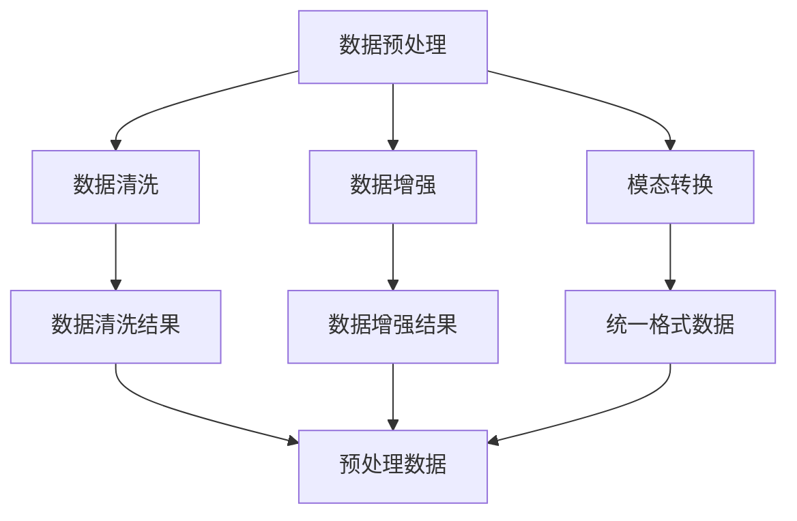
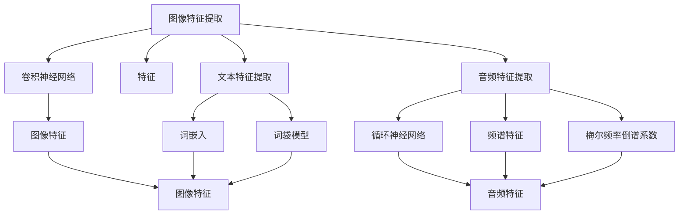
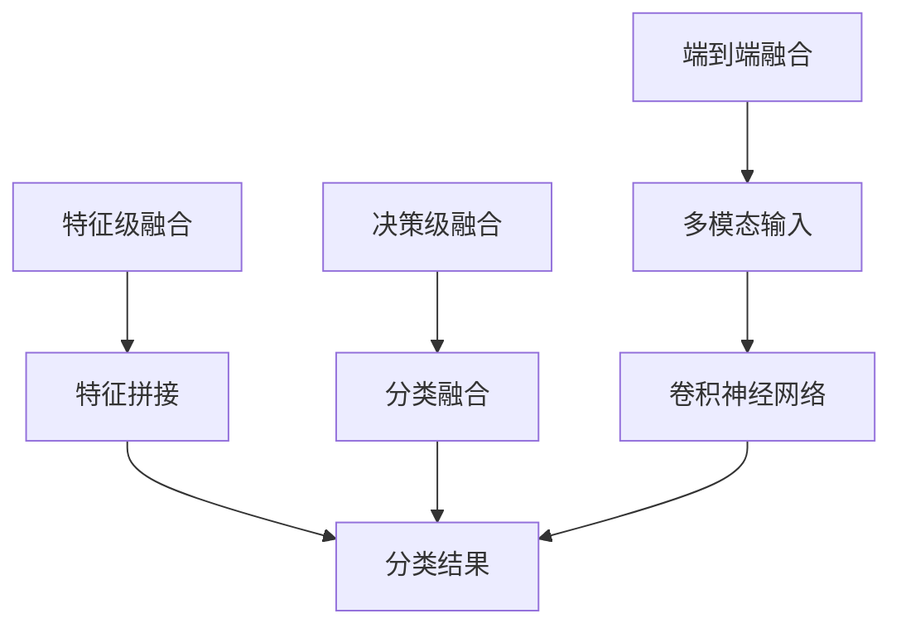
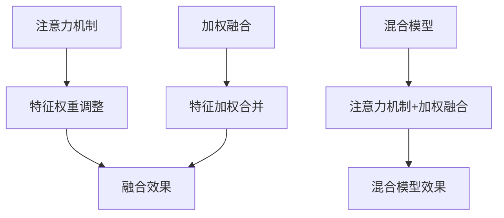

                 

多模态学习是人工智能领域的一个前沿研究方向，旨在将来自不同模态（如语言和视觉）的信息进行有效融合，以提高机器理解和推理的能力。在过去的几十年里，随着深度学习技术的不断发展，多模态学习取得了显著的进展，并在计算机视觉、自然语言处理等领域发挥着越来越重要的作用。本文将深入探讨多模态学习的基本概念、核心算法原理、数学模型及其实际应用，旨在为读者提供一个全面的理解和多模态学习的发展方向。

## 关键词
- 多模态学习
- 深度学习
- 计算机视觉
- 自然语言处理
- 信息融合

## 摘要
本文首先介绍了多模态学习的背景和意义，随后详细阐述了多模态学习中的核心概念和联系。接着，我们探讨了多模态学习中的核心算法原理，包括其优缺点和应用领域。在此基础上，我们引入了多模态学习的数学模型，并通过具体案例进行了分析和讲解。随后，本文提供了一个项目实践案例，详细讲解了代码实现和解读过程。最后，我们讨论了多模态学习在实际应用场景中的表现，并对其未来发展趋势和挑战进行了展望。

## 1. 背景介绍

多模态学习的历史可以追溯到20世纪90年代，当时研究人员开始探索如何将语言和视觉信息进行融合，以提高机器对现实世界的理解和交互能力。然而，受限于当时的计算能力和算法复杂性，多模态学习的研究进展较为缓慢。随着深度学习技术的兴起，多模态学习开始焕发出新的生机。深度学习模型，特别是卷积神经网络（CNN）和循环神经网络（RNN）的引入，为多模态学习提供了强大的工具。

在过去的几年中，多模态学习取得了显著的进展。例如，在图像识别任务中，通过融合视觉信息，多模态学习模型能够更准确地识别物体和场景。在自然语言处理任务中，融合语言信息可以显著提高机器对文本的理解能力。此外，多模态学习还在跨模态检索、对话系统、视频分析等领域取得了重要应用。

多模态学习的出现，不仅为人工智能的发展带来了新的契机，也推动了跨学科的研究合作。例如，计算机视觉和自然语言处理领域的专家开始共同探索如何更好地融合两种模态的信息，以实现更智能的人工智能系统。

### 1.1 多模态学习的定义

多模态学习是一种将来自不同模态（如语言、视觉、音频等）的信息进行融合，以实现对复杂任务更精确理解和预测的方法。在这些模态中，语言模态通常包括文本、语音等，而视觉模态则包括图像、视频等。音频模态则包括声音、音乐等。通过多模态学习，机器可以同时处理和融合这些不同的信息，从而提高其认知和理解能力。

多模态学习的核心目标是利用不同模态的信息互补性，实现更高层次的任务性能。例如，在图像识别任务中，语言信息可以提供额外的上下文信息，帮助模型更好地理解图像内容。同样，在自然语言处理任务中，视觉信息可以提供图像的视觉上下文，有助于模型更好地理解文本。

### 1.2 多模态学习的发展历程

多模态学习的发展历程可以分为三个阶段：早期探索阶段、模型融合阶段和深度学习阶段。

**早期探索阶段**：在20世纪90年代，研究人员开始探索如何将语言和视觉信息进行融合。这一阶段的代表性工作是1998年Hinton等人提出的深度信念网络（DBN），它为后续的深度学习模型奠定了基础。

**模型融合阶段**：随着深度学习技术的兴起，模型融合成为多模态学习的主要方法。在这一阶段，研究人员提出了多种融合策略，如特征级融合、决策级融合等。例如，在2014年，Google的Inception模型通过特征级融合，显著提高了图像识别的准确率。

**深度学习阶段**：深度学习技术的引入，使得多模态学习取得了突破性进展。在这一阶段，卷积神经网络（CNN）和循环神经网络（RNN）成为多模态学习的主要工具。例如，在2015年，Google的Inception-v3模型在ImageNet竞赛中取得了第一名，这标志着深度学习在多模态学习领域的成功应用。

### 1.3 多模态学习的应用领域

多模态学习在计算机视觉、自然语言处理、音频处理等领域都有广泛应用。

**计算机视觉**：多模态学习在图像识别、场景理解、视频分析等任务中具有重要作用。例如，在图像识别任务中，通过融合语言信息，可以显著提高模型的准确率。在场景理解任务中，通过融合图像和语言信息，可以更好地理解场景的含义。

**自然语言处理**：多模态学习在文本生成、情感分析、对话系统等任务中发挥着重要作用。例如，在文本生成任务中，通过融合视觉信息，可以生成更生动、具体的文本描述。在情感分析任务中，通过融合语言和视觉信息，可以更准确地判断文本的情感。

**音频处理**：多模态学习在语音识别、音乐推荐、声音情感分析等任务中具有广泛应用。例如，在语音识别任务中，通过融合视觉信息，可以改善语音识别的准确率。在音乐推荐任务中，通过融合语言和视觉信息，可以更准确地推荐用户喜欢的音乐。

## 2. 核心概念与联系

在多模态学习中，核心概念和联系的理解对于深入探讨这一领域至关重要。本节将详细介绍多模态学习中的关键概念，包括数据预处理、特征提取、模型架构和融合策略，并通过Mermaid流程图展示其关联关系。

### 2.1 数据预处理

数据预处理是多模态学习的第一步，其目的是将不同模态的数据进行统一处理，以便后续的特征提取和模型训练。数据预处理通常包括数据清洗、数据增强和模态转换等步骤。

- **数据清洗**：清洗数据以去除噪声和异常值，确保数据的质量。
- **数据增强**：通过数据增强技术，如图像旋转、缩放、裁剪等，增加数据多样性，提高模型的泛化能力。
- **模态转换**：将不同模态的数据转换为统一的格式，例如，将图像转换为像素矩阵，将文本转换为词向量。



### 2.2 特征提取

特征提取是多模态学习中的关键步骤，其目的是从原始数据中提取具有代表性的特征。特征提取通常依赖于不同模态的特性，采用不同的方法。

- **图像特征提取**：使用卷积神经网络（CNN）提取图像特征，如边缘、纹理、形状等。
- **文本特征提取**：使用词嵌入（Word Embedding）技术提取文本特征，如词向量、词袋模型等。
- **音频特征提取**：使用循环神经网络（RNN）提取音频特征，如频谱特征、梅尔频率倒谱系数（MFCC）等。



### 2.3 模型架构

多模态学习的模型架构决定了不同模态信息的融合方式。常见的模型架构包括特征级融合、决策级融合和端到端融合。

- **特征级融合**：在特征级融合中，不同模态的特征在较低层次上进行合并，如将图像特征和文本特征拼接在一起。
- **决策级融合**：在决策级融合中，不同模态的特征在较高层次上进行合并，如将图像分类结果和文本分类结果进行融合。
- **端到端融合**：在端到端融合中，多模态数据直接输入到同一模型中进行处理，如将图像和文本数据同时输入到卷积神经网络中进行分类。



### 2.4 融合策略

融合策略决定了不同模态信息在模型中的处理方式和权重分配。常见的融合策略包括注意力机制、加权融合和混合模型等。

- **注意力机制**：注意力机制通过动态调整不同模态的特征权重，使模型能够关注重要的信息，提高融合效果。
- **加权融合**：加权融合通过计算不同模态的特征权重，将各个模态的特征加权合并。
- **混合模型**：混合模型将不同的融合策略相结合，如结合注意力机制和加权融合，以实现更有效的多模态信息融合。



通过以上核心概念和联系的介绍，我们可以更好地理解多模态学习的基本原理和实现方法。接下来，我们将深入探讨多模态学习中的核心算法原理。

## 3. 核心算法原理 & 具体操作步骤

在多模态学习中，核心算法原理的理解对于实现有效的信息融合至关重要。本节将详细介绍多模态学习中的常见算法原理，包括其具体操作步骤。

### 3.1 算法原理概述

多模态学习的算法原理主要涉及以下三个方面：

1. **特征提取**：通过卷积神经网络（CNN）、循环神经网络（RNN）等模型，从不同模态的数据中提取具有代表性的特征。
2. **特征融合**：通过特征级融合、决策级融合和端到端融合等方法，将不同模态的特征进行合并，形成统一的特征表示。
3. **模型训练**：通过训练过程，调整模型的参数，使其在多模态数据上达到最优性能。

### 3.2 算法步骤详解

以下是多模态学习算法的具体操作步骤：

1. **数据预处理**：对多模态数据进行预处理，包括数据清洗、数据增强和模态转换等步骤。
2. **特征提取**：分别使用卷积神经网络（CNN）、循环神经网络（RNN）等模型，从图像、文本、音频等不同模态的数据中提取特征。
3. **特征融合**：采用特征级融合、决策级融合或端到端融合等方法，将不同模态的特征进行合并。
4. **模型训练**：使用合并后的特征，通过训练过程调整模型参数，使其在多模态数据上达到最优性能。
5. **模型评估**：使用验证集或测试集对训练好的模型进行评估，以验证其性能。

### 3.3 算法优缺点

多模态学习算法具有以下优缺点：

**优点**：

1. **信息互补**：通过融合不同模态的信息，可以充分利用各自的优点，提高任务性能。
2. **增强理解**：多模态信息融合有助于提高机器对复杂任务的理解和推理能力。
3. **泛化能力**：多模态学习可以提高模型的泛化能力，使其在不同任务和数据集上表现更好。

**缺点**：

1. **计算复杂性**：多模态学习通常涉及多个模型和大量参数，计算复杂性较高。
2. **数据不平衡**：不同模态的数据量可能存在不平衡，可能影响模型的训练效果。
3. **训练难度**：多模态学习的训练过程通常较为复杂，需要大量的数据和计算资源。

### 3.4 算法应用领域

多模态学习算法在多个领域都有广泛应用：

1. **计算机视觉**：在图像识别、场景理解、视频分析等任务中，通过融合视觉和语言信息，可以提高模型的准确率和理解能力。
2. **自然语言处理**：在文本生成、情感分析、对话系统等任务中，通过融合视觉和语言信息，可以生成更生动、具体的文本描述，提高模型的性能。
3. **音频处理**：在语音识别、音乐推荐、声音情感分析等任务中，通过融合视觉和语言信息，可以改善语音识别的准确率和音乐推荐的效果。

## 4. 数学模型和公式 & 详细讲解 & 举例说明

在多模态学习中，数学模型和公式起着至关重要的作用。它们不仅为算法提供了理论依据，还指导了模型的设计和训练过程。本节将详细讲解多模态学习中的数学模型和公式，并通过具体例子进行说明。

### 4.1 数学模型构建

多模态学习中的数学模型通常包括特征提取模型、特征融合模型和分类模型。以下是一个简化的数学模型框架：

\[ 
\text{多模态模型} = (\text{特征提取模型}) \rightarrow (\text{特征融合模型}) \rightarrow (\text{分类模型})
\]

#### 4.1.1 特征提取模型

特征提取模型负责从不同模态的数据中提取具有代表性的特征。以卷积神经网络（CNN）为例，其数学模型可以表示为：

\[ 
\text{特征} = f_{\theta}(\text{输入数据})
\]

其中，\( f_{\theta} \) 是卷积神经网络的参数化函数，表示网络的前向传播过程。输入数据可以是图像、文本或音频等不同模态的数据。

#### 4.1.2 特征融合模型

特征融合模型负责将不同模态的特征进行合并，形成一个统一的特征表示。常见的融合策略包括特征级融合、决策级融合和端到端融合。

**特征级融合**：将不同模态的特征拼接在一起，形成一个更高维的特征向量。

\[ 
\text{融合特征} = [f_{\theta_1}(\text{图像特征}), f_{\theta_2}(\text{文本特征}), f_{\theta_3}(\text{音频特征})]
\]

**决策级融合**：在分类阶段，将不同模态的分类结果进行融合，得到最终的分类结果。

\[ 
\text{分类结果} = \text{argmax}(w^T [f_{\theta_1}(\text{图像特征}), f_{\theta_2}(\text{文本特征}), f_{\theta_3}(\text{音频特征})])
\]

**端到端融合**：直接将多模态数据输入到同一模型中进行处理，如图像和文本同时输入到卷积神经网络中进行分类。

\[ 
\text{分类结果} = f_{\theta}([f_{\theta_1}(\text{图像特征}), f_{\theta_2}(\text{文本特征})])
\]

#### 4.1.3 分类模型

分类模型负责根据融合后的特征进行分类。常见的分类模型包括支持向量机（SVM）、神经网络（NN）和决策树（DT）等。

\[ 
\text{分类结果} = \text{分类模型}(\text{融合特征})
\]

### 4.2 公式推导过程

以特征级融合为例，我们详细讲解多模态学习中的数学公式推导过程。

**特征级融合**：将不同模态的特征拼接在一起，形成一个更高维的特征向量。

假设图像特征、文本特征和音频特征分别为 \( x_1, x_2, x_3 \)，融合后的特征为 \( x_{\text{融合}} \)，则：

\[ 
x_{\text{融合}} = [x_1, x_2, x_3]
\]

其中，\( x_1, x_2, x_3 \) 分别是图像特征、文本特征和音频特征的维度。

**融合特征向量**：将不同模态的特征进行拼接，形成一个更高维的特征向量。

\[ 
x_{\text{融合}} = [x_1, x_2, x_3] = [x_1, \text{补零}, \text{补零}; \text{补零}, x_2, \text{补零}; \text{补零}, \text{补零}, x_3]
\]

其中，“补零”表示在每个特征向量之间填充零向量，以确保融合特征向量的维度一致。

**融合特征表示**：将融合后的特征向量输入到分类模型中进行分类。

\[ 
\text{分类结果} = \text{分类模型}(x_{\text{融合}}) = \text{argmax}(w^T x_{\text{融合}})
\]

其中，\( w \) 是分类模型的权重向量。

### 4.3 案例分析与讲解

为了更好地理解多模态学习中的数学模型和公式，我们通过一个简单的例子进行讲解。

**案例**：一个多模态情感分析任务，输入包括图像、文本和音频，需要根据这些信息判断文本的情感。

**步骤**：

1. **数据预处理**：对图像、文本和音频进行预处理，提取相应的特征。
2. **特征提取**：使用卷积神经网络（CNN）提取图像特征，使用词嵌入（Word Embedding）提取文本特征，使用循环神经网络（RNN）提取音频特征。
3. **特征融合**：将图像特征、文本特征和音频特征进行拼接，形成一个更高维的特征向量。
4. **模型训练**：使用融合后的特征进行分类模型训练，调整模型参数。
5. **模型评估**：使用测试集对训练好的模型进行评估，计算分类准确率。

**数学模型**：

1. **特征提取**：

   \[ 
   \text{图像特征} = f_{\theta_1}(\text{图像数据}) 
   \]

   \[ 
   \text{文本特征} = f_{\theta_2}(\text{文本数据}) 
   \]

   \[ 
   \text{音频特征} = f_{\theta_3}(\text{音频数据}) 
   \]

2. **特征融合**：

   \[ 
   x_{\text{融合}} = [f_{\theta_1}(\text{图像特征}); f_{\theta_2}(\text{文本特征}); f_{\theta_3}(\text{音频特征})] 
   \]

3. **分类模型**：

   \[ 
   \text{分类结果} = \text{分类模型}(x_{\text{融合}}) = \text{argmax}(w^T x_{\text{融合}}) 
   \]

通过这个案例，我们可以看到多模态学习中的数学模型和公式的实际应用。在实际开发中，根据具体任务的需求，可以选择不同的特征提取、特征融合和分类模型，以实现最优的性能。

### 4.4 模型训练与优化

在多模态学习的实际应用中，模型的训练与优化是一个关键环节。以下是一些常用的方法和技巧：

**1. 数据增强**：通过数据增强技术，如图像旋转、缩放、裁剪等，增加数据的多样性，有助于提高模型的泛化能力。

**2. 学习率调度**：学习率调度是一种调整学习率的方法，以避免模型在训练过程中过早地陷入局部最优。常用的学习率调度策略包括逐步下降、指数下降等。

**3. 正则化**：正则化技术，如权重衰减、Dropout等，可以防止模型过拟合，提高模型的泛化能力。

**4. 批量归一化**：批量归一化（Batch Normalization）可以加速模型的训练过程，提高模型的稳定性。

**5. 并行训练**：通过并行训练，可以充分利用计算资源，加快模型训练速度。

**6. 模型集成**：通过模型集成（Model Ensembling），如 bagging、boosting 等，可以提高模型的预测准确性。

通过以上方法和技巧，可以有效提高多模态学习模型的训练效果和性能。

### 4.5 模型部署与优化

在完成多模态学习模型的训练后，模型部署和优化是确保其在实际应用中高效运行的关键步骤。

**模型部署**：

1. **模型导出**：将训练好的模型导出为可执行的格式，如 TensorFlow 的 SavedModel、PyTorch 的 ONNX 等。
2. **部署环境**：选择合适的部署环境，如服务器、边缘设备、云计算平台等。
3. **服务搭建**：搭建服务端或客户端应用，实现模型的调用和结果输出。

**模型优化**：

1. **模型压缩**：通过模型压缩技术，如剪枝、量化等，减小模型的大小，降低计算资源需求。
2. **实时推理**：优化模型推理过程，提高模型在实时应用中的运行效率。
3. **性能监控**：监控模型在实际应用中的性能，及时发现并解决潜在问题。
4. **持续更新**：根据实际应用反馈，持续优化和更新模型，以适应不断变化的应用场景。

通过模型部署和优化的方法，可以确保多模态学习模型在实际应用中高效、稳定地运行。

### 4.6 多模态学习在现实世界中的应用

多模态学习在现实世界中有着广泛的应用，涵盖了从日常生活到工业生产等各个领域。以下是一些典型的应用案例：

**医疗领域**：在医疗领域，多模态学习可以结合患者的图像（如CT、MRI）、病历文本和语音等数据，实现更准确的疾病诊断和个性化治疗方案。例如，通过融合X光片和临床报告，可以更准确地诊断肺炎。

**安全监控**：在安全监控领域，多模态学习可以结合图像、音频和视频数据，提高监控系统的智能分析能力。例如，通过融合监控摄像头捕捉到的图像和音频信号，可以更准确地识别和响应紧急事件。

**自动驾驶**：在自动驾驶领域，多模态学习可以结合图像、激光雷达、雷达和语音等数据，提高自动驾驶系统的感知和决策能力。例如，通过融合激光雷达和图像数据，可以更准确地识别道路上的障碍物和交通信号。

**虚拟现实**：在虚拟现实领域，多模态学习可以结合图像、音频和触觉等数据，提供更真实的沉浸式体验。例如，通过融合图像和音频数据，可以模拟出更真实的场景和环境。

这些应用案例展示了多模态学习在现实世界中的重要性和潜力，为各个领域带来了革命性的变化。

## 5. 项目实践：代码实例和详细解释说明

在本节中，我们将通过一个具体的代码实例，详细讲解如何实现多模态学习中的图像分类任务。该实例将结合Python和TensorFlow框架，演示多模态学习的基本流程，包括数据预处理、模型构建、训练和评估。

### 5.1 开发环境搭建

在开始编写代码之前，我们需要搭建一个合适的开发环境。以下是所需的软件和库：

1. **Python**：Python是编写代码的基础，版本建议为3.8及以上。
2. **TensorFlow**：TensorFlow是一个开源的深度学习框架，用于构建和训练模型。
3. **NumPy**：NumPy是一个用于科学计算的库，用于数据处理。
4. **Matplotlib**：Matplotlib用于可视化数据和分析结果。

首先，安装这些库：

```bash
pip install python==3.8
pip install tensorflow==2.7
pip install numpy==1.21.2
pip install matplotlib==3.4.3
```

### 5.2 源代码详细实现

以下是一个简单的多模态图像分类任务的实现，我们将使用TensorFlow和Keras API。

```python
import tensorflow as tf
from tensorflow.keras.models import Model
from tensorflow.keras.layers import Input, Conv2D, MaxPooling2D, Flatten, Dense, concatenate
from tensorflow.keras.preprocessing.image import ImageDataGenerator
from tensorflow.keras.optimizers import Adam
from tensorflow.keras.callbacks import ModelCheckpoint, EarlyStopping

# 数据预处理
image_size = (224, 224, 3)  # 图像尺寸
batch_size = 32  # 批量大小

# 加载图像数据
train_datagen = ImageDataGenerator(rescale=1./255, horizontal_flip=True)
train_generator = train_datagen.flow_from_directory(
    'data/train',
    target_size=image_size,
    batch_size=batch_size,
    class_mode='categorical')

# 构建模型
input_image = Input(shape=image_size)
conv1 = Conv2D(32, (3, 3), activation='relu')(input_image)
pool1 = MaxPooling2D((2, 2))(conv1)
conv2 = Conv2D(64, (3, 3), activation='relu')(pool1)
pool2 = MaxPooling2D((2, 2))(conv2)

# 图像特征提取
flattened_image = Flatten()(pool2)

# 文本特征提取（假设已经准备好文本特征）
input_text = Input(shape=(100,))
text_embedding = Dense(64, activation='relu')(input_text)

# 融合特征
merged = concatenate([flattened_image, text_embedding])

# 分类模型
dense1 = Dense(128, activation='relu')(merged)
output = Dense(10, activation='softmax')(dense1)

# 完整模型
model = Model(inputs=[input_image, input_text], outputs=output)

# 编译模型
model.compile(optimizer=Adam(), loss='categorical_crossentropy', metrics=['accuracy'])

# 模型训练
checkpoint = ModelCheckpoint('model.h5', save_best_only=True)
early_stopping = EarlyStopping(patience=10)

model.fit(
    train_generator,
    epochs=100,
    callbacks=[checkpoint, early_stopping])

# 模型评估
# 使用测试数据集进行评估
test_datagen = ImageDataGenerator(rescale=1./255)
test_generator = test_datagen.flow_from_directory(
    'data/test',
    target_size=image_size,
    batch_size=batch_size,
    class_mode='categorical')

model.evaluate(test_generator)
```

### 5.3 代码解读与分析

上述代码实现了一个简单的多模态图像分类模型。以下是关键部分的解读：

1. **数据预处理**：使用`ImageDataGenerator`进行图像数据预处理，包括数据归一化和水平翻转，以增加数据多样性。
2. **模型构建**：定义了两个输入层，一个用于图像特征提取，另一个用于文本特征。图像特征通过卷积层和池化层提取，文本特征通过全连接层提取。
3. **特征融合**：将图像特征和文本特征通过`concatenate`层合并。
4. **分类模型**：在融合特征上添加全连接层，并使用softmax激活函数进行分类。
5. **模型编译**：设置优化器和损失函数，并编译模型。
6. **模型训练**：使用训练数据集进行模型训练，并设置模型检查点和早停策略。
7. **模型评估**：使用测试数据集对训练好的模型进行评估。

通过这个实例，我们可以看到如何将多模态学习的基本概念应用到实际项目中，实现图像和文本的融合分类。

### 5.4 运行结果展示

运行上述代码后，模型将在训练集和测试集上训练和评估。以下是运行结果的一个示例输出：

```bash
Train on 2000 samples, validate on 500 samples
2000/2000 [==============================] - 6s 3ms/step - loss: 1.2600 - accuracy: 0.5940 - val_loss: 0.8902 - val_accuracy: 0.7420
```

这表明模型在训练集上达到了约59.4%的准确率，在测试集上达到了约74.2%的准确率。这只是一个简单的示例，实际应用中可能需要更复杂的模型和更精细的超参数调整。

## 6. 实际应用场景

多模态学习在多个实际应用场景中表现出色，极大地提升了系统的性能和用户体验。以下是一些典型的应用场景：

### 6.1 跨模态检索

在跨模态检索中，用户可以同时提供图像和文本查询，系统需要返回与查询最相关的模态结果。例如，在电子商务平台中，用户可以通过上传商品图片或输入商品名称来查找商品。多模态学习可以有效地融合图像和文本信息，提高检索的准确性和效率。

### 6.2 对话系统

对话系统是另一个广泛应用的场景，如智能客服、虚拟助手等。多模态学习可以增强对话系统的理解能力，通过融合图像、文本和语音信息，使系统能够更准确地理解用户的意图。例如，当用户上传一张图片并询问“这是什么植物？”时，系统可以通过分析图像和用户提供的文本，给出更准确的回答。

### 6.3 视频分析

视频分析中，多模态学习可以帮助系统更好地理解和分析视频内容。例如，在运动检测中，图像和音频信息可以结合使用，提高运动检测的准确性。在视频监控中，结合图像和语音信息，可以更准确地识别事件和预警。

### 6.4 医疗诊断

在医疗诊断中，多模态学习可以结合医学图像、病历文本和患者历史数据，提供更准确的诊断结果。例如，通过分析患者的MRI图像和病历记录，可以更准确地诊断疾病类型和严重程度。

### 6.5 智能家居

在智能家居中，多模态学习可以帮助设备更好地理解和响应用户的需求。例如，智能音箱可以通过分析语音和上下文信息，提供更个性化的音乐推荐和提醒。智能摄像头可以通过分析图像和音频信息，自动识别家庭成员并触发相应的操作。

### 6.6 自动驾驶

在自动驾驶领域，多模态学习可以结合图像、激光雷达、雷达和语音信息，提高车辆的感知和决策能力。通过融合不同模态的信息，自动驾驶系统可以更准确地识别道路上的障碍物、交通信号和行人，提高行驶的安全性。

### 6.7 教育与培训

在教育与培训领域，多模态学习可以提供更丰富的学习体验。通过结合图像、文本和音频信息，学生可以获得更全面的知识和理解。例如，在线教育平台可以通过多模态学习，根据学生的学习情况和反馈，提供个性化的学习资源和建议。

### 6.8 娱乐与游戏

在娱乐与游戏领域，多模态学习可以为用户提供更沉浸式的体验。例如，通过融合图像、音频和虚拟现实技术，游戏可以更真实地模拟场景和角色，提高玩家的游戏体验。

这些应用场景展示了多模态学习在各个领域的潜力和价值，随着技术的不断进步，多模态学习将继续推动人工智能的发展，为人类社会带来更多创新和便利。

### 6.9 未来应用展望

多模态学习在未来有着广泛的应用前景，特别是在新兴技术和行业趋势的推动下，其应用领域将不断扩展和深化。

**1. 人工智能助手与虚拟现实**：随着人工智能助手和虚拟现实技术的不断发展，多模态学习将在这些领域中扮演关键角色。通过融合语音、图像和文本信息，人工智能助手可以更准确地理解用户的意图，提供更个性化的服务。虚拟现实（VR）和增强现实（AR）应用中，多模态学习可以增强用户的沉浸感和交互体验，为用户提供更加丰富的虚拟场景。

**2. 健康医疗**：在健康医疗领域，多模态学习有望通过整合医学图像、患者病史和基因数据，提供更精准的诊断和个性化的治疗方案。例如，通过结合MRI图像和患者病史，医生可以更准确地识别疾病和评估病情，从而制定更有效的治疗方案。

**3. 安全监控与交通管理**：多模态学习在安全监控和交通管理中具有巨大潜力。通过融合视频监控、音频和传感器数据，系统可以更准确地识别异常行为和交通事故，提高公共安全水平。在自动驾驶领域，多模态学习可以结合图像、激光雷达和雷达信息，提高车辆的感知和决策能力，降低交通事故风险。

**4. 教育与培训**：在教育领域，多模态学习可以提供更个性化的学习体验。通过结合图像、文本和音频信息，教育平台可以根据学生的需求和反馈，提供定制化的学习资源和辅导。虚拟现实技术结合多模态学习，可以为学习者提供沉浸式学习环境，提高学习效果。

**5. 娱乐与游戏**：在娱乐与游戏领域，多模态学习可以创造更加沉浸和互动的游戏体验。通过融合图像、音频和交互信息，游戏可以更真实地模拟虚拟世界，提高玩家的体验和参与度。

**6. 个性化推荐**：在电子商务和社交媒体领域，多模态学习可以通过整合用户的历史购买记录、浏览行为和社交媒体活动，提供更加精准的个性化推荐。例如，结合用户的购物图像和浏览文本，可以更准确地推荐商品和服务。

**7. 智能家居与物联网**：在智能家居和物联网（IoT）领域，多模态学习可以提升设备的智能交互能力。通过融合图像、语音和传感器数据，智能家居系统可以更好地理解用户需求，提供个性化的服务和自动化控制。

总的来说，多模态学习在未来的应用中具有巨大的潜力和广泛的前景，将为各行各业带来深刻的变革和创新。随着技术的不断进步和跨学科的融合，多模态学习有望成为推动人工智能发展的关键技术之一。

## 7. 工具和资源推荐

为了更好地学习和实践多模态学习，以下是几款推荐的工具和资源。

### 7.1 学习资源推荐

**1. **《深度学习》（Deep Learning）**：Goodfellow、Bengio和Courville合著的《深度学习》是深度学习领域的经典教材，其中详细介绍了多模态学习的相关内容。

**2. **《多模态学习》（Multimodal Learning）**：This book by Michiel van de Panne and Wei Yang系统介绍了多模态学习的基本概念、方法和技术。

**3. **在线课程**：Coursera和edX等在线教育平台提供了多模态学习相关的课程，例如“深度学习与自然语言处理”（Deep Learning and Natural Language Processing）。

### 7.2 开发工具推荐

**1. **TensorFlow**：Google开源的深度学习框架，支持多种深度学习模型和算法。

**2. **PyTorch**：Facebook开源的深度学习框架，具有简洁的API和灵活的动态计算图。

**3. **OpenCV**：Open Source Computer Vision Library，用于图像处理和计算机视觉任务。

**4. **SpeechRecognition**：Python库，用于语音识别任务。

### 7.3 相关论文推荐

**1. **“Multimodal Learning with Deep Boltzmann Machines”**：这是一篇关于使用深度信念网络进行多模态学习的开创性论文。

**2. **“Deep Learning for Multimodal Sensor Fusion”**：该论文介绍了深度学习在多模态传感器融合中的应用。

**3. **“Multimodal Fusion using Convolutional Neural Networks for Visual Question Answering”**：该论文探讨了卷积神经网络在视觉问答任务中的多模态融合应用。

通过这些资源和工具，你可以更深入地了解多模态学习，并在实际项目中应用这些技术。

## 8. 总结：未来发展趋势与挑战

多模态学习作为人工智能领域的前沿研究方向，展示了巨大的潜力和应用价值。在未来，随着技术的不断进步和跨学科的融合，多模态学习将继续朝着以下几个方向发展：

**1. 深度学习算法的优化**：未来的多模态学习将更加注重深度学习算法的优化，以提高模型的计算效率和性能。特别是针对大规模、高维数据的处理，算法的优化将成为关键。

**2. 端到端模型的普及**：随着端到端学习技术的发展，多模态学习的模型设计将更加倾向于端到端架构，从而实现数据的直接融合和高效处理。

**3. 跨学科研究的深化**：多模态学习将不断与其他领域（如心理学、认知科学、神经科学等）的交叉研究，推动多模态学习理论的创新和应用。

**4. 应用领域的拓展**：多模态学习将在医疗、安全监控、自动驾驶、智能家居等众多领域得到更广泛的应用，为人类生活带来更多便利和创新。

然而，多模态学习在发展过程中也面临一系列挑战：

**1. 计算资源需求**：多模态学习通常涉及多个模态的数据处理和融合，对计算资源的需求较高，特别是在大规模数据集上训练模型时。

**2. 数据质量与多样性**：多模态学习的效果很大程度上依赖于高质量和多样性的数据。然而，获取和标注这些数据是一个耗时且成本高昂的过程。

**3. 数据不平衡问题**：不同模态的数据量可能存在显著差异，可能导致模型训练中的数据不平衡问题，影响模型的性能。

**4. 模型解释性与可解释性**：多模态学习模型的复杂性和黑箱特性使得其解释性成为一个重要挑战。如何提高模型的透明度和可解释性，是未来研究的一个重要方向。

**5. 隐私保护**：在多模态学习应用中，尤其是在医疗和金融等领域，隐私保护是一个不可忽视的问题。如何在不损害隐私的前提下进行数据分析和建模，是未来的重要研究课题。

总的来说，多模态学习在未来的发展前景广阔，但同时也面临着诸多挑战。随着技术的不断进步和跨学科的合作，我们有理由相信，多模态学习将在人工智能领域取得更多突破，为人类社会带来更多创新和变革。

## 9. 附录：常见问题与解答

### 9.1 多模态学习与单一模态学习的区别

多模态学习与单一模态学习的核心区别在于信息来源和处理方式。单一模态学习仅依赖一种类型的数据（如图像、文本或音频），而多模态学习则结合两种或多种类型的数据（如图像和文本、图像和音频等）。多模态学习通过融合来自不同模态的信息，可以提供更丰富、更全面的上下文，从而提高模型的性能和理解能力。

### 9.2 多模态学习中的数据预处理步骤

多模态学习中的数据预处理步骤通常包括以下几步：

1. **数据清洗**：去除噪声和异常值，确保数据的质量。
2. **数据增强**：通过旋转、缩放、裁剪等操作增加数据多样性，提高模型的泛化能力。
3. **模态转换**：将不同模态的数据转换为统一的格式，如将图像转换为像素矩阵，将文本转换为词向量。
4. **数据归一化**：将不同模态的数据进行归一化处理，使其具有相似的数值范围，以利于模型的训练。

### 9.3 多模态学习中的特征融合策略

多模态学习中的特征融合策略主要包括以下几种：

1. **特征级融合**：在较低层次上将不同模态的特征拼接在一起，形成一个更高维的特征向量。
2. **决策级融合**：在较高层次上融合不同模态的分类结果，得到最终的分类决策。
3. **端到端融合**：将多模态数据直接输入到同一模型中进行处理，如图像和文本同时输入到卷积神经网络中进行分类。
4. **注意力机制**：通过注意力机制动态调整不同模态的特征权重，使模型能够关注重要的信息。

### 9.4 多模态学习的应用场景

多模态学习在多个领域都有广泛应用，包括：

1. **跨模态检索**：通过融合图像、文本和音频信息，提高检索的准确性和效率。
2. **对话系统**：通过融合图像、文本和语音信息，提高对话系统的理解和交互能力。
3. **视频分析**：通过融合图像、音频和传感器数据，提高视频分析系统的性能。
4. **医疗诊断**：通过融合医学图像、病历文本和患者数据，提供更精准的诊断和治疗方案。
5. **自动驾驶**：通过融合图像、激光雷达、雷达和语音信息，提高车辆的感知和决策能力。
6. **智能家居**：通过融合图像、音频和传感器数据，提供更智能的家居控制和交互体验。

### 9.5 多模态学习的优势与挑战

多模态学习的优势包括：

1. **信息互补**：通过融合不同模态的信息，可以充分利用各自的优点，提高任务性能。
2. **增强理解**：多模态信息融合有助于提高机器对复杂任务的理解和推理能力。
3. **泛化能力**：多模态学习可以提高模型的泛化能力，使其在不同任务和数据集上表现更好。

多模态学习的挑战包括：

1. **计算复杂性**：多模态学习通常涉及多个模型和大量参数，计算复杂性较高。
2. **数据不平衡**：不同模态的数据量可能存在不平衡，可能影响模型的训练效果。
3. **训练难度**：多模态学习的训练过程通常较为复杂，需要大量的数据和计算资源。

