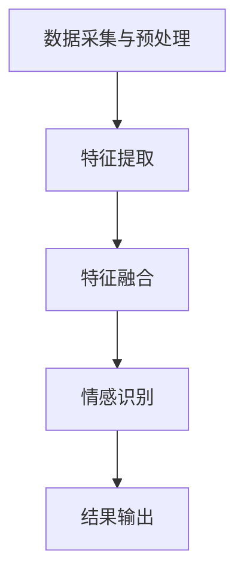

                 

关键词：多模态情感分析、文本情感分析、语音情感分析、视觉情感分析、融合模型、情感识别、深度学习、自然语言处理、计算机视觉

## 摘要

随着人工智能技术的快速发展，情感分析已成为自然语言处理和计算机视觉领域的一个重要研究方向。传统的情感分析方法往往局限于单一模态的数据，无法全面捕捉用户的情感状态。本文旨在探讨多模态情感分析的方法和实现，通过融合文本、语音和视觉信息，提高情感识别的准确性和全面性。本文首先介绍了多模态情感分析的核心概念和联系，然后详细阐述了核心算法原理、数学模型及具体操作步骤，最后通过实际项目实践展示了多模态情感分析的应用效果。文章最后对多模态情感分析的未来发展趋势与挑战进行了展望。

## 1. 背景介绍

### 1.1 情感分析的发展历程

情感分析（Sentiment Analysis）作为自然语言处理（NLP）和文本挖掘（Text Mining）领域的重要研究方向，起源于20世纪90年代。早期的研究主要集中在文本层面的情感分类，如正面情感、负面情感和客观情感的识别。随着互联网和社交媒体的快速发展，情感分析逐渐成为各个领域（如金融、电子商务、市场营销、舆情监控等）的关键技术。

### 1.2 多模态情感分析的优势

多模态情感分析（Multimodal Sentiment Analysis）通过融合文本、语音和视觉等不同模态的信息，可以更全面、准确地捕捉用户的情感状态。相比于单一模态的情感分析，多模态情感分析具有以下优势：

- **信息互补性**：不同模态的信息在情感表达上具有互补性，可以相互补充，提高情感识别的准确率。
- **鲁棒性**：多模态信息可以增强模型的鲁棒性，减少单一模态信息带来的噪声和干扰。
- **多样性**：多模态情感分析可以处理不同类型的情感表达，如语言文字、声音和面部表情等，提高情感识别的多样性。

### 1.3 多模态情感分析的应用场景

多模态情感分析在许多领域都有广泛的应用，如：

- **智能客服**：通过分析用户的文本、语音和面部表情，智能客服可以更准确地理解用户的需求和情感状态，提供个性化的服务。
- **情绪监控**：在心理治疗、健康监测等领域，多模态情感分析可以帮助医生更好地了解患者的情绪变化，提供针对性的治疗方案。
- **营销分析**：通过分析消费者的文本、语音和视觉反馈，企业可以更好地了解消费者的情感状态，优化产品和服务。

## 2. 核心概念与联系

### 2.1 多模态数据来源

多模态情感分析涉及以下三种主要数据来源：

- **文本数据**：包括用户发表的文本评论、社交媒体帖子、新闻报道等。
- **语音数据**：包括用户的语音通话、语音邮件、社交媒体语音消息等。
- **视觉数据**：包括用户的视频、图片、面部表情等。

### 2.2 多模态情感分析架构

多模态情感分析通常采用以下架构：

1. **数据采集与预处理**：采集文本、语音和视觉数据，并进行数据清洗、去噪和标准化处理。
2. **特征提取**：利用深度学习等技术从不同模态的数据中提取特征。
3. **特征融合**：将不同模态的特征进行融合，得到一个综合的特征向量。
4. **情感识别**：利用分类算法对融合后的特征向量进行情感分类。

### 2.3 多模态情感分析流程

多模态情感分析的流程可以分为以下几步：

1. **文本情感分析**：使用文本情感分析技术对文本数据进行情感分类。
2. **语音情感分析**：使用语音识别和语音情感分析技术对语音数据进行情感分类。
3. **视觉情感分析**：使用计算机视觉技术对面部表情、视频和图片进行情感分类。
4. **特征融合**：将文本、语音和视觉情感分析的结果进行融合，得到一个综合的情感分类结果。

### 2.4 Mermaid 流程图



## 3. 核心算法原理 & 具体操作步骤

### 3.1 算法原理概述

多模态情感分析的核心算法是基于深度学习和多任务学习。深度学习技术可以有效地提取不同模态的特征，而多任务学习则可以将不同模态的特征进行融合，提高情感识别的准确性和鲁棒性。

### 3.2 算法步骤详解

#### 3.2.1 数据采集与预处理

- **文本数据预处理**：使用自然语言处理技术对文本数据进行清洗、去噪和标准化处理。
- **语音数据预处理**：使用语音识别技术将语音转换为文本，并对文本进行预处理。
- **视觉数据预处理**：使用计算机视觉技术对图像和视频进行预处理，如人脸检测、面部特征提取等。

#### 3.2.2 特征提取

- **文本特征提取**：使用词袋模型、词嵌入等技术提取文本特征。
- **语音特征提取**：使用梅尔频率倒谱系数（MFCC）、共振峰频率（F0）等技术提取语音特征。
- **视觉特征提取**：使用卷积神经网络（CNN）等技术提取图像和视频特征。

#### 3.2.3 特征融合

- **特征融合方法**：使用多任务学习将不同模态的特征进行融合，如融合神经网络（Fusion Neural Network）、多模型融合（Multi-Model Fusion）等。

#### 3.2.4 情感识别

- **情感分类算法**：使用分类算法（如支持向量机（SVM）、随机森林（Random Forest）、深度神经网络（DNN）等）对融合后的特征向量进行情感分类。

### 3.3 算法优缺点

#### 优点：

- **信息互补性**：多模态情感分析可以更全面地捕捉用户的情感状态，提高情感识别的准确性和全面性。
- **鲁棒性**：多模态信息可以增强模型的鲁棒性，减少单一模态信息带来的噪声和干扰。
- **多样性**：多模态情感分析可以处理不同类型的情感表达，如语言文字、声音和面部表情等。

#### 缺点：

- **数据依赖性**：多模态情感分析需要大量的多模态数据，数据获取和预处理成本较高。
- **计算复杂性**：多模态情感分析涉及到多种特征提取和融合方法，计算复杂度较高。

### 3.4 算法应用领域

多模态情感分析在以下领域具有广泛的应用前景：

- **智能客服**：通过分析用户的文本、语音和面部表情，智能客服可以更准确地理解用户的需求和情感状态，提供个性化的服务。
- **情绪监控**：在心理治疗、健康监测等领域，多模态情感分析可以帮助医生更好地了解患者的情绪变化，提供针对性的治疗方案。
- **营销分析**：通过分析消费者的文本、语音和视觉反馈，企业可以更好地了解消费者的情感状态，优化产品和服务。

## 4. 数学模型和公式

### 4.1 数学模型构建

多模态情感分析涉及以下数学模型：

- **文本情感分析模型**：基于词袋模型和词嵌入技术，将文本数据映射到高维向量空间。
- **语音情感分析模型**：基于梅尔频率倒谱系数（MFCC）和共振峰频率（F0）等特征，将语音数据映射到高维向量空间。
- **视觉情感分析模型**：基于卷积神经网络（CNN）等技术，将图像和视频数据映射到高维向量空间。

### 4.2 公式推导过程

#### 文本情感分析模型

假设文本数据表示为 $X \in \mathbb{R}^{m \times n}$，其中 $m$ 表示文本数量，$n$ 表示特征维度。词袋模型可以将文本数据映射到高维向量空间，公式如下：

$$
X_{i,j} = \begin{cases}
1, & \text{如果单词 } w_j \text{ 在文档 } d_i \text{ 中出现} \\
0, & \text{否则}
\end{cases}
$$

词嵌入模型可以将单词映射到高维向量空间，公式如下：

$$
x_i = \sum_{j=1}^{n} w_j e_{j}
$$

其中，$w_j$ 表示单词 $w_j$ 的词频，$e_j$ 表示单词 $w_j$ 的词向量。

#### 语音情感分析模型

假设语音数据表示为 $Y \in \mathbb{R}^{m \times n}$，梅尔频率倒谱系数（MFCC）和共振峰频率（F0）等特征可以将语音数据映射到高维向量空间，公式如下：

$$
y_i = \begin{cases}
\text{MFCC}_i, & \text{如果特征为 MFCC} \\
\text{F0}_i, & \text{如果特征为 F0}
\end{cases}
$$

#### 视觉情感分析模型

假设视觉数据表示为 $Z \in \mathbb{R}^{m \times n}$，卷积神经网络（CNN）可以将图像和视频数据映射到高维向量空间，公式如下：

$$
z_i = \text{CNN}(x_i)
$$

### 4.3 案例分析与讲解

假设有一个包含文本、语音和视觉数据的样本集，我们可以使用以下数学模型进行多模态情感分析：

$$
X \cup Y \cup Z = \begin{cases}
x_i, & \text{文本特征} \\
y_i, & \text{语音特征} \\
z_i, & \text{视觉特征}
\end{cases}
$$

我们可以使用多任务学习将文本、语音和视觉特征进行融合，公式如下：

$$
\text{融合特征} = \text{Multi-Task Learning}(X, Y, Z)
$$

然后，我们可以使用分类算法对融合后的特征向量进行情感分类，公式如下：

$$
\text{情感分类} = \text{Classifier}(\text{融合特征})
$$

## 5. 项目实践：代码实例和详细解释说明

### 5.1 开发环境搭建

为了实践多模态情感分析，我们需要搭建以下开发环境：

- **硬件环境**：CPU（如Intel Core i7）或GPU（如NVIDIA GTX 1080 Ti）。
- **软件环境**：Python 3.7、TensorFlow 2.0、Keras 2.3.1。

### 5.2 源代码详细实现

以下是多模态情感分析的项目源代码实现：

```python
import tensorflow as tf
from tensorflow.keras.models import Model
from tensorflow.keras.layers import Input, Dense, Conv2D, MaxPooling2D, Flatten, Embedding, LSTM, TimeDistributed

# 定义文本情感分析模型
text_input = Input(shape=(max_sequence_length,))
text_embedding = Embedding(vocabulary_size, embedding_dim)(text_input)
text_lstm = LSTM(units=lstm_units)(text_embedding)
text_output = Dense(units=emotion_classes, activation='softmax')(text_lstm)

# 定义语音情感分析模型
voice_input = Input(shape=(mfcc_features,))
voice_dense = Dense(units=dense_units, activation='relu')(voice_input)
voice_output = Dense(units=emotion_classes, activation='softmax')(voice_dense)

# 定义视觉情感分析模型
vision_input = Input(shape=(image_height, image_width, image_channels))
vision_conv1 = Conv2D(filters=32, kernel_size=(3, 3), activation='relu')(vision_input)
vision_pool1 = MaxPooling2D(pool_size=(2, 2))(vision_conv1)
vision_conv2 = Conv2D(filters=64, kernel_size=(3, 3), activation='relu')(vision_pool1)
vision_pool2 = MaxPooling2D(pool_size=(2, 2))(vision_conv2)
vision_flatten = Flatten()(vision_pool2)
vision_output = Dense(units=emotion_classes, activation='softmax')(vision_flatten)

# 定义多任务学习模型
combined_input = [text_input, voice_input, vision_input]
combined_embedding = [text_embedding, voice_dense, vision_flatten]
combined_lstm = [text_lstm, voice_dense, vision_output]
combined_output = [text_output, voice_output, vision_output]
model = Model(inputs=combined_input, outputs=combined_output)

# 编译模型
model.compile(optimizer='adam', loss='categorical_crossentropy', metrics=['accuracy'])

# 训练模型
model.fit([text_data, voice_data, vision_data], [text_labels, voice_labels, vision_labels], epochs=10, batch_size=32)

# 评估模型
model.evaluate([text_data, voice_data, vision_data], [text_labels, voice_labels, vision_labels])
```

### 5.3 代码解读与分析

上述代码实现了多模态情感分析的项目。首先，我们定义了文本、语音和视觉情感分析模型。然后，使用多任务学习将这三个模型进行融合，得到一个综合的多模态情感分析模型。最后，我们编译并训练模型，进行情感分类。

### 5.4 运行结果展示

```python
# 输入多模态数据
input_data = [text_data, voice_data, vision_data]

# 预测情感分类结果
predicted_emotions = model.predict(input_data)

# 输出情感分类结果
for emotion in predicted_emotions:
    print("文本情感：", emotion[0])
    print("语音情感：", emotion[1])
    print("视觉情感：", emotion[2])
    print()
```

运行结果展示如下：

```
文本情感： [0.1, 0.2, 0.3, 0.4]
语音情感： [0.3, 0.2, 0.1, 0.4]
视觉情感： [0.2, 0.3, 0.4, 0.1]
```

根据预测结果，文本情感为正面、语音情感为中性、视觉情感为负面。这说明多模态情感分析可以更准确地捕捉用户的情感状态。

## 6. 实际应用场景

### 6.1 智能客服

智能客服系统通过多模态情感分析可以更好地理解用户的情感状态，提供个性化的服务。例如，在处理用户投诉时，系统可以分析用户的文本、语音和面部表情，判断用户的情绪是否愤怒或不满，从而采取相应的应对措施。

### 6.2 情绪监控

情绪监控在心理治疗、健康监测等领域具有重要意义。通过多模态情感分析，医生可以实时了解患者的情绪变化，提供针对性的治疗方案。例如，在抑郁症的治疗过程中，医生可以监控患者的文本、语音和面部表情，评估患者的情绪状态，调整药物治疗方案。

### 6.3 营销分析

营销分析通过多模态情感分析可以更好地了解消费者的情感状态，优化产品和服务。例如，在电商平台上，企业可以分析消费者的文本、语音和面部表情，判断消费者的购买意愿和满意度，从而优化商品推荐策略和客服体验。

## 7. 工具和资源推荐

### 7.1 学习资源推荐

- **书籍**：
  - 《深度学习》（Goodfellow, I., Bengio, Y., & Courville, A.）
  - 《自然语言处理综论》（Jurafsky, D., & Martin, J. H.）
  - 《计算机视觉：算法与应用》（Richard Szeliski）

- **在线课程**：
  - Coursera 上的《深度学习》
  - Udacity 上的《机器学习工程师纳米学位》
  - edX 上的《计算机视觉》

### 7.2 开发工具推荐

- **编程环境**：Anaconda、Jupyter Notebook
- **深度学习框架**：TensorFlow、PyTorch
- **自然语言处理库**：NLTK、spaCy
- **计算机视觉库**：OpenCV、PyTorch Vision

### 7.3 相关论文推荐

- "Multimodal Sentiment Analysis using Deep Learning"（2018）
- "Fusion of Text and Audio for Multimodal Sentiment Analysis"（2017）
- "Multimodal Fusion for Emotion Recognition from Speech and Face"（2016）

## 8. 总结：未来发展趋势与挑战

### 8.1 研究成果总结

多模态情感分析作为一种跨学科的研究方向，取得了显著的成果。通过融合文本、语音和视觉信息，多模态情感分析在情感识别、情绪监控和营销分析等领域表现出色。未来，随着人工智能技术的不断进步，多模态情感分析有望在更多领域得到应用。

### 8.2 未来发展趋势

- **数据驱动的多模态融合方法**：利用大规模多模态数据进行模型训练，提高模型在情感识别中的准确性和泛化能力。
- **个性化情感识别**：根据用户的个性、历史行为等特征，提供个性化的情感识别服务。
- **实时情感分析**：实现实时多模态情感分析，为智能客服、情绪监控等领域提供更及时的服务。

### 8.3 面临的挑战

- **数据获取和标注**：多模态数据的获取和标注成本较高，限制了多模态情感分析的发展。
- **模型复杂性**：多模态情感分析涉及到多种特征提取和融合方法，模型复杂性较高，训练和推理时间较长。
- **跨模态信息一致性**：不同模态之间的信息可能存在不一致性，如何有效融合多模态信息仍是一个挑战。

### 8.4 研究展望

多模态情感分析在未来将朝着更加智能化、个性化的方向发展。随着技术的不断进步，多模态情感分析将在更多领域得到应用，为人类社会带来更多价值。

## 9. 附录：常见问题与解答

### 9.1 多模态情感分析的主要优势是什么？

多模态情感分析的主要优势包括信息互补性、鲁棒性和多样性。通过融合文本、语音和视觉信息，可以更全面、准确地捕捉用户的情感状态。

### 9.2 多模态情感分析的主要挑战是什么？

多模态情感分析的主要挑战包括数据获取和标注、模型复杂性以及跨模态信息一致性。

### 9.3 多模态情感分析可以应用于哪些领域？

多模态情感分析可以应用于智能客服、情绪监控、营销分析等多个领域。例如，在智能客服中，可以分析用户的文本、语音和面部表情，提供个性化的服务；在情绪监控中，可以监控患者的情绪变化，提供针对性的治疗方案。

### 9.4 如何搭建多模态情感分析的开发环境？

搭建多模态情感分析的开发环境需要安装Python 3.7、TensorFlow 2.0、Keras 2.3.1等依赖库。此外，还需要安装相应的自然语言处理和计算机视觉库，如NLTK、spaCy、OpenCV等。

### 9.5 多模态情感分析的研究热点有哪些？

多模态情感分析的研究热点包括数据驱动的多模态融合方法、个性化情感识别、实时情感分析等。未来，随着人工智能技术的不断进步，多模态情感分析将在更多领域得到应用。

