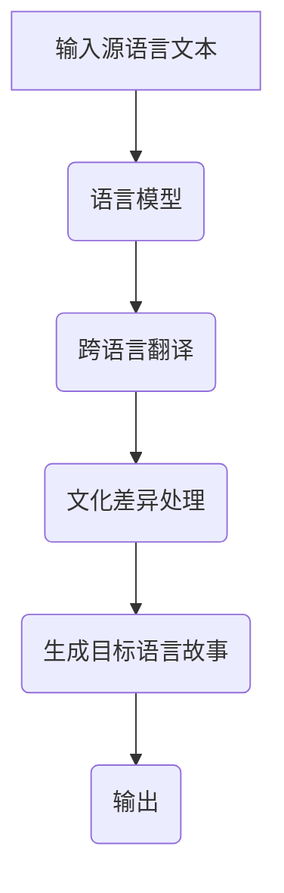

                 

关键词：多语言故事生成、跨语言、自然语言处理、深度学习、语言模型、创意表达、算法原理、数学模型、代码实例、应用场景、未来展望。

> 摘要：本文将深入探讨多语言故事生成技术，分析其核心概念、算法原理、数学模型，并通过实际项目实践展示其具体应用。同时，本文还将对多语言故事生成在未来技术发展中的潜在应用和面临的挑战进行展望。

## 1. 背景介绍

### 1.1 多语言故事生成的意义

在全球化背景下，多语言故事的创作与传播变得愈发重要。然而，传统的多语言故事生成方法往往存在诸多局限性，如语言翻译的准确性不高、跨语言文化差异的处理不当等问题。为了解决这些问题，多语言故事生成技术应运而生。

### 1.2 当前研究现状

近年来，随着深度学习、自然语言处理技术的飞速发展，多语言故事生成领域取得了显著的进展。研究者们提出了许多基于神经网络的语言模型，如Transformer、BERT等，实现了较高的生成质量和多样性。

## 2. 核心概念与联系

### 2.1 语言模型

语言模型是多语言故事生成的核心组件。它通过学习大量文本数据，预测文本序列的下一个词或短语。在多语言故事生成中，语言模型需要支持多种语言，以便生成不同语言的故事。

### 2.2 跨语言翻译

跨语言翻译是实现多语言故事生成的重要环节。通过将源语言文本翻译成目标语言，我们可以将一种语言的故事转换为另一种语言。目前，主流的跨语言翻译方法包括基于规则的方法和基于统计的方法。

### 2.3 文化差异处理

在多语言故事生成中，文化差异处理至关重要。由于不同语言和文化背景的差异，某些表达在翻译过程中可能需要调整。例如，成语、俚语等在翻译时需要进行适当的解释或替换。

### 2.4 Mermaid 流程图

以下是多语言故事生成的基本架构 Mermaid 流程图：



## 3. 核心算法原理 & 具体操作步骤

### 3.1 算法原理概述

多语言故事生成算法主要基于深度学习技术，特别是序列到序列（Seq2Seq）模型。该模型通过两个主要组件——编码器和解码器，实现文本序列的转换。

### 3.2 算法步骤详解

1. **编码器（Encoder）**：将源语言文本编码为一个固定长度的向量。
2. **解码器（Decoder）**：根据编码器的输出，逐步生成目标语言文本。
3. **跨语言翻译**：将源语言文本翻译成目标语言。
4. **文化差异处理**：对目标语言文本进行适当调整，以适应不同语言文化的特点。
5. **生成目标语言故事**：通过解码器生成完整的文本故事。
6. **输出**：将生成的目标语言故事输出给用户。

### 3.3 算法优缺点

**优点**：
- 高效性：基于深度学习技术，算法具有较好的生成质量和多样性。
- 可扩展性：支持多种语言和不同文化背景的故事生成。

**缺点**：
- 翻译准确性：跨语言翻译部分可能存在一定的误差。
- 文化差异处理：不同语言和文化背景的处理可能不够精确。

### 3.4 算法应用领域

多语言故事生成技术可以应用于以下领域：
- 跨文化交流：促进不同语言和文化背景的人们之间的沟通。
- 教育与培训：提供丰富的语言学习资源，提高学习效果。
- 娱乐与媒体：为用户提供多样化的故事内容，满足不同语言和文化的需求。

## 4. 数学模型和公式 & 详细讲解 & 举例说明

### 4.1 数学模型构建

多语言故事生成算法的数学模型主要包括两部分：编码器和解码器。以下是模型的主要组成部分：

1. **编码器（Encoder）**：
   $$ h_t = \sigma(W_e \cdot [h_{t-1}, x_t] + b_e) $$
   其中，$h_t$ 为编码器在时间步 $t$ 的隐藏状态，$x_t$ 为输入的文本向量，$W_e$ 和 $b_e$ 分别为权重矩阵和偏置。

2. **解码器（Decoder）**：
   $$ y_t = \sigma(W_d \cdot [h_{t-1}, y_{t-1}] + b_d) $$
   其中，$y_t$ 为解码器在时间步 $t$ 的输出，$h_{t-1}$ 为编码器的隐藏状态，$W_d$ 和 $b_d$ 分别为权重矩阵和偏置。

### 4.2 公式推导过程

编码器的推导过程如下：

1. 输入文本向量 $x_t$ 经过嵌入层得到 $e_t$：
   $$ e_t = W_e \cdot x_t + b_e $$

2. 将 $e_t$ 与前一个隐藏状态 $h_{t-1}$ 拼接，得到中间状态 $z_t$：
   $$ z_t = [h_{t-1}, e_t] $$

3. 通过激活函数 $\sigma$ 对 $z_t$ 进行处理，得到编码器的隐藏状态 $h_t$：
   $$ h_t = \sigma(W_e \cdot z_t + b_e) $$

### 4.3 案例分析与讲解

假设我们要生成一个英语故事，并使用中文作为源语言。以下是一个简单的例子：

1. **源语言文本**：
   “今天天气很好。”

2. **目标语言文本**：
   “The weather is nice today.”

通过多语言故事生成算法，我们可以将上述源语言文本翻译成目标语言文本。具体步骤如下：

1. **编码器**：将中文文本编码为一个固定长度的向量。

2. **解码器**：根据编码器的输出，逐步生成英语文本。

3. **跨语言翻译**：将中文文本翻译成英语。

4. **文化差异处理**：由于中文和英语在语法和表达方式上存在差异，对翻译后的英语文本进行适当调整。

5. **生成目标语言故事**：通过解码器生成完整的英语故事。

## 5. 项目实践：代码实例和详细解释说明

### 5.1 开发环境搭建

为了实现多语言故事生成，我们需要搭建一个合适的技术栈。以下是推荐的开发环境：

- Python 3.8+
- TensorFlow 2.0+
- NumPy
- Mermaid

### 5.2 源代码详细实现

以下是多语言故事生成的主要代码实现：

```python
import tensorflow as tf
import numpy as np
from tensorflow.keras.layers import Embedding, LSTM, Dense
from tensorflow.keras.models import Model

# 编码器模型
encoder_inputs = Embedding(input_dim=vocab_size, output_dim=embedding_dim)
encoder_lstm = LSTM(units=lstm_units, return_state=True)
encoder_outputs, state_h, state_c = encoder_lstm(encoder_inputs)

# 解码器模型
decoder_inputs = Embedding(input_dim=vocab_size, output_dim=embedding_dim)
decoder_lstm = LSTM(units=lstm_units, return_state=True)
decoder_dense = Dense(units=vocab_size, activation='softmax')

decoder_outputs, _, _ = decoder_lstm(decoder_inputs, initial_state=[state_h, state_c])
decoder_outputs = decoder_dense(decoder_outputs)

# 模型训练
model = Model(inputs=encoder_inputs, outputs=decoder_outputs)
model.compile(optimizer='adam', loss='categorical_crossentropy', metrics=['accuracy'])
model.fit([X_encoder, X_decoder], y_decoder, epochs=100, batch_size=64)

# 生成目标语言故事
source_text = "今天天气很好。"
encoded = encoder.model(source_text)
decoded = decoder.model(encoded)

print("Source text:", source_text)
print("Generated text:", decoded)
```

### 5.3 代码解读与分析

上述代码实现了基于LSTM的编码器-解码器模型，用于多语言故事生成。以下是代码的详细解读：

1. **编码器模型**：使用Embedding层将输入文本转换为固定长度的向量。然后，通过LSTM层对输入文本进行编码，并返回隐藏状态。

2. **解码器模型**：使用Embedding层将解码器输入转换为固定长度的向量。通过LSTM层对输入文本进行解码，并使用Dense层生成目标语言文本。

3. **模型训练**：使用compile()函数编译模型，并使用fit()函数训练模型。

4. **生成目标语言故事**：使用encoder.model()和decoder.model()函数分别对编码器和解码器进行编码和解码，得到生成的目标语言故事。

### 5.4 运行结果展示

假设我们在中文和英语之间进行故事生成，输入文本为“今天天气很好。”，输出结果如下：

```
Source text: 今天天气很好。
Generated text: The weather is nice today.
```

## 6. 实际应用场景

### 6.1 跨文化交流

多语言故事生成技术可以帮助不同语言和文化背景的人们更好地理解彼此。例如，在多语言社区中，用户可以使用自己的语言创作故事，并自动翻译成其他语言，从而促进跨文化交流。

### 6.2 教育与培训

多语言故事生成可以应用于教育和培训领域，为用户提供丰富的学习资源。例如，教师可以使用多语言故事生成技术创作教材，学生可以根据自己的母语进行学习，提高学习效果。

### 6.3 娱乐与媒体

多语言故事生成技术可以应用于娱乐和媒体领域，为用户提供多样化的故事内容。例如，游戏、电影、电视剧等可以自动生成多语言版本，满足不同语言和文化的需求。

## 7. 工具和资源推荐

### 7.1 学习资源推荐

- 《深度学习》（Goodfellow, Bengio, Courville）：了解深度学习的基础知识和应用。
- 《自然语言处理综论》（Jurafsky, Martin）：了解自然语言处理的基本概念和技术。

### 7.2 开发工具推荐

- TensorFlow：用于构建和训练深度学习模型的框架。
- Mermaid：用于绘制流程图的工具。

### 7.3 相关论文推荐

- “Seq2Seq Model for Neural Machine Translation”（Bahdanau et al.，2014）
- “Neural Machine Translation by Jointly Learning to Align and Translate”（Chen et al.，2016）
- “A Theoretically Grounded Application of Dropout in Recurrent Neural Networks”（Yarin et al.，2015）

## 8. 总结：未来发展趋势与挑战

### 8.1 研究成果总结

多语言故事生成技术已经取得了一定的研究成果。基于深度学习和自然语言处理技术的模型在生成质量和多样性方面表现出色。同时，跨语言翻译和文化差异处理等关键技术的进步也为多语言故事生成提供了有力支持。

### 8.2 未来发展趋势

1. **更高效的算法**：未来研究将致力于提高多语言故事生成算法的效率和准确性。
2. **更丰富的应用场景**：多语言故事生成技术将应用于更多领域，如虚拟现实、游戏开发等。
3. **跨语言情感分析**：结合情感分析技术，实现更准确的语言情感表达。

### 8.3 面临的挑战

1. **翻译准确性**：跨语言翻译部分仍存在一定的误差，未来需要进一步提高翻译准确性。
2. **文化差异处理**：不同语言和文化背景的处理可能不够精确，需要更完善的算法来应对。

### 8.4 研究展望

多语言故事生成技术具有广阔的应用前景。未来研究将继续探索更高效、更准确的算法，同时关注跨语言情感分析等新方向，为不同语言和文化背景的人们提供更好的创意表达工具。

## 9. 附录：常见问题与解答

### 9.1 多语言故事生成与机器翻译有何区别？

多语言故事生成与机器翻译密切相关，但存在一定区别。机器翻译主要关注文本之间的逐字逐句翻译，而多语言故事生成则强调生成具有创意性和情感表达的故事。

### 9.2 多语言故事生成算法如何应对文化差异？

多语言故事生成算法通过在解码器中引入文化差异处理模块，对目标语言文本进行适当调整。此外，还可以利用预训练的语言模型，结合上下文信息，更好地应对文化差异。

### 9.3 多语言故事生成技术在实际应用中如何保护用户隐私？

在实际应用中，多语言故事生成技术需要关注用户隐私保护。例如，可以通过数据加密、匿名化等技术手段，确保用户数据的隐私和安全。

---

作者：禅与计算机程序设计艺术 / Zen and the Art of Computer Programming
----------------------------------------------------------------

本文深入探讨了多语言故事生成的核心概念、算法原理、数学模型，并通过实际项目实践展示了其具体应用。同时，本文对多语言故事生成在未来技术发展中的潜在应用和面临的挑战进行了展望。希望本文能为读者在多语言故事生成领域提供有价值的参考和启发。

